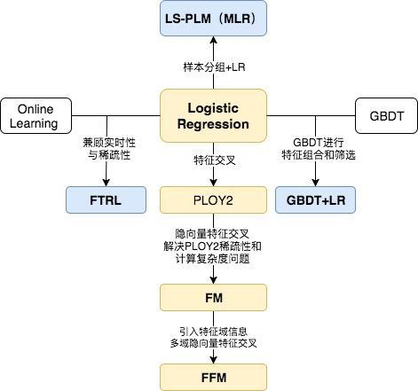
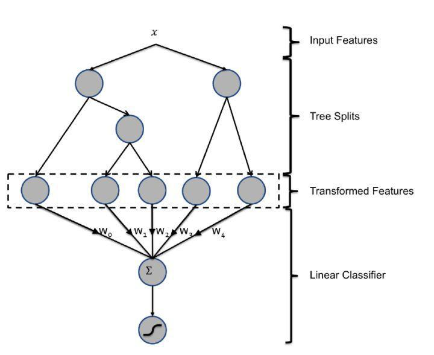
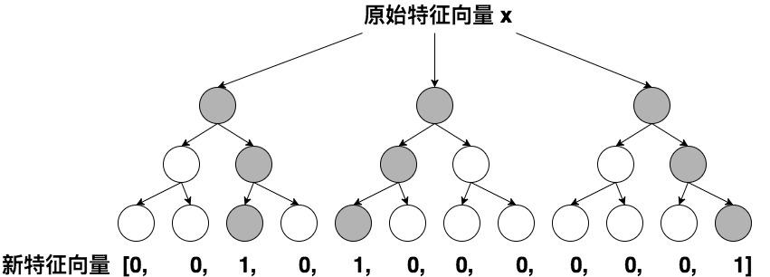
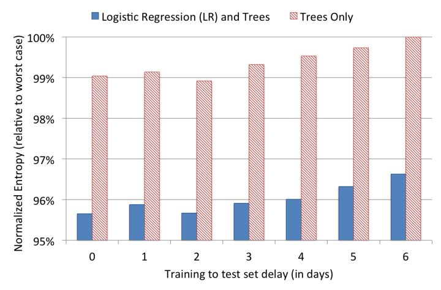
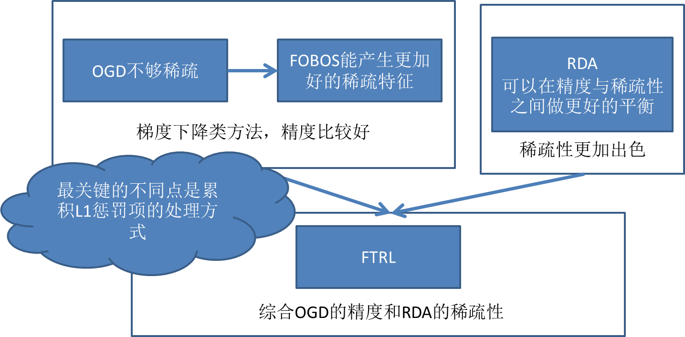
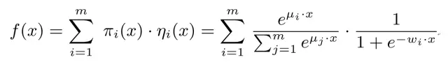
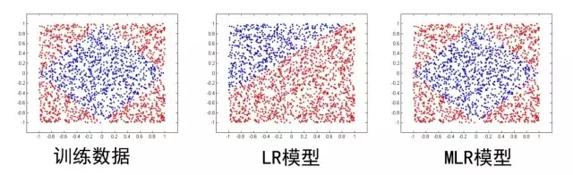

## 盘点前深度学习时代阿里、谷歌、Facebook的CTR预估模型  

> 作者: 王喆 ​  
> 发布日期: 2019 年 4 月 2 日  

> 本文是王喆在 AI 前线 开设的原创技术专栏“深度学习 CTR 预估模型实践”的第三篇文章（以下“深度学习 CTR 预估模型实践”简称“深度 CTR 模型”）。回顾王喆老师过往精彩文章：[《重读 Youtube 深度学习推荐系统论文，字字珠玑，惊为神文》](https://mp.weixin.qq.com/s?__biz=MzU1NDA4NjU2MA==&mid=2247494669&idx=2&sn=b1ca666f647373b0de4be5da388e53bc&chksm=fbea55c2cc9ddcd4f909dd2ea65102d9e0637857dac813d35f71229d0c897a435077c987418f&scene=21#wechat_redirect)、[《YouTube 深度学习推荐系统的十大工程问题》](https://mp.weixin.qq.com/s?__biz=MzU1NDA4NjU2MA==&mid=2247494791&idx=2&sn=643df72a5116807136e07a82db83b9cd&chksm=fbea5548cc9ddc5e07baffe20d23003227371c9a8f2dd515e60345a9f1775d079082bcbf2976&scene=21#wechat_redirect)。

在上篇专栏文章[《前深度学习时代 CTR 预估模型的演化之路——从 LR 到 FFM》](https://mp.weixin.qq.com/s?__biz=MzU1NDA4NjU2MA==&mid=2247495766&idx=2&sn=edc5f01d009b8bdbd7de9d9023a7c7d6&chksm=fbea4999cc9dc08fd342fd313cc703cc822e244d713db4aa11532e26d5c2d92f54f572e9b705&token=67592734&lang=zh_CN#rd)中，我们沿着特征交叉这条发展路线，回顾了从 LR 到 POLY2，FM，再到 FFM 的 CTR 模型演化过程。但任何问题的观察角度都不是唯一的，CTR 模型更是如此，本文将继续探索前深度学习时代的 CTR 模型，从特征工程模型化的角度回顾 Facebook 的 CTR 模型——GBDT+LR，从时效性的角度学习 Google 是如何使用 FTRL 解决模型 online learning 问题的，最后从样本聚类的动机出发介绍阿里的 LS-PLM CTR 模型。

在介绍细节之前，我们再次回到前深度学习时代的 CTR 模型关系图，熟悉各个模型在演化过程中的位置，其中黄色的部分是上篇专栏文章介绍的模型，蓝色部分将是这篇文章的主要内容。

传统 CTR 模型演化关系图

### GBDT+LR——特征工程模型化的开端

上篇文章介绍的 FFM 模型采用引入特征域的方式增强了模型的表达能力，但无论如何，FFM 只能够做二阶的特征交叉，如果要继续提高特征交叉的维度，不可避免的会发生组合爆炸和计算复杂度过高的情况。那么有没有其他的方法可以有效的处理高维特征组合和筛选的问题？2014 年，Facebook 提出了基于 GBDT+LR 组合模型的解决方案。

简而言之，Facebook 提出了一种利用 GBDT 自动进行特征筛选和组合，进而生成新的离散特征向量，再把该特征向量当作 LR 模型输入，预估 CTR 的模型结构。

GBDT+LR 的模型结构

需要强调的是，用 GBDT 构建特征工程，和利用 LR 预估 CTR 两步是独立训练的。所以自然不存在如何将 LR 的梯度回传到 GBDT 这类复杂的问题，而利用 LR 预估 CTR 的过程在上篇文章中已经有所介绍，在此不再赘述，下面着重讲解如何利用 GBDT 构建新的特征向量。

大家知道，GBDT 是由多棵回归树组成的树林，后一棵树利用前面树林的结果与真实结果的残差做为拟合目标。每棵树生成的过程是一棵标准的回归树生成过程，因此每个节点的分裂是一个自然的特征选择的过程，而多层节点的结构自然进行了有效的特征组合，也就非常高效的解决了过去非常棘手的特征选择和特征组合的问题。

利用训练集训练好 GBDT 模型之后，就可以利用该模型完成从原始特征向量到新的离散型特征向量的转化。具体过程是这样的，一个训练样本在输入 GBDT 的某一子树后，会根据每个节点的规则最终落入某一叶子节点，那么我们把该叶子节点置为 1，其他叶子节点置为 0，所有叶子节点组成的向量即形成了该棵树的特征向量，把 GBDT 所有子树的特征向量连接起来，即形成了后续 LR 输入的特征向量。

GBDT 生成特征向量的过程

举例来说，如上图所示，GBDT 由三颗子树构成，每个子树有 4 个叶子节点，一个训练样本进来后，先后落入“子树 1”的第 3 个叶节点中，那么特征向量就是 \[0,0,1,0\]，“子树 2”的第 1 个叶节点，特征向量为 \[1,0,0,0\]，“子树 3”的第 4 个叶节点，特征向量为 \[0,0,0,1\]，最后连接所有特征向量，形成最终的特征向量 \[0,0,1,0,1,0,0,0,0,0,0,1\]。

由于决策树的结构特点，事实上，决策树的深度就决定了特征交叉的维度。如果决策树的深度为 4，通过三次节点分裂，最终的叶节点实际上是进行了 3 阶特征组合后的结果，如此强的特征组合能力显然是 FM 系的模型不具备的。但由于 GBDT 容易产生过拟合，以及 GBDT 这种特征转换方式实际上丢失了大量特征的数值信息，因此我们不能简单说 GBDT 由于特征交叉的能力更强，效果就比 FFM 好，在模型的选择和调试上，永远都是多种因素综合作用的结果。

GBDT+LR 比 FM 重要的意义在于，它大大推进了特征工程模型化这一重要趋势，某种意义上来说，之后深度学习的各类网络结构，以及 embedding 技术的应用，都是这一趋势的延续。

在之前所有的模型演化过程中，实际上是从特征工程这一角度来推演的。接下来，我们从时效性这个角度出发，看一看模型的更新频率是如何影响模型效果的。

模型实效性实验

在模型更新这个问题上，我们的直觉是模型的训练时间和 serving 时间之间的间隔越短，模型的效果越好，为了证明这一点，facebook 的工程师还是做了一组实效性的实验（如上图），在结束模型的训练之后，观察了其后 6 天的模型 loss（这里采用 normalized entropy 作为 loss）。可以看出，模型的 loss 在第 0 天之后就有所上升，特别是第 2 天过后显著上升。因此 daily update 的模型相比 weekly update 的模型效果肯定是有大幅提升的。

如果说日更新的模型比周更新的模型的效果提升显著，我们有没有方法实时引入模型的效果反馈数据，做到模型的实时更新从而进一步提升 CTR 模型的效果呢？Google 2013 年应用的 FTRL 给了我们答案。

### FTRL——天下武功，唯快不破

FTRL 的全称是 Follow-the-regularized-Leader，是一种在线实时训练模型的方法，Google 在 2010 年提出了 FTRL 的思路，2013 年实现了 FTRL 的工程化，之后快速成为 online learning 的主流方法。与模型演化图中的其他模型不同，FTRL 本质上是模型的训练方法。虽然 Google 的工程化方案是针对 LR 模型的，但理论上 FTRL 可以应用在 FM，NN 等任何通过梯度下降训练的模型上。

为了更清楚的认识 FTRL，这里对梯度下降方法做一个简要的介绍。从训练样本的规模角度来说，梯度下降可以分为：batch，mini-batch，SGD（随机梯度下降）三种，batch 方法每次都使用全量训练样本计算本次迭代的梯度方向，mini-batch 使用一小部分样本进行迭代，而 SGD 每次只利用一个样本计算梯度。对于 online learning 来说，为了进行实时得将最新产生的样本反馈到模型中，SGD 无疑是最合适的训练方式。

但 SGD 对于互利网广告和推荐的场景来说，有比较大的缺陷，就是难以产生稀疏解。为什么稀疏解对于 CTR 模型如此重要呢？

之前我们已经多次强调，由于 one hot 等 id 类特征处理方法导致广告和推荐场景下的样本特征向量极度稀疏，维度极高，动辄达到百万、千万量级。为了不割裂特征选择和模型训练两个步骤，如果能够在保证精度的前提下尽可能多的让模型的参数权重为 0，那么我们就可以自动过滤掉这些权重为 0 的特征，生成一个“轻量级”的模型。“轻量级”的模型不仅会使样本部署的成本大大降低，而且可以极大降低模型 inference 的计算延迟。这就是模型稀疏性的重要之处。

而 SGD 由于每次迭代只选取一个样本，梯度下降的方向虽然总体朝向全局最优解，但微观上的运动的过程呈现布朗运动的形式，这就导致 SGD 会使几乎所有特征的权重非零。即使加入 L1 正则化项，由于 CPU 浮点运算的结果很难精确的得到 0 的结果，也不会完全解决 SGD 稀疏性差的问题。就是在这样的前提下，FTRL 几乎完美地解决了模型精度和模型稀疏性兼顾的训练问题。

FTRL 的发展过程

但 FTRL 的提出也并不是一蹴而就的。如上图所示，FTRL 的提出经历了下面几个关键的过程：

1. 从最近简单的 SGD 到 OGD（online gradient descent），OGD 通过引入 L1 正则化简单解决稀疏性问题；

2. 从 OGD 到截断梯度法，通过暴力截断小数值梯度的方法保证模型的稀疏性，但损失了梯度下降的效率和精度；

3. FOBOS（Forward-Backward Splitting），google 和伯克利对 OGD 做进一步改进，09 年提出了保证精度并兼顾稀疏性的 FOBOS 方法；

4. RDA：微软抛弃了梯度下降这条路，独辟蹊径提出了正则对偶平均来进行 online learning 的方法，其特点是稀疏性极佳，但损失了部分精度。

5. Google 综合 FOBOS 在精度上的优势和 RDA 在稀疏性上的优势，将二者的形式进行了进一步统一，提出并应用 FTRL，使 FOBOS 和 RDA 均成为了 FTRL 在特定条件下的特殊形式。

FTRL 的算法细节对于初学者来说仍然是晦涩的，建议非专业的同学仅了解其特点和应用场景即可。对算法的数学形式和实现细节感兴趣的同学，我强烈推荐微博 冯扬 写的“在线最优化求解”一文，希望能够帮助大家进一步熟悉 FTRL 的技术细节。

### LS-PLM——阿里曾经的主流 CTR 模型

本文的第三个模型，我们从样本 pattern 本身来入手，介绍阿里的的 LS-PLM（Large Scale Piece-wise Linear Model），它的另一个更广为人知的名字是 MLR（Mixed Logistic Regression）。MLR 模型虽然在 2017 年才公之于众，但其早在 2012 年就是阿里主流的 CTR 模型，并且在深度学习模型提出之前长时间应用于阿里的各类广告场景。

本质上，MLR 可以看做是对 LR 的自然推广，它在 LR 的基础上采用分而治之的思路，先对样本进行分片，再在样本分片中应用 LR 进行 CTR 预估。在 LR 的基础上加入聚类的思想，其动机其实来源于对计算广告领域样本特点的观察 。

举例来说，如果 CTR 模型要预估的是女性受众点击女装广告的 CTR，显然我们并不希望把男性用户点击数码类产品的样本数据也考虑进来，因为这样的样本不仅对于女性购买女装这样的广告场景毫无相关性，甚至会在模型训练过程中扰乱相关特征的权重。为了让 CTR 模型对不同用户群体，不用用户场景更有针对性，其实理想的方法是先对全量样本进行聚类，再对每个分类施以 LR 模型进行 CTR 预估。MLR 的实现思路就是由该动机产生的。

MLR 目标函数的数学形式如上式，首先用聚类函数π对样本进行分类（这里的π采用了 softmax 函数，对样本进行多分类），再用 LR 模型计算样本在分片中具体的 CTR，然后将二者进行相乘后加和。

其中超参数分片数 m 可以较好地平衡模型的拟合与推广能力。当 m=1 时 MLR 就退化为普通的 LR，m 越大模型的拟合能力越强，但是模型参数规模随 m 线性增长，相应所需的训练样本也随之增长。在实践中，阿里给出了 m 的经验值为 12。

下图中 MLR 模型用 4 个分片可以完美地拟合出数据中的菱形分类面。

MLR 算法适合于工业级的广告、推荐等大规模稀疏数据场景问题。主要是由于表达能力强、稀疏性高等两个优势：

1. 端到端的非线性学习：从模型端自动挖掘数据中蕴藏的非线性模式，省去了大量的人工特征设计，这使得 MLR 算法可以端到端地完成训练，在不同场景中的迁移和应用非常轻松。

2. 稀疏性：MLR 在建模时引入了 L1 和 L2,1 范数，可以使得最终训练出来的模型具有较高的稀疏度，模型的学习和在线预测性能更好。

如果我们用深度学习的眼光来看待 MLR 这个模型，其在结构上已经很接近由输入层、单隐层、输出层组成的神经网络。所以某种意义上说，MLR 也在用自己的方式逐渐逼近深度学习的大门了。

### 深度学习 CTR 模型的前夜

2010 年 FM 被提出，特征交叉的概念被引入 CTR 模型；2012 年 MLR 在阿里大规模应用，其结构十分接近三层神经网络；2014 年 Facebook 用 GBDT 处理特征，揭开了特征工程模型化的篇章。这些概念都将在深度学习 CTR 模型中继续应用，持续发光。

另一边，Alex Krizhevsky 2012 年提出了引爆整个深度学习浪潮的 AlexNet，深度学习的大幕正式拉开，其应用逐渐从图像扩展到语音，再到 NLP 领域，推荐和广告也必然会紧随其后，投入深度学习的大潮之中。

2016 年，随着 FNN、Deep&Wide、Deep crossing 等一大批优秀的 CTR 模型框架的提出，深度学习 CTR 模型逐渐席卷了推荐和广告领域，成为新一代 CTR 模型当之无愧的主流。下一篇文章，我们将继续探讨深度学习 CTR 模型，从模型演化的角度揭开所有主流深度学习 CTR 模型之间的关系和每个模型的特点，期待继续与你一同学习讨论。

**《深度学习 CTR 预估模型实践》专栏内容回顾：**

1. [深度学习 CTR 预估模型凭什么成为互联网增长的关键？](https://mp.weixin.qq.com/s?__biz=MzU1NDA4NjU2MA==&mid=2247495560&idx=2&sn=094e3a79085898ce881f64e6232fcdd6&chksm=fbea5647cc9ddf5180be52c2e26f08a4c3f7d5ca0f45f0e72bfbe80db69b73853b8c737ea187&token=1198573375&lang=zh_CN&scene=21#wechat_redirect)

2. [前深度学习时代 CTR 预估模型的演化之路——从 LR 到 FFM](https://mp.weixin.qq.com/s?__biz=MzU1NDA4NjU2MA==&mid=2247495766&idx=2&sn=edc5f01d009b8bdbd7de9d9023a7c7d6&chksm=fbea4999cc9dc08fd342fd313cc703cc822e244d713db4aa11532e26d5c2d92f54f572e9b705&token=67592734&lang=zh_CN#rd)

### 作者介绍

王喆，毕业于清华大学计算机系，现在美国最大的 smartTV 公司 Roku 任 senior machine learning engineer，曾任 hulu senior research SDE，7 年计算广告、推荐系统领域业界经验，相关专利 3 项，论文 7 篇，《机器学习实践指南》、《百面机器学习》作者之一。知乎专栏 / 微信公众号：王喆的机器学习笔记。

更多内容，请关注 AI 前线

