## 是时候放弃TensorFlow集群，拥抱Horovod了  

> 我是轻墨  
> 作者: AI前线  
> 发布日期: 2019-04-30  


 作者 | 轻墨  来源 | 授权转载自微信公众号“AI研究小院”  编辑 | Natalie  **AI 前线导读：** Horovod 是一套面向 TensorFlow 的分布式训练框架，由 Uber 构建并开源，目前已经运行于 Uber 的 Michelangelo 机器学习即服务平台上。Horovod 能够简化并加速分布式深度学习项目的启动与运行。通过利用消息传递接口（简称 MPI）实现应用环状规约，显著提升 TensorFlow 模型的实用性与性能表现。

本文作者在实践中发现，TensorFlow 集群存在诸多缺点，如概念太多、学习曲线陡峭、修改的代码量大、性能损失较大等，而 Horovod 则让深度学习变得更加美好，随着规模增大，Horovod 性能基本是线性增加的，损失远小于 TensorFlow。

**更多优质内容请关注微信公众号“AI 前线”（ID：ai-front）**

当数据较多或者模型较大时，为提高机器学习模型训练效率，一般采用多 GPU 的分布式训练。

按照并行方式，分布式训练一般分为数据并行和模型并行两种：

* 模型并行：分布式系统中的不同 GPU 负责网络模型的不同部分。例如，神经网络模型的不同网络层被分配到不同的 GPU，或者同一层内部的不同参数被分配到不同 GPU；

* 数据并行：不同的 GPU 有同一个模型的多个副本，每个 GPU 分配到不同的数据，然后将所有 GPU 的计算结果按照某种方式合并。

注意，上述中的不用 GPU 可以是同一台机上的多个 GPU，也可以是不用机上的 GPU。

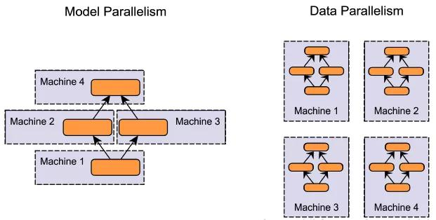

注：图中的 Machine 其实就是 GPU，当然也可以包含 CPU，但深度学习很少采用 CPU 训练

当然也有数据并行和模型并行的混合模式。

因为模型并行各个部分存在一定的依赖，规模伸缩性差（意思是不能随意增加 GPU 的数量），在实际训练中用的不多。而数据并行，则各部分独立，规模伸缩性好，实际训练中更为常用，提速效果也更好。

数据并行会涉及到各个 GPU 之间同步模型参数，一般分为同步更新和异步更新。同步更新要等到所有 GPU 的梯度计算完成，再统一计算新权值，然后所有 GPU 同步新值后，才进行下一轮计算。异步更新，每个 GPU 梯度计算完后，无需等待其他 GPU 的梯度计算（有时可以设置需要等待的梯度个数），可立即更新整体权值，然后同步此权值，即可进行下一轮计算。同步更新有等待，异步更新基本没有等待，但异步更新涉及到梯度过时等更复杂问题。

在实际应用中，单机多卡的同步式数据并行是最常用的，在论文中最常见的训练方式是单机八卡。数据再多时，一般就需要多机多卡了。

无论是单机多卡，还是多机多卡，均是分布式训练，在 Horovod 出现之前，使用 TensorFlow，一般只有官方推荐的集群训练方式。

**可是 TensorFlow 的集群训练，用起来并不轻松。**

TensorFlow 集群的缺点 1\. 概念多，学习曲线陡峭

TensorFlow 的集群采用的是 Parameter Server 架构，因此引入了比较多复杂概念，罗列如下：

```
server
client
master
cluster
parameter server
worker
job
task
replica_device_setter
master service
worker service
clone
```

复制代码涉及到的函数：

```
tf.train.Server
tf.train.Supervisor
tf.train.SessionManager
tf.train.ClusterSpec
tf.train.replica_device_setter
tf.train.MonitoredTrainingSession
tf.train.MonitoredSession
tf.train.SingularMonitoredSession
tf.train.Scaffold
tf.train.SessionCreator
tf.train.ChiefSessionCreator
tf.train.WorkerSessionCreator
```

复制代码我反复研究过多次，还是没有彻底弄清楚 server、client、master、master service、worker service、clone、session 之间的关系。

大致是，在 client 中创建 server 实例，session 与 server 一一对应，server 内含 master service 和 worker service 两个服务，master service 负责与外界通讯，比如 sess.run 一般都是告诉 server 的 master service 要开始工作了，server 的 master service 通知同一个 server 的 worker service 去干活，worker service 调动 GPU 运算，完成后，返回结果给 master service，做权值更新，如果是多机多卡的分布式，Parameter Server 与 master service 之间做梯度传递和权值同步。（参考 https://stackoverflow.com/questions/38732502/tensorflow-master-and-worker-service）

2\. 修改的代码量大

如果想把单机单卡的模型，移植到多机多卡，涉及的代码量是以天记的，慢的话甚至需要一周。

3\. 需要多台机子跑不同的脚本

TensorFlow 集群是采用 Parameter Server 架构的，要想跑多机多卡的集群，每个机子都要启动一个 client，即跑一个脚本，来启动训练，100 个机子，人就要崩溃了。

4\. PS 和 Worker 的比例不好选取

TensorFlow 集群要将服务器分为 PS 和 Worker 两种 job 类型，PS 设置多少性能最近并没有确定的计算公式。

5\. 性能损失较大

TensorFlow 的集群性能并不好，当超过一定规模时，性能甚至会掉到理想性能的一半以下。

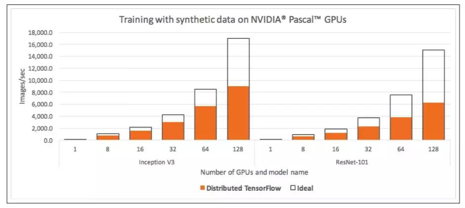

Horovod

**由于 TensorFlow 集群太不友好，业内也一直在尝试新的集群方案。**

2017 年 Facebook 发布了《Accurate, large minibatch SGD: Training ImageNet in 1 hour 》验证了大数据并行的高效性，同年百度发表了《Bringing HPC techniques to deep learning 》，验证了全新的梯度同步和权值更新算法的可行性。受这两篇论文的启发，Uber 开发了 Horovod 集群方案。

约定如下：

网络带宽记为：B（单位 Mb/s），模型总参数数据量记为：D（单位 Mb），总服务器数量记为：n，参数服务器数量记为：n\_p（其中有 n= n\_p+ n\_w），worker 服务器数量记为：n\_w（其中有 n= n\_p+ n\_w），单服务器计算一次耗时记为：T\_0。

梯度同步和权值更新算法 1） Parameter Server 架构

TensorFlow 的集群架构是 Parameter Server 架构，数据的传导模型如下图。

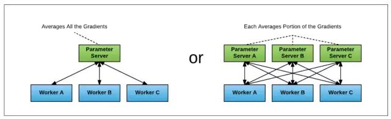

则可以计算出，Parameter Server 架构的集群方案，总耗时：

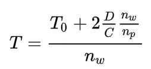

可以看出 T 与总节点数 n 基本成线性关系，但不同的参数服务器和 woker 服务器分配方案，总性能也将不同。

假设，e 表示 worker 服务器占比，即 e=n\_w/n，则可以计算出最优的 e 值为：

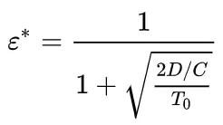

可以看出，最优 worker 服务器占比与模型大小、网络带宽、单机运行时长都有关系，并不是一个一眼能最优值的超参数。

2）Horovod 的 ring-allreduce 算法

百度 2017 年发表的《Bringing HPC techniques to deep learning 》中，采用了全新的梯度同步和权值同步算法，叫做 ring-allreduce。此种算法各个节点之间只与相邻的两个节点通信，并不需要参数服务器。因此，所有节点都参与计算也参与存储。

一次权重更新，主要包含两个过程：

1）累计梯度

将所有梯度分为 n 个片段，每次只与相邻节点传递 1 个片段的梯度，n-1 次后，每一片段的梯度都完成了所有节点这一片段梯度的累计，但不用片段的累计值分布在不同节点上。如下图的第 2、第 3 步；

2）将累计后的梯度分发到所有节点

将第一步累计的梯度再次通过 n-1 次的相互交换后，所有节点的梯度完成同步。如下图的第 4、第 5 步。再平均后，更新权重，就完成了所有节点权重的更新。

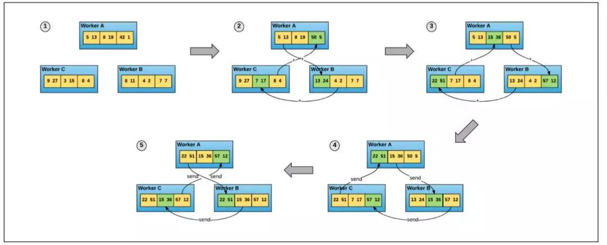

可以计算出 ring-allreduce 算法的总耗时为：

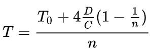

可以看出，总耗时基本与总节点数 n 成线性关系（n 较大时，1/n 基本为 0）。

Horovod 的梯度同步和权值同步就采用了 ring-allreduce 算法。

概念

Horovod 的数据传递是基于 MPI，因此其涉及的概念也是 MPI 中的概念。以 4 个服务器，每个服务器 4 个 GPU 为例，

* size 进程数量，也即所有 GPU 数量，为 16

* rank 进程的唯一 ID，0-15

* local rank，每一个 server 中的进程的本地唯一 ID，0-3

* allreduce 累加所有数据，并同步到所有节点的操作，如下图

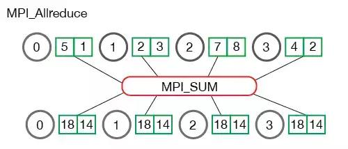

* allgather 收集所有数据，并同步到所有节点的操作，完成后每个节点都包含所有节点的数据，并且这些数据单独存在，如下图。

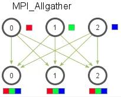

* broadcast 将数据（需要由根节点确认）从一个节点传播到其他所有节点的操作

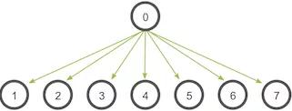

大概就这么多概念，简单清晰。

将单机单卡改为多机多卡

将一个只支持单机单卡的训练脚本修改为支持多机多卡的训练脚本，以 TensorFlow 为例，只需要做如下改动：

```
import tensorflow as tf
import horovod.tensorflow as hvd

### Initialize Horovod
hvd.init()

### Pin GPU to be used to process local rank (one GPU per process)
config = tf.ConfigProto()
config.gpu_options.visible_device_list = str(hvd.local_rank())

### Build model...
loss = ...
opt = tf.train.AdagradOptimizer(0.01 * hvd.size())

### Add Horovod Distributed Optimizer
opt = hvd.DistributedOptimizer(opt)

### Add hook to broadcast variables from rank 0 to all other processes during
### initialization.
hooks = [hvd.BroadcastGlobalVariablesHook(0)]

### Make training operation
train_op = opt.minimize(loss)

### Save checkpoints only on worker 0 to prevent other workers from corrupting them.
checkpoint_dir = '/tmp/train_logs' if hvd.rank() == 0 else None

### The MonitoredTrainingSession takes care of session initialization,
### restoring from a checkpoint, saving to a checkpoint, and closing when done
### or an error occurs.
with tf.train.MonitoredTrainingSession(checkpoint_dir=checkpoint_dir,
config=config,
hooks=hooks) as mon_sess:
while not mon_sess.should_stop():
### Perform synchronous training.
mon_sess.run(train_op)
```

可以看出，改动不大，只需添加 10 行左右的代码，主要分为 6 步：

1）初始化 Horovod

```
hvd.init()
```

2）一个 GPU 与一个进程绑定

```
config = tf.ConfigProto()
config.gpu_options.visible_device_list = str(hvd.local_rank())
```

3）根据总 GPU 数量放大学习率

```
opt = tf.train.AdagradOptimizer(0.01 * hvd.size())
```

因为 BatchSize 会根据 GPU 数量放大，所以学习率也应该放大。

4）使用 hvd.DistributedOptimizer 封装原有的 optimizer

```
opt = hvd.DistributedOptimizer(opt)
```

分布式训练涉及到梯度同步，每一个 GPU 的梯度计算仍然由原有的 optimizer 计算，只是梯度同步由 hvd.DistributedOptimizer 负责。

5）广播初始变量值到所有进程

```
hooks = [hvd.BroadcastGlobalVariablesHook(0)]
```

主要为了确保所有进程变量初始值相同。

6）只在 worker 0 上保存 checkpoint

```
checkpoint_dir = '/tmp/train_logs' if hvd.rank() == 0 else None
```

防止 checkpoint 保存错乱。

Horovod 只是需要改动必要改动的，不涉及 Parameter Server 架构的 device 设置等繁琐的操作。

起训练

在单机 4 卡的机上起训练，只需执行以下命令：

```
horovodrun -np 4 -H localhost:4 python train.py
```

在 4 机，每机 4 卡的机子上起训练，只需在一个机子上执行以下命令即可：

```
horovodrun -np 16 -H server1:4,server2:4,server3:4,server4:4 python train.py
```

注意无论是单机多卡，还是多机多卡，都只需在一个机子上执行一次命令即可，其他机 Horovod 会用 MPI 启动进程和传递数据。

性能对比

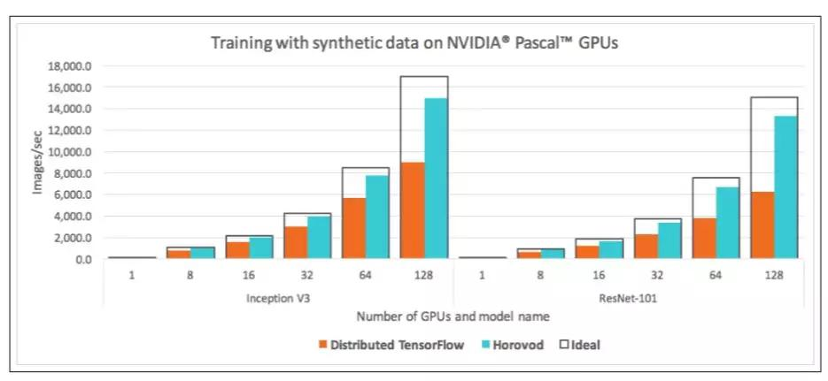

Horovod 随着规模增大，性能损失远小于 TensorFlow，基本是线性增加的。

结    论

用过 TensorFlow 集群的人，会深刻体会到 Horovod 有多好用，感谢百度、Facebook 和 Uber 让深度学习更美好。

不过，也要注意到，Horovod 的分布式貌似只支持同步更新式的数据并行，模型并行和异步更新式的数据并行，我没有尝试过，根据 ring-allreduce 算法可知，应该是不支持的。
