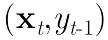

## 小样本学习（Few-shot Learning）综述  

> 原创：  
> 让你更懂AI  
> 作者: PaperWeekly  
> 发布日期: 2019-04-01  

作者丨耿瑞莹、李永彬、黎槟华

单位丨阿里巴巴智能服务事业部小蜜北京团队

分类非常常见，但如果每个类只有几个标注样本，怎么办呢？

笔者所在的阿里巴巴小蜜北京团队就面临这个挑战。我们打造了一个智能对话开发平台——Dialog Studio，以赋能第三方开发者来开发各自业务场景中的任务型对话，其中一个重要功能就是对意图进行分类。大量平台用户在创建一个新对话任务时，并没有大量标注数据，每个意图往往只有几个或十几个样本。

**面对这类问题，有一个专门的机器学习分支——Few-shot Learning 来进行研究和解决。** 过去一年，我们对 Few-shot Learning 进行了系统的梳理和研究，将 Few-shot Learning 和 Capsule Network 融合，提出了 Induction Network，在文本分类上做到了新的 state-of-the-art。

创新总是基于对已有成果的梳理和思考，这篇综述算是一个小结，写出来和大家一起分享，一起讨论。

本文先介绍 Few-shot Learning 定义；由于最近几年 Few-shot Learning 在图像领域的进展领先于在自然语言处理领域，所以第二部分结合其在图像处理领域的研究进展，详细介绍 Few-shot Learning 的三类典型方法及每种方法的代表性模型；接下来介绍在自然语言处理领域的研究进展以及我们对 metric-based 的方法进行系统总结后提出的 few-shot learning framework。

### 问题定义

人类非常擅长通过极少量的样本识别一个新物体，比如小孩子只需要书中的一些图片就可以认识什么是“斑马”，什么是“犀牛”。在人类的快速学习能力的启发下，研究人员希望机器学习模型在学习了一定类别的大量数据后，对于新的类别，只需要少量的样本就能快速学习，这就是 Few-shot Learning 要解决的问题。

**Few-shot Learning  是 Meta Learning 在监督学习领域的应用。**Meta Learning，又称为 learning to learn，在 meta training 阶段将数据集分解为不同的 meta task，去学习类别变化的情况下模型的泛化能力，在 meta testing 阶段，面对全新的类别，不需要变动已有的模型，就可以完成分类。

形式化来说，few-shot 的训练集中包含了很多的类别，每个类别中有多个样本。在训练阶段，会在训练集中随机抽取 C 个类别，每个类别 K 个样本（总共 CK 个数据），构建一个 meta-task，作为模型的支撑集（support set）输入；再从这 C 个类中剩余的数据中抽取一批（batch）样本作为模型的预测对象（batch set）。即要求模型从 C\*K 个数据中学会如何区分这 C 个类别， **这样的任务被称为 C-way K-shot 问题** **。**

训练过程中，每次训练（episode）都会采样得到不同 meta-task，所以总体来看，训练包含了不同的类别组合，这种机制使得模型学会不同 meta-task 中的共性部分，比如如何提取重要特征及比较样本相似等，忘掉 meta-task 中 task 相关部分。通过这种学习机制学到的模型，在面对新的未见过的 meta-task 时，也能较好地进行分类。

图 1 展示的是一个 2-way 5-shot 的示例，可以看到 meta training 阶段构建了一系列 meta-task 来让模型学习如何根据 support set 预测 batch set 中的样本的标签；meta testing 阶段的输入数据的形式与训练阶段一致（2-way 5-shot），但是会在全新的类别上构建 support set 和 batch。

**▲** ** ** 图1：Few-shot Learning示例

### 在图像领域的研究现状

早期的 Few-shot Learning 算法研究多集中在图像领域，如图 2 所示， **Few-shot Learning 模型大致可分为三类：** Mode Based，Metric Based 和 Optimization Based。

**▲** ** ** 图2：Few-shot Learning模型分类

其中 Model Based 方法旨在通过模型结构的设计快速在少量样本上更新参数，直接建立输入 x 和预测值 P 的映射函数；Metric Based 方法通过度量 batch 集中的样本和 support 集中样本的距离，借助最近邻的思想完成分类；Optimization Based 方法认为普通的梯度下降方法难以在 few-shot 场景下拟合，因此通过调整优化方法来完成小样本分类的任务。

**Model Based方法**

**Santoro 等人** \[3\] 提出使用记忆增强的方法来解决 Few-shot Learning 任务。基于记忆的神经网络方法早在 2001 年被证明可以用于 meta-learning。他们通过权重更新来调节 bias，并且通过学习将表达快速缓存到记忆中来调节输出。

然而，利用循环神经网络的内部记忆单元无法扩展到需要对大量新信息进行编码的新任务上。因此，需要让存储在记忆中的表达既要稳定又要是元素粒度访问的，前者是说当需要时就能可靠地访问，后者是说可选择性地访问相关的信息；另外，参数数量不能被内存的大小束缚。神经图灵机（NTMs）和记忆网络就符合这种必要条件。

文章基于神经网络图灵机（NTMs）的思想，因为 NTMs 能通过外部存储（external memory）进行短时记忆，并能通过缓慢权值更新来进行长时记忆，NTMs 可以学习将表达存入记忆的策略，并如何用这些表达来进行预测。由此，文章方法可以快速准确地预测那些只出现过一次的数据。

文章基于 LSTM 等 RNN 的模型，将数据看成序列来训练，在测试时输入新的类的样本进行分类。

具体地，在 t 时刻，模型输入
，也就是在当前时刻预测输入样本的类别，并在下一时刻给出真实的 label，并且添加了 external memory 存储上一次的 x 输入，这使得下一次输入后进行反向传播时，可以让 y \(label\)
 和 x 建立联系，使得之后的 x 能够通过外部记忆获取相关图像进行比对来实现更好的预测。

**▲** ** ** 图3：Memory Augmented Model

_ **Meta Network  **_\[12\] 的快速泛化能力源自其“快速权重”的机制，在训练过程中产生的梯度被用来作为快速权重的生成。模型包含一个 meta learner 和一个 base learner，meta learner 用于学习 meta task 之间的泛化信息，并使用 memory 机制保存这种信息，base learner 用于快速适应新的 task，并和 meta learner 交互产生预测输出。

**Metric Based方法**

如果在 Few-shot Learning 的任务中去训练普通的基于 cross-entropy 的神经网络分类器，那么几乎肯定是会过拟合，因为神经网络分类器中有数以万计的参数需要优化。

相反，很多非参数化的方法（最近邻、K-近邻、Kmeans）是不需要优化参数的，因此可以在 meta-learning 的框架下构造一种可以端到端训练的 few-shot 分类器。该方法是对样本间距离分布进行建模，使得同类样本靠近，异类样本远离。下面介绍相关的方法。

如图 4 所示， **孪生网络（Siamese Network）** \[4\] 通过有监督的方式训练孪生网络来学习，然后重用网络所提取的特征进行 one/few-shot 学习。

**▲** ** ** 图4：Siamese Network

具体的网络是一个双路的神经网络，训练时，通过组合的方式构造不同的成对样本，输入网络进行训练，在最上层通过样本对的距离判断他们是否属于同一个类，并产生对应的概率分布。在预测阶段，孪生网络处理测试样本和支撑集之间每一个样本对，最终预测结果为支撑集上概率最高的类别。

相比孪生网络， **匹配网络（Match Network）** \[2\] 为支撑集和 Batch 集构建不同的编码器，最终分类器的输出是支撑集样本和 query 之间预测值的加权求和。

如图 5 所示，该文章也是在不改变网络模型的前提下能对未知类别生成标签，其主要创新体现在建模过程和训练过程上。对于建模过程的创新，文章提出了基于 memory 和 attention 的 matching nets，使得可以快速学习。

对于训练过程的创新，文章基于传统机器学习的一个原则，即训练和测试是要在同样条件下进行的，提出在训练的时候不断地让网络只看每一类的少量样本，这将和测试的过程是一致的。

具体地，它显式的定义一个基于支撑集的分类器，对于一个新的数据，其分类概率由

与支撑集 S 之间的距离度量得出：

其中 a 是基于距离度量的 attention score：

进一步，支撑集样本 embedding 模型 g 能继续优化，并且支撑集样本应该可以用来修改测试样本的 embedding 模型 f。

这个可以通过如下两个方面来解决，即： **1）基于双向 LSTM 学习训练集的 embedding** ，使得每个支撑样本的 embedding 是其它训练样本的函数； **2）基于 attention-LSTM 来对测试样本 embedding** ，使得每个 Query 样本的 embedding 是支撑集 embedding 的函数。文章称其为 FCE \(fully-conditional embedding\)。

**▲** ** ** 图5：Match Network

**原型网络（Prototype Network）** \[5\] 基于这样的想法：每个类别都存在一个原型表达，该类的原型是 support set 在 embedding 空间中的均值。然后，分类问题变成在 embedding 空间中的最近邻。

如图 6 所示，c1、c2、c3 分别是三个类别的均值中心（称 Prototype），将测试样本 x 进行 embedding 后，与这 3 个中心进行距离计算，从而获得 x 的类别。

**▲** ** ** 图6：Prototype Network

文章采用在 Bregman 散度下的指数族分布的混合密度估计，文章在训练时采用相对测试时更多的类别数，即训练时每个 episodes 采用 20 个类（20 way），而测试对在 5 个类（5 way）中进行，其效果相对训练时也采用 5 way 的提升了 2.5 个百分点。

前面介绍的几个网络结构在最终的距离度量上都使用了固定的度量方式，如 cosine，欧式距离等，这种模型结构下所有的学习过程都发生在样本的 embedding 阶段。

而 _**Relation Network**_ \[6\] 认为度量方式也是网络中非常重要的一环，需要对其进行建模，所以该网络不满足单一且固定的距离度量方式，而是训练一个网络来学习（例如 CNN）距离的度量方式，在 loss 方面也有所改变，考虑到 relation network 更多的关注 relation score，更像一种回归，而非 0/1 分类，所以使用了 MSE 取代了 cross-entropy。

**▲** ** ** 图7：Relation Networks

**Optimization Based方法**

**Ravi 等人** \[7\] 研究了在少量数据下，基于梯度的优化算法失败的原因，即无法直接用于 meta learning。

首先，这些梯度优化算法包括 momentum, adagrad, adadelta, ADAM 等，无法在几步内完成优化，特别是在非凸的问题上，多种超参的选取无法保证收敛的速度。

其次，不同任务分别随机初始化会影响任务收敛到好的解上。虽然 finetune 这种迁移学习能缓解这个问题，但当新数据相对原始数据偏差比较大时，迁移学习的性能会大大下降。我们需要一个系统的学习通用初始化，使得训练从一个好的点开始，它和迁移学习不同的是，它能保证该初始化能让 finetune 从一个好的点开始。

文章学习的是一个模型参数的更新函数或更新规则。它不是在多轮的 episodes 学习一个单模型，而是在每个 episode 学习特定的模型。

具体地，学习基于梯度下降的参数更新算法，采用 LSTM 表达 meta learner，用其状态表达目标分类器的参数的更新，最终学会如何在新的分类任务上，对分类器网络（learner）进行初始化和参数更新。这个优化算法同时考虑一个任务的短时知识和跨多个任务的长时知识。

文章设定目标为通过少量的迭代步骤捕获优化算法的泛化能力，由此 meta learner 可以训练让 learner 在每个任务上收敛到一个好的解。另外，通过捕获所有任务之前共享的基础知识，进而更好地初始化 learner。

以训练 miniImage 数据集为例，训练过程中，从训练集（64 个类，每类 600 个样本）中随机采样 5 个类，每个类 5 个样本，构成支撑集，去学习 learner；然后从训练集的样本（采出的 5 个类，每类剩下的样本）中采样构成 Batch 集，集合中每类有 15 个样本，用来获得 learner 的 loss，去学习 meta leaner。

测试时的流程一样，从测试集（16 个类，每类 600 个样本）中随机采样 5 个类，每个类 5 个样本，构成支撑集 Support Set，去学习 learner；然后从测试集剩余的样本（采出的 5 个类，每类剩下的样本）中采样构成 Batch 集，集合中每类有 15 个样本，用来获得 learner 的参数，进而得到预测的类别概率。这两个过程分别如图 8 中虚线左侧和右侧。

**▲** ** ** 图8：Optimization as a model

meta learner 的目标是在各种不同的学习任务上学出一个模型，使得可以仅用少量的样本就能解决一些新的学习任务。这种任务的挑战是模型需要结合之前的经验和当前新任务的少量样本信息，并避免在新数据上过拟合。

_ **Finn  **_\[8\] 提出的方法使得可以在小量样本上，用少量的迭代步骤就可以获得较好的泛化性能，而且模型是容易 fine-tine 的。而且这个方法无需关心模型的形式，也不需要为 meta learning 增加新的参数，直接用梯度下降来训练 learner。

文章的核心思想是学习模型的初始化参数使得在一步或几步迭代后在新任务上的精度最大化。它学的不是模型参数的更新函数或是规则，它不局限于参数的规模和模型架构（比如用 RNN 或 siamese）。它本质上也是学习一个好的特征使得可以适合很多任务（包括分类、回归、增强学习），并通过 fine-tune 来获得好的效果。

文章提出的方法，可以学习任意标准模型的参数，并让该模型能快速适配。他们认为，一些中间表达更加适合迁移，比如神经网络的内部特征。因此面向泛化性的表达是有益的。因为我们会基于梯度下降策略在新的任务上进行 finetune，所以目标是学习这样一个模型，它能对新的任务从之前任务上快速地进行梯度下降，而不会过拟合。事实上，是要找到一些对任务变化敏感的参数，使得当改变梯度方向，小的参数改动也会产生较大的 loss。

### 在自然语言处理的研究现状

早期的 Few-shot Learning 算法研究主要集中在小样本图像识别的任务上，以 MiniImage 和 Omnigraffle 两个数据集为代表。

近年来，在自然语言处理领域也开始出现 Few-shot Learning 的数据集和模型，相比于图像，文本的语义中包含更多的变化和噪声，我们将在本节从数据集和模型两个方面介绍 Few-shot Learning 在自然语言处理领域的进展，以及我们团队基于对话工厂平台所做的探索。

**数据集**

1\. **FewRel 数据集** \[11\] 由Han等人在EMNLP 2018提出，是一个小样本关系分类数据集，包含64种关系用于训练，16种关系用于验证和20种关系用于测试，每种关系下包含700个样本。

2\. **ARSC 数据集  **\[10\] ** ** 由 Yu 等人在 NAACL 2018 提出，取自亚马逊多领域情感分类数据，该数据集包含 23 种亚马逊商品的评论数据，对于每一种商品，构建三个二分类任务，将其评论按分数分为 5、4、 2 三档，每一档视为一个二分类任务，则产生 23\*3=69 个 task，然后取其中 12 个 task（4\*3）作为测试集，其余 57 个 task 作为训练集。

3\. **ODIC 数据集** 来自阿里巴巴对话工厂平台的线上日志，用户会向平台提交多种不同的对话任务，和多种不同的意图，但是每种意图只有极少数的标注数据，这形成了一个典型的 Few-shot Learning 任务，该数据集包含 216 个意图，其中 159 个用于训练，57 个用于测试。

**主要模型**

**Gao  **\[9\] 等人提出文本与图像的一大区别在于其多样性和噪音更大，因此提出一种基于混合注意力的原型网络结构，如图 9 所示，首先使用 instance-level 的 attention 从支撑集中选出和 query 更为贴近的实例，同时降低噪声实例所带来的影响。

然后 feature-level 的实例能够衡量特征空间中的哪些维度对分类更为重要，从而为每种不同的关系都生成相适应的距离度量函数，从而使模型能够有效处理特征稀疏的问题。

**▲** ** ** 图9：基于混合注意力的原型网络

**Yu  **\[10\] 等人指出在图像领域的 Few-shot Learning 任务中，比如 Omniglot 和 miniImage 数据集，所有的数据都是从同一个大的数据集采样而来，也就是说所有的 meta-task 都是来自同一个领域，所以相关性是很强的。

所以之前的 Few-shot Learning 方法只需使用一个 meta model 即可解决剩余的 few-shot 任务。但是在现实场景当中，不同的 meta task 可能来自完全不同的领域，因此使用单独的度量方式不足以衡量所有的 meta task。

在这种场景下，Yu 提出使用多种度量方式融合来解跨领域的 Few-shot Learning 问题。在训练阶段，meta learner 通过任务聚类选择和结合多种度量方式来学习目标任务，不同领域的 meta task 首先通过聚类来划分，因此同一个簇内的 task 可以认为是相关的，然后在该簇中训练一个深度神经网络作为度量函数，这种机制保证了只有在同一个簇中的 task 才会共享度量函数。

在测试阶段，为每个 test task 使用所有度量函数的线性组合作为任务适应的度量方式。

**在对话工厂平台的研究和应用**

我们团队基于目前 Metric Based 方法，提出了 Encoder-Induction-Relation 的三级框架，如图 10 所示，Encoder 模块用于获取每个样本的语义表示，可以使用典型的 CNN、LSTM、Transformer 等结构，Induction 模块用于从支撑集的样本语义中归纳出类别特征，Relation 模块用于度量 query 和类别之间的语义关系，进而完成分类。

**▲** ** ** 图10：Encoder-Induction-Relation三级框架

如表 1 所示，之前的工作往往致力于学习不同的距离度量方式，而忽视了从样本表示到类表示的建模。而在自然语言当中，由于每个人的语言习惯不同，同一个类别的不同表述往往有很多种，如果仅仅是简单加和或取平均来作为类别的表示，这些与分类无关的干扰信息就会累加，影响最终的效果。

因此我们的工作显式的建模了从样本表示到类表示这一能力，在 ODIC 和 ARSC 两个数据集上，超过了之前的 state-of-the-art 的模型，实验结果如表 2 所示。

**▲** ** ** 表1：Metric Based方法对比

**▲** ** ** 表2：ODIC数据集实验结果

此外，我们在 ODIC 数据集上逐渐增加训练数据的类别数，如图 11，在测试集上得到的效果会逐渐提升，这满足了平台级的语言理解所需要的可泛化、可持续学习的需求。

**▲** ** ** 图11：ODIC数据集变化趋势

### 总结

本文从对话工厂平台的实际问题出发，对小样本学习方法进行了系统梳理和研究，给出了 Few-shot Learning 的定义，综述了其在图像和 NLP 领域的研究现状。

针对 Metric Based 系列方法，我们提出了统一的 Encode-Induction-Relation 描述框架，介绍了我们团队在使用 Few-shot Learning 解决平台级自然语言理解所做的工作，即显式建模从样本表示到类表示的归纳能力。

### 参考文献

\[1\] Brenden M. Lake, Ruslan Salakhutdinov, Jason Gross, and Joshua B. Tenenbaum. One shot learning of simple visual concepts. In CogSci, 2011.

\[2\] Oriol Vinyals, Charles Blundell, Tim Lillicrap, Daan Wierstra, et al. Matching networks for one shot learning. In Advances in Neural Information Processing Systems, pages 3630–3638, 2016.

\[3\] Santoro A, Bartunov S, Botvinick M, et al. One-shot learning with memory-augmented neural networks\[J\]. arXiv preprint arXiv:1605.06065, 2016.

\[4\] Koch, Gregory, Richard Zemel, and Ruslan Salakhutdinov. "Siamese neural networks for one-shot image recognition." ICML Deep Learning Workshop. Vol. 2. 2015.

\[5\] Snell, Jake, Kevin Swersky, and Richard Zemel. "Prototypical networks for few-shot learning." Advances in Neural Information Processing Systems. 2017.

\[6\] Sung, Flood, et al. "Learning to compare: Relation network for few-shot learning." Proceedings of the IEEE Conference on Computer Vision and Pattern Recognition. 2018.

\[7\] Ravi, Sachin, and Hugo Larochelle. "Optimization as a model for few-shot learning." \(2016\).

\[8\] Finn, Chelsea, Pieter Abbeel, and Sergey Levine. "Model-agnostic meta-learning for fast adaptation of deep networks." Proceedings of the 34th International Conference on Machine Learning-Volume 70. JMLR. org, 2017.

\[9\] Gao, Tianyu, et al. "Hybrid Attention-Based Prototypical Networks for Noisy Few-Shot Relation Classification." \(2019\).

\[10\] Yu, Mo, et al. "Diverse few-shot text classification with multiple metrics." arXiv preprint arXiv:1805.07513 \(2018\).

\[11\] Han, Xu, et al. "FewRel: A Large-Scale Supervised Few-Shot Relation Classification Dataset with State-of-the-Art Evaluation." arXiv preprint arXiv:1810.10147 \(2018\).

\[12\] Munkhdalai, Tsendsuren, and Hong Yu. "Meta networks." Proceedings of the 34th International Conference on Machine Learning-Volume 70. JMLR. org, 2017.

\[13\] Geng R, Li B, Li Y, et al. Few-Shot Text Classification with Induction Network\[J\]. arXiv preprint arXiv:1902.10482, 2019.

\[14\] https://blog.csdn.net/qq\_16234613/article/details/79902085

\[15\] https://lilianweng.github.io/lil-log/2018/11/30/meta-learning.html\#learner-and-meta-learner

**点击以下标题查看往期内容推荐：**

* [近期必读的12篇「推荐系统」相关论文](http://mp.weixin.qq.com/s?__biz=MzIwMTc4ODE0Mw==&mid=2247495440&idx=1&sn=6293f57b392d38fb514b50c01882fd0a&chksm=96ea3090a19db9869275f94d59aacc72c9462f1a92e0b017b0bb9b76d2a661adc12176dc3137&scene=21#wechat_redirect)

* [图神经网络综述：模型与应用](http://mp.weixin.qq.com/s?__biz=MzIwMTc4ODE0Mw==&mid=2247493906&idx=1&sn=15c9f18a1ce6baa15dc85ecb52e799f6&chksm=96ea3692a19dbf847c1711e6e194ad60d80d11138daf0938f90489a054d77cfd523bee2dc1d2&scene=21#wechat_redirect)

* [后ResNet时代：SENet与SKNet](http://mp.weixin.qq.com/s?__biz=MzIwMTc4ODE0Mw==&mid=2247495826&idx=1&sn=47e7d7f2f0c8f8cd11993f934fa77a70&chksm=96ea2f12a19da604a787441058b4860d23a7534dbd14ff6b53892b925e1c401cbf64bfba2f16&scene=21#wechat_redirect)

* [F-Principle：初探理解深度学习不能做什么](http://mp.weixin.qq.com/s?__biz=MzIwMTc4ODE0Mw==&mid=2247494694&idx=1&sn=7020fb834ce8307f27ce9c072047d37d&chksm=96ea33a6a19dbab0a6585daa00d5b5c65501dd633fa677c80541fad0e170d92baffe379315c3&scene=21#wechat_redirect)

* [万字综述之生成对抗网络（GAN）](http://mp.weixin.qq.com/s?__biz=MzIwMTc4ODE0Mw==&mid=2247495668&idx=1&sn=e7e959b2bdd7b2763b9207ccb80fa6bc&chksm=96ea3074a19db96208a51d26f7b5b4ef9c3a37a7799ec270becc77203de4294235041ede7206&scene=21#wechat_redirect)

* [让Keras更酷一些：分层的学习率和自由的梯度](http://mp.weixin.qq.com/s?__biz=MzIwMTc4ODE0Mw==&mid=2247495560&idx=1&sn=6ab14e93ba4e958b2801568306cf0966&chksm=96ea3008a19db91e9e53e47ff33bdc18bfc70df4bdaa8256b4c6672ca071d4762d9f4f0694aa&scene=21#wechat_redirect)

* [小米拍照黑科技：基于NAS的图像超分辨率算法](http://mp.weixin.qq.com/s?__biz=MzIwMTc4ODE0Mw==&mid=2247495166&idx=1&sn=a158e603651bc4f26836151a9113e856&chksm=96ea327ea19dbb68b8987aca041bb21579a35b1c679e91fd2368c7f2fb7acd58508cd531bdfe&scene=21#wechat_redirect)

* [AAAI 2019 | 基于区域分解集成的目标检测](http://mp.weixin.qq.com/s?__biz=MzIwMTc4ODE0Mw==&mid=2247495377&idx=1&sn=a86a98d28c58925c417cefb4e4dcb79f&chksm=96ea3151a19db8473483213424ae62c2d782f3f81452379efb7270c55993e0d3aed31f56cc66&scene=21#wechat_redirect)

* [AAAI 2019 | 基于分层强化学习的关系抽取](http://mp.weixin.qq.com/s?__biz=MzIwMTc4ODE0Mw==&mid=2247495926&idx=1&sn=a59ffa7b3639497e68617e1ea40d8cd2&chksm=96ea2f76a19da660508b0d149101cbc9591c3203622eea1545a26181f86a26404723101c9baf&scene=21#wechat_redirect)
