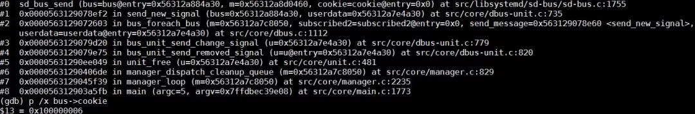

## 阿里巴巴 Kubernetes 集群问题排查思路和方法  

> 作者: 声东  
> 发布日期: 2019 年 5 月 14 日  

**本文来自阿里技术官方公众号（ali\_tech）**

**原文链接：**

**<https://mp.weixin.qq.com/s/xmVHqTZblQsAxdaSjWjn1Q>**

### 关于问题

#### I am Not Ready

阿里云有自己的 Kubernetes 容器集群产品。随着 Kubernetes 集群出货量剧增，线上用户零星地发现，集群会非常低概率地出现节点 NotReady 情况。据我们观察，这个问题差不多每个月，都会有一两个用户遇到。在节点 NotReady 之后，集群 Master 没有办法对这个节点做任何控制，比如下发新的 Pod，再比如抓取节点上正在运行 Pod 的实时信息。

#### 需要知道的 Kubernetes 知识

这里我稍微补充一点 Kubernetes 集群的基本知识。Kubernetes 集群的“硬件基础”，是以单机形态存在的集群节点。这些节点可以是物理机，也可以是虚拟机。集群节点分为 Master 节点和 Worker 节点。Master 节点主要用来承载集群管控组件，比如调度器和控制器。而 Worker 节点主要用来跑业务。Kubelet 是跑在各个节点上的代理，它负责与管控组件沟通，并按照管控组件的指示，直接管理 Worker 节点。

当集群节点进入 NotReady 状态的时候，我们需要做的第一件事情，是检查运行在节点上的 kubelet 是否正常。在这个问题出现的时候，使用 systemctl 命令查看的 kubelet 状态（kubelet 是 systemd 管理的一个 daemon ）发现它是正常运行的。当我们用 journalctl 查看 kubelet 日志的时候，发现以下错误。

#### 什么是 PLEG？

这个报错清楚地告诉我们，容器 runtime 是不工作的，且 PLEG 是不健康的。这里容器 runtime 指的就是 docker daemon 。Kubelet 通过操作 docker daemon 来控制容器的生命周期。而这里的 PLEG，指的是 pod lifecycle event generator。PLEG 是 kubelet 用来检查 runtime 的健康检查机制。这件事情本来可以由 kubelet 使用 polling 的方式来做。但是 polling 有其高成本的缺陷，所以 PLEG 应用而生。PLEG 尝试以一种“中断”的形式，来实现对容器 runtime 的健康检查，虽然实际上，它同时用了 polling 和”中断”这样折中的方案。

基本上，根据上边的报错，我们可以确认容器 runtime 出了问题。在有问题的节点上，通过 docker 命令尝试运行新的容器，命令会没有响应，这说明上边的报错是准确的。

### Docker Stack

#### Docker Daemon 调用栈分析

Docker 作为阿里云 Kubernetes 集群使用的容器 runtime ，在 1.11 之后，被拆分成了多个组件以适应 OCI 标准。拆分之后，其包括 docker daemon，containerd，containerd-shim 以及 runC。组件 containerd 负责集群节点上容器的生命周期管理，并向上为 docker daemon 提供 gRPC 接口。

在这个问题中，既然 PLEG 认为容器 runtime 出了问题，我们需要从 docker daemon 进程看起。我们可以使用 kill -USR1 <pid> 命令发送 USR1 信号给 docker daemon，而 docker daemon 收到信号之后，会把所有线程调用栈输出到 /var/run/docker 文件夹里。

Docker daemon 进程的调用栈是比较容易分析的。稍加留意，我们会发现大多数的调用栈都长成下图中的样子。通过观察栈上每个函数的名字，以及函数所在的文件（模块）名称，我们可以了解到，这个调用栈的下半部分，是进程接到 http 请求，做请求路由的过程；而上半部分则是具体的处理函数。最终处理函数进入等待状态，等待一个 mutex 实例。

到这里，我们需要稍微看一下 ContainerInspectCurrent 这个函数的实现。从实现可以看到，这个函数的第一个参数，就是这个线程正在操作的容器名指针。使用这个指针搜索整个调用栈文件，我们会找出所有等在这个容器上的线程。同时，我们可以看到下边这个线程。

这个线程调用栈上的函数 ContainerExecStart 也是在处理相同容器。但不同的是，ContainerExecStart 并没有在等这个容器，而是已经拿到了这个容器的操作权（mutex），并把执行逻辑转向了 containerd 调用。关于这一点，我们也可以使用代码来验证。前边我提到过，containerd 通过 gRPC 向上对 docker daemon 提供接口。此调用栈上半部分内容，正是 docker daemon 在通过 gRPC 请求来呼叫 containerd。

#### Containerd 调用栈分析

与 docker daemon 类似，我们可以通过 kill -SIGUSR1 <pid> 命令来输出 containerd 的调用栈。不同的是，这次调用栈会直接输出到 messages 日志。

Containerd 作为一个 gRPC 的服务器，会在接到 docker daemon 的远程调用之后，新建一个线程去处理这次请求。关于 gRPC 的细节，我们这里其实不用太多关注。在这次请求的客户端调用栈上，可以看到这次调用的核心函数在 Start 一个 Process 。我们在 containerd 的调用栈里搜索 Start，Process 以及 process.go 等字段，很容易发现下边这个线程。

这个线程的核心任务，就是依靠 runC 去创建容器进程。而在容器启动之后，runC 进程会退出。所以下一步，我们自然而然会想到，runC 是不是有顺利完成自己的任务。查看进程列表，我们会发现，系统中有个别 runC 进程还在执行，这不是预期的行为。容器的启动，跟进程的启动，耗时应该是差不多数量级的，系统里有正在运行的 runC 进程，则说明 runC 不能正常启动容器。

### 什么是 D-Bus？

#### RunC 请求 D-Bus

容器 runtime 的 runC 命令，是 libcontainer 的一个简单的封装。这个工具可以用来管理单个容器，比如容器创建和容器删除。在上节的最后，我们发现 runC 不能完成创建容器的任务。我们可以把对应的进程杀掉，然后在命令行用同样的命令启动容器，同时用 strace 追踪整个过程。

分析发现，runC 停在了向带有 org.free 字段的 dbus socket 写数据的地方。那什么是 dbus 呢？在 Linux 上，dbus 是一种进程间进行消息通信的机制。

#### 原因并不在 D-Bus

我们可以使用 busctl 命令列出系统现有的所有 bus 。如下图，在问题发生的时候，我看到问题节点 bus name 编号非常大。所以我倾向于认为，dbus 某些相关的数据结构，比如 name，耗尽了引起了这个问题。

Dbus 机制的实现，依赖于一个组件叫做 dbus daemon。如果真的是 dbus 相关数据结构耗尽，那么重启这个 daemon，应该可以解决这个问题。但不幸的是，问题并没有这么直接。重启 dbus daemon 之后，问题依然存在。

在上边 strace 追踪 runC 的截图中，runC 停在向带有 org.free 字段的 bus 写数据的地方。在 busctl 输出的 bus 列表里，显然带有这个字段的 bus，都在被 systemd 使用。这时，我们用 systemctl daemon-reexec 来重启 systemd，问题消失了。所以基本上我们可以判断一个方向，问题可能跟 systemd 有关。

### Systemd 是硬骨头

Systemd 是相当复杂的一个组件，尤其对没有做过相关开发工作的同学来说，比如我自己。基本上，排查 systemd 的问题，我用到了四个方法，（调试级别）日志，core dump，代码分析，以及 live debugging。其中第一个，第三个和第四个结合起来使用，让我在经过几天的鏖战之后，找到了问题的原因。但是这里我们先从“没用”的 core dump 说起。

#### “没用的”Core Dump

因为重启 systemd 解决了问题，而这个问题本身，是 runC 在使用 dbus 和 systemd 通信的时候没有了响应，所以我们需要验证的第一件事情，就是 systemd 不是有关键线程被锁住了。查看 core dump 里所有线程，只有以下一个线程，此线程并没有被锁住，它在等待 dbus 事件，以便做出响应。

#### 零散的信息

因为无计可施，所以只能做各种测试、尝试。使用 busctl tree 命令，可以输出所有 bus 上对外暴露的接口。从输出结果看来，org.freedesktop.systemd1 这个 bus 是不能响应接口查询请求的。

使用下边的命令，观察 org.freedesktop.systemd1 上接受到的所以请求，可以看到，在正常系统里，有大量 Unit 创建删除的消息，但是有问题的系统里，这个 bus 上完全没有任何消息。

gdbus monitor --system --dest org.freedesktop.systemd1 --object-path /org/freedesktop/systemd1

分析问题发生前后的系统日志，runC 在重复的跑一个 libcontainer\_%d\_systemd\_test\_default.slice 测试，这个测试非常频繁，但是当问题发生的时候，这个测试就停止了。所以直觉告诉我，这个问题，可能和这个测试有很大的关系。

另外，我使用 systemd-analyze 命令，打开了 systemd 的调试级别日志，发现 systemd 有 Operation not supported 的报错。

根据以上零散的知识，可以给出一个大概的结论：org.freedesktop.systemd1 这个 bus 在经过大量 unit 创建删除之后，没有了响应。而这些频繁的 unit 创建删除测试，是 runC 某一个改动引入的。这个改动使得 UseSystemd 函数通过创建 unit 来测试 systemd 的功能。UseSystemd 在很多地方被调用，比如创建容器，或者查看容器性能等操作。

#### 代码分析

这个问题在线上所有 Kubernetes 集群中，发生的频率大概是一个月两例。问题一直在发生，且只能在问题发生之后，通过重启 systemd 来处理，这风险极大。

我们分别给 systemd 和 runC 社区提交了 bug，但是一个很现实的问题是，他们并没有像阿里云这样的线上环境，他们重现这个问题的概率几乎是零，所以这个问题没有办法指望社区来解决。硬骨头还得我们自己啃。

在上一节最后，我们看到了，问题出现的时候，systemd 会输出一些 Operation not supported 报错。这个报错看起来和问题本身风马牛不相及，但是直觉告诉我，这，或许是离问题最近的一个地方，所以我决定，先搞清楚这个报错因何而来。

Systemd 代码量比较大，而报这个错误的地方非常多。通过大量的代码分析（这里略去一千字），我发现有几处比较可疑地方，有了这些可疑的地方，接下来需要做的事情，就是等待。在等了三周以后，终于有线上集群，再次重现了这个问题。

#### Live Debugging

在征求用户同意之后，下载 systemd 调试符号，挂载 gdb 到 systemd 上，在可疑的函数下断点，continue 继续执行。经过多次验证，发现 systemd 最终踩到了 sd\_bus\_message\_seal 这个函数里的 EOPNOTSUPP 报错。

这个报错背后的道理是，systemd 使用了一个变量 cookie，来追踪自己处理的 dbus message 。每次在加封一个新的 message 的时候，systemd 会先给 cookie 的值加一，然后再把这个值复制给这个新的 message。

我们使用 gdb 打印出 dbus->cookie 这个值，可以很清楚看到，这个值超过了 0xffffffff 。所以看起来，问题是 systemd 在加封过大量 message 之后，cookie 这个值 32 位溢出了，导致新的消息不能被加封，从而使得 systemd 对 runC 没有了响应。

另外，在一个正常的系统上，使用 gdb 把 bus->cookie 这个值改到接近 0xffffffff，然后观察到，问题在 cookie 溢出的时候立刻出现，则证明了我们的结论。

#### 怎么判断集群节点 NotReady 是这个问题导致的

首先我们需要在有问题的节点上安装 gdb 和 systemd debuginfo，然后用命令 gdb /usr/lib/systemd/systemd1 把 gdb attach 到 systemd ，在函数 sd\_bus\_send 设置断点，然后继续执行。等 systemd 踩到断点之后，用 p /x bus->cookie 查看对应的 cookie 值，如果此值超过了 0xffffffff，那么 cookie 就溢出了，则必然导致节点 NotReady 的问题。确认完之后，可以使用 quit 来 detach 调试器。

### 问题修复

这个问题的修复，并没有那么直截了当。原因之一，是 systemd 使用了同一个 cookie 变量，来兼容 dbus1 和 dbus2 。对于 dbus1 来说， cookie 是 32 位的，这个值在经过 systemd 三五个月频繁创建删除 unit 之后，是肯定会溢出的；而 dbus2 的 cookie 是 64 位的，可能到了时间的尽头，它也不会溢出。

另外一个原因是，我们并不能简单的让 cookie 折返，来解决溢出问题。因为这有可能导致 systemd 使用同一个 cookie 来加封不同的消息，这样的结果将是灾难性的。

最终的修复方法是，使用 32 位 cookie 来同样处理 dbus1 和 dbus2 两种情形。同时在 cookie 达到 0xfffffff 的之后，下一个 cookie 则变成 0x80000000，即用最高位来标记 cookie 已经处于溢出状态。检查到 cookie 处于这种状态时，我们需要检查是否下一个 cookie 正在被其他 message 使用，来避免 cookie 冲突。

### 后记

这个问题根本原因肯定在 systemd，但是 runC 的函数 UseSystemd 使用不那么美丽的方法，去测试 systemd 的功能，而这个函数在整个容器生命周期管理过程中，被频繁的调用，让这个低概率问题的发生成为了可能。systemd 的修复已经被红帽接受，预期不久的将来，我们可以通过升级 systemd，从根本上解决这个问题。
