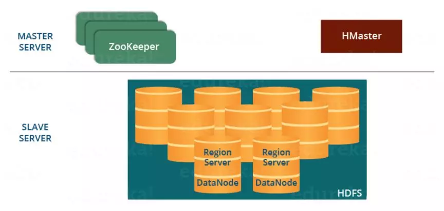
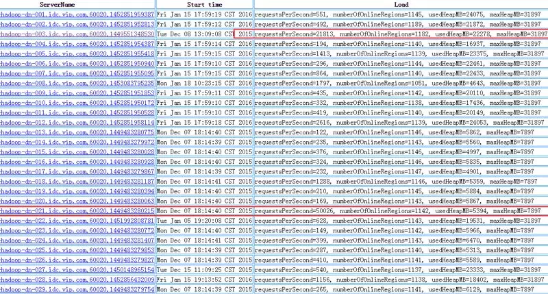
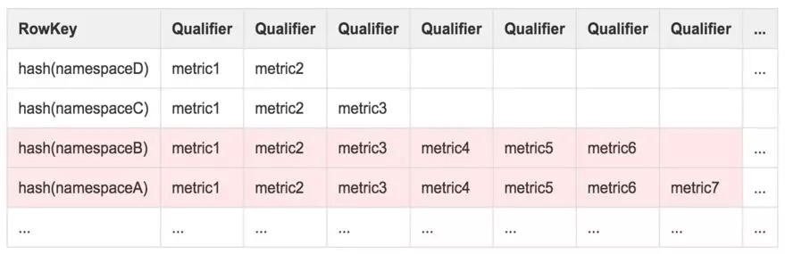
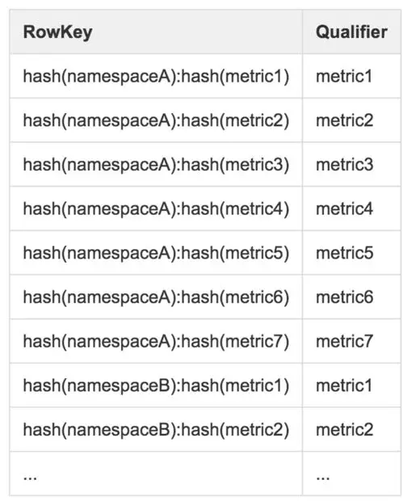
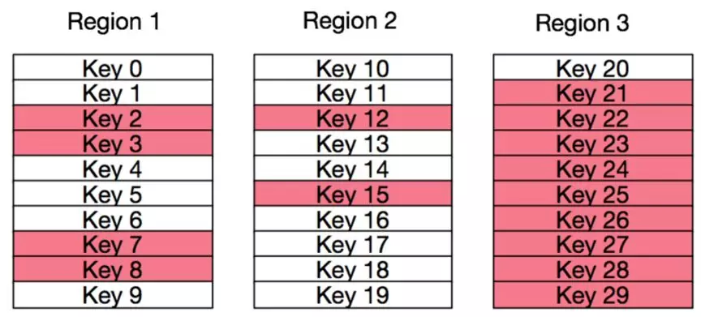
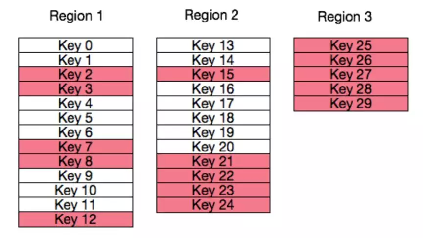

## 百度智能监控场景下的HBase实践  

> 作者: 张洋洋  
> 发布日期: 2019 年 5 月 7 日  


通过百度大规模时序数据存储系列文章的介绍，想必读者对百度智能监控系统 Noah 的 TSDB 不再陌生，它主要用来存储 Noah 监控系统的 **时序指标数据** ，包括但不限于硬件和软件的可用性指标、资源使用率指标和性能指标等。如[《百度大规模时序数据存储（二）|存储选型及数据模型设计》](http://mp.weixin.qq.com/s?__biz=MzUyMzA3MTY1NA==&mid=2247484040&idx=1&sn=82012419d6d4a0f65054378c755f1b82&chksm=f9c37b41ceb4f257e0b38e7f5a7672fd540502dfc1db5da3fa2c99de9e2961fe3bf8da92be31&scene=21#wechat_redirect)文章所述， Noah-TSDB 是基于 HBase 为底层存储的基础上自主研发的，其优秀的性能离不开 HBase 的贡献。今天主要聊聊在百度智能监控场景下的 HBase 相关实践经验，先简单介绍一下 HBase。

### HBase 架构简介

HBase 是一个基于 Java、开源的、非关系型的、面向列存储的分布式可扩展的大数据存储数据库。HBase 的集群主要由 HMater 和 RegionServer 两种角色组成，底层以 HDFS 作为存储设施，集群由 Zookeeper 协助管理。其架构如下图所示：



图 1 HBase 架构图

简单介绍一下 HBase 中相关组件的作用：

* **HMaster**

HMaster 是整个集群的 **大脑** ，负责数据表的操作、集群的负载均衡和故障恢复等集群管理工作。

* **RegionServer**

HBase 将表以行为单位划分成许多 **片段** ，每个片段称为一个 Region。这些 Region 被分配到 RegionServer 进行管理。在读写流程中，定位到数据所在 RegionServer 后，Client 与 RegionServer 直接交互进行数据的读写。

* **Zookeeper**

HBase 作为一个大规模的分布式系统，Zookeeper 的作用是至关重要的。首先 Zookeeper 作为 HMaster HA 解决方案，保证了至少有一个 HMaster 处于工作状态。其次 Zookeeper 通过心跳机制探活 RegionServer，当 RegionServer 故障时及时通知 HMaster 进行故障处理工作。最后 Zookeeper 保存了维护全局元信息的 META 表的路径，Client 第一次与 HBase 集群交互时，需要通过 META 表来获取目标数据所在的 RegionServer。

上面简单介绍了 HBase 的架构和各组件的基本信息，下面和大家分享一下在百度最大规模时序数据库的场景下使用 HBase 时遇到的几个典型问题和优化方案。

### 热点问题

大家都知道木桶效应，对于 TSDB 系统来说，热点 Region 所在的 RegionServer 就是影响整个”水桶”容量最短的那块木板。理想情况下 HBase 中所有的请求应该均匀的分布在所有 RgionServer 的所有 Region 上，当个别 Region 收到的读写请求数量大幅超过其它的 Region，它所在的 Region 就有可能成为热点。



图 2 RegionServer 信息（此图来源网络非百度实际数据）

Noah-TSDB 初期曾遇到监控元数据表设计不合理导致热点的问题。当时研发同学收到 Noah-TSDB **写入模块队列堵塞** 的业务报警，从 Noah 监控系统上看到同时间段访问 HBase 异常明显增长。HBase 中的个别 RegionServer 频繁进行 GC，网络 I/O 和磁盘 I/O 密集，操作队列中待执行的请求堆积严重，负载明显高于其它的 RegionServer。查看异常 RegionServer 的日志发现大量请求访问的是同一个 Region：”tsdb-meta,\*\*\* 1.”。初步定位是由于该 Region **负载过高** ，导致它所在的 RegionServer 成为热点，进而导致系统的吞吐量下降，上游写入模块请求堆积。

tsdb-meta 是用来存储监控指标的名称、周期等元信息的表，表中红色填充的行代表其拥有数据量超过正常水平的，表结构如下：

表 1 原始 tsdb-meta 表



分析上面的存储结构，我们可以知道：

1. 同一个监控对象（namespace）的监控指标元信息将会存储在 HBase 表的同一行。
2. 不同监控对象的指标数量不同，将导致行的大小不均匀。
3. HBase 中数据分片是以行为单位，每行的数据存储在同一个 Region 中，当某一行存储的监控指标数量远大于正常水平时，该行就有可能成为热点。

综上所述，当个别监控对象拥有的 **监控指标个数过多** 时，tsdb-meta 可能会出现热点问题。同时经我们验证发现，成为热点的监控对象拥有的监控指标的数量大约是正常水平的 20 倍左右，进一步确认了故障原因。

定位到根因后，我们决定从两个方面来着手解决这个问题。一方面， **定期统计监控对象拥有的指标个数** ，及时发现由于监控配置异常和不合理使用导致的个别监控对象拥有的监控指标过多的问题。第二方面，对 tsdb-meta 表结构改造，将原来按列分布的数据修改为 **按行展开平铺** ，充分打平数据，利用 HBase 按行自动分片的机制来达到负载均衡的状态。第一方面主要是从业务层面对不合理使用的情况进行人工干预。今天主要着重介绍第二方面。

* **tsdb-meta 表 Schema 改造**

前文大体介绍了表结构改造的思路，避免单行数据过大导致热点问题。我们将监控对象和监控指标的名称信息一起作为行键，只保留一列用于存储指标的其余信息，避免了因单行数据过大导致的热点问题。

表 2 优化后的 tsdb-meta 表



* **预分区**

tsdb-meta 表优化后，我们发现生产环境存储数据的 tsdb-data 表也存在热点问题。tsdb-data 是用来存储监控指标数值的表，生产环境是按时间跨度进行分表，每两天的数据存储在一张表中。数据的行键由数据 hash 后的特征变量 ts\_uid 和时间基准 timestamp\_base 组成，利用 HBase 存储时按行键的字典顺序排序的特点，将不同的监控指标的数据散列到不同的 Region，相同监控对象的指标数据顺序排列，达到优化查询的效果。由于 tsdb-data 表的日常访问量基数较大，当某个监控对象拥有的指标数量高于平均水平，那么该监控对象的监控指标很大概率会被分配到相同的 Region，导致该 Region 过大，进成为热点，集群会分裂过大的 Region 来维持负载均衡的状态。频繁的分裂操作会占用大量资源，影响 RegionServer 的吞吐量。为解决因 Region 过大导致的热点，我们采用了 **对数据表进行预分区** 的方法。

在对 tsdb-data 表进行预分区时，我们发现只通过指定 Region 数量来实现预分区的效果并不理想，因为会出现实际写入量与槽位分配不均的问题。HBase 数据表是按照行键的字节空间均匀划分而不是按照实际存储的数据量进行划分。如下图所示，图中红色方块代表实际存储的数据，白色的方块代表无实际数据的行。



图 3 原始 Region 预分区

如上图，虽然数据表已经按照行键的字节空间划分成 3 个 Region 了，但是明显 Region 3 中实际存储的数据量远大于 Region 1 和 Region 2。这种情况下 Region 3 有成为热点的可能性。为了改善这种情况，Noah-TSDB 结合了生产环境中的 tsdb-data 表按等间隔时间跨度分表的特点，决定参照历史表的使用情况对新表进行预分区。根据生产环境实际产生的行键和预期的分区大小计算出 Region 分界值，然后根据分界值将表划分成实际水位相近的 Region，这样虽然每个 Region 的槽位大小不一样，但是每个 Region 实际存储的数量是相当的，进一步降低产生热点的风险。



图 4 优化后的 Region 预分区

### 如何合理的设置 Region 数量

在前文介绍的预分区策略中，除了需要参考生产环境的实际使用情况外还需要根据机器资源和分裂阈值等系统参数来预估合适的 Region 大小，Region 大小确定后，我们可以预估出整体的 Region 数量。那么如何判断当前集群是否能够承载调整后的 Region 数量呢？如果 Region 的 **数量不合理** 有哪些危害呢？在讨论 Region 数量对集群的影响之前，我们先了解一些基础知识：

1. 在 HBase 的数据写入流程中，数据是先写到 Memstore（写缓存）排序，然后异步 Flush 追加到 HFile 中。一个 Region 中的多个列族对应多个 Memstore，Memstore Flush 的最小单位是 Region。
2. 当一个 RegionServer 中所有 Memstore 的大小总和达到阈值 hbase.regionserver.global.memstore.upperLimit \* hbase\_heapsize 会触发 Memstore Flush。根据 Memstore 从大到小依次 Flush，直至 MemStore 内存使用量低于阈值 hbase\_heapsize \* hbase.regionserver.global.memstore.lowerLimit。
3. HBase 会定期 Flush Memstore 来保障 Memstore 不会长时间没有持久化。为避免所有的 MemStore 在同一时间都进行 Flush 导致的问题，定期的 Flush 操作有随机延时。

综上可知，一方面由于同一个 RegionServer 共享 Memstore，Region 数量过多会导致 Memstore Flush 的频率变快，产生的 HFile 变多，HBase 持续的进行 Compaction，引发 **合并风暴** 。另一方面由于 HBase 定期 Flush Memstore，每次执行 Flush 需要将每个 Region 的每个列族对应的 Memstore 写入文件并存到 HDFS， Region 数量越多，每次需要一起处理的文件数量就越大，即使存在随机时延机制，短时间内文件的创建和数据的迁移较多也会加大集群负载，可能引起快照超时、客户端超时和批量加载超时，降低 TSDB 系统性能。因此 Region 数量过多会降低系统吞吐量。

Region 数量过少也会 **降低系统性能** 。当数据量不变的情况下，由于 Region 数量过少导致单个 Region 过大，每个 Region 处理的写入请求数偏高，当 Flush 的速度慢慢被写入速度追上并赶超时，就会堵塞写入，影响 RPC，进而影响 HBase 的整体写入和查询，降低系统的吞吐量。

Region 数量设置不合理，会降低 TSDB 系统整体性能与可靠性，一般推荐的单个 RegionServer 管理的 Region 数量计算方法如下：

复制代码

```
##{Region} = (RS memory)*(total memstore fraction)/((memstore size)*(# {column families}))
```

举个例子，如果 RegionServer 的参数如下：

1. Java Heap Size of HBase RegionServer in Bytes 设置的是 20G
2. hbase.regionserver.global.memstore.upperLimit 是 0.4
3. hbase.hregion.memstore.flush.size 是 128M
4. 多个表的列族个数共 2 个

那么 \#\{Region\} = 20 \* 1024 \* 0.4/ \(128 \* 2\) = 32。这个公式是在假设所有的 Region 都在以相同的速率写的前提下，如果实际只有部分 Region 在写入数据，结果可以根据比例、结合业务进行调整。例如 Noah-TSDB 的场景下，数据是按照时间分表，一般两天的数据存在一张数据表中，数据的写入都集中在最近的一张表，因此实际写入活跃的 Region 数量远小于 Region 的总数量，所以实际每个 RegionServer 管理的 Region 的数量大约是通过上述公式直接计算结果的 3 倍左右。

预估出整体的 Region 数量和单个 RegionServer 管理的 Region 数量后，就可以合理的进行 **容量规划** ，在集群调整的时候预估需要的机器资源。

### 总结

上面就是今天介绍的全部内容了，给大家简单分享了一些使用 HBase 的实践经验。其实在实际使用时我们也发现了 HBase 过重，运维成本较高等问题，也在持续的进行调研和架构升级，大家有什么好的建议欢迎不吝赐教。另外文中如果有理解不到位或者偏差的地方，欢迎大家指正。

### 作者简介

张洋洋，百度高级研发工程师。负责百度智能运维产品（Noah）的分布式时序数据库和通用配额管理平台的设计研发工作，在分布式存储和配额管理方向有广泛的实践经验。

**本文转载自公众号 AIOps 智能运维（ID：AI\_Ops）**

**原文链接：<https://mp.weixin.qq.com/s/M_teW4hNNaLWbWghA02j9A>**
