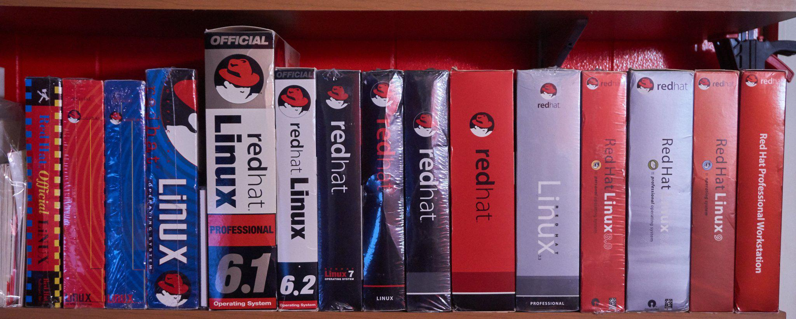

## 别了，Linux的魔法时代！  

> 作者: 杨赛  
> 发布日期: 2019 年 5 月 9 日  

波士顿时间 2019 年 5 月 8 日，红帽峰会进入第二天。

今天在会场跟一些红帽的新老朋友们聊天，聊到工程师们的两个特点：

1. 工程师们很可爱。开这么大一个会议，只要给他们一些五颜六色的贴纸和 T-shirt 收集他们就很开心了。（很像是在用很便宜的玩具打发小朋友们有木有？）

某工程师在 Twitter 上晒的历代 RHEL 版本收藏（这个收藏就不是那么便宜了）

工程师们很纯粹。他们当中的很多 nerds 在传统的现实世界原本是很难存活的物种，能够为他们打造一个环境让他们专心的发挥自己的才能，其实是很了不起的一件事！

一群工程师为了领一件 T-Shirt 列队做题

闲话不多说，进入今天的正题。

当天上午的主题演讲由红帽技术总裁 Paul Cormier 主持，主要是请了一群工程师们带着服务器上台把本次发布的 RHEL8、OpenShift 4 都公开演示了一遍，特别是展示了用 Satellite 去升级系统到 RHEL8、用 Operators 去升级 OpenShift 上运行的 SQL Server 实例的过程：升级系统时有各种 Ansible 的脚本可以选用自动执行、有各种 Insights 的规则提供自动保护避免搞砸，升级 SQL Server 可以做到前端用户无感知，刷新一下页面看到版本号更新才发现升级已经做完了。

在没跟服务器打过交道的人看来，这些演示看起来只是点点鼠标、屏幕上几个数字变了而已，一点儿也不炫酷；但是在识货的人看来，这些工程师们真的是在炫技！服务器运维的自动化是漫长的工程，将这些经验凝聚到开源的工具上经历了大量的探索。这几场 demo 背后的工作量其实是非常可观的。

个人觉得特别有意思的一点是，整个演示不是通过命令行进行的，而是在浏览器里面点点鼠标进行的！而且还专门选用了一台 Windows PC！

三位 Linux 工程师在红帽峰会的舞台上围着一台 Windows，堪称奇观

要知道，但凡任何一个敢于自称 Linux 用户的人，多少都会使用命令行；并且几乎每一个 Linux 用户，都为自己能够掌握更多的命令行而感到自豪。甚至可以这么说：为数不少的 Linux 用户会因为鄙视 Windows 用户而自豪！

但今天的演示所做的事情其实是在告诉所有人： **即使你 \*\*\*\* 不是 Linux 用户， ** **即使你**** 不会用命令行，也可以毫无阻碍的管理成百上千台 Linux 服务器。**

这在开始对我来说简直难以想象：到底是什么样的人会需要这种东西？

**世界上真的需要不会用 Linux 命令行的 Linux 服务器管理员吗？**

一位叫做 Brendan Paget 的红帽工程师解答了我的疑惑。

他说他们在亚太区发展业务的时候，发现了一个日益严重的问题：

**缺乏会用命令行的专业 Linux 运维人才。**

各个行业都需要更多的 Linux 服务器，但是找不到人去管理它们，咋办？所以红帽想到了一群人：以前做 Windows 服务器管理员的那帮人。

他们懂服务器，只是不懂 Linux 命令行而已。所以把 Linux 管理的功能做成鼠标点点就能用，这些人就可以来管理 Linux 服务器啦。

这是其一。另一方面，懂 1 条 Linux 命令，和懂 100 条 Linux 命令，差别还是很大的。所以把 Linux 管理的功能做成鼠标点点就能用，就能够让那些原本只懂 1 条 Linux 命令的人，有机会探索更多的用法，增长知识。

这时，来自 RHEL 部门的一位女性、红帽的 VP 与 GM——Stephanie Chiras 补充了一句：

**“我们希望通过这种方式，让更多学生们进入到 Linux 的世界。”**

使用命令行的 Linux 世界，就像是神秘的魔法世界。你对着黑暗的虚空念出一句咒语——一句其他人都不知道的咒语——然后这个黑暗的虚空会蹦出一堆五颜六色的信息回应你的咒语。这个世界对你的反馈符合你的预期，一切尽在掌握；在这些别人看起来如同天书的五颜六色的信息当中，你找到一些别人看不见的蛛丝马迹，解决了别人都解决不了的系统问题，那种成就感是难以用言语形容的。

（对于此类体验，开源界有一个专有名词来形容： **智商炫富** 。）

使用鼠标的 Linux 世界，是世俗的、透明的，失去了那种神秘感。如果按下打火机就能得到火焰，那么造火的魔法师将从神坛跌落，成为舞台上的演员吧？

但整个世界收获的，是人人都可以随时随地的拥有自己的火焰。

Brendan Paget 所描述的问题，如果你来到红帽峰会的现场，你会特别有体感：你周围的绝大部分参会者都是 30-40 岁以上的男性，年轻人少，女性更少。

红帽峰会某会场内部一瞥

Linus Torvalds 出生于 1969 年。1991 年创作了 Linux 的他 22 岁，正在读大四。

在中国，今天我们看到活跃在 Linux 世界的这批工程师们，大多数是在 90 年代到 00 年代在大学期间接触到 Linux 而进入这个圈子的。那时候的大学生大概也没有特别多的东西玩，一台电脑可以玩很长很长的时间。

而在美国，今天活跃在 Linux 世界的这批工程师们，很多是从更早的 Unix 世界过来的。

从什么时候开始，在学校里面玩 Linux 的人越来越少了？

90 年代的 Linux 只是玩具，吸引了那么多年轻人去玩；今天的 Linux 已经成为全球商业的基石，年轻人却不喜欢玩了。

这其实很正常，因为在今天，比 Linux 好玩的东西多太多了。

这也很危险，因为 Linux 太重要了。

虽然红帽做出了很多努力吸引年轻人接触 Linux，比如专门为女中学生打造的 CO.LAB 项目，但目前看来效果好像不是很明显。

未来会怎么样呢？

参与 CO.LAB 项目的女中学生们

还有另外一种可能性。

Brendan Paget 在他的分享中有提到一个趋势：由于有了 Insights 的自动化分析与 Ansible 的自动化干预，现在越来越多的 RHEL 系统故障可以在人类管理员发现之前就被机器自动解决掉。

为什么 Operators 项目会叫做 Operators 这个名字？我们来看看项目设计者是怎么说的。

Operators 项目始于 2016 年的 CoreOS 项目组，后来的 OperatorHub.io 是该项目的延伸，是由微软、Google Cloud、AWS 与红帽一起建设的仓库，专门用来索引工程师们编写的各个 Operator 软件。在[该网站的介绍页面上有这样一句话](https://operatorhub.io/what-is-an-operator)：

“The goal of an Operator is to put operational knowledge into software.”

**“Operator 的目标就是将（人类的）运维知识结晶到软件当中。”**

机器人管理员。

软件就是机器人。

如果将运维知识粗略分为系统运维和应用运维，那么在系统层面（RHEL），Insights 是机器人的脑，Ansible 是机器人的手。

脑可以做什么？脑是处理逻辑的引擎，比如这样：

1. 部分 Xeon CPU 在 uptime 超过 200 天后可能出现 kernel panic，建议升级内核版本后重启系统。

2. 出现新的 Heartbleed 漏洞报告，建议立刻更新 OpenSSL 至最新版本。

3. ……

上面的每一条都是 Insights 里面的一条“规则”（Rule），这样的规则现在已经积累了 600 多条，并且将不断继续积累下去。

手可以做什么？手是执行的工具，比如这样：

当 Insights 告诉我要给一台服务器升级内核版本后重启系统的时候，在设定好的时间去照做。

再来看应用层面。

Operators 可以做什么？

Operators 是手。比如你要在 OpenShift/Kubernetes 上创建一个 Kafka 集群，如果全靠人肉手动操作，需要敲很多命令，花好几个小时，就算是再喜爱命令行的 Linux 高手也不会想要做这种事情——他们会写脚本来做这个事情。曾经，高手们写好脚本自己用用就结束了，顶多放到 Github 上分享代码；现在，写好的脚本按照 operators 的规格打包，于是我们有了 AMQ Streams operator，后来的人只需要点点鼠标，几分钟就创建好了。

目前，大部分 operators 还只能做最基本的部署操作，智能还谈不上。在整个 Kubernetes 社群带着大量开发者向前奔跑的过程中，这可能会是接下来几年蓬勃发展的一个领域。

Linux 的魔法时代即将结束，命令行的英雄们将成为历史。即将迎来的，是规模化的时代，是自动化的时代，是机器人管理员的时代，是软件领域之外的各个领域的人才共同参与创新的时代。

曾经，同时管理上万台服务器是互联网巨头们的特权。现在，同时调用上万台容器成为每一位开发者手边的可能性。

讲真，管理服务器这个活儿本来就不是适合人类做的事情。年轻人不喜欢 Linux 命令行，其实也没什么关系吧！
