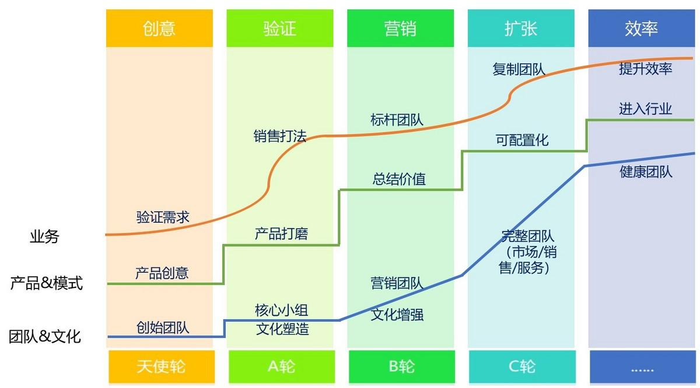

## 从管理会计看SaaS企业经营的真相（上）| SaaS创业路线图（46）  

> 发布: 吴昊@SaaS  
> 发布日期: 2019-05-21  

编者按：本文来自微信公众号[“SaaS白夜行”（ID：SaaSKnight）](https://mp.weixin.qq.com/s/VEZ-Daal8jnD2MxZYV-wtg)，作者吴昊SaaS，36氪经授权发布。

作者介绍 - 吴昊，SaaS创业顾问，纷享销客天使投资人、前执行总裁，8年SaaS营销团队创新+13年企业信息化经验。目前在为SaaS公司提供战略咨询，重点是市场、销售、服务团队的规模化。

（SaaS创业路线图）

我有一个会计专业的学位，但上周在中欧学了《战略管理会计》课，才真正理解了“管理会计”中成本分配、管理决策、组织设计和激励机制在企业经营实战中的关键作用。

究其原因，一是中欧的教授有理论结合实战的能力，他们一边与诺贝尔奖得主在同样的国际顶级学术刊物上发学术论文，一边在贵州茅台、上海宝钢、京东等中国一流企业担任独立董事；二是我工作二十年来对“企业管理”也逐渐形成了自己独立的认知，特别是一年来我的这个\#SaaS创业路线图\#系列文章督促我每周都做一次系统思考。在此也要感谢我的读者朋友们，没有督促就没有进步。

闲话少说，我结合理论分析一下SaaS企业经营中的几个重大决策问题。

首先说明一下，“管理会计”与“财务会计”不同，前者是为内部管理决策服务的（我更喜欢这个），后者的目的则是记账和报税（需要遵循中国的会计准则和税法，提供给外部的股东及事务所）。

我们先从固定成本、变动成本这样基础的概念说起。

**一、固定成本与变动成本的取舍**

顾名思义，“固定成本”指短期内与生产量/销售量无关的成本，例如SaaS公司的研发费用。“变动成本”指与生产量/销售量正相关的成本，例如销售额越高，发给业务员的提成支出就会越多。

SaaS公司的办公室租金、研发及职能部门的薪资、管理层薪资，这些在一个较短的时间内是“固定成本”。

而 客单价-变动成本=边际贡献。

当然，这些公式都要讲究收入与费用匹配。如何划分变动成本与固定成本，与业务关系很大。

**案例A、美国西南航空**

说起来很有趣，在商学院，美国西南航空是个被各门课老师引用的案例。人家确实牛啊，美国的6大航空公司在“911事件”后都陆续破产，只有西南航空连续40多年保持盈利。原因是什么？是创始人的眼界？是企业文化？当然都有影响。

但请所有创业者注意， **我们经常强调企业文化，但文化也是要有经济基础的，管理者必须会帮部属算个人收入账。**

以西南航空为例，我们发现其飞行员、地勤工程师、空乘等各个岗位的底薪都比其它航空公司低1/3左右，加上西南航空非常重视飞机的利用率，飞机降落后在30分钟左右就会再次起飞，所以这些岗位的工作量比其他航空公司高出很多。

这些都是对“变动成本”的控制，最终其“每座位每英里”的变动成本，竟然只有某些航空公司的一半甚至更少。因此西南航空在激烈的市场竞争中保持巨大优势。

而在保障员工收益上，西南航空的方式是“后端奖励”，他们拿出税前利润的15%分享给员工，以此保障收入。这个部分就是需要企业文化和历史信用了，否则谁会愿意降薪加入一个工作压力更大企业？

“收入保障 + 工作稳定 + 优秀文化”吸引了大量求职者，西南航空在20万名求职者中只雇佣6,000人，这也形成了人才的正向循环。

西南航空获得这么低的“变动成本”也不是没有代价的，他们在机型选择（只选波音737一个机型，降低设备维护成本）、机场选择（只选不昂贵也不拥挤的二流机场），包括购买燃油期货......也就是说在“固定成本”上做了更大投入，以保障“变动成本”更低。

这就是抉择。固定成本投入的周期长、对应风险也更大；但如果选对了，未来对变动成本的影响也更深远。

作为SaaS公司，我认为更多选择是偏向增加“变动成本”（同时减少“固定成本”的），例如租办公室而不是购买；例如先测试销售方法再组建团队，而不是先摆上6个分公司再让大家各自摸打法；例如前期要尽量控制研发成本......

我下面就为大家做做实际测算。

**案例B：** 举个具体的例子，SaaS企业“沙云科技”的财务数据如下：

每月研发成本100万，职能部门（行政、财务、人事、总裁办）薪资及租金等费用20万，CSM（服务）部门费用30万，市场部薪资费用10万，市场部推广费用15万，销售部门底薪100万。如果我们考虑的是一个月的决策，从这个时间长度看，我认为这些都是固定费用。

此外，业务员的销售提成+销售管理层的管理提成之和为销售额的35%，这是变动成本，对应的：

边际贡献率 = 1 - 35% = 65%

可算得：

固定成本 = 研发100万 + 职能20万 + 服务30万 + 市场部薪资10万 + 市场推广15万 + 销售部门底薪100万= 275万。

盈亏平衡点的月度销售额 = 固定成本275万 ÷边际贡献率65% = 423万。

如果“沙云科技”当月营收为400万元，则税前利润为： 400万 \* 边际贡献率65% - 固定成本275万 = -15万。

**案例B2、还是看这个例子，如果是考虑年度经营情况呢？**

从一年的角度考虑，服务30万 + 市场部薪资10万 + 市场推广15万 + 销售部门底薪100万 ，这155万，都应该作为变动成本考虑，因为从一年的角度看，这些岗位都是需要根据业务量做调整的。此外的研发和职能费用，我们假设在这一年没有变动。

我这里提出一个“营销服务费率”的概念，它不包含固定费用（研发和职能成本），

**营销服务费率 = 销售、服务、市场的费用之和÷销售收入**

以上面的例子，营销服务费率 = （服务30万 + 市场部薪资10万 + 市场推广15万 + 销售部门底薪100万 + 销售额400万 \* 提成35% ）÷ 销售额400万 ≈75%

**我这一年见过不少SaaS企业，营销服务费率大多在60~90%之间，甚至有超过100%的** （也就是说客户第一次收费不够养活营销服务团队的）。这个案例里的75%大约是个中位数了。

那我们仔细想想，这个75%意味这什么？

1、每增加100万销售额，都同时增加75万变动成本，也就是说，只能增加25万毛利；

2、如果希望不增加现金压力，研发成本增加100万，需要销售额增加400万（在本例中是业绩翻番）。

所以我们一是要想方设法提高市场效率、销售部门的线索转化效率、服务部门的续费率和增购率，这样就会降低“营销服务费率”、提高“边际贡献率”。

另一方面，从利润考量的角度看，对于固定成本的增加要特别谨慎，研发和职能费用每增加1万元，都需要增加4万元的销售收入才能平衡。我在寒冬期见到还能盈利的SaaS公司，都是一贯在研发投入方面非常谨慎的。

即便融到很多钱，在增加研发投入上仍然需要谨慎考量，因为是个长期的“固定成本”。

这也是产品技术出身的创始人的优势，他们往往更加擅长控制研发投入。如果创始人是营销出身，你的技术合伙人就必须有很深的功底，他的任务是把研发资源组织到最高效率。

本文中引用的资料包括：

1\. 《美国航空企业成本分析案例》 中欧国际工商学院 许定波教授 2002年11月编写，2003年3月修改

2\. 《西南航空公司为航空业设定了成本标准》Scott MCcartney 2002年10月9日华尔街日报，张昕 翻译

3\. 《一个航空业的奇迹》 Sally B. Donnelly, Time Magazine, 2002年10月20日，张昕 翻译

《管理会计》中SaaS公司能用的部分还有：成本分配机制、组织设计和激励机制等，我将在后续系列文章中逐一写到。欢迎读者留言交流。
