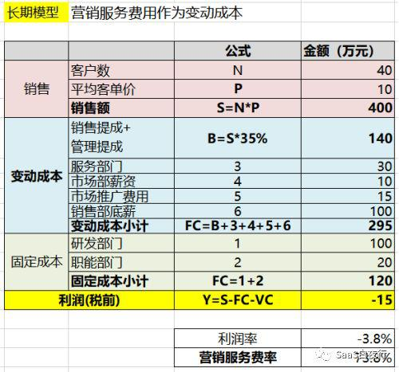
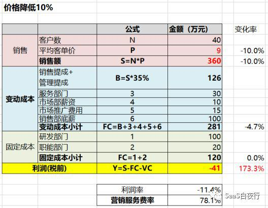

## 从管理会计看SaaS企业经营的真相（中）| SaaS创业路线图（47）  

> 发布: 吴昊@SaaS  
> 发布日期: 2019-05-28  

编者按：本文来自微信公众号[“SaaS白夜行”（ID：SaaSKnight）](https://mp.weixin.qq.com/s/-GZRMXO6SrhVhq0TkDz90Q)，作者吴昊SaaS，36氪经授权发布。

**作者介绍** **-** 吴昊，SaaS创业顾问，纷享销客天使投资人、前执行总裁，8年SaaS营销团队创新+13年企业信息化经验。目前在为SaaS公司提供战略咨询，重点是市场、销售、服务团队的规模化。

（SaaS创业路线图）

[“管理会计（上篇）”](https://36kr.com/p/5206498)对 **固定成本** 与 **变动成本** 的关系做了分析，不少读者都对“研发成本每增加100万，需要销售额增加400万”的比例关系表示惊讶。这篇我接着写让大家更惊讶的......

**二、价格的威力**

我们进一步看看同一个案例，价格对利润的影响是怎样的呢？（不用翻上篇文章，从下表就能看懂）

这是按原价格销售的利润表（管理会计）：

（上篇讲过， **营销服务费率 = 销售、服务、市场的费用之和÷销售收入** ）

如果我们平均客单价在原价基础上打了9折是什么情况呢？

可以看到，总收入降低10%，变动成本降低4.7%，固定成本不变，亏损却扩大了173%！

（对于盈利的企业同样是这样，价格对利润的影响是加倍的，可能是2倍，也可能是3倍、4倍。）

可见，价格是威力巨大的。

也就是说， **我们销售过程中如果折扣管理地不好，对利润的影响远超过费用节约的益处。**

这个其实也很容易理解：反过来讲，如果能够把价格上调10%，营收对应增加10%。这10%的收入，没有对应固定费用（例如研发费用、服务器费用和房租）的增加，变动成本中的大块费用（人员底薪、市场推广费用）也不变，只有提成费用有少量变化，所以提价带来的利润贡献是非常大的。

这里也请我们做SaaS的同学多想想，价格战害人害己，是双输的结局。

所以我这一年经常说， **资本寒冬不全是坏事，如果每家SaaS公司都理性地以年度盈利为目标，价格战就少了** 。

**三、用作业成本法找出“好”客户和“坏”客户**

“坏客户”是指那些表面上看给企业带来了更多收入，但实际获客和服务过程中成本大于收入，最终带来负利润的客户。按SaaS术语，就是CAC（Customer Acquisition Cost，用户获取成本）>LTV（life time value，生命周期总价值）。

请注意，从管理会计的角度看，这个LTV也是要减去生命周期中发生的服务成本的，包括“帮助客户企业改造业务流程及系统实施”、“CSM挽救流失客户”等费用计算进来，是不可以忽略的。

实际运作中，“ **直接成本** ”（为这个客户单独付出的费用：销售的提成奖金、实施工程师的实施费用）是比较容易核算的。但一个SaaS企业中还有大量的 **间接成本** ，例如：研发费用、热线（Call Center）接电话的费用，办公室租金，这都是需要分摊到每个客户头上的。

下面我简述一下作业成本法的步骤：

* 生产服务过程分析：SaaS企业可以分为市场获线索——销售关单——实施交付——CSM长期服务

* 区分直接成本与间接成本

* 为每个间接成本找到“成本动因”（Cost Driver，能准确反映客户与实际成本消耗之间的关系。举个例子：“耗费工时”就是个常见的Cost Driver）

* 以“成本动因”为分配基础将间接成本分配到每个客户头上

* 汇总每个客户的直接成本与间接成本，与客户的LTV对比就可以判断该客户是“好客户”还是“坏客户”。

（管理会计中的“作业成本法”是针对多产品间的成本分配的，但SaaS企业大多是单一产品而客户类型很多，因此我改造了一下，用于针对“单产品、多客户”的情况。）

这里的关键是“成本动因”的选择，讲它之前我先给大家举个教授在课堂上讲的一个非常发人深思的例子。

某工厂生产A、B、C、D四种产品，随着工资的上涨毛利率开始下降。厂长决定，如果一个产品毛利为负就要砍掉。

于是，虽然A产品的销售额>直接费用，但根据“人工工时”分摊间接成本（主要为设备运转及折旧费用）后，发现A产品的毛利是负的，于是砍掉。

A产品被砍掉后，间接成本被分摊到产品B、C、D上，发现B的毛利也由正转负了，于是B也被砍掉；然后是C产品...最后D产品也不挣钱了...... **最终厂长发现自己犯了个大错误，工厂只能倒闭。**

**这里的关键就是“间接成本”分配到各个产品上的方式错了！**

这里的“成本动因”选择的是“人工工时”，但“人工工时”与“设备费用”并没有直接因果关系。有的产品可能耗人工很多，但需要的“机器时间”却很少，把过多的“设备费用”分摊上去，就会扭曲“毛利”计算结果，影响重要决策。

（上例中的第二个错误是，A产品停产后，机器工时其实是没有用完的，不应该把所有“设备费用”分摊到所有剩余产品上，而应该保留一个“未使用设备工时费用”不再分摊。否则B产品也可能负担了更多分摊的间接费用而错判为“负毛利”产品。）

总体来说，该工厂的策略应该分2部分：

1. 短期来说，只要销售额-直接成本>0，该产品就应该保留。毕竟短期来说多余的设备时间不可能卖掉，不做A产品也会空闲着。

2. 从长期来看，“设备时间”是间接费用（“设备费用”）的“成本动因”，而非“人工工时”。设备时间也是企业资源的瓶颈（该工厂每月设备使用时间的极限是固定的）。要逐渐把“设备时间”利用率（设备每运转1小时能带来的边际贡献）高的产品替代“设备时间”利用率低的产品，实现企业利润最大化。

**回到SaaS企业的实际情况** ，采用合理的“直接成本”核算与“间接成本”分摊方法，按业务步骤拆解费用，就可以分析出哪些客户才是我们应该开拓的，哪些客户应该放弃。

“作业成本法”是各位CEO可以要求财务负责人思考及核算的工作。但我提醒一下，这起码需要3个月以上时间的积累才有可能准确统计出直接成本和间接成本，并指导实际决策。

**如果你的企业暂时还不能执行“作业成本法”，我至少可以提供几个直接能用的建议给大家：**

* 根据目前销售体系每月产出单数，总体核算一下平均客单价要到多少公司才能够达到盈亏平衡点。

* 以我的观察，toB面销团队每人每月签约1~3个新企业客户是正常的（具体数量与“成交客户中：市场线索vs自开拓比例”有很大关系）；

* 如果你在北上广深使用 **面销团队** 获客和成交， **平均客单价不能少于2万元** （指一年单：签订的是服务周期12个月的合同），这样才能做到人效4万元/月，才能招到比较优秀的销售（月收入超过1.5万元），而公司的营销体系又能有毛利。

接着说个实战案例。正好周六我做咨询的一家SaaS企业问我：一个目标大客户要他们的SaaS产品提供二次开发的能力（方便客户自己的研发做些小调整）怎么办？

我的建议是，要看看是否有同行能提供？如果我们提供，未来成本有多少？

从我的角度看，客户要的是PaaS，而PaaS需要在SaaS已经完善的情况下再花2~3年才可能初步建起来。所以这个需求接下来后根本等不及PaaS，那么就意味着没完没了的定制开发。因此这很可能是个坏客户。当然也不要放弃，而是要设法纠正客户的需求，或考虑做成更长远的密切合作。

请各位读者思考一下自己公司有哪些“间接费用”需要分摊到客户头上？每个间接费用的真正“成本动因”是什么？哪些间接费用不应该分摊？千万别弄错了，否则就会出现上例中“某工厂”的情况：放弃了好客户，捡来了坏客户。

“管理会计-中篇”我就写到这里，“下篇”我会讲讲中欧教授是如何谈组织设计以及奖金、股权激励的。上课时这部分也给我很多启发，希望能分享给大家。
