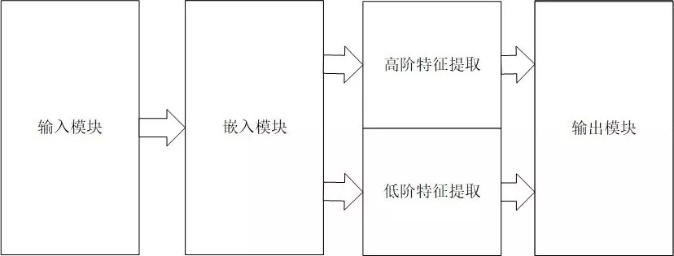
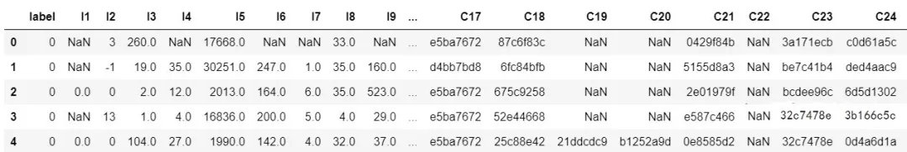

## DeepCTR：易用可扩展的深度学习点击率预测算法库  

> 作者: DataFun社区  
> 发布日期: 2019 年 5 月 8 日  


这个项目主要是对目前的一些基于深度学习的点击率预测算法进行了实现，如 PNN , WDL , DeepFM , MLR , DeepCross , AFM , NFM , DIN , DIEN , xDeepFM , NFFM , AutoInt 等，并且对外提供了一致的调用接口。关于每种算法的介绍这里就不细说了，大家可以看论文，看知乎，看博客，讲的都很清楚。

这里简单从整体上介绍一下 DeepCTR 这个库。首先这个不是一个框架，它不具有学术创新意义，目前也没有解决什么复杂的工程问题。它面向的对象是那些对深度学习以及 CTR 预测算法感兴趣的同学，可以利用这个库：

1. **从一个统一视角来看待各个模型**
2. **快速地进行简单的对比实验**
3. **利用已有的组件快速构建新的模型**

### 统一视角

DeepCTR 通过对现有的基于深度学习的点击率预测模型的结构进行抽象总结，在设计过程中采用模块化的思路，各个模块自身具有高复用性，各个模块之间互相独立。基于深度学习的点击率预测模型按模型内部组件的功能可以划分成以下 4 个模块：输入模块，嵌入模块，特征提取模块，预测输出模块。



### 快速实验



Criteo 数据集预览

下面是一个简单的用 DeepFM 模型在 criteo 数据集上训练的的例子。

复制代码

```
import pandas as pd

from sklearn.preprocessing import LabelEncoder, MinMaxScaler

from sklearn.model_selection import train_test_split

from sklearn.metrics import log_loss, roc_auc_score

from deepctr.models import DeepFM

from deepctr.utils import SingleFeat

if __name__ == "__main__":

data = pd.read_csv('./criteo_sample.txt')

sparse_features = ['C' + str(i) for i in range(1, 27)]

dense_features = ['I'+str(i) for i in range(1, 14)]

data[sparse_features] = data[sparse_features].fillna('-1', )

data[dense_features] = data[dense_features].fillna(0,)

target = ['label']

### 1.Label Encoding for sparse features,and do simple Transformation for dense features

for feat in sparse_features:

lbe = LabelEncoder()

data[feat] = lbe.fit_transform(data[feat])

mms = MinMaxScaler(feature_range=(0, 1))

data[dense_features] = mms.fit_transform(data[dense_features])

### 2.count #unique features for each sparse field,and record dense feature field name

sparse_feature_list = [SingleFeat(feat, data[feat].nunique())

for feat in sparse_features]

dense_feature_list = [SingleFeat(feat, 0)

for feat in dense_features]

### 3.generate input data for model

train, test = train_test_split(data, test_size=0.2)

train_model_input = [train[feat.name].values for feat in sparse_feature_list] + \

[train[feat.name].values for feat in dense_feature_list]

test_model_input = [test[feat.name].values for feat in sparse_feature_list] + \

[test[feat.name].values for feat in dense_feature_list]

### 4.Define Model,train,predict and evaluate

model = DeepFM({"sparse": sparse_feature_list,

"dense": dense_feature_list}, final_activation='sigmoid')

model.compile("adam", "binary_crossentropy",

metrics=['binary_crossentropy'], )

history = model.fit(train_model_input, train[target].values,

batch_size=256, epochs=10, verbose=2, validation_split=0.2, )

pred_ans = model.predict(test_model_input, batch_size=256)

print("test LogLoss", round(log_loss(test[target].values, pred_ans), 4))

print("test AUC", round(roc_auc_score(test[target].values, pred_ans), 4)))
```

#### 快速构建新模型

所有的模型都是严格按照 4 个模块进行搭建的，输入和嵌入以及输出基本都是公用的，每个模型的差异之处主要在特征提取部分。

下面是 DeepFM 模型的特征提取核心代码，大家也可以利用这些已有的组件去构建自己想要的模型。

复制代码

```
fm_input = Concatenate(axis=1)(embed_list)# 将输入拼接成 FM 层需要的 shape

deep_input = Flatten()(fm_input)# 将输入拼接成 Deep 网络需要的 shape

fm_out = FM()(fm_input)# 调用 FM 组件

deep_out = MLP(hidden_size, activation, l2_reg_deep, keep_prob,use_bn, seed)(deep_input)# 调用 Deep 网络组件

deep_logit = Dense(1, use_bias=False, activation=None)(deep_out)
```

#### 如何使用呢！？

首先确保你的 python 版本 >=3.4 然后：

复制代码

```
pip install deepctr
```

就可以安装成功啦！剩下的我建议你先来项目仓库点个赞，然后再去看说明文档！

**DeepCTR 项目地址：**

<https://github.com/shenweichen/DeepCTR>

**Welcome to DeepCTR’s documentation！**

地址：

<https://deepctr-doc.readthedocs.io/en/latest/>

最后就是欢迎感兴趣的同学一起来维护建设和交流，无论是文档，还是开发，还是测试，都欢迎~

#### 作者介绍：

沈伟臣，阿里巴巴算法工程师，硕士毕业于浙江大学计算机学院。对机器学习，强化学习技术及其在推荐系统领域内的应用具有浓厚兴趣。

**本文来自 沈伟臣 在 DataFun 社区的演讲，由 DataFun 编辑整理。**
