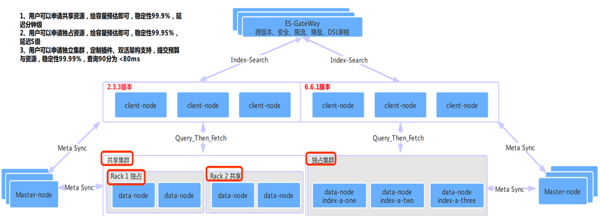
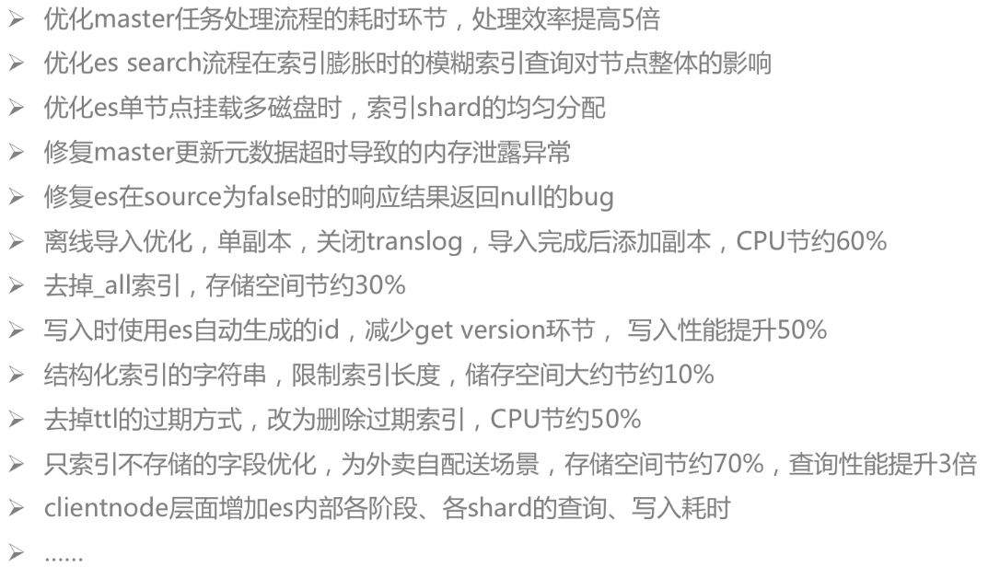
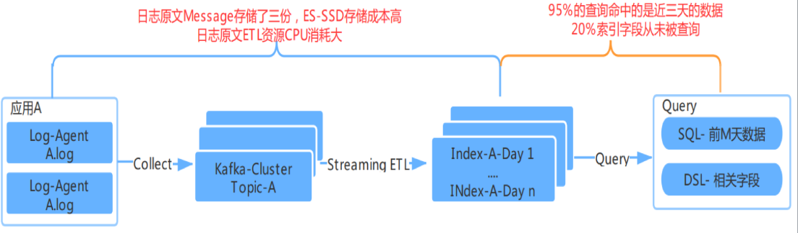
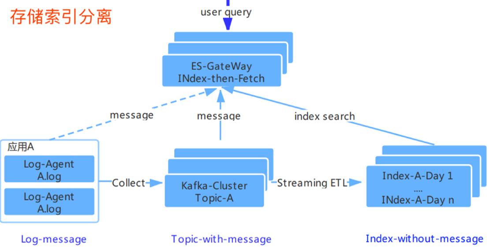
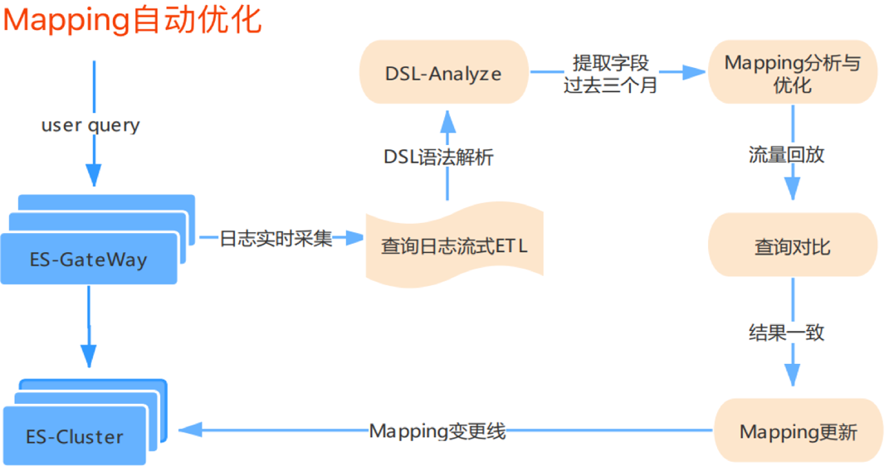
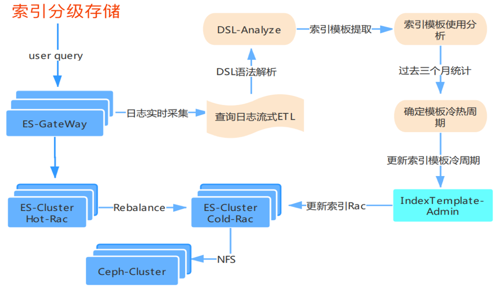
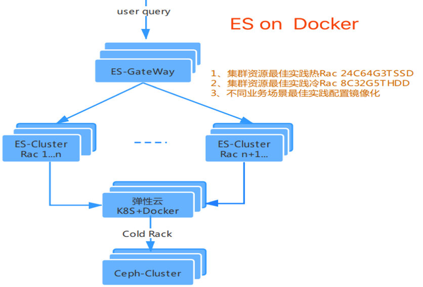

## 滴滴基于 ElasticSearch 的一站式搜索中台实践  

> 作者: 李夏昕  
> 发布日期: 2019 年 5 月 15 日  

ElasticSearch 是基于 Lucene 实现的分布式搜索引擎，提供了海量数据实时检索和分析能力。滴滴从 2016 年 4 月开始组建团队，解决 ElasticSearch 在使用过程中遇到的性能问题。并且，随着业务体量的发展，滴滴构建了基于 ElasticSearch 的一站式搜索平台。InfoQ 邀请到了滴滴出行高级专家工程师、[QCon 全球软件开发大会（广州站）](https://2019.qconguangzhou.com/schedule?utm_source=infoq&utm_medium=web&utm_campaign=zhangliang)讲师张亮，请他聊聊滴滴如何基于 ElasticSearch 打造存储成本低、系统稳定性好，易用的搜索中台。

### ElasticSearch 在滴滴的应用场景

滴滴自 2016 年 4 月开始组建团队，解决 ElasticSearch 在使用过程中遇到的性能问题。搜索平台的建设是随着业务体量的发展逐步演进的，如今已经发展到有超过 3500+ ElasticSearch 实例， 5PB 的数据存储，峰值写入 TPS 超过了 2000W/S 的超大规模，每天近 10 亿次检索查询。

ElasticSearch 在滴滴有着非常丰富的应用场景：

* 为线上 **核心搜索** 业务提供引擎支持；
* 作为 **RDS** 从库，海量数据检索需求；
* 解决公司 **海量日志** 检索问题；
* 为 **安全场景** 提供数据分析能力。

不同场景业务方对写入的及时性、查询的 RT、整体稳定性的要求都是不一样的，我们对平台提供的服务抽象为索引模板服务，用户可以自助开通相应的服务。

我们内部经过压测、线上调优以及引擎的一些优化，已经将最佳实践，沉淀到标准的 Docker 镜像中，个性化的需求都在索引模板的服务级别进行设置与管控，部分优化如下：

### 平台稳定性面临的风险与挑战

超大的集群规模和丰富的场景给滴滴 ElasticSearch 平台带来了极大的风险与挑战。主有以下几个方面：

* **线上业务场景**

* 稳定性要求至少 99.99%，对查询的 90 分位性能抖动敏感；
* 架构层面需要支持多活的需求，对数据的一致性与及时性都有要求，必须保证数据的最终一致性，数据更新秒级可见；
* 不同线上业务，插件需求、索引分片规则都是多样化的；
* 众多独立集群如何快速平滑地进行滚动升级，保障的线上业务无影响。
* **准线上业务场景**

* 离线快速导入时效性要求分钟级，实时导入 10 亿条数据需要 5 个小时，导入时在线资源消耗严重，线上服务基本不可用，导入成本消耗过大；
* 查询的多样性，14W+ 查询模板，单索引最高有 100+ 应用同时查询，在多租户场景下，如何保证查询的稳定性。
* **安全与日志场景**

* 千万级别数据每秒的实时写入，PB 级日志数据的存储，对大规模 ElasticSearch 的集群提出诉求，但 ElasticSearch 有自己的元信息瓶颈，详见团队同学的分享：<https://www.infoq.cn/article/SbfS6uOcF_gW6FEpQlLK>；
* 查询场景不固定，单个索引几百亿级别的数据体量，需要保障不合理查询对集群与索引的稳定性风险可控；
* PB 级存储，查询频率低，但查询的时效性要求 S 级别返回，全部基于 SSD 盘，成本太高，需要在查询体验没有太大变化的情况下，降低整体的存储成本。

那么，如何解决这些问题呢？欢迎到 [QCon 全球软件开发大会（广州站）](https://2019.qconguangzhou.com/presentation/1472?utm_source=infoq&utm_medium=web&utm_campaign=zhangliang)现场与我面对面交流。

### 如何打造“存储成本低”的搜索中台

目前，在日志与安全分析场景下，存储成本压力很大，属于典型的“写多查少”的场景，我们对存储成本的耗散点进行了深入的分析，整体情况如下：

针对 **资源耗散点** ，我们在架构层面进行了优化，整体成本降低了 30%，累积节省了 2PB 的存储，分别从以下几个方面进行了优化

* **存储索引分离** ：日志原文与索引进行分开存储

* **不合理的索引字段 Mapping 自动优化**

* **冷热数据进行了分级存储**

* **ES On Docker &Ceph 改造**

### 未来发展规划

**基于 ElasticSearch 的搜索中台给用户带来的收益**

* 服务了超过 1200+ 平台业务方，其中 20+ 线上 P0 级应用，200+ 准实时应用；
* 索引服务接入效率从原来的两周降低到 5 分钟；
* 服务稳定性有保障：线上场景 99.99%，日志场景 99.95%；
* 高频运维操作一键自助完成，90% 的问题，5 分钟完成定位；
* 整体存储成本是业内云厂商的 1/3。

**不足点**

* 目前滴滴 90% 的集群还是在 ElasticSearch 2.3.3 版本，内部修复的 BUG 与优化，无法跟社区进行同步；
* 目前通过 ES-GateWay 的方式支持了多集群方案很好的满足了业务发展的需求，但是集群变多之后的，版本维护与升级、整体资源利用率提升、容量规划都变得非常艰难。

**发展规划**

* 解架构之“熵”
* 突破引擎元数据瓶颈，提升运维效率，降低成本 ->ES - Federation;
* GateWay 能力插件式下沉引擎，减少中间环节，与社区融合，优化性能。
* 提引擎迭代效率
* 100 个节点集群滚动重启时长从 2 天提升至 1 小时；
* 架构层面解决跨大版本升级之“痛” 2.2.3 -> 6.6.1 http restful。
* 聚焦价值问题
* 多租户查询、CBO、RBO 的查询优化器建设；
* 数据体系化 -> 数据智能化；
* 基于 Ceph、Docker 改造 ElasticSeach，支持 Cloud Native 的存储计算分离。

**嘉宾简介**

**张亮，滴滴出行高级专家工程师**

曾任华为南研所网盘研发工程师；2014 年 4 月至今任职滴滴出行大数据架构部高级专家工程师。在滴滴任职 5 年，经历从无到有组建团队，主持构建过任务调度系统、业务监控系统、链路跟踪与诊断系统、数据同步中心等架构设计与研发工作，目前在负责数据通道、kafka 服务、数据检索的引擎建设工作，具有丰富的高并发、高吞吐场景的架构设计与研发经验。

另外，张亮将在 5 月 27-28 日[的 QCon 全球软件开发大会（广州站）](https://2019.qconguangzhou.com/schedule?utm_source=infoq&utm_medium=web&utm_campaign=zhangliang)上分享「[PB 级数据检索平台 | ElasticSearch 在滴滴的实践](https://2019.qconguangzhou.com/presentation/1472?utm_source=infoq&utm_medium=web&utm_campaign=zhangliang)」，会有更多干货内容，感兴趣的同学可以到现场与张亮老师面对面交流。目前，大会倒计时 10 天，[日程](https://2019.qconguangzhou.com/schedule?utm_source=infoq&utm_medium=web&utm_campaign=zhangliang)已经上线，所剩席位已经不多，想参与的小伙伴抓紧时间抢票锁定席位啦！有任何购票问题，欢迎咨询票务小助手鱼丸：13269078023（微信同号）。
