## Druid SQL 和 Security 在美团点评的实践  

> 作者: DataFun社区  
> 发布日期: 2019 年 5 月 9 日  

> 导读：长久以来，对 SQL 和权限的支持一直是 Druid 的软肋。虽然社区早在 0.9 和 0.12 版本就分别添加了对 SQL 和 Security 的支持，但根据我们了解，考虑到功能的成熟度和稳定性，真正把 SQL 和 Security 用起来的用户是比较少的。本次分享将介绍社区 SQL 和 Security 方案的原理，以及美团点评在落地这两个功能的过程中所遇到的问题、做出的改进、和最终取得的效果。下面开始今天的分享：

我今天的分享内容包括四部分。首先，和大家介绍一下美团对 Druid 的使用现状，以及我们在构建 Druid 平台的过程中遇到的挑战。第二部分，介绍 Druid SQL 的基本原理和使用方式，以及我们在使用 Druid SQL 的过程中遇到的问题和做的一些改进。第三部分，介绍 Druid 在数据安全上提供的支持，以及我们结合自身业务需求在 Druid Security 上的实践经验。最后，对今天的分享内容做一个总结。

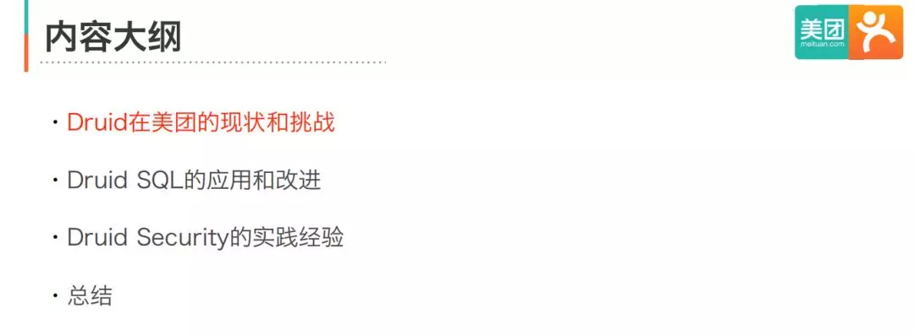

### 一、Druid 在美团的现状和挑战

#### 1.1 Druid 应用现状

美团从 16 年开始使用 Druid，集群版本从 0.8 发展到现在的 0.12 版本。线上有两个 Druid 集群， 总共大概有 70 多个数据节点。

数据规模上，目前有 500 多张表，100TB 的存储，最大的表每天从 Kafka 摄入的消息量在百亿级别。查询方面，每天的查询量有 1700 多万次，这里包括了一些程序定时发起的查询，比如风控场景中定时触发的多维查询。性能方面，不同的应用场景会有不同的要求，但整体上 TP99 响应时间在一秒内的表占了 80%，这和我们对 Druid 的定位——秒级实时 OLAP 引擎是一致的。

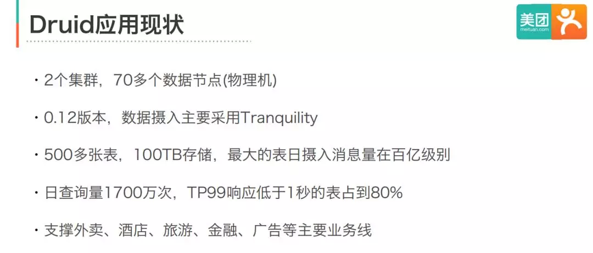

#### 1.2 Druid 平台化挑战

把 Druid 作为一个服务提供给业务使用的过程中，我们主要遇到了易用性、安全性、稳定性三方面的挑战。

易用性：业务会关心 Druid 的学习和使用成本有多高，是否能很快接入。大家知道，Druid 本身对数据写入和查询只提供了基于 JSON 的 API 接口，你需要去学习接口的使用方法，了解各种字段的含义，使用成本是很高的。这是我们希望通过平台化去解决的问题。

安全性：数据是很多业务的核心资产之一，业务非常关心 Druid 服务能否保障他们的数据安全。Druid 较早的版本对安全的支持较弱，因此这一块也是我们去年重点建设的部分。

稳定性：一方面需要解决开源系统落地过程中出现的各种稳定性问题，另一方面，如何在查询逻辑不可控的情况下，在一个多租户的环境中定位和解决问题，也是很大的挑战。

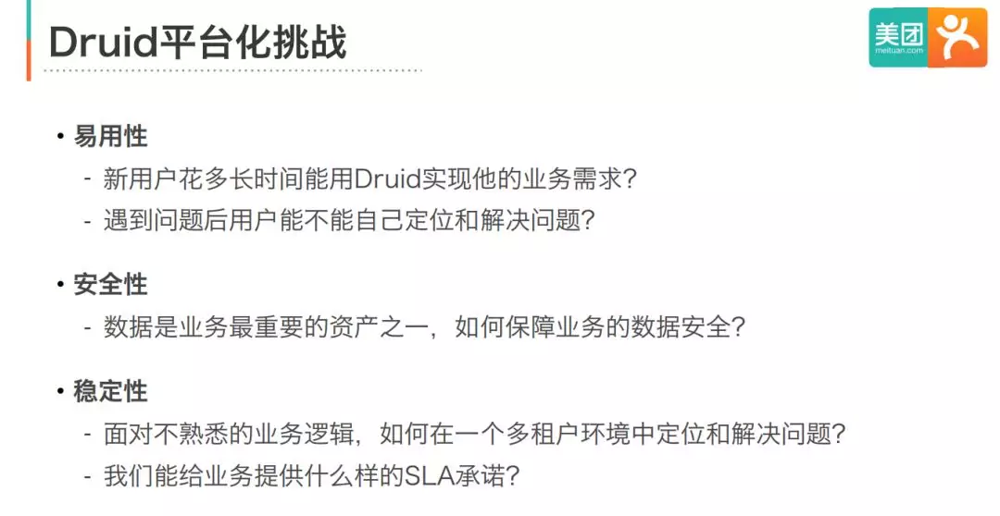

### 二、Druid SQL 的应用和改进

在 Druid SQL 出现之前，Druid 查询通过基于 JSON 的 DSL 来表达（下图）。这种查询语言首先学习成本很高，用户需要知道 Druid 提供了哪些 queryType，每种 queryType 需要传哪些参数，如何选择合适的 queryType 等。其次是使用成本高，应用需要实现 JSON 请求的生成逻辑和响应 JSON 的解析逻辑。

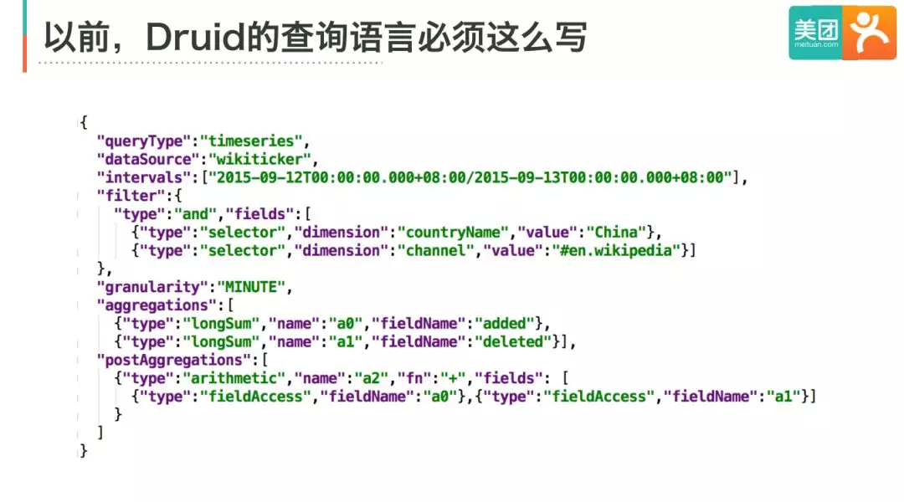

通过 Druid SQL，你可以将上面的复杂 JSON 写成下面的标准 SQL。SQL 带来的便利是显而易见的，一方面对于程序员和数据分析师没有额外的学习成本，另一方面可以使用类似 JDBC 的标准接口，大大降低了门槛。

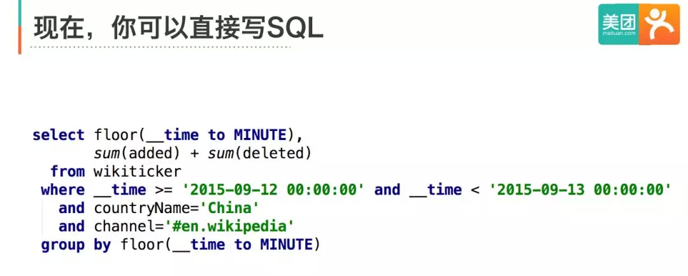

#### 2.1 Druid SQL 简介

下面我简单地介绍一下 Druid SQL。

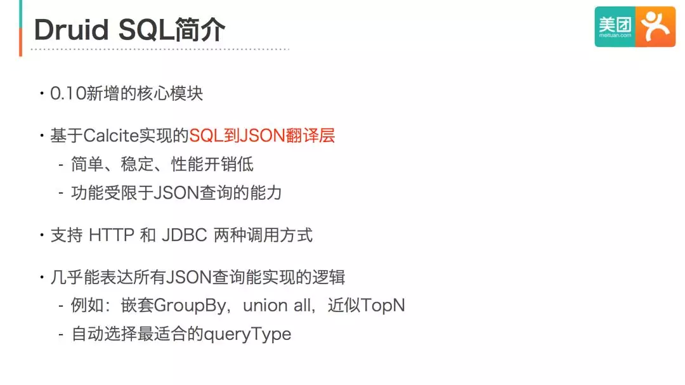

首先，Druid SQL 是 0.10 版本新增的一个核心模块，由 Druid 社区提供持续的支持和优化，因此不管是稳定性还是完善性，都会比其他给 Druid 添加 SQL 方言的项目更好。

从原理上看，Druid SQL 主要实现了从 SQL 到原生 JSON 查询语言的翻译层。由于只是做了一层语言的翻译，好处是 Druid SQL 对集群的稳定性和性能不会有很大影响，缺点是受限于原生 JSON 查询的能力，Druid SQL 只实现了 SQL 功能的一个子集。

调用方式上，Druid SQL 提供了 HTTP 和 JDBC 两种方式来满足不同应用的需求。最后表达力上，Druid SQL 几乎能表达所有 JSON 查询能实现的逻辑，并且它能自动帮你选择最合适的 queryType。

下面是三个 Druid SQL 的例子。

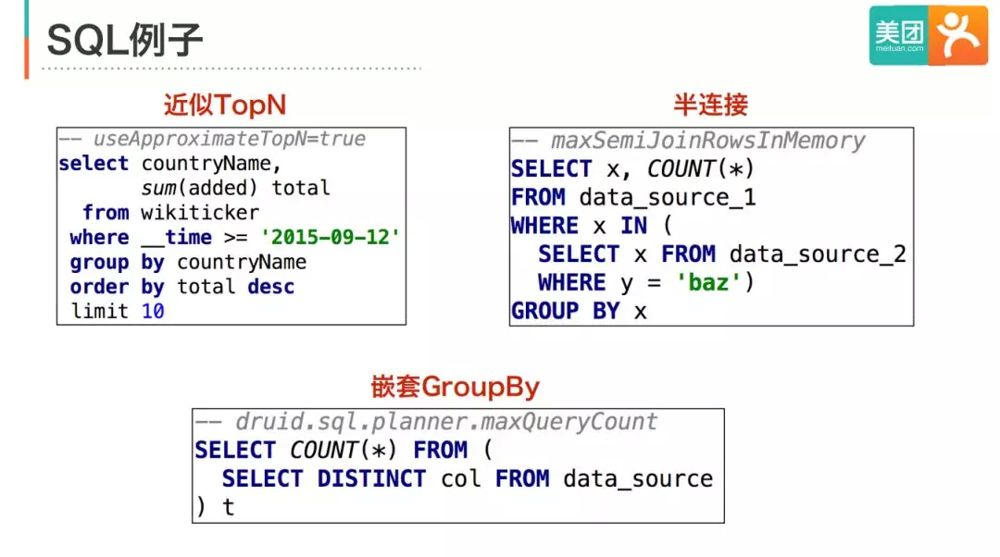

第一个例子是近似 TopN 查询。对于根据某个指标分析单个维度 TopN 值的需求，原生的 JSON 查询提供了一种近似 TopN 算法的实现。Druid SQL 能够识别出这种模式，生成对应的近似 TopN 查询。

第二个例子是半连接。我们知道 Druid 是不支持灵活 JOIN 的，但业务经常会有这样的需求，就是以第一个查询的结果作为第二个查询的过滤条件，用 SQL 表达的话就是 in subquery，或者半连接。Druid SQL 对这种场景做了特殊支持，用户不需要在应用层发起多个查询，而是写成 in subquery 的形式就行了。Druid SQL 会先执行子查询，将结果物化成外层查询过滤条件，然后再执行外层的查询。

最后是一个嵌套 GroupBy 的例子。Druid SQL 能够识别出这种多层的 GroupBy 结构，生成对应的原生嵌套 GroupBy JSON 。

#### 2.2 Druid SQL 架构

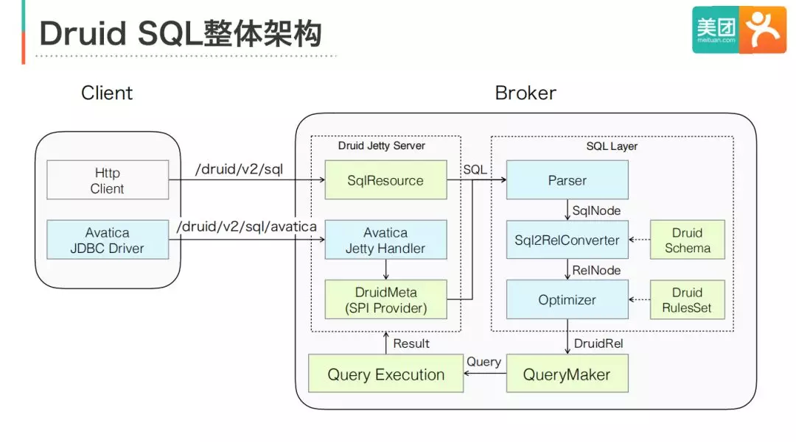

下面介绍 Druid SQL 的整体架构。

Druid SQL 是在查询代理节点 Broker 中实现的功能，主要包含 Server 和 SQL Layer 两个模块。

Server 模块负责接收和解析请求，包括 HTTP 和 JDBC 两类 。对于普通的 HTTP 请求，新增相应的 REST Endpoint 即可。对于 JDBC，Druid 复用了 Avatica 项目的 JDBC Driver 和 RPC 定义，因此只需要实现 Avatica 的 SPI 就行了。由于 Avatica 的 RPC 也是基于 HTTP 的，因此两者可以使用同一个 Jetty Server。

SQL Layer 负责将 SQL 翻译成原生的 JSON 查询，是基于 Calcite 项目实现的。Calcite 是一个通用的 SQL 优化器框架，能够将标准 SQL 解析、分析、优化成具体的执行计划，在大数据领域得到了广泛的使用。图中浅绿色的组件是 Calcite 提供的，浅蓝色的组件是 Druid 实现的，主要包括三个。

首先，DruidSchema 组件为 Calcite 提供查询解析和验证需要的元数据，例如集群中包含哪些表，每张表各个字段的名称和类型等信息。RulesSet 组件定义了优化器使用的转换规则。由于 Druid SQL 只做语言翻译，因此这里都是一些逻辑优化规则（例如投影消除、常量折叠等），不包含物理优化。通过 RulesSet，Calcite 会将逻辑计划转成 DruidRel 节点，DruidRel 包含了查询的所有信息。最后，QueryMaker 组件会尝试将 DruidRel 转成一个或多个原生 JSON 查询，这些 JSON 查询最终提交到 Druid 的 QueryExecution 模块执行。

#### 2.3 API 选择: HTTP or JDBC

Druid SQL 提供了 HTTP 和 JDBC 两种接口，我应该用哪个？我们的经验是，HTTP 适用于所有编程语言，Broker 无状态，运维较简单；缺点是客户端处理逻辑相对较多。JDBC 对于 Java 应用更友好，但是会导致 Broker 变成有状态节点，这点在做复杂均衡时需要格外注意。另外 JDBC 还有一些没有解决的 BUG，如果你使用 JDBC 接口，需要额外关注。

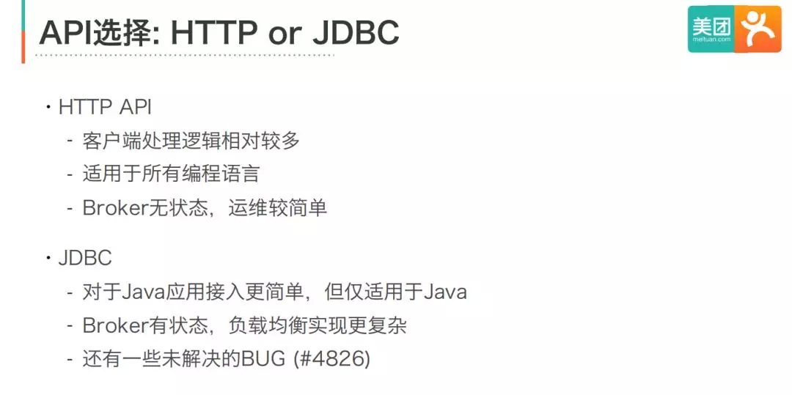

#### 2.4 改进

下面介绍我们对 Druid SQL 做的一些改进。

第一个改进是关于 Schema 推导的性能优化。我们知道 Druid 是一个 schema-less 系统，它不要求所有的数据的 schema 相同，那如何定义 Druid 表的 schema 呢？社区的实现方式是：先通过 SegmentMetadataQuery 计算每个 segment 的 schema，然后合并 segment schema 得到表的 segment，最后在 segment 发生变化时重新计算整个表的 schema。

社区的实现在我们的场景下遇到了三个问题。第一是 Broker 启动时间过长。我们一个集群有 60 万个 segment，测试发现光计算这些 segment 的 schema 就需要半小时。这会导致 Broker 启动后，需要等半个小时才能提供服务。第二个问题是 Broker 需要在内存中缓存所有 Segment 的元数据，导致常驻内存增加，另外 schema 刷新会带来很大的 GC 压力。第三个问题是，社区方案提交的元数据查询量级与 Broker 和 Segment 个数的乘积成正比的，因此扩展性不好。

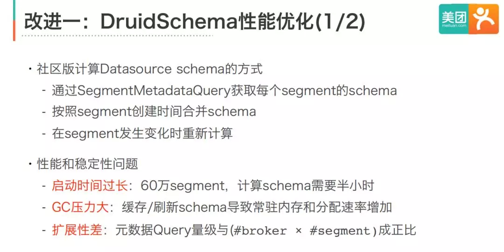

针对这个问题，我们分析业务需求和用法后发现：首先 schema 变更是一个相对低频的操作，也就是说大部分 segment 的 schema 是相同的，不需要去重复计算。另外，绝大数情况业务都只需要用最新的 schema 来查询。因此，我们的解决方案是，只使用最近一段时间，而不是所有的 segment 来推导 schema。改造后，broker 计算 schema 的时间从半小时降低到了 20 秒，GC 压力也显著降低了。

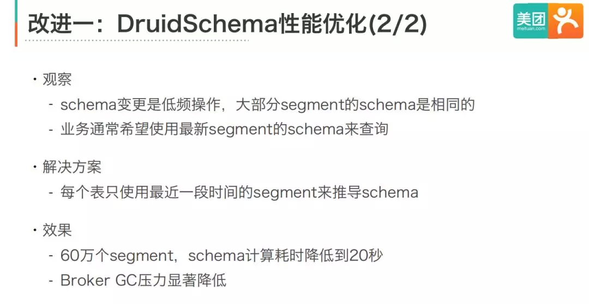

第二个优化是关于日志和监控。请求日志和监控指标是我们在运维过程中重度依赖的两个工具，比如慢查询的定位、SLA 指标的计算、流量回放测试等都依赖日志和监控。但是 0.12 版本的 SQL 既没有请求日志，也没有监控指标，这是在上线前必须要解决的问题。我们的目标有两个：首先能记录所有 SQL 请求的基本信息，例如请求时间、用户、SQL 内容，耗时等；其次能将 SQL 请求和原生的 JSON 查询关联起来。因为执行层面的指标都是 JSON 查询粒度的，我们需要找到 JSON 查询对应的原始 SQL 查询。

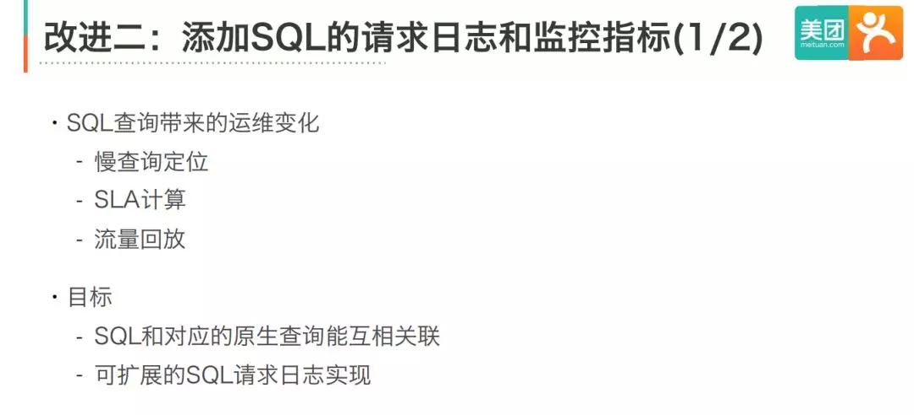

我们的解决方案已经合并到 0.14 版本。首先，我们会给每个 SQL 请求分配唯一的 sqlQueryId。然后我们扩展了 RequestLogger 接口，添加了输出 SQL 日志的方法。下图是一个例子，对于每个 SQL 请求，除了输出 SQL 内容外，也会输出它的 sqlQueryId，可以用来与客户端的日志做关联。还会输出 SQL 对应的每个 JSON 查询的 queryId，可以用来和 JSON 查询做关联分析。

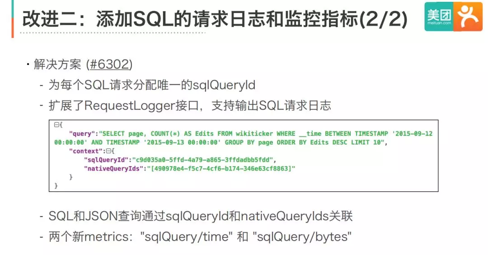

第三个改进虽然比较小，但是对服务的稳定性很重要。我们知道，JSON 查询要求用户指定查询的时间范围，Druid 会利用这个范围去做分区裁剪，这对提高性能非常重要。但是 Druid SQL 并没有这方面的限制。用户写 SQL 经常会忘记加时间范围的限定，从而导致全表扫描，占用大量的集群资源，是一个很大的风险。所以我们添加了对 where 条件的检查，如果用户没有指定时间戳字段的过滤条件，查询会直接报错。

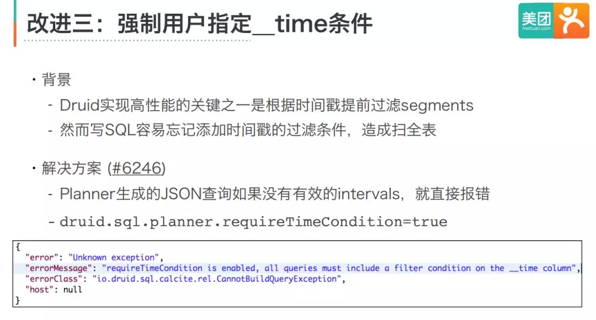

### 三、Druid Security 的实践经验

首先介绍我们在数据安全上面临的问题。当时使用的是 0.10 版本，这个版本在数据安全上没有任何的支持，所有的 API 都没有访问控制，任何人都能访问甚至删除所有的数据，这对业务的数据安全来说是一个非常大的隐患。

我们希望实现的目标有五点：所有 API 都经过认证、实现 DB 粒度的权限控制、所有数据访问都有审计日志、业务能平滑升级到安全集群、对代码的改动侵入性小。

为了实现这些目标，我们首先调研了 Druid 在后续版本中新增的安全功能。

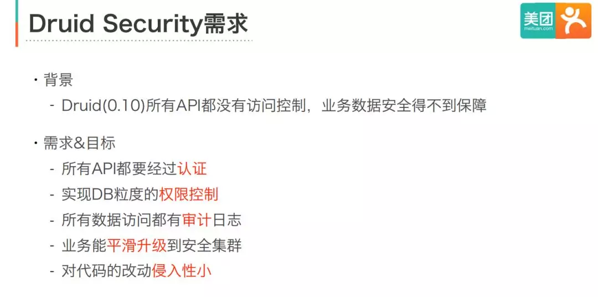

#### 3.1 Druid Security 功能和原理

0.11 版本支持了端到端的传输层加密（TLS），能够实现客户端到集群，以及集群各个节点之间的传输层安全。0.12 版本引入了可扩展的认证和鉴权框架，并且基于这个框架，提供了 BA 和 Kerberos 等认证方式，以及一个基于角色的鉴权模块。

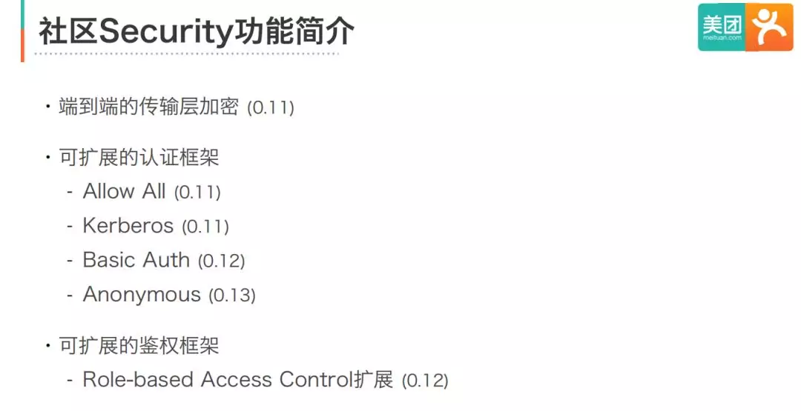

下面这张图介绍认证鉴权框架的原理和配置。

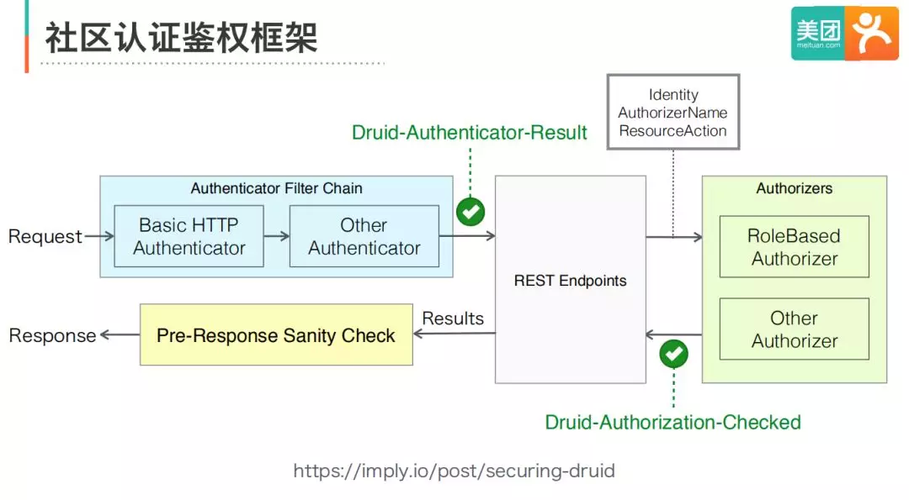

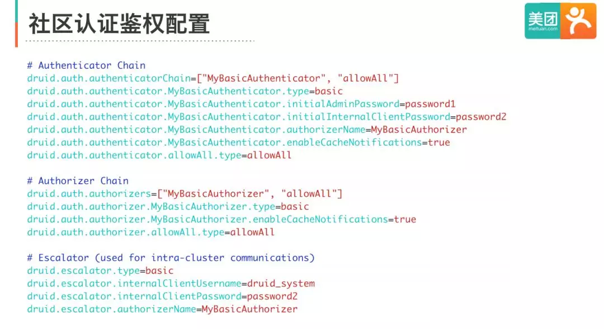

#### 3.2 Druid Security 社区方案缺点

社区方案能满足我们大部分的需求，但还存在一些问题。

第一个问题是我们发现浏览器对 BA 认证的支持很差。因此对于 Web 控制台，我们希望走统一的 SSO 认证。

第二个问题是为了支持业务平滑过渡到安全集群，上线初期必须兼容非认证的请求，当时我们使用的 0.12 版本没有该功能。

第三个问题是社区基于角色的鉴权模块只提供了底层的管理 API，用户直接使用这些 API 非常不方便。

最后一个问题是社区还不支持审计日志。

针对这些问题，我们做了三个主要的改进。

#### 3.3 改进

**改进一：基于 DB 的访问控制**

首先，为了简化权限的管理，我们引入了 DB 的概念，并实现了 DB 粒度的访问控制。业务通过 DB 的读写账号访问 DB 中的表。

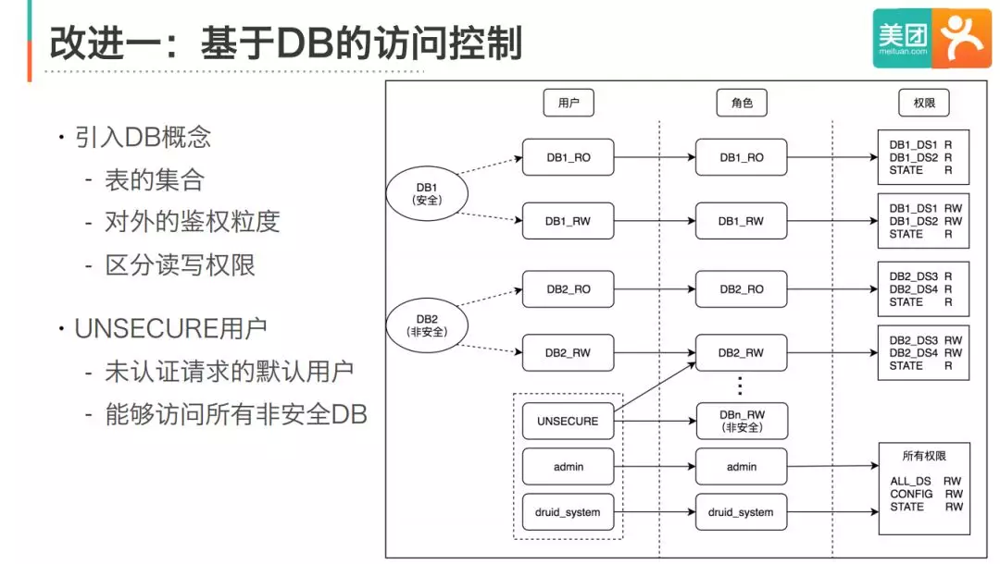

**改进二：自动管理权限 DB**

通过任务接入平台维护 DB 和 DataSource 的映射关系，并在 DB 和 DataSource 发生变化时，调用鉴权模块接口更新权限 DB。

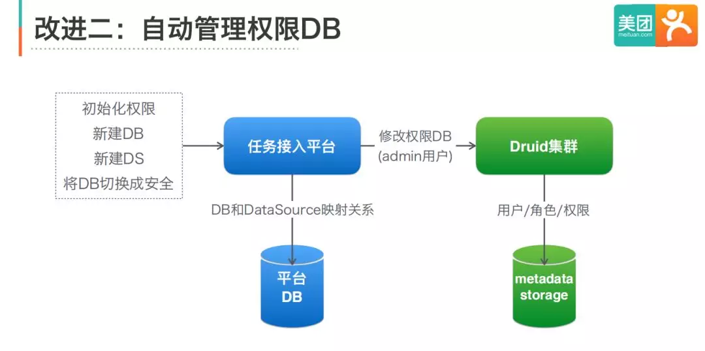

**改进三：支持 SSO 认证和非认证访问**

自定义认证链条，通过 SSO 认证 Filter 实现 Web 控制台的 SSO 认证，通过非安全访问 Filter 兜底，兼容非认证的请求。

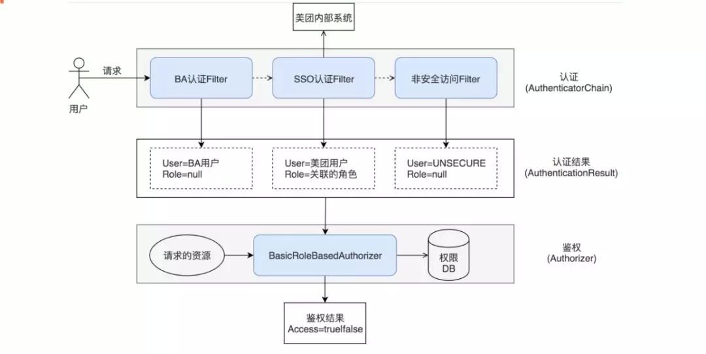

**注意事项**

1. 使用 0.13 以上版本 （或者 cherrypick 高版本的 bugfix）
2. 上线流程
* 启用 basic-security 功能，用 allowAll 兜底
* 初始化权限 DB，创建匿名用户并授权
* 将 allowAll 替换为 anonymous
* 逐步回收匿名用户的权限
3. 上线顺序：coordinator->overlord->broker->historical->middleManager

### 四、总结

#### 4.1 关于 SQL

1. 如果还在用原生的 JSON 查询语言，强烈建议试一试
2. 社区在不断改进 SQL 模块，建议使用最新版本
3. Druid SQL 本质上是一个语言翻译层
* 对查询性能和稳定性没有太大影响
* 受限于 Druid 本身的查询处理能力，支持的 SQL 功能有限
4. 要留意的坑
* 大集群的 schema 推导效率
* Broker 需要等 schema 初始化后再提供服务（\#6742）

#### 4.2 关于 Security

1. Druid 包含一下 Security 特性，建议升级到最新版本使用
* 传输层加密
* 认证鉴权框架
* BA 和 Kerberos 认证
* RBAC 鉴权
2. 认证鉴权框架足够灵活，可根据自身需求扩展
3. 经历生产环境考验，完成度和稳定性足够好
4. 上线前应充分考虑兼容性和节点更新顺序

#### 作者介绍：

高大月，Apache Kylin PMC 成员，Druid Commiter，开源和数据库技术爱好者，有多年的 SQL 引擎和大数据系统开发经验。目前在美团点评负责 OLAP 引擎的内核开发、平台化建设、业务落地等工作。

**本文来自 高大月 在 DataFun 社区的演讲，由 DataFun 编辑整理。**
