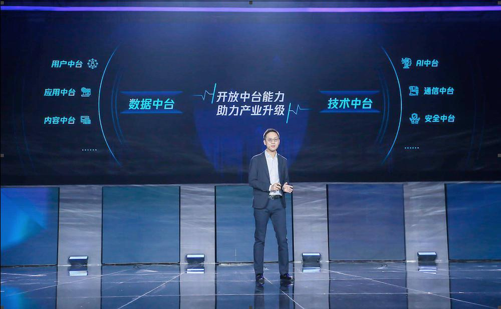
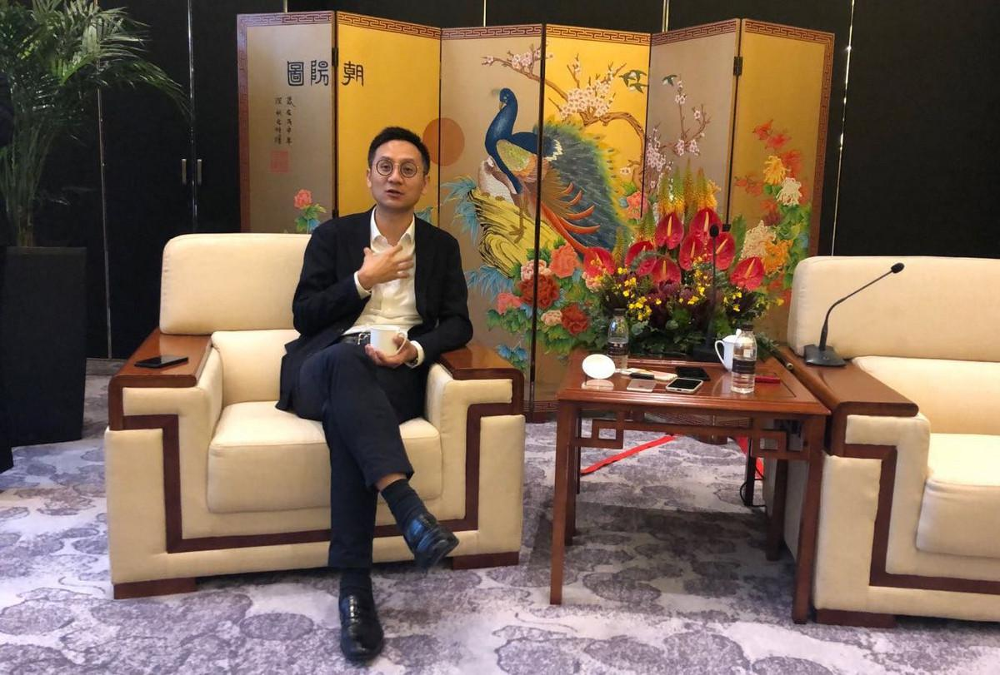

## 对话腾讯CSIG总裁汤道生：腾讯不想变成一家有十万销售的集成公司_36氪  

> 发布: 苏建勋  
> 发布日期: 2019-05-22  

执掌腾讯 CSIG（云与智慧产业事业群）八个月后，汤道生对于腾讯 To B 的思路有了新的变化。

5 月 21 日，2019腾讯全球数字生态大会在昆明举行，汤道生登台后，宣布腾讯将进一步开放数据中台和技术中台。其中，数据中台包括用户中台、内容中台、应用中台等；技术中台包括通信中台、AI中台、安全中台等。

时间拨回至去年 11 月， **当时谈及腾讯是否要做中台时，汤道生还颇为谨慎。他谈到两点疑虑，一个围绕技术积累：“不是中台技术才算技术，后台的不算吗？只考虑中台是非常偏颇的。”一个关乎用户隐私：“不会为了自身业务需要，硬把用户使用的不同产品场景去打通。”**

如今再次提起中台，汤道生的态度明显缓和了许多，他将中台定义为一种能力，能够让客户灵活应用到各类场景中的能力。比如用户中台，可以给客户提供用户增长、会员管理等能力。

“过去我们对于中台的概念有些模糊，有点被对号入座了。”在昨日会后的采访中，汤道生告诉 36 氪。在他看来，此前业内对腾讯的中台有些误读： **“把中台理解为会把你的QQ、微信、视频等每一个业务数据打通，放在一起。其实不是这样的。”**

在腾讯内部，对于是否能跨产品获取用户数据等原则，汤道生态度坚决。“哪怕都是腾讯的产品，用户也不希望我在 QQ 上的行为喜好被微信体现出来。我们从始至终都尊重用户的选择。”汤道生对 36 氪说。

腾讯公司高级执行副总裁、云与智慧产业事业群总裁汤道生

厘清中台的界限，什么值得做，什么不能做，成为汤道生团队近一年来的准备工作。他们既要在腾讯过往 20 年的技术与场景积累中抽选出企业客户愿意买单的能力，并将其 API 化与标准化；还要小心维护腾讯最重要的用户隐私安全。

从前端业务来看，腾讯开放中台能力，一定程度表明其曾被质疑的技术资源整合能力有所提升；而随着该业务的层层推进，腾讯需要在人事管理、组织架构、利益再分配等环节持续配合，这意味着腾讯自去年“930”以来进行的战略重整将进入“深水区”。

**BG（事业群） 协同成为腾讯架构调整后改善最为明显的问题之一。** 此前由于腾讯各项产品分散在不同事业群，对外难以形成统一窗口，不少企业客户对此颇有微词。曾有一家消费品厂商负责人对 36 氪表示：“找腾讯要零售方案，发现做小程序要去找WXG，做社交广告要找 CDG，要云的资源要找 SNG，沟通成本实在太高。”

如今，汤道生非常乐于分享腾讯 BG 之间相互支持的案例，他借用腾讯主管 TEG（技术工程事业群） 的高级执行副总裁卢山的话来说：“TEG 就是给 CSIG 往死里帮。”今年 1 月，汤道生与卢山牵头成立腾讯技术委员会，全面整合公司技术，推动各产品开源与上云。

“今天我们说拥抱产业互联网，不是指只有CSIG去拥抱产业互联网，这是集团大的战略，所有 BG 都参与其中。”汤道生说。

**组织层面的协调可以由高管意志出发迅速推进，但 To B 业务的持续落地，对于从社交、游戏起家的腾讯来说，仍需要一个漫长的周期。**

自去年 9 月末腾讯 CSIG 成立后，为了适配企业服务行业属性，腾讯 CSIG 开始在内部实现变革，一方面， CSIG 需要扩充 To B 领域销售、实施、交付层面的管理团队；另外， CSIG 也开始完善财务管理（比如应收应付账款的管理）、销售激励、交付生态等To B 链条的业务流程。

**不过，在具体的 To B 行业方案落地中，汤道生希望能把集成、交付类的工作更多交由合作伙伴，他不想让腾讯变成一家系统集成公司。**

“如果我要解决（To B）覆盖的问题，腾讯也不会成为一家拥有 10 万名销售的企业，我相信 10 万销售也无法解决这个问题。”汤道生对 36 氪说。

在与 36 氪等媒体的对话中，汤道生还围绕腾讯的部门协作、 To B 业务转型、To C“标签化”等话题，分享了他对腾讯战略调整8 个月以来的最新思考，以下为更多采访实录：

### 谈中台：数据中台并不是把 QQ、微信、视频的产品数据打通

**36 氪：** 你在上午的演讲中提到腾讯要开放数据中台与技术中台，但在去年，你谈到中台时还有一些技术与用户隐私层面的担忧，为什么会有这种转变？

**汤道生：** 首先我们对于数据隐私仍然是非常重视的，保护用户隐私是腾讯一贯坚持的。这个跟技术没有直接关系的。

这几年，我们在服务客户的过程中慢慢看到，腾讯有很多系统、服务是来自原有业务的能力，所以我们在内部做了一些梳理，通过开放把这些能力变成客户需要的工具。

过去大家讲中台还是一个相对模糊的概念，不同的人对于中台有不同的理解，有人说应该有业务中台，有人说应该有行业中台，是一个比较混乱的状况。

所以我也特意借这次大会的机会，从腾讯的角度解释一下，我也是技术背景出身，对中台有一定的思考，所以这次我们将中台分成两类。

**一类是跟数据类型相关的数据中台，包括用户中台、内容中台。** 为什么会特别去提这两个中台，这跟腾讯在过去20年积累的能力有很强的关系，因为腾讯这么多年就是在连接用户，所以腾讯走出去跟大家说我有管理用户的一个中台体系，我相信还是有说服力的。

在内容产业里，腾讯也是全球最大的内容服务提供商，我们把过去服务于内部业务的能力开放出来，建立内容中台也是毫无疑问有这些能力的。只是以前我们没有开放，没有包装成一个客户能理解的（方案），没有用中台这样一个概念去描述，

**第二类是技术中台，包括通信中台、安全中台和AI中台。** 这都是腾讯这几年在很多行业客户里面有实际实践的技术中台能力。腾讯就是靠即时通讯起家的企业，以前是服务于QQ、微信，今天我们把它API化，再结合运营商的一些能力，以此来服务不同的行业客户。

汤道生接受 36 氪等媒体采访；拍摄：苏建勋

**36 氪：** 腾讯搭建中台的难点是什么？

**汤道生：** **难点是可能大家过去对于中台是一个非常模糊概念，有一个比较片面的解读认为，中台就是把QQ、微信、视频等每一个业务的数据打通，然后共享在一起。这个是腾讯不愿意做的。**

随着我们在产业互联网有更多实践，我们进一步厘清了中台是什么。腾讯的中台就是把腾讯过去服务内部业务过程中形成的能力进一步开放，以用户中台为例，可以为客户提供用户增长、用户沟通、用户数据保护、会员管理等完整工具。

**36 氪：** 中台是一个偏企业后端的概念，对于企业的业务与应用层来说，腾讯搭建中台对他们的意义是什么？

**汤道生：** 企业往往都有自己的ERP 与 CRM系统，对企业来说，腾讯提供的这些有价值的能力可以通过 API 的方式进行集成。

大家对于中台的理解可以是“被集成”的，原来这些能力都是服务于腾讯自己的产品。这几年在 To B 的业务实践里，我们陆续开发出广泛的API。随着腾讯的平台战略越走越深，企业对技术的需要不只限于一个产品界面。

### 谈组织协作：不是只有CSIG拥抱产业互联网，所有 BG 都参与其中

**记者：** 在腾讯的行业解决方案中，会涉及到至少1-2 个、甚至3个不同的 BG 吗？

**汤道生：** 有可能，CSIG不是腾讯 To B 产品的唯一生产力，但会是唯一的窗口。

所以我们给CSIG行业团队的定位是： **用统一的界面去服务我们的客户，但产品可以来自腾讯其他的部门。** 比如汽车行业，我们有车联出行的团队，它有针对自动驾驶的3D仿真系统的能力，当汽车客户提出云的需求，汽车团队也不用去把云的底层重新做一遍；再比如智慧4S店这个产品，也涉及到企业微信的能力。

所以今天腾讯说扎根消费互联网，拥抱产业互联网，不是说公司其他BG继续扎根消费互联网，只有CSIG 去拥抱产业互联网，这是公司集团大的战略，大家都参与其中。

腾讯内部合作还是非常高效的，卢总（腾讯高级副总裁卢山卢山）在多个场合都公开去讲，TEG就是要给 CSIG 往死里帮，这已经成为CSIG跟TEG紧密合作的一个体现。

**记者：** 腾讯 CSIG 是整个腾讯新鲜血液最多的一个事业群，腾讯如何为这些来自各行各业的新进员工（特别是销售人才）统一一个标准？

**汤道生：** 第一，我们会花比较多的时间去拜访客户，这是To B业务里很重要的环节。然后我们也吸纳了很多不同类型的人才，的确，我们也很担心怎么去管理好这个多元化的团队。所以我们也在不断加大文化建设上的投入。

最近CSIG内部有一个文化升级的动作，就是希望能够跟来自不同企业的员工共享共同的价值观，比如我们会提到关注客户口碑，这是一个比讲客户价值更高的要求，不仅仅是说交付完就OK了，还要让客户喜欢你。

### 谈业务转型：腾讯不会成为一个有十万名销售的企业

**记者：** 从去年”930“调整后，你的管理模式、管理风格，团队做事的方式有没有产生一些变化？可否举例谈谈？

**汤道生：** 以前做To C产品，从用户的角度就能找到问题或者优化的空间。但是To B业务，我们不再是最终用户，需要跟多个客户去交流，用这个行业的共性需求来帮我们排优先级，这是很不一样的模式。

To C的链条相对短，但 To B 的业务流程就特别复杂。从合同管理；到交付合作生态中的采购设计；再到财务管理、销售激励、应收应付账款的管理，都是在原来To C业务不涉及的。 **所以腾讯本身内部的流程都需要做比较大的改变，才能够有效地去更好地去做这个2B的业务。**

**36 氪：** 很多企业客户对腾讯用C 端经验服务 B 端的方式会有一些疑虑，你觉得这种思路会有一些局限吗？

**汤道生：** **我觉得最终没有太大的必要去标签 To B和 To C。因为人很容易因为标签而忘掉背后的逻辑。** 所以我更多提醒自己到底要解决什么问题，或者这个业务的属性是什么，我要通过什么手段去解决这些问题。

如果我需要解决（ To B）覆盖的问题，那腾讯不会成为一个有十万销售的企业，我相信十万个销售也不能解决这个问题。

所以我们就会想怎么去建设生态，在各个区域有很多合作伙伴，他们是长期获得客户信任的，我们有很好的合作基础。所以我在想怎么让这些合作伙伴的销售有动力卖我们的东西，或者反过来，让我们的销售有动力去卖合作伙伴的产品，这里涉及到很多机制，我更愿意从问题的本身去思考。

**36 氪：** 现在来看，腾讯很多企业客户案例都是基于 C 端用户的数字化，但 B 端客户的需求不仅于此，腾讯该如何把产业互联网的改造延伸至诸如供应链等后端环节？

**汤道生：** **为什么腾讯要把所有的事都做了呢？** ERP已经是比较成熟的市场，也有经验丰富的玩家。我不认为腾讯什么都该碰。

过去大家挑战腾讯的是太贪心，什么都想碰。我觉得To B跟To C是一样的，腾讯在互联网领域只选择了社交和内容，其他很多领域是不需要我们自己去做的。

回到To B，我们选择去帮助企业升级， **第一是要看我有什么资产，或者我有什么能力是客户在意的。** 如果我硬要去解决某个环节的问题，比如说供应链的问题，我又不具备这个能力，是没有说服力的。

另外，企业需求是多方面的，我更倾向于去跟客户交流，了解他有什么问题，或者他对于腾讯哪方面的能力感兴趣。只有搞清楚客户想解决什么问题，而恰恰你有工具帮他解决才是最 Match（契合） 的。如果我有的东西他不需要，那就不是一个闭环。

（我是36氪记者苏建勋，如果您也关注腾讯To B的战略变化，欢迎与我交流，我的微信是 jason907，添加请备注姓名、职位、公司。）
