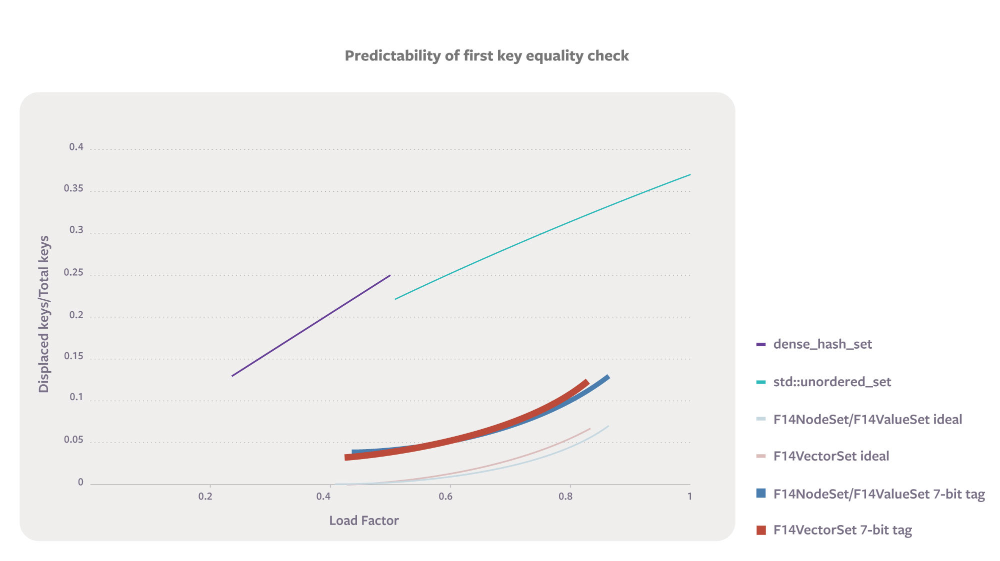
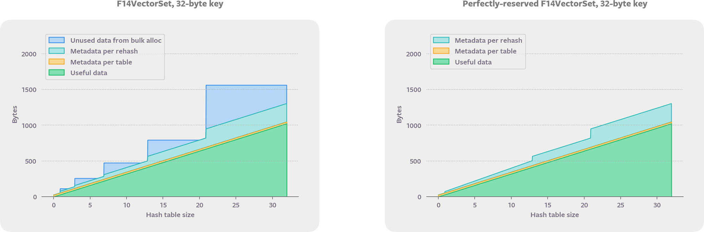

## Facebook开源 F14：更快速、更节省内存的哈希表  

> 作者: Facebook 博客  
> 译者: 杨旭东  
> 发布日期: 2019 年 5 月 16 日  


哈希表提供了一种快速的方法来维护一组键或键到值的映射，即使键是像字符串一样的对象。 它们是在计算机科学中无处不在的工具，所以即使是增量的改进也会产生巨大影响。 在 Facebook 内部，潜在的优化点导致哈希表的实现激增，而每个实现都有自己的优点和缺点。 为了简化选择正确哈希表的过程，我们在自己的开源 C++ 组件库[Folly](https://github.com/facebook/folly)中构建了 F14，一个 14 通道探测哈希表。 F14 哈希表超越了我们之前的特定实现，同时避免了它们的缺点。 不管在什么用例下，F14 都是一个很好的默认选择，绝不是坏的选择。

在编程论坛上，当工程师问“什么是最好的 C++ 哈希表？”时，他们实际上是指“哪个 C++ 哈希表在我的使用场景下有最好的权衡取舍？” 对于我们来说，这个问题曾经导致了一连串的后续问题。例如：

* 你是否保留了指向条目的长期引用或指针？
* 你关心 CPU 或内存使用情况吗？
* 你的键有多大？
* 你的表有多大？
* 插入、搜索和迭代之间的操作组合是什么？
* 键是字符串吗？
* 你多久删除一次？
* …你能发布一个代码链接吗？

显然，当有太多因素需要考虑时，很难做出最佳选择。 使用 F14，我们将此问题列表简化为一个简单的选择：如果您不保留对条目的长期引用，请从`folly::F14FastMap/Set`开始。 否则，从`folly::F14NodeMap/Set`开始。 F14 是 Facebook 的开源 C++ 组件库 Folly 的一部分。

### 使用 F14 改进哈希表实现

哈希表的速度很快，所以很有用。查找、插入和删除操作的理论平均时间复杂度为最佳的 O\(1\) ——意味着无论哈希表有多大，在任何计算机上执行这些操作所需的平均步数都有一个固定的上限。当然，在实践中，一个哈希表实现可能始终优于另一个。我们无法改进哈希表的理论时间复杂度，但我们可以改进实现。特别地，F14 提供了性能和内存的实际改进，它通过利用现代 CPU 上可用的向量指令、提供多个内存布局以及仔细关注细节来实现这一点。它易于使用、与测试工具集成、并默认启用高级功能。

哈希表首先计算每个键的数值哈希码，然后使用该数值获得数组的索引。一个键的哈希码始终是一样的，而不同键的哈希码则可能不同。这意味着哈希表中的键随机分布在数组的槽位中。哈希表算法之间的大部分差异来自于它们如何处理冲突（映射到同一个数组索引的多个键）。算法通常使用链接的方法来处理冲突，比如，使用辅助数据结构（如链表）来存储同一槽位的所有键；或者使用探测，它将键直接存储在主数组中，然后在发生冲突时继续检查新的槽位。


如果我们将键的数量除以主数组的大小，会得到一个称为 _负载因子_ 的数值，它是哈希表的完整度的度量。通过使主数组变大来减小负载因子能减少冲突次数，但会浪费内存。通常，哈希表通过重新哈希或将条目移动到一个新的更大的数组来防止负载因子变得过高。

C++ 的标准模板库（STL）通过`std::unordered_map`和`std::unordered_set`提供哈希表实现。该标准实现保证了引用稳定性：在删除相应的键之前，哈希表中的键和值的引用和指针必须保持有效。实际上，这意味着条目必须是间接且单独分配内存的，这会增加大量的 CPU 开销。 Folly 选择公开了一个没有引用稳定性的快速 C++ 类，以及一个在单独的节点中分配每个条目的较慢的 C++ 类。基于节点的版本不完全符合标准，但它与我们看到的所有实际代码中的标准版本兼容。

### 使用向量指令减少冲突

冲突是哈希表的祸根：解决它们会产生不可预测的控制流并需要额外的内存访问。现代处理器的快速在很大程度上是建立在流水线操作的基础上的 —— 每个核心都有许多执行单元，允许指令的实际工作相互重叠。只有当 CPU 能够准确预测 if 语句和循环语句的结果时，此策略才能正常工作。然而，很难预测键是否会发生冲突。

F14 的核心思想是使用哈希码将键映射到一个块（一组槽位）而不是一个单独的槽位，然后在块内并行搜索。块内搜索使用向量指令（SSE2 或 NEON）同时筛选块内的所有槽位。我们称之为算法 F14，因为它一次筛选了 14 个槽（这个块大小是对缓存对齐和冲突率的良好折衷）。如果块溢出或者两个键都通过了筛选步骤，则 F14 执行冲突解决。当两者都没有发生冲突时，两步搜索比普通哈希表算法要多做了一些工作，但 F14 总体上更快，因为冲突干扰指令流水线的可能性降低了很多。


\(完整哈希码的低位用来确定块，高位用于筛选块中的哪些槽位可能保存搜索键\)

分块是一种有效的策略，因为表的 15 个键映射到具有 14 个槽位的块的可能性远低于两个键映射到一个槽位的可能性。例如，假设你在一个有 180 人的房间里，另一个人与你相同生日的机会大约是 50％，但是有 14 个人出生在同一个星期的机会远远低于 1％。即使负载因子超过 80％，分块策略也能保持较低的冲突率。即使房间里有 300 人，两周“溢出”的可能性仍然不到 5％。

下面是算法在它查找的第一个位置找不到搜索键的可能性的图表。图表中最理想的地方是右下角，高负载因子可以节省内存，而且没有碰撞意味着可以通过可预测的控制流快速找到键。你会注意到该图包含“F14 理想”和“带有 7 位标记的 F14”的行。前者仅包括块溢出，而后者反映实际算法。即使使用高质量的哈希函数，两个键具有相同的 7 位标记的概率为 1/128。



### 引用计数的“石碑”

大多数探测策略一直在寻找，直到找到一个空槽位，这使得删除键变得棘手。该算法必须留下一个“石碑“（一个不会终止探测搜索的空槽）或者向下滑动探测序列中的后一个键，这对于稳健的探测策略来说非常复杂。在混合插入和删除的工作负载中，逻辑删除可以累积。从性能角度来看，累积的石碑导致类似高负载因子的效果；而从内存利用率的角度来看，它又像低负载因子的效果。这样两种不同的效果确实是很糟糕的。

F14 采用了一种新颖的策略，其作用类似于引用计数的石碑。它基于 Amble 和 Knuth 在其 1974 年的文章“[Ordered hash tables](https://academic.oup.com/comjnl/article/17/2/135/525363)”中建议的每个槽位的辅助位。只要插入程序探测到已经满的槽位，就会设置该位。该位记录了一个槽位已溢出。石碑大致对应于设置溢出位的空槽。溢出位使搜索更快，因为即使以下槽位不为空，也可以在溢出位清零的完整槽位中停止搜索。

我们对溢出位思想的扩展是计算活动溢出的数量。这是可能的，因为即使它们实现与石碑相同的目的，溢出位也具有不同的生命周期。它们在插入替代键时设置，而不是在移除替代键时设置。在创建逻辑删除时，弄清楚有多少键依赖于逻辑删除是不切实际的，但是很容易跟踪依赖于溢出位的键数量。每个 F14 块使用 1 个字节的元数据来计算想要放置在块中但当前存储在不同块中的键的数量。当一个键被删除时，它会在其探测序列上的所有块上递减溢出计数器，然后清除它们。这符合我们的目标，即使 F14 在各种场景中都能很好地工作：具有连续插入和删除功能的长寿命的映射 / 集合。溢出计数也可以加速不调用删除的 F14 表；它们缩短了探针长度并减少了复制构造必须执行重复的机会。

### 使用多种布局优化内存

减少内存浪费是可以直接获利的。允许更多的程序数据进驻缓存可以帮助提高性能，这可以加快哈希表和周边代码的速度。哈希表内存布局的两种常见策略分别为间接存储（通常使用存储在主数组中的指针）和直接存储（将键和值的内存直接合并到主哈希数组中）。直接存储算法必须使用探测来解决冲突，除非它们存储其他元数据。 F14 采用了指针间接存储（F14Node）和直接存储（F14Value）两种版本，以及不太常见的间接索引（F14Vector）。

我们可以通过将内存使用分门别类来检查不同内存布局方案的利弊权衡。让我们将存储键和值的空间称为数据，将其他所有存储空间称为元数据。数据空间与键和值的大小成比例；元数据空间独立于键和值的类型。内存使用的类别包括：

* 有用的数据空间：实际用来保存用户插入的条目的字节数，没有通用的方法可以减少这个部分。
* 由于最大负载因子导致的不可用数据空间：如果主数组被填满，则探测冲突解决效率会降低，因此必须在此发生之前对整表重新哈希。例如，探测通常使用 0.5 的最大负载系数，这意味着在重新发生哈希之前，不超过一半的索引可以被填充。因此，浪费了未被索引中的数据空间。在负载因子为 0.5 的情况下，我们可以说对于有用数据的每个字节，都有一个对应的字节空间被浪费了，这是由于负载因子引起的 100％的额外开销。 F14Value 大大改善了这一点，它通常使用的最大负载因子为 12/14。
* 由于批量分配而未被使用的数据空间：虽然指针间接哈希表可以在插入期间一次为一个键分配数据空间，但具有直接或索引间接内存布局的数据空间在重新哈希期间批量分配数据空间。虽然批量分配的 CPU 效率更高，但并非所有空间都能最终被使用。最常见的重新哈希策略是将容量加倍，以便在最坏的情况下，批量分配导致实际使用的可用数据空间只有一半。如果算法不限定表的大小为 2 的指数，则当调用者使用 reserve 时可以避免这种开销，但这与使用 bitwise 以及在索引之间均匀分布哈希码的常用性能优化方法不兼容。
* 每个表的元数据：哈希表数据结构有一些基本开销，通常至少有一个指针和几个整数。此类别对于具有许多空表或小表的用例很重要，例如对于`folly::dynamic`中的哈希表。我们精心设计了 F14 哈希表，因此没有为空表动态分配空间，并且 C++ 类型本身很小：在 64 位平台上只有 24 字节（F14Vector）或 32 字节（F14Value 和 F14Node）。
* 每个插入操作的元数据：采样间接存储的链接技术在进行冲突解决时必须为链接指针分配一些字节。
* 每次重新哈希的元数据：此类别包括重新哈希期间分配的字节，而不是为将来存储数值而预留的字节，例如主数组中用于链接哈希表的指针或 F14 使用的辅助哈希。

下面的图表展示了用于保存 8 字节整数的哈希集合的开销。 这种基于探测标记的表类似于`dense_hash_set`，但最小容量为 2，并且根本不为空表分配空间。


STL 容器`std::unordered_set`从不浪费任何数据空间，因为它等到最后一刻才分配节点。 另一方面，对于像这样的小元素，元数据开销非常高。 每个数据项与指针的大小相同，因此元数据是数据大小的 2 倍到 3 倍。 尽管具有较小的最大负载因子，但使用标记的探测表最终使用较少的总内存，因为其数据空间浪费小于`std::unordered_set`的元数据浪费。


与`std::unordered_set`一样，F14NodeSet 为每个值执行单独的内存分配。它以块的形式存储指向值的指针。但由于使用了 F14 的探测冲突解决方案，因此没有链接指针，也没有每次插入的元数据。 F14ValueSet 以内联方式存储值，就像基于探测标记的表一样。它具有与早分配策略相同的数据浪费，这是内联存储所固有的。但由于使用更高的最大负载因子而具有更少的数据浪费。 F14ValueSet 实现了这种内存效率的提升，同时也避免了对标记的需求。

F14Node 和 F14Value 通常使用 12/14 的最大负载因子，因此当它们增长到超过 12 \* 2 ^ k（例如上图中的 24）的大小时会重新哈希。但是，如果你仔细观察，会看到它不是在 12 之后重新运行，而是在 14 之后。即使在完全完整的块中，筛选也能正常工作。所以当只有一个块时，我们会小心使用 100％的最大负载因子。实际上，筛选步骤意味着我们可以支持从 0 到 14 的每个容量，并且在查找或插入逻辑中也没有任何例外情况。如果未调用 reserve，则在大小为 2 和 6 之后会发生首次重新哈希。如果初始容量可用，我们可以为小型表提供更高的内存效率。

对于更大的值，元数据的相对空间开销会减少。下面四幅图描述了存储`std::string`时的情况。请注意，在这种情况下，每次插入元数据更大，因为`std::unordered_set`选择在节点中缓存哈希值。


F14 还提供了间接数组的内存策略。 F14Vector 将值存储在密集打包的向量中，主哈希数组中包含 4 字节索引。 当一个键被删除后，最后一个向量元素将移动到该键原来的位置，并调整相应的索引。 F14Vector 提供非常快速的迭代和析构。 对于较大的值，它也比 F14Value 更具存储效率，因为数据向量的大小可以设置为没有负载因子被浪费。 当事先知道最终大小时，我们可以通过独立调整数据向量和块数组来进一步节省成本。 这使我们可以将块的数量保持为 2 的幂，这对查找性能很重要，同时完全消除数据浪费。



F14VectorSet 实际上可以更准确地称为 F12VectorSet —— 我们使用 12 块来存储 4 字节索引，以便块完全装载进一个缓存行，并且我们使用 10/12 的最大负载因子。

### F14Fast：混合内存策略

上述图表让我们在一个特定尺度上比较内存效率，但一般结论呢？ 对于 32 字节键，F14ValueSet 比 F14VectorSet 使用更少的内存来容纳 24 个键，但它平均效率更高吗？ 本福德定律可以让我们计算出答案。 生产环境中的哈希表大小似乎遵循一系列尺度的本福德定律，这意味着找到具有特定负载因子`f`的表的概率与`1 / f`成比例。 这使我们可以独立于精确的重新哈希点来加权内存开销。

下图显示了平均内存效率，采用了条目大小的函数的展现形式。 使用本福特定律对负载因子进行加权。 图中的线条不平滑，因为它们还考虑到因为 jemalloc 默认分配类之间的间距而浪费的内存。 [微表基准测试](https://github.com/google/hashtable-benchmarks/)具有计算此图表的代码。


F14Vector 和 F14Value 都具有出色的性能。由于我们的目标是做出良好的默认选择，我们决定将它们拼接成混合存储策略，称为 F14Fast。当 value\_type 为 24 字节或更大时，此策略的作用类似于 F14Vector；否则，它就像 F14Value。`folly::F14FastMap`和`folly::F14FastSet`类型是我们代码库中最常用的类型。

### 可测试性

将现有代码转换为 F14 时，我们遇到了单元测试失败和生产环境崩溃，其主要原因是因为硬编码了特定迭代顺序的测试，或者是代码隐式依赖于哈希表实现的特定行为。例如，在 libstdc++ 的`std::unordered_map`重新哈希后，迭代器工作正常，即使它在标准中是未定义的行为。

为了确保代码不依赖于 F14 的迭代顺序，我们将其随机化以用于调试。在这种模式下，当插入新键时，F14 在一个块中的所有空槽位中随机选择。进入顺序并不是完全随机化的，但是随机打散足以通过少量运行来进行回归测试。

F14 还集成了 ASAN，可以概率性地检测引用和迭代器稳定性问题。在此模式下，所有非节点内存都在每个插入操作时以 1/size 的概率重新分配。代码片段如下：

复制代码

```
F14FastMap<.., ..> m;

auto& v1 = m[k1];

m[k2] = foo(v1); // m might rehash before calling foo!
```

修复此模式的一种方法是使用 reserve：

复制代码

```
m.reserve(m.size() + 2); // space for k1 + k2 to be added

auto& v1 = m[k1];

m[k2] = foo(v1);
```

当调用`m.reserve(m.size() + d)`时，该线程紧接着的 d 个插入操作将禁用虚假重新分配。到目前为止，这种简单的启发式方法足以避免任何误报。

### C++ 优化

加速代码的最佳方法是减少运行代码。 F14 减少了需要的对象构造，并在哈希表和周围代码中复制：

1. 异构查找及其变种：Facebook 代码经常使用字符串视图（`folly::StringPiece`和`std::string_view`）来提高文本处理代码的性能。这些类本身不管理内存，因此它们不是哈希表的良好键类型。但是，通常希望使用`std::string_view`在有`std::string`键的哈希表中进行搜索。通过使用可以哈希`std::string_view`和`std::string`的哈希函数，F14 避免了在这种情况下复制字符串内容的需要，从而允许调用代码减少工作量。 C++ 20 将允许您为只读 API 选择此类异构查找，例如`find`。 F14 在读取和写入 API 的任何地方都有异构查找。 重载操作符`[]`特别重要，其方便的语法意味着它会被大量用于查找现有键。我们还将异构查找作为所有类似字符串的键类型的默认选项。
2. insert 和 emplace 参数的析构：`operator []`API 和较新的无序映射 API `try_emplace`和`insert_or_assign`将搜索键作为单独的参数传递，这样可以轻松检查哈希表的已有条目，而无需构造`std::pair`条目。 emplace 是更有技巧的用法，因为它的参数被转发到`std::pair`的八个构造函数之一。 F14 map 在内部小心地与所有这些形式相匹配；如果他们发现将使用单个参数初始化该 pair 的第一个元素，那么它可以直接用于初始搜索。当与异构查找结合使用时，这尤其强大。 F14 的 map 插入方法只是转发到 emplace，依靠析构来提取键。
3. const 字段键解决方法：常量字段不能用作构造函数的源。这很不幸，因为`std::unordered_map`（和`std::map`）持有`std::pair<K const，T>`。对于基于节点的容器来说，这不是一个大问题，因为它们永远不需要移动条目，但是具有直接存储的哈希表必须做出艰难的决定。有四个选项：在每次重新哈希期间复制所有键、分发对`std::pair <K，T>`的可变引用、分发代理类、或依赖未定义的 C++ 行为。这些选项很慢、有风险（客户端可以更改键）、不兼容（也许我们可以在代理迭代器工作后再试一次）、并且很丑陋。仔细考虑之后，我们选择了丑陋，使用 const\_cast 使键在重新哈希中被析构之前可变。
4. 弃用（deprecated）警告取代`std::move_if_noexcept`：每当我们尝试将一个不是 noexcept 的类型放入 F14FastMap 或 F14FastSet 时，缺少 noexcept 注释是一个错误，而不是尝试使用复制来获取强有力的例外保证。另一方面，在尝试 F14 之前强迫用户修改他们的代码会给采用和实验带来障碍。作为妥协，我们总是移动键和值，但如果那些构造函数没有标记为 noexcept，那么我们会触发弃用警告。
5. 将可信哈希值列入白名单：一些哈希函数在其所有位（bit）上均匀分布信息 ——对输入的任何更改都会导致哈希代码发生大量更改。理想情况下，输入中的任何一位变化预计会改变输出的大约一半位。只需将顶部位置零，就可以将这些哈希函数映射到 2 的幂范围。例如，我们可以通过将除了底部五位之外的所有位置归零来将哈希码映射到 32 个块。

另一方面，我们有`std::hash`这样的整数类型哈希函数，它通常是标识函数。它符合 C++ 标准对哈希质量的要求（除非输入也相等，否则哈希码不太可能相等），但它根本不会传播信息。例如，如果我们只取底部的五位，那么如果所有整数键都是 32 的倍数，我们将遇到大量的冲突。如果哈希函数不分配信息，那么 F14 必须用一个位混合器来后处理哈希码。

位混合器只增加了几个延迟周期，但仍然值得优化，因为哈希表是在一些非常热点的循环内部使用的。 Folly 有一个可扩展的编译时白名单机制，可用于绕过混合器，例如`std::hash<std::string>`。当已知键均匀分布时，白名单也可用于禁用混合器。

Folly 的 F14 在 Facebook 内部广泛使用。 F14 运行良好是因为它的核心算法利用向量指令来提高负载因子，同时减少冲突。因为它支持不同场景的多个内存布局，并且因为我们已经注意到 API 端的 C++ 开销。 F14 是一个很好的默认选择——它使得 CPU 和 RAM 高效运行，在各种用例中都很强大。

原文链接： <https://code.fb.com/developer-tools/f14/>
