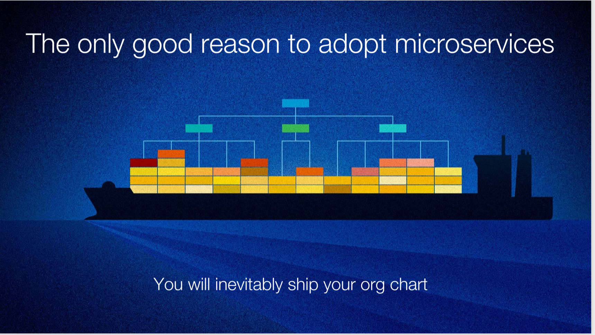

## 谷歌在微服务上的坑和教训  

> 译者: 禚娴静  
> 发布日期: 2019 年 5 月 14 日  

> Ben Sigelman 是 LightStep 的首席执行官兼联合创始人，他是 Dapper 的共同创始人（Google 的分布式跟踪工具，帮助开发人员理解他们的大型分布式系统），以及开源 OpenTracing API 标准的共同创建者（ 一个 CNCF 内的项目）。在 2018 年 12 月 QCon 大会上 Ben 向我们分享了谷歌在微服务构建路上遇到的经验教训，本文是 Ben 的演讲主要内容的译稿。

大家好，今天和在座的各位分享一些失败的经验教训。聊一聊这一类的话题要比那些成功案例更有意思。行业在进步，我们可以从过去的错误中吸取经验，并主动在未来的计划中避免，这一点很令人鼓舞。

### 第一部分 背景信息

在开始之前，先介绍一下我在谷歌的经历。2003 年大学毕业后我直接加入了谷歌，在这之前我是一个音乐营地的营地顾问，营地顾问之前我在一家冰激凌店工作。我还记得在谷歌的第一天，第一个项目的技术负责人是 Andrew Fights，他现在是类似谷歌杰出的工程师的角色，我记得当时告诉他，我得去找人聊一聊因为实在不知道我在做什么，今天想起来还是很有趣的事情。在谷歌里我像海绵一样快速的吸收技术和其他的信息。今天我在这里谈论的一些事情其实要早于我在谷歌的时间，大约 2000 年和 2001 年左右。让我们从微服务，即谷歌的微服务版本开始讲起。

当时，谷歌的业务仍然押注在 GSA（谷歌搜索服务器）产品，其实最终 GSA 也并没有像想象中的那么顺利。当然了，其它事情也是这样，毕竟不能将一个虚拟的垄断产品与像广告这样数十亿美元的巨额业务相对比。不过，谷歌最开始是以搜索起家的，并专注在解决这一类的技术问题。

接下来要讨论的很多内容的原始驱动力来自于这张幻灯片。在经济危机之前，很多企业都将他们的基础设施构建在 Sun Microsystems 的硬件之上，并将 Solaris 作为操作系统。如果不考虑成本的话，这一套解决方案比现有的其它东西都要好，很多人买了很多这种 Sun box 也是基于这样的原因。但 Sun box 真的很贵，尤其是一个拥有庞大数据中心的企业，整个数据中心需要填满这种机箱以支撑业务的发展，成本就会影响到其业务渠道和活下去的底线。

谷歌当时就处在这样一个状况。当时的人会很自然的说：“Linux 虽然不够完美，不过功能也够用，它的硬件又很便宜，所以平衡下来我们可以选择 Linux 作为替代”。一定程度上，我也认同这些过往的事情是真实的，当时的人们成本意识很强，所以他们会不遗余力的去解决一系列 RAM、芯片等 Linux 出现的一切故障，以降低成本。而这就带来了一个结果 - 即 Linux 真的不可靠，特别是使用垃圾站硬件的时候，且问题很严重。我认为，谷歌从 Compaq DEC 并购中受益匪浅，这也是导致 90 年代一些真正令人难以置信的研究实验室死亡的原因。许多人比如 Jeff Dean 和 Sanjay Kumar 都来自那个世界，他们现在几乎都是质量工程师。当时的他们对如何在那些难以令人置信的不可靠硬件之上构建软件这个问题产生了强大的兴趣，后面发生的事情也是很多接下来要分享的内容。

大家都知道，这个问题在 2001 年是没有人解决过的问题，也是他们当下所处的情况。“让我们写一些很酷的软件，看看 Github 上有什么”。

然而在 2001 年并没有什么可以替代的方案，所以必须自己做。另一个问题是非常古怪的扩展要求。他们试图做一些当时非常大胆的事情，即索引每个网页的每个字。一些人将每个网页的每个单词收录并编入索引，其他人只是给它建立索引，然后丢弃那些限制竞争对手能力的原始数据。这是一项艰巨的任务，需要用到当时根本不存在的计算机软件。

因此，由于不可靠的 Linux 盒子，该软件必须横向扩展，并且必须在堆栈的任何组件中容纳频繁的例行故障。之前有一篇很棒的文章提出了“机器是牛而不是宠物”。我认为在这件事情上谷歌做对了。这些机器没有来自“星际迷航”的酷炫名字，它们只是 AB 1,2,5,7 类似的东西，那也是机器名。系统对它没有太多的依赖，它死了或者继续运行都不会影响其它部分。这个问题让人们开始思考如何建立更具弹性的系统。

以上是我如何描述事物的方式。在谷歌很多人都有博士学位。记得面试时，我还没有博士学位。而且，我只跟一个没有博士学位的人谈过，面试结束时，他说，“别担心，现在开始雇用没有博士学位的人了”，在那里有很多人比我更聪明，并且真的想将他们的知识应用到 CS 系统研究中，将这种类型的经验和知识应用于现实问题是一件很有趣的事情。

在谷歌有很多自下而上的决策，我的第一位经理在我加入时有 120 位直接汇报人的这一事实也说明了这一点，决策的制定是分散且唯一，那里是一个有抱负的文化氛围，也是一个非常以任务为导向的组织，既有基础设施，还有公司层面，特别是在那个时候，它是一个非常纯粹的理想主义组织。具有讽刺意味的是，现在看到新闻时感觉事情发生了很大的变化，至少就公众形象而言，当然重要的是要记住时间，而且我承认也许有点过分自信。人们可能觉得他们有能力做任何事情，愿意尝试新的大的挑战，并假设确实可以实现，这很酷有很高的风险，但也很有趣。

### 第二部分 那些发生的事情

那么，这样的工程要求和文化氛围实际导致的结果是什么呢？

这是一张寒武纪大爆发的图，寒武纪大爆发是进化史上的一个时期，生物多样性迅速，是多种因素共同作用的结果。我今天早上读了维基百科，以确保我引用的事实是正确的。它与氧气的增加有关，钙的增加使得这些生物能够制造它们的壳。那时的许多事情都发生在大致相同的时间，在 2000 万年间，生物多样性的增长非常迅速。

在谷歌也有类似的东西，业务需要构建一个非常大的架构，这个架构需要围绕软件和认为他们可以尝试一些新事物的文化背景而构造。这就导致了在谷歌类似寒武纪大爆发一样的很多基础设施项目的爆发，许多项目现在已经众所周知，如 GFS-Google 被广泛使用的文件系统， BigTable 是 Cassandra 之前的产品，著名的 MapReduce、Borg 是类似于 Kubernetes-ish 的项目。有人可能会因为我这样的观点生气，但它应该很接近真实的情况，也还有一些没有公开但令我印象深刻的项目。

其实不仅这些重要的项目众所周知，他们撰写的论文也使得这些案例在 Google 之外传播开来。这些项目与 Hadoop 项目之间存在一对一的对应关系，并从开源社区推广。但这带来了一个问题，他们引领谷歌的文化走向崇拜这些项目，人们会认为在一些与大型基础设施结构相似的项目上工作真的很酷。这份清单上的所有内容当然都是必要的，Google 也从中受益匪浅。然而谷歌内部的这些货物崇拜导致人们试图模仿这些系统的设计而不去理解为什么选择这些设计。

这些设计在很多方面看起来很像今天的微服务。这就是为什么我们不把它称为微服务，在结构上它们看起来很像微服务。起初想要创造一种可以水平扩展的东西，想要分解像 RPC 服务发现这样的用户级基础设施，但现在“服务网格”中的内容已被考虑到这些巨大的客户端库中，这些库在今天的谷歌被广泛使用，被称为谷歌 3。在谷歌 3 构建一个 Hello World 的二进制文件，它需要消耗 140 兆字节的二进制文件，且只是为了链接这个用户级别的内核。谷歌 3 为了完成所有这些工作而将其考虑在内，后来也转向了一些看起来有点像 CI、CD 的东西。它开始感觉很像微服务了，但是这样做的决定是出于计算机科学的需求，我认为这是今天大多数组织构建微服务的一个有趣的理由。

### 第三部分 经验教训

#### 第一条 开始之前需要明确构建微服务的原因

我认为构建微服务的唯一充分理由是组织结构，并且这也应该是大多数组织构建微服务的唯一原因。然而，这并不是谷歌构建微服务的原因。谷歌构建微服务是为了计算机科学，在这里，我不会去争辩从这个角度构建微服务其实也没有什么好处，当然肯定是有很多痛点驱动。

开始构建微服务之后，如果简单的认为它一定会很顺利，也没有事先调研所有可能的失败情况，那么一定不会顺利，而且实际上也可能会带来很多令人遗憾的结果。我和很多企业讨论过这个问题，这些企业也因为迁移的过程实在太痛苦了而放弃了向微服务的迁移。所以，一定要事先了解构建微服务的动因。就像谷歌里有很多人效仿大型的基础设施项目一样，有时我认为他们在构建一些并不必须的架构。理智的投资方式应该是遵循以下原则：“如果你不需要就不要去做，否则只会会让事情变得更困难”。

这样做的主要原因是最大限度地减少团队之间的人员沟通成本，一个超过 10 个或 12 个人的团队无法在一个工程项目上成功协作，它与人员沟通结构和工作授权有很大关系。因此，将项目团队映射到微服务可以减少人与人之间的沟通开销，从而提高开发速度。这是一个选择微服务的合理原因，但这也并不是我们在谷歌构建微服务的原因。

其实谷歌的微服务不是预先设计的结果，只是一件意外产物。我听到过很多人分享他们采用微服务的原因，对我而言他们从根本上还是技术驱动。我并不是说这些是错的。但我认为，如果这是你选择微服务的原因，那么至少你应该慎重的考虑并确认微服务是当下唯一的技术选择，没有其它的替代办法。

我经常从管理层那里听到很多实施微服务后带来的痛苦。我也构建过很多使所有 Google 受益的监控系统，也会不可避免地讨论我们的客户 -Google 内部的项目，其中一些是搜索和广告等内容，一些是在 Google 云端硬盘管理控制台中很少听说过的功能，它可能是为谷歌云端硬盘服务的一个非常重要的项目，但吞吐量并不高，有着一套与搜索和广告都不同的要求。而且，来自搜索和广告的经验教训只对大规模的服务有意义。就像 Jeff Dean 所说的一句话，一个支撑超过三四个数量级以上规模的系统是无法设计出来的。基于此，我认为在系统的能力集和功能集，以及系统规模之间存在一个自然的取舍。可以用一个例子来理解它：如果我们构建了一个具备大规模扩展能力的系统，那么由于这样一种自然的规律，在某些角度就必须承认它的功能特性可能很差。我们在谷歌构建的系统具备超级超级的可扩展能力，现在谷歌的公开数据是每秒 20 亿次 RPC 调用，这比我想象的实际需要的要多得多。如果要通过扩展来实现这种请求量，那么必将牺牲很多功能，而这也是在谷歌发生的事情。

Dapper 通过积极的采样分析解决了这个问题，但坦白说，也给低吞吐量的系统带来了糟糕的体验。Kubernetes 项目大概不会真正适用于 Google 的现状。当触及实质问题的时候，我们会发现 Borg（谷歌内部的大型集群管理项目）从很多角度都可以说是一个非常不同的系统。这些取舍在很多地方都会发生，但对于应用程序员们的结果是，他们有大量的需求用来标准化微服务的开发工作，而所参考的微服务本质上却来自搜索与广告领域，小型服务的程序员开发体验因此会变得非常糟糕。

在谷歌，要想将一个服务投放到生产环境是一件很麻烦的事情，因为所有的需求都必须支持搜索和广告的水平扩展，即使一个很小的项目也要强制执行。我还记得，我以 20% Project 的方式完成了谷歌天气项目，当你搜索旧金山的天气，谷歌天气就会出现。我一周内完成了原型开发，接下来的几个星期内完成了核心代码的生产版本，但总共花了六个月的时间 。实际上也并不是六个月就把它发布了，因为我还要完成很多上线必须要做的任务清单任务。

如果一个微服务专注于解决计算机科学研究的问题而非速度，那么就会发生这种情况。我认为，开始之前应该明白将要完成的事情，并确保可以专注于速度，保持合理且适合当下实际构建的服务类型的任务清单。因为促进高吞吐量不同于高工程速度；也不需要考虑低延迟；而低延迟非常重要，但是在吞吐量和工程速度之间需要取舍，反映在技术决策则体现在是否应该使用 JSON 进行通信，还是某些非常严格的二进制协议，亦或考虑监控的可观察性方面。这些事情会让你的进度慢下来，而大多数的谷歌项目并没有像搜索和广告一样的规模，所以就会非常的痛苦。

#### 第二条 无服务器服务仍然运行在服务器上

在谷歌我们也没有称它为无服务器。上面图中是一个测试，”火腿三明治、费德勒、怪物卡车、富士山和亚马逊的 Lambda“，这些其实都是无服务器的，它们只是一些没有任何意义的术语，所以我非常讨厌无服务器这个词。就像 NoSQL 一样，我们不应该将这其中一些小事物的反面词语作为营销术的术语。这些词语没有任何意义，但是这就是我们生活的世界。我将继续称之为 FaaS- 功能即服务，这个词至少有意义。

这张图显示了每一个工程师都需要知道的一些数字 - 系统运行中不同活动的延迟时间列表。从上向下的第五个是读取主要内存数据的延迟时间，可以理解为如果有一个缓存未命中，到达主内存需要大约 100 纳秒。如果要在一个数据中心内完成一个 RPC 调用，那时间就远远不止于此。

这是另一张同样活动的数字，主内存数据大约是 100 纳秒 - 十分之一微秒，速度很快。即使在同一数据中心内往返，仍然不到一毫秒。所以，当把它与人的速度类比的时候，它的速度感觉有点快，但如果你把它们放在一起，就会发现真的非常不同。而且我认为有一种趋势，将事情分解成越来越小的部分会变得非常有趣，以至于我们会忘记了其实两个进程间通过网络通信的成本非常高。我也确实看到很多人在这个方向上走的太远，再次强调一下，这还是痴迷于单一目的服务的理念，也是盲目蛮干的失败模式。 我宁愿看到围绕工程组织中的功能单元构建服务，并考虑一定的分区，而不是将事情细分为尽可能小的部分。

我有些担心无服务器运动或 FaaS 运动。有时你可以摆脱完全令人尴尬的并行，但在其他情况下缓存真的很有帮助。如果你正通过网络进行缓存，Mem Cache 有时是合适的，但是，在使用之前要确保完成背后的那些工作，包括如何支撑串行调用的次数，它是否会影响最终用户的延迟，当前的系统状况。

所以，我认为这是微服务的另一种失败模式，而现在无服务器的市场很大，所以外部市场实际发生的事情远多于我在 Google 内部所看到的。如果我们想消除对系统运行的担心，那么 Etsy 文件及类似的东西都可以解决问题。但是，如果我们将功能作为一项服务专门讨论，请注意一旦卖出概不退换，所以请确保那些功能真的是适合你的系统需求。

#### 第三条 独立并不是绝对的

我们之前谈到过采用微服务的根本原因是团队沟通成本和独立的思考等。它开始让我觉得有点像嬉皮士。就像每个人一样…每个团队都是一个独立的决策单位。他们会嬉闹，需要做的只是决定 API，发送请求然后响应。在微服务架构下，每个团队可以做他们想做的任何事，它是平等和美丽的。

这些实际上是来自我之前对话的一家公司，他们不得不将已经完成的微服务回滚。在为单个服务写代码的时候开发工作还是很顺利的，但在部署的时候问题就来了，交叉出现了一系列的跨服务横切关注点，尤其在生产环境中。那些显而易见的关注点包括安全性、监控、服务发现、身份验证等。这些都是跨功能的关注点。这时候会面临两个问题，第一个问题，每一个团队都必须承担运维压力，而每一个团队的规模相对较小，所以必须要付出额外的成本。第二，其中一些事情是全局的问题，特别像可观察性，需要从系统的全局进行设计，而这样的事情如果每个团队自己做决定，将会失去统一有效的机制。

Jessica 也谈到了这一点。听起来 Airbnb 正在以正确的方式接近这个方向，但这是一个重大问题。我认为，当人们追求微服务的独立性时，他们应该考虑哪些维度实际上是独立的，哪些维度应该委托给某类平台团队。我今天早上和 O’Reilly 的一个人谈论了可能对微服务领域有帮助的书籍，其中我认为看一本关于在微服务项目和人员管理方面的书会很有用，可以有助找出应该独立的和不应该独立的那些因素。

在这个问题上，我认为蚂蚁做对了。蚂蚁，无论性别身份如何，都是独立的。它们独立完成自己的工作，但是会坚定遵循蚁群的行为规则。有时蚂蚁们可能很痛苦，但是蚁群这样做的目的为了获取更大的利益。尽管这对单只蚂蚁来说可能是令人沮丧的，但这就是蚁群可以活下去的工作方式。就如有时候使用一个简短前缀的语言菜单和技术令人很沮丧，但是如果你的组织有一个支持微服务的短平台列表，这大概是最好的选择。在这个方面我认为谷歌做的对，谷歌对事物的分解有时候近似疯狂，在某种程度上，我建议尽可能将事情从你的服务中独立出来。我喜欢蚂蚁，图中显示了它们的服务发现，如果蚂蚁们通过随机散步找到了食物，它们会返回巢穴并沿路留下信息素，随后其他蚂蚁闻到并跟随它找到食物源。蚂蚁们非常聪明。在大学，我们有一个有趣的编程作业来模拟蚂蚁的这种行为 - 一种非常优雅且效果很好的集体行为。当有威胁时，蚂蚁们会进行一系列的智能安全措施并聚集幼虫，它们会把所有的熔岩都带走并隐藏起来，这是蚁群为了共同的利益而采取的集体行为。蚂蚁们还构建了一些令人惊奇的物体，尤其考虑到它们是昆虫类动物，蚂蚁绝对称得上是优秀的工程师。他们做的对。

我认为，在微服务中需要更多地考虑蚂蚁精神而不是嬉皮士精神。在这个时代，嬉皮士精神可能不应该进入工程管理领域，这是微服务的错误信念和价值观。

#### 第四条 警惕巨大的仪表板

我曾在谷歌的 Dapper 和 Monarch 项目工作过，Monarch 这个项目在谷歌并没有太多的记录，John Banning 曾在 Monitorama 分享过。Monarch 的规模非常大，它以服务的方式运行，基本上就像是一个为整个谷歌设计的高可用性时间序列监控系统。在这个项目中，我花了大量时间与 Google 的 SRE 团队交流，其中有一些非常棒的实践给了我很多启发。Cody Smith 是负责网络搜索的 SRE。网络搜索作为仪表板设计的非常紧凑，就像十几棵草攒在一起，但却具有令人难以置信的时间保真度。就如每秒分辨率，存在一百万个维度去解释图形中的任何变化以及某种维度的过滤聚合。还有其他的项目也有这些巨大的仪表板，有很多很多页的信息。它们背后的设计思路是可以通过扫描所有的信息并找到其中的问题或类似的问题。但我认为这是一个非常糟糕的模式。

这是内部仪表板中的一组图表。通过这张图，很明显可以看出这里大约在 12 点出现了一些问题，而这里的高峰期是 12:20 左右，另一边的图显示峰值在 12 点之前，这些图标显示的数据大都相关。

然而，这么多呈现的图表，接下来我们应该查看哪一个进一步定位问题？我一点概念都没有。真正了解这些系统的人可能通过一些细节可以辨识这些图标背后的含义，但如果是正在随时待命处理生产环境问题的运维人员则必须快速找出问题，这个仪表板则是一个糟糕的情况，有八个图表，还有另外十几个显示相同的情况。另外，还有的仪表板的页面一次又一次地显示同一个故障，这样实际上对于分析问题也并不可行。然而对微服务架构来说这是一个重要问题，每个服务都会生成大量的仪表板或 RPC 和服务网格等等，包括业务指标。

之后，仪表板会呈现分布式系统中的级联故障，这些故障在很多地方都可以看到。微服务的本质是服务间具有相互依赖关系，A 依赖 B，B 依赖于 C，C 依赖于 D，D 出现了一次故障且反映在 CBNA 中。在仪表板中，应该可以通过查看波浪线找出根本原因，然而现实却不是这样。仪表板应该服务于 SLI 即服务水平指标，它代表了消费者关心的内容，之后的根因分析则需要基于此进行引导分析和改进。

我认为可观察性包括两件事，一个是检测关键信号，即 SLI 的部分，它需要非常精确；另一个则是改进搜索空间。每增加一个微服务，可能发生的故障模式的数量随着服务数量的增长而几何式增长。我并不认为机器学习或 AI 可以神奇地解决这个问题。我们需要尽快发现可以帮助减少人脑假设的方法，只有在使用巨型仪表板之外的技术时才能实现引导过程。巨型仪表板在单体环境中运行良好，但我看到人们采用这种理念并围绕它构建微服务的可观察性。我认为有必要使用仪表板，但肯定不够。我采访过的 SRE 小组当时正在构建巨大的仪表板，我们的效率明显低于让它设计上更紧凑的团队，之后再使用其他工具来改进搜索空间。所以，不要混淆搜索空间的可视化和对它的精炼优化。整个搜索空间太大了且无法可视化，而且人类迄今也无法处理那么多信息。

在 LightStep，我们看到很多客户一直在努力解决这类问题。我不知道在座的各位是否经历过同样的情况，但我认为这是一种失败模式，谷歌肯定也明白这一点。曾经有一个大型的 Google 服务，大概名字是家庭类型之类的服务，它不得不使用代码生成器生成告警配置，最终导致了 35,000 行还要长的代码。我不记得其中的所有原因。但随后他们不得不开始手动维护这 35,000 行代码，然而这些配置是在 Google 内部完全模糊的 DSL 中编写的，手动维护所带来的痛苦程度无法比拟，这就是因为他们混淆了对 SLI 的告警信息和可能是根本原因的告警信息。监控不应该对根本原因发出告警，它应该是细化过程的一部分；而应该对 SLI 发出告警，对于任何特定系统，SLI 的信息不会有那么多而导致无法处理。

#### 第五条 无法跟踪一切

这条教训来自 Dapper 项目。在某种程度上和之前对谷歌系统的评价类似，”当一个系统变得如此庞大时，它所提供的解决方案功能集会相对的减少”。我们当时正在与搜索和广告对 Dapper 的要求进行抗争，它们要求 Dapper 每秒支持数亿次查询，而我们能做到的唯一方法就是积极地进行采样分析。

微服务的结构看起来很像多边形，在运行中会产生事务经过这些组件，有些事务也会调用多个其它服务，所以了解一个微服务系统最基础层面发生的事情可以更好的维护和提供服务，诸如服务请求的起点、它的旅程直到请求的结束，这就是分布式跟踪的最基本想法。如果没有实现这样的功能，另一种可替代的方式则是让其他人通过电话帮助调试，但实现起来非常痛苦。分布式跟踪的功能对于分布式系统来说非常有价值。

它的问题是跟踪在这个图的数据科学和数据工程中有一个黑暗的秘密跟踪。

图中呈现了数据卷的真实检查数据，可以看出堆栈顶部的实际事务数量，随着业务增长，这个数据的总量大概需要再乘以服务数量。因此，当迁移至微服务后，数据量也会相应增长，这个增长与事务总数不成比例，但与服务的数量成正比，大概是乘以网络成本和存储此数据的成本，之后还需要将数据存储一段有效时间。基本上，从第一原则的角度来看，微服务系统中的数据太多。在更快的网络或更便宜的存储被发明之前，现在的数据真的太多了。这个问题会反映在过高的 Splunk 账单或者 ELK 失效。但如果你使用日志记录作为跟踪数据，然后尝试使在同一管道中聚合，这个问题就会发生。分布式跟踪通常被认为是这些时序图，但实际上它只是一种使用内置采样机制进行事务性日志记录的方法。

对于 Dapper，我们需要将其用于 Web 搜索和广告，也因此而积极的采样分析。我们在交易之前做的第一件事就是翻转一枚硬币选择它作为样本数据，这样可以将数据量减少 99.9％，这种方法很有帮助。然而，事实证明这还不够，即使将 1000 个中的一个请求集中在一起的成本也很昂贵。因此，在全局集中这些数据之前还需要进行进一步的抽取 1:10000，之后可以 MapReduce 以及更复杂的分析。这就是在 Google 完成这项工作所必需的。然而，就我个人而言非常后悔并对此种做法深感遗憾。坦率讲，相较于在 Dapper 的做法，我认为应该可以找到另一种方法提供更多的按钮并且更面向长远的考虑，这也是我为什么会成立 LightStep 的原因。

Dapper 由 Sharon Pearl 和 Mike Burrows 两人创办，他们都来自前面提到的 Compaq DEC 并购，但对此并不是很开心。Mike 在微软研究院工作过，那时他在研究 Bing 搜索产品，当他去谷歌时，有人称他的背景并不允许他在谷歌工作。他喜欢搜索，之后他创建了 Chubby，有点像 Zookeeper，同时还参与了许多其他项目。而 Sharon 促使了我加入 Dappe。 在早期的职业生涯里，谷歌做过这样一件事情：他们会在组织里给你匹配一个与你尽可能不同的人，他们会从九维空间的角度进行员工走查，包括工作的语言、离开学校的时间、办公地点、汇报结构等。在参与这项调查的人里面，Sharon 是与我最不相同的那个人，当时我还在广告项目，并不是很喜欢当时的工作。Sharon 给我列出来她正在参与的一系列项目，并提到了 Dapper，而他们当时真的不想将它产品化。我听了之后却喜欢上了它，“这听起来比我正在做的事情更加有趣”，之后我管理了大约 120 份报告，我开始研究它想做一些更野心勃勃的事情，我的导师 Luis 在这当中也建议我 “这足以让人在谷歌的每台机器上跑步了。你为什么不先解决它？”这真的是一个有些政治和堑壕战的项目，但这就是他告诉我要做的事情。我也做到了，但我真的后悔了。因为其实还有很多其它的方法可以解决这个问题。这无关我的 LightStep 项目，相比于方法，LightStep 给出了很多可以了解系统的机会。

### 总结

最后总结一下，我认为选择微服务有两个驱动因素：独立和计算机科学。开始微服务之前要确保在组织级别推进微服务的原因。构建微服务的目的在于优化速度，它不是指工程速度，也不是指系统吞吐量。一件事情开始的原因不同会导致不同的结果。第二，需要了解所选解决方案的适合规模。对于整个无服务器 FaaS 话题，不要因为它很有趣而继续缩小和缩小。“尝试做个蚂蚁，而不是嬉皮士”。第三，可观察性不是关于三大支柱，它只是有关数据的检测和改进。考虑一下这些工作流程，跟踪所有内容则是可能的。从调试和性能优化角度来看，这是解决此问题的一种有趣方式。

**查看演讲链接** ：[What We Got Wrong: Lessons from the Birth of Microservices](https://www.infoq.com/presentations/google-microservices)
