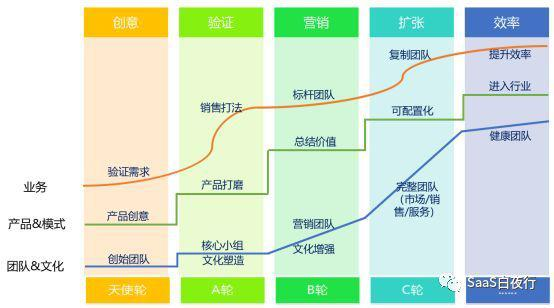

## 管理标准化—销售费用能否换为提成？| SaaS创业路线图（44）  

> 发布: 吴昊@SaaS  
> 发布日期: 2019-05-05  

编者按：本文来自微信公众号[“SaaS白夜行”（ID：SaaSKnight）](https://mp.weixin.qq.com/s/1b-4xogLhIUlv7oCOMLS6A)，作者吴昊SaaS，36氪经授权发布。

**作者介绍** \- 吴昊，SaaS创业顾问，纷享销客天使投资人、前执行总裁，8年SaaS营销团队创新+13年企业信息化经验。目前在为SaaS公司提供战略咨询，重点是市场、销售、服务团队的规模化。

SaaS创业路线图

最近我的系列文章中，有一篇很重要的是[SaaS创业路线图（39）可复制的市场成功](http://mp.weixin.qq.com/s?__biz=MzIxNjc2MTc2MQ==&mid=2247483997&idx=1&sn=6a664dfe9564edf0284fcf5eb3bd4146&chksm=97855693a0f2df85865f225467cad08b4f88684333f111957fecb9f7225c151536b640d63135&scene=21#wechat_redirect)。关键原理是 —— **只有标准化的才可以复制** **。** 不仅销售打法应该标准化，管理方式也要尽量标准化。这样90%的问题可以通过流程和制度解决，管理者只用花少量时间处理好剩下10%的特殊状况，大部分精力则可以专注在业务和客户身上了。

管理制度/流程标准化的要求是什么？我认为有3点：

1、可文字化 —— 能够清楚写下来，这样同事们遇到事情能反复琢磨和学习；

2、公平公正 —— 制度是要公开讲的，如果不公平，Bug很多，就会有人转空子，老油条就会不断侵蚀公共利益，老实人也会逐渐变成老油条。

3、高效 —— 管理干部要聚焦部门关键业务，别为了非战略目标的琐碎事情花费太多时间。

如果要较快速地复制团队，对管理干部的要求也不能太复杂。如果某个事项上，有太多“意外”需要应对，很多新晋干部就会搞不定，造成他的团队低效，甚至引起同事间的纠纷。

我们就以“销售费用报销”为例，讲讲销售管理标准化的一个案例。

上个月有一家进入B端市场不久的企业请我做营销顾问，上周我们在做激励方案调整。提成部分我当然是建议大刀阔斧地改为简单直接的激励方式，特别是初期市场，销售目标调整频率高，激励方案越简单越容易适应变化。详见我另一篇文章[SaaS创业路线图（42）销售提成设计的误区](http://mp.weixin.qq.com/s?__biz=MzIxNjc2MTc2MQ==&mid=2247484011&idx=1&sn=ebd8ffbcffca8fa1191cbbbcac171f0a&chksm=978556a5a0f2dfb3d25c0f5e6446c4da613829a62695adbdac5a2082cff199092e55b9747e28&scene=21#wechat_redirect)。

其中也说到销售费用报销的问题。销售费用也就是和销售业务直接相关的费用，主要是招待费、客情礼品费用和拜访客户的市内交通费用。（如果通讯费、交通补贴是以固定金额发到工资里的形式，无论是否需要拿发票报销，那和我们今天要讨论的“销售费用报销”没有关系。）

我知道很多公司都用传统方式，定一个额度，业务员在额度范围内实报实销与客户开发相关费用。

大家都经历过，报销审批过程是很琐碎的，占用了业务员、管理层和财务部门不少时间和精力。

这还是其次，更糟糕的是其实这些审批都是无意义的。总监哪知道每笔费用与客户有没有关系啊！这就是Bug了，老油条每月都会尽量把额度用完，新人来了看到这个风气也就逐渐壮起胆子照葫芦画瓢。

团队Leader要去一笔笔查吗？真查到一笔说不清楚的，也只能让老油条下次做假更小心一点儿。因为这事儿本来就难以核查。

如果这类报销Leader们100%都批准，那走这个报销审批流程又有何意义？不如干脆说：“你们都拿1000元发票来报销算了，业务部门也不用批，交给财务只要票据OK直接打款！”

可这样就公平了吗？销冠业务员A一年做了150万业绩，业务员B刚刚达标做了50万，他们都应该每月报销1000块吗？好，换做“按上个季度业绩的1%”给报销额度；可是如果业务员B这个月正好有一个目标大客户就是需要更大投入呢？

**华为有句话：让听得见炮声的人决策。** 从费用使用效率的角度讲，只有一线才知道这笔钱到底是“一定该花”，还是“其实花不花都可以，但既然公司承担，就花吧”。

### 二、销售费用管理上，有2个方案

#### 方案一：“项目毛利核算”方案。

项目组在项目结束后按“项目毛利”拿奖金，大家自然都互相看着不会乱报销自己家的费用。项目经理身在一线，也非常清楚什么钱该花，什么费用要节省。

方案一适合成熟的大项目制企业（客单价20万以上）。很多大软件项目公司会采用这个方式，这对财务核算能力要求很高，初创公司很难做到。

#### 方案二：“费用报销转提成”方案。

也就是说，增加提成点数（例如1%），把销售费用包含在提成中。

举个例子，业务员人平均年度目标50万，人均年度报销费用5000元，就可以折算为1%的提成点数。实际操作中，我建议可以加到1.5个点，因为业务员承担了更多风险，理应有更大收益。

**这样就把“这笔招待费是否该用？”的问题交到了“听得见炮声的人”手上。** 业务员认为请客户吃饭可以提升赢单率，自然就会请；判断没啥用，当然就会放弃。掏的是自己的钱，钱就会用到刀刃上。

而公司呢，不但节约了报销流程的成本，也不会因为主管或总监经常怀疑哪位员工报销费用有猫腻儿造成信任感流失。在报销这件事情上，业务员与公司的利益实质上变为一致的了。

### 三、业务员的担心和我的解答

与请我做顾问的这家创业公司聊这个方案时，业务员当然会有很多疑问。毕竟以前做了客情投入是100%能报销的；现在做了客情，如果最后没成交，费用全都变成自己扛了。

这个风险不能否认，所以我建议企业在设计“费用报销转提成”方案时，提成点数要比历史平均费用稍高一些。

我们可以给业务员算一下，如果以往一年完成50万，费用5000元；现在增加1.5%的提成，可以多收入2500元；其实大家的能力在逐年提升，如果今年做到70万呢？多收入的就是5500元。

总体而言，这是更鼓励业绩好的业务员的激励方案。

如果一个新业务员加入公司，对产品和自己能否成交完全没信心，不愿意有任何投入，那其实他在初期就会被筛掉了，这样双方都节约时间和减少机会成本。这也是我常说的筛子原则，大家有兴趣可以搜我的系列文章[SaaS创业路线图（廿三）- toB创业中的5个行动原则](http://mp.weixin.qq.com/s?__biz=MzIxNjc2MTc2MQ==&mid=2247483901&idx=1&sn=3d04e2670cab04021d6c3de46eac88d6&chksm=97855533a0f2dc259a13160a72f8ef20914a7af3a07f763b0d344310143d55fab690f112b179&scene=21#wechat_redirect)。

### 四、看待此问题的三个视角

**从基层看** ，这个“费用报销转提成”制度，是需要做引导和铺垫的。

我以前带的销售团队有1000多人，我们经常倡导的是“咱们的提成中有1/3是要做客情的，只有这样才会有持续好业绩”（同样的，干部的“管理提成”中也有1/3是要拿出来请部属吃饭、重要时刻给同事准备贴心小礼物的）。这么大团队，我观察过，团队中大部分人都能够做地很好，特别是那些销冠。他们一旦自己主动组织了客户小沙龙并且颇有成效，团队就会安排他上台分享；当他们上台打开自己背包里常年准备给客户的一些小礼物时，对所有人都颇有冲击力！

**从管理层的视角看** 呢？这里节约了管理成本、减少了团队互相不信任的风险，保护了团队来之不易的艰苦奋斗的风气。

其实主管和总监们是很讨厌源源不断的审批的，大家都经历过“财务报销截止日期”前的混乱下午吧？好的管理就是要制定制度应对90%的状况，降低被琐事打扰的时间比率。

**更重要的是全局视角。**

有成长愿望的一线同事和基层干部都应该逐步培养自己的全局视角。

很多人问我“如何打造销售铁军？”这当然是个复杂的系统，其中不仅是Leader们的带头作用、销售团队运营、企业文化和氛围的形成。 **还有一个很重要的基础，说起来是很现实的，就是“业务员收入中的固浮比”。这与团队的狼性有非常重要的关系。**

如果固浮比（无责薪酬：业绩提成/奖金）是6：4，你是无法获得一个充满血性的团队的。销售是个非常苦B的职业，你看看自己每天有多少个10秒内挂断的陌生电话就知道了。谁喜欢被别人突然挂断电话或当面甩脸色啊？

如果躺着也能拿到大部分收入，在很多困难时刻，人性会让业务员多放松“一点点”.......

我认为有战斗力的销售团队，提成/奖金应该占个人收入的50%以上。要做到这一点儿，“销售费用报销转提成”也会在中间起到一些作用。我咨询的这家企业，原来固浮比就正好是51：49，加了这个提成点数，固浮比变为45：55。

全局视角还有更关键的一个点，就是文化。 **文化不是口号，文化与咱们的管理制度是否“公平公正”、是否可操作地“公平公正”有很大关系。**

按照原有报销制度，老油条们经常按最高限报销，公司又无法核实只能都给报，那其他销售也会逐步被带坏的。初期团队凝聚力强，我们可以很好地控制这些问题，可是开了多个分公司之后呢？

如果制度的执行本身就有不“公平”之处，将来开了分公司，每个分公司的总经理都有能力把这些非KPI的“风气”问题掌控好吗？这些“不公平”的漏洞未来就会不断带来个人及组织腐败的问题，最终侵蚀整个公司的文化底座。

### 五、实施细节

**公司中凡是涉及到个人收入变动的事项，都需要非常谨慎。**

把费用报销转为提成的工作，和其它管理变更一样，需要与各层级同事敞开沟通，通过会议及与关键人的一对一沟通达成共识。

设计方案时，可以考虑让公司吃点儿亏，多保障业务员的利益。因为这个机制本身就会让公司大幅获益，所以别计较太多。

实施起来，也可以有个过渡期，例如1个月，甚至3个月。具体细节怎么设计，多听大家的反馈。而大方向是CEO自己要拿定主意的。

### 总结：

我常说， **没有坏的员工只有坏的制度。** 不要怪那些“老油条”，只能怪自己设计的制度漏洞太大。

我常说， **设计一个好的机制胜过一万遍日常管理。**

费用报销不是小事，故成此文。

希望每位读者都可以review一下各自公司的报销制度，无论自己能否改变它，转动一下自己的“管理思维”吧。

**5月21日《可复制的市场成功》讲座招生啦，我和《硅谷蓝图》译者蔡勇老师联袂推出两堂课（各半天），**[ **有兴趣点击查看详情**](https://mp.weixin.qq.com/s/m04TSTAC5U35z20Ni4GWOg)
