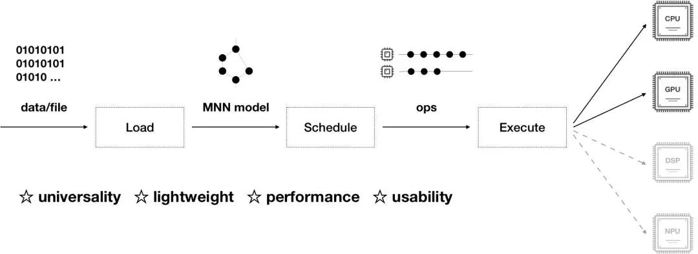
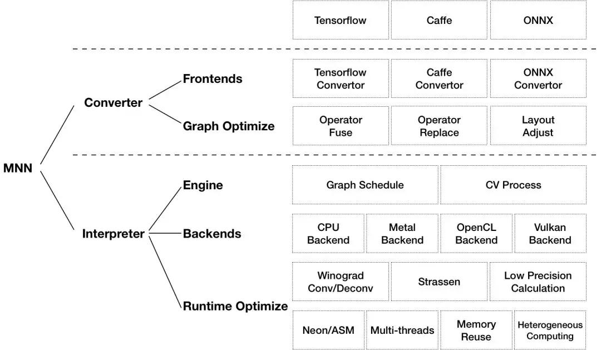
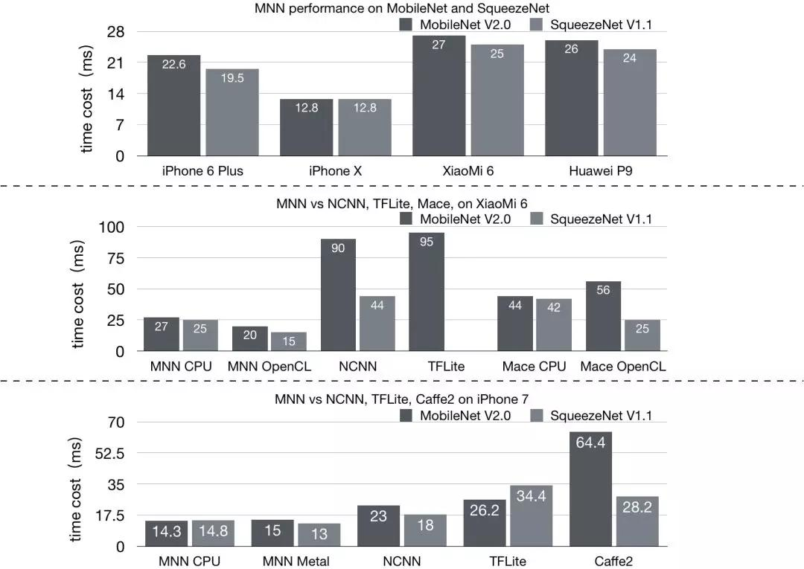

## 贾扬清推荐：阿里开源轻量级深度学习框架 MNN，侧重推理加速和优化  

> MNN  
> 作者: 新智元  
> 发布日期: 2019-05-08  

###

* * *

**   ** **新智元推荐   **

来源：淘宝技术

#####  **【新智元导读】** 阿里近日正式开源了轻量级深度学习端侧推理引擎“MNN”。与 Tensorflow、Caffe2 等同时覆盖训练和推理的通用框架相比，MNN 更注重在推理时的加速和优化，在大规模机器学习应用中具有优势。本文详细阐述了MNN背后的技术框架和规划。

近日，阿里正式开源轻量级深度学习端侧推理引擎“MNN”。

AI科学家贾扬清如此评价道：

> “与 Tensorflow、Caffe2 等同时覆盖训练和推理的通用框架相比，MNN 更注重在推理时的加速和优化，解决在模型部署的阶段的效率问题，从而在移动端更高效地实现模型背后的业务。这和服务器端 TensorRT 等推理引擎的想法不谋而合。
>
>
>
>
> 在大规模机器学习应用中，考虑到大规模的模型部署，机器学习的推理侧计算量往往是训练侧计算量的十倍以上，所以推理侧的优化尤其重要。”
>
>
>

MNN背后的技术框架如何设计？未来有哪些规划？今天一起来深入了解。

开源地址

https://github.com/alibaba/MNN

1、MNN 是什么？

MNN 是一个 **轻量级的深度学习端侧推理引擎** ，核心解决深度神经网络模型在端侧推理运行问题，涵盖深度神经网络模型的优化、转换和推理。目前，MNN 已经在手淘、手猫、优酷、聚划算、UC、飞猪、千牛等 20 多个 App 中使用，覆盖直播、短视频、搜索推荐、商品图像搜索、互动营销、权益发放、安全风控等场景，每天稳定运行上亿次。此外，菜鸟自提柜等 IoT 设备中也有应用。在 2018 年双十一购物节中，MNN 在天猫晚会笑脸红包、扫一扫明星猜拳大战等场景中使用。

2、MNN 的优势

MNN 负责加载网络模型，推理预测返回相关结果，整个推理过程可以分为模型的加载解析、计算图的调度、在异构后端上高效运行。MNN 具有通用性、轻量性、高性能、易用性的特征：

**通用性：**

* 支持 Tensorflow、Caffe、ONNX 等主流模型格式，支持 CNN、RNN、GAN 等常用网络；

* 支持 86 个 TensorflowOp、34 个 CaffeOp ；各计算设备支持的 MNN Op 数：CPU 71 个，Metal 55 个，OpenCL 40 个，Vulkan 35 个；

* 支持 iOS 8.0+、Android 4.3+ 和具有 POSIX 接口的嵌入式设备；

* 支持异构设备混合计算，目前支持 CPU 和 GPU，可以动态导入 GPU Op 插件，替代 CPU Op 的实现；

**轻量性：**

* 针对端侧设备特点深度定制和裁剪，无任何依赖，可以方便地部署到移动设备和各种嵌入式设备中；

* iOS 平台上，armv7+arm64 静态库大小 5MB 左右，链接生成可执行文件增加大小 620KB 左右，metallib 文件 600KB 左右；

* Android 平台上，so 大小 400KB 左右，OpenCL 库 400KB 左右，Vulkan 库 400KB 左右；

**高性能：**

* 不依赖任何第三方计算库，依靠大量手写汇编实现核心运算，充分发挥 ARM CPU 的算力；

* iOS 设备上可以开启 GPU 加速（Metal），支持 iOS 8.0 以上版本，常用模型上快于苹果原生的 CoreML；

* Android 上提供了 OpenCL、Vulkan、OpenGL 三套方案，尽可能多地满足设备需求，针对主流 GPU（Adreno 和 Mali）做了深度调优；

* 卷积、转置卷积算法高效稳定，对于任意形状的卷积均能高效运行，广泛运用了 Winograd 卷积算法，对 3x3 -> 7x7 之类的对称卷积有高效的实现；

* 针对 ARM v8.2 的新架构额外作了优化，新设备可利用半精度计算的特性进一步提速；

**易用性：**

* 完善的文档和实例；

* 有高效的图像处理模块，覆盖常见的形变、转换等需求，一般情况下，无需额外引入 libyuv 或 opencv 库处理图像；

* 支持回调机制，方便提取数据或者控制运行走向；

* 支持运行网络模型中的部分路径，或者指定 CPU 和 GPU 间并行运行；

3、MNN 核心介绍

**3.1 模块设计**

如上图所示，MNN 可以分为Converter和Interpreter两部分。

Converter 由 Frontends 和 Graph Optimize 构成。前者负责支持不同的训练框架，MNN 当前支持 Tensorflow \(Lite\)、Caffe 和 ONNX；后者通过算子融合、算子替代、布局调整等方式优化图。

Interpreter 由 Engine 和 Backends 构成。前者负责模型的加载、计算图的调度；后者包含各计算设备下的内存分配、Op 实现。在 Engine 和 Backends 中，MNN 应用了多种优化方案，包括在卷积和反卷积中应用 Winograd 算法、在矩阵乘法中应用 Strassen 算法、低精度计算、Neon 优化、手写汇编、多线程优化、内存复用、异构计算等。

**3.2 性能比较**

采用业务常用的 MobileNet、SqueezeNet 和主流开源框架进行比较，结果如下图：

MNN 相比于 NCNN、Mace、Tensorflow Lite、Caffe2 都有 20% 以上的优势。我们其实更加聚焦在内部使用的业务模型优化上，针对人脸检测等模型进行深入优化，iPhone6 可以达到单帧检测 5ms 左右。

注：Mace、Tensorflow Lite、Caffe2 均使用截止 2019 年 3 月 1 日 GitHub 代码仓库的 master 分支；NCNN 由于编译问题采用 20181228 Release 预编译库。

4、MNN 的开源历史

**4.1 我们为什么要做端侧推理**

随着手机算力的不断提升，以及深度学习的快速发展，特别是小网络模型不断成熟，原本在云端执行的推理预测就可以转移到端上来做。端智能即在端侧部署运行 AI 算法，相比服务端智能，端智能具有低延时、兼顾数据隐私、节省云端资源等优势。目前端智能正逐渐变为趋势，从业界来看，它已经在 AI 摄像、视觉特效等场景发挥了巨大价值。

手淘作为电商的超级 App ，业务形态丰富，拍立淘、直播短视频、互动营销、试妆、个性化推荐搜索等业务场景都有端智能诉求，结合端智能能力，可以给用户带来新的交互体验，助力业务创新突破。

一般来说，端侧深度学习的应用可以分成如下几个阶段：

* 模型训练阶段，主要解决模型训练，利用标注数据训练出对应的模型文件。面向端侧设计模型时，需要考虑模型大小和计算量；

* 模型压缩阶段，主要优化模型大小，可以通过剪枝、量化等手段降低模型大小，以便在端上使用；

* 模型部署阶段，主要实现模型部署，包括模型管理和部署、运维监控等；

* 端侧推理阶段，主要完成模型推理，即加载模型，完成推理相关的所有计算；

由上可知，端侧推理引擎是端智能应用的核心模块，需要在有限算力、有限内存等限制下，高效地利用资源，快速完成推理。可以说，端侧推理引擎实现的优劣，直接决定了算法模型能否在端侧运行，决定了业务能否上线。因此，我们需要一个端侧推理引擎，一个优秀的端侧推理引擎。

**4.2 我们为什么要开源 MNN**

在 2017 年初，我们在开始引擎研发之前，重点调研了系统方案和开源方案，从通用性、轻量性、高性能、安全性等方面深入分。CoreML 是 Apple 的系统框架，MLKit 和 NNAPI 是 Android 的系统框架，系统框架最大的优势是轻量性 —— 在包大小方面相对宽裕。而最大的劣势是通用性，CoreML 需要 iOS 11+，MLKit 和 NNAPI 需要 Android 8.1+，可以覆盖的机型非常有限，同时难以支持嵌入式设备的使用场景。此外，系统框架支持的网络类型、Op 类型都较少，可拓展性又较差，还未能充分利用设备的算力，加之存在模型安全方面的问题。综上种种，系统框架不是一个很好的选择。开源方案中 Tensorflow Lite 宣而未发，Caffe  较成熟但不是面向端侧场景设计和开发的，NCNN 则刚刚发布还不够成熟。总的来说，我们找不到一套面向不同训练框架，不同部署环境，简单高效安全的端侧推理引擎。

因此，我们希望提供面向不同业务算法场景，不同训练框架，不同部署环境的简单、高效、安全的端侧推理引擎 MNN 。能够抹平 Android 和 iOS 的差异，碎片设备之间的差异，不同训练框架的差异，实现快速的在端侧部署运行，并且能够根据业务模型进行 OP 灵活添加和 CPU/GPU 等异构设备深入性能优化。

随着时间推移，NCNN、Tensorflow Lite、Mace、Anakin 等逐步升级和开源，给与我们很好的输入和借鉴。我们随着业务需求也在不断迭代和优化，并且经历了双十一考验，已经相对成熟和完善，所以开源给社区，希望给应用和 IoT 开发者贡献我们的力量。

5、应用场景

目前，MNN 已经在手淘、猫客、优酷、聚划算、UC、飞猪、千牛等 20 + 集团 App 中集成，在拍立淘、直播短视频、互动营销、实人认证、试妆、搜索推荐等场景使用，每天稳定运行上亿次。2018 年双十一购物节中，MNN 也在猫晚笑脸红包、扫一扫明星猜拳大战等场景中使用。

拍立淘是在手淘里面的一个图像搜索和识别产品，从 14 年首次上线经过不断迭代发展目前已经成长为 UV 超过千万的应用。其中的技术也在不断迭代更新，从最早的拍照上传图片云端识别，演进到目前在端上做物体识别和抠图再上传云端识别，有效的提升了用户体验同时节省了服务端计算成本。针对一些简单的物体分类万物识别和 logo 识别，目前也已经支持直接通过端上的模型进行实时识别。

笑脸红包是 18 年双十一猫晚开场的第一个节目，这个玩法是基于实时人脸检测和表情识别能力做的，相比之前各种通过屏幕触控的交互玩法，这个活动通过摄像头实时人脸检测算法实现从传统触控交互玩法到自然交互玩法的跨越，给用户带来新的用户体验。

集五福是 19 年春节的活动，也是手淘第一次通过扫年货的方式加入到这个活动中来。通过扫一扫商品识别能力，识别红色年货，除了福卡之外，还能得到羽绒被、五粮液、茅台、帝王蟹等实物大奖和猫超、天猫精灵等无门槛优惠券，让家里的年货变成下金蛋的 “母鸡”。

6、Roadmap

我们计划每两个月 Release 一个稳定版本。当前规划如下：

**模型优化方面**

1. 完善 Converter 图优化

2. 完善对量化的支持，增加对稀疏的支持

**调度优化方面**

1. 增加模型 flops 统计

2. 针对设备硬件特性动态调度运行策略

**计算优化**

1. 现有 Backend 持续优化（CPU/OpenGL/OpenCL/Vulkan/Metal）

2. 优化 Arm v8.2 Backend，支持量化模型

3. 使用 NNAPI，增加 NPU Backend

4. 应用快速矩阵乘法、Winograd 算法优化性能

**其他**

1. 文档和示例

2. 完善 test、benchmark 相关工具

3. 支持更多 Op

本文经授权转载自微信公众号：淘宝技术，ID: AlibabaMTT
