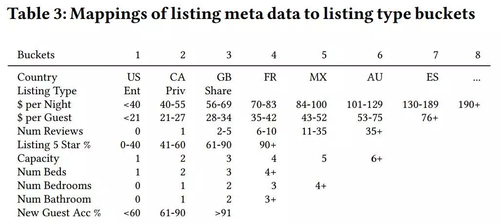
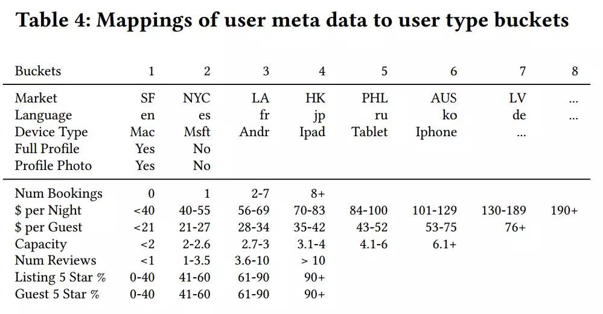
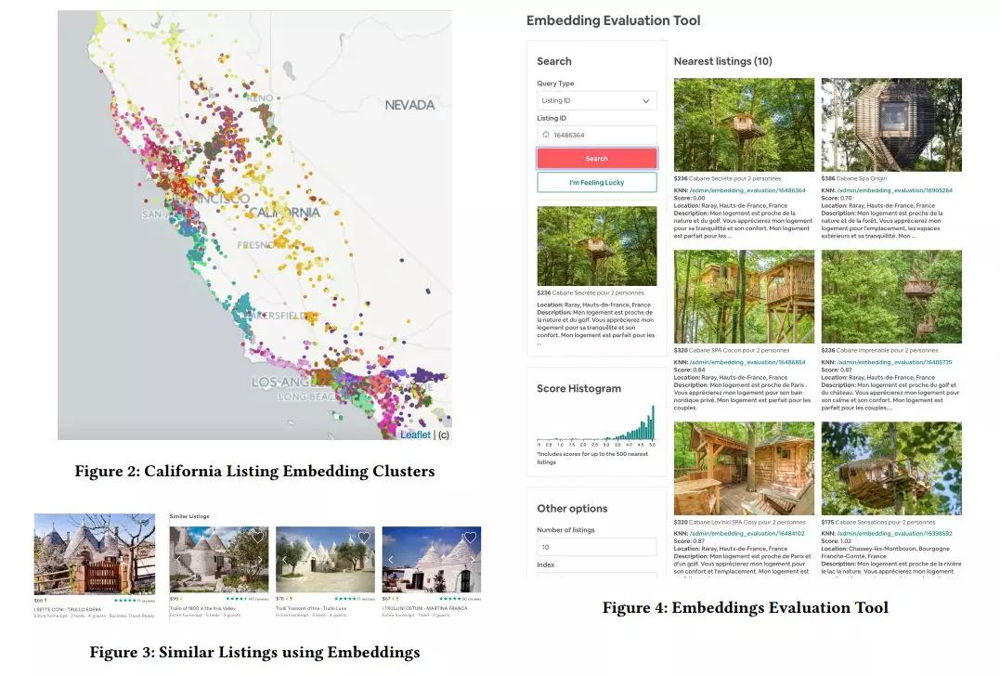
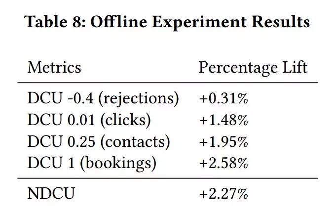

## 解读Airbnb的个性化搜索排序算法  

> 原创：  
> 论文解读  
> 作者: SIGAI  
> 发布日期: 2019-05-06  

关注“SIGAI”，选择“星标”或“置顶”

原创技术文章，第一时间获取

* * *

转载请在文首注明：本文转自微信公众号SIGAI

全文PDF见：

http://www.tensorinfinity.com/paper\_153.html

导言

Real-time Personalization using Embeddings for Search Ranking at Airbnb 【KDD 2018 Best Paper】

搜索排序和推荐是大多数互联网公司高度关注的主要问题，包括网页搜索引擎，内容发布网站等。虽然技术大同小异，比如搜索排序可能大家使用的都是LTR，或者现在基本用的都是DNN以及DNN的各种变种，但确实不存在一套通用的搜索排序解决方案，可以解决所有公司的问题。每个公司都有自己独特的业务，面对不同的业务，都会面临一些特有的挑战。如何基于公司独特的业务，在已有技术的基础上，提出一些改进方案，也是一种能力的体现。

简介

本文提出了一种新的、实时的个性化搜索排序算法，通过学习房源和用户的低维表示，同时在训练过程中融入对Airbnb业务的深入理解，比如全局信息和显式的负向反馈信号的引入，在真实业务场景上的实验证明了该方法的有效性，并且已经部署到Airbnb的生产环境产生价值。

正文

本文是Airbnb公司的作品，本文的主要目的是（1）如何在已有embedding技术的基础上，结合公司自身业务的特性，通过调整优化函数，学习符合业务需求的embedding表示。比如Airbnb公司，不同于网页搜索和电子商务公司，通过官网和应用提供出游房源短租服务。在这种服务市场下，用户选择房源一般会限定在某个区域，比如中国北京，并且租户可以根据以往租户对用户的评价或用户的资料选择是否接受用户的预定。（2）把技术创新成果应用到公司重要业务中。下面从业务出发，介绍embedding表示学习。

详细细节

embedding表示学习

本文提到Airbnb 99%的成交来源于相似房源推荐和搜索排序两大业务，所以，房源和用户的embedding表示学习也是从业务出发来考虑的。

比如，房源的embedding表示学习，因为相似房源推荐业务的价值主要体现于在用户作出最终成交之前，根据用户的浏览和点击行为，为用户推荐他/她可能感兴趣的房源。因此，房源的embedding表示学习是基于用户的点击序列生成的。具体的学习优化函数如下（参考skip-gram \[17\]）：

其中，l被称为中心节点，c被称为上下文，即中心节点前后连续的m个房源。第一个表达式表示正样本的log-likelihood，第二个表达式表示负样本的log-likelihood，负样本采样方法同样参考\[17\]。

考虑到每个公司业务的独特性，本文根据公司自身的业务特点调整了优化函数：

a\) 区别对待是否以成交行为作为序列结束的点击序列。如果点击序列不是以成交行为作为序列结束的点击序列，则优化函数沿用式（3），否则，优化函数调整为如下：

其中，前两个表达式类似式（3），第三个表达式表示成交房源的log-likelihood。

b\) 用户选择房源一般会限定在某个区域，比如中国北京，则优化函数调整为如下：

其中，前三个表达式类似式（4），第四个表达式表示在用户搜索的区域内，采样一些负样本，把这些负样本的log-likelihood加入到优化函数中。

以上房源的embedding表示学习是基于用户的点击序列，文中把用户的点击序列称作为短期的，session内的行为。而长期的，跨区域的成交行为，本文也同样认为是比较重要的。比如，曾经在纽约和伦敦出游，并有过成交行为的用户，在洛杉矶搜索房源时，如果算法能推荐一些跟之前预定过的房源相似的房源，也是有用的。

基于这种想法，本文同样基于用户的成交序列，生成了房源的embedding表示。只不过，因为用户的成交序列过于稀疏，文章事先对房源进行了聚类。房源的聚类方法是基于规则的，详见表（3）。

因此，每一条成交序列里的元素，由原来的房源变成了房源聚类结果。为了方便起见，后面统称为listing\_type序列。

文章还有一个细节，因为用户的成交序列时间跨度太长，这期间用户的兴趣可能会发生变化，比如，未婚变成了已婚。所以，为了捕获到用户的兴趣变化，文中提出了在学习房源（确切的说，是listing\_type）的embedding表示的同时，把用户（确切的说，是user\_type）的embedding也产出。当然，类似于对房源的处理，文章同样对用户做了聚类，聚类方法也是基于规则的，详见表（4）

为了同时学习listing\_type和user\_type的embedding表示，文章在listing\_type序列的基础上，加入了用户聚类结果。由listing\_type序列，变成了user\_type和listing\_type混合的序列。但该序列是按照listing\_type的成交时间排好序的。

类似的，采用式（3）的优化函数学习embedding表示。不同的是，此时的序列中出现了两种实体，一种是user\_type，一种是listing\_type。本文提出分别对这两种实体构造优化函数。优化函数详见论文，不再这里重复累赘。

另外，上面讲到的a）和b）两种业务特点，首先，因为此次的序列采用的是成交序列，所以不存在式（4）的改进。同样，因为此次的序列本身就是跨区域的，所以也不存在式（5）的改进。但是，正如正文所说，租户是可以拒绝用户的预定的，所以，如何把显式的拒绝行为考虑到优化函数中，文章给出了解决方案，调整后的优化函数如下：

其中，前两项表达式的含义类似式（3）中的前两项。最后一项表达式表示被租户拒绝掉的listing\_type的log-likelihood。

式（8）列出的是基于user\_type为中心节点的优化函数。基于listing\_type为中心节点的优化函数类似，详见论文，这里不再累赘。

技术创新成果在业务中的应用

**针对相似房源推荐业务** 根据用户最新的点击行为，利用夹角余弦方法，计算候选房源与点击过的房源的相似度，然后相似度从高到低排序，取Top N推荐即可。

另外，针对新房源embedding的冷启动问题，文章也给出了解决方案。首先，利用租户提供的meta-data，找出地理位置上最近的，并且具有相同房源类型和相同价位的3个有embedding信息的其他房源。然后，对这三个embedding的每一维做平均值，得到新房源的embedding表示。文章称，使用这样方法，可以覆盖到98%的新房源。

**针对搜索排序业务** 本文使用的模型是Lambda Rank的修改版本\[4\]，该算法使用的特征包含用户粒度的特征，比如已成交房源的平均价格，好评率等；query粒度的特征，比如搜索地域，住房人数，入住日期，租赁天数；房源粒度的特征，比如每晚的房源价格，房源类型，房屋的数量，回绝率等；交叉特征，就是上面提到的单粒度特征的交叉，比如搜索地域与房源地域的距离，住房人数和房屋容量的差异，房源价格和用户已成交房源的平均价格的差异等。 文中提到该算法使用了104个特征。其中有8个交叉特征是基于embedding的，如表（6）。

表中大写H代表的具体含义以及每个feature的计算这里只选择第一个进行介绍，其他详见论文。Hc表示用户最近两周点击过的房源。EmbClickSim的计算如下：

其中v表示房源的embedding表示。

实验

数据集

**用户点击序列**

800 million的点击序列，序列的分割是根据时间来做的，文章提到如果两个行为之间的时间差超过30分钟，就被看作是两个序列。

另外，去除掉噪音数据，文章对噪音数据的定义为，用户停留时长小于30秒和只有一次点击行为的序列。

**用户成交序列**

50 million的用户成交序列，其中user\_type为500K，listing\_type为500K。

实验细节

**离线评估**

通过Figure 2，3，4，可以明显看出，相似的房源都被聚集在了一起。

**在线评估**

Online A/B test，相似房源推荐业务，CTR获得了21%的相对提升，在相似房源推荐模块有成交的用户量增加4.9%。

另外，针对搜索排序业务，本文也同样在线上进行了验证，结论是用户预订量有显著增加。几个月后，又进行了反向验证，就是把基于embedding设计的特征从模型中移除掉之后，线上数据显示用户预订量有下降。

总结

这篇文章并没有提出一种新的embedding学习算法，而是从业务本身出发，在已有算法的基础上，结合业务的特性，提出了一些改进，并把这些改进成果成功应用到业务上。 另外，本文分别从离线和在线两种评估方法上，对结果进行了验证。个人认为是一篇很扎实的工作，这种做工作的态度值得我们学习。

一些个人想法

本文embedding的学习都是基于用户的行为序列，而没有考虑实体本身的side information。其实，side information也是一种很有用的信息，比如用户的年龄，性别，兴趣爱好等，这些信息也会影响他去选择房源。如何把 **side information加入到embedding的学习中** ，是一个值得尝试的事情。

另外，本文中的embedding表示学习和embedding在搜索排序中的应用是两个任务，是分别训练学习的。这样做就会导致两个任务互相不能共享一些信息，是否可以 **采用End2End的学习框架，同时学习这两个任务** ，是一个值得思考的问题。

参考文献

\[4\] Christopher J Burges, Robert Ragno, and Quoc V Le. 2011. Learning to rank with nonsmooth cost functions. In Advances in NIPS 2007

\[17\] Tomas Mikolov, Ilya Sutskever, Kai Chen, Greg S Corrado, and Jeff Dean. 2013. Distributed representations of words and phrases and their compositionality. In Advances in neural information processing systems. 3111-3119

本文为SIGAI原创

全文PDF见http://www.tensorinfinity.com/paper\_153.html
