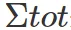
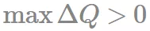
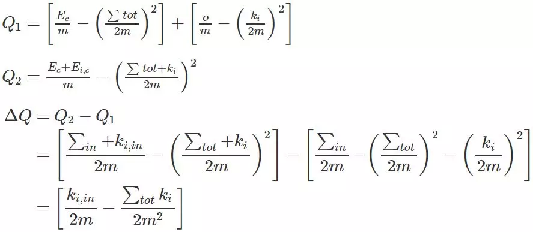
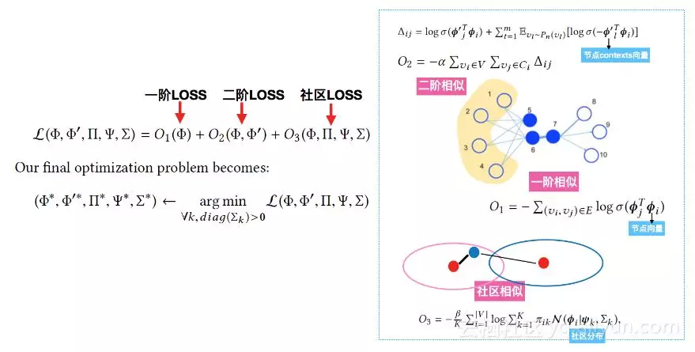

## 金融风控反欺诈之图算法  

> 作者: DataFun社区  
> 发布日期: 2019 年 5 月 6 日  

先介绍下金融借贷业务流程：用户前来申请借贷，会先经过欺诈识别，把欺诈团伙和主观欺诈的个人拒绝掉，然后对通过的人做信用评估，最后根据额度模型，算出利润最大化时放款金额。

刚才提到了团队欺诈，举个真实的例子。宜人贷在他们的财报中公布的，他们被一个团伙成功撸走了 2000 多单，当时宜人贷的件均 4w， 一下损失了 8000w！！

那么如何防范这种风险呢。这就是今天要分享的图算法。图可以将这些一个个有良好记录的个体关联起来, 一网打尽。

再举一些团伙欺诈的行为。比如一个团伙，注册真实的淘宝商家，然后刷出良好的淘宝购物记录。或者来回转账，刷出良好的银行流水。

> 刚才前两位老师都没有提到额度模型，简单介绍下，如果只给用户放款 5000，可能坏账风险很小，但是利息也少，如果放款 10000，利息虽然收到利息多了，但是坏账风险高岭，所以需要做个权衡

### Graph 简介

G=\(V,E\)G=\(,E\)

* V:vertex set
* E:edge set \(有向，无向，有权重和没有权重\)

> 举例，两个人之间的联系， A 给 B 买了东西，A 和 B 之间的通话次数时长多于 A 和 C 之间。

* 度中心性（Degree Centrality） - 表示连接到某节点的边数。在有向图中，我们可以有 2 个度中心性度量：流入和流出。一个节点的节点度越大就意味着该节点在网络中就越重要。
* 接近中心性（Closeness Centrality） - 从某节点到所有其他节点的最短路径的平均长度。反映在网络中某一节点与其他节点之间的接近程度。
* 介中心性（Betweenness Centrality） - 某节点在多少对节点的最短路径上。介数中心性是比较能体现节点在图中桥梁作用的中心性度量方法。介数反映了相应的节点或者边在整个网络中的作用和影响力，具有很强的现实意义。例如，在交通网络中，介数较高的道路拥挤的概率很大；在电力网络中，介数较高的输电线路和节点容易发生危险。

社团发现算法一般有：

* 最小割， 正则化割: 通过计算图的最小割，即将网络划分为预定的分组数，并使连接各分组的边的条数最少。
* 非负矩阵分解: 基本原理是将原始矩阵分解得到社区指示矩阵和基矩阵
* 基于模块度的社区划分
* 基于节点相似性的社区划分

> 最小割算法广泛应用在分布式计算的负载均衡中，对集群节点的分组有利于减少不相关节点之间的通信。然而由于该算法限定了网络最终分组的个数，而不能通过算法“发现”节点间的内在联系并自然地构成若干个社区，因此最小割算法应用较为局限。

本文主要分享这两类的主要算法，基于模块度的 **louvain** 和基于信息熵 **infomap** ，基于相似度的 **node2vec**

#### 模块度 \(Modularity\) 公式及简化

优化目标：一般认为社团内部的点之间的连接相对稠密，而不同社团的点之间的连接相对稀疏。

所以模块度也可以理解是社区内部边的权重减去所有与社区节点相连的边的权重和，对无向图更好理解，即社区内部边的度数（内部的连线数）减去社区内节点的总度数。

##### 模块度公式的解释

节点 i 和节点 j 之间边的权重，网络不是带权图时，所有边的权重可以看做是 1；

表示所有与节点 i 相连的边的权重之和（度数）；

表示节点 i 所属的社区；

表示所有边的权重之和（边的数目）。

其中表示社区 c 内的边的权重之和，

表示与社区 c 内的节点相连的边的权重之和，即社区 c 节点的度之和（包含与其他社区相连边的度）。

> 从概率的角度去看：

> 

表示实际情况下，c 社区内产生边的概率。

> 

表示在一种理想情况下，给定任意节点 i 的的度 ki，对节点 i 和节点 j 进行随机连边，边属于社区 c 的概率期望。

> 于是上式就表示了社区内连边数与随机期望的一个差值。连边数比随机期望值越高，表明社区划分的越好。

**一般使用后面简化的公式，简化后的公式删除了判断两个节点是否划为同一个社区的函数，所以在一定程度上大大减少了 Q 值计算量。**

**Louvain**

Louvain 算法的思想很简单：

* 将图中的每个节点看成一个独立的社区，此时社区的数目与节点个数相同；

* 对每个节点 i，依次尝试把节点 i 分配到其每个邻居节点所在的社区，计算分配前与分配后的模块度变化，并记录最大的那个邻居节点，如果，则把节点 i 分配

最大的那个邻居节点所在的社区，否则保持不变；

* 重复 2，直到所有节点的所属社区不再变化；

* 对图进行压缩，将所有在同一个社区的节点压缩成一个新节点，社区内节点之间的边的权重转化为新节点的环的权重，社区间的边权重转化为新节点间的边权重，然后重复 2，3；

* 重复 2~4，直到整个图的模块度不再发生变化。

第一阶段称为 Modularity Optimization，主要是将每个节点划分到与其邻接的节点所在的社区中，以使得模块度的值不断变大；

第二阶段称为 Community Aggregation，主要是将第一步划分出来的社区聚合成为一个点，即根据上一步生成的社区结构重新构造网络。重复以上的过程，直到网络中的结构不再改变为止。

移动

是社区 c 内节点与节点 i 的边权重之和，再乘以 2

前面部分表示把节点 i 加入到社区 c 后的模块度，后一部分是节点 i 作为一个独立社区和社区 c 的模块度

1. 模块度与 Louvain 社区发现算法

<http://www.cnblogs.com/fengfenggirl/p/louvain.html>

2. [Spark GraphX 分布式图计算实战](https://mp.weixin.qq.com/s?__biz=MzIyNjE2Nzk2Mw==&mid=2649623193&idx=1&sn=25bd3789495a0fa228d52f92337e436a&scene=21#wechat_redirect)

**infomap**

从信息论的角度出发，假设一个 random worker 在图上进行随机游走，那么怎么用最少的编码长度来表示其路径呢？

如果节点存在社区结构，那么社区内的节点就可以共享社区的 bit 位码，可以得到更小的平均比特, 所以社区划分的越好，那么表示任意一条随机游走的路径所需的平均比特就越小。

如果我们能够计算出每个节点的到达概率，就可以依据信息熵的公式来量化平均比特了：

怎么计算每个点的到达概率呢？

一个暴力的办法是在图上进行长时间的随机游走，最后统计每个节点的出现概率。太暴力了。

利用 pagerank 思路，初始化了每个节点的到达概率之后，就可以不断地迭代更新每个节点的到达概率，这个结果会很快趋于收敛。

其实这过程就是一个马尔科夫随机过程，随机初始化起始值，然后随机游走就相当于不停地用概率转移矩阵相乘，最后就可以达到马尔科夫稳态。

把随机游走事件归为三类：进入某个社团，离开某个社团，再社团内部游走。

定义清楚各类事件的发生概率，依据信息熵公式，就可以得到此时编码所需的平均比特了, 其本质就是从信息论的角度出发。

##### Infomap 算法的迭代过程

1. 初始化，对每个节点都视作独立的社区；
2. while 平均比特的值不再下降；
3. 对图里的节点随机采样出一个序列，按顺序依次尝试将每个节点赋给邻居节点所在的社区，取平均比特下降最大时的社区赋给该节点，如果没有下降，该节点的社区不变。

##### 参考链接

1. The map equation

<http://www.mapequation.org/apps/MapDemo.html>

2. [https://mp.weixin.qq.com/s/qUxMesQA-edSyHeudQRRGA](https://mp.weixin.qq.com/s?__biz=MzI2MDE5MTQxNg==&mid=2649688756&idx=1&sn=ace05ccd198230f3fb0a77a17df72dc6&scene=21#wechat_redirect)

3. DEEP GRAPH INFOMAX 阅读笔记

<https://zhuanlan.zhihu.com/p/58682802>

### Graph embeddings

**Deepwalk**

1. 使用随机游走 \(RandomWalk\) 的方式在图中进行节点采样获得节点共关系，
2. 使用 skip-gram，根据步骤 1 中生成的节点序列学习每个节点的向量表示。skip-gram 就是根据给定输入的节点，预测上下文节点。

Deepwalk 有多不足，比如泛化能力，有新节点加入时，它必须重新训练模型以表示该节点。

其中一个就是采样，从其邻居中随机采样节点作为下一个访问节点，是一种可重复访问已访问节点的深度优先遍历算法。

node2vec 是一种综合考虑 DFS 邻域和 BFS 邻域的 graph embedding 方法

### node2vec

优化目标：

条件独立假设：

特征空间的对称性：

优化目标：

计算量非常大，所以论文采用负采样 \(negative sample\)
 进行近似计算。

这个 node2vec 优化目标函数，因为它跟大名鼎鼎的 word2vec 是一样。

我们最初是用一个 Python 写的包，跑一遍算法需要一周。后来想，既然优化目标是一样的，那能不能用 word2vec 包，因为 word2vec 用 c 写的，而且还采用了 Hierarchical Softmax，negative sampling 加速。

然后在网上找到了一个套用 word2vec 实现的 node2vec 包，速度快很多。

#### 随机游走的方式

复杂网络处理的任务其实离不开两种特性，前面也提到过：一种是同质性，就是之前所说的社区。一种就是结构相似性，值得注意的是，结构相似的两个点未必相连，可以是相距很远的两个节点。

能不能改进 DeepWalk 中随机游走的方式，使它综合 DFS 和 BFS 的特性呢？所以本文引入了两个参数用来控制随机游走产生的方式。

Z 是分子的归一化常数

如果已经采样了 \(t,v\) ，也就是说现在停留在节点 v 上，那么下一个要采样的节点 x 是哪个？作者定义了一个概率分布，也就是一个节点到它的不同邻居的转移概率：

直观的解释一下这个分布：

* 如果 t 与 x 相等，那么采样 x 的概率为

；
* 如果 t 与 x 相连，那么采样 x 的概率 1；
* 如果 t 与 x 不相连，那么采样 x 概率为

参数 p、q 的意义分别如下：

返回概率 p：

* 如果 p>max\(q,1\) ，那么采样会尽量不往回走，对应上图的情况，就是下一个节点不太可能是上一个访问的节点 t。
* 如果 p<min\(q,1\) ，那么采样会更倾向于返回上一个节点，这样就会一直在起始点周围某些节点来回转来转去。

出入参数 q：

* 如果 q>1 ，那么游走会倾向于在起始点周围的节点之间跑，可以反映出一个节点的 BFS 特性。
* 如果 q<1 ，那么游走会倾向于往远处跑，反映出 DFS 特性。
* 当 p=1，q=1 时，游走方式就等同于 DeepWalk 中的随机游走。

**简而言之：**

参数 p 控制重复访问刚刚访问过的顶点的概率，

参数 q 控制着游走是向外还是向内，若 q>1，随机游走倾向于访问和 t 接近的顶点 \(偏向 BFS\)。若 q<1，倾向于访问远离 t 的顶点 \(偏向 DFS\)。

#### 缺点

* 慢
* 先 embedding 再聚类，感觉这两个过程很割裂！！融合一下

### comE

Graphembedding 得到向量后，可以做很多事情，在我们这个主题可以简单的通过聚类来讲节点分组。

但是这个过程比较割裂，先优化 node2vec，然后再优化聚类。能不能整体上一次性优化完呢。

comE 这个算法优化目标中加入了社区的检测和嵌入。通过一个混合高斯模型将节点划分开。

优化目标中前面两项跟 LINE 定义的相似度相似：

1. <https://blog.csdn.net/u012151283/article/details/87013915>

2. Learning Community Embedding with Community Detection and Node Embedding on Graphs

<https://zhuanlan.zhihu.com/p/36924789>

3. Learning Community Embedding with Community Detection and Node Embedding on Graphs

<https://github.com/vwz/ComE>

4. <http://sentic.net/community-embedding.pdf>

#### 评价指标

##### Modularity

##### 标准化互信息 NMI \( Normalized Mutual Information \)

假设对于 N 个样本点的两种标签划分为 U 和 V. 熵为划分集的不准确性

### 作者介绍：

张行军，Abakus 高级风控算法经理。曾先后工作于百度、360 等公司。

**本文来自 张行军 在 DataFun 社区的演讲，由 DataFun 编辑整理。**
