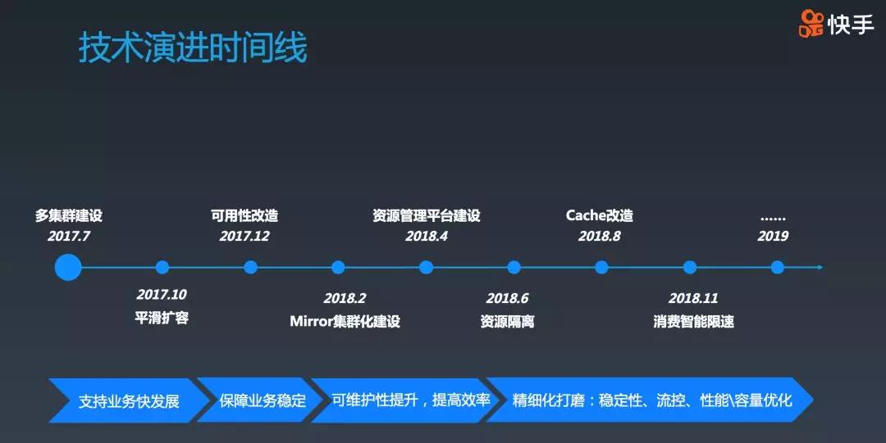

## 快手万亿级别Kafka集群应用实践与技术演进之路  

> 原创：  
> 赵健博  
> 作者: AI前线  
> 发布日期: 2019-05-16  

 作者 | 赵健博  整理 | Clara  编辑 | Vincent  **AI 前线导读：** Kafka 系统在快手有着很广泛的应用，随着其业务的高速发展， Kafka 集群的规模也成指数增长，目前快手 Kafka 集群日消息处理总量达数万亿级别，峰值超过 1 亿 /s。与此同时，快手也面临了很多新问题与技术挑战。本文整理自快手高级架构师、大数据架构团队负责人赵健博在  QCon 北京2019 上的演讲，他介绍了 Kafka 系统在快手的应用实践、遇到的问题以及相应的技术的演进过程。

**更多优质内容请关注微信公众号“AI 前线”（ID：ai-front）**

大家好，我是赵健博，来自快手，今天要和大家分享的议题是《快手万亿级别 Kafka 集群应用实践与技术演进之路》。先来介绍下我自己，我毕业于中国科学院计算技术研究所，目前负责快手大数据架构团队，团队的主要职责是为公司提供数据业务方向的基础设施，包括数据后端中存储、计算、调度、AI 相关系统的研发与应用。

本次分享包括三个方向的内容：首先会介绍下业务相关背景；然后会重点介绍快手 Kafka 的技术演进过程；最后，简单介绍下后续计划。

业务场景

先来看业务场景，在快手，Kafka 被大规模使用着。从场景上看，我们把 Kafka 分成了 3 类集群。第一类，在线集群，Kafka 作为消息中间件，为不同在线业务之间提供异步消息通知服务；第二类，LOG 集群，业务程序直接将 LOG 打给 Kafka，并通过 Kafka 进行传输与收集，由于数据不落地，所以这个过程不能出现由于 Kafka 问题导致业务程序受到影响，这对 Kafka 可用性要求很高，另外，LOG 集群还为重要的实时计算或者模型训练提供数据源；第三类，离线集群，LOG 数据最终的汇聚点，数据会被实时 dump 到 HDFS 中，这部分数据用于离线处理。类似的，离线集群还为次要的实时计算、实时训练提供数据源。

除此之外，作为一个整体，我们还提供了数据 Mirror 服务，用于将数据从在线集群、LOG 集群传输到离线集群。之所以将 Kafka 进行了物理集群的划分，主要考虑的是为了保障服务质量，控制 Kafka 集群问题的影响面。

业务规模

再来看下快手 Kafka 集群相关规模，目前总机器数大概 2000 台；30 多个集群；topic 12000 个；一共大概 20 万 TP（topic partition）；每天总处理的消息数超过 4 万亿条；峰值超过 1 亿条；日总数据量，入口达 4PB，出口达 20PB；网络带宽峰值，入口 1Tbps，出口 4Tbps。

技术演进

接下来，我们来看下技术演进过程。

这个 PPT 展示了快手 Kafka 的技术演进过程，整体上说，包括 4 个阶段：

第一个阶段：为了支持业务的快速发展，我们首先做了多集群建设以及增加了 Kafka 平滑扩容功能；

第二个阶段，为了保障业务稳定，我们对 Kafka 的可用性进行了改造，经过改造，我们将由于单点宕机发现与恢复的时间从 91s 优化到 6s 左右，有 15 倍的提升；

第三个阶段，为了增加系统的可维护性以及提升读系统的运维效率，我们对数据 Mirror 服务做了集群化建设并开发了资源管理平台；

第四个阶段，为了进一步提升 Kafka 的稳定性、性能，我们做了资源隔离、对 cache 进行了改造、并针对消费者进行了智能限速等。

2019 年，技术迭代还在继续。接下来，我将会介绍其中 5 点的细节：平滑扩容、Mirror 集群化、资源隔离、cache 改造、消费智能限速。

平滑扩容

首先看下平滑扩容功能。在介绍之前，我们先来看下原有版本 Kafka 的扩容流程。假如集群有 3 个 broker，一共有 4 个 TP，每个 3 副本，均匀分布。现在要扩容一台机器，新 broker 加入集群后需要通过工具进行 TP 的迁移。一共迁移 3 个 TP 的副本到新 broker 上。等迁移结束之后，会重新进行 leader balance，最终的 TP 分布如图所示。

从微观的角度看，TP 从一台 broker 迁移到另一个 broker 的流程是怎么样的呢？咱们来看下 TP3 第三个副本，从 broker1 迁移到 broker4 的过程，如下图所示，broker4 作为 TP3 的 follower，从 broker1 上最早的 offset 进行获取数据，直到赶上最新的 offset 为止，新副本被放入 ISR 中，并移除 broker1 上的副本，迁移过程完毕。

但在现有的扩容流程中存有如下问题：数据迁移从 TP3 的最初的 offset 开始拷贝数据，这会导致大量读磁盘，消耗大量的 I/O 资源，导致磁盘繁忙，从而造成 produce 操作延迟增长，产生抖动。所以整体迁移流程不够平滑。我们看下实际的监控到的数据。从中可以看到数据迁移中， broker1 上磁盘读量增大，磁盘 util 持续打满，produce 的 P999 的延迟陡增，极其不稳定。

针对这个问题，我们回到 Kafka 迁移的流程上看，理论上 Kafka 是一个缓存系统，不需要永久存储数据，很有可能费了很多工作迁移过来的数据根本就不会被使用，甚至马上就会被删除了。从这个角度上看，那么迁移数据时，为什么一定要从 partition 最初 offset 开始迁移数据呢？细想想，好像不需要这样。

所以，解决这个问题的思路就比较简单了，在迁移 TP 时，直接从 partition 最新的 offset 开始数据迁移，但是要同步保持一段时间，主要是确保所有 consumer 都已经跟得上了。

如图所示，再来看这个 TP3 的第三个副本从 broker1 迁移到 broker4 的过程。这次 broker4 直接从 broker1 最新的 offset 开始迁移，即 transfer start 这条竖线。此时，因为 consumer1 还没能跟得上，所以整个迁移过程需要保持一段时间，直到 transfer end 这个点。

这个时候，可以将 TP3 的新副本放到 ISR 中，同时去掉 broker1 上的副本，迁移过程完毕。从这次的迁移过程中看，因为都是读最近的数据，不会出现读大量磁盘数据的问题，仅仅多了一个副本的流量，基本对系统无影响。此时，我们再来看下磁盘读量、磁盘 util、以及 produce 的延迟，从图中可知基本没有任何变化。

整体过程非常平滑，可以说通过这种方式很优雅地解决了 Kafka 平滑扩容问题，我们之前也有在晚高峰期间做扩容的情况，但是从 Kafka 整体服务质量上看，对业务没有任何影响。

这个功能有一个 patch 可用：

https://issues.apache.org/jira/browse/KAFKA-8328

如果大家有需求，可以从这里看下代码。

Mirror 集群化

接下来分享下我们是如何改进 Mirror 服务，使其具备较好的管理性，提升运维效率的。先来看下目前 Mirror 服务的主要问题。

如图所示，这个是目前 Kafka 多集群之间的 Mirror 服务架构。其中 Mirror 服务使用的是 Kafka 自带的 MirrorMaker ，这个服务存在 2 点问题：

1. 被 Mirror 的 topic 是静态管理的，运维成本很高，且容易出错；

2. 一旦有 topic 增加或者减少，以及机器的加入或者退出，都会导致原有正在 Mirror 的数据断流，这主要是因为经历了停止服务，再启动服务的过程；

为了解决这个问题，我们基于 UReplicator，开发了 KReplcator 服务，并替换掉了现有的 MirrorMaker 服务。UReplicator 是 Uber 开源的 Kafka 数据 Mirror 同步服务。

如图所示，在部署的时候，我们部署了多个 KReplicator cluster，主要为了保障数据同步的稳定性。在实现细节上，我们对 UReplicator 进行了扩展，使其可以动态感知不同 Kafka 集群。这样只需部署一个 Mirror 集群，就可以进行不同源集群以及不同目标集群的数据同步，而不再需要部署多个 Mirror 集群。

KReplicator 集群包括三个模块：

Controller：

* 用于动态管理 topic、worker 节点的增减；

* 负责 TP 的分配策略，支持部分 partition 的迁移，这样新增节点或节点宕机会触发部分 TP 的迁移，不会造成 Mirror 服务的整体断流，仅仅是一小部分有抖动；

* 负责 worker 宕机的异常恢复；

Worker：

* 支持动态增加与减少 topic，这样增加或者减少 topic 避免了对已有 TP 传输的影响；

* 支持同时传输多个源集群到多个目标集群的数据传输能力；

* 支持将数据 dump 到 HDFS 中；

Zookeeper：

* 负责协调 controller 与 worker。

有了 KReplicator cluster 管理 Kafka 多集群间的数据 Mirror，极大减少了我们的运维成本，以及出错的情况。此外，由于集群化管理的存在，我们可以快速地对 Mirror 服务进行扩缩容量，以便应业务突发的流量。

资源隔离

在没有资源隔离之前，我们经常会遇到这样问题：

1. 不同业务线之间的 topic 会相互影响。如下图所示，这个 broker 服务两个业务线的 TP，不同业务线的 TP 会共享一块磁盘。如果此时，consumer 出现问题，导致消费产生 lag。而 lag 积累会导致读取磁盘中的数据，进而造成磁盘繁忙。最终，会影响在同一块磁盘的其他业务线 TP 的写入。

解决思路也很简单，就是对不同业务的 topic 进行物理隔离。把不同业务线的 topic 放到不同的 broker，如图所示，这样任何业务线产生问题，不会影响其他业务线。这个改动需要对 broker 打上不同的标签，并在 topic 创建、TP 迁移、宕机恢复流程中，增加按照标签的 TP 分配算法就可以。

2. Kafka RPC 队列缺少隔离，一旦某个 topic 处理慢，会导致所有请求 hang 住。

如图所示，Kafka RPC 框架中，首先由 accepter 从网络中接受连接，每收到一个连接，都会交给一个网络处理线程（processer）处理，processor 在读取网络中的数据并将请求简单解析处理后，放到 call 队列中，RPC 线程会从 call 队列中获取请求，然后进行 RPC 处理。此时，假如 topic2 的写入出现延迟，例如是由于磁盘繁忙导致，则会最终将 RPC 线程池打满，进而阻塞 call 队列，进而打满网络线程池，这样发到这个 broker 的所有请求都没法处理了。

解决这个问题的思路也比较直接，需要按照控制流、数据流分离，且数据流要能够按照 topic 做隔离。首先将 call 队列按照拆解成多个，并且为每个 call 队列都分配一个线程池。在 call 队列的配置上，一个队列单独处理 controller 请求的队列（隔离控制流），其余多个队列按照 topic 做 hash 的分散开（数据流之间隔离）。如果一个 topic 出现问题，则只会阻塞其中的一个 RPC 处理线程池，以及 call 队列。这里还有一个需要注意的是 processor 在将请求放入 call 队列中，如果发现队列已满，则需要将请求立即失败掉（否则还是会被阻塞）。这样就保障了阻塞一条链路，其他的处理链路是畅通的。

Cache 改造

接下来重点看下我们对 cache 的改造，还是很有意思的。

我们都知道，Kafka 之所以有如此高的性能，主要依赖于 page cache，producer 的写操作，broker 会将数据写入到 page cache 中，随后 consumer 发起读操作，如果短时间内 page cache 仍然有效，则 broker 直接从内存返回数据，这样，整体性能吞吐非常高。

但是由于 page cache 是操作系统层面的缓存，难于控制，有些时候，会受到污染，从而导致 Kafka 整体性能的下降。我们来看 2 个例子：

第一个 case：consumer 的 lag 读会对 page cache 产生污染。

如图所示，假如有 2 个 consumer，1 个 producer。其中，蓝色 producer 在生产数据，蓝色 consumer 正在消费数据，但是他们之间有一定的 lag，导致分别访问的是不同的 page cache 中的 page。如果一个橙色 consumer 从 topic partition 最初的 offset 开始消费数据的话，会触发大量读盘并填充 page cache。其中的 5 个蓝色 topic 的 page 数据都被橙色 topic 的数据填充了。另外一方面，刚刚蓝色 producer 生产的数据，也已经被冲掉了。此时，如果蓝色 consumer 读取到了蓝色 producer 刚刚生产的数据，它不得不再次将刚刚写入的数据从磁盘读取到 page cache 中。综上所述，大 lag 的 consumer 会造成 cache 污染。在极端情况下，会造成整体的吞吐下降。

第二个 case：follower 也会造成 page cache 的污染。

在图中 broker1 机器内部，其中 page cache 中除了包括蓝色 producer 写入的数据之外，还包括橙色 follower 写入的数据。但是橙色 follower 写入的数据，在正常的情况下，之后不会再有访问，这相当于将不需要再被访问的数据放入了 cache，这是对 cache 的浪费并造成了污染。所以，很容易想到 Kafka 是否可以自己维护 cache 呢？首先，严格按照时间的顺序进行 cache，可以避免异常 consumer 的 lag 读造成的 cache 污染。其次，控制 follower 的数据不进入 cache，这样阻止了 follower 对 cache 的污染，可以进一步提升 cache 的容量。

基于这个想法，我们对 Kafka cache 进行了整体设计，如图所示。

我们在 broker 中引入了两个对象：一个是 block cache；另一个是 flush queue。Producer 的写入请求在 broker 端首先会被以原 message 的形式写入 flush queue 中，之后再将数据写入到 block cache 的一个 block 中，之后整个请求就结束了。在 flush queue 中的数据会由其他线程异步地写入到磁盘中（会经历 page cache 过程）。而 follower 的处理流程保持和原来一致，从其他 broker 读到数据之后，直接把数据写到磁盘（也会经历 page cache）。这种模式保证了 block cache 中的数据全都是 producer 产生的，不会被 follower 污染。

对于 consumer 而言，在 broker 接到消费请求后，首先会从 block cache 中检索数据，如果命中，则直接返回。否则，则从磁盘读取数据。这样的读取模式保障了 consumer 的 cache miss 读并不会填充 block cache，从而避免了产生污染，即使有大 lag 的 consumer 读磁盘，也仍然保证 block cache 的稳定。

接下来，我们看下 block cache 的微观设计，整个 block cache 由 3 个部分组成：

第一部分：2 类 block pool，维护着空闲的 block 信息，之所以分成 2 类，主要是因 segment 数据以及 segment 的索引大小不同，统一划分会导致空间浪费；

第二部分：先进先出的 block 队列，用于维护 block 生产的时序关系，在触发淘汰时，会优先淘汰时间上最早的 block；

第三部分：TP+offset 到有效 blocks 的索引，用于快速定位一个 block。一个 block 可以看做是 segment 的一部分。segment 数据以及 segment 索引和 block 的对应关系如图所示。

最后，还有两个额外的线程：

1. eliminater 线程，用于异步进行 block cache 淘汰，当然，如果 produce 请求处理时，发现 block cache 满也会同步进行 cache 淘汰的；

2. 异步写线程，用于将 flush queue 中的 message 异步写入到磁盘中。

这个就是 Kafka cache 的整体设计，可以看出，已经很好地解决了上述的两个对 cache 污染的问题了。

来看下我们的测试结果。我们搭建了 5 个 broker 的集群，其中一个换成了 Kafka cache 的版本。并创建了一个 150 个 partition 的 topic，3 副本。所以算上副本，一共有 450 个 partition，每台机器上 90 台 TP。之后我们 Mirror 了一个线上的流量数据，并启动 150 个 consumer，以总体 lag  450w 条数据开始读。

从图中可以看出，原始版本在这种情况下会造成大量的磁盘读，而 Kafka cache 版本没有任何磁盘读取操作，这说明 Kafka cache 版本可以 cache 更多的有效数据，这点是排除了 follower 造成的污染，经过精细化统计，发现 Kafka cache 有效空间刚好为原版本的 2 倍（正好和同一台 broker 中 TP 为 leader 和 follower 的数量比一致）。从恢复的时间上看，由于排除了读磁盘以及多个 consumer 之间读可能会 cache 产生的污染，Kafka cache 的版本也比原有版本速度要快了 30%。

除此之外，再看下改进后的 broker，从这个图中可以看出，produce 整个写入过程，先是同步写入内存，然后再被异步刷入磁盘。虽然 page cache 的模式也是类似这种，但是 page cache 会存在一定不稳定性（可能会触发同步写盘）。这个是我们上线 Kafka cache 版本前后的 produce p999 的延迟对比。从图中可以看到：Kafka cache 版本比原来版本的延迟低了很多，且稳定性有极大改进。

智能限速

刚才在讲到资源隔离的时候，我们看到过这样一个 case。就是如果 consume 操作大量读磁盘，会影响 produce 操作的延迟。当时我们通过资源物理隔离达到了隔离不同业务线 topic 的目标，避免相互影响。但是对于同一个业务线的 topic 之间还可能会存在相互影响。那么如何解决 comsumer lag 后读盘导致 producer 写入受阻问题呢？我们采用的做法是：当磁盘繁忙时，对 lag 的 consumer 进行限速控制。

如图所示，整个限速逻辑实现在 RPC 工作线程处理的末端，一旦 RPC 处理完毕，则通过限速控制模块进行限速检测，如果要限速，则确定等待时间，之后放入到 delayed queue 中，否则放到 response queue 中。放入到 delayed queue 中的请求，等待时间达到后，会被 delayed 线程放入到 response queue 中。最终在 response queue 中的请求被返回给 consumer。

对于限速控制模块的检测逻辑则是根据当前请求 topic 所在磁盘是否繁忙，以及这次的 lag 是否超过阈值（不 lag 的消费者不能限速。阈值的设置要凭经验数据，但后续会和 Kafka cache 进行结构，则可以精确哪些请求是 block cache miss 的，进而进行限速控制）。

Metric 采集线程则周期性采集磁盘 metric 等信息，并给限速决策模块提供数据。实际的限速控制情况从图中可以看到：在限速开始之前，磁盘 util 达 100%，且 produce 延迟达到数秒。在限速开始之后，进行限速调整阶段，等到稳定之后，磁盘 util 达 60% 多，且保持稳定。另一个方面，produce 的时延也达到稳定，且延迟很低。

后续计划

第一点，由于机房的限制，我们面临无法集群内扩容的问题。如果搭建新集群，势必会带来大量的业务迁移过程，这会搞得大家都很痛苦。所以，解决的思路是，是否可以建设支持跨 IDC 的统一大集群的方案。

第二点，随着业务规模越来越大，目前 controller 存在一系列的性能问题。极端情况下，会影响系统稳定。接下来会对这块进行一系列优化。

第三点，部分业务线有对事物功能的诉求，我们也会参考高版本的设计，将这个功能增加进来。

第四点，机器的磁盘会出现“半死不活”的情况，这段时间请求会卡死，造成业务的不稳定。我们要想办法把这种情况解决掉。

总  结

以上就是我今天所要分享的全部内容。简单回顾下，本次分享第一部分介绍了快手 Kafka 使用场景。第二部分，我重点介绍了快手 Kafka 的 5 点重要改进，分别是：平滑扩容、Mirror 集群化、资源隔离、cache 改造以及消费智能限速。并分别介绍了每个改进的缘由、改进思路以及改进后的效果。最后，介绍了快手在 Kafka 系统上的后续计划。非常感谢大家！

##### 今日荐文

点击下方图片即可阅读

[

华为发布业界首款AI-Native数据库，挑动了谁的神经？

* * *

福利推荐

在即将到来的 GMTC 全球大前端技术大会上，来自 Intel 的张敏老师会带来关于《WebNN - 将硬件加速的深度学习带入开放式 Web 平台》的精彩分享。本次分享将以目前 Web 平台深度学习框架的性能分析为起点，详细介绍 Intel Web 团队对 WebNN 的原理和实现，以及带来的真实的性能提高等内容。

了解更多 GMTC 全球大前端技术大会的精彩议题，欢迎点击“阅读原文”查看完整日程。目前大会 9 折优惠报名中，购票欢迎联系票务小姐姐：18514549229（同微信）

**你也「在看」吗？** 👇
