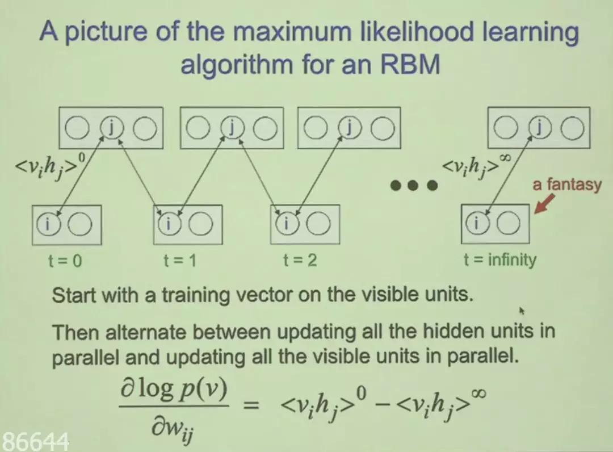

## 理论优美的深度信念网络，Hinton老爷子北大最新演讲  

> 作者: 机器之心  
> 发布日期: 2019-05-14  

机器之心报道

**机器之心编辑部**

> 深度信念网络曾照亮了深度学习的前进之路，今天，Hinton 通过远程视频演讲，再一次为我们展现了DBN的思想与理论之美。

2006年，研究者对深度神经网络的兴趣再度复兴，而这主要归功于Hinton等人发现的高效新方法。借助深度信念网络（Deep Belief Nets, DBN），当时研究者可以在未标注数据上预训练深度神经网络，这是一种生成模型的方式。预训练完成后，神经网络可以在标注数据上实现判别式的精调，从而获得很好的效果。

这就是最初深度网络的训练方法，也是令深度学习进入ML社区的开创性新研究。尽管目前训练深度神经网络不再需要这种预训练，但它的思想及做法仍深深影响着当前的研究者。

刚刚，Geoffrey Hinton受邀远程为北大学子做了一场分享，深入介绍了深度信念网络的理论知识。

在这一次演讲中，Hinton展示了深度信念网络的预训练过程，并介绍了它如何从玻尔兹曼机的早期训练过程中演化出来。Hinton表示，DBN在理论上是非常优美的，但却过于低效而无法应用于实践。此外，对于训练密集连接型信念网络，Hinton还将介绍预训练过程如何克服主要的实践问题。

应讲者要求，此次演讲没有回放，也不会公开录像，所以小编只记录了演讲PPT给读者们（也因为没听懂），感兴趣的读者可作为学习材料使用。

**什么是深度信念网络**

深度信念网络是第一批成功应用深度架构训练的非卷积模型之一。 在引入深度信念网络之前，研究社区通常认为深度模型太难优化，还不如使用易于优化的浅层ML模型。2016年，Hinton等研究者在Science上表示，深度信念网络在MNIST数据集上表现超过带核函数的支持向量机，以此证明深度架构是能够成功的。

论文1：Reducing the Dimensionality of Data with Neural Networks

论文地址：https://science.sciencemag.org/content/313/5786/504

论文2：A fast learning algorithm for deep belief nets

论文地址：https://www.cs.toronto.edu/~hinton/absps/fastnc.pdf

尽管现在与其他无监督或生成学习算法相比，深度信念网络大多已经失去了研究者青睐并很少使用，但它们在深度学习历史中仍然有非常重要的作用。

此外，如果需要理解DBN，那么首先需要知道什么是受限玻尔兹曼机（RBM）。因为深度信念网络就是受限玻尔兹曼机的堆叠，并采用一种贪心的方式训练。

**受限玻尔兹曼机**

RBM是两层神经网络，这些浅层神经网络是DBN（深度信念网络）的构建块。RBM的第一层被称为可见层或者输入层，它的第二层叫做隐藏层。RBM之所以加上“受限”，主要是因为不存在层级间的通信。RBM在前传的过程中看上去和全连接没什么区别，但实际上它是一种无向图，所以还有一个反向过程。

除了前传，RBM以一种无监督的方式通过自身来重建数据。如上图所示，在重建阶段，第一个隐藏层的激活状态变成了反向传递过程中的输入。它们与每个连接边相同的权重相乘，就像x在前向传递的过程中随着权重调节一样。这些乘积的和在每个可见节点处又与可见层的偏置项相加，这些运算的输出就是一次重建，也就是对原始输入的一个逼近。

如果能重建出来对应的观察样本，那么就表示RBM获得的隐藏表征非常优质。如下选自Deep Learning书中描述了三种早期的神经网络。

_a\) 受限玻尔兹曼机，b\) 深度信念网络，c\) 深度玻尔兹曼机。其中带箭头表示有向图，无箭头表示无向图。_

**深度信念网络**

深度信念网络是一种深层的概率有向图模型，其图结构由多层的节点构成。网络的最底层为可观测变量，其它层节点都为隐变量。最顶部的连接是无向的，其他层之间的连接是有向的。它的目的主要在获取可观测变量下，推断未知变量的状态，并调整隐藏状态以尽可能重构出可观测数据。

在Hinton一个多小时的演讲中，它从信念网络到受限玻尔兹曼机，从基本思想到理论解析展示了整个深度信念网络的全景图。不过Hinton老爷子的演讲还挺难懂的，想要了解的同学可以看看完整的PPT。

本期 Interface 我们邀请到了拥有丰富一线开发经验的 NVIDIA 开发者社区经理暨高级讲师 Ken He，为我们介绍 CUDA 并行计算基础，点击阅读原文参与报名。
