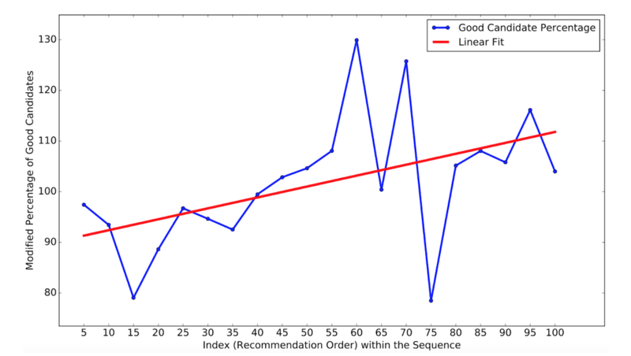

## LinkedIn招聘之搜索和推荐系统背后的AI  

> 作者: Qi Guo  
> 译者: 杨雷  
> 发布日期: 2019 年 5 月 13 日  

在这篇文章中，简要概述了我们的模型探索之旅以及 LinkedIn 中人才搜索系统所使用的架构。这些模型对我们的关键业务指标产生了影响。更重要的是，LinkedIn 会员和客户的搜索效果得到了改善。

### 正文

LinkedIn Talent Solutions（人才解决方案）提供了雇主接触潜在候选人和求职者寻找职业机会的市场。[LinkedIn Recruiter](https://business.linkedin.com/talent-solutions/recruiter)产品是帮助实现这些目标的关键机制，它帮助招聘人员和招聘经理寻找合适的人才，并使他们能够识别“[人才库](https://business.linkedin.com/talent-solutions/blog/2015/08/how-linkedins-talent-pool-reports-can-guide-you-where-and-how-to-recruit)“，提高了雇用成功的可能性。在本文中，我们将首先重点介绍与人才搜索和推荐系统相关的一些独特的信息检索、系统和建模中的挑战。然后，将介绍我们如何规划和解决这些挑战，如何设计和架构整体系统，实践中遇到的问题，以及从 LinkedIn 这些系统的生产部署过程中吸取的经验教训。

### 介绍

LinkedIn Recruiter 产品以查询、职位发布或推荐候选人的形式，提供与搜索请求相对应的候选人排序列表。给定一个搜索请求，选择与请求匹配的候选人，然后根据各种因素（例如，岗位经验 / 技能与搜索范围的相似度、职位发布的位置，以及感兴趣的候选人响应的可能性）使用机器学习的模型在多个过程中进行排序。该应用的屏幕截图如图 1 所示。

_图 1：来自 LinkedIn Recruiter 产品的（模拟）屏幕截图_

* 对于每个推荐的候选人，招聘人员可以执行以下操作：
* 查看候选人的个人简介，
* 将个人简介保存到招聘项目中（作为潜在的匹配项），
* 向候选人发送 InMail。

在本文中，将讨论在 LinkedIn 的人才搜索系统中使用的多种方法。这些方法旨在解决与人才搜索和推荐系统相关的一系列独特的信息检索挑战，具体如下：

1. 与传统的搜索和推荐系统不同，传统的只关注如何评估一条内容和给定查询的相关度，人才搜索领域需要招聘人员和候选人就本岗位互相彼此感兴趣。换句话说，我们不仅需要所显示的候选人必须与招聘人员的查询相契合，而且需要招聘人员联系的候选人必须对岗位机会表现出兴趣。因此，使用适当的指标来优化模型以及在线的 A/B 测试至关重要。于是我们定义了一个新目标，即 InMail Accept（InMail 接受度），当候选人从招聘人员那里收到 InMail 并给出肯定回复时，就会触发目标达成。我们将 InMail Accept 作为双向兴趣的指标，这可能会促使候选人收到岗位机会并接受它。在 Recruiter 产品的新模型上进行实验时（参见[BigData’15](https://arxiv.org/pdf/1602.04572.pdf)，[CIKM’18](https://arxiv.org/pdf/1809.06473)和[SIGIR’18](https://arxiv.org/pdf/1809.06481.pdf)论文详情），我们使用接收并接受 InMail 的前 k 名候选人的评分作为主要评估指标（称为 Precision@k）。
2. 此外，人才搜索系统的底层查询可能非常复杂，它结合了一些结构化字段（如规范化头衔、规范化技能和公司名称）和非结构化字段（例如自由文本式关键字）。根据应用的不同，查询可以由显式地输入的查询文本和所选内容（通过招聘人员搜索或研究文献中所谓的“人才搜索”）组成，也可以隐式地以岗位机会或理想应聘者的形式（[推荐匹配](https://business.linkedin.com/talent-solutions/blog/product-updates/2018/new-linkedin-jobs-features-give-small-businesses-easier-way-find-candidates)）组成。在招聘人员搜索的过程中，为了帮助用户制定查询公式，我们会建议哪些相关对象用户可能感兴趣，例如，对搜索“机器学习工程师”头衔的招聘人员，我们就推荐具备“数据科学家”头衔和“数据挖掘”技能的人才。通过给定的查询，我们的目标是通过数亿个半结构化候选人的个人简介实时确定最相关的候选人的排序列表。因此，可靠的标准化、智能化的查询和查询建议、可扩展索引、候选人选择的高召回率（high-recall）、有效的排序算法、以及高效的多通道评分 / 排序系统是必不可少的（参见[SIGIR’16](https://arxiv.org/pdf/1605.04624)和[WWW’16](https://arxiv.org/pdf/1602.08186.pdf)论文详情）。
3. 最后，个性化对于人才搜索系统而言非常重要，我们需要根据招聘人员所寻找应聘者的类型来模拟他们的意图和偏好。这可以通过离线学习存储的招聘人员所使用数据的个性化模型来实现，或通过了解招聘人员在线使用系统期间的偏好来实现。有时候，招聘人员甚至可能不确定要搜索什么技能，这必须通过一系列候选人的推荐和评估的阶段来学习（关于如何在 LinkedIn 上应用个性化搜索人才的更多细节，参见[CIKM’18](https://arxiv.org/pdf/1809.06488)和[WWW’19](https://arxiv.org/pdf/1902.09041.pdf)论文详情）。

借助本文中描述的建模方法，我们已经能够稳步提升我们的关键业务指标。例如，在两年的时间里，我们能够将求职者的 InMail Accept 数量增加一倍。所有这些努力也有助于实现我们为全球每一位劳动力创造经济机会的愿景。

### 方法

**使用梯度提升决策树（Gradient Boosted Decision Trees）进行非线性建模**
我们的早期机器学习模式是一种线性模型，它的优点是易于解析、解释和部署，在起步阶段是一个很好的选择。但是线性模型不能很好地捕捉非线性的特征交互，我们现在使用[Gradient Boosted Decision Trees（GBDT）](https://en.wikipedia.org/wiki/Gradient_boosting#Gradient_tree_boosting)来释放数据的力量。GBDT 模型通过树结构显式地实现了交互。除了更大的假设空间外，GBDT 还具有其他的一些优势，例如能很好地处理特征共线性（feature collinearity），处理不同范围的特征以及特征值的缺少等。我们使用 GBDT 进行招聘人员搜索排序在线实验，实现了结合（engagement）度（招聘人员和候选人之间）指标统计上显著地改进了几个百分点。

**基于 Pairwise 排序学习（Pairwise LTR）的情景感知排序（Context-aware Ranking）**
为了将对搜索情景的认识添加到我们的 GBDT 模型中，我们进行了以下改进。对于搜索人员的情景，我们添加了一些个性化功能。对于查询的情景，我们添加了更多候选人查询的匹配功能，其中一些功能直接来自 LinkedIn 的旗舰搜索产品。非常重要的是，我们使用具有 Pairwise 排序目标的 GBDT 模型来比较相同情景（即相同搜索请求）中的候选者。Pairwise 优化器会比较相同搜索查询中的成对的结果，而 Pointwise 优化器会假设所有的结果都是独立的，无论它们是否在相同的搜索查询中。出于这个原因，Pairwise 排序能更加体现情景的信息。情景的特征和 Pairwise GBDT 模型的应用，帮助我们在招聘者 - 候选人的结合度指标上提升了十几个百分点。

**深度学习和表示学习方面的努力**
如上所述，因为梯度提升决策树（GBDT）模型具有优于线性模型的特点， 现有的排序系统采用它为 LinkedIn Recruiter 产品提供支持。虽然 GBDT 提供了相当强大的性能，但它带来了以下挑战：

1. 使用其他可训练组件（例如离散特性的嵌入）来扩充树的集成模型（Tree Ensemble Model）是非常重要的。这种做法通常需要对模型与组件 / 特征进行联合训练，而树的集成模型假定不需要对特征本身进行训练。
2. 树模型不能很好地处理稀疏 ID 的特征，如技能 ID、公司 ID 和成员 ID，但我们希望将它们用于人才搜索的排序。由于稀疏特征只有相对少部分是非零的，因此在每个提升步骤中选择这种树生成的可能性很小，特别是这样训练出来的树的深度通常是比较浅的。
3. 树模型在模型工程中缺乏灵活性。可能需要用到新的损失函数，或用其他条件来增强当前的目标函数。使用 GBDT 模型不容易实现这样的修改，但是对于基于可微分编程（differentiable programming）的深度学习模型而言，这些修改相对简单。最终具有（广义）线性层的神经网络模型，还使得采用诸如迁移学习和在线学习之类的方法更容易。

为了克服这些挑战，我们探索了基于神经网络模型的使用，这些模型在设计和规范中提供了足够的灵活性。我们对最多三层的 Pairwise 深度模型进行的离线实验表明，与我们的基线 GBDT 模型相比，后者有了很大的进步，以结合度为标准，我们观察到改进了几个百分点。

我们目前正在探索利用 LinkedIn 的最新模型来改进基础设施，以部署神经网络模型。

人才搜索建模的另一个重大挑战是，招聘人员如何将大量可用的实体作为搜索的一部分，以及如何利用它们进行候选人选择和排序。例如，招聘人员如何从成千上万的 LinkedIn 标准化的技能中进行选择。由于不同的实体在不同程度上可以相互关联，因此使用句法特征（例如，候选者只拥有查询技能的一小部分）有局限性。相反，更需要利用实体的语义表示，例如，以低维嵌入（low dimensional embedding）的形式。这种表示能将许多稀疏实体更好地合并为机器学习模型的一部分。在 Recruiter 中，我们利用经过[大规模信息网络嵌入（LINE）](https://arxiv.org/pdf/1503.03578.pdf)方法训练的无监督网络嵌入。LINE 可以优化一阶近似和二阶近似，适用于有向图和无向图，并且扩展性很好。网络嵌入使用修改版的[LinkedIn 经济](https://economicgraph.linkedin.com/)[图谱](https://economicgraph.linkedin.com/)（Economic Graph）进行训练，根据两个实体存在于多少个 LinkedIn 成员的个人简介中，来生成这两个实体之间边的权重（例如，他们共有的技能，或者都曾在一条边两端的两个公司工作等）。下面给出了公司实体的图表说明：

_图 2：公司实体图的图示_

我们利用生成的嵌入作为我们训练 GBDT 模型的功能的一部分，这种基于网络嵌入语义相似度特征的 GBDT 模型的在线实验显示，以结合度指标做比较，提升了几个百分点。但是，这种提升在统计意义上并不显著。假设检索过程是基于头衔 id 进行精确匹配的，所以基于嵌入的相似度不会对检索结果产生太大的差异，这促使我们把它应用到检索阶段。我们采用了一种扩展查询的策略，当原始查询返回的结果太少时，该策略会添加具有相似语义的头衔，例如“软件开发人员”之于“软件工程师”。

**基于 GLMix 的实体级个性化（Entity-level Personalization）**
在招聘人员进行搜索的领域中，多个实体（如招聘人员、合同、公司和候选人）发挥了作用。为了将实体级偏好纳入非线性模型，我们在混合模型中结合了两者的优点。对于实体级的个性化，我们使用[广义线性混合（GLMix）模型](https://www.kdd.org/kdd2016/papers/files/adf0562-zhangA.pdf)，并在招聘人员的搜索领域中对多个实体进行个性化实验。为了实现非线性的特征交互，我们在实际环境中使用 GBDT 模型作为特征变换器，来生成树的交互特征（Tree Interaction Features）和 GBDT 模型评分。根据我们的离线实验，我们在最终的 GLMix 模型中使用了招聘人员级和合同级的个性化方案。图 3 显示了使用 LTR 特征、树交互特征和 GBDT 模型评分构建 GLMix 模型的管道。LTR 特征用作预训练 GBDT 模型的输入，产生被编码成树交互特征的树集合和每个数据点的 GBDT 模型评分。然后，利用原有的 LTR 特征，以及它们在树交互特征和 GBDT 模型评分的形式下的非线性转换，建立了一个具有招聘人员级和合同级的个性化 GBDT 模型。

_图 3：具有树交互功能的 GLMix 模型的管道_

在在线实验中，我们将最佳 GLMix 模型的变体“GLMix 全球 + 每个合同 + 每个招聘人员”模型与当时的生产模型进行了基准测试，这是一种 Pairwise GBDT 模型。与 Pairwise GBDT 基础模型相比，使用具有树交互特征的 GLMIX 模型的在线实验结果，使得结合度在统计学意义上的显著地改进了几个百分点。

**会话中的在线个性化**
利用离线学习模型的一个缺点是，当招聘人员检查推荐的候选人并提供反馈时，在当前的搜索会话期间不会考虑这个反馈。因此，Recruiter 团队开发了适应用户反馈的系统，经过一些处理步骤（依次对候选人给出即时反馈），推荐最佳候选人。

下面是我们为这样一个系统使用的架构。它首先将岗位潜在的候选人空间按技能进行分组，然后，利用多臂赌博机（multi-armed bandit）模型，根据招聘者当前的意图，了解哪个组更合适，并且根据反馈更新每个技能组内的候选人排序。

_图 4：多臂强盗在线个性化系统的架构_

下面是我们使用这种推荐算法进行的初步实验的一些结果。当更多的候选人被呈现给用户时，我们还可以展示推荐的准确度（候选人是否被用户正面评价）。图中显示，随着推荐模型中更多的反馈，候选人推荐的质量得到了提高（获得越来越多的正面反馈）。注：根据公司政策，对标记为“良好匹配”的候选人的准确百分比进行了修改。

_图 5：每个指数的优秀候选人的百分比_

最近我们团队中在线学习方向的另一项努力，是学习各种个人简介的属性（例如技能、头衔、行业和资历），基于应聘者对这些属性的的反馈，找到和招聘人员最相关的那些属性 。如果招聘人员一直对那些有领导能力的会计师或者擅长社交媒体的项目经理感兴趣，我们的目标是推荐更多这样的候选人，并隐式地学习招聘人员的搜索查询来了解他们的意图。这一切都是在线实时发生的，因此可以即时地考虑收到的反馈。有关此方法的更多详细信息，感兴趣的读者请查看另一篇最近的[LinkedIn 工程博客文章](https://engineering.linkedin.com/blog/2019/02/learning-hiring-preferences--the-ai-behind-linkedin-jobs)。

### 系统设计与架构

LinkedIn 在 Lucene 上构建了一个名为[Galene](https://engineering.linkedin.com/search/did-you-mean-galene)的搜索堆栈，并为各种插件做出了贡献，包括实时更新搜索索引的功能。搜索索引包含两种类型的字段：

* **inverted 字段：** 从搜索词到包含它们的实体（成员）列表的映射。
* **forward 字段：** 从实体（成员）到元数据的映射。

这些搜索索引字段有助于评估搜索排序中的机器学习特征值。搜索索引字段中数据的新鲜度对于机器学习功能也是非常重要的。

_图 6：人才搜索架构和流程_

招聘人员搜索具有分层的排序架构：

* **L1：** 进入人才库，对候选人进行评分 / 排序。在这一层中，候选检索和排序是以分布式方式完成的。
* **L2：优化** 入选人才，使用外部缓存实现更多动态功能。

_图 7：详细的搜索检索和排序架构_

Galene 代理系统将搜索查询请求分散（fan out）到多个搜索索引分区。每个分区检索匹配的文档，并将机器学习模型应用于检索的候选对象。每个分区对候选对象的子集进行排序，然后代理收集排序后的候选对象并将其返回给联邦者（Federator）。联邦者使用动态或从高速缓存引用的附加排序特征（这是 L2 排序层），进一步对检索到的候选对象进行排序。有关我们的联邦搜索体系架构的更多详细信息，请参阅先前与此主题相关的[LinkedIn 工程博客文章](https://engineering.linkedin.com/blog/2018/03/search-federation-architecture-at-linkedin)。

### 结论

在这篇文章中，我们简要概述了我们的模型探索之旅以及 LinkedIn 上人才搜索系统所使用的架构。这些模型对我们的关键业务指标产生了影响。更重要的是，LinkedIn 会员和客户的搜索效果得到了改善。最近，出于 LinkedIn[为全球每一位成员创造经济机会](https://www.youtube.com/watch?v=DZAJ2hZJFQo)的目标以及确保客户能够获得多样化人才的浓厚兴趣，我们还将[性别代表性排序作为我们人才搜寻的一部分](https://engineering.linkedin.com/blog/2018/10/building-representative-talent-search-at-linkedin)，部署给全球 LinkedIn 招聘产品的所有用户。

**查看原文链接** ：[The AI Behind LinkedIn Recruiter Search and Recommendation Systems](https://engineering.linkedin.com/blog/2019/04/ai-behind-linkedin-recruiter-search-and-recommendation-systems)
