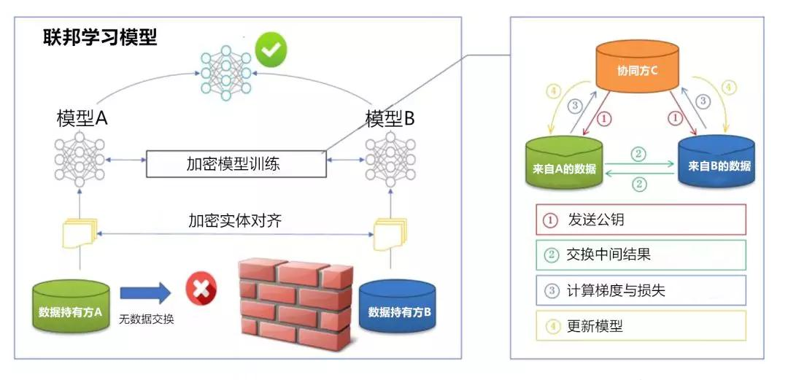

## 没有领域和算法限制，联邦学习是打破数据孤岛的利器  

> 原创：  
> Debra  
> 作者: AI前线  
> 发布日期: 2019-05-05  

采访嘉宾｜陈天健  整理 & 编辑｜Debra **AI 前线导读：** 联邦学习最近频频被业内提起，IEEE 联邦学习标准预计将于两年之内推出的消息也引起一波关于联邦学习的热议。今天，AI 前线通过微众银行 AI 部门副总经理，前百度主任架构师（T10）、百度金融首席架构师，ArchSummit 全球架构师峰会讲师陈天健，来进一步详细了解联邦学习的原理、作用、目前的落地现状，以及未来的应用前景。

**更多干货内容请关注微信公众号“AI 前线”（ID：ai-front）**

机器学习已发展几十年，在互联网普及的过程中，大量数据产生，传统模型在记忆量与拟合能力上遇到瓶颈。借着 GPU 算力大涨的东风，深度学习被用于突破这个瓶颈，进而产生了很多应用。随着机器学习应用的进一步发展，社会各个成员对数据安全隐私意识开始觉醒，造成了很多数据孤岛。基于单个数据拥有方，越来越难以构建效果良好的机器学习模型，这就需要有新的技术出现来解决孤岛问题。

陈天健认为，联邦学习是最有可能解决孤岛问题的技术。为什么他会这样说？

联邦学习的含义和原理

**首先，联邦学习是什么？这一名称和联邦制有什么共通之处吗？**

陈天健表示，和很多其他技术一样，联邦学习是先有英文名字：Federated Learning。在对这个技术不断深入研究的过程中，微众银行的 AI 团队发觉需要一个比较传神的中文名字方便对中文科研与技术社区的推广。微众银行首席人工智能官（CAIO），同时还是中国人工智能学会副理事长、AAAI/ACM/IEEE Fellow、IJCAI 理事长的杨强最先提议使用“联邦学习”这个名字，以体现促进多方合作的同时保持独立，“君子和而不同”的含义。

陈天健认为，联邦学习中的“联邦”更多的是强调一种开放、平等、包容的 AI 合作生态，和历史上出现的联邦制国家的概念还是有明显区别的。

（联邦学习系统架构）

其次，联邦学习的基本原理是什么？业内人士都在强调联邦学习在数据隐私方面的重大意义，那么 **它是如何在不共享隐私数据的情况下，进行协同的训练 **？****
陈天健解释道，简单来说，联邦学习不用汇聚模型训练所需的数据进行集中计算，而是分散机器学习的计算到参与各方的数据库上进行加密的分布式计算。为了协调各个分布式计算的节点，梯度相关数据需要被传递，这就需要对梯度相关数据进行隐私保护，防止原始数据被反向推算出来。 **整个模型训练过程自始自终、没有任何原始数据和原始数据的加密 / 脱敏数据被传输，从而保护了数据拥有者各自的隐私。** 联邦学习技术突破

**在全球范围内，最近联邦学习技术有了哪些最新的进展和突破才得以被业界关注？**

从 2017 年开始，大量的联邦学习技术成果被报导出来。陈天健认为，以谷歌研究院团队为代表的技术流派比较看重移动设备上的隐私保护问题，尝试建立数百万 Android 设备之间的联邦模型，以避免用户隐私数据上传到数据中心后的隐私权、遗忘权实践问题。而以微众银行 AI 团队为代表的技术流派，比较看重跨机构跨组织大数据合作场景，尤其是银行金融场景的数据安全和隐私保护问题，并且尝试将联邦学习框架通用化，并引入迁移学习技术进一步提高数据利用率和模型效果。

微众银行开源工业级联邦学习框架

在开源上，微众银行走在了前面。在 GitHub 上，微众银行 AI 团队已经开源了工业级的联邦学习技术框架 Federated AI Technology Enabler（简称 FATE）。FATE 项目不仅提供了一系列开箱即用的联邦学习算法、比如 LR、GBDT、CNN 等等，更重要的是给开发者提供了实现联邦学习算法和系统的范本，大部分传统算法都可以经过一定改造适配到联邦学习框架中来。

之所以叫做“工业级”的联邦学习技术框架，主要原因是 FATE 解决了三个工业应用常见的问题

1.  **计算架构可并行** ：FATE 提供内建的并行计算机制支持大规模建模应用，百万样本也不是问题；

2.  **信息交互可审计** ：FATE 框架所有跨域数据交流都被独立定义和管控起来，方便信息安全审计；

3.  **接口清晰可扩展** ：FATE 各层 IO 和计算接口均被很好抽象，方便进行各种计算机制 / 数据库的对接。

FATE GitHub 开源地址：https://github.com/WeBankFinTech/FATE

哪个技术处理隐私问题最直接有效？

事实上，业界在数据隐私保护方面已经有一些探索，比如谷歌于今年 3 月推出的 TensorFlow Privacy（https://medium.com/tensorflow/introducing-tensorflow-privacy-learning-with-differential-privacy-for-training-data-b143c5e801b6）机器学习框架开源库，英特尔开源的 HE-Transformer（https://venturebeat.com/2018/12/03/intel-open-sources-he-transformer-a-tool-that-allows-ai-models-to-operate-on-encrypted-data/）等。相比于这些解决方案，联邦学习在原理上和它们有哪些差异？哪个技术解决隐私问题的潜力更大一些呢？

陈天健告诉 AI 前线，TensorFlow Privacy 是一个实验性项目，主要是利用差分隐私技术对模型进行转换，防止模型样本数据通过无数次推理被反向解算。而 HE-Transformer 在设计上更多是让模型可以计算同态加密过的用户数据以完成推理过程，避免在推理过程中使用用户原始数据。这些技术的源头非常早了，早期的加密机器学习都是这个路数。但对建模阶段的数据保护，仅仅用同态加密或者差分隐私很难完成，上述两个框架都没有解决方案。真正要完整解决建模 + 预测全流程全生命周期的数据安全与隐私保护问题，需要深度结合机器学习和 MPC 两个技术领域，这就是联邦学习的天下了。

相对 TensorFlow Privacy 来说，TensorFlow Federated 项目方便了开发者开发横向联邦学习应用，“我觉得应该更多关注 TensorFlow Federated。”在数据隐私保护这一问题上，陈天健给出了他的看法。

落地应用

在金融行业中，联邦学习技术目前已经有了一些比较成功的落地应用，联邦学习的效果立竿见影。

微众银行在信贷风控、客户权益定价和监管科技领域同时在推动一系列联邦学习的应用落地，比如小微企业信贷风控上，模型的性能每提高模型 1% 都很困难，微众银行使用银行数据和发票数据进行联邦学习建模后，效果比单独使用银行数据提高了 12%；再如，银行如果想为客户解决差异化权益定价、由于数据倾斜的问题，通常只能覆盖 8%~12% 的客户，而微众银行使用银行数据和互联网数据进行联合建模之后，覆盖率提升到 92%，大幅提升了销售转化水平。

另外，在监管科技领域，微众银行在央行的支持下正在协同各家银行建立联邦反洗钱模型，落实国家加强金融监管的相关政策，解决该领域样本少，数据质量低问题。

对IEEE联邦学习标准两年内推出有信心

近日，AI 前线在 《IEEE 联邦学习标准有望两年内推出，填补 AI 领域“黑洞”》（https://www.infoq.cn/article/1x4-HLu85WgWtkHK4bh4）一文中报道了创新工场宣布南京国际人工智能研究院执行院长冯霁当选 IEEE 联邦学习标准制定委员会副主席，并预计 IEEE 联邦学习标准将于两年内推出的消息。事实上，微众银行也是这一标准项目的主要发起者，同时微众银行首席 AI 官杨强教授担任了这个标准制定委员会的主席，腾讯、第四范式、京东数科等企业也是核心企业。目前，国内外已经有三十多个主要的企业和研究机构参与到标准指定过程当中，微众银行对于两年内这一标准出炉表示有信心，这是一个开放合作包容的技术，也是一个开放合作包容的社区平台。

陈天健表示，因为联邦学习既是一个技术也是一个合作接口标准，业界通过 IEEE 标准的形式将对接标准固定下来，可以保证各方的联邦学习系统能够没有障碍地沟通合作，而不会因为各方实现的微小技术差异而导致社区碎片化。

未来前景

**在未来，联邦学习还有哪些应用前景？**

陈天健表示，联邦学习是一种面向安全合规的大数据合作的机器学习技术，应用前景十分广泛，并没有特别的领域或者具体的算法限制，微众银行甚至已经在机器视觉、装备故障检测等应用中和领域合作伙伴开展技术合作，推动联邦学习社区进一步发展。

随着 5G IoT 技术的进一步发展，设备间传输带宽的大幅改善以及边缘计算性能的增强，联邦学习也将用于 5G IoT 网络基础之上的 AI 能力提升和生态构建。

我们可以从中看出，联邦学习的未来可期，我们也期待联邦学习在未来能有更多的应用尽快落地，解决数据隐私这一越来越严重且全世界人类最关注的问题之一。
