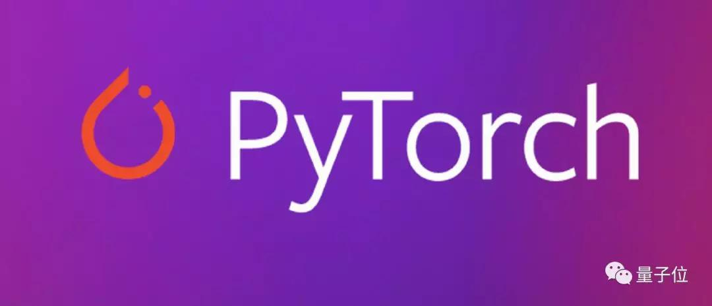
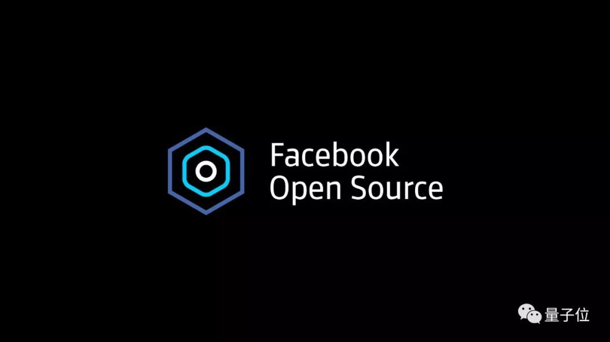
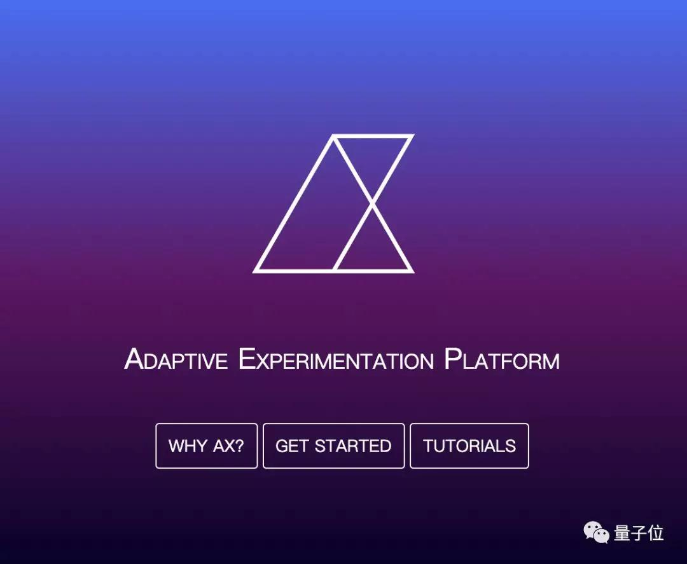
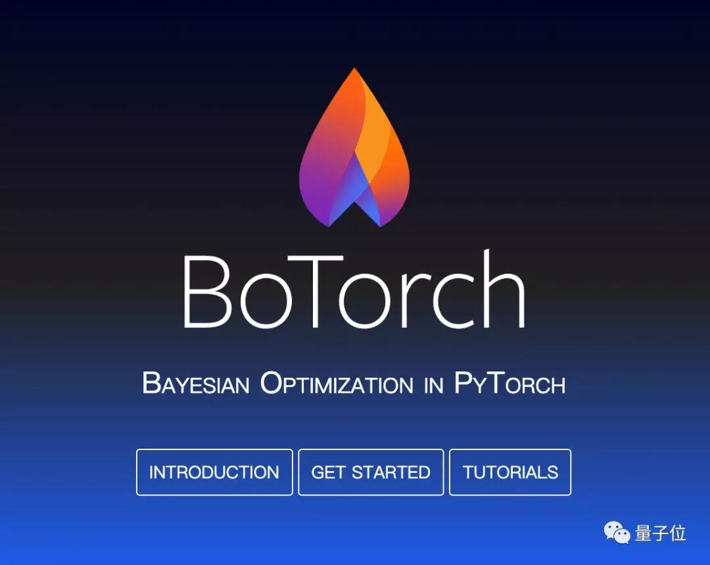
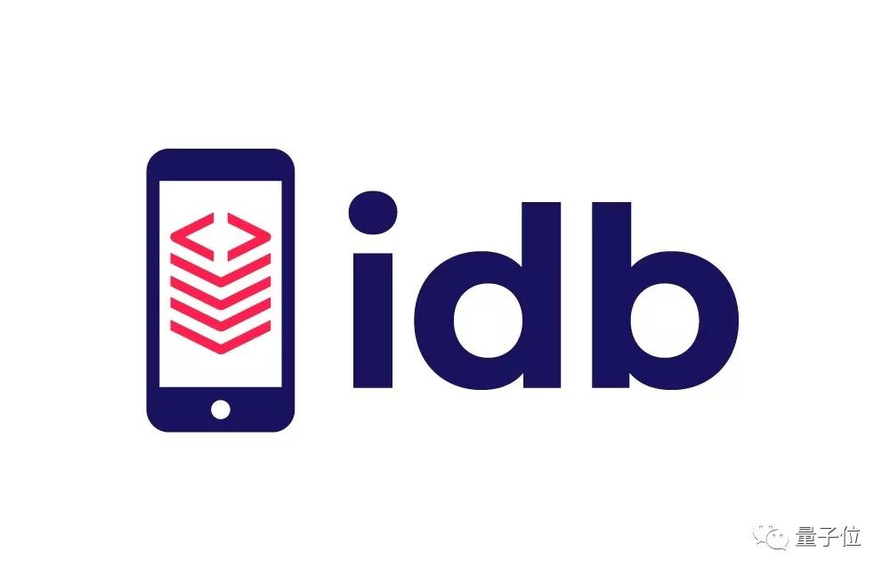
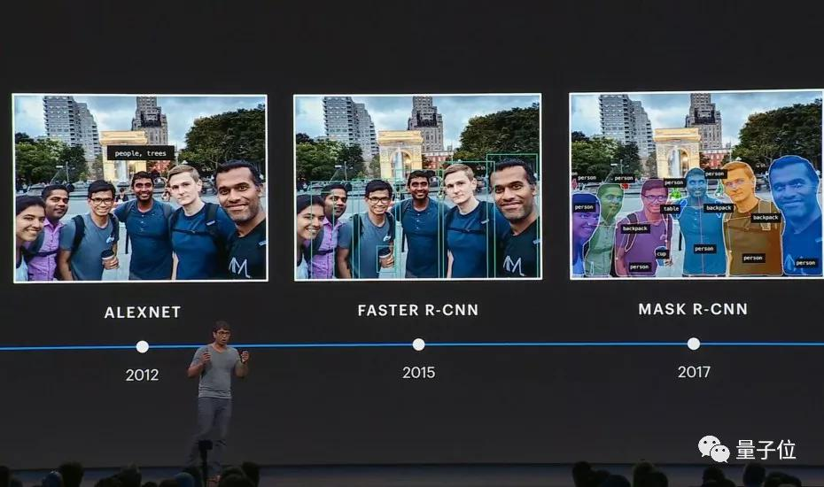
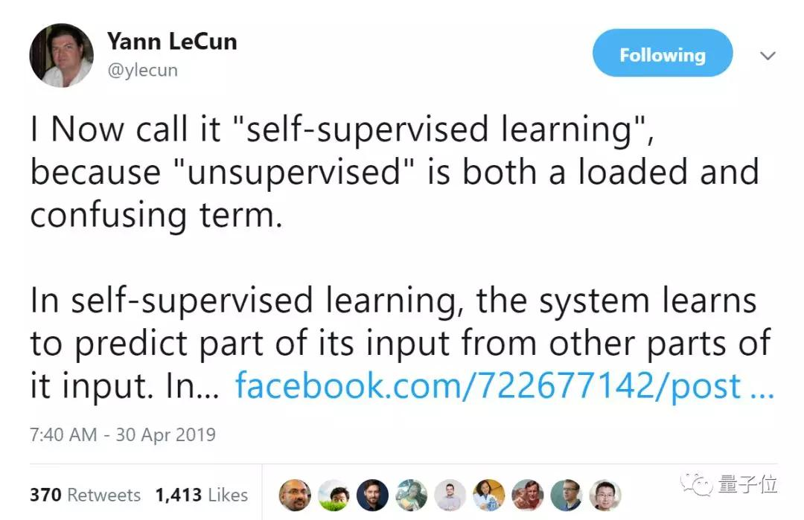

## PyTorch大更新！谷歌出手帮助开发，正式支持TensorBoard | 附5大开源项目  

> 关注前沿科技  
> 作者: 量子位  
> 发布日期: 2019-05-02  

##### 边策 乾明 发自 凹非寺
量子位 报道 | 公众号 QbitAI

大家又少了一个用TensorFlow的理由。

在一年一度的开发者大会F8上，Facebook放出PyTorch的1.1版本，直指TensorFlow“腹地”。

不仅宣布支持TensorFlow的可视化工具TensorBoard，还正式向工业界迈进，为生产环境改进了PyTorch处理分布式训练的方式。

而且，根据Facebook介绍，开发这一版本的过程中谷歌还帮了不少忙。

科技媒体TechCrunch评论称，虽然版本号只从1.0到1.1的变化，但依旧非常重要。

此外，围绕着打造“开发和协作的AI社区”的愿景，Facebook还介绍了5大开源工具。

同时，他们也分享了Facebook在自家程序中应用AI的情况，以及对AI研究的展望。

下面，我们一个个来看~

### Pytorch大更新

与2018年12月正式发布的Pytorch1.0相比，这次发布的1.1版本提高了性能，并增加了新的模型理解和可视化工具，来提高可用性，还提供了新的API。

其中，最重要的功能是支持TensorBoard，它是谷歌为TensorFlow打造的可视化工具，能够帮助开发人员评估和调试模型。

根据Facebook介绍，在开发这一功能的时候，他们与谷歌有非常密切的合作。

现在，Pytorch使用一个简单的“from torch.utils.TensorBoard import SummaryWriter”命令来支持TensorBoard。

其他的更新还有：

* Jit编译器：改进了Just-in-time\(JIT\)编译。包括各种错误的修复以及TorchScript中扩展的功能，例如对字典、用户类和属性的支持。

* 新API：支持布尔张量，更好地支持自定义循环神经网络。

* 分布式训练：改进了常见模型（如CNN）的性能，增加了对多设备模块的支持，包括在仍使用分布式数据并行（DDP）的情况下跨GPU分割模型的能力，以及对并非所有参数都用于每次迭代的模块的支持（如控制流，如自适应SoftMax等）。

关于本次更新，Pytorch在下面的GitHub文档中进行了详细的解释，请收好传送门：
https://github.com/pytorch/pytorch/releases/tag/v1.1.0

对于这次更新，PyTorch的产品经理Joe Spisa表示，他们并不是要将PyTorch变成金钱，而是希望PyTorch拥有一个社区。

他表示，现在这个社区正开始从一个 **以研究为中心的社区** 向 **生产型的社区** 转变，而且转变速度也在快速增长。

PyTorch路线图的下一步是，以更少的比特数运行神经网络，实现更快的CPU和GPU性能，并支持AI从业者创建命名张量维数。

### 5大开源工具

为了更好地建设AI社区，今年的F8大会上，Facebook还开源了5大工具：Ax、BoTorch、idb、Memscout、Mvfst。

#### Ax

Ax是一个可访问的通用自适应实验平台，用于管理、部署和自动化实验。

该平台利用BoTorch提供的最新进展，使开发人员更容易优化其产品和基础设施。Ax还降低了贝叶斯优化（Bayesian optimization）、多臂老虎机（multiarmed bandit）和其他复杂实验技术的门槛，帮助研究人员将想法从研究转向生产。

地址：https://ax.dev/

#### BoTorch

BoTorch是PyTorch上的贝叶斯优化软件库，为Ax优化模型参数提供支持。

BoTorch将模块化设计和PyTorch的自动微分特性基于蒙特卡罗的提取函数使用相结合，显著提高了开发人员的效率。

BoTorch具有与任何PyTorch模型集成的能力，在贝叶斯优化和深度学习中实现高度灵活性、便利的研究。

地址：https://botorch.org/

以上两种工具已经在Facebook内部大规模部署，Facebook用它们改善信息流推荐和视频播放。

#### idb

idb（iOS development bridge）是自动化iOS模拟器和设备的命令行界面。它提供的简单原始的API，轻松构建复杂的工作流。idb还有客户机-服务器架构，可以更容易地在一组机器之间分配工作。

地址：https://github.com/facebook/idb

#### Memscout

Memscout是一个分析工具，它是jemalloc内存分配器的伴侣。Memscout为正在运行的流程的解释jemalloc统计文件（JSON格式）原始数据，并突出显示相关指标。

它会发现分配器的低效率，并提供对流程内存分配模式的深入观察，然后提供可用于快速诊断与内存相关的性能问题的统计信息。

地址：https://github.com/facebookincubator/memscout

#### Mvfst

Mvfst是QUIC传输协议的实现。mvfst的目标是构建最灵活、高性能的传输协议，让应用程序可以适应互联网上和数据中心内的用例。

它的特性包括流多路复用、0-RTT连接的建立，更好的损失恢复、从头开始的安全性以及灵活的拥塞控制。

地址：https://github.com/facebookincubator/mvfst

### 用AI改善用户体验

Facebook信息流可以说是国外的“朋友圈”，里面有太多的假新闻和有害信息，扎克伯格也因此受到美国国会质询。

所以Facebook的AI工具一个重要的用途就是用来识别和处理社交网络上有害的言论、照片和视频。

一个具体例子是新的“最近邻”算法。Facebook用这种算法发现色情暴力图片比以前快8.5倍。

另一个例子是开源工具包LASER。Facebook用它来训练单一模型以理解大量不同语言，而不必为每一种语言使用不同的模型，它可以检测用户是否发布违反社交网络政策的言论。

在视频中发现有害信息的难度比照片高出几个数量级，Facebook的新技术能将其分解为短片段，去掉其中冗余和不相关的内容。这种更有针对性的分析和训练使得AI理解视频更快，更准确。

### One More Thing

目前，Facebook正在大力发展自监督学习技术，将未标记数据与少量标记数据结合使用，以提高机器学习的准确性。

所谓的“自监督学习”就是我们说的“无监督学习”。

Facebook首席AI科学家Yann LeCun说，把“自监督”说成“无监督”是具有误导性的，因为自监督学习比监督学习使用更多的监督信号，并且远远超过强化学习。

自监督学习在自然语言处理方面取得了巨大成功。在LeCun看来，在图像和视频上使用这项技术未来几年ML和AI的最大挑战。
