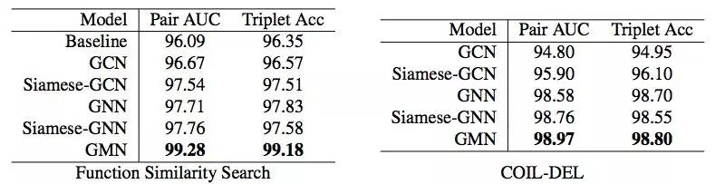
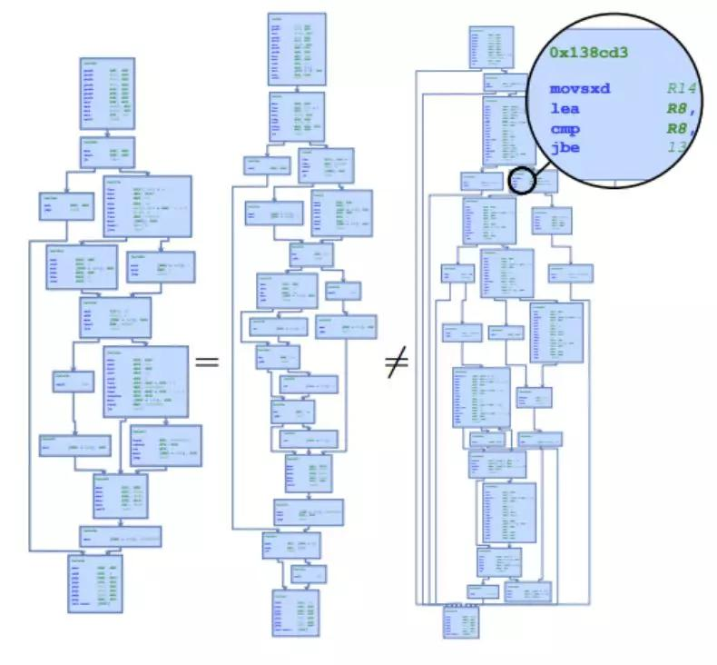
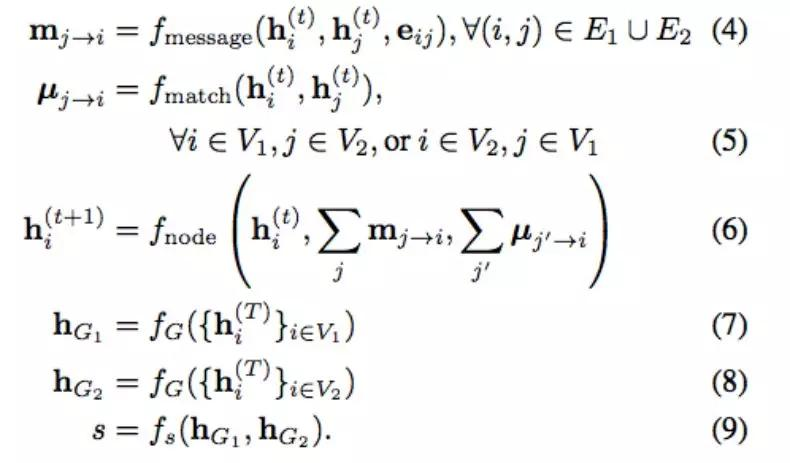
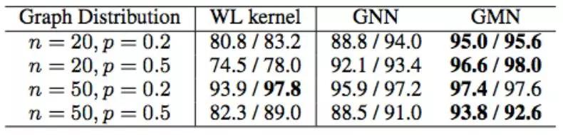
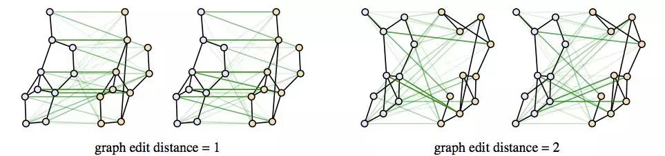
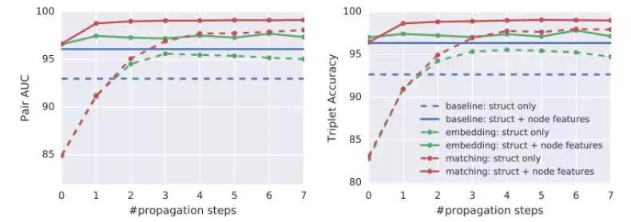
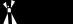

## 如何找到相似Graph？DeepMind提出超越GNN的图匹配网络  

> 作者: 机器之心  
> 发布日期: 2019-05-07  

选自arxiv

**作者** **：Yujia Li、Chenjie Gu、Thomas Dullien等**

**机器之心编译**

**参与：李诗萌、路雪**

> 近日，DeepMind 和谷歌联合进行了一项研究，该研究提出了一种执行相似性学习的新型强大模型——图匹配网络（GMN），性能优于 GNN 和 GCN 模型。该论文已被 ICML 2019 接收。

DeepMind 和谷歌的这项新研究聚焦检索和匹配图结构对象这一极具挑战性的问题，做出了两个重要贡献。

首先，研究者展示了如何训练[图神经网络]()（GNN），使之生成可在向量空间中执行高效相似性推理的图嵌入。其次，研究者提出了新型图匹配网络模型（GMN），该模型以一对图作为输入，通过基于跨图注意力的新型匹配机制进行联合推理，从而计算它们之间的相似性分数。

研究者证明 GMN 模型在不同领域中的有效性，包括极具挑战性的基于控制流图的函数相似性搜索问题，这个问题在检索软件系统的漏洞中起着非常重要的作用。实验分析表明 GMN 模型不止能在相似性学习的环境下利用结构，还能超越针对这些问题手动精心设计的特定领域基线系统。

**研究主题：图相似性学习问题**

图是编码关系结构的自然表征，常常出现在多个领域中。根据图结构数据定义的计算可以用在各种领域中，从计算生物学和化学的分子分析到自然语言理解中知识图或图结构解析的分析都可以。

近几年来，图神经网络（Graph Neural Network，GNN）已经成为可以有效学习结构数据表征、解决各种基于图的监督预测问题的模型了。这样的模型在迭代聚合局部结构信息的传播过程中设计并计算图节点表征，从而对图元素的排列（permutation）具有不变性。然后直接将这些节点表征用于节点分类，或者将它们合并到用于图分类的图向量中。而 GNN 在监督分类或回归以外的问题的相关研究相对较少。

DeepMind 的这篇论文研究的是图结构对象的相似性学习问题，这个问题在现实生活中有很多重要的应用，尤其是在图数据库中基于相似性的搜索。还有一个应用是涉及计算机安全的二元函数相似性搜索，给定的二元函数可能包含有已知漏洞的代码，我们要检查这个二元函数中是否有和已知易受攻击的函数相似的控制流图（control-flow-graph）。这有助于识别闭源软件中易受攻击的静态连结函式库，这是一个很常见的问题 \(CVE, 2010; 2018\)，现在还没有很好的解决方法。图 1 展示了一个例子，在这个例子中用汇编语言注释的控制流图来表示二元函数。这种相似性学习问题极具挑战性，因为就算是图之间细微的差别也会造成语义上极大的不同，但结构不同的图语义上可能非常相似。因此，对这个问题而言，一个成功的模型应该（1）利用图结构；（2）能从图的结构和学习到的语义中推导出图的相似性。

_图 1：二元函数相似性学习问题。检查两个图是否相似需要推理图的结构和语义。左边两个控制流图对应使用不同编译器编译的相同函数（因此二者比较相似），但右侧图对应的是不同函数。_

**解决方案**

为了解决图相似性学习问题，该论文研究了 GNN 在这种情况中的使用，探讨了如何用 GNN 将图嵌入到向量空间，并学习这种嵌入模型，从而使向量空间中相似的图靠近、不相似的图分开。这个模型的一个重要特性是它可以将每一个图独立地映射到一个嵌入向量，然后在向量空间中执行相似性计算。因此，可以预先计算并索引大型数据库中的图嵌入，这样就能用快速的最近邻搜索数据结构（如 k-d 树） 或局部敏感哈希算法 \(Gionis et al., 1999\) 执行高效的检索。

研究者进一步扩展 GNN，提出新型图匹配网络（Graph Matching Networks，GMN）来执行相似性学习。GMN 没有单独计算每个图的图表征，它通过跨图注意力机制计算相似性分数，来关联图之间的节点并识别差异。该模型依赖成对图计算图表征，因此它比嵌入模型更强大，并在准确率和计算之间做出了很好的权衡。

研究者在三个任务上评估了 GMN 和基线模型：仅捕获结构相似性的合成图编辑距离学习任务（synthetic graph edit-distance learning tas），以及两个现实世界任务——二元函数相似性搜索和网格检索，这两项任务都需要推理结构相似性和语义相似性。在所有任务中，GMN 都比基线和结构不可知（structure agnostic）模型的性能更好。在更详细的模型简化测试中，研究者发现 GMN 始终优于图嵌入模型和 Siamese 网络。

该研究的贡献如下：

* 展示了如何用 GNN 产生用于相似性学习的图嵌入；

* 提出了新型图匹配网络（GMN），该网络基于跨图注意力匹配来计算相似性；

* 实验证明，该研究提出的图相似性学习模型 GMN 在多个应用中都有良好的表现，比结构不可知模型和现有的手动建立的基线模型都要好。

**深度图相似性学习**

给定两个图 G1 = \(V1, E1\) 和 G2 = \(V2, E2\)，我们需要一个可以计算两图之间相似性分数 s\(G1, G2\) 的模型。每个图 G = \(V, E\) 被表示为节点 V 和边 E 的集合，每个节点 i∈V 都可以和特征向量 x\_i 相关联，每条边 \(i, j\) ∈ E 都可以和特征向量 x\_ij 关联起来。这些特征可以表示节点类型、边的方向等。如果一个节点或者一条边不能关联任何特征，那么我们可以将对应向量设置成值为 1 的常量。研究者提出了两个图相似性学习模型：一个是基于标准 GNN 的学习图嵌入的模型；另一个是更为崭新也更加强大的 GMN。图 2 展示了这两个模型：

_图 2：图嵌入模型（左）和图匹配模型（右）图示。_

**图嵌入模型**

图嵌入模型可以将每一个图都嵌入到向量中，然后用向量空间中的相似性矩阵衡量图之间的相似性。GNN 嵌入模型包括三个部分：编码器、传播层和聚合器。

**图匹配网络**

图匹配网络以一对图作为输入，计算它们之间的相似性分数。和嵌入模型相比，图匹配模型联合成对图计算相似性分数，而不是先将每个图独立地映射到向量上。因此，图匹配模型可能比嵌入模型更加强大，但它需要额外的计算效率。

图匹配网络改变了每个传播层中的节点更新模块，这样不仅可以考虑到每个图的边上的聚合信息，还可以考虑到衡量一个图中的一个节点和其他图中的一或多个节点匹配程度的跨图匹配向量：

和图嵌入模型相比，图匹配模型能根据对比图改变图的表征。图匹配模型可以调整图的表征，在它们不匹配时放大它们之间的差异。

**实验**

研究者在三个任务上评估了图相似性学习（Graph Similarity Learning，GSL）框架、图嵌入模型（GNN）以及图匹配网络（GMN）的性能，并将这些模型与其他方法进行了对比。总体上，实验结果表明在图相似性学习任务上，GMN 表现优异，而且始终优于其他方法。

**学习图编辑距离（GED\)**

图 G1 和 G2 之间的图编辑距离即将 G1 变换为 G2 所需的最小编辑操作。通常这些编辑操作包括添加／移除／替换节点和边。图编辑距离是衡量图之间相似性的自然指标，在图相似性搜索中有很多应用。

从下表 1 中可以看出，通过学习特定分布的图，GSL 模型的性能优于一般的基线模型，而 GMN 的性能持续优于图嵌入模型（GNN）。

_表 1：在来自不同分布的图上训练的图嵌入（GNN）模型和图匹配（GMN）模型和基线的比较，衡量指标为pair AUC / triplet accuracy \(×100\)。_

_图 3：5 个传播层后 GMN 跨图注意力的可视化。在每一对图中，左图展示了从左到右的注意力，右图展示的是从右到左的注意力。_

**基于控制流图的二元函数相似性搜索**

二元函数相似性搜索是计算机安全领域中的重要问题。当我们无法获取源代码时，可以通过二元函数执行分析和搜索，例如在处理商业或嵌入式软件或可疑的可执行程序时。

下图 4 展示了具备不同传播步和不同数据设置的不同模型在二元函数相似性搜索任务上的性能。从图中，我们可以看到：

* 图嵌入模型和图匹配模型的性能随着传播步的增加而持续提升；

* 在传播步足够的情况下，图嵌入模型持续优于基线模型；

* 图匹配模型在所有设置和传播步的情况下都优于图嵌入模型。

_图 4：不同模型在二元函数相似性搜索任务上的性能（\*100）。_

**更多基线和模型简化测试**

研究者检测了GMN 模型中不同组件的效果，并将 GMN 模型与图卷积网络（GCN）、图神经网络（GNN）和 GNN/GCN 嵌入模型的 Siamese 版本进行对比。

下表 2 展示了实验结果，表明：

* GNN 嵌入模型是具备竞争力的模型（比 GCN 模型强大）；

* 使用 Siamese 网络架构基于图表征学习相似性要比使用预先指定的相似性指标（Euclidean、Hamming 等）好；

* GMN 优于Siamese 模型，这表明在计算过程早期进行跨图信息交流是非常重要的。

_表 2：函数相似性搜索任务上的更多实验结果，以及模型在 COIL-DEL 数据集上的结果。 _ _

___

_论文链接：https://arxiv.org/pdf/1904.12787.pdf_
