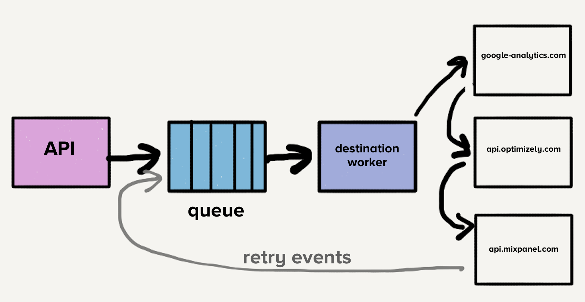
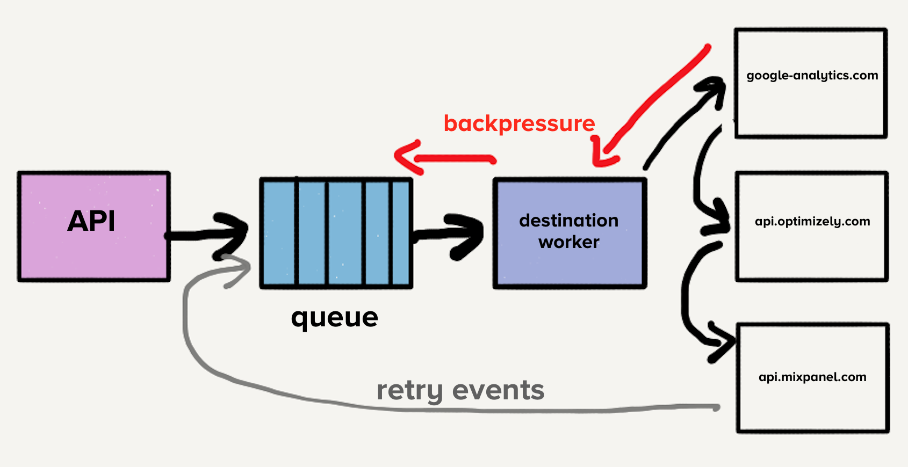
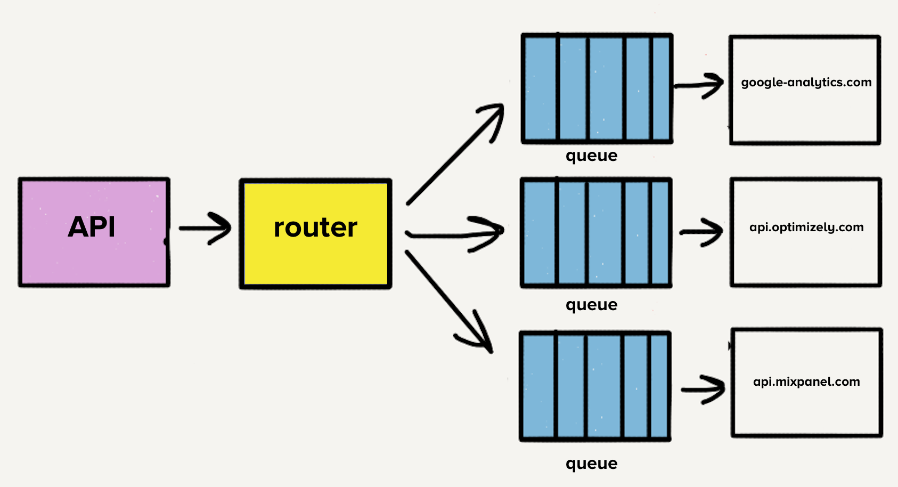
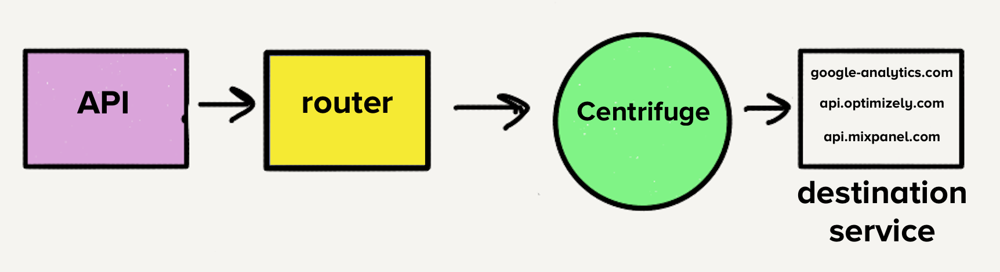

## Segment放弃了微服务  

> 作者: Alexandra Noonan  
> 译者: 平川  
> 发布日期: 2019 年 5 月 27 日  


除非你一直生活在石器时代，否则你可能已经知道微服务是当前流行的架构。随着这一趋势的发展，[Segment 在早期就将其作为一种最佳实践](https://segment.com/blog/why-microservices/)，在某些情况下，这对我们很有帮助，但你很快就会了解到，在其他情况下效果并不好。

简单来说，微服务是一种面向服务的软件架构，在这种架构中，服务器端应用程序是通过组合许多单用途、低空间占用的网络服务来构建的。人们极力宣扬的好处是改进模块化、减少测试负担、更好的功能组合、环境隔离和开发团队自治。与之相反的是单体架构，大量的功能存在于一个服务中，该服务作为一个单元进行测试、部署和扩展。

2017 年初，Segment 的一个核心[产品](https://segment.com/product)达到了一个临界点。这就像我们从微服务的树上掉下来，并在下落的过程中砸到每根树枝一样。小团队没有让我们更快地前进，相反，我们发现自己陷入了复杂性爆炸的泥潭。这种架构的基本好处变成了负担。我们的速度急剧下降，我们的缺陷率却呈现爆炸式增长。

团队最终发现，他们无法取得进展，3 名全职工程师为了维持系统的运行花费了大部分的时间。有些事情必须改变。这篇文章讲述的是我们如何后退一步，采用一种可以很好地满足我们的产品需求和团队需求的方法。

### 为什么微服务曾经有效？

Segment 的客户数据基础设施每秒接收数十万个事件，并将它们转发给合作伙伴 API，我们称之为服务器端目标。这些目标有 100 多种类型，比如谷歌 Analytics、Optimizely 或自定义 webhook。

几年前，当产品最初发布时，架构很简单。有一个 API 接收事件并将其转发到分布式消息队列。在本例中，事件是 Web 或移动应用程序生成的 JSON 对象，其中包含关于用户及其操作的信息。下面是一个有效载荷示例：

复制代码

```
{

"type": "identify",

"traits": {

"name": "Alex Noonan",

"email": "anoonan@segment.com",

"company": "Segment",

"title": "Software Engineer"

},

"userId": "97980cfea0067"

}
```

当从队列中消费事件时，将检查客户管理设置，以确定哪些目标应该接收事件。然后将事件一个接一个地发送到每个目标 API，这非常有用，因为开发人员只需要将事件发送到单个端点，即 Segment 的 API，而不需要构建几十个可能的集成。Segment 向每个目标端点发出请求。

如果对一个目标的某个请求失败，有时我们将尝试稍后再次发送该事件。有些失败可以安全地重试，而有些则不能。可重试错误是指目标可能在不做任何更改的情况下接受的错误。例如，HTTP 500、速率限制和超时。不可重试错误是我们可以确定目标永远不会接受的请求。例如，具有无效凭据或缺少必需字段的请求。



此时，一个队列既包含了最新的事件，也包含所有目标的那些可能已经多次重试的事件，这些事件导致了[队头阻塞](https://en.wikipedia.org/wiki/Head-of-line_blocking)。在这种特殊情况下，如果一个目标变慢或宕机，重试将淹没队列，导致所有目标延迟。

假设目标 X 遇到一个临时问题，每个请求都有一个超时错误。现在，这不仅创建了尚未到达目标 X 的大量请求的积压列表，而且还将每个失败事件放回队列中重试。虽然我们的系统会根据负载的增加自动向上扩展，但是队列深度的突然增加会超过我们的扩展能力，从而导致最新事件的延迟。所有目标的交付时间都将因为目标 X 发生了短暂停机而增加。客户依赖于该交付的及时性，因此，我们无法承受在管道中的任何地方增加等待时间。



为了解决队头阻塞问题，团队为每个目标创建了单独的服务和队列。这个新的架构包括一个额外的路由器进程，它接收入站事件并将事件的副本分发到每个选定的目标。现在，如果一个目标遇到问题，只有它的队列会积滞，其他目标不会受到影响。这种微服务风格的架构将目标彼此隔离，当有目标经常遇到问题时，这一点至关重要。



### 单代码库的情况

每个目标 API 使用不同的请求格式，需要自定义代码转换事件以匹配这种格式。一个基本的例子是目标 X 需要在有效载荷中发送生日 traits.dob，而我们的 API 以 traits.birthday 接收。目标 X 中的转换代码应该是这样的：

复制代码

```
const traits = {}

traits.dob = segmentEvent.birthday
```

许多现代化的目标端点都采用了 Segment 的请求格式，这使得一些转换相对简单。但是，根据目标 API 的结构，这些转换可能非常复杂。例如，对于一些较老且分布最广的目标，我们得自己将值硬塞进手工编写的 XML 有效负载中。

最初，当目标被划分为单独的服务时，所有代码都存在于一个库中。一个非常令人沮丧的地方是，一个失败的测试导致所有目标的测试失败。当我们想要部署一个变更时，我们必须花费时间来修复受损的测试，即使变更与最初的变更没有任何关系。针对这个问题，我们决定将每个目标的代码分解为各自的库。所有的目标都已经被划分为各自的服务，这种转换很自然。

分割库使我们能够轻松地隔离目标测试套件。这种隔离允许开发团队在维护目标时快速前进。

### 扩展微服务和代码库

随着时间的推移，我们增加了 50 多个新目标，这意味着 50 个新的库。为了减轻开发和维护这些代码库的负担，我们创建了共享库，使跨目标的通用转换和功能（如 HTTP 请求处理）更容易、更统一。

例如，如果我们希望从事件中获得用户名，[则可以在任何目标的代码中调用 event.name](http://xn--event-4n1hn6bpa2rq8ap6tf0fq5lxq3drf1b9sep1bs3itu4j.name)\(\)。共享库检查事件的属性键 name。如果不存在，它将检查名字，检查属性 firstName、first\_name 和 firstName。它对姓氏执行相同的操作，检查大小写并将两者组合起来形成全名。

复制代码

```
Identify.prototype.name = function() {

var name = this.proxy('traits.name');

if (typeof name === 'string') {

return trim(name)

}

var firstName = this.firstName();

var lastName = this.lastName();

if (firstName && lastName) {

return trim(firstName + ' ' + lastName)

}
```

共享库使构建新目标变得更快。一组统一的共享功能带来的熟悉度使维护变得不那么麻烦。

然而，一个新的问题开始出现。测试和部署这些共享库的变更影响了我们所有的目标。它开始需要相当多的时间和精力来维护。我们知道，通过变更来改进我们的库需要测试和部署几十个服务，这是一个冒险的提议。如果时间紧迫，工程师们将只在单个目标的代码库中包含这些库的更新后版本。

随着时间的推移，这些共享库的版本开始在不同的目标代码库之间产生差异。曾经，减少目标代码库之间的定制让我们获得了巨大的好处，现在情况开始反转。最终，它们都使用了这些共享库的不同版本。我们本可以构建一些工具来自动化滚动变更过程，但在这一点上，不仅开发人员的生产效率受到影响，而且我们开始遇到微服务架构的其他问题。

另外一个问题是，每个服务都有不同的负载模式。一些服务每天处理少量事件，而另一些服务每秒处理数千个事件。对于处理少量事件的目标，当出现意外的负载高峰时，运维人员必须手动扩展服务以满足需求。

虽然我们实现了自动伸缩，但是每个服务都有不同的 CPU 和内存资源，这使得自动伸缩配置调优更像是艺术而不是科学。

目标的数量继续快速增长，团队平均每月增加三个目标，这意味着更多的代码库、更多的队列和更多的服务。在我们的微服务架构中，我们的运维开销随着目标的增加而线性增加。因此，我们决定后退一步，重新考虑整个管道。

### 抛弃微服务和队列

清单上的第一项是将现有的 140 多个服务合并为一个服务。管理所有这些服务的开销对我们的团队来说是一个巨大的负担。我们几乎为此失眠，因为我们这些随叫随到的工程师要经常处理负载峰值。

然而，当时的架构使迁移到单个服务变得颇具挑战性。由于每个目标都有一个单独的队列，每个工作进程必须检查每个队列是否有工作，这将给目标服务增加一层复杂性，而我们对这种复杂性感到不适。这是[Centrifuge](https://segment.com/blog/introducing-centrifuge/)的主要灵感来源。Centrifuge 将替换所有单独的队列，并负责将事件发送到一个单体服务。



### 迁移到单一代码库

假设只有一个服务，那么将所有目标的代码移动到一个代码库中很容易理解，这意味着将所有不同的依赖关系和测试合并到一个代码库中。我们知道这会很乱。

对于 120 个独一无二的依赖项中的每一个，我们承诺为所有目标提供一个版本。当我们迁移目标时，我们会检查它使用的依赖项，并将它们更新到最新版本。我们修复了与新版本发生冲突的所有目标。

通过这次迁移，我们不再需要跟踪依赖项版本之间的差异。我们所有的目标都使用相同的版本，这大大降低了整个代码库的复杂性。现在，目标维护变得更省时、风险更小。

我们还需要一个测试套件，它允许我们快速、轻松地运行所有的目标测试。在更新我们前面讨论的共享库时，运行所有测试是主要的障碍之一。

幸运的是，目标测试都具有类似的结构。它们有基本的单元测试来验证我们的自定义转换逻辑是否正确，并将执行到合作伙伴端点的 HTTP 请求来验证事件是否如预期的那样出现在目标中。

回想一下，将每个目标代码库划分到它自己的代码库中，最初的动机是为了隔离测试失败。然而，事实证明这是一个不成立的优势。发出 HTTP 请求的测试仍然以一定的频率失败。由于目标被划分到它们自己的代码库中，所以我们几乎没有动力去清理失败的测试。这种不良习惯导致了源源不断的技术债务。通常，一个原本只需要一两个小时就能完成的小变更，最终可能需要几天到一周的时间才能完成。

### 构建一个有弹性的测试套件

测试运行期间对目标端点的出站 HTTP 请求是测试失败的主要原因。不相关的问题，比如凭证过期，不应该导致测试失败。根据经验，我们还知道，有些目标端点比其他端点慢很多。有些目标运行测试的时间长达 5 分钟。我们有超过 140 个目标，我们的测试套件可能需要一个小时来运行。

为了解决这两个问题，我们创建了 Traffic Recorder。它基于[yakbak](https://github.com/flickr/yakbak)构建，负责记录和保存目标的测试流量。每当测试第一次运行时，任何请求及其相应的响应都会被记录到一个文件中。随后的测试将回放文件中的请求和响应，而不是向目标端点发送请求。这些文件被检入代码库中，以保证每次变更时测试都是一致的。现在，测试套件不再依赖于互联网上的这些 HTTP 请求，我们的测试变得更有弹性，这是迁移到单个代码库的必要条件。

我还记得，在我们集成了 Traffic Recorder 之后，第一次针对每个目标运行测试。完成针对所有 140 多个目标的测试需要几毫秒的时间。在过去，一个目标可能就需要几分钟才能完成。感觉就像魔法一样。

### 为什么单体架构有效？

一旦所有目标的代码都存在于一个代码库中，就可以将它们合并到一个服务中。由于每个目标都存在于一个服务中，我们的开发人员的工作效率得到了显著提升。我们不再需要因为变更一个共享库而部署 140 多个服务。一个工程师可以在几分钟内完成服务部署。

证据就在于改进的速度。2016 年，当我们还在使用微服务架构时，我们对共享库进行了 32 次变更。而今年，我们已经做了 46 项改进。过去 6 个月，我们对库的改进比 2016 年全年都要多。

这种变化也使我们的运营从中受益。由于每个目标都存在于一个服务中，我们很好地组合了 CPU 密集型和内存密集型目标，这使得扩展服务以满足需求变得非常容易。大型工作池可以承受负载峰值，因此，我们不再为处理少量负载的目标分页。

### 妥协

从微服务架构到整体的单体架构是一个巨大的改进，但是，也有一些妥协：

1. 故障隔离很困难。由于所有内容都在一个整体中运行，如果在一个目标引入了导致服务崩溃的 Bug，那么所有目标服务都会崩溃。我们有全面的自动化测试，但测试有其局限性。我们目前正在研究一种更加健壮的方法，以防止一个目标使整个服务宕掉，同时又保持所有目标都在一个单体中。
2. 内存缓存的效率较低。以前，每个目标一个服务，我们的低流量目标只有少数几个进程，这意味着它们的控制平面数据的内存缓存将保持热状态。现在，缓存被分散到 3000 多个进程中，所以它命中的可能性要小得多。我们可以用像 Redis 这样的东西来解决整个问题，但这是另一个我们需要考虑的扩展点。最后，我们接受了这种效率的损失，因为它带来了巨大的运营效益。
3. 更新依赖项的版本可能会破坏多个目标。虽然将所有内容都迁移到一个代码库中解决了之前的依赖关系混乱问题，但这意味着如果我们想要使用库的最新版本，我们可能必须更新其他目标。然而，在我们看来，这种方法的简单性是值得做出这种妥协的。通过全面的自动化测试套件，我们可以很快地看到更新的依赖项版本带来了什么破坏。

### 小结

我们最初的微服务架构在一段时间内是有效的，通过将目标彼此隔离来解决管道中的即时性能问题。然而，我们并没有做好扩展准备。当需要大量更新时，我们缺乏测试和部署微服务的适当工具。结果，我们的开发人员的生产效率迅速下降。

迁移到一个单体架构中，可以在显著提高开发人员生产力的同时，消除运维问题。不过，我们并没有轻率地实施这次迁移。我们知道，如果要成功，有些事情是必须考虑的。

1. 我们需要一个健壮的测试套件，把所有的东西都放在一个代码库中。如果没有这个，我们就会和当初决定把它们分开时一样。在过去，不断失败的测试损害了我们的生产力，我们不希望这种情况再次发生。
2. 我们接受了单体架构中需要做出的妥协，并确保每个方面都有一个好的故事。我们必须适应这种变化带来的一些牺牲。

在决定采用微服务还是单体服务时，需要考虑不同的因素。在我们的基础设施的某些部分，微服务工作得很好，但是我们的服务器端目标是这种流行趋势如何实际损害生产力和性能的一个完美示例。原来，我们的解决方案是一个单体架构。

[Stephen Mathieson](https://github.com/stephenmathieson)、[Rick Branson](https://github.com/rbranson)、[Achille Roussel](https://github.com/achille-roussel)、[Tom Holmes](https://github.com/tsholmes)等人促成了向单体架构的转变。

特别感谢[Rick Branson](https://github.com/rbranson)在每一个阶段都帮助审阅和编辑这篇文章。

查看英文原文：[Goodbye Microservices: From 100s of problem children to 1 superstar](https://segment.com/blog/goodbye-microservices/)
