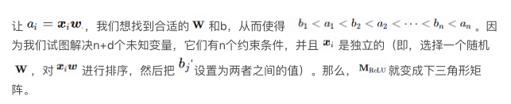
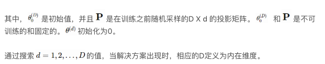

## 深度神经网络是否夸张地过拟合了？  

> 作者: Lilian Weng  
> 译者: 姚佳灵  
> 发布日期: 2019 年 5 月 6 日  

> 本文讨论了一些关于深度学习模型的泛化和复杂性度量的论文，希望能帮助读者理解深度神经网络（DNN）能够泛化的原因。
>
> 如果你和我一样，不明白为什么深度神经网络可以泛化到样本外数据点，而过拟合不严重，那么请看本文。

如果你和我一样，带着传统机器学习的经验进入深度学习领域，我们可能常常会对这个问题感到疑惑：既然典型的深度神经网络有这么多参数，训练误差能够轻松地做到完美，那么，它就应该受到大量过拟合的困扰。如何才能泛化到样本外数据点呢？

在理解为什么神经网络能够泛化的过程中，我想起了一篇关于系统生物学的有趣论文——《[生物学家会修收音机吗](https://bml.bioe.uic.edu/BML/Stuff/Stuff_files/biologist%20fix%20radio.pdf)？》（Lazebnik，2002 年）。如果生物学家打算像生物系统中的工作那样去修收音机，生活可能就很艰难了。因为无线电系统的整个机制还没有完全揭示出来，所以寻找小的局部功能也许会得到一些线索，但是，这很难呈现系统中的所有交互情况，更不用说整个工作流程了。无论我们是否认为这和深度学习相关，那篇文章读起来都会很有趣。

我想在本文中讨论一些关于深度学习模型的泛化和复杂性度量的论文。希望能帮助读者理解深度神经网络（DNN）能够泛化的原因。

* 压缩和模型选择的经典定理（Classic Theorems on Compression and Model Selection）

* 奥卡姆剃刀（Occam’s Razor）

* 最小描述长度原理（ Minimum Description Length principle）

* Kolmogorov 复杂性（Kolmogorov Complexity）

* Solomonoff 的归纳推理理论（Solomonoff’s Inference Theory）

* 深度学习模型的表现力（Expressive Power of DL Models）

* 通用逼近定理（ Universal Approximation Theorem）

* 证明：双层神经网络的有限样本表达性（Finite Sample Expressivity of Two-layer NN）

* 深度神经网络可以学习随机噪声

* 深度学习模型是否夸张地过拟合了？

* 深度学习的现代风险曲线

* 正则化不是泛化的关键

* 内在维度

* 异构层稳健性

* 实验

* 参考文献

### 压缩和模型选择的经典定理

假设我们有一个分类问题和一个数据集，我们可以开发很多模型来解决这个分类问题，从拟合简单的线性回归到在磁盘空间中存储整个数据集。哪个更好呢？如果我们只关心训练数据的准确性（特别是考虑到测试数据可能未知），存储方法似乎是最好的，但是，听起来不太对。

在这个场景中，当我们要决定一个好的模型应当具有哪种属性时，有很多经典理论可以指导我们。

#### 奥卡姆剃刀

[奥卡姆剃刀](https://bml.bioe.uic.edu/BML/Stuff/Stuff_files/biologist%20fix%20radio.pdf)是一种用于解决问题的非正式原则，由[Ockham 的 William](https://en.wikipedia.org/wiki/William_of_Ockham)在 14 世纪提出：

> “简单的解决方案比复杂的方案更可能是正确的。”

当我们面对多个候选的潜在理论，必须挑出一个来解释世界时，这个说法极其有用。对于一个问题，有太多不必要的假设似乎是合理地，但是很难泛化到其他复杂的问题，或者最终归结到了宇宙的基本原则上。

想想看，人们花了数百年的时间才搞明白，天空在白天看起来是蓝色的，而太阳下山时是红色的原因是相同的[瑞利散射](https://en.wikipedia.org/wiki/Rayleigh_scattering)，尽管这两个现象看起来极其不同。对于它们，人们肯定分别提出了很多其他解释，但是，统一且简单的版本最终胜出。

#### 最小描述长度原理

奥卡姆剃刀原理可以类似地应用于机器学习模型。这个概念的形式化版本被称为最小描述长度（Minimum Description Length，简称 MDL）原理，用于比较竞争模型 / 解释给定的观察到的数据。

> “理解就是压缩。”

MDL 中的基本思想是把学习看作数据压缩。通过压缩数据，我们需要发现数据中的规律或模式，这些规律或模式具有很高的潜力以泛化到尚未看到的样本中。信息瓶颈理论认为，首先是训练深度神经网络，通过最小泛化误差表示数据，然后学习通过修剪噪声来压缩这种表示。

与此同时，MDL 把模型描述看作是压缩交付的一部分，因此，模型不能任意大。

MDL 原理的两部分版本表示为：设，

……是个模型列表，该模型列表可以解释数据集 D。它们中最好的假设应该是把总和最小化的那个：

简而言之，最好的模型是包含编码数据和模型本身的最小模型。按照这个标准，我在本节开始提到的存储方法似乎很糟糕，不论它在训练数据上达到的准确度有多好。

人们可能认为奥卡姆剃刀是错的，鉴于现实世界可以任意复杂，为什么我们必须找到简单模型呢？MDL 的一个有趣观点是，把模型看作“ **语言** ”，而不是基本的生成定理。我们希望找到好的压缩策略来描述一个小型样本集中的规律性，但是，它们不必是解释这种现象的“真实”生成模型。模型可以是错的，但仍然有用（即，考虑任何一个贝叶斯先验）。

#### Kolmogorov 复杂性

Kolmogorov 复杂性依赖于现代计算机的概念来定义对象的算法（描述性）复杂性：描述对象的最短二进制计算机程序的长度。继 MDL 之后，计算机本质上是最通用的数据解压器形式。

请注意，通用计算机可以模仿任何其他计算机的操作。所有现代计算机都是通用计算机，因为它们都可以简化为图灵机。无论我们使用什么计算机，这个定义是通用的，因为另一台通用计算机总是可以被编程以克隆计算机 u 的行为，与此同时，编码该克隆程序只是一个常量。

在 Kolmogorov 复杂性和香农信息理论（Shannon Information Theory）之间有很多联系，因为这两者都与通用编码有关。令人惊讶的事实是：一个随机变量的期望 Kolmogorov 复杂性与其香农熵（请参看[此报告](https://homepages.cwi.nl/~paulv/papers/info.pdf)的 2.3 节）近似。关于这个主题更多的内容超出了本文的讨论范围，但是，网上有很多有意思的文章。请动手找一找，看一看。

#### Solomonoff 的归纳推理理论

奥姆卡剃刀的另一个数学形式是 Solomonoff 的通用归纳推理理论（Solomonoff， 1964 年）。其原则是，根据其 Kolmogorov 复杂性，选择与生成训练数据的“最短程序”对应的模型。

### 深度学习模型的表现力

与传统统计模型相比，深度神经网络的参数极其多。如果我们使用 MDL 来衡量深度神经网络的复杂性，并把参数的数量作为模型描述长度，那么，它看起来将非常糟糕。模型描述 L（H）很容易失控。

但是，对于神经网络来说，拥有大量参数是必要的，以便获得较高的表现力。由于其拥有捕捉任何灵活数据表达的强大能力，深度神经网络在很多应用程序中获得了巨大的成功。

#### 通用逼近定理

通用逼近定理指出，前馈网络具有：1）线性输出层，2）至少一个包含有限数量神经元的隐藏层 ， 3）一些激活函数可以近似 **任何** 在 Rn 紧凑子集上的连续函数以获得任意准确度。该定理首先被证明用于 S 型（sigmoid）激活函数（[Cybenko，1989 年](https://pdfs.semanticscholar.org/05ce/b32839c26c8d2cb38d5529cf7720a68c3fab.pdf)）。后来，通用逼近性质被证明不特定于激活的选择（[Hornik， 1991](http://zmjones.com/static/statistical-learning/hornik-nn-1991.pdf)），而是多层前馈结构。

尽管单层前馈网络足够表示任何函数，但宽度必须是指数级大。通用逼近定理不能保证模型是否被正确地学习或泛化。通常，添加更多的层有助于减少浅层网络所需的隐藏神经元的数量。

为了利用通用逼近定理，我们总是可以找到一个神经网络来表示在任何期望阈值下都有误差的目标函数，但是，我们需要付出代价，因为网络可能会变得非常大。

#### 证明：双层神经的有限样本表达性

到目前为止，我们讨论的通用逼近定理不考虑有限样本集。[Zhang 和其他人（2017）](https://arxiv.org/abs/1611.03530)提供了一个在双层神经网络上有限样本表达性的简洁证明。

该论文提出了一个定理：

> 存在一个双层神经网络，其具有 ReLU 激活和 2n+d 权重，可以表示在 d 维空间中大小为 n 的样本上的任何函数。

我们可以把 W 简化为在所有列中都具有相同列向量：

#### 深度神经网络可以学习随机噪声

正如我们所知，双层神经网络是通用逼近器，因此，它们能够完美地学习非结构化随机噪声就不足为奇了，正如 \[Zhang 和其他人所写的[论文 2017](https://arxiv.org/abs/1611.03530)所证明的。如果图像分类数据集的标签随机洗牌，深度神经网络的高表现力仍然能够使它们实现接近零的训练损失。这些结果不会随着正则化项的添加而改变。

图 1。在 CIFAR10 上，用随机标签或随机像素拟合模型：\(a\) 学习曲线；\(b - c\) 标签损坏率是随机洗牌标签的百分比。（图像来源：[Zhang 的论文](https://arxiv.org/abs/1611.03530)）

### 深度学习模型是否夸张地过拟合了？

深度学习模型是严重过度参数化的，在训练数据上通常可以获得完美的结果。以传统的角度来看，这就像偏差 - 方差权衡，可能是个灾难，没有东西可以泛化到还没看到的测试数据。然而，在通常情况下，这样的“过拟合”（训练误差 = 0）深度学习模型仍然在样本外测试数据上表现不错。这很有趣，原因是什么呢？

#### 深度学习的现代风险曲线

传统机器学习使用以下 U 型风险曲线来衡量偏差—方差权衡，并量化该模型的可泛化程度。如果有人问我，如何判断模型是否过拟合，那么我首先想到的就是这个。

随着模型变得越来越大（添加了更多参数），训练误差减少到接近于 0，但是，一旦模型复杂度增加到超过“欠拟合”和“过拟合”之间的阈值，那么，测试误差（泛化误差）就开始增大。在某种程度上，这和奥卡姆剃刀完全一致。

图 2。U 型偏差——方差风险曲线。（图片来源：左图来自[论文](https://arxiv.org/abs/1812.11118)；右图：[来自该文的图 6](http://scott.fortmann-roe.com/docs/BiasVariance.html)）

不幸的是，这不适用于深度学习模型。[Belkin 等人（2018 年）](https://arxiv.org/abs/1812.11118)调和了传统的偏差—方差权衡，并为深度神经网络提出了新的双 U 型风险曲线。一旦网络参数的数量高到一定程度，风险曲线就进入另一个状态。

图 3。深度神经网络的一种新双 U 型偏差—方差风险曲线。（图像来源：[原始论文](https://arxiv.org/abs/1812.11118)）

该论文称，这可能是由两个原因造成的：

* 假设集。在本文后面的内容中，我们会更多地讨论深度学习模型的复杂性。

* 借助更大的模型，我们或许能够发现更大的函数类，并进一步找到具有更小范数的插值函数，因此“更简单”。

如文中所示，经验性地观察到双 U 型风险曲线。然而，我花了很大的力气来重现结果。有一些可能的迹象，但是，为了生成类似定理的相当平滑的曲线，要照顾到实验中的很多[细节](https://lilianweng.github.io/lil-log/2019/03/14/are-deep-neural-networks-dramatically-overfitted.html#experiments)。

图 4。训练和评估误差，来自一个隐藏层 fc 网络不同数量的隐藏单元。它们在来自 MNIST 的 4000 个数据采样点上训练。（图像来源：[原始论文](https://arxiv.org/abs/1812.11118)）

#### 正则化不是泛化的关键

正则化是控制过拟合和提高模型泛化性能的常用方法。有趣的是，一些研究（[Zhang 等人，2017](https://arxiv.org/abs/1611.03530)）已经表明，显式正则化（即数据增加、权重衰减和丢失）对减少泛化误差既非必要也不充分。

以在 CIFAR10 上训练的 Inception 模型为例（请参看图 5），正则化技术有助于样本外泛化，但不多。没有单一的正则化看起来是独立于其他项的关键。因此，正则化器不太可能是泛化的根本原因。

图 5。在 CIFAR10 上训练的 Inception 模型的准确性，具有不同的数据增加和权重衰减的组合。（图像来源：[原始论文中的表 1](https://arxiv.org/abs/1611.03530)）

#### 内在维度

在深度学习领域中，参数的数量与模型的过拟合无关，这表明参数计数不能指示深度神经网络的真实复杂性。

除了参数计数外，研究人员还提出了很多方法来量化这些模型的复杂度，这些模型包括模型自由度数（[Gao 和 Jojic，2016 年](https://arxiv.org/abs/1603.09260)），或前序码（[Blier 和 Ollivier，2018](https://arxiv.org/abs/1802.07044)）。

我打算讨论关于这个问题的最新方法，该方法被称为 **内在维度** （[Li 等人，2018](https://arxiv.org/abs/1804.08838)）。内在维度直观，易于测量，同时还揭示了不同规模模型的很多有趣特性。

考虑一个具有大量参数的神经网络，形成一个高维参数空间，学习就发生在这个高维的目标景观上。参数空间流形的形状至关重要。例如，通过提供更多预测梯度并允许更大的学习率，更平滑的流形有利于优化，这被认为是批量标准化在稳定训练中获得成功的原因（[Santurkar 等，2019](https://arxiv.org/abs/1805.11604)）.

尽管参数空间巨大，幸运的是，我们不必太担心优化过程会陷入局部最优，因为已经[证明](https://arxiv.org/abs/1406.2572)，在目标景观中的局部最优点几乎总是位于马鞍点，而不是山谷。换句话说，总是有一个维度子集包含离开局部最优并继续探索的路径。

图 6。参数优化景观中各类临界点的说明（图的来源：[这里](https://www.offconvex.org/2016/03/22/saddlepoints/)）

在内在维度度量的背后有一个直觉，那就是，因为参数空间具有这么高的维度，那么，利用所有维度来有效地学习有可能是不必要的。如果，我们只通过一片目标景观仍能学习一个好的解决方案，那么，所得的模型复杂性可能比通过参数计数所显示的复杂性更低。这本质上是内在维度试图评估的内容。

假设模型有 D 个维度，并且其参数表示为 。为了学习，随机采样了一个更小的 d 维度子空间 ，其中 d < D。在一个优化更新期间，只使用更小的子空间 

并重新映射以更新模型参数，而不是根据所有的 D 维度采用梯度步骤。

图 7。当 D = 3 时，直接优化的参数向量的说明。（图片来源：[原始论文](https://arxiv.org/abs/1804.08838)）

梯度更新公式如下所示：

事实证明，很多问题有的内在维度比参数数量更小。例如，在 CIFAR10 图像分类上，一个具有 65 万多个参数的全连接网络只有 9 千个内在维度，而一个包含 6 万 2 千个参数的卷积网络具有的内在维度更低，只有 2900 个。

图 8。测量的各种模型的内在维度 d 达到最佳性能的 90%。（图的来源：[原始论文](https://arxiv.org/abs/1804.08838)）

内在维度的测量表明，深度学习模型比它们看起来的要简单得多。

#### 异构层稳健性

[Zhang 等人（2019）](https://arxiv.org/abs/1902.01996)研究了参数在不同层中的作用。论文中提出了一个基本问题：“所有的层是否‘生而平等’？”简短的回答是：不平等。模型对某些层中变化更敏感，但对某些层中的变化就不敏感。

借助这两种操作可以把层分为两类：

* **稳健层：** 在重新初始化或重新随机化层后，网络的性能下降可忽略不计。

* **关键层：** 否则就是关键层。

在全连接和卷积网络中可以观察到类似的模式。任何层的重新随机化完全破坏了模型的性能，因为预测马上变成了随机猜测。更有趣和令人惊讶的是，当应用重新初始化时，只有第一层或最前面的几层（那些最接近输入层的）至关重要，而重新初始化更高层不会导致性能下降。

图 9。（a）在 MNIST 上训练的 fc 网络。每一行对应网络中的一层。第一列是每一层的重新随机化稳健性，其余的列表示在不同训练时间的重新初始化稳健性。（b）在 CIFAR 10 上训练的 VGG11 模型（卷积网络）。与（a）中的表示类似，但是，行和列被转置。（图的来源：[原始论文](https://arxiv.org/abs/1902.01996)）

ResNet 能够在非相邻层之间使用快捷方式在网络上重新分配敏感层，而不只是在底层分配。借助残余块体系结构，网络能够对重新随机化具有均匀的稳健性。只有每个残余块的第一层对重新初始化和重新随机化敏感。如果我们把每个残余块看作局部子网络，那么，稳健性模式类似于上面的 fc 和卷积网络。

图 10。在 CIFAR10 上训练的 ResNet-50 模型的层重新随机化（第一行）和重新初始化（重置行）的稳定性。（图的来源：[原始论文](https://arxiv.org/abs/1902.01996)）

基于深度神经网络的很多顶层对模型重新初始化后的性能并不重要的事实，该论文粗略地总结如下：

> “由于其临界层数量的自限制，用随机梯度训练的超能力深度网络具有低复杂性。”

我们可以把重新初始化看作是减少参数有效数量的方法，从而使观察结果与内在维度所展示的保持一致。

### 实验

在看完以上所有有趣的发现后，重现它们应该非常有趣。一些结果相比其他更容易重现。细节描述如下。我的代码可以从[github lilianweng/generalization-experiment](https://github.com/lilianweng/generalization-experiment)上获得。

#### 深度学习模型的新风险曲线

这是最难以重现的。作者的确给了我很多好的建议，我很感激。以下是他们实验中几个值得注意的设定：

* 没有正则化术语，如权重衰减、退出。

* 在图 3 中，训练集包含 4 千个样本。只采样 1 次，并固定用于所有模型。评估使用整个 MNIST 测试集。

* 每个网络进行长时间训练，以实现接近 0 的训练风险。对不同规模的模型，学习率的调整是不同的。

* 为了让模型对欠参数化区域的初始化不敏感，他们的实验采用一种“权重重用”方案：从训练更小规模的神经网络中获取的参数用于训练更大规模网络的初始化。

我没有为了获得完美的训练性能而对每个模型进行足够长时间的训练或调整，但是，评估误差的确显示在插值阈值周围有特别的扭曲，与训练误差不同。例如，对于 NMIST，阈值是训练样本的数量与类（10）的数量的乘积，即 4 万。

X 轴是模型参数的数量（28 \* 28 + 1）\* num、units + num、units \* 10，以对数表示。

#### 层不是“生而平等”的

这个相当容易重现。请[在此](https://github.com/lilianweng/generalization-experiment/blob/master/layer_equality.py)查看我的实现。

在第一个实验中，我使用一个每层有 256 个单元（unit）的三层 fc 网络。第 0 层是输入层，而第 3 层是输出层。该网络在 10%MNIST 上训练了 100 个轮次。

在第 2 个实验中，我使用一个每层有 128 个单元的四层 fc 网络。其他设置与第 1 个实验中的一样。

#### 内在维度测量

我的实现遵循一种简单的方法，即，通过标准正态分布的独立项采样大型矩阵。期望这些列在高维度空间是独立的，从而是正交的。当维度不是太大时，这个方法可行。当用一个大的 d 探索时，有一些用于创建稀疏投影矩阵的方法，这正是内在维度论文所建议的。

这里有在两个网络上运行的实验：（左）每层有 64 个单元的双层 fc 网络，（右）有 128 个隐藏单元的单层 fc 网络，在 10% 的 MNIST 上训练。对于每个 d，模型训练 100 个轮次。请从[这里](https://github.com/lilianweng/generalization-experiment/blob/master/intrinsic_dimensions_measurement.py)获取代码。

### 参考文献：

\[1\] Wikipedia page on Occam’s Razor.

\[2\] Occam’s Razor on Principia Cybernetica Web.

\[3\] Peter Grunwald. “A Tutorial Introduction to the Minimum Description Length Principle”. 2004.

\[4\] Ian Goodfellow, et al. Deep Learning. 2016. Sec 6.4.1.

\[5\] Zhang, Chiyuan, et al. “Understanding deep learning requires rethinking generalization.” ICLR 2017.

\[6\] Shibani Santurkar, et al. “How does batch normalization help optimization?.” NIPS 2018.

\[7\] Mikhail Belkin, et al. “Reconciling modern machine learning and the bias-variance trade-off.” arXiv:1812.11118, 2018.

\[8\] Chiyuan Zhang, et al. “Are All Layers Created Equal?” arXiv:1902.01996, 2019.

\[9\] Chunyuan Li, et al. “Measuring the intrinsic dimension of objective landscapes.” ICLR 2018.

**阅读英文原文：**[Are Deep Neural Networks Dramatically Overfitted?](https://lilianweng.github.io/lil-log/2019/03/14/are-deep-neural-networks-dramatically-overfitted.html)
