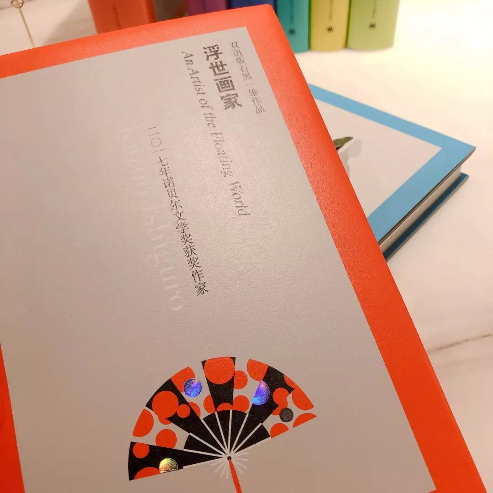

## “石黑双语”是怎样炼成的？ ——双语版石黑一雄作品编辑札记  

> 作者: 上海译文  
> 发布日期: 2019-05-07  

​​

自从石黑一雄获得诺奖后，译文君也听到了不少读者呼吁推出“双语版”的呼声。经过一年的准备后，如今我们终于推出了一套 **双语版** 的石黑一雄文集。 据说这套收录迄今为止全部石黑一雄作品中英文版本的文集，其装帧设计和工艺甚至得到了作者本人的认可和赞叹哦！具体是怎么回事呢，就让石黑一雄中译本责编宋玲老师来和大家分享吧.....

* * *

### “石黑双语” 是怎样炼成的？

文：宋宋

截至 2018年6月《莫失莫忘》出版时，中文版石黑一雄作品系列终于宣告出齐。这位2017年诺贝尔文学奖得主全部的八部作品包括：《远山淡影》、《浮世画家》、《长日将尽》、《我辈孤雏》、《莫失莫忘》、《无可慰藉》、《小夜曲》和《被掩埋的巨人》。

然鹅，小编们的征途是星辰大海，石黑大神的出版工作怎么会就此止步？今年4月，译文出版社正式推出了“ **双语版石黑一雄作品** ”系列。从此，读者就能够在一本书里同时欣赏石黑一雄的原著文本和的中文译本了。我们希望双语版作品会给石黑一雄的粉丝们带去一场双重的美学体验，领略诺奖作品的经典魅力，同时双语版崭新的设计风格也会令读者耳目一新，击节赞叹。

石黑一雄双语版

每册附赠精美明信片一张

双语版石黑一雄作品 2019年4月 出版

石黑一雄作品（单语本）

#### 备受石黑一雄褒奖的双语版封面设计和工艺

双语版石黑一雄作品（以下简称“双语版”）的封面与之前的单语版相比，风格更清新文艺，一眼望去，如一套“彩虹书”——带给人焕然一新、如沐春风的感觉。这套双语版作品从装帧设计到印刷工艺，小编们同封面设计师和技术编辑一起花了不少功夫研究、讨论、改进，简直就是“上穷碧落下黄泉”。（宋小编从业以来也责编过不少套书，但这套“双语版”的出版难度绝对可以排No.1）。

由于石黑一雄的单语作品出版时间最早可追溯到2011年，最先出版的是《小夜曲》《浮世画家》和《远山淡影》，后来又陆续出版了《无可慰藉》、《被掩埋的巨人》，所以直到2018年最后出版的《我辈孤雏》、《长日将尽》和《莫失莫忘》为了延续之前套书的风格，在装帧设计上都有不少束缚，未免遗憾。而对于如今这套双语作品，面对已经完整的作品序列，我们在发稿前就已经经过通盘考虑，力争从内容体例到装帧设计上，各个环节上都做到尽善尽美，匹配诺奖得主的光环。

**开 本**

双语版的开本尺寸为32开的140\*210，比原来单语本130\*184的32开要大不少。同时，140\*210的尺寸也是在我们最标准的A5开本（148\*210）的基础上切了一刀后的结果。大家不要小看这宽度上缩减的8mm，正是由于这一刀，现在的开本在视觉效果上才更符合黄金比例。读者无论是陈列还是拿在手中阅读，都非常适宜。

图左双语版32开尺寸为140\*210，图右单语本尺寸为130\*184，显然开本大了一圈

**封 面**

双语版的封面我们还是有幸邀请到著名的装帧设计师  **张志全大师  **操刀设计（之前的单语本也是由张志全老师设计的）。张志全老师在开设计前，就定下了双语版的整体风格要尽量与单语本拉开差距的这样一个理念。于是，经过与编辑团队的讨论，不辞辛苦地数稿打磨，终于形成了现在双语版的“彩虹系”文艺风。封面上书名、英文名、作译者名等元素的竖列排放，简洁凝练的图案元素，还有画龙点睛的 **镭射电化铝** 效果，处处都彰显出设计师细腻精简的设计语言和独树一帜的设计理念。

封面图案

八部作品的封面上，设计师选择的每一种图案其实都与小说内容有关联。比如《长日将尽》上繁复华美的铁门，代表了古典庄园，呼应了庄园小说的属性；《浮世画家》上的日式扇子，《被掩埋的巨人》的生命树，《远山淡影》的群山阴影，《小夜曲》的萨克斯风，《无可慰藉》的钢琴键盘，《我辈孤雏》的迷宫，《莫失莫忘》的奇特大象，无一不照应小说的情节。这些元素不仅在封面上使用了，还运用在了明信片上。当读者拆开新书的塑封、翻开第一页，映入眼帘的就是这张尺寸为12\*13cm的精美明信片：正面印有每本书封面的图案元素、作者石黑一雄签名，背面附有作品目录。阅读时可做书签使用，亦可集齐8本后配上镜框或小明信片夹，作为装饰之用。

8款明信片图案

####

**得到石黑一雄本人认可**

特别值得一提的是，在我们的封面设计稿通过邮件发给石黑一雄本人审阅后，得到了作者高度认可，石黑通过版权代理向我们和设计师表达了谢意。以下截取了版权代理的部分回信内容。

> “Kazuo Ishiguro really likes the design for the series and would like to congratulate STPH and its designer. Also, he likes their idea of using author photos that correspond to when the books were first published.”

——石黑大神还get到了我们的小心思，双语版每本书前勒口上的作者照片都是与作品出版时间相吻合的，所以这套书中我们会看到各个年龄阶段的大神照片。

> “Kazuo Ishiguro has asked me to thank STPH and their designer. He likes very much the new image – he thinks that the ornate gates work very well for THE REAMINS OF THE DAY and is very happy to approve it now. ”

——这里提到石黑一雄非常喜欢《长日将尽》封面上铁门元素，而这其中原委说来话长。

* * *

####

#### 《长日将尽》封面选图波折

《长日将尽》双语版封面历经三改，最终确定“庄园铁门”元素的第三稿

《长日将尽》是石黑一雄的代表作，曾经获1989年布克奖，因此也是作者最为重视的一部作品。在我们发去的第一稿中，本意是想选择一栋庄园建筑作为封面的元素，可没想到却遭到了石黑本人的强烈反对——原因是这栋建筑看起来更像是教堂。我们反复观察之下，也确实觉得这栋建筑会引起歧义，也理解作者不希望引发读者关于宗教方面的联想。于是，我们请设计师在第二稿中更换了一个更像庄园的建筑，结果就是上面的第二稿。我们满以为这回石黑会欣然接受，但这时中西方文化的鸿沟就体现出来了。

两稿庄园图对比

大家可以对比一下第一稿和第二稿的选图。在中国人眼中第二稿其实不太像教堂的形象。

出乎我们意料的是，第二稿也遭到了石黑一雄和外方版代的坚决反对。在他们眼中，第二稿的建筑仍然是教堂，甚至觉得这是第一稿教堂的侧面。这一来我们真是哭笑不得，东方人对教堂的建筑特色不太敏感，觉得只要没有十字架就不算是教堂，其实不然。事已至此，双语版的出版时间越来越紧，此时已是3月底，为了能顺利赶上423读书日的节点，我们不得不与设计师连夜协商解《长日将尽》封面的改进方案。经过大家的群策群力，为了避免使用建筑而可能引发的歧义，我们决定另起炉灶，不局限于建筑。可到底用什么图案更能代表《长日将尽》呢？一时思路竟也僵住了。

正当大家为图片元素烦恼时，编辑团队中的管舒宁老师灵光乍现，高呼：“铁门怎么样？”

繁复精美的铁门

这一嗓子不亚于阿基米德的那句“Eureka”！瞬间，曙光出现了。繁复精美的铁门具有极好的装饰效果，而且也能令读者瞬间联想到古典的英国庄园，同时又避免作者的误解。因此，最后拍板就用铁门作为《长日将尽》的封面元素，张志全老师尽快找到了合适的铁门图片，并且经过设计后迅速发给作者再次审阅。等待回复的时间有多么焦虑，就不提了，简直是惴惴不安、如履薄冰。幸好最终结果非常圆满，石黑一雄对这个古典华丽的铁门元素非常满意，赞不绝口。（这里也要感谢版权室的同事周敏老师，日夜不停地替我们向国内外版代方传送封面并解释我们的想法。）

张志全老师在这次双语版套书的设计中还别出心裁地使用了电化铝效果。电化铝是个什么黑话？说白了，就是封面上那一丁点 **闪闪发光的镭射纹样** ，这是本套书设计上的一大亮点。

大家会发现每一本图案都带有零星的镭射效果，而形状各不相同，它们随着光线变化会产生折光，有种  **blingbling**  的炫目效果。烫电化铝的工艺我们之前的图书装帧上使用不多。而此次石黑一雄的双语作品，设计师为了能让每一本书都有“弹眼落睛”的效果，便突破常规，大胆使用了这种电化铝工艺。后面我们还会具体说到印刷时使用这种工艺的难度。

> “Thank you for asking about the shadow or laser effect. Ish is grateful to STPH for explaining what it is, and on looking it again, he can see that it also works well, preventing any of the images looking too symmetrical and logo-like.”

——瞧，石黑老师也询问了这种镭射效果的用意，还get到了我们的良苦用心：为了避免封面图案看起来太过于对称或者呆板。泪流满面啊……

**工 艺**

再美好的设计也需要工艺配合，这里我们也要向出版科的朱奇老师致敬——没有他的协作付出，这套出彩的设计很难这么快实现，与大家见面。

我们双语版作品采用的是精装圆脊、包护封的装帧形式。护封采用了170克的超白兰采纸，书壳采用的是2mm荷兰板、116克进口大地纸裱壳，前后环衬和内封用的是100克纯质纸。考虑到双语版篇幅普遍较大，所以正文采用的是平滑度更高、纸张更紧密的65克全木浆双胶纸。美到让人“买椟还珠”的明信片则采用的是210克的米白兰采纸、印黑银双色，因此明信片有种非常酷的冷艳感。

精装圆脊

正文采用65克全木浆双胶纸

双语版最硬核的工艺莫过于烫电化铝，前面我们提过，电化铝的效果是为了起到封面的提亮、点睛作用。设计师最初还曾考虑过每一本采用不同颜色的电化铝，大家可以想象一下五颜六色blingbling的效果。为此我们的技术编辑 **朱奇老师** 为我们提前打样了几次电化铝效果，试下来发现，不同颜色、不同材质的匹配效果反而不如单一的镭射银好，镭射银电化铝的表面折光膜可以反射出光谱的7种不同颜色，在不同角度下观察更是具有不同的色彩效果。

原先打算使用8种不同颜色的电化铝

契合8本不同颜色

不过现实很骨感，打样的效果不太理想

因此最终放弃了这个方案

最后成书统一都使用镭射银电化铝效果

这样整体的装帧有着印刷的各亮色的静，电化铝折射光谱的动，一书一专色的繁，每本统一电化铝的简。动与静的协调，繁和简的统一，有机地体现出石黑一雄作品的细腻与优美。

**内 容**

双语版正文的次序遵照我们一贯双语作品的习惯，前半部分为正文，后半部分为英文，方便读者阅读。而且与单语版相比，双语版中有两部作品在内容上进行了增补。《浮世画家》增加了一篇作者创作的前言，《我辈孤雏》增加了一篇编者后记。《浮世画家》的前言是作者石黑一雄于2016年（即《浮世画家》出版30周年之际）创作的，由该书译者、著名翻译家马爱农老师翻译。《浮世画家》是石黑一雄最“日本”的一部作品，想知道他在创作这部小说时的生活的状况吗？这一时期的英国社会又处于怎样的转型期？普鲁斯特的《追忆似水年华》对病中的石黑又产生了怎样的影响？大家可以在这篇前言中发现许多珍贵的信息。

另外一部小说《我辈孤雏》是石黑作品中具有一定阅读难度的小说，故事情节仿佛迷宫一般，主人公的叙述也亦真亦幻，常常令读者如坠云雾。为了解开读者的疑惑，该书的责编宋佥老师写了一篇非常全面的编者后记，其中不仅有对小说情节的梳理，更有对石黑一雄创作手法的阐释和解读，可以看做是一篇非常有启发性的作品导读，对理解《我辈孤雏》的精髓非常有帮助。

扫描下方二维码

即可购买石黑一雄双语版文集

双语版石黑一雄作品系列 [豆瓣条目](https://book.douban.com/series/46578)

**重磅预告**

刚结束双语版的出版工作，我们手头又开始了一个大项目——那就是新版 **  “海明威文集”**。今年是海明威120周年诞辰，因此译文出版社将过去陆续出版过的海明威作品，重新结集出版，共16种18卷，几乎囊括海明威生前所有重要的虚构和非虚构作品。新版文集的书目包括：

《太阳照常升起》《永别了，武器》《丧钟为谁而鸣》

《春潮 老人与海》《死在午后》《海明威短篇小说全集（上、下）》

《非洲的青山》《流动的盛宴》《第五纵队·西班牙大地》

《海明威书信集（上、下）》《过河入林》《岛在湾流中》

《伊甸园》《有钱人和没钱人》《危险的夏天》《曙光示真》

敬请期待​​​​
