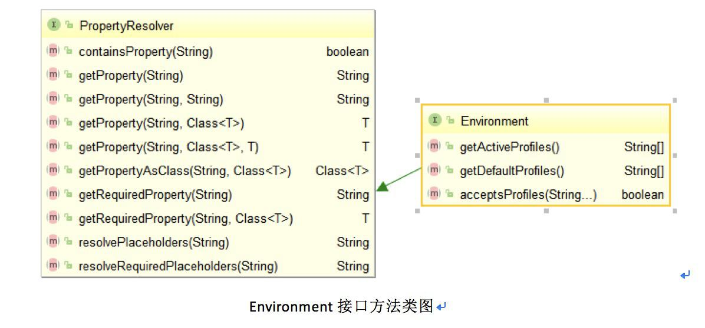
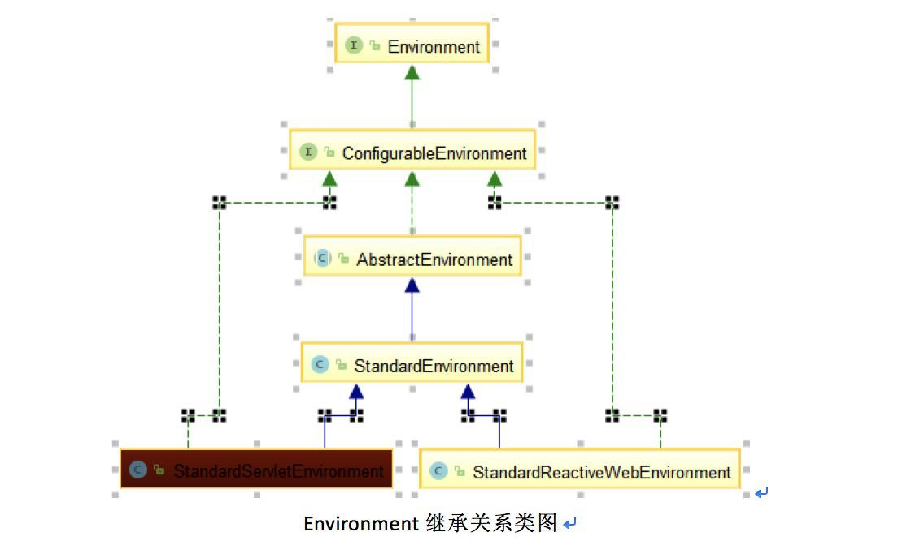

## Spring Boot多环境配置最佳实践  

> 作者: 胡正林  
> 发布日期: 2019 年 5 月 14 日  

### 1、Spring Environment 概念简介

任何一个软件项目至少都需经过开发、测试、发布阶段，不同阶段有不同的运行环境，其对应的数据库、运行主机、存储、网络、外部服务也会有所区别，故大多数项目都有多套配置对应多个环境，一般来说有开发环境 \(dev\)、测试环境 \(sit/test\)、预生产环境 \(pre\) 和生产环境 \(prd\)，有些项目可能还有验证新功能的灰度环境等。

Spring 框架从 3.1 版本以后提供了 Environment 接口，包含两个关键概念 profiles 和 properties。Profile 是 Spring 容器中所定义的 Bean 的逻辑组名称，当指定 Profile 激活时，才会将 Profile 中所对应的 Bean 注册到 Spring 容器中，并把相关能力开放给了开发者；而 properties 代表着一组键值对配置信息，其实现中借助了 ConversionService 实现，具备 String 到 Object 的转换能力。其类图如下：

### 2、Spring Boot Environment 深入分析

#### 2.1 Environment 内部结构

Environment 有三个实现类：

* 标准实现 StandardEnvironment, 继承于 AbstractEnvironment，重写 customizePropertySources 方法增加系统环境属性

* Servlet 容器实现 StandardServletEnvironment，继承于 StandardEnvironment，重写 customizePropertySources 方法增加 Servlet 和 JNDI 属性来源

* StandardReactiveWebEnvironment 响应式 web 容器实现，继承于 StandardEnvironment

对于 web 应用来说 Environment 实现是 StandardServletEnvironment，其主要功能由抽象类 AbstractEnvironment 来实现，最核心的 2 个字段如下:

其中 propertySources\(MutablePropertySources 对象\) 存放所有 Environment 所有的 PropertySource\(代表一个配置来源\)，内部是 CopyOnWriteArrayList，提供有序添加 PropertySource 能力。

调用 Environment 的 API 获取 property 时内流程是 propertyResolver 遍历所有 PropertySource 查询 property，并进行占位符替换处理后返回结果。

#### 2.2 Environment 初始化

Spring Boot 通过 SPI 和 Listener 机制完成各个组件的初始化，Environment 的初始化是其中一个环节，其主要流程如下:

* 运行 SpringApplication
* 通过 SPI 机制加载所有 ApplicationListener 类，其中包含配置文件应用监听器

META-INF/spring.factories：

* 准备 Environment 相关配置信息
* 通知所有 ApplicationListener 处理 ApplicationEnvironmentPreparedEvent 事件
* ConfigFileApplicationListener 处理此事件，通过 SPI 机制加载 EnvironmentPostProcessor 实现类列表，调用各个类的 postProcessEnvironment 方法把对应的环境配置信息加载到 Environment 对象中

META-INF/spring.factories：

4 个处理器的作用说明：

ConfigFileApplicationListener 作为 EnvironmentPostProcessor 一个实现，通过 SPI 机制加载 PropertySourceLoader 接口的实现类来完成配置文件加载，分别是 properties 格式和 yaml 格式的配置加载器

Spring 默认加载配置文件的位置是 classpath:/,classpath:/config/,file:./,file:./config/，文件名为 application。其主要流程是：

* 从环境中获取指定 profile 集合，包括 active 和 include
* 加载 application.yaml\(或 application.properties\) 文件
* 读取配置文件转为 PropertySource 对象，并获取 profiles.active 和 profiles.include 配置项，加入到 profile 集合
* 遍历 profile 集合，加载 application-$\{profile\}.yaml, 重复上一步骤，直至配置完所有 profile

ConfigFileApplicationListener.Loader\#load\(\)

最后形成有优先级顺序的 PropertySource 集合，其顺序如下：

故开发者可以从 Environment 中获取系统相关所有配置信息，包括系统和 Java 环境信息、容器和应用程序配置，例如

* environment.getProperty\(“user.home”\) 获取系统环境用户目录
* environment.getProperty\(“java.vendor”\) 获取 Java 环境 JDK 厂商
* environment.getProperty\(“random.int\(3,10\)”\) 通过随机化配置获取 \[3,10\) 之间的随机数
* environment.getProperty\(“server.port”\) 获取配置文件中容器监听端口

### 3、配置实践

#### 3.1 Active Profile 配置

从上面的分析可以看出指定 profile 的配置优先于默认配置，故可以把与环境无关的配置放在 application.yaml 中，环境相关的配置写在 application-$\{profile\}.yaml 中。其中激活 profile 指定有三种方式：

* 命令行启动参数设置 --spring.profiles.active=\{profile\}
* Java 环境或系统环境变量 spring.profiles.active=\{profile\}
* application.yaml 中 spring.profiles.active 配置项

其实这三种都还是通过 Environment 自身的 PropertySource 获取的，分别是 CommandLinePropertySource、SystemEnvironmentPropertySource 和 MapPropertySource\#application.yaml。优先级从前到后，命令行指定的 profile 优先级最高，其次是环境变量，最后才是配置文件。前两种一般是本地开发测试时使用，大部分项目要求在打包时就需要生成特定环境的构件，所以需要在 application.yaml 中指定 profile，实现方法一般有两种：

（1）maven profile 配合 resource filter 机制

通过配置 maven profile 指定对应不同环境的变量配置文件，application 相关配置相同名称的占位符，通过 maven resource filter 在 resource process 阶段替换。举例说明：
vars 目录包含 dev 和 sit 环境的变量配置文件
vars.dev.properties：

var.sit.properties

spring boot 配置占位符

maven profiles 配置

占位符替换

（2）maven profile 指定 resource 目录包含多级 application.yaml
在 src/main/profiles 包含环境相关的目录如 dev、sit，每个目录都包含对应的 application.yaml，如 dev 目录 application.yaml 内容为

在 maven 中指定 resources 目录包含 profile 对应的目录

src/main/resources/config 目录放置环境无关的配置 application.yaml 和环境相关的配置 application-\{profile\}.yaml，构建时把包含 active profile 的 application.yaml 打包到 classpath:/ 根目录，最终构件目录是：

#### 3.2 Inculde Profile 配置

在实际项目中可能会出现不同的环境也有部分配置相同的情况，例如开发环境和测试环境数据库相同，但 redis 不同。若每个环境只有一个配置，相同配置项会出现在多个文件，修改时也要编辑多个地方，不符合 DRY\(Don’t Repeat Yourself \) 原则。所以应该把不同环境相同部分抽离出来成为一个 profile，通过 include 方式引用，即便捷又清晰，也足够灵活。配置示例如下：

application-dev.yaml

application-sit.yaml

还有三个子 profile 配置文件 application-redis-dev.yaml、application-redis-sit.yaml、application-database-sit.yaml 分别配置各自参数。

当然也可以通过多个 profile 指定，但若应用要求运行环境具备唯一性，则需要其他配置变量配合实现，稍显繁琐，所以指定一个 active profile 并包含多个子 profile 应该是更优的解决方案。

### 4、苏宁易购的多环境配置设计

#### 4.1 苏宁云环境管理

苏宁易购所有业务系统都运行在苏宁私有云上且分布在多个机房，每个业务有多个模块和部署单元，为此苏宁云在建设之初就考虑到环境相关的问题，从服务器申请、软件开发、测试到发布，环境的概念贯穿始终。

苏宁业务系统的环境是与机房 \(数据中心\)、服务器、系统模块、统一配置相关的，需要系统设计时规划好环境信息，如 XX 机房集成测试环境、XX 机房压测环境、XX 机房生产环境。在申请资源指明环境对应的部署单元及服务器，在代码中配置相关 profile 信息，并在持续集成平台定义环境打包时对应的 profile 和部署单元。如下图是一个包含 2 个机房 4 个环境的系统：

#### 4.2 苏宁统一配置管理 \(SCM\)

项目源码放置配置文件对于小型项目来说比较便捷，但对于包含数千个系统的大型平台却有很多弊端如缺乏对配置数据的集中掌控，运维风险逐渐累积；配置管理工作繁杂、配置迁移人工介入过多，风险极大；无法很好的满足内控要求等等。为了解决这些问题，苏宁基于 Zookeeper 自研了统一配置管理系统 SCM，具备毫秒级同步、本地文件和内存两级缓存、多机房部署等高可用特性，且支持版本化、回滚、流程审核、权限控制等功能。

项目中使用 SCM 功能需要在 maven 中集成 snf-scm-client 依赖，并在资源目录中加入一个 scm.properties 文件，其中配置了 SCM 服务器和环境信息。SCM 客户端提供了配置读取和变化监听接口，业务方可以基于此能力灵活方便定制业务框架的功能。

### 5、总结

在项目中大家可以根据实际情况结合 maven 工具灵活配置 profile 和参数配置信息，除了设置 default、active、include profile 之外，YAML 格式配置文件还支持多 profile 并设置复杂逻辑关系如 production & eu-central、 production & \(eu-central | eu-west\) 等。另外 Spring Boot 在各个环节都使用 SPI 机制，具备良好的扩展性，可以定制 EnvironmentPostProcessor 或 PropertySourceLoader 的实现满足业务框架个性化需求。

### 作者介绍

胡正林，苏宁科技集团消费者平台高级架构师，十余年软件开发经验，熟悉大型分布式高并发系统架构和开发，目前主要负责易购各系统架构优化与大促保障工作。
黄小虎，苏宁科技集团消费者平台购物流程架构负责人，全面负责苏宁易购商品详情页、购物车、大聚会等核心系统的优化及大促保障工作。对电商交易流程和业务有较深入的思考和研究，专注于高并发大型电商网站的架构设计、高可用的系统设计。曾主导和参与了 Commerce 系统拆分、商品详情页接入层优化、云信客服系统重构等重大技术攻关项目。现致力于打造苏宁易购新一代核心购物流程系统，希望将购物体验做到极致。
