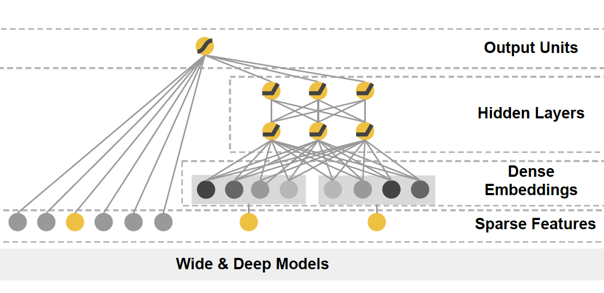

## 推荐系统工程师必看：Embedding技术在深度学习CTR模型中的应用  

> 作者: 王喆 ​  
> 发布日期: 2019 年 5 月 26 日  

> 本文是王喆在 AI 前线 开设的原创技术专栏“深度学习 CTR 预估模型实践”第五篇文章（以下“深度学习 CTR 预估模型实践”简称“深度 CTR 模型”）。回顾王喆老师过往精彩文章：[《谷歌、阿里等 10 大深度学习 CTR 模型最全演化图谱》](https://www.infoq.cn/article/TySwhPNlckijh8Q_vdyO)、[《重读 Youtube 深度学习推荐系统论文，字字珠玑，惊为神文》](https://mp.weixin.qq.com/s?__biz=MzU1NDA4NjU2MA==&mid=2247494669&idx=2&sn=b1ca666f647373b0de4be5da388e53bc&chksm=fbea55c2cc9ddcd4f909dd2ea65102d9e0637857dac813d35f71229d0c897a435077c987418f&scene=21#wechat_redirect)、[《YouTube 深度学习推荐系统的十大工程问题》](https://mp.weixin.qq.com/s?__biz=MzU1NDA4NjU2MA==&mid=2247494791&idx=2&sn=643df72a5116807136e07a82db83b9cd&chksm=fbea5548cc9ddc5e07baffe20d23003227371c9a8f2dd515e60345a9f1775d079082bcbf2976&scene=21#wechat_redirect)。

在专栏之前的文章中，我们总结了深度学习 CTR 模型的发展过程和各模型的特点。这篇文章中，我希望单独将 Embedding 技术抽取出来进行讲解。因为作为深度学习 CTR 模型中基础性的，也是不可或缺的“基本操作”，Embedding 技术发挥着至关重要的作用。具体来讲，Embedding 技术在深度学习 CTR 模型中主要应用在下面三个方向：

1. 在深度学习网络中作为 Embedding 层，完成从高维稀疏特征向量到低维稠密特征向量的转换；

2. 作为预训练的 Embedding 特征向量，与其他特征向量连接后一同输入深度学习网络进行训练；

3. 通过计算用户和物品的 Embedding 相似度，Embedding 可以直接作为推荐系统或计算广告系统的召回层或者召回方法之一。

下面逐一介绍 Embedding 与深度学习 CTR 模型结合的具体方法。

### 一、深度学习网络中的 Embedding 层

由于高维稀疏特征向量天然不适合多层复杂神经网络的训练，因此如果使用深度学习模型处理高维稀疏特征向量，几乎都会在输入层到全连接层之间加入 Embedding 层完成高维稀疏特征向量到低维稠密特征向量的转换。典型的例子是微软的 Deep Crossing 模型和 Google 的 Wide&Deep 模型的深度部分（如图 1）。

a 微软 Deep Crossing 模型

b Google W&D 中的 Deep 部分

图 1 Deep Crossing 和 Wide&Deep 模型结构

读者可以清晰地看到 Deep Crossing 模型中的 Embedding 层将每一个 Feature 转换成稠密向量，Wide&Deep 模型中 Deep 部分的 Dense Embeddings 层同样将稀疏特征向量进行转换。广义来说，Embedding 层的结构可以比较复杂，只要完成高维向量的降维就可以了，但一般为了节省训练时间，深度神经网络中的 Embedding 层是一个高维向量向低维向量的直接映射（如图 2）。

图 2 Embedding 层的图示和矩阵表达

用矩阵的形式表达 Embedding 层，本质上是求解一个 m（输入高维稀疏向量的维度） x n（输出稠密向量的维度）维的权重矩阵的过程。如果输入向量是 one-hot 特征向量的话，权重矩阵中的列向量即为相应维度 one-hot 特征的 embedding 向量。

将 Embedding 层与整个深度学习网络整合后一同进行训练是理论上最优的选择，因为上层梯度可以直接反向传播到输入层，模型整体是自洽和统一的。但这样做的缺点同样显而易见的，由于 Embedding 层输入向量的维度甚大，Embedding 层的加入会拖慢整个神经网络的收敛速度。

这里可以做一个简单的计算。假设输入层维度是 100,000，embedding 输出维度是 32，上层再加 5 层 32 维的全连接层，最后输出层维度是 10，那么输出层到 embedding 层的参数数量是 32 _100,000= 3,200,000，其余所有层的参数总数是 （32_ 32） _4+32_ 10=4416。那么 embedding 层的权重总数占比是 3,200,000 / \(3,200,000 + 4416\) = 99.86%。

也就是说 embedding 层的权重占据了整个网络权重的绝大部分。那么训练过程可想而知，大部分的训练时间和计算开销都被 Embedding 层所占据。正因为这个原因，Embedding 层往往采用预训练的方式完成。

### 二、Embedding 的预训练方法

通过上面对 Embedding 层的介绍，读者们已经知道 Embedding 层的训练开销是巨大的。为了解决这个问题，Embedding 的训练往往独立于深度学习网络进行。在得到稀疏特征的稠密表达之后，再与其他特征一起输入神经网络进行训练。典型的采用 Embedding 预训练方法的模型是 FNN（如图 3）。

图 3 FMM 模型结构

FNN 利用了 FM 训练得到的物品向量，作为 Embedding 层的初始化权重，从而加快了整个网络的收敛速度。在实际工程中，直接采用 FM 的物品向量作为 Embedding 特征向量输入到后续深度学习网络也是可行的办法。

再延伸一点讲，Embedding 的本质是建立高维向量到低维向量的映射，而“映射”的方法并不局限于神经网络，实质上可以是任何异构模型，这也是 Embedding 预训练的另一大优势。典型的例子是 2013 年 Facebook 提出的著名的 GBDT+LR 的模型，其中 GBDT 的部分本质上是完成了一次特征转换，也可以看作是利用 GBDT 模型完成 Embedding 预训练之后，将 Embedding 输入单层神经网络进行 CTR 预估的过程。

2015 年以来，随着大量 Graph Embedding 技术的发展，Embedding 本身的表达能力进一步增强，而且能够将各类特征全部融合进 Embedding 之中，这使 Embedding 本身成为非常有价值的特征。这些特点都使 Embedding 预训练成为更被青睐的技术途径。

诚然，将 Embedding 过程与深度网络的训练过程割裂，必然会损失一定的信息，但训练过程的独立也带来了训练灵活性的提升。举例来说，由于物品或用户的 Embedding 天然是比较稳定的（因为用户的兴趣、物品的属性不可能在几天内发生巨大的变化），Embedding 的训练频率其实不需要很高，甚至可以降低到周的级别，但上层神经网络为了尽快抓住最新的正样本信息，往往需要高频训练甚至实时训练。使用不同的训练频率更新 Embedding 模型和神经网络模型，是训练开销和模型效果二者之间权衡后的最优方案。

### 三、Embedding 作为推荐系统或计算广告系统的召回层

随着 Embedding 技术的进步，Embedding 自身的表达能力也逐步增强，利用 Embedding 向量的相似性，直接将 Embedding 作为推荐系统召回层的方案越来越多的被采用。其中 Youtube 推荐系统召回层（如图 4）的解决方案是典型的做法。

图 4 Youtube 采用 Embedding 作为推荐系统召回层

我曾经在文章[《重读 Youtube 深度学习推荐系统论文，字字珠玑，惊为神文》](https://mp.weixin.qq.com/s?__biz=MzU1NDA4NjU2MA==&mid=2247494669&idx=2&sn=b1ca666f647373b0de4be5da388e53bc&chksm=fbea55c2cc9ddcd4f909dd2ea65102d9e0637857dac813d35f71229d0c897a435077c987418f&scene=27#wechat_redirect)中介绍过了 Youtube 利用深度学习网络生成 Video Embedding 和 User Embedding 的方法。利用最终的 Softmax 层的权重矩阵，每个 Video 对应的列向量就是其 Item Embedding，而 Softmax 前一层的输出就是 User Embedding。在模型部署过程中，没有必要部署整个深度学习网络来完成从原始特征向量到最终输出的预测过程，只需要将 User Embedding 和 Item Embedding 存储到线上内存数据库，通过内积运算再排序的方法就可以得到 item 的排名。这大大加快了召回层的召回效率。

事实上，除了上述的三种主要的 Embedding 应用方向，业界对于 Embedding 的创新性研究不仅没有停止，而且有愈演愈烈之势，阿里的 EGES，Pinterest 的 GNN 应用，Airbnb 基于 Embedding 的搜索模型等大量表达能力非常强的 Embedding 方法的诞生，使 Embedding 本身就已经成为了优秀的 CTR 模型和推荐系统模型。作为计算广告和推荐系统领域的从业者，无论如何强调 Embedding 的重要性都不过分，也希望今后能与大家继续分享 Embedding 领域的前沿知识。

**《深度学习 CTR 预估模型实践》专栏内容回顾：**

1. [深度学习 CTR 预估模型凭什么成为互联网增长的关键？](https://www.infoq.cn/article/3WK8*7x0avuuh3CJK6Pw)

2. [前深度学习时代 CTR 预估模型的演化之路——从 LR 到 FFM](https://www.infoq.cn/article/wEdZsdQZ2pIKjs_x3JGJ)

3. [盘点前深度学习时代阿里、谷歌、Facebook 的 CTR 预估模型](https://www.infoq.cn/article/Q8Cv-4vq6jD8974w9MxJ)

4. [谷歌、阿里等 10 大深度学习 CTR 模型最全演化图谱](https://www.infoq.cn/article/TySwhPNlckijh8Q_vdyO)

#### 作者介绍

王喆，毕业于清华大学计算机系，现在美国最大的 smartTV 公司 Roku 任 senior machine learning engineer，曾任 hulu senior research SDE，7 年计算广告、推荐系统领域业界经验，相关专利 3 项，论文 7 篇，《机器学习实践指南》、《百面机器学习》作者之一。知乎专栏 / 微信公众号：王喆的机器学习笔记。
