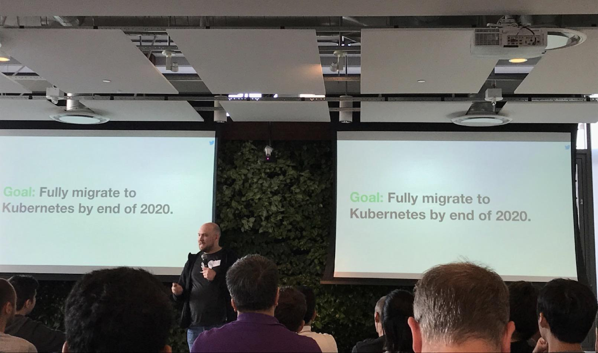
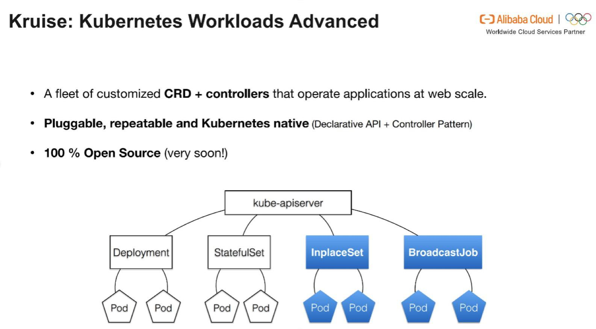

## Twitter 宣布抛弃 Mesos，全面转向Kubernetes  

> 作者: 张磊  
> 发布日期: 2019 年 5 月 6 日  

美国西部时间 5 月 2 日下午 7 点，Twitter 公司在旧金山总部举行了一次技术发布会兼 Meetup。会上，Twitter 计算平台（Twitter Computing Platform）产品与技术负责人 David McLaughlin 正式宣布，Twitter 的基础设施将从 Mesos 全面转向 Kubernetes。

Mesos 项目发布于 2009 年，而 Twitter 公司则是 Mesos 项目的早期支持者和使用者之一。作为世界上最成功的社交媒体巨头之一，Twitter 公司以其庞大的生产集群[规模](https://blog.twitter.com/engineering/en_us/a/2015/all-about-apache-aurora.html)（万级别节点）而备受关注。2011 年，Twitter 公司开始在 Mesos 项目的基础上开发 [Aurora ](https://blog.twitter.com/engineering/en_us/a/2015/all-about-apache-aurora.html)项目以便同时管理其内部的在线和离线业务，逐步成为 Mesos 社区的代言人。

在持续投入 Mesos 项目近 10 年之后，Twitter 公司为什么突然宣布全面转向 Kubernetes 体系？在这个令人瞩目的决定背后， 是什么样的架构和设计支撑 Twitter 基础设施 360 度的“华丽转身”呢？

### 云时代，Twitter 基础设施面临新挑战

Twitter 公司创始于 2006 年。时至今日，全世界每天都有至少 5 亿条推文产生。在过去十余年飞速成长和海量数据的挑战下，Twitter 基础设施架构的演进过程，一直以来都是全世界技术公司眼中的标杆案例。这其中，像 Mesos 这样优秀的老牌调度框架、 以及像 Aurora 这样启发自 Google Borg 配置管理的编排引擎，可谓功不可没。

事实上，在互联网级别的技术场景下，依托顶级工程师和成熟技术自建基础设施，一直以来都是一线非云互联网厂商的架构首选。正是在这个过程中，相对成熟并且工作层次较低的 Mesos 项目收获到了大量规模级生产环境部署案例。

不过，随着云计算的普及和 Kubernetes 这样以“云”为核心的容器化基础设施项目的迅速崛起，这种传统互联网基础技术架构选型方法逐步暴露出很多前所未有的问题。在本次发布会上， David 就以 Twitter 公司当前面临的挑战为例，对这些问题作出了简明扼要的总结：

**1、存储系统的多样化与专业化，使传统基础设施复杂度急剧上升。** 相比于传统技术架构对存储系统的单一假设（比如一套 Ceph 打天下），云时代的软件架构为用户存储选择带来了爆发性增长。而随着互联网公司的基础架构和软件规模的不断扩张和发展，互联网软件本身对存储的需求也更加细化和专业。比如，在 Twitter，Local Persistent Volume 这种“非典型”存储诉求，逐渐在平衡性能与成本的过程中成为一种主流方案。作为 CSI（Container Storage Inerface）的提出者，Kubernetes 社区不仅拥有最完善的 Local PV 机制，还能够凭借标准接口和 PV、PVC 体系，完全为用户抹平其它数十种不同存储服务的对接问题。这在互联网软件架构日趋复杂和面向多云的发展趋势中，无疑是至关重要的。

**2、Mesos 和 Aurora 体系与“云原生”始终渐行渐远。** 云时代一个重要的技术发展趋势就是软件的生命周期会逐步向“生在云上、长在云上”的形态靠拢。这也就意味着作为支撑软件的核心基础设施项目，必然要向“发挥云的最大价值”的方向不断演进。遗憾的是，Mesos 以及 Aurora 项目或许是由于发布较早，始终没能够将“云”变成整个基础设施体系中的“一等公民”。相比之下，Kubernetes 体系从发布伊始就不断倡导“声明式 API”、“容器设计模式”、“控制器模型”等各项理念，其实都是为了帮助用户能够在云上以“可扩展、可复制、高度自动化”的方式开发、交付和运维软件。如今，这些顶层架构设计与各种最佳实践，被广大开发者们冠名为“云原生”。这也成为 Kubernetes 项目与其它竞争对手相比最大的不同。

**3、传统的多云、多集群管理成本居高不下，并在可预见的未来内迅速攀升。** 在传统的互联网架构中，自建数据中心和基础设施体系是整个软件系统的第一假设。而“云”所扮演的角色，更像是在流量突发时应付峰值的资源“备胎”。在这种以“云”为辅助角色的指导思想下，多云和多集群很难成为整个软件开发架构的重中之重，与应用开发、交付和运维体系也失去了直接关联。这种方案短期内固然可以奏效，但长期的维护和迭代成本却很容易因为上层应用本身千变万化的形态与高速迭代而超出把控。此外，这种设计的另一个极端是让整体基础设施走向“多活”技术深渊：这实际上已经远远超出 90% 以上互联网公司的技术能力。而在云原生体系普及之后，“每朵云上都有无数个 Kubernetes 集群”逐渐成为应用基础设施能够依赖的常态。这就为多云和多集群管理提供了一种全新的突破性思路：只要软件选择面向 Kubernetes 来进行架构、设计和实现，那么“多云、多集群”就自然而然成为应用基础设施的默认能力。在 Twitter 的业务越来越多的需要多云、多集群环境交付的趋势下， Kubernetes 这种从根本上帮助应用迅速向多云交付的“捷径”，成为 Twitter 选择变更自身技术体系的另一个重要原因。

### 大规模生产环境的 " Kubernetes Native " 技术路径

作为不断在快速发展和迭代的互联网公司，高压力和快节奏背景下的企业往往无暇顾及基础设施架构的标准化与兼容性问题，这同样也是 Twitter 公司面临的主要问题之一。所以，在这次转型过程当中，“Kubernetes Native”成为一个被反复强调的关键词。在发布会上，Twitter 公司公布了选择 Kubernetes Native 方向的诸多评估依据。

* 良好的开源技术与开源生态；
* 全世界所有的公有云都提供 Kubernetes 服务，不必担心厂商锁定；
* 原生具备有状态业务（Stateful Application）的管理语义；
* 项目本身快速迭代，具有很强创新能力和先进性；
* 具备标准的存储对接接口，帮助 Twitter 无缝迁移各种现有存储服务。

最终，Twitter 公司用一句话总结了这次评估的结果：

> “我们认为，使用 Kubernetes 项目作为 Twitter 公司基础设施向前演进的核心依赖，将会是一个正确的选择”。

而在这条演进路径上，Twitter 也公布了多项具体的技术举措，比如：

* 开发 Twitter 专属的有状态应用管理控制器（TwitterSet）；
* 开发满足 Twitter 场景的节点控制器（NodeController）；
* 自定义 Service Discovery 组件以便同 Twitter 自己的流量管理服务对接；
* 编写兼容 Aurora 语义的作业管理控制器以便将现有的 Aurora 上的业务进行迁移；
* 开发更丰富的应用发布策略和实例稳定性支持；
* 改造 Aurora 的 DSL 以对接 Kubernetes，集成现有的 CI/CD 系统。

David 表示：“Twitter 公司基础设施的巨大规模一直不是一个秘密，但至少在今天，规模不再是我们的首要担心，我们能看到像阿里巴巴这样的社区领导者正在将更大规模的 K8s 集群推向生产环境”。

David McLaughlin 宣布整个迁移计划将从现在开始一直持续到 2020 年。届时，整个 Twitter 的技术栈都会运行在以 Kubernetes 为基础的容器化基础设施之上，并且呈现“内部 K8s 集群 + 公有云 K8s 服务”的多集群组合形态。

David 最后对 Twitter 的未来进行总结时强调：在 2020 年，Twitter 自己的软件栈会以“一部分运行在自有 K8s 集群，另一部分运行在公共云上”的多集群形态进行开发和交付。显然，在思考“如何通过云来让自身的基础设施能力价值最大化、如何让公司专注于核心业务”这件事情上，Twitter 已经得到一个相对清晰而富有远见的答案。更重要的是，这个选择，很可能会使公司与得以拥抱 Kubernetes 的 Twitter 工程师们实现真正意义上的共赢。

### 世界级互联网场景加持的规模化云原生技术

很长一段时间以来，Kubernetes 社区其实经常因为将规模化的应用场景放置在较低优先级而遭受诟病，这也一直是 Twitter 等大型互联网厂商在是否选择这条路径上踌躇不前的主要原因。但现在，这个情况正在发生重要的变化。

David 在发布会上指出：随着近一年来更多拥有世界级互联网场景的技术企业已经成功把 Kubernetes 和 etcd 项目推向了规模和性能要求极高的电商、离线计算等生产环境，Twitter 开始对云原生技术在自己的大规模集群中铺开重新树立起了信心。

本次发布会上，Twitter 公司邀请了来自阿里云容器平台团队的工程师李响、张磊、何剑等作为专题演讲嘉宾，分享了过去一段时间团队在“大规模生产级云原生技术体系”上的诸多工作。当天应邀出席发布会的嘉宾还有 Google 公司 Kubernetes 团队工程技术经理 Jago Macleod 。

发布会上，阿里云容器平台团队透露下个月即将开源内部锤炼已久的 Kubernetes 高级作业管理集合（Kubernetes Workloads Advanced）： **Kruise 项目** 。Kruise 会充分利用 Kubernetes 的“声明式 API” 和“控制器模型”，为用户提供互联网场景下“赖以生存”的容器化应用“原地升级”能力，以及更加精细化的业务发布策略。Twitter、Facebook，Uber，Linkedin，Pinterest 以及 Netflix 等世界级团队，都会加入到这个创新性的“云原生作业管理”项目的合作当中。

除了针对互联网场景的扩展与增强之外，Kubernetes 以及 etcd 项目本身在规模化与性能提升上的不断演进，也是能够让 Twitter 公司最终从“观望者”变成“实践者”的另一个技术原因。对此，阿里云的嘉宾分享了团队如何同社区一起，持续不断的通过优化并发度，减少锁竞争，提升后端存储性能等方式将 etcd 在一百万随机键值对的写入完成时间稳定在 200s 内。与此同时，Google Kubernetes 项目工程技术经理 Jago Macleod 也在演讲中介绍了 Google 公司与阿里巴巴在这个领域上正在进行的攻关与合作。Jago 说到：在最近一次尝试中，双方工程师正在一起为 K8s 里海量的 WATCH 操作[添加](https://github.com/kubernetes/kubernetes/pull/75474)“书签（Bookmark）”，这将使得这些 WATCH 操作的建立者在重启之后只需要对“书签”之外的少数历史变化进行追溯。在特定情况下，K8s APIServer 的性能会被提高 40 倍以上。

得益于开源社区以及现代化软件开发与协作模式，Kubernetes 项目得以在更多的互联网级场景的历练中迎来前所未有的演进速度和高度。在发布会中，阿里云的工程师们提到了他们正在开源社区推进的基于“虚拟集群 \(Virtual Cluster\) ”的 Kubernetrs 强多租户插件提案。这个设计思想提炼自阿里巴巴内部为电商租户交付 K8s 集群的经验与教训，而由于不需要修改 K8s 任何一行代码，这个强多租户方案正受到社区的强烈关注。目前，Google，RedHat，VMware 等都已经加入到了方案的最后细节完善当中，预计本月末会发布第一个正式设计文档。

### Kubernetes，以应用为中心的“高速公路”

除了技术和架构演进上的考量之外，这次 Twitter 公司向 Kubernetes 的“华丽转身”，还有一个至关重要的非技术因素。

Twitter 公司的快速成长，催生出了其标杆式的基础软件团队，但也反映出一个不得不引起重视的问题：随着互联网业务的快速发展，公司的基础软件团队很快就开始超过应有的规模边界，而相应的投入产出比却停滞不前。

所以，正如 David 在一开始提到的那样，过去互联网企业中“自研（In-house）”为主的基础软件开发和架构思路，正在伴随着云计算和云原生理念的普及发生微妙变化。凭借像 Kubernetes 这样的平台级项目标准，互联网公司已经能够以较小的代价将自身的基础设施向云迁移。更重要的是，由于 Kubernetes 这个标准层的存在，这种“迁移”本身并不会像 Netflix 与 AWS 那样形成根深蒂固的厂商锁定关系，反而会在保留大部分“自研”好处的同时彻底发挥出“云”本身的价值和多集群管理能力。这种变革带来的优势，会在一个互联网公司里的 “AWS 工程师”都变成“K8s 工程师”之后变得尤为凸显。

不难看到，Kubernetes 项目正在以应用为中心，连通“云”、“应用开发者”与“基础软件团队”。这种“高速公路”般的沟通、连接与交付能力，也正是像 Twitter 这样快速迭代的互联网公司思考自己基础设施架构未来演进方向的重要参考。而这种转变，也使得 Twitter 这样一个业务迅速增长的商业组织始终维持一个极小规模的基础软件团队成为现实。

### 写在最后

从最早 Mesos“代言人”到如今的全面转向“Kubernetes Native”，Twitter 公司的选择无疑为“Kubernetes 项目成为互联网级基础设施标准”又增加了一个重量级佐证。更值得期待的是，在已经拥有了电商等顶级互联网场景的加持之后，Twitter 这次全面拥抱云原生，将很可能再为“大规模生产级云原生技术体系”增添一个经典的落地范本。

伴随着云计算的进一步普及和像 Kubernetes 这样以“云”为核心的容器化基础设施项目的迅速崛起，越来越多的世界级企业开始思考如何借助“云”以及云原生技术来拥抱开源生态和开放的技术标准，准备迎接一个具备强劲的迭代能力的、面向“云原生”的未来。

* * *

作者简介

张磊，阿里云容器平台高级技术专家，Kubernetes 项目联合维护者。
