## 游戏之王：腾讯帝国的半条命  

> 原创：  
> 狐狸安  
> 作者: 朱思码记  
> 发布日期: 2019-05-21  

「少数人的硬派新闻」

朱思码记-商业调查NO.8

__ **Finale  \(Arthur Fighting\)** 来自朱思码记 _00:00_ _06:29_

提示：全文长达 **35633** 字，阅读至少需要 **80～90** 分钟，建议收藏后分章节于晚间进行深度阅读，配乐循环播放可获得更佳体验。

**是「开始」的结束，还是「结束」的开始？**

**
**

**中国游戏行业的“半条命”，送了。**

2017年10月28日，网易旗下第三人称射击（后文称FPS）手游《荒野行动》正式上线公测，但上线不久后该游戏就被迅速被下架处理。随即，网易股价于当年12月1日至2018年8月1日，从每股美元377.6下跌188.8元。

2018年2月9日，腾讯与韩国蓝洞工作室合作研发的两款FPS手游《绝地求生：刺激战场》《绝地求生：全军突击》正式上线。其中《刺激战场》在6个月内横扫全网，据极光大数据显示其2018年Q2季度该游戏活跃用户突破1480万人，但版号却迟迟未发。

2018年8月13日，腾讯WeGame平台公告称《怪物猎人：世界》由于部分内容未符合政策法规而被有关机构取消运营资质，应主管部门要求下架整改，停止发售。

2018年8月16日，国家监管机构出于对游戏暴力内容与赌博问题的担忧，而暂时冻结了网络游戏的版号审批。受两款作品影响，截止10月30日腾讯香港联交所股价从每股港币475.6元指数级下挫至252.14元。

2018年9月30日，腾讯发起史上第三次架构调整。

2018年12月29日-2019年4月10日，国家新闻出版广电总局重启版号审批后连续发布了共计12个批次的游戏版号，但《刺激战场》连续12次未能在列。

2019年5月8日，《刺激战场》在版本更新后，被腾讯2019年4月刚刚获批的新游戏《和平精英》主体覆盖，与《全军突击》一同退出历史舞台。历时453天的“公测后”，该游戏商业化进程画上圆满句号。当日腾讯香港联交所股价一度冲高至港币395元。

正当腾讯和网易的股价在过去一年间相继跌掉几乎「半条命」的时候，外界将彼时腾讯的遭遇通过自媒体「议程设置」进而归结于马化腾曾经在「谜面」上公开所指向的对外策略——「半条命」交给合作伙伴。于是有关腾讯投资策略的问题讨论成了2018年中旬以来全民关注的一个公案——即使刘炽平于2019年2月20日回应并定调「投资是腾讯的核心战略」的说法后，其争议也并未曾彻底散去。

但「谜底」之下的另一个疑问，是腾讯没有交给合作伙伴而是只为自己留下，又在2018几乎同时断送掉的“半条命”究竟指向何方？

**答案有且只能是游戏。**

一个有趣的巧合。当马化腾提出的「半条命」这个词之前，它在中国互联网领域最早的出处恰好是一个游戏作品的名字——源于美国Valve Software公司（后文称V社）于1998年开发的著名系列射击游戏的中译名。《半条命》系列的代表作：《反恐精英》（CS），是在「吃鸡」游戏成名前作为中国乃至全球范围内最具影响力的FPS作品，而作为身处20世纪90年代末期创业的中国第一代互联网领袖，平日爱玩游戏且尤其偏爱射击游戏的马化腾绝不可能不知道《半条命》这个作品的名字。

更巧合的是，今时今日对全球数字娱乐产业影响空前巨大，同时又对腾讯互娱业务产生巨大影响和直接威胁的一家综合性数字娱乐发行平台——Steam平台，恰好出自这家曾经做出过《半条命》的公司之手。而在2018年因多重因素重创腾讯互娱，导致游戏收入出现问题进而引发股灾，成为事件真正导火索的两款作品—— **《绝地求生》（后文称PUBG\)，《怪物猎人：世界》均为Steam平台2017和2018年年度的销量冠军，因此存在直接关联。**

**自古英雄立事，必有基业。如若不狠，根基不稳。**

**
**

无法否认，在过去17年里腾讯互娱（后文称IEG）完成了一个几乎无法复制的世界商业奇迹。即使在海外，腾讯游戏的行业影响力也远超QQ，甚至是拥有11亿用户的Wechat——因为其霸主地位无可替代。但当 游戏作为腾讯旗下所有业务的收入之源，其在争夺全球游戏市场过程中采取的种种行径所引发的争议和恶名成了这家公司无法回避的话题。

**今天，当游戏业务出现重大问题而再次成为焦点话题时，一场事关腾讯游戏过去17年历史的回顾、调查、讨论与复盘已经无法避免。**

回顾昨天，谁真正揭开了腾讯游戏的第一页？腾讯游戏的价值观又是什么？在强者如林的对手面前，他们是依靠怎样战略和战术手段击败了如此之多的对手？

复盘今天，从端游到手游的历史转折过程中，腾讯游戏经历了什么？饱受批评和质疑的腾讯投资在游戏领域中起到了怎样的作用？在成为的新的统治者后，他们又是采取怎样的非常手段来保持其市场优势的？

展望明天，导致股灾爆发的两款作品背后的经过是怎样的？游戏之王未来的隐患和对手分别来自何方？当前遭遇的问题是否又会触发第三次、第四次甚至更多的危机？

** **

**杜尚有一言：「我们眼前的艺术：要么是剽窃，要么是革命。」**

**对于一个在一无所有间突然降生的泱泱帝国来说，其真正「恐惧」的正是那来自于乱世狼烟中催生的惶惶「革命」。**

**
**

1

帝国的崛起

** **

2009年Q2季度，中国游戏市场曾经如战国般分裂格局发生了一场惊天动地的变化：

**财报显示， **在本季度**** **腾讯** **游戏业务** **市场份额** **最终以0.2%的微弱优势击败盛大，历史上第一次登顶成为国内收入最高的游戏公司，这个记录至今仍在保持。另一方面，因早前代理《MU》，在彼时拥有《魔兽世界》代理权而长期位居市场排名前茅的第九城市（后文称“九城”）从第五位飞速下跌到第八位，收入环比下降24%。数十天后，网易公司在毫无征兆的情况下接管九城视作性命的《魔兽世界》代理权，导致九城元气大伤并一蹶不振。至此开始，网易并肩腾讯，奠定了直至今日两分天下的格局。**

** **

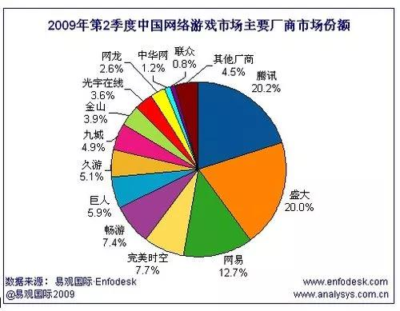

导致这场变数的起因，需要从8年前的2001年说起。

2001年全球互联网泡沫破裂之际，丁磊突然宣布砍掉占据其公司超过30%收入的SP服务，并在争议中开始转向陌生的游戏业务。此种极度反常的决定，源自于他与生俱来的忧患意识——三大运营商是难伺候的主，而用户不愿意买单而变相产生灰色收入的SP服务在未来很可能会成为相关公司的一颗定时炸弹，只是时间问题。有趣的是在10年后的2011年，丁磊也以同样形式，突然砍掉了收入数亿元人民币的医疗广告业务。彼时参加这场会议的一位网易公司高层向「朱思码记」回忆，会上该业务曾被丁磊戏称为：

**「一坨捧在你我手里，随时会炸你一脸，然后还溅我一脸的屎。」**

最终，SP业务这颗炸弹于2004年央视315晚会上正式引爆，随着公众舆论对国内三大运营商的全民声讨，引来国家信息产业部的整顿行动——搜狐、TOM.COM、新浪等十几家公司遭到不同程度的打击。意外的是，上述企业中受冲击影响最大的一家，恰恰是电信增值服务占据彼时总收入高达56%的腾讯公司，随后腾讯爆发了其上市以来的第一次股灾。

晴天借伞，雨天收伞的中国移动，因315事件而乘机与腾讯重新谈判。移动方面咄咄逼人的续约分成比例与合并移动QQ业务的霸王条款最终导致合作破裂，两家从此结下不共戴天的世仇。

于是1年后腾讯总办发起了历史上第一次重大架构调整：2005年10月24日的「深腾人字38号」文件的最大亮点，是R线方面由隶属于Free吴宵光统帅的QQ研发中心架构下的QQ游戏小组，与此前因为做出QQ秀而名声大噪的增值业务部合并后独立成军首次亮相的B3系统：腾讯互娱IEG正式诞生，标志着此时腾讯内部已经开始从战略上将核心收入的业务方向从电信业务向游戏在内的TO C增值业务进行政策性倾斜。与之极为相似的事件，是13年后的2018年9月腾讯第三次架构调整——由Dowson汤道生统帅、独立成军后首次亮相的CSIG事业群，作为腾讯战略层上向产业互联业务转型的标志。

从单纯业务模式上看，腾讯、网易均属于中国产品型互联网公司的代表，其原本都不是纯正血统的游戏公司，前者以QQ成名，后者以做出中国第一代电子邮箱业务和门户网站而名扬天下。抛开SP业务困境的外因，最终促使两家公司进入游戏赛道的内因并非马化腾或丁磊的个人好恶，而是基于互联网公司全局角度看：

**互联网产业中能实现高度商业化的业务，有且只有游戏。广告业务始终是有天花板的，且受经济周期性的波动影响极大，但游戏作为TO  C产业中为数不多的能规避上述风险能力极强的文娱产业，** **属于必争之地。** **因此，可以说所有互联网公司除了已经做游戏的，就是在赶往做游戏的路上——最新正在发生的例子是2019年开始通过对外投资形式进入游戏赛道的“字节跳动”。**

** **

时间重新回到2001年，彼时决心做游戏的网易第一时间将目标锁定美国，丁磊本人找到EA谈判并希望通过代理全球首款网络游戏——《UO网络创世纪》进而低成本的进入游戏赛道。但由于彼时网易这家名不见经传且毫无过往案例的中国互联网公司缺乏经验也没有谈判资本，加之中国盗版横向的病态游戏市场下，诸如奥美电子等代理发行商的遭遇让老外们丝毫看不到付费的希望，让丁磊最终碰了一鼻子灰。

于是在代理无门的情况下，网易在广州本地收购了一家后来做出《天下》的游戏工作室作为团队的原始积累，至此开始了自研之路。综合概括起来，网易游戏起家之初的核心思路为三点：

* 认为在中国解决游戏盗版问题的最佳方式是以在线服务器的形式逼迫玩家付费的网络游戏。

* 游戏内容方面基于中国第一代网络原住民痴迷的在线聊天室模式为基础的MUD武侠游戏，通过中国式的MMO-RPG游戏作为核心研发方向和题材，立足于以自研为根基。强调作品的长期运营，通常以10年为目标。

* 逐步建立孵化器模式，并设立美术中心，用户体验中心，技术中心，运营中心等作为后台支持，工作室专注负责玩法和内容，因此可以大量推出不同的新项目，同时各个独立工作室又可以根据自己的要求和标准孵化出水准不低于自己上一个作品的新作。

网易自研开局，结果却大获全胜。

其第一款游戏《大话西游》系列改编自中国网络文化的开山鼻祖级的超级IP——周星驰同名电影为题材的武侠游戏。作为独立发行的首款游戏又是首款自研游戏，《大话西游2》的成功（《大话西游1》因技术问题而下线）给了网易互娱部门足够的信心走区别于当时其他公司代理模式的自研道路，特别是在同一时期的另一款来自网易代理自韩国研发的网络游戏《精灵Online》由于外挂问题最终止步于30万人同时在线后就被迫停服，这使得网易产生了一种——只有自研之路行得通的奇特认知。

就在首战告捷后不久，更为幸运的是丁磊遇到了网易游戏迄今为止最重要的关键先生——丁迎峰（现任网易游戏联席总裁）在《大话西游2》上线后不久就提出了自己关于「西游」系列网游作品一种「更好的思路」，随后他和搭档徐波（现任多益网络董事长）共同带队于2003年底做出了中国游戏史上第一款自研的现象级网络游戏大作——历史累计注册用户超过3.1亿，历史最高同时在线人数为271万人的《梦幻西游》。

凭借这两款作品的成功，奠定了网易在中国游戏行业最初的地位。而广州网易游戏的成功，间接影响了隔壁腾讯游戏业务的萌芽，并催生了网易与腾讯在游戏发展过程中曾经的师徒名份，以及后世双雄争天下的局面。

**腾讯游戏，是怎么诞生的？**

2002年春天，深圳华强北赛格科技园2栋402。由于上海盛大和广州网易在游戏赛道的成功得手，使腾讯总办开始对游戏业务进行了一场关于做与不做，和怎么做的大讨论。

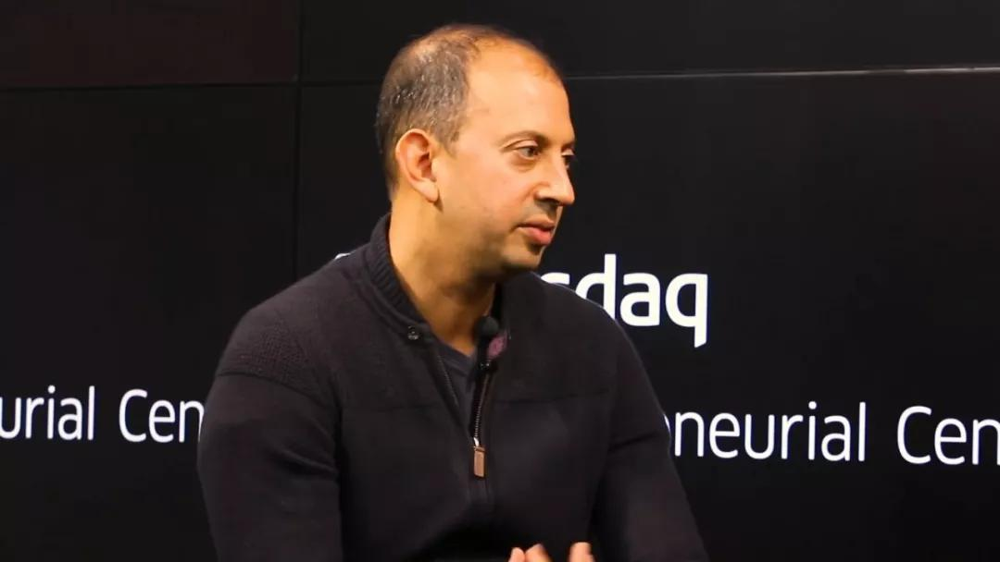

关于做与不做的问题，腾讯首席探索官David网大为彼时抛出的观点最具杀伤力：

**「** **（译文）** **中国运营大型多人在线游戏的时机已经成熟，而QQ以文字、图片、在线视频语音聊天等形式的交流过于黑白，因为在游戏世界中人与人的交流是多方面且更为深入的，网络游戏的兴起是对QQ的一种变相威胁，而腾讯需要做的就是在做游戏的同时将QQ与游戏两者更好的结合起来。」**

不过在讨论关于怎么做的问题上，负责R线的Tony张志东，与负责M线市场的曾李青就发生了严重分歧，腾讯从早年至今关于R线和M线的矛盾又一次蔓延到了新业务上—— **因为游戏不是做出来就能赚钱的东西，其通过代理带来的短期营收和自主研发长期回报是世界性难题，两种模式也从来没有高低之分。** 最终，马化腾选择了一种类似今天IEG「赛马制」雏形的中间策略：

M线方面由曾李青带队开始尝试代理海外网游发行，而同时期R线则在Free吴宵光团队内部成立一个研发小组看看有没有可能通过类似简单的休闲游戏找到突破口。两条线无论先后，一切以结果为导向。

M线这边率先动手，曾李青迅速找到自己创业前的老同事王远，随后由王远带队在中国网游巨头云集的圣地——建立了腾讯的第一个上海分公司，并效仿当时上海系网游公司的代理模式，且引进的方向也是当时视觉美术作为主流审美的韩系网游，在类型方面则选择了当时最国内吃香的MMORPG\(大型多人在线角色扮演游戏）。

起初，王远团队看中的作品是韩国全3D角色扮演类游戏《A3》，但由于当时才刚刚盈利的腾讯预算实在有限，只得将这款作品让给了出价更高的竞争对手——海虹。最后，腾讯耗资30万美元且在韩方拥有绝对主导权的情况下，代理了韩国排名第五的另一款全3D角色扮演游戏《凯旋》，成了腾讯历史上第一款在国内发行的网络游戏——对手包括盛大，网易，九城，巨人等等。

但《凯旋》并没有像名字那样给IEG带来首胜，相反则是一场全方面的溃败。

来自IEG创始团队的一位元老向「朱思码记」介绍，彼时《凯旋》失败的原因简单总结起来便是在毫无游戏代理经验的情况下，在对手的主战场与对手最擅长游戏类系跟对手硬拼，最终惨交学费。复盘此战失败的原因，综合概括起来有三点：

* 全3D游戏的客户端安装包过大。在中国网络带宽速度有限的情况下。凯旋接近1GB的安装包限制了用户的下载量，同时在网吧方面也缺乏来自地面部队的跟进，在开战前就先丢掉了网吧这个QQ用户一直以来的主战场。

* 货币体系和奖励体系存在运营失误。在《凯旋》运营过程中，曾经发生过一阵稀有素材“钻石”白送的闹剧，所导致的恶劣后果是此前耗费数月时间打素材的老玩家发起的集体抗议，最终在官方没有做出良好解释的情况下引发了核心老玩家的提前离开。

* 在选取作品之初盲目追求3D作品的视觉特效，和忽视了用户主机的性能和中国网络当时的糟糕水平。由于作为端游的凯旋需要通过服务器载入到客户端的形式下，这种技术浪费了许多流量，最终导致网络卡顿严重使得留下“卡旋”的恶名。

不过就在M线《凯旋》出师不利而溃败的同时，R线方面却是干净利落的打了一个大胜仗——彼时,来自QQ研发组年仅24岁的东北人孙宇扬站了出来，他几乎凭借一己之力主导腾讯棋牌类休闲游戏平台的开发从而成为IEG历史上第一位关键先生。

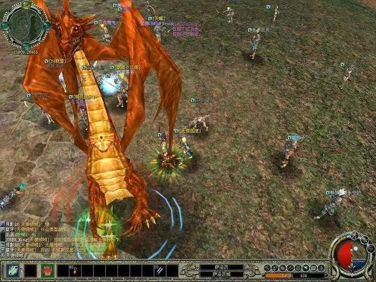

**《凯旋》彼时与QQ游戏团队赛马的证据在于该游戏并非全部由QQ用户账户登陆游戏**

由于《凯旋》采取正面进攻的策略不顺，马化腾在过会时提出了新的设想——「我们能不能用一支小分队的方式尝试棋牌类网络游戏的探索？」这个想法立刻得到了包括此前反对意见声较强的张志东在内的总办其他成员的一致支持，于是孙宇杨与他的搭档——曾宇（前腾讯IEG副总裁）在内的3个人开发出了第一版的QQ游戏平台，并与当时中国最大的棋牌休闲游戏平台——联众，爆发了一场遭遇战。意想不到的是，腾讯就此取得了游戏赛道迄今为止三场决定性胜利中的第一场。

那么，QQ游戏是如何击败联众的？

来自彼时QQ游戏研发小组的一位核心成员，向「朱思码记」分享了这场战斗的经过：

「联众是中国当时最强的棋牌平台，所以我们最初想法是先学他们的模式然后贴着联众打的，但第一个版本上线后数据暴涨，拿到反馈结果一看，我们马上跑去跟老板说“要超越他们非常随意”，我们改变策略走了差异化路线——上线了欢乐豆体系、飞行棋，以及梭哈。

今天还有人说我们当时QQ游戏是完全是靠QQ流量来碾压联众的，但当时QQ日常工作日只有100万人在线（此时盛大《传奇》巅峰时期的同时在线人数高达67万人），真实情况是登录QQ游戏的人中，从未使用过QQ的占比是20%，那也就意味着QQ游戏拉新来的QQ新用户占了20%，换言之在这个时候QQ游戏对于QQ来说甚至成了一个加强活跃度的工具——有的用户为了跟好友玩游戏所以注册了QQ。有意思的是，QQ游戏之后突破100万人数在线的时候，QQ同时在线人数已经达到了1000万。

所以我们一直认为真正打垮联众的是我们当时建立的欢乐豆体系，这个体系的存在最终导致全民玩梭哈在当时火了很长一阵。但联众，既没有这个虚拟货币体系，没有QQ，更没有梭哈。」

QQ游戏的首战告捷显然值得高兴，但对内来说更是一场来自R线对M线的胜利。孙宇扬兵行险棋的通过一套货币体系玩法甩开了与联众的差距，又在2007年1月9日网络禁赌风暴来临前避开「线上赌场」的负面评价而突然关闭了这套游戏币与Q币的兑换体系，最终洗白上岸。

这场战斗最宝贵的经验，是让IEG的早期团队总结摸索出了一套不同于其他游戏公司代理发行运营的策略，使得在《LOL》上线前的6年时间里腾讯发行的游戏看上去几乎都「上不得台面」——成了一家用户体量不容小视，以休闲娱乐游戏为核心的非主流游戏公司。而这与强调重度硬核玩家，以核心作品为卖点的网易、盛大、九城等公司形成极为鲜明的对比。可事实上IEG的学习对象和架构蓝本确系为网易。

既然以网易为师，为何最终走出跟网易截然不同甚至相反的路子？

「原因很简单，因为QQ用户是我们游戏的核心人群。他们热爱日韩风，所以QQ可以把当时的UI界面设计成日韩风，QQ秀也是日韩系为主，同理既然QQ用户喜欢斗地主，棋牌，欢乐麻将，那么还会喜欢什么？于是之后的‘四大名著’都是根据这个用户基础之上而进一步拓展的。即便是2005年我们也做了第一款MMORPG的大作——QQ幻想的画风依然是长期贯穿的休闲风。当时QQ用户已经过亿了，同时上线的还有盛大、金山做了差不多三个非常接近的作品，结果上线当天QQ幻想后台数据反馈出乎预料，55万人在线。那就说明QQ游戏在教育了热爱这部分类型的QQ用户的同时，也把对手的玩家拉进来了。

**腾讯游戏的价值观是什么？就是我们的用户需要我们做什么，我们才去做什么。直到今天，你会发现王者荣耀、PUBG也都是四十五分钟内可以结束一局战斗的非重度游戏，因为我们从来不强调用户沉迷，相反带有点用完即走的意思。」**

值得注意的是，从作品类型看：盛大、九城、网易、巨人、完美等中国网游传统豪强的核心作品基本都围绕MMORPG，因此这几家公司所争夺的目标客户隶属同一类型下的同一批硬核玩家。当盛大领跑行业时，其新作品的用户拉新来源主要是源于旗下现象级作品《传奇》的客户转移，而九城借助《魔兽世界》、巨人借助《征途》拉新也属于同理。网易借助《大话西游2》、《梦幻西游》拉新的说法虽然同样成立，但不同点是作为综合性互联网公司，拥有门户网站、邮箱等其他渠道（数据显示，其早期通过门户、邮箱推广网游的转化率仅为2%），且自研模式的拉新比上述其他几家依靠稳定性较差的代理发行模式更多一些机会。

**但即使如此，上述几家彼时争夺的中国第一代硬核玩家数量对比中国互联网初代用户人口基数时，他们仍属于少数且竞争激烈的存量市场。因此，即使网易彻底击败众多对手且切割走几乎整个中国游戏市场的硬核玩家后，其体量仍然不及强调非重度用户的腾讯收入的1/4——因为其顶层设计和价值观从QQ游戏时代开始，就决心转化庞大且未开垦增量下沉市场。**

随着2005年深腾人字38号文件下达，同属于R线且做出了QQ秀而名利双收的增值业务部与QQ游戏研发组合并，独立后的IED首先伴随着公司地位上的提升因此有了更强的势能，而时任增值开发部的主管经理，华为出身的Mark任宇昕成了IEG成军后的第一任负责人。此时，增值开发部由于有了QQ秀变现的经验因此长于运营，而QQ游戏研发组凭空做出棋牌游戏平台显然强于研发，因此经过这轮整合后QQ游戏之前所取得的战果被进一步扩大，尤其是在蓝钻体系的加入后，游戏赛道的第一桶金也开始被掘取。但从根本上说，QQ游戏在架构上被增值业务部吃掉确是一个不争的事实，而3年后孙宇扬的离开也与这有着密切的关联。

重新回到2009年Q2季度，盛大被腾讯超越的历史时刻背后，是彼时的IEG在一年内连续推出四部取得决定性胜利的作品所造成的直接结果。DNF地下城勇士，CF穿越火线， QQ炫舞，QQ飞车被称为IEG里程碑式的「四大名著」，但同时他们也遭到了外界关于知识产权侵犯和抄袭大王的恶名，甚至引发了彼时来自对手盛大的一纸诉状——这场官司成了当年被业界高度关注的行业性事件。

**首先，令腾讯封王的四大名著是怎么来的？**

来自前IEG的一位元老向「朱思码记」盘点了「四大名著」的真实来源：

「四大名著，只有一个是我们自己开发的，其余都是代理和投资的成果。

DNF的引进纯属巧合，故事是当时我们市场负责人Richard（陈光，现盛大游戏高级副总裁）招了一个女生，她之前在韩国一家游戏公司工作，而她老板刚好就是后来DNF的创始人，她来腾讯以后有天突然告诉我们说她前老板做了一款还不错的横版网游，问我们有没有兴趣接触一下，老板说没问题，于是两家的合作就因为这个女孩子的关系而开始了。

CF是因为我们去谈AVA（《战地之王》）的时候嫌人家千万美元的报价太高考虑了很久，于是韩方白送了一个CF给我们做赠品的情况下我们才签的协议，CF最重要的是内容修改和主导权都给了我们，这是过去无法想象的，最后没想到AVA没火，CF被改火了。

QQ炫舞也不是我们做的，它是一次并购案的产物，对方是北京永航科技，至于后续能够超过对手是因为我们的整体运营环节做的还不错。而同时期，我们还并购了网域，后来推出了《华夏online》。

只有QQ飞车，那是Colin（姚晓光）的作品，也是四大名著里最早上线的一款作品。」

**其次，QQ堂究竟是抄袭，还是借鉴?**

「QQ堂的的确确是我们自己开发的，但是我们没有用它的任何代码和图片，虽然两个创意和名字很接近，但法律上规定抄袭的标准是75%，我们两者最后法院得出的结论是相似度低于50%，QQ堂干掉泡泡堂的核心原因是腾讯长期的后发优势，毕竟QQ本身的IP和品牌力就比盛大要强的多，而且我们半身位的操作体验远超泡泡堂。

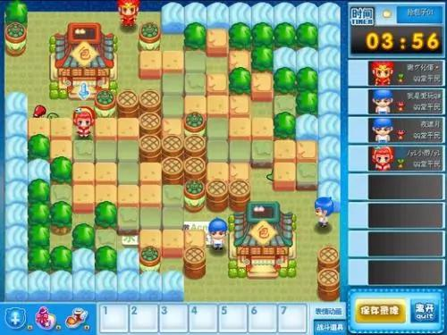

**相比抄袭之说，QQ堂更多被业界视作腾讯对盛大的一次不正当竞争**

我的理解是，如果抄袭作品却能够把原作干掉，那是说明原作太差，还是说明抄的人水准比原作的水准还高呢？ **如果一个人做了一把椅子，然后去告所有之后做出马扎、沙发、电脑椅、板凳的人知识产权侵犯，我觉得是那个人可能混淆了想法表达和想法本身的区别。** 」

最终，法院基于客观事实最终驳回了盛大的诉讼请求，胜利的天平站在了腾讯这一边。但如果单纯抛开这个官司，仅仅根据此时期腾讯与联众、盛大、久游、完美、巨人、网易等竞争对手的交锋经历中，我们也发现了一条腾讯惯用的「跟进式战术」的细节：

在国内外的对手做出一个创意后，腾讯习惯立足于这个创意本身进行二次创作，最终做出了一个在某些细节上超越了原作本身，但看似非常接近对手作品的翻版。而其后，腾讯凭借运营、流量、发行渠道、资本、公关、技术研发等多维度的全面优势，最终完成后发制人。而这样的战术，在腾讯除游戏以外的其他业务线的产品研发中也经常采用，且屡试不爽。而最终结果，是引出了此后掀起轩然大波的《狗日的腾讯一文》和3Q大战为核心的全面冲突。

不过四大名著击败对手的背后，除了顶层战略设计的优势，跟进式战术有效和代理引进过程的判断准确外， **当中还有一个被人严重低估并从未被人提及的部分是腾讯于2002-2012年间曾有一支千人级规模的地推部队，这支「蓝色铁军」的主战场是中国各大城市的网吧，而在几年后与51.com大规模的对抗中，这支部队更是发挥了救火队的角色。  **

「当时地推最厉害的当数巨人。为什么要地推？因为当时中国网络状况糟糕，下载动不动几个小时，十几个小时，安装包那么大的情况下必须靠人来完成。我们一家家的网吧去扫，网吧的每一台电脑都要拷贝我们最新版本的游戏，包括四大名著、QQ幻想，以及后续包括LOL在内的很多作品在很大程度上开局的顺利跟地推到网吧的提前装机有着密切关系。虽然那是上一个时代的产物，但距离我们并不遥远。」

来自前腾讯IEG的一位早期成员向「朱思码记」指出，2018年杭州顺网科技获得了腾讯1.3亿元的战略投资，而这家公司的早期就是依靠在网吧地推铺设系统而建立起来的，而此次战略投资显然是为了进一步加强腾讯在下沉市场特别是网吧这个腾讯系传统阵地上的持续统治力。

在四大名著发布前后，IEG在人事上也发生了一系重大变化。2007年底，Steven马晓轶在为光通引进《传奇3G》后离职后加入腾讯。同一时间，腾讯创始人之一长期负责M线的COO曾李青主动请辞，而4年后COO正式交给了R线出身的时任IEG负责人任宇昕。2008年中旬，孙宇扬宣布离职，在离职前月他还送给IEG一份超级大礼——当年腾讯内部的伯乐奖，便是他从盛大挖来了姚晓光。

几个月后，一款名为《英雄联盟》的作品彻底改变了IEG，腾讯从稚嫩挑战者开始变成了令人恐惧的统治者。

** **

2

恐怖之王

**在中国互联网任何赛道的一开始，腾讯都像一只安静幼小的小猫那样看似** **无害的** **舔着盘子里的牛奶，但当它渐渐长大时猫爪就会开始不断挠人，直到有一天让人真正付出了血的代价。**

这样的故事，在2008年后的游戏赛道中的的确确发生了。

如果说2008年前，QQ游戏和「四大名著」击败一系列对手只是侵略性运营策略的一个缩影的话，那么2008年后腾讯才真正亮出了自己的利爪。而此期间，有两件行业性事件对IEG在日后的战术与战略决策的触动极大：头一件是大家熟知的3Q大战，而另一件则是老对手网易与九城之间围绕《魔兽世界》代理权展开的一场事关企业生死乃至全行业地位的争夺战。

早年依靠“虚拟城市”社区而小有名气的九城，因2002年代理韩国著名网络游戏《奇迹MU》进入游戏赛道而名声大噪，使其成为上海系游戏公司中为数不多能够与盛大直接对垒的强者——九城公司甚至把自己的办公大楼搬到了浦东新区碧波路690号的张江微电子港3号楼，与1号楼的盛大做起来邻居：双方鸡犬相闻却老死不相往来。

九城狂野行径的背后，离不开他们的传奇老板——上海人，朱骏。这位“疯狂”的朱老板在2004年以夸张的1400万美元高价（陈天桥拿下《传奇》代理权只用了30万美元）从暴雪手里拿下《魔兽世界》代理权，也正是这次高风险、高投入、高回报的豪赌直接将九城带上行业之巅，将公司保送进入纳斯达克，朱骏身价一度直逼陈天桥。但相比游戏赛道，在后来作为上海申花队老板的他，在足球赛道则是更为夸张的将阿内尔卡、德罗巴在内的足坛巨星率先引进中超联赛，而让中国球迷瞠目结舌。朱骏迄今为止最疯狂的一次行动，莫过于作为老板的他代表申花队直接上场，参与对抗包括英超豪门利物浦队在内的多场比赛。 **相比之下， 2018年6月朱骏宣布all in 区块链和2019年3月传出与贾跃亭联手成立合资公司生产电动汽车的事情就显得逊色不少，也不那么夸张了。**

「这小子其实瞧不起游戏，只是把游戏当作了赚钱的工具，内心还是更热爱申花，英超。当时暴雪在中国之所以没把魔兽世界给盛大，核心盛大的发行商背景在暴雪眼里是一个潜在竞争对手的印象，因此从开始的九城到后来的网易，你会发现两家都是开发商背景的发行商，和暴雪属于同行，但恰好在暴雪之下」

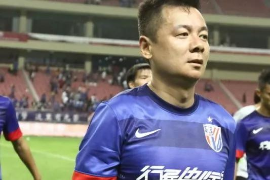

**身披上海申花战袍的朱骏**

**
**

来自中国游戏行业的一位前辈告诉 「朱思码记」，由于给出了极高的利益分成比例+天价代理费且在九城又不对暴雪产生威胁，同时暴雪前合作方——奥美电子毫无网游代理经验的多重因素下，最终驱使暴雪选了九城。

可为什么4年后，暴雪会停止与九城的合作，选择网易？

「2007年，暴雪在美国第一次开始跟国内几家游戏公司释放了自己有意终止与九城续约的信号，始于暴雪认为代理方运营中导致的用户体验度问题，但他们当时也从用户角度思考：游戏的数据库在更换运营商后的交割会非常痛苦，且过程长又体验很差，所以当时暴雪自己也没有彻底想好要不要牺牲自己最看重的用户体验而更换合作伙伴，直到2008年暴雪第二次发出信号时他们已经下定决心要终止续约，因为暴雪认为九城对用户体验的影响比更换代理方的影响更痛苦。当然这里还有一个细节，九城的股东此时是暴雪的最大竞争对手——EA」

来自美国动视暴雪方面的一位合作伙伴向「朱思码记」坦言，九城与网易争夺代理权的过程中至今仍然有诸多细节实在过于敏感而不希望过多展开，但他也指出网易从做出决定到最终接盘并非只是想象中接过一颗烫手山芋般轻松。由于通过《魔兽世界》使得网易能直接从九城这里继承其中国市场领导地位和几乎90%的收入，丁磊不慎犯下江湖大忌——“断人财路，如杀人父母“，而对手则是业界素以“疯狂”著称的朱骏。

**
**

**因此，2009年丁磊决定拿下魔兽世界代理权，与2010年3Q大战时期做出违背自己意志而让QQ用户进行二选一的马化腾，以及2011年十月围城商家围攻事件中誓言决不妥协的马云，并列成为中国互联网三大抉择时刻之一。**

** **

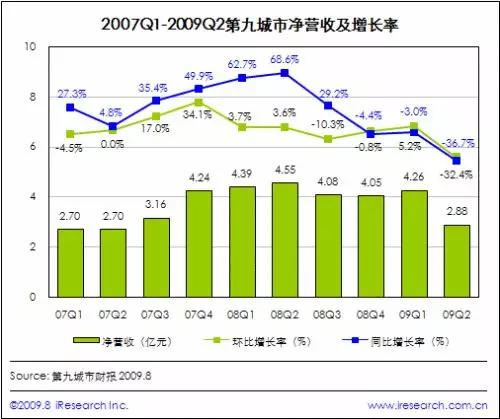

在一旁目睹全过程的腾讯IEG，对于这场争夺战最大的思考便是未来自己如何与合作伙伴，特别是与海内外CP之间保持的长期稳定的合作关系。而失去内容控制权所导致的下场，就是九城。

针对网易接替九城并于此后与暴雪合作所产生的行业影响。2013年7月，腾讯通过动视暴雪最大股东维旺迪进而间接入股6%，一方面是其代理《使命召唤》系列作品铺路，另一方面也是对网易进行一定程度的战略牵制。

战略投资成了2008年后腾讯所祭出的第一件超级武器。

此前关于讨论腾讯财务投资还是战略投资的问题（相关稿件：[战投之王](http://mp.weixin.qq.com/s?__biz=MzI0MDUzNTk2OQ==&mid=2247484660&idx=1&sn=b7a80b5fa4759b94267f1b29da40ce54&chksm=e918143ade6f9d2c99568e8cbadc9e01d22e58ae44bdb6ced9556930b8a5a19786211b63779a&scene=21#wechat_redirect)），刘炽平已于2019年2月20日的腾讯投资年会暨IF大会的演讲中作出了正式的回应：

>  **如果腾讯想控制一切，去做所有的事，这不是梦想，而是妄想。投资是腾讯的核心战略。**
>
>
>
>
> 刘炽平-2019年2月21日腾讯投资年会

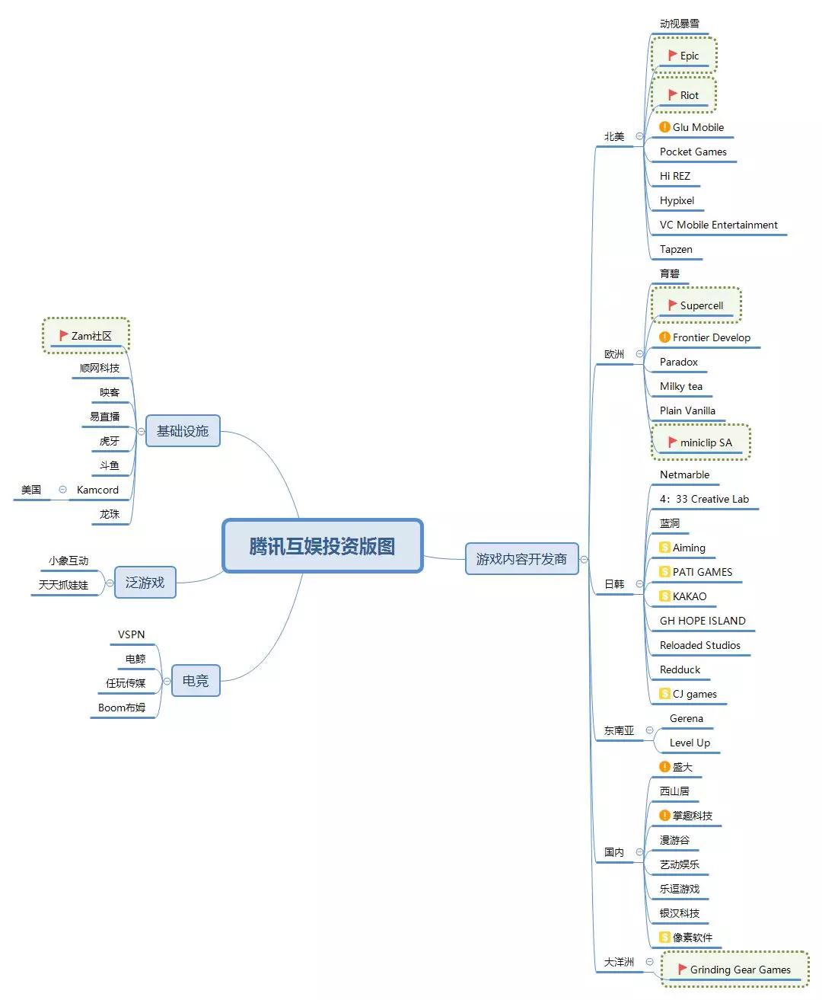

**腾讯互娱投资版图- 「** **朱思码记** **」 整理**

**红旗:并购       $:投后上市企业      \!:上市后战略投资**

「不想控制一切」的说法中，游戏很明显被排除在外。

当身处腾讯视作自己手上半条命的游戏赛道时，刘炽平和腾讯投资一改其在电商零售、to B业务、社交、内容等赛道中风格温和，不追求对被投企业的股权结构上的控制权，强调赋能，打造生态系统，连接一切的设想，相反则是带有强烈的目的性，侵略性，排他性，以维持该业务稳定发展为目标，达到长治久安统治的野心。 **但这种甲方心态的投资模式，却 **恰恰** 是战投的精髓。**

**
**

**正是由于刘炽平当机立断的出手，帮助IEG在过去17年里** **一次又一次的化险为夷，甚至用战投扭转了局面。** 盘点2008-2018年10年间，腾讯五次关键性的战投最具代表性：

*  **2008年-2015年间分三次通过战略投资的形式，最终控股了制作出《英雄联盟》的美国拳头工作室，进而赢得其在中国市场的运营权和实际控制权。**

*  **2012年7月，腾讯以3.3亿美元收购了制作出《战争机器》，《堡垒之业》等作品的Epic Games 48.4%的股份，使其 **成为腾讯集团联营公司。****

*  **2011-2016年间先后两次通过资本运作， **控股** 制作出《部落冲突》和《皇室战争》芬兰手游开发商supercell。**

*  **2017年，先后两次通过资本运作入股两位曾经的死敌——盛大与金山（西山居）。**

*  **2016-2018年间，先后对斗鱼、虎牙四度出手，帮助腾讯拿下了电竞直播在中国市场的几乎全部市场份额。**

毫无疑问，帮助腾讯在国内取得第二次决定性胜利的《英雄联盟》（后文称LOL），是一次教科书式的经典案例。《LOL》的诞生与暴雪公司2002年所推出的单机即时战略游戏《魔兽争霸3》的一种变形玩法——DOTA有着直接关系，而DOTA的创意起源于国外玩家「冰蛙」借助《魔兽争霸3》中的自制地图所完成的大型多人竞技对战模式（MOBA），而这种风靡一时的革命性玩法所产的巨大影响却没有让暴雪公司本身感受到这种玩法背后的商业化潜力，更没有争夺DOTA的知识产权，而恰好却被大洋彼岸的腾讯捡了漏。

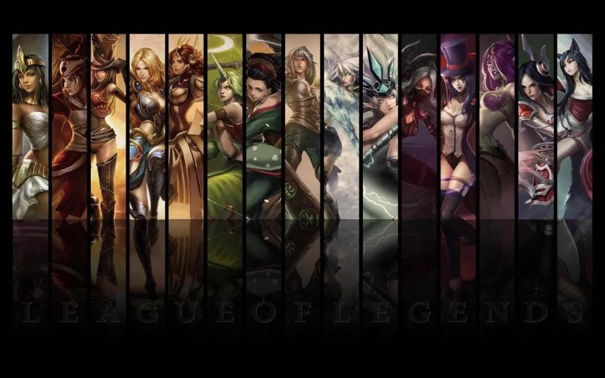

**英雄联盟也使腾讯在美术方面一改过去日韩系的浓重色彩转向欧美**

2007年，作为驻守美国的网大为意外的了解到在美国洛杉矶圣塔莫尼卡的拳头工作室Riot Games正在开发一款类DOTA的MOBA游戏，于是在David建议及刘炽平的直接主导下，腾讯在2008年就以800万美元使成为拳头工作室的股东之一，《LOL》也就此被快速引入中国，赢得了与DOTA之间竞争的窗口时间。直到2009年中旬，当DOTA真正的开发者冰蛙开始与前文提及的V社合作并研发续作DOTA2时，中国乃至亚太市场早已经《LOL》所占领。直到当4年后，当DOTA2姗姗来迟并与完美世界达成代理发行时，中国游戏市场早已进入了手游时代。

复盘本案，来自国内一位游戏行业的资深人士向「朱思码记」评价道：

「LOL的成功来自于中国式的创新，腾讯把需要对战平台的Dota变成了完整的网游，他们做了很有意义的简化。DOTA的问题在于上手难度过高，腾讯用简化后的降低难度赢得了市场，而且这种简化影响了后续王者荣耀的诞生，如果dota的难度是100，LOL就是40～50，王者荣耀最多只有15，而每一次简化后对腾讯的回报就是更多用户的收割，英雄联盟的简化奠定了腾讯在中国第一的地位，而王者荣耀的简化奠定了世界第一的位置。

当然绝大部分厂家也想做简化的工作，但不得不承认腾讯处理的很好，如果腾讯在一开始就是copy后收割原DOTA用户的话，可能结果不会是后来的样子，事实上他们的一切行为都是奔着更广阔的市场和用户去的，当dota2与LOL发生竞争时犯下的错误便是没有意识到游戏需要一些简化，因此V社为了保证既有硬核玩家用户群的基础上只做了些许的创新，最终丢了原本属于自己的中国市场。

**关于英雄联盟和DOTA之间的知识产权争议，我只能说著作者和V社的力量还很有限，假设当时DOTA的所有权明确了不是作者个人而是动视暴雪的话，腾讯的官司可能就来了。** 」

2016年7月，网易在当年美国E3展览上高调公开了旗下首款携带自研次世代3D引擎——Messiah的手游《天下》，而此次网易选择发布自研引擎在很大程度上却与腾讯此前控股的Epic有着间接关联。4年前的2012年，Epic Games成为腾讯集团旗下联营公司， **而** **该公司有一项重要的资产便是国内外大量游戏开发商主流应用的「虚幻」系列游戏引擎的知识产权。若竞争对手不采取积极的自研引擎进行及时反制，一旦腾讯日后采取相应手段，极有可能会导致其无游戏引擎可用的悲惨境地。而该公司开发的类吃鸡游戏《堡垒之夜》，一度也成为《PUBG》最好，也是最相近的替代方案。**

** **

而从本案可获悉，此时腾讯战略投资的方向已经不只局限于从CP的单一维度，而是开始向产业链的源头挺进。恐怖之王正在渗透游戏行业的每一寸角落。

直到一场新时代的革命，突然来临。而革命即暴动，也是一个阶级推翻另一个阶级的暴烈行动。

**中国第一款吃鸡游戏——西山居开发的《小米枪战》也同样采用虚幻4引擎**

2011年，中国游戏行业出现了端游、页游、手游交火的时间点。虽然腾讯依靠《英雄联盟》作为端游的霸主，但在页游和手游的两个阵地上并没有显示出其游戏之王的统治力，相反则呈现出掉队的迹象。巧合的是，他们的对手网易也同样处于类似掉队状态。

「当年的风向核心是页游，因为端游被腾讯打垮的人做了手游，页游。当时大家主流不怎么看好手游，觉得屏幕大小（iPhone4-4s尺寸仅为3.5英寸）还不合适所以觉得要多等几年。页游起来的核心原因是因为当年这帮做SP的人又回来做游戏了，流量玩法最后的狂欢在那个时间点爆发了，今天没有创新基本没有活路，但当时没有内容也可以去搏一搏。页游概念其实是超前的，我们看到今天腾讯云游戏其实就是页游在基础设施完备情况下的一个最终形态，但当时国内网速还达不到今天的水准，所以彼时页游想通过网页做出千人万人国战，虚假宣传到头来的结果是大面积的卡顿和糟糕的用户体验，但当时卫星的确是这部分人先放出去了。所以今天看，网易、腾讯没有掺和这池浑水，显然在部门博弈和战略判断的结果上是正确的。页游概念太过超前，思路没错但可惜生不逢时。」

来自国内一家专注文娱产业的投资人告诉「朱思码记」，随着页游时代基础设施的不完善与其流量玩法主导下来自C端口碑的不断下滑，使得页游时代稍纵即逝，并在短短数年间就因为手游的崛起而泡沫破灭，与此同时SP出身的页游开发商也被贴上了中国游戏行业「莆田系」的标签——这部分人习惯性的从SP转向页游，又从页游再转向手游，然后还从手游转向了区块链，最终成了败坏游戏行业的名声的投机者，脸上被渐渐贴上割韭菜的醒目标签。

在同一条时间轴上，Wechat于2011年的横空出世让腾讯惊险的从米聊手里抢下移动互联网时代几乎唯一的一张门票，而这种触及企业根基的终端革命让腾讯全公司上下颇感紧张，当中也包括IEG——上一个时代，QQ用户是腾讯端游时代的根基和克敌制胜的基础，但在全新的手游时代，至少在微信羽翼未丰之前，腾讯游戏必须从零开始。恰好是在这个节点上，刘炽平的高盛前同事，擅长战略规划实施，与战略投资的James Mitchell于当年8月加入腾讯，接替刘炽平成为新任CSO。

**James Mitchell担任CSO前，刘炽平担任首席战略官长达6年之久**

截止2011-2013年间上半年，此时苹果、安卓应用商店的游戏排行榜TOP几乎全部来自于国内小厂商和海外厂商在内的一系列竞争对手：《捕鱼达人》，《我是MT》，《神庙逃亡》和蓝港彼时推出的《三剑》系列作品的成功极大的刺激了在端游时代被腾讯打垮的那些竞争对手，于是在这种看似王朝末年的动荡局面下，甚至当时已经连日渐衰微且投行化运作的盛大都代理了来自日本的《百万亚瑟王》这样质量上乘的作品。此时已经升任COO的任宇昕，他面临着前所未有的麻烦：IEG在游戏行业的对手第一次呈现来自国外+国内两条战线共同夹击的危机。

但更大的危机，是来自内部的分裂。

2013年8月微信5.0版本发布，一款名为打飞机的小游戏风靡全网，即使连不玩游戏的用户也为之痴迷，其用户数量之多直到4年后微信小游戏推出「跳一跳」后才刷新了此前打飞机所保持的记录。但就在微信发布打飞机的同时，腾讯IEG也悄悄发布了他们第一款真正意义上的手游作品——《雷霆战机》，也是一款打飞机游戏。

**和《打飞机》类似，《跳一跳》同为一次来自微信自身对游戏业务的终端市场测试**

但这并不是巧合。

「 **Allen（张小龙）本人其实不喜欢，也看不起市面上，包括IEG出品的一系列以商业化为导向的游戏。就像他做小程序，做小游戏的目的是为了去连接一切服务，去连接线下，微信不是去给IEG部门导流量创造财富的。打飞机和跳一跳都是对IEG的一次警告,他的意思就是：**

**
**

**‘不要把你们的那套搬到微信来，微信有自己的原则和价值观，如果你们游戏做的不好，那让我们可以做一个简单Demo的给你看看’**

**
**

**当然，你看到今天小游戏方面，其实WXG对其发展和规则制定都是非常谨慎和严谨** **，甚至是存在一定打压的。** **（2019年1月10日，广州微信公开课，微信小游戏负责人接受「朱思码记」采访时表示将继续重拳打击含有涉嫌Box模式二级子游戏的相关应用）** **因为我相信这过程中Pony做了很多的协调工作来缓和两个部门间的矛盾，毕竟谁都知道WXG渠道+IEG开发是腾讯利益最大化的最佳方式，但Pony不可能用命令的方式去干涉Allen的想法。** 」

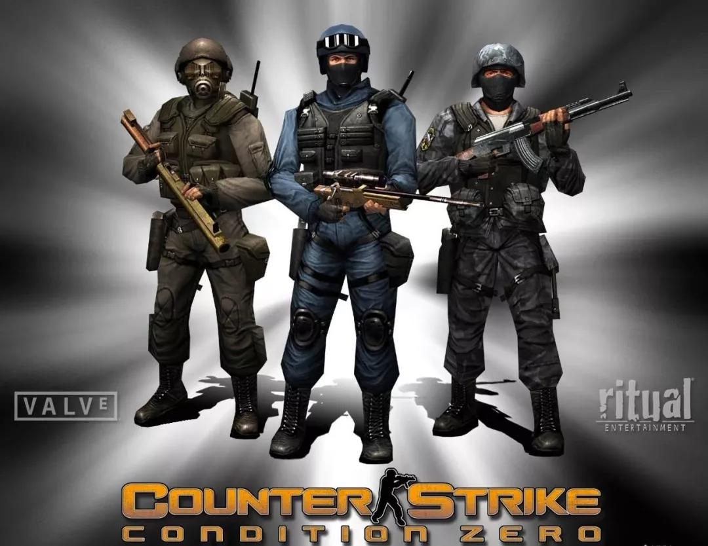

**  张小龙本人为CS玩家，他在微信摇一摇功能里加入了类似枪械上膛的音效便是对CS游戏的致敬
**

一位接近WXG高层的朋友告诉「朱思码记」，从某种意义上说WXG的打飞机和IEG的雷霆战机两款作品的同时推出，乃至跳一跳的火爆——实为腾讯当前组织架构中最具实力的两大部门间关于流量、价值观和商业化问题产生矛盾，最终升级而公开化的产物。

不过所幸的是，上述两款打飞机游戏的数据表现都极为出色，WXG不仅在微信端和APP端测试性并验证了手游市场空前庞大的空间想象力与潜力，也标志着IEG在手游1.0时代的正式回归——IEG随后全线开火，推出「天天」系列游戏的同时，还不断将端游时代的老IP在革新玩法后进行手游化的快速补位。这样措施在短时间内显然起了一些效果，腾讯手游群历史上第一次进入榜单的TOP，任宇昕的这一波进攻显然达到了预期的效果。

不过意外的是，来自原腾讯IEG离职创业的王信文和他北极光工作室群的几个同事创办的上海莉莉丝做出了一款霸榜级的大作——《刀塔传奇》，在2014年最先给了自己的老东家当头一棒，场面一度十分尴尬。而更让IEG感到尴尬的是，来自上海逗屋公司出品的《自由之战》与后续大红大紫的《王者荣耀》近似度极高，甚至再次引出“抄袭风波”，而这款作品的投资人正是已经转型成为投资人的北极光创投合伙人孙宇扬之手。

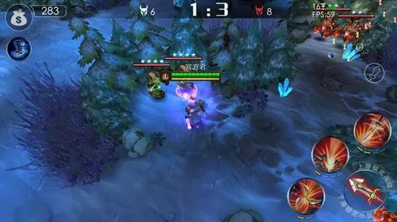

**作为国内最早涉足手游MOBA类型的《自由之战》与姚晓光天美后来出品的《王者荣耀》存在非常多的相似之处**

**
**

而在此时，网易在手游端的转型已经完成，其在1年内所推出的多部作品帮助其取得了手游时代的优势位置。2014年4月，网易推出首款手游作品《迷你西游》，几个月后网易首个采取了MOBA玩法的作品——《乱斗西游》上线后即开始霸榜，月流水过亿，日活300万。而在《乱斗西游》霸榜的同时，网易于2015年3月27日上线了《梦幻西游》的手游版，随后开启持续500天的挖宝，并在此后上线了《天下》和《大话西游2》手游版。

当《梦幻西游》手游版上线后不久，中国手游史上吊诡的一幕发生了：腾讯采取了合纵连横的战略，竟然代理运营了曾经的死敌——盛大安身立命的代表作《热血传奇》手游版，并于《梦幻西游》发生了长达4个月的攻防战。而在另一方面，射击游戏爱好者马化腾也不遗余力的为旗下FPS手游《全民突击》打起了广告。但最终，与网易争夺手游市场的胶着状态依然不容乐观。

今天复盘腾讯手游1.0时代进攻受挫而一度掉队的原因，实际来自多方面：

* 此时微信处在上升期，尽管新渠道的优势明显，但是腾讯游戏并没有重视作品本身的品质，此时腾讯手游呈现的问题是量多而杂，但作为用户层面来说：腾讯手游的品牌此时已经不再新鲜，相反甚至还带有些负面，腾讯手游研发能力不足的劣势在此时被进一步暴露。

* 在题材类型方面，关于中度、重度的游戏布局不够，尤其是在对位网易的时候更显捉襟见肘。

* 受限于大环境的基建。3G转4G的节点，受限于基础设施的限制，是腾讯无法立刻推出大作是一个重要的因素：此时代流行的手游爆款安装包基本围绕在100-200MB左右。

* 运营商和各类安卓应用商店的割据仍在继续。多如牛毛的各个应用商店，需要保证每个商店的上新同步，版本一致等等问题，而此时腾讯拒绝与混战中点第三方合作的态度，最终为此付出了代价。

面对手游的掉队之危，作为《王室战争》全球排名TOP100玩家的刘炽平又一次关键性的出手了。2016年6月21日，腾讯以86亿美元的价格并购了当时全球手游收入排名第一的芬兰手游公司Supercell。

那么，为什么是Supercell?

* 腾讯投资之时恰好是国外手游在中国最盛的时间点，因此在IEG还未彻底完成手游转型的时间点上，战略投资等同于化敌为友，而事实上在结束Supercell案后，腾讯就开始腾出手来对付国内此时气势最盛的网易。

* 入股可以保证代理权的稳定，而在控股Supercell公司后，可以腾讯立刻采取“以夷制华”的策略利用：即利用《部落冲突》和《王室战争》两款海外作品的代理而延缓网易为首的国内竞争对手的攻势，而同时利用自己在国内市场渠道发行市场运营等天然优势扩大该游戏的盈利能力。

* 能够赢得更多时间为自己团队创造条件。2015年为全民超神与王者荣耀的公测赛马和测试，2017年则包括两款绝地求生作品的研发测试工作，而并购案刚好发生于此期间。这种迟滞对手的战术，在1年后的吃鸡大战中再次上演。

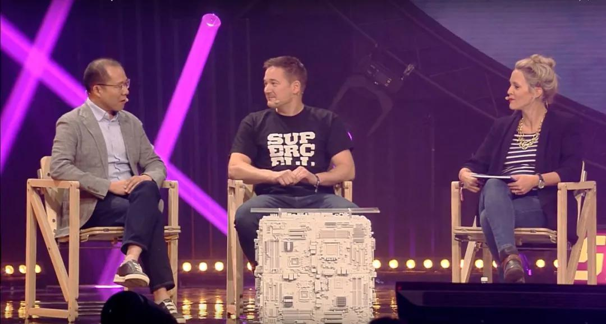

**左-Martin刘炽平 中-Supercell创始人伊尔卡**

**
**

Supercell并购案结束后，刘炽平参加国外访谈时曾经这样描述了事情的经过：

**「（译文）2016年3月才是我和伊尔卡（Supercell公司CEO）第一次见面的，而腾讯第一次接触Supercell的时候是2011-2012年，当时他们推出了《部落冲突》，那时我们只给了投资20%的offer，并希望他们和腾讯成为合作伙伴，但当时supercell的大股东表示希望出让手里的绝大部分，这让我们感到很犹豫，他们这是要干什么？所以我并没有在当时就同意这个想法，今天来看我个人犯下了一个30亿美元的错误，那就是在与他（伊尔卡）还没见面前就这样否掉了并购案，因为后来他们的推出了皇室战争（估值飙涨）。」**

然而今天，Supercell早已不是几年前气势如虹的全球之霸，随着腾讯自研游戏和其他代理作品的崛起，Supercell的手游新作《荒野乱斗》的苹果应用商店排名也大不如前,最核心原因莫过于《荒野乱斗》耗时1年零五个月的不断改进而最终导致其当前暂时性的掉队,但这款作品的难产的原因究竟是腾讯的资方意志的把控,还是芬兰团队的决定仍然无法知晓。

此前访谈,中刘炽平也承认他们几乎是在这家公司市值的历史最高位时选择了并购，但今天回过头复盘，彼时腾讯通过包括第三方财团+自身寻求银行贷款最终完成的天价并购案「是否属于冤大头买卖」的问题值得深思：今天我们知道在手游2.0时代，真正为腾讯扭转局面的不是芬兰人，而是自家的天美工作室群。

**值得注意的是，Supercell案进行过程中，腾讯的一位老对手——史玉柱的巨人也参与了竞标。据一位接近巨人的业内同僚指出，此时巨人背后参与竞标的财团，其资本来源指向阿里巴巴。**

**
**

**事实上，Supercell开发的多款游戏也曾在2013-2015年间于阿里内部员工间广泛流行，而彼时该公司的第一大股东恰好是也是阿里巴巴的第一大股东——软银。** **因此，在这种错综复杂的关系交织下我们不能排除存在巨人、阿里、软银设局，在彼时促成了一场荷兰式拍卖，最终迫使腾讯以天价并购Supercell的可能性。**

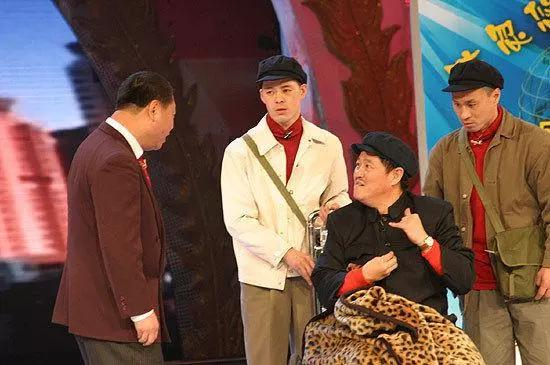

**春晚小品《功夫》中，赵本山哄骗范伟突然成交的拍卖模式正是运用了荷兰式拍卖的相关理念。**

几乎是Supercell并购案发生的同一时间，1年前腾讯代理《传奇》的合纵连横在这时上演了「升级版」：当年4月，腾讯游戏UP+年度发布会上，腾讯当日发布的13款新品手游中，曾经和腾讯在端游时代打到「六亲不认」的五大对手——西山居、盛大、完美、巨人，畅游全部站到了腾讯阵营，他们的手游作品均交由腾讯代理发行。

**相比用资本运作打造坚不可摧的联盟，「六大派围攻光明顶」事件的背后，实则为彼时五大手游开放商在流量困境下的不得已。**

流量，成了腾讯新时代的第二件超级武器。

那么，流量来自哪里？

自2015年开始，中国移动互联网时代的流量红利宣布结束，手游1.0时代的百家争鸣剧情开始急转直下：用户和流量已经从量变引发为质变的微信成为手游2.0时代的第一渠道，而腾讯系游戏的渠道发行优势已经不再局限于单一渠道，旗下多个业务线的产品、合作伙伴、资本布局此时开始与手游赛道的业务线会师：

* 2017年1月9日微信发布了划时代意义的小程序——目的是进一步将移动端的全网流量向微信收紧，从而进一步压缩非腾讯系APP的生存空间。

* 2017年7月12日腾讯与中国联通合作的大王卡上线，由于大王卡的腾讯系APP、游戏拥有免费流量资费优势，进而逼迫用户从资费角度选择腾讯系产品，大王卡的出现又进一步压缩非腾讯系APP和游戏的生存空间。

* 2015年以来，腾讯对电竞直播赛道的资本布局，直到最终垄断了这个代表未来宣发趋势的平台。

彼时至今，行业内的独立CP依靠私域流量和坚固的客群，在投资人的支持下尚且可以借助小众二次元等类型的作品达到温饱小康，那么大型CP则必须面对要么做腾讯的盟友，或者成为网易那样的对手。

基于这种局面下，即使这些昔日的死敌们内心有万般的不情愿，但在流量和发行成本面前也不得不理智的选择与腾讯合作，而不是与之争锋。而与此同时，刘炽平再度出手，为政治联姻送上“锦上添花”的聘礼——西山居、盛大均在2017年获得了来自腾讯的战略投资，短短12个月时间就完成了从敌人-合作伙伴-盟友的转变。

恐怖之王用流量和资本武器完成了海外和国内的双线反击。

不过，单纯依靠流量和资本所能达到的效果仍然有限，想要真正扭转局面则还是需要依靠R线，微信如是，腾讯游戏如是——来自深圳总部几千公里外的腾讯成都，2011年这里的一组团队所做的另一个版本的「微信」（后来该团队做出了“微信电话本”APP）只因晚了广州张小龙团队1个月最终错过那场注定要载入史册的赛马，不得不说是一个巨大的遗憾。而4年后，成都的游戏团队面对机会时没有松手。同为R线出身的孙宇扬，离职前送出的超级大礼此时被IEG正式签收。

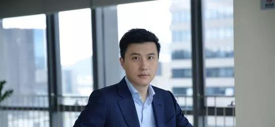

**姚晓光现任腾讯副总裁，天美工作室群总裁**

**
**

姚晓光的天美工作室群，旗下的成都卧龙工作室从其诞生至2015年前仅做出过《QQ三国》，《QQ封神记》和《宠物牧场》等作品，追溯上一款热卖作品还要追溯到遥远的2008年。他们的端游MOBA作品《霸三国》在2014年惨遭停运后，L1  Studio面临着被裁的困境。于是，恰好这时IEG内部的光子工作室群正在参与首款MOBA手游的研发工作，恰好他们的工作室此前确实有过MOBA端游的开发经历且当时到了生死存亡的关头，又恰好IEG此时也需要一个类似张小龙这样的白马骑士扭转战局，于是基于逆境、偶然、天才、运气等一系列要素后，天府成都上演了中国游戏行业里那个最著名的励志故事——成都团队的《王者荣耀》从先期战败后做出了惊人的重大修改，最终击败先行上线且实力强劲的光子工作室群作品《全民超神》。当前历史最高DAU超过1.3亿，被IGN评价为世界上最受欢迎游戏的同时，还拿下了腾讯手游时代真正意义上第一次决定性的胜利，也成了IEG三场决定性胜利中的最后一场。

**「贫穷限制了我的想象力」**

来自老对手，网易游戏的一位朋友向「朱思码记」坦言，即使他们内部在面对王者荣耀时也不得不承认腾讯这个作品做的很棒。

回顾7年前，DOTA的简化版《LOL》奠定了腾讯在中国游戏行业的决定性胜利，但在大洋彼岸关于这种玩法的知识产权归属问题至今仍有争议，不过所幸的是暴雪与Valve公司更具西方骑士精神，两家并没有因为利益的冲突而发生实质的官司和纠纷。但7年后，当王者荣耀遇到了类似的问题时，腾讯则没有像他的海外同僚那样选择放下争议而是毫不客气的拿起法律来维护自己的权力，就像盛大当年那样：

**上海沐瞳科技与腾讯公司及旗下全资子公司的美国拳头公司因为《无尽对决》和《王者荣耀》、《英雄联盟》的知识产权问题和腾讯离职员工竞业问题而大打出手，最终沐瞳科技创始人徐振华被判败诉且赔偿1940万元。**

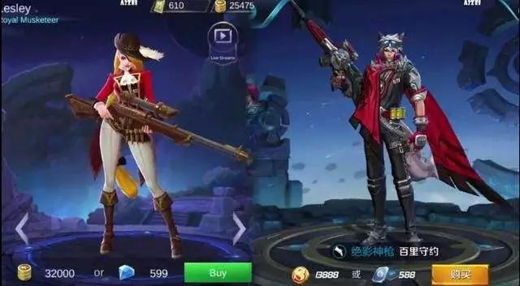

**《无尽对决》与《王者荣耀》官司背后更大的原因来自前者对腾讯游戏出海所造成的不利影响**

「整个事情的 **起因是因为沐瞳做的太大,也太过。** 他们打的核心市场是东南亚,特别是印尼\(拥有2亿人口的全球人口第四大国\)在当地成了国民游戏,而王者荣耀的海外发行交给了Garena公司，他们本来是英雄联盟的代理，但腾讯并没有给到他们全部的海外权利，于是发生的情况是——《无尽对决》可以全球通服，而《王者荣耀》只是在当地，这是一种不对称的模式，沐瞳要比Garena有优势的多。

毫无疑问，腾讯不可能打不过沐瞳，但如果他们也采取这种模式的话，就会打乱整个王者荣耀的海外和国内游戏市场的战略布局，这是高层无法接受的。当然还有一个原因，是沐瞳对王者荣耀的“学习”，至少我认为超过了借鉴的底线。」

一位接近沐瞳科技的投资人告诉「朱思码记」，此次诉讼案背后所造成的不利影响并非只是海外声誉和市场份额问题，更大的负面影响是事关腾讯与离职员工的问题——来自原腾讯IEG的员工，一旦其离职创业而选择投身游戏赛道时则势必会发生于老东家存在竞争与矛盾的可能——因为腾讯是全球游戏行业占据市场规模最大的公司，而此次诉讼对鹅厂的「老企鹅」创业开了一个非常不好的先例。

13年前，腾讯与盛大因为《QQ堂》与《泡泡堂》的抄袭争议而对簿公堂，而13年后原告方变成了腾讯。如果抛开官司最终结果本身不谈，无论《英雄联盟》、《王者荣耀》还是《无尽对决》的想法本身其实都出自于大洋对面那位做出DOTA地图却像交流电发明者特斯拉那样甘愿放弃专利费用的玩家——冰蛙，而法律愿意保护的仅仅只是创意者的想法表达。

可如果沐瞳和腾讯以及盛大之间的差距，仅仅只是一场官司输赢的话，对腾讯，对中国游戏行业，乃至世界游戏行业来说只能算是一种侮辱。游戏本身是一件好玩的艺术品，而腾讯互娱对于自己的护城河的建设也是非常精细且爱惜的，但今天如果以纯商业利益角度而对艺术品进行干涉，其结果只能是把艺术本身的感性彻底抽离，变成残酷而无情的赚钱工具时，作恶显然无法避免。

「谁说恶魔一定要样貌恐怖？」台词恰好出自腾讯旗下《英雄联盟》中恶魔小法师，维迦之口。

左执资本、流量为武器象征力量，右持恐怖为盾牌象征统治。正当腾讯互娱在新时代亮出自己的武器和盾牌，试图收割并统治下一个时代之际，不料山雨欲来，灾祸的天降。

3

**天降杀机**

** **

2008-2018年，游戏之王的似乎解决了一个世界性难题：过去传统游戏行业只能单纯依靠市场反馈进而对作品本身水准做出判断，但在腾讯手里则是采用并依靠一套精密的分析法和模型，将游戏这种带有创作者感性色彩的艺术形式以最理性的数字进行评估后，最终得到作品优劣的准确评价。关于发行和投资模式，网大为曾有过这样一段描述：

**「（译文）在拿下韩国CF和DNF的代理权后，我们以这两个作为样本告诉那些著名游戏开发商的时候，我不再过多向他们介绍QQ多么有前景或者更多哲学范畴的问题，而是告诉他们我们赚了很多钱。我们的确之后建立了一套模型，可以预测出这个游戏的未来市场规模，预计其市场表现，我们该如何谈判代理发行，代理模式是怎样的，利益分配的合同该怎么拟定，然后我们就不断的快速重复复制它。一旦我们注意到全球范围内有盈利表现不错的游戏，我们就会去投资它，然后拿到代理发行权，它就像一根管道。中国有很多的互联网用户，这就意味着有很大的游戏需求量，一般一个游戏拥有5000万用户，1亿玩家可能就到头了，而我们到现在为止还没有遇到过市场饱和的状况，所以这是一门非常不错的生意。」**

伴随10年来从中国第一迈向世界第一的路程，人们和同行也仿佛相信了腾讯这套复杂程度如同手表齿轮般的算法是行业迄今为止的最优解。作为其中最关键的一个齿轮——直播大战的最终结果,不仅让所有与腾讯合作或竞争的CP彻底没了念想，也让全行业意识到了这种战略投资模式的不可战胜。

2019年3月30日，熊猫TV在创办1286天后宣布关闭，标志着旷日持久的电竞直播大战最终胜负的揭晓： 由2018年3月同一时间宣布获得腾讯战略投资的虎牙、斗鱼两分天下，游戏行业的最后一块流量阵地陷落。这不仅直接加速了上游CP们进一步采取行动向腾讯靠拢，也出乎意料的送给了腾讯互娱一把不曾拥有的“神剑”。

时间回到7年前的2012年，以电竞、网游用户为核心的YY语音平台建立了中国电竞直播平台的雏形——虎牙的前身。而此前，尽管中国第一代电竞选手夺得WCG2005魔兽争霸3总冠军的SKY李晓峰，一度让中国玩家在CCTV5上看到了当局对于电竞产业开放与发展的希望，但随后证明这只是讨论“电子海洛因”说法过程中的一次回光返照，电竞直播的电视信号在SKY夺冠后被再次掐断。

值得注意的是，放眼2000年后美国同僚将其竞技体育产业的发展经验直接运用于电竞行业，使得美国电子竞技产业职业化速度惊人：大量篮球棒球橄榄球以及影视明星，和大型体育电视台成了电竞战队的老板或投资方。而中国的邻邦，韩国由于遭到亚洲金融危机冲击，彼时金大中政府集举国之力发展娱乐产业和电子竞技，使韩流明星袭卷全球的同时也把韩国电竞选手拉倒了电视上，因为这种背景使得韩国财阀三星成了SKT与三星战队的赞助方。

彼时，中国P2P技术带动的PPTV，PPS等网络视频平台成了过渡时期中国最早能够看到电竞直播的入口，伴随着数字电视的点播平台和优酷土豆的崛起，同时间淘宝网引领中国进入电商零售时代之际，电竞直播的粉丝流量客群+淘宝网店直接跳转成交——诸如“肉松饼”为代表的网红零食成了养活第二代中国电竞选手的唯一路径。

DOTA的兴起，抢占先发位置的虎牙带起了中国第一批直播平台的成立，大量电竞网站开始转向直播，这当中就包括2013年以A站用户为基础进而孵化建立的斗鱼直播。直到1年后，美国最大的电竞直播平台Twitch被亚马逊10亿美元的天价并购，颠覆了中国资本市场对于这个赛道在过去的想象空间，造成的后果便是资方与大量电竞直播公司在2014年后争相入局，点燃数十家公司间相互厮杀的直播大战。

从游戏行业视角看，电竞直播对于游戏来说，有什么影响力？

* 大部分C端用户在不会玩游戏的情况下，看游戏赛事的进入门槛则简单的多，而这种模式的影响会使这个产业的影响力以若干的个倍率的形式疯狂暴涨。

* 彻底改变了传统游戏的宣发模式，直播平台打垮了曾经掌握核心流量和客群的游戏门户平台，而视频直播对于纯文字+图片+视频的维度打击力是门户平台所无法抵挡的。

* 极大的简化了整条产业的链路。除了游戏本身外，只有直播平台是直接TO C的，由于聚集了大量垂直玩家导致了直播平台成了一个超越游戏本身的泛娱乐造星平台，电竞赛事的流量在可见的未来能与电视台直播篮球、足球等竞技体育赛事相比拟，其商业价值不可限量。

回到问题，腾讯的神剑从何而来？

早在2013年，彼时还是YY直播的虎牙为了更好的抓取游戏画面而采取了一种植入网易旗下梦幻西游客户端的策略，而引起了网易方面的强烈反弹。对于以产品为核心资产的网易来说，YY的做法与此前360入侵QQ客户端引发3Q大战的做法无差，而更让网易恼火的是YY方面当时还一度将观看梦幻西游直播的用户导入到了一个与梦幻西游极为接近的页游页面进行分流变现，于是网易旗下的直播平台——CC直播相关负责人以个别用户在直播过程中梦幻西游客户端程序崩溃为由向YY开火，并向法院提出诉讼。但关于玩家游戏画面是否属于游戏公司版权一部分的问题，在当时看来属于一个从未讨论过的领域，因此官司的进度一拖再拖，结案也遥遥无期。

直到2017年Q3，彼时正处于网易、西山居、腾讯围绕吃鸡类手游争夺市场而混战的关键节点，也就在此时那个4年前就开始打的官司突然有了结果：法院认为游戏画面隶属于游戏公司版权，YY败诉网易胜。网易无意间开启了一个关于游戏公司版权的新领域——直播使用权。

但彼时，国内游戏行业的格局已经从2013年端游转手游初级阶段的百家争鸣变成了腾讯系游戏占据电竞直播70%，网易游戏占比10%，PUBG占20%以上份额的7:1:2。巧合的是，判决书发布前的同一时间腾讯战略入股PUBG制作方韩国蓝洞，与其合作开发的手游PUBG正在研发进行中。在可见的未来，腾讯的市场份额可以达到电竞直播内容的90%以上。

毫无疑问，直播使用权是可以用于威慑的。

**「最紧张的一晚，Mark（任宇昕）给少杰（陈少杰）通了电话，明确的告诉他现在局面情况是怎样，电话里他也没多说什么，就问少杰下一步准备怎样做。结果第二天，斗鱼上所有的网易游戏全都消失了」**

一位接近斗鱼、腾讯IEG高层的朋友告诉「朱思码记」，在腾讯2018年第三次架构调整前，其投资并购部的项目确实可以在未经相关业务部门的认可前完成出手，但唯独游戏赛道除外。因此，IEG存在一个与投资并购部双向虚线汇报的“IEG投资部”，而这个部门的直接负责人便是掌管海外发行业务的Steven马晓轶。

**所以，第一笔对斗鱼的投资实际出自投资并购部偏财务投资属性的早期投资，但虎牙的第一笔则是来自IEG方面Steven主导的战略投资。** 假设彼时陈少辉反抗战投方的意志，其结果必然是斗鱼被无情抛弃，虎牙从此一家独大。而在另一方，来自虎牙创始人李学凌于2018年上市后接受纪源资本GGV旗下996节目的访谈中曾这样说道：

** ** **「****** **如果我们不和腾讯合作，就要与他竞争。我们只能得到游戏直播的市场份额，但没有时间开发游戏。我认为最后的情况将会是斗鱼和虎牙联合在一起。** ** **」****

**李学凌无意间说了不该说的大实话。**

实际在2017年Q4季度，腾讯通过新一轮战投分别持股斗鱼、虎牙25～30%，而据一位接近斗鱼、虎牙高层的朋友告诉「朱思码记」，本轮战投背后还存有一个三方口袋协议：即在战投完成后2～3年的周期内，腾讯有权通过最终市场份额第一的平台将另一家平台进行合并。这彻底理清了当前斗鱼为何在与虎牙已经两分天下的安定局面下，仍然要执意准备IPO进而募集粮草，与虎牙开战的原因。

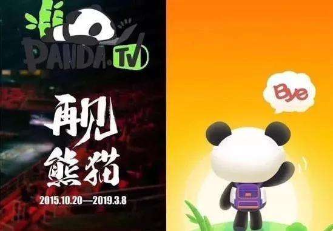

神剑除了威慑亦能杀人，今天已经消失的一系列非腾讯系直播平台便是剑下的亡魂。

当资本市场了解到了腾讯系拥有80～90%市场直播内容的绝对控制权时，结果便是资方开始大量退场，最终导致直播平台因为断粮而快速死亡，其中王思聪投资的熊猫TV也是受害者之一。而同样值得注意的是，这柄神剑还于2018～2019年期间成功用于狙击抖音、火山视频等头条系产品。 **字节跳动方面试图通过内容聚集与其产品矩阵核心年龄段重合度极高的玩家人群，进而杀入游戏赛道的战略意图被腾讯提前识破，今天最终只能另寻出路。**

当产业链上下游两端的所向披靡，让已经武装到牙齿的腾讯互娱自觉天下无敌，直到《怪物猎人：世界》《PUBG》的相继出事才让游戏之王回到了股灾现场的正当时。

2018年8月13日，《怪物猎人：世界》的下架成了腾讯游戏持续灾祸的起源。

来自美国的Steam平台今天存在的一个核心价值，也是它对于腾讯的威胁是作为CP的发行渠道来说，其成本远低于其他传统渠道，且规则更为公平。众所周知，当前游戏行业渠道发行的成本占据了一款新作品的总成本的30%左右，与10年前大为不同，核心逻辑即是谁的游戏发行越早，谁的发行成本就越低，这也是首发权为何会致使众多平台争夺如此激烈的一个核心因素。而《怪物猎人：世界》的最终下架，其背后是腾讯对标Steam的WEGAME平台在与其争夺首发权的过程中不慎失手导致的一场悲剧。

一位接近腾讯IEG渠道发行的一位朋友告诉「朱思码记」：

「在《怪物猎人：世界》被下架前，其实相关部门已经给了腾讯发了批文，同时也给了腾讯明确的整改和修改意见，譬如血腥画面的整改意见等等，但是对于一款3A级作品来说这样的修改是需要一定时间的，可IEG的渠道发行方面则是希望达到WEGAME平台与Steam平台同时上线进而达到全球同步发售的预期效果，于是在部门博弈下一个未能完全修改完毕的版本在首发当天被送上了架，而当天相关部门的审查员也在开服当天上线检查并发现了问题，而从发现问题到被下架中间，IEG仍然还有4天时间来扭转局面，但是他们什么都没做，直到后来大家关注的焦点变成了‘网易举报腾讯’。」

WEGAME平台与Steven马晓轶为了这款作品能够第一时间进入中国，此前已经耗费了大量的时间、资本和精力，抛开腾讯游戏商业化的因素仅仅只是针对内容的引进来说，腾讯为此付出的巨大努力显然值得所有人肯定。但对于C端的玩家和市场来说，最终结果—— **游戏没能进来，前期投入化为泡影，一切的后果仍然需要腾讯负责，因为这是身为王者所必须承受的痛苦。**

不过2018年的端游市场早已不是10年前的市场份额，手游显然是移动互联网时代腾讯游戏收入的重中之重。如果说《怪物猎人：世界》一案的核心问题仅仅是腾讯互娱由忽视了监管政策，而过于重视时效和渠道发行成本而最终导致的“灰犀牛事件”，那么作为核心手游赛道的《PUBG》案则是长久以来依靠投资+发行模式所引发的一次金属疲劳事故。

追溯吃鸡游戏的大逃杀模式，它起源于2000年日本导演深作欣二执导的恐怖片《大逃杀》，这是一部讲述几个班的初三学生被送往荒岛进行为期3天进行自相残杀的故事。电影里学生必须通过杀害自己同学夺取对方武器和食物的形式才能生存，如果拒绝便会引爆自己佩戴的爆炸项圈，而这些剧情最终成了后来韩国游戏《PUBG》中单排，舔包，跑毒等让人感到紧张和刺激的关键。

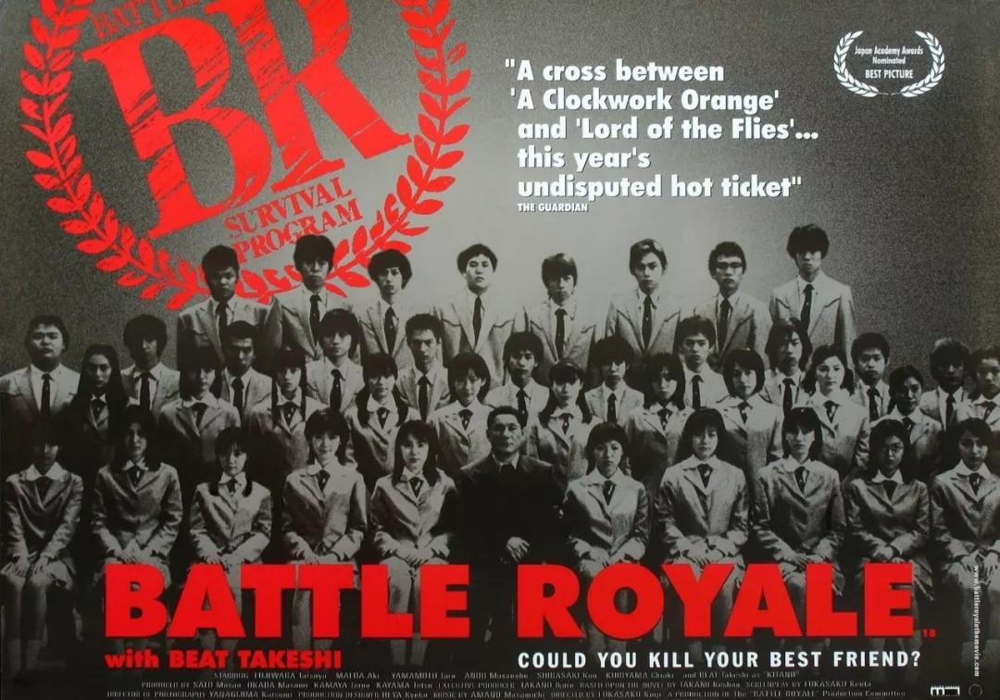

中国网络游戏历史上，也曾有两部经典作品：盛大《传奇》、巨人《征途》可以通过屠杀玩家而获得对方装备的设定在一定程度上也铸就了这两款作品的成功。但至今传奇和征途依然无法成为伟大的作品的原因也正是这两款游戏中所构建的虚拟社会比真实世界更为糟糕，加之围绕这两款游戏直接导致现实世界玩家间发生了真实的血案，使得盛大和征途难辞其咎。

如果单纯从道德角度审视，信奉「从心创造快乐」的腾讯互娱过去17年里，从未代理或独立研发过任何存有类似「作恶」倾向的游戏，但唯独《PUBG》成了17年来的第一个例外。

为什么要选择绝地求生？

单从游戏类型角度看整个中国手游市场，在2017年吃鸡手游上线前占据端游时代高达20%以上市场份额的FPS射击游戏成了为数不多没有被彻底开发出潜力的大蛋糕，而端游方面“大逃杀“模式的意外走红使得手游开始有了一个新的指引。于是在王者荣耀彻底统领MOBA类作品后，围绕「吃鸡模式」的作品让网易和腾讯在FPS类型方面发生了又一轮的较量——网易自研团队在第一时间开发并采用了2016年才发布的搭载Messiah引擎FPS作品的《荒野行动》，而腾讯方面则通过代理并与韩方合作开发了蓝洞工作室端游《PUBG》的正统手游续作，双方合作形式为蓝洞负责美术和端游版的全套体系，腾讯负责手游端的技术支持和手游端的体验优化+手游的代理发行与运营。

但IEG方面忽略的一个问题，是此时不同于2008年入股拳头工作室后继而直接在华代理发行《英雄联盟》时所产生的出其不意，今次蓝洞与腾讯合作的《PUBG》是全新且未知的手游版（蓝洞此前也未推出过便携版《绝地求生》），由于细节体验和实际运行中存在诸多的不成熟和不确定因素最终倒逼腾讯再次动用了赛马制——天美vs光子，上线全军出击和刺激战场两个版本除了通过扩大市场反馈面加速细节优化、用户体验外，更重要的是对大逃杀系列赛道中其余对手的饱和打击。但也正是上述原因，使得《绝地求生》面临《怪物猎人：世界》相同的遭遇：代理作品的手游移植和优化需要时间，但IEG的渠道发行、市场甚至竞对显然没有，也不可能留给两款作品过多的时间。

于是2017年10月28日，让IEG最担心的一幕终究还是发生了——网易的吃鸡作品《荒野行动》抢在《绝地求生》前率先上线公测，而此前来自西山居同样打出吃鸡概念的《小米枪战》则于更早的4月6日完成上线，IEG的两款作品的上线时间位于2018年的2月9日，光是比网易就晚了整整104天。

关于产品上线抢占先机重要与否的问题，完全可以体现在此前腾讯另一条核心赛道的争夺战上：

由于微信张小龙团队的产品明显晚于由洪锋、KK黄江吉亲统的米聊团队，且两者之间存在42天的时间差，最终导致腾讯在2011年曾集全公司之力与小米进行了长达6个月的拉锯战， **当中腾讯甚至通过不惜出卖彼时的核心资产——QQ所在SNG事业群的利益而直接为微信产品输血的形式，** 逐渐完成了对米聊从追赶-追平-超越的全过程，但这6个月也成为腾讯自1998年创办以来从未有过的惊险与空前的恐慌——今天仍有好事者假设当时的小米再强一些，张小龙团队多犯一些错误，中国移动如若乘机发难全面阻挠，甚至QQ没有介入微信与米聊竞争的情况下，事情是否就会是另一个样子？

毫无疑问，两款吃鸡游戏间长达104天的时间差已经为网易留下了充足的时间来打磨产品并抢在PUBG上线前彻底占据市场。面对老对手，IEG无法使用资本、流量武器的情况下，面对PUBG还未上线就已经近乎败局已定的危机时，“恐怖之王”掀起了一场以迟滞《荒野行动》市场进展速度，进而为PUBG赢得时间的全面进攻。

**「西山居发动了自杀式攻击！」**

彼时相关部门针对“大逃杀“类型手游召开了全行业讨论会，其中一位参与了上述会议的业内人士向「朱思码记」透露， **作为国内第一款吃鸡手游的开发商，西山居方面在会上极度反常的主动提出了关于吃鸡类手游存在一定政策风险问题，而愿意和全行业一道暂时下架整改相关作品的意向，而这种近乎自杀式的提议竟然很快得到了来自腾讯（旗下《CF手游》，《光荣使命》中也存有大逃杀玩法）在内的多个厂商的支持。** 尽管此次事件并非腾讯主动挑起，但西山居已于2017年4月21日接受了来自腾讯1.43亿美元的战略投资，与盛大一道成为腾讯战略合作伙伴的事实毋庸置疑。

那么，上述所谓「自杀式攻击」的背景是怎样的？

「当时我们是和Steven马（马晓轶）一起去开的会，网易方面去的人是Ethan王（王怡，网易游戏副总裁），那时荒野行动还没有版号，但我们是有的，而他们上线后的广告投入预算我们预估每天都在1000万元以上，而我们前期投入的预算总共只有几百万，前几个月小米枪战的用户量还是可以的，但后来确实不是网易的对手。」来自金山方面的一位朋友向「朱思码记」坦言，他无法告诉我们会上更具体的情况，但他承认当时的氛围 **“确实是要和腾讯联手对付网易”** 。

无论情况如何，最终结果是上线长达半年的《小米枪战》在《荒野行动》上线不久后就与其对手同时被下架。腾讯的资本武器在国内市场所达到的战略合围态势，显然又一次起到了决定性作用，为PUBG赢得了宝贵的时间。

而在另一条战线上，IEG的渠道优势在此后的时间里将《荒野行动》逼上了绝路，并最终将其赶出了中国市场。来自网易互娱的一位朋友向朱思码记描述了当时的情况：

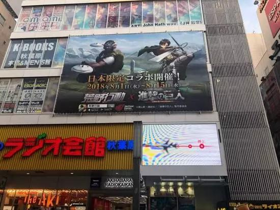

「他们的封堵围绕两个方面展开。第一个方面是中国所有主流电竞直播平台上关于《荒野行动》的评测在第一时间都被做了一轮疑似降权处理，原本其所在专区的名子被改成了“吃鸡手游”，而在腾讯《绝地求生》上线后，这些专区又改名成了“绝地求生“，并又单独给荒野行动开了一个专区以示公平，同时也曾有游戏播主向我们反应《荒野行动》的直播间一旦人气超过10万就会触发黑屏机制。第二个方面，是腾讯采购了所有能够买到的广告位，一度让我们无广告可买，而在QQ群聊时，曾经有短暂出现过聊天中打出荒野行动的关键词后便会弹出CF广告的情况。

当然，他们的封堵只是外部的问题，我们在这104天时间里自己内部也要负很大的责任，面对这样的巨无霸的对手时，我们无法调集全公司资源来打仗是丢掉市场的一个重要原因，另外在线上推广活动，手游端细节体验方面，地图更新和细节处理的不到位也是核心因素之一。」

随着刺激战场和全军突击的上线，以及《荒野行动》在日本市场意外的走红，腾讯与网易的吃鸡大战算是告一段落。尽管腾讯不出意外的迅速拿下了国内FPS手游96%以上的绝对领导地位，但天灾无法避免。

毫无疑问，PUBG版号未能被批的核心原因，除了游戏本身存在一些“作恶”倾向的内因之外，来自国际形势的突变 **（-  .... .- .- -..）**是其不容质疑的内因。而在近些年里上述问题已经成了诸多企业无法预测也无法抵挡的“黑天鹅”，且这样的案例并非首次，就连腾讯、阿里、网易也不例外：

* 2006年，网易开发的《梦幻西游》曾经因为在游戏中一栋建筑物里闪现了一个貌似日本旭日旗的图案，伴随着彼时中日因钓鱼岛领土争端事件的升级，而遭到了来自玩家在线上的集体抗议并引发了一系列的围绕网易公司和玩家关系的冲突。

* 2014年，阿里巴巴旗下速卖通平台的阿根廷国家馆突然遭到了来自阿政府方面的采取带有“强烈贸易保护主义色彩”下的跨境电商限制性条例，而致使阿根廷国家馆几乎停罢；同年乌克兰内战爆发卢布危机，ISIS横行中东，也使得速卖通俄罗斯馆和中东馆因战乱引发国际汇率突变，而速卖通采用美元而非当地货币的结算方式下使其遭到订单和成交额的双重打击。

* 2013年，由阿里聚划算发起的德国大闸蟹团购案，却因为没有向国家质检总局和德国官方提出进出口申请，及相应的大规模检疫检验报告而被迫下架，致使阿里方面全额赔偿900万元用户货款，同时额外补偿用户高达300万元的赔偿金。

当前，手游端两款PUBG在无版号情况下的持续亏损运营（只能保留广告等其他收入），加之此前端游作品《怪物猎人：世界》的永久下架处理，重创了前期投入巨大且商业化前景极佳的两款作品。伴随着短期内游戏收入的突然下降，以及2018年中概股在全球范围内无法预料的全面走衰，股灾成了不可能避免的现实。

当中国游戏行业从群雄割据时英雄辈出的时代，到今天变成以腾讯为一超，网易、完美等多强组成的格局时。市场竞争的烈度已不如昔日，但上下游的生态系统却因为市场的畸形而经历了前所未有的冲击。

>  **不患寡而患不均，不患贫而患不安.** 季氏将伐颛臾

时间退回到3年乃至更早之前，彼时中国是一个拥有数千家CP存在但渠道相对有限的喇叭形产业，这也就意味着在同一类型中能够同时容纳的游戏数量是极为有限的，这就如同文娱产业分支之一的电影——有几十、上百本电影上映，但排片只有十几部，且这个底部的容积伴随着当局对版号的限制收紧而更为有限。

当时这些CP的平均规模在30～50人，他们的核心模式是自主研发，然后找渠道发行商的一套研运分离模式。但随着腾讯、网易的这类研运一体化的平台存在，导致结果便是：

* 研运分离状态下，渠道拿走50%，代理扣掉35%（广告费占比15～20%不等），CP至多拿走15～25%。

* 研运一体状态下，80%以上的利润都是网易、腾讯的。

由于利润不足以支撑多则几年少则1年的独立研发工作，使得大量的CP死亡，导致今天出现了两极分化——

* 第一类个人开发者，化整为零的做游戏后交给类似椰岛这样的独立大CP发行，开发者然后赚钱几万至几十万不等的少额报酬，其余大头的利润归CP。诸如2018年火爆Steam平台的《中国式家长》便是出自椰岛之手。

* 第二类是成体系的大CP，例如2018年利润超过8亿元的乐元素就是选择与腾讯合作，或者选择与手机厂商诸如OPPO,VIVO,小米等厂家供货，这类模式利润在几千万至几亿不等，数量只有几十家。

不幸生于垄断者缔造的穹顶之下，但倘若能够争取到这些来之不易的利润其实也并非无路可退，但偏偏当前这些大CP们收入依旧做不到稳定。

来自国内一家知名CP的投资方向「朱思码记」坦言，当前腾讯针对国内这些CP所打造的“极光计划”本是希望能够像腾讯其他业务一样开放自己的微信、QQ流量，以能力和资本来为行业做出一些贡献，但游戏赛道不同于腾讯在电商、本地生活、出行服务中的存在的己所不能，身为绝对的垄断者——类似的这种开放仅仅只是出于节省IEG整体研发成本的角度考虑，毕竟面对SLG，三消，跑酷这类中小型市场，其自研未必会比乐元素、乐动等公司做的更好，因此将流量资源给到这些特殊类型的CP，成为他们的代理方并分得大部分利润，其实相比自己动手打击要来的更高效。

而在上游的另一条战线上，网易为首代表的游戏公司当前也在一家腾讯独大的情况下临着前所未有的变化。

「今天连网易的研发模式都因为腾讯的强大而出了问题。他们2～5年的研发周期，然后把游戏送上去2周收回成本，再一个半月挣钱，再被腾讯迅速干趴下，随后消失——《易水寒》、《楚留香》都是这样。这还是一家游戏该有的样子吗？他不是说要长期运营的吗？对于丁老板来说，可能他不是特别在乎这个，毕竟网易做那么多年游戏还能不被腾讯灭掉，还能赚钱就已经很不错了。但网易今天和那些大CP又有什么区别呢？”

国内一位知名投资人指出，由于这种喇叭口型的畸形市场导致新游戏不断追求更新速度，使得创作开始沦为一种对市场的收割，而收割追求的是时效、效率、成本最低。他直言，如果中国游戏赛道继续被压榨，控制到没有利润空间和希望的时候，结果便是视为游戏灵魂的创作者们的退出市场——因为中小公司今天已经几乎都垮了。

同属于文娱产业的漫画行业，当前由于用户媒介性质的变化，导致了创作出无数经典作品的漫画大国——日本，今天正面临着这种断代，导致日本代表性的漫画IP动辄也都是20～30年前的作品。而当游戏创作人才的凋零发生断代时，其结果便是中国游戏产业制作水平的整体下降，大集团出于利润考虑而不得不依靠大量进口——一切又回到17年前。

所幸的是，今天中国仍然还有一批真正爱游戏，真正懂游戏的人，还在中国的某个角落默默坚持创作的理想主义者。这让人不禁想起了19年前中国互联网产业腾飞之年，盛行COPY TO CHINA的节点，人民日报有过一篇题为《免费软件饿着肚子挥洒冲动》的时评让人潸然泪下，当时写的就是做出Foxmail的腾讯总办高级副总裁张小龙。

但理想当不了饱饭吃，如果张小龙和腾讯在今天算是互相成就的典范，那么理想主义的游戏开发者和巨头之间关系也应如此。

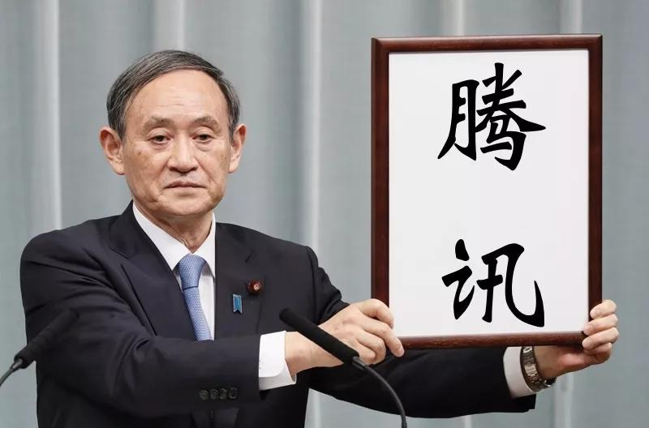

PUBG和怪物猎人的遇险的背后，是腾讯这家全球最大游戏公司在长期高速运营过程中所有面临一系列问题的爆发。

如果当前抛开企业社会责任与道德评判，单纯以业务和行业角度看腾讯互娱时，今天又面临着什么问题？

*  **游戏业务原本为了提升竞争力而提出的产品模型和赛马制似乎与赤裸裸的利益分配画上了等号**

来自腾讯IEG的一位前作伙伴向「朱思码记」激烈的描述了与其合作中的不愉快：

「我们作为他们的合作伙伴是最有发言权的，无论对自己人还是对合作伙伴，他们都是20多条维度进行评估，时间是2～3个月对作品进行考核，然后通过这2～3个月的表现结合这套模型算出你的作品能给他们带来多少利润，如果算出的结果是这个作品没有后选另一个赚钱，那么这个游戏就要下掉然后停止运营，我认为这是一套极度野蛮的做法——如果腾讯以自己收入最大化作为核心指标，那么我想反问一句： **世界上收入最高的游戏，就是玩家最喜欢，用户体验最好的吗?10W+一定都是好文章吗？**

**腾讯是** **一家没有情感，甚至没有灵魂的游戏公司，我承认他们非常努力的在做优质内容，我承认他们做游戏很赚钱，但是他们的这套做法其实伤害了创作者本身，因为在这套模型面前是不需要人性的，他们的这条模型可以掐死赚钱不多的作品，然后把更多的资源投入到更赚钱的作品身上** 。」

而关于腾讯赛马制的问题，来自腾讯公司的战略合作伙伴——来自可口可乐公司，旗下美国第二大功能饮料品牌“魔爪”中国的一位朋友向「朱思码记」叙述了他们的遭遇：

「在2017年，我们进入中国市场后非常希望和腾讯旗下的新作《绝地求生》合作，因为作品里刚好有能量饮料作为虚拟物资，所以觉得这是一个非常好的展现。而当时腾讯天美工作室群因为王者荣耀的大卖而爆红，于是我们基于这种品牌认知下选择了与天美达成了千万级的广告合作。但是绝地求生采取的是赛马制，于是我们就亲眼看着喝着‘友商’饮料的《刺激战场》跑赢了天美。」

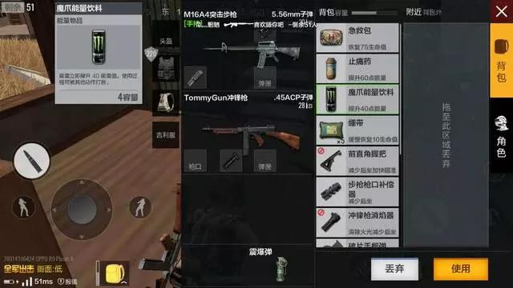

显然区别于全球其他游戏开发商的一个核心点，在于腾讯互娱的全球霸主地位，这使得其当前所面对沉重的KPI压力而最终不得不忽视作为创作者或创者团队的个性表达，这也导致作品发生流水线化生产，但实际水平并没有提升，甚至下降。即使诞生过王者荣耀之后，腾讯的自研游戏仍然没有找到特别强势的方法论。

关于创作表达的定义方法通常为两个条： **问作者到底想做什么，作者准备怎么做。** 但在腾讯互娱方面，收入最大化显然是比创作者表达更为重要的东西，因此我们可以经常看到腾讯某游戏突然停服的新闻，以及类似诸如「王者荣耀」团队获得天文数字年终奖的新闻，但其公司乃至外界似乎刻意忽略了默默做出同样优秀的「全民超神」，和「全军突击」的那两支团队，而赛马中两组人之间的真实关系甚至是同一家公司，同一个部门的同事，只是因为赛马而成了不共戴天的对手——原因仅仅是另一方做的不够赚钱。

*  **发行和投资的平台模式随着腾讯互娱规模的过载而面临天花板，研发能力并没有因为投资而获得提升**

盘点当前世界游戏行业的排名共有三种，收入排名角度看：腾讯，索尼，苹果，微软，暴雪，网易名列一至六。而从游戏开发商收入角度看：暴雪，网易，EA名列前三。最后从游戏公司的研发规模看：网易，育碧，暴雪名列前三。

根据上述三种维度排名后，综合分析得出的结论即是：腾讯收入巨大的背后必须不断的依靠投资去圈住更多的CP，然后在获得这些作品中国代理权的基础上通过市场的垄断地位，最终采取包括雪藏在内的一系列手段助推利润最高的作品进而赢得足够大的收入。

这仿佛意味着腾讯如果在未来没有投入更大规模的自主研发的决心，则可能需要将除竞争对手外全球所有类型优秀CP投一遍才能完成长期统治的稳定，且在年复一年内容的新陈代谢中腾讯必须保持不断的投资新的CP能保持其优势，但这样做的坏处是短期产生的利润却会随着对外投资规模的不断扩大，内容开发商的此消彼长而导致利润摊薄。

纵观腾讯互娱17年历史中历次面对凶险的境遇，除了2002年孙宇杨团队研发QQ游戏，2015年姚晓光团队开发的王者荣耀两次外，其余几乎都是依靠刘炽平出手下通过战投完成的力挽狂澜。这等于又回到了2018年那个关于“腾讯是一家投资公司还是业务公司？”的老问题。

研发能力永远都是一家游戏公司的安身立命之本。

**放在眼前的反面案例，是当年被腾讯「四大名著」和《英雄联盟》各个击破的上海滩六大网游公司——他们就是一群依靠代理发行，热衷赚快钱，后期奉行资本运作，最终因为不思进取而坐吃山空的投机客。**

*  **海外市场是一场没有把握的全新战争**

当前腾讯IEG的渠道、运营、公关、发行等优势限于中国市场，而海外市场的渠道优势首先就被Steam这样的新兴平台所占据，因此对腾讯游戏的出海造成了严重的威胁。毕竟他们平台不需要投资内容开发者，也不需要去讨好或得罪任何人，只需要建立一套完善的评价推荐体系，然后一切由用户自主选择他们喜欢的游戏，商业模式仅仅只是正常按照25～30%的分成。这种类似音乐商店，应用商店的模式是中国这种依赖传统渠道平台和限定版号模式的噩梦——不巧的是，中国市场当前相关利益最巨者恰好就是腾讯。也正是因为上述原因，间接催生了腾讯互娱的远征。

所幸的是，PUBG海外版手游由于没有版号限制，腾讯方面运作数据表现良好，对于IEG来说总算有所收获，但腾讯在海外的强敌如林，其他赛道上诸如同微信面对的是facebook旗下的WHATSAPP，还有LINE，微信支付出海面对同样凶猛出海的支付宝，Apple Pay等等。

尽管我们看到腾讯在《怪物猎人：世界》事件中也希望通过同步发行，进而带动WEGAME平台的影响力，但由于Steam采取离岸模式，使得海外大作与独立作品更愿意选择Steam。而在手游端，苹果应用商店则同样扮演者一个优秀海外渠道方的角色。而腾讯WEGAME今后很长一段时间都将只限于腾讯代理+自研+其国内外投资合作伙伴旗下的游戏作品，其作品的数量类型的丰富度只能取决于腾讯投资规模的大小和密度。

即使腾讯代理了STEAM，其潜在的审查、监管问题也将是一个不小的挑战。对于腾讯来说，如果想要继续保持国内市场的稳定统治，除了全力阻击Steam在中国的扩张外，甚至在其在入华后凭借腾讯在本土强大的资源优势，乃至借助政策导向为武器使其退出中国市场外，几乎别无选择。 **（例如以前不久该平台出现“台独”内容游戏作为其发难的借口）**

平台优势一定能大于内容优势？答案是否定的。

业界最近的反面案例，是来自日本任天堂公司于2017年推出的《塞尔达传说：荒野之息》，该作品的卓越表现甚至带动了作为其独占平台——任天堂次世代家用机NS的销量。可见内容的力量，远远大于人的想象力，优质作品的独立研发仍然是一家游戏公司一切商业行为的原点。

*  **腾讯互娱长期做简化进而完成自下而上收割市场的策略带来的新问题是随着国内用户的审美升级而导致市场发生变化**

当前中国游戏行业有两种模式，一种是腾讯式流量漏斗来冲游戏的博众，一种是以网易为代表的靠游戏来吸用户的窄众模式。从战略上看腾讯的策略优势明显，至少当前用户带来的收入约等于3个网易之和还多，但长期问题是中国游戏市场即使无限下沉也会有到头的日子，据国内一家知名文娱投资机构的朋友称：在英雄联盟、王者荣耀、绝地求生前推算过中国游戏的人群渗透率低于5%，而今天王者荣耀和刺激战场两款游戏的用户量已经到了互联网用户人口基数比例的一个上限值。

因此游戏早期是一个高体验度、高前期投入，高回报的行业。但随着腾讯像淘宝教育中国人网购那样教育中国游戏市场，之后必然会发生的是类似消费升级似的审美升级，也就是从逐步从非重度向中、重过度，游戏会成为西方国家那样和看电影、逛街、吃饭一样的休闲方式，至少目前中国第一、二代玩家已经在往这个方向靠拢了，所以单纯靠用户规模取胜的模式将在未来越来越难，这就势必意味着更大的自研投入或是比自研规模更大的内容投资。

**
**

**但对于真正的垄断者而言，不要变化就是最好的变化。** **托拉斯和康采恩的使命就是要消灭这个世界一切的创新者。**

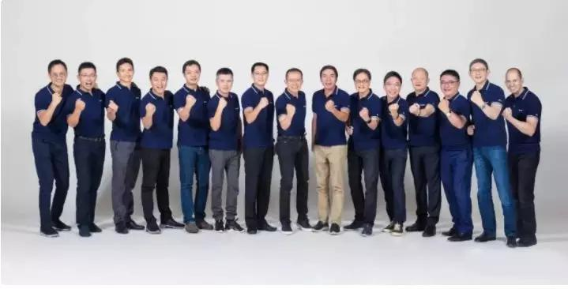

**    任宇昕（左六-Mark）挂帅PCG肩负打头条的重大责任，而** **马晓轶** **（左四-** **Steven** **）** **先于吕鹏** **进入总办，成了第三次架构调整后IEG方面的最火爆的人事热点**

一部游戏史，半部腾讯史。

回顾完中国游戏行业和腾讯公司游戏业务的历程，20多年一路走来，没有一帆风顺，只有亦步亦趋。

电子海洛因的说法，自游戏传入中国以来就笼罩在它的身上。面对游戏，中国家长鲜有与其有过互相信任，但至今他们仍习惯丢一个平板电脑，或者智能手机，让孩子自己去摸索——就如同个人电脑刚刚进入中国时的一幕极为类似。中国父母鲜有像国外家庭那样耗费如此之多的时间去带着孩子外出打猎，钓鱼，打球等各种互动，但只要中国家长的孩子在成长中出现任何学业上或者其他任何方面的问题时，游戏成了推卸责任最好的方式，腾讯为首的游戏公司也成了他们眼里的万恶之源：

**游戏本身不会说话，更不会向家长反驳。**

**
**

**腾讯亦不会反驳大众舆论，只会虚心听取意见后默默作出改进。**

上一个时代，因为玩游戏而延伸出来的网瘾治疗，电击疗法成了孩子的噩梦和时代的悲剧。直到今时今日，当年那群所谓“给了腾讯整条命”的小学生们已经逐渐为人父母，“当年的小学生”开始与自己孩子一起玩游戏，并挑选真正适合自己孩子的游戏时，中国游戏市场第一次得到了应有的尊重和认可，游戏也开始回归它本该应有的样子，腾讯作为身居幕后的推手确实功不可没。

上一个时代，由于政策以及社会大环境对电竞产业的打压和质疑，使得这些电竞运动员除了赛事奖金就再无别的收入，更没有其他的生活来源。选手们靠网店出售每个利润只有几毛钱的肉松饼、鱼豆腐而维持生计的画面历历在目。今天，我们看到从CF到LOL再到王者荣耀，PUBG等游戏的电竞从业人员越来越多的获得了本该得到的关注和经济上的收益，甚至今天IG站队夺冠成不亚于中国竞技体育选手为国争光的壮举一般。但这些利益与关注对背后，实际都出自那个愿意开放，愿意分享自己利益，但也随时愿意翻手为云，覆手为雨的帝王——腾讯之手。

上一个时代，由于彼时国内整体技术条件的落后，资金预算的捉襟见肘，以及中外企业实力悬殊所引发的关于代理与研发的挫折，使得羽翼未丰的腾讯不得不剑走偏锋，甚至采取一些被人诟病的借鉴方式，在通过产品赢得市场后才有了进行学习和不断自我提升的原始资本。这段经历就如同20年前第一版QQ后上线后，马化腾一度通过注册小号、造假资料，伪装成女生参与QQ线上陪聊的经历一样——看似好笑，但满是心酸与无奈。

今天，腾讯可以名正言顺的跟版权方谈判，甚至投资这些曾经自己一度高攀不起，当年曾把自己拒之门外，态度又无比强硬的海外游戏公司。仅凭其当前的行业地位，他们完全可以简单粗暴的Copy To China般没底线的运作模式，或是像SP系页游、手游开发厂家那样游走于法律边缘而大肆敛财。但腾讯选择了正道，选择去尝试合作与引进，选择耗费宝贵的时间成本为行业去创造一些先例，但又坎坷不断。

2019年5月8日，就在发布“科技向善”作为新使命的第二天，历时453天后《和平精英》接棒PUBG有了最终结果，腾讯还明确拒绝了16岁以下用户。但由于政策所迫下的对内容修改上锁做出的让步又问题让腾讯背上了来自C端玩家们的质疑和不解。

而防沉迷系统在王者荣耀在内的多款手游上也早已开始运行，虽然妈妈再也不用担心孩子的学习，但不知以后成绩下滑时爸爸是否又要怪罪抖音快手，或是其他新兴事物。几乎是在10年前的同一时间，介绍杨永信医生的纪录片《战网魔》正在央视热播，此时抨击对象还是“暴力游戏”——《魔兽世界》背后的无良代理方“九城”。

昨天，腾讯互娱出海方面也传来了好消息。PUBG手游版在最近几个月时间里席卷全球，《Arena of Valor》还在此前抢先登录了任天堂NS平台开辟多线作战。不过与此同时，Steam平台的入华也在紧锣密鼓的进行中，对于马晓轶来说这又是一场全新的战争。

此前，任天堂与腾讯正式宣布合作，腾讯代理任天堂旗下Switch游戏机开启了中国家用游戏市场的新一步。而接下来，关于玩家关心的国服商店，游戏审核，游戏内容引进在内的一系列新难题，则又抛给了腾讯：毕竟《怪物猎人：世界》的教训历历在目，前方的路依然如履薄冰。

**一个伟大的企业从不是其诞生下来就伟大的，真正伟大的通常表现在其成长的过程。游戏之王的名号除了实际取得的庞大利润，更多是其肩负的社会责任和行业担当，甚至是明天世界游戏产业的前途与命运，当然更重要的是无数海内外玩家的信任。**

**王者应该警醒勤勉，因为懈怠是奴仆的特权。**

**王者亦不辩，辩则损其威矣。**

**为王，无安宁。**

**只有那样，你的** **国度，权柄，荣耀，和半条命才是你的。** **即使天真的塌了，你的玩家也愿与你一同趴着。**

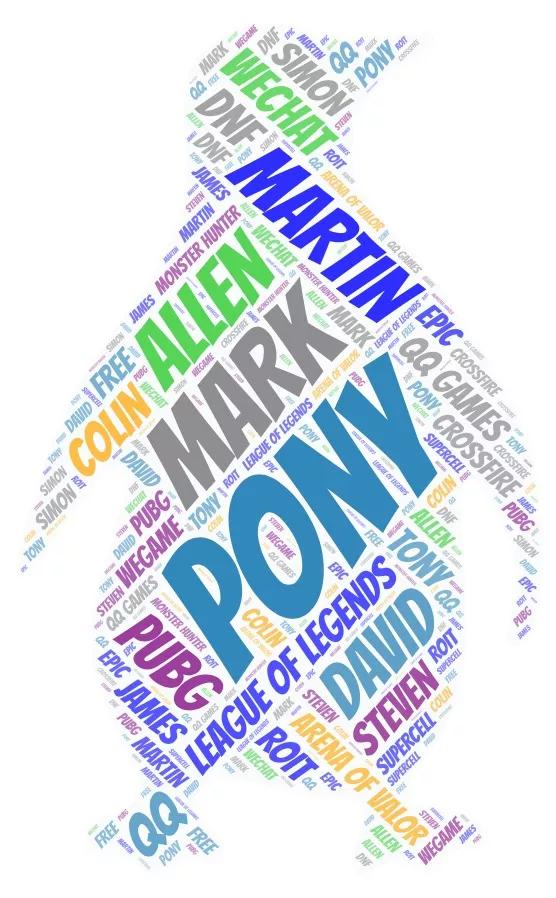

__

_部分参考资料：_

_《马化腾的腾讯帝国》林军 著_

_2017_ _年 Anu Hariharan  专访 腾讯CXO网大为访谈速记（英）_

_2017_ _年Slush  刘炽平与Supercell创始人伊尔卡访谈访谈速记（英）_

_2018年李学凌纪源资本GGV996播客节目访谈速记（英）_

_本文部分图片引用自网络来源_

_
_

_本文基于新闻专业主义和保护受访者角度考虑而全部采用匿名方式处理。内容均为采访录音素材整理而成，_ _部分内容为隐性采访。_

_
_

关注朱思码记  \(ID:zhusimaji88\)

▼ 商业调查系列▼

[战投之王：](http://mp.weixin.qq.com/s?__biz=MzI0MDUzNTk2OQ==&mid=2247484660&idx=1&sn=b7a80b5fa4759b94267f1b29da40ce54&chksm=e918143ade6f9d2c99568e8cbadc9e01d22e58ae44bdb6ced9556930b8a5a19786211b63779a&scene=21#wechat_redirect)[蔡崇信、刘炽平和刘德的精密战争](http://mp.weixin.qq.com/s?__biz=MzI0MDUzNTk2OQ==&mid=2247484660&idx=1&sn=b7a80b5fa4759b94267f1b29da40ce54&chksm=e918143ade6f9d2c99568e8cbadc9e01d22e58ae44bdb6ced9556930b8a5a19786211b63779a&scene=21#wechat_redirect)

[上海不相信互联网](http://mp.weixin.qq.com/s?__biz=MzI0MDUzNTk2OQ==&mid=2247484327&idx=1&sn=d2ecdbb650ae2f84deeb149fdda2ad50&chksm=e9181369de6f9a7f3ba5ba1b1754f89ac3bf36605bc050c9fedeb6124ead7142c36372b987bb&scene=21#wechat_redirect)

[拼多多，上市前的180天](http://mp.weixin.qq.com/s?__biz=MzI0MDUzNTk2OQ==&mid=2247484291&idx=1&sn=dbd45719e8b0a8c44933e4dd4840f87e&chksm=e918134dde6f9a5b234983ddd5213cf100fccbae2c9f166be50ba3800b672a209af65a233f91&scene=21#wechat_redirect)

[华强北矿难调查](http://mp.weixin.qq.com/s?__biz=MzI0MDUzNTk2OQ==&mid=2247484176&idx=1&sn=fd66e9507dc28baefcd9e68b6c3ac2b3&chksm=e91813dede6f9ac8d1a80634794fc30ff8fbbdf106511dea1d25c3f71e2c62e8b9d8bf99a13c&scene=21#wechat_redirect)

[淘宝网宣战拼多多，谁抄了阿里巴巴的后路？](http://mp.weixin.qq.com/s?__biz=MzI0MDUzNTk2OQ==&mid=2247484058&idx=1&sn=785c2274e2297bb0b70a78736abf8b95&chksm=e9181254de6f9b4278b13278e4517e4b302aa4a65d3686decedbf7ba878312f8c2fd6ae4328b&scene=21#wechat_redirect)

[创业坟场](http://mp.weixin.qq.com/s?__biz=MzI0MDUzNTk2OQ==&mid=2247483906&idx=1&sn=7a2f19a26a9c18a4f9527b4b00f4248d&chksm=e91812ccde6f9bdaff53ec22dcd745f115fcf60e00dfe4ba60b681b65478fdf8adfc48d2eb8f&scene=21#wechat_redirect)

「限时推广」

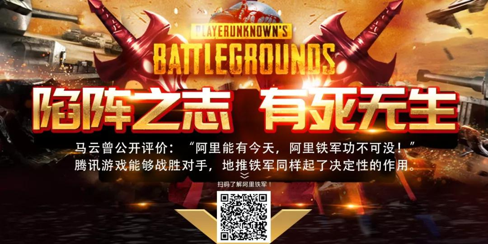
