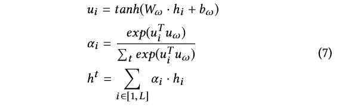

## AI首次实现秒级“自主判案”！阿里达摩院颠覆性研究成果技术解读  

> 原创：  
> AI前线小组 译  
> 发布: AI前线  
> 发布日期: 2019-06-30  

 论文作者| Xin Zhou，Yating Zhang 等  编译 | 吴少杰  编辑 | Natalie  **AI 前线导读：** 近日，阿里达摩院发布了一项新的研究成果：针对电商交易中出现的纠纷案件，可以借助 AI 实现秒级“自主判案”。该项成果已经入选顶级会议 SIGIR。SIGIR 组委会认为，阿里巴巴的这项技术是司法智能领域的一项开创性成果。该项技术用到了最近比较热门的多任务学习，本文是 AI 前线第 83 篇论文导读，我们将对这项研究工作进行详细解读。

**更多优质内容请关注微信公众号“AI 前线”（ID：ai-front）**

介    绍

近几十年来，随着信息技术的飞速发展，电子商务一直保持蓬勃发展的势头，已成为世界最具活力的经济活动之一。截至 2018 年，电子商务在全球零售总额中所占的市场份额已经增至 11.9%。随着数以十亿计的在线交易发生，不可避免地，涉及新技术的业务交互增加，产生了新类型的纠纷。例如，根据世界领先电子商务平台的年度报告，2017 年在线提交的纠纷超过 2000 万件，而且在纠纷解决和潜在诉讼中通常存在高额成本和延误。在电子商务生态系统中，买卖双方需要高效、低成本的调解和仲裁服务。从法律的角度来看，当用户对在线争议解决（ODR）的结果不满意时，他们需要做出关键的决定，决定是否应该提起令人费解的昂贵诉讼来保护自己的利益。很明显，大多数买家负担不起聘请具有法律专业知识的专业人士帮助他们赢得诉讼的费用。

在此背景下，预测电子商务诉讼案件的判决结果是有一定价值的，它可以为客户和企业主提供权利 / 公平的法律保护。在这些努力的背后，最大的挑战在于难以准确地表示诉讼案件，这些案件在语义上可能存在差异（如当事人姓名、交易过程、涉及的商品），但在电子商务生态系统中具有相似的法律逻辑推理。此外，电子商务诉讼案件的历史数据相对稀疏，使得其背后的审判逻辑更难以自动学习 / 表现。

与传统的法律程序相比，ODR 为通过电子商务平台解决索赔或者纠纷提供了一个重要的替代方案。ODR 完全可以在互联网上以低成本、高效率和时间地理灵活的方式完成，以满足每天发生的大量网络纠纷或电子冲突的需求。如果买卖双方对结果满意，他们就不必诉诸法庭，开始法律程序。然而，目前没有统一的标准或者正式的 ODR 方法监测系统。争议的裁决是根据经验做出的。如果案件最终仅仅是基于个人管辖权决定的一个实际问题，那么 ODR 的优点就丧失了。

据我们所知，这项工作是电子商务法律情报的首次突破性成果，对保护电子商务生态系统中消费者和卖家的法律公平和利益具有重要意义。与以往的产品分类和推荐工作不同，本文提出了一种多任务学习的端到端的模型，将诉讼判决模型与争议解决模型联合训练。此外，该模型能有效地解决诉讼数据稀疏的问题，而 ODR 任务则能在联合学习过程中提供关键的法律信息。

综上所述，本文的贡献如下：

（1）提出了一个新的法律智能问题来解决电子商务纠纷；

（2）提出了一种有效的方法来量化诉讼案件，利用多视角的纠纷陈述。

（3）该模型能够挖掘诉讼背后的逻辑推理，解释诉讼事实和判决的因果关系。

（4）评估提出的模型在超过 6858 个诉讼案例上，在上亿的纠纷数据上进行训练。实验结果说明提出的方法明显能提高诉讼案例中判决预测的 Micro\_F1 和 Macro\_F1 得分。

预    备

这篇文章研究的目标是：在电子商务中，能够自主做出诉讼中法律判决预测。本文提出的创新方法是利用多任务学习，它能在 ODR 和法律情报方面，联合学习四个分类任务。实际上，当一个争议案件发生时，它通过在争议层面的推理任务，对争议的原因进行分类，然后，转发到预测争议结果的任务。当一个案例有可能进去诉讼层面时，首先根据认定的事实对其进行分类，然后，根据前面步骤中所描述的事实对其进行判决结果进行预测。按图 1 顺序处理四个任务，并假设争议的原因对于预测其争议结果很重要。它也表明了诉讼案件的事实，而确定的事实决定了判决结果。

图 1，LDJ 模型的网络结构

多视角争议陈述 3.1 观点

在电子商务生态系统，纠纷案件可能涉及三类信息，即交易、买方和卖方。从法律的角度，案件可以通过法律知识图（LKG）上的节点和边进行解释。至于内部方面，涉及两种类型的特征：元数据和文本数据。表 1 显示了从三个电子商务角度对争议表征所采用的特征。此外，作为法律表征，我们还涉及到以知识图谱表征的法律专家知识。图 2 描述了法律知识图的一部分。

**3.1.1 电子商务视角**

可以根据商品的数量和价格等交易信息来判断购买行为状态；商品的信息，包括反映商品质量的负面评论、推断商品当前所有权的物流状态、在线争议记录，记录买方、卖方和平台管理员之间当前交易的对话，以再现目标冲突。从买方的角度，根据它的历史购买和争议记录，我们可以指出买方是正常消费者还是专业勒索者。同样，卖方收到的信用、声誉和争议也可以被视为其信誉和所销售货物质量的指标。

理论上，交易数据可以反映客户提出的争议的原因，在诉讼过程中，也可以作为支持法官在做出最终判决前认定的法律事实的证据。同时，通过买卖双方数据进行的用户画像也是客户服务人员对给定争议作出结论的必要步骤。例如，如果目标卖家在历史上经历过许多由其他买家发起的类似纠纷案件，那么电子商务平台可能会质疑卖家的诚信，并有更高的机会得出有利于买家的结论。相应地，如果此案进一步进行诉讼程序，买卖双方的数据通常被视为法官构建当事人肖像和公认的法律事实以实现最终判决的重要参考。

**3.1.2 法律视角**

本文所使用的法律知识图谱（LKG）是由三个具有处理网上交易纠纷（OTD）经验的民事法院的七位法官生成的。基本上，LKG 是一个有向无环图（DAG），我们将没有链接的节点定义为源节点（c），没有外链的节点作为目标节点（r）。LKG 更像是一个本体论，描述了根据不同场景总结的常见 OTD 案件的审批要求。例如，如图 2 所示，电子商务欺诈案件可能发生在各种场景中：虚假价格、虚假促销、商品问题等。每一个场景还可以包含多个子场景。此外，将交易案件认定为欺诈行为的必要条件和不足条件是，目标原告（或买方）应被确认为真正的消费者，而不是专业的敲诈者。在这项工作中，我们把每个案例投射到 LKG 上，并且辅助案例表征将被用作提议的预测任务的另一个重要输入。

3.2 表征机制

对于每一种案例，我们有三种表征形式：离散的、词和法律知识图。我们根据它们的特征分别表示它们，然后将它们作为聚合特征连接起来。

**3.2.1 离散表征**

如图 1 所示，离散嵌入专门用于表征元数据。我们首先将连续特征（如数量、价格、信用）划分为离散区间。与其他分类变量（如类别）一样，我们将它映射到欧几里得空间，在欧几里得空间中，神经网络在标准监督训练过程中学习映射，类似于“Entity Embeddings of Categorical Variables”论文中的训练过程。通过在嵌入空间中相互映射相似的值，有助于揭示分类变量的内在属性。

**3.2.2 词表征**

我们使用 Skip-gram 模型来训练词向量。与词嵌入类似，字符嵌入也由相同的 Skip-gram 模型来训练。然后将字的字符嵌入向量序列送入双向 LSTM。最后的字符表征是通过连接前向和后向最终状态获得。使用字符嵌入可以有效地提供形态特征。每个单词的最终词表征是单词和字符嵌入的连接。

**3.2.3 LKG 表征**

为了通过 LKG 对法律知识进行探讨，提出的方法将目标案件投射到 LKG 上的多个元素上，然后通过知识图上所有元素的概率分布来表征案件。对于输入争议描述文本中的每个句子，我们计算出句子文本与源节点（c）上的文本之间的语义相似性，并以每个源节点（c）的最大值作为争议案件对 LKG 的初始投影，汇总所有输入句子的得分。

我们把每段文字看作一组单词，然后计算两组单词之间的平均相似性。

其中，两个单词的相似度是通过其嵌入词的余弦相似度来计算的。n\(c\) 和 n\(s\) 分别是节点 c 和句子 s 的单词数量。

利用公式 5 中的激活函数，靠近源节点的法律知识可以传播 / 聚合到更高级别的节点。我们使用了自下而上的设计，源节点与更详细的法律知识关联以进行分类。

其中，a\(i,in\) 表示节点 vi 总共的激活能量，N\(vi\) 是 vi 的链入邻居节点的集合。a\(j,out\) 表示节点 vj 连接节点 vi 的输出激活，w\(ij\) 表示节点 vi 和 vj 连接的权重。d\(0<d<1\) 表示一个全局的衰减参数，为了惩罚在长路径上激活的迁移。在这个实验中，我们设置 d 为 0.85。

相似性得分的传播是一个深度优先的迭代过程，从源节点到目标节点，通过有向图上的加权边。图上每个节点的最终得分在被视为当前情况的 LKG 表征之前被归一化。

法律纠纷判决模式

本节描述了提议的法律纠纷判决（LDJ）模型的推理过程。提出的多任务框架如图 1 所示。它有三个主要组件：嵌入模块、共享编码器和特定任务的解码器。如第 3.2 节所述，嵌入模块由三部分组成，离散、词和 LKG 嵌入，分别捕获离散特征、文本特征的语义意义和法律术语之间的语义关联。另外，对于每个电子商务视角，我们构建一个编码块来编码不同类型的数据，如图 1 的子图所示。所有任务在不同程度上共享三个编码器，以便学习共享的表征。在解码部分，我们利用任务之间的依赖关系来实现任务对之间的通信。

4.1 输入

文本输入以文档方式操作，其中 xt=\{s1,s2,...,sL\}是句子 L 的一个序列。每一个句子 si=\{wi1,wi2..wiT\}包含 Ti 个词，每个词通过词的嵌入来表征（参看 3.2.2 节）。离散的输入 xd=\{v1,v2,...vK\}是一个变量集，其固定长度为 K。LKG 的输入 xg=\{a1,a2,..,aN\}是如 3.2.3 节预计算的一个概率分布，它的维度 N 等于 LKG 节点的个数。

4.2 编码器

为了对文本输入进行编码，本文建议使用一个层次网络来捕获文本背后的文档结构，首先构建句子的表征，然后将它们聚合成文档表征。

**句子表征**

本文使用卷积神经网络（CNN）计算具有语义组合的句子的连续表征。CNN 的句子分类由于其简单性，近年来得到广泛的应用，即使是一个较浅的词级 CNN 也可以在广泛的文本分类任务中胜过深层和更复杂的 CNN 体系结构。CNN 的另一个优点是它在处理长文本时的鲁棒性，在这种情况下，基于 RNN 的编码器（如 LSTM、GRU）通常会遇到梯度消失。考虑到文本输入争议记录，客户倾向于使用长句子来描述案件本身的上下文，CNN 在这种情况下更合适。具体来说，使用 CNN 和不同宽度的卷积滤波器来产生句子表征。其原因在于，它们能够捕获各种粒度的 n-gram 的局部语义，这对于句子级别的分类任务来说是非常强大的。例如，宽度为 3 的卷积过滤器基本上捕获一个句子中的三元语义。

在本文提出的模型中，使用五个宽度为 1 到 5 的滤波器。除了 unigram、bigrams 和 trigrams 的语义之外，由于法律和电子商务场景中的词汇的复杂性，如命名实体、指控名称和商品名称，较大的宽度可以编码较长的 n-gram。每个过滤器都由一个具有共享参数的线性层列表组成，然后将它们的输出输入到一个最大池化层，以便从纠纷中冗长的倾诉中提取最重要的特征, 此外，还添加了 relu 激活函数并将多个过滤器的输出连接起来，以得到隐藏的表征形式，即句子向量表示为 si。

**文档表征**

在文档层面，与双向的 LSTM 相比，为了以更有效的方式总结相邻句子的信息，本文利用双向的 GRU 捕获句子之间的依赖关系。

hi 是连接前向和反向的结果。这样注释 h 总结了两边相邻句子的信息，而由于 RNN 更好地表示最近输入的倾向，hi 仍然关注当前句子 si。

在法律场景中，一句话的证据差异可能会改变最终的判决决定，因此法官在审判过程中也需要关注提交证据的关键要素。在这种情况下，本文在句子 / 文档分类任务中使用了一种注意力机制，以突出对整个判决结果可能产生影响的重要的信息片段，并将这些句子的表征聚合成文档向量。

其中，ui 是 hi 的表征通过一层的 MLP，u\(w\) 是一个随机初始化的正则因子并且在训练过程中联合学习。ai 是一个 sofmax 函数。我们计算文档向量 h\(t\) 作为句子的加权和。

**LKG & 离散表征**

为了对 LKG 和离散输入进行编码，我们将每个输入连接到一个具有激活函数的全连接层，其中，h\(g\) 和 h\(d\) 分别表示 LKG 和离散输入的隐层表征。

最后，我们连接三种类型特征的隐层作为编码的输出。

正如 3.1 节介绍，我们的数据来自三个电子商务的视角：交易、买方和卖方，因此我们构建了三个并行编码器分别来处理三个数据流。对于每个流，它包含三种类型的特征：文本、离散和 LKG，以构建如上所述的纠纷表征。我们让三个编码器共享一个嵌入模块。三个编码器（交易层 V\(T\)）的输出，购买层 \(V\(B\)\) 和销售层（V\(s\)）将会进一步输入到下游的任务中。

4.3 特定任务的解码器

正如第二节所述，这项工作中的目标是利用大量的争议数据来进行诉讼判决预测。因此，逐一描述子任务，并最终完成我们的主要任务。

**子任务：纠纷原因预测**

为了预测纠纷原因，我们使用交易层的输出作为输入，表示为 x\(l\)=V\(T\)=\[h\(T\)\(t\);h\(T\)\(g\);h\(T\)\(d\)\]。之后采用 highway 网络，以解决模型参数增大时训练困难：

其中，x 等于 x\(l\)，U\(.\) 是一个 Sigmoid 激活函数，C\(.\) 是 ReLU 激活函数。x\(l\)\* 输入到一个带单个 ReLU 层的标准的 softmax 分类器。对于每一个纠纷标签，它输出一个概率向量 y\(l\)。

**子任务：争议结果预测**

争议结果预测是在 REASON 层之上进行的。由于利用双方的历史交易和争议记录有利于达成争议结果的最佳协商协议，我们将交易层的输出进行叠加，买方层和卖方层以及 REASON 输出层作为 RESULT 层的串联输入，表示为 x\(2\)=\[V\*\(T\);V\*\(B\);V\*\(S\);y\(REA\)\]，其中，V\*\(T\)，V\*\(B\) 和 V\*\(S\) 是 V\(T\)、V\(B\) 和 V\(S\) 分别经过 highway 网络。我们定义带权重的 REASON 标签嵌入 y\(REA\) 如下：

其中，K 是 REASON 标签的数量，p\(y\(1\)=j|h\(1\)\) 是一个概率值，第 j 个 REASON 标签指定到当前案例上面，l\(j\) 是相关的标签嵌入。对于预测 RESULT 标签，我们利用相同的策略，通过 highway 网络来对 REASON 进行分类。我们利用单个 ReLU 隐层通过 softmax 分类器。

**子任务：诉讼事实预测**

诉讼事实预测是法官承认的法律事实，由于某些争议原因与一定的法律事实具有对应关系，因此，它隐含着与争议原因预测过程的关系。例如，假货问题和假冒品牌引起的纠纷，如果进入诉讼程序，更容易被认定为品牌侵权和假冒商品的法律事实。因此，为了预测诉讼事实的标签，我们将交易层和 REASON 层输出的连接作为输入，表示为 x\(3\)=\[V\*\(T\);y\(REA\)\]。我们也让它通过 highway 网络，然后连接到带有 sigmoid 激活函数的全连接层。与纠纷级任务不同，我们利用二分类的带有 sigmoid 激活函数的交叉熵损失作为目标损失函数。与 sotfmax 激活函数相比，该函数更适合于多标签的分类。二分类的交叉熵目标可以公式化为：

其中，C 表示标签数量，n 是案例数量。y\(ij\) 表示实例 i 是否分配了标签 j 的基本事实。

**主要任务：诉讼判决预测**

为了预测诉讼判决，我们将交易本身的信息（V\*\(T\)）、当事人的历史经历 \(V\*\(B\) 和 V\*\(S\)\) 以及上一步 FACT 识别（y\(FAC\)），因为判决是一种解释，即判决必须由 FAC 的结果支持。在这种情况下，我们将判决层的输入定义为 x\(4\)=\[V\*\(T\);V\*\(B\);V\*\(S\);y\(FAC\)\]。为了直接使用 FACT 层的输出结果，我们计算类似于等式 11 的事实分类任务的类标签嵌入。最后的特征向量通过一个 highway 网络连接起来，并送入 JUDGMENT 分类器，它是一个带有 sigmoid 的全连接层，输出类似于 FACT 分类器。我们用二分类的交叉熵损失来进行多标签分类。

训练过程分为两个阶段。首先，我们利用纠纷数据 REASON 和 RESULT 层，同时关闭 FACT 和 JUDGMENT 层，通过利用大量的争议数据来优化纠纷表征。然后，我们打开四个任务，使用诉讼数据对所有参数进行微调。我们根据经验将主要任务和三个子任务的损失权重分别设置为 0.6,0.2,0.1,0.1。最后的损失等于加权损失的求和。

实验设置 5.1 数据集

我们对两个数据集进行了大量的实验：一个是淘宝产生的历史电子商务纠纷数据，另外一个是最高法院提供的诉讼资料。注意，该实验是基于中国的电子商务和诉讼数据，但是，只有目标 LKG 和训练数据可用，该方法可以推广到任何其他国家和电子商务平台。两个数据的详细描述如下：

**纠纷（ODR）数据集**

我们收集了来自 46 个争议原因和 3 个争议结果的 40 万份历史纠纷记录。最常见的纠纷是质量问题、订货错误、退货和换货以及错误的产品信息。有三个纠纷结果，即退款和退货（卖方应退款，买方应退货）、拒绝（争议请求被拒绝）和仅退款（当买方因交货问题未收到产品时），因此只要求卖方退款。据我们所知，很少有公开的电子商务数据集可以用于纠纷或法律相关研究。

我们发布所有的实验数据来激励其他学者进一步研究这一新颖的、重要的问题。为了打破语言障碍，解决隐私问题，我们将所有的文字和标签转换成索引，我们还提供了基于几百万份争议记录的预训练的词嵌入。

**诉讼数据集**

诉讼数据集是从“中国判决在线”网站上获取的，最高法院在该网站上发布了判决件，并可在网上公开获取。通过关键词搜索（如“淘宝”、“民事案件”、“网上纠纷”等），缩小了与淘宝纠纷有关的网上纠纷案件的范围。我们总共收集了 6858 个案例。对于每一个诉讼案件，判决文件中出现的交易 ID 可以用于定位目标争议交易及其在 40 万淘宝 ODR 中的相应纠纷记录。

这种方法很有效，因为大多数原告在提起诉讼之前都在淘宝平台上进行 ODR 流程。由于判决文件遵循模版，在分类任务中，我们利用正则表达式提取案件的法律事实和判决结果。有 7 种判决，即退款、损失赔偿、三倍赔偿、十倍赔偿、单次赔偿、全部拒绝和平台连带责任。有 15 种诉讼事实，其中标识问题、非法添加剂、无证生产和夸大虚假宣传是最流行的。纠纷数据和诉讼数据的联合数据集可以在项目站点找到。

5.2 训练细节

Word2vec 用于预训练单词的 embeddings，然后用于初始化模型的嵌入。如第 5.1 节所述，词嵌入在百万纠纷记录上训练。字、词和区分的嵌入的维度分别是 100，50，10. 我们使用多个窗口大小为 1、2、3、4、5 的过滤器，输出大小为 32、32、64、128、256。用于基于 CNN 的句子 encoder。GRU 的维度设置为 100。在这种情况下，前向和后向的 GRU 组合为文档注释提供了 200 个维度。基于这些设置，我们使用学习率为 0.001 的 Adam 优化器来优化提出的 LDJ 模型。进行最小批量梯度下降，批量大小为 64，共 50 个 epochs。

结果讨论 6.1 评价指标

我们使用 Micro\_F1 和 Macro\_F1 作为评估主要任务结果的主要指标。宏平均可以独立地测量每个分类，然后取平均值（对所有类进行平均处理），然而，一个微平均值能够聚合所有类的贡献来计算平均度量。在多标签多类别分类设置中，如果存在类别不平衡，micro-average\(微平均\) 是合适的。

6.2 基线

由于我们没有找到先前的工作来对法律判断进行多任务学习，因此我们通过与几个最佳的单任务的判决预测相比较，对该模型进行了评估。在测试模型中，使用所有提出的 viewpoint 特征。

**传统的机器学习方法**

BSVM（BOW）和 BSVM\(embed\) 是两个多标签分类方法。前者使用 uni-grams 的词袋模型来做文本表征，而后者利用同样的词嵌入如同本文所提出的一样。每个标签可以被认为是一个二分类问题，然后，ranking 机制被二分类的 SVM 分类器所利用。为了利用纠纷数据集，我们还通过自动标记纠纷案例进行自我训练，用半监督设置测试了上述两个基线。

**基于深度学习的方法**

在这一部分中，我们构建了几个深度学习技术的组合作为基线，以验证所提出模型中使用的每个组件的有效性。TextCNN\_GRU 使用卷积网络作为句子表征，为了对比我们模型在文档级别的表征，我们为文档添加了 bi-GRU 解码器。GRU\_GRU\_Atten 是一个为文档分类的层次的注意力网络，它使用 bi-GRU 作为句子和文档的编码器，attention 机制来应用强调信息块的重要性。Bi-LSTM\_GRU\_Atten 构建文档模型，它通过带门的循环神经网络和基于 bi-LSTM 的句子编码器和基于 GRU 的文档编码器。TextCNN\_GRU\_Atten 被认为是我们的子模块但是它是一个单任务学习框架。以上四个基线均采用交叉熵损失进行多标签分类。

6.3 总体性能 **比较基准**

所有测试方法的性能报告在表 2 中。从结果中我们观察到：

1. 传统的方法在所有的评估指标中表现并不好。

2. 与两个基于 SVM 的方法相比，半监督方法可以明显提高 Macro\_F1 得分 18.2%。

3. TextCNN\_GRU\_Atten 击败了其他三个基于深度学习方法，在大部分评估指标上。这边表明了 Attention 机制的有效性。对本文所提出的模型 TextCNN\_GRU\_Atten 被视为最好的 baseline。、

4. LDJ\_Multi\(Fact+Judge\) 被设计来联合学习诉讼事实和判决，通过纠纷数据来联合训练。它超越了所有最好的 baseline。这个说明了多任务学习框架的有效性。此外，当进一步输入纠纷数据并与所有四项任务共同学习时，LDJ\_Multi 在最佳基线上具有统计意义。

**每个多视角点的有效性**

为了获得不同多视角点的贡献，本文分别对最佳基线和最佳提出的模型进行了消融实验。表 3 报告了所有特征何时训练和除了特定特征外的所有特征何时训练。请注意，由于交易数据是纠纷案件的基本要素，因此本文主要测试其他观点的重要性。根据表 3 所示的结果，所有特征集对结果都有积极的贡献。具体来说，买方和卖方的特征影响最大。它们的删除导致单框架误差（RIE）增加 45%，多任务框架（RIE）增加 7%，而视点 LKG 在多任务框架（10% RIE）下的影响比单任务框架（2% RIE）的影响更大。

**电子商务纠纷数据使用的影响**

在这一部分中，本文提出了争议数据使用量的增加对诉讼判决预测效果的影响（见图 3）。从下图可以看到，我们的多任务框架训练时，只能通过相应的争议数据来实现相当有限的性能。然而，电子商务 ODR 平台上的大数据插件对于解决训练数据稀疏性问题，我们的多任务模型获得更好的性能，尤其是在 Macro\_F1 分数上（随着使用争议数据的增加，两条线之间的距离越来越近），这表明分类器在预测这些稀疏类别方面的改进。

**误差分析**

对于错误案例，70.8% 的错误来自诉讼事实预测。显然，诉讼事实预测是一项具有挑战性但又至关重要的判决预测任务。从学习的角度看，最容易混淆的标签可能是：（无证生产、标签问题、夸大虚假宣传等质量问题）。同时，我们发现，判断标签之间的语义混淆可能是另一个威胁算法性能的困难，例如，某些类标签可能以某种方式相似。为了在未来改进模型，研究可区分的特征或者增强法律知识图来区分与案件相关的事实 / 判决标签是一个有前途的方向。

结    论

作为一个跨学科的研究，在连接电商数据挖掘和法律智能这两个独立领域时，执行法律纠纷预测实际上是有用的。本文介绍了一种精心设计的多视角纠纷表征技术，并结合三个子任务，为诉讼判决预测提供了一种端到端的解决方案。经验结果验证了多任务学习可以提高性能超越了之前最佳性能方法。此外，从电商平台使用争议数据，证明可以大大提高司法预测的性能。通过结果和误差分析，本文展示了争议表征中各个方面的重要性，并期望为将来的工作发现更多可区分的特征。

本文彩蛋

在 AI 前线 后台回复关键词： **AI 判案** ，获取论文原文 PDF。

> 注：请在公众号对话框回复关键词，留言区回复收不到链接哦~
>
>  活动推荐
>
> 更多精彩案例请关注 QCon 上海 2019 ，内容涵盖大数据、架构、移动、微服务、工程效率、运维、前端等经典方向及 Cloud Native、中台、图数据库、下一代计算等新兴方向。目前早鸟 7 折报名最后一周，点击 「 阅读原文 」或识别二维码立刻上车，有问题欢迎联系票务小姐姐 Ring，电话：17310043226，微信：qcon-0410。
>
> 

* * *

**你也「在看」吗？** ****👇
