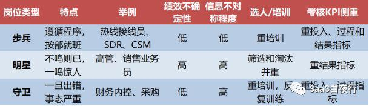

## 从管理会计看SaaS企业经营的真相（下）|SaaS创业路线图（48）  

> 发布: 吴昊@SaaS  
> 发布日期: 2019-06-04  

编者按：本文来自微信公众号[“SaaS白夜行”（ID：SaaSKnight）](https://mp.weixin.qq.com/s/3LtH0mrs_y6qZE76Agck0w)，作者吴昊SaaS，36氪经授权发布。

**作者介绍** **-** 吴昊，SaaS创业顾问，纷享销客天使投资人、前执行总裁，8年SaaS营销团队创新+13年企业信息化经验。目前在为SaaS公司提供战略咨询，重点是市场、销售、服务团队的规模化。

（SaaS创业路线图）

从中欧商学院学来的“管理会计”前2篇讲了三部分内容：

一、固定成本与变动成本的取舍

二、价格的威力

三、用作业成本法找出“好”客户和“坏”客户

这管理会计的最后一篇，我系统讲讲组织设计和考核激励设计。

这部分知识来自黄钰昌教授的授课内容。黄教授曾任多家国际知名商学院教授，也曾经/正在担任宝钢、上海家化、欧普照明等多家大型企业的独立董事，是理论指导实践的典范。

我会结合SaaS企业管理实际状况，给出组织及激励的知识框架和落地思路。具体决策，还需要每家企业根据自己的人才、市场、产品和组织能力积累的状况做出选择。

###  **四、决策权的分配和组织设计**

在决策中，知识（包括信息）是至关重要的。

知识可以分为2类，一般性知识（例如：市场统计数据、生产成本等）和特殊知识（某三线城市的销售渠道、某研发领域的开发方法等）。

“一般性知识”是在“合理”的成本下可以传递给他人的。“特殊知识”则不易传递，或传递成本很高。

**当一个决策涉及“特殊知识”的时候，有2个方式处理：**

**\* 传递特殊知识给决策者，使决策者拥有这些知识（和信息）后进行决策** 。这是比较偏“集权”的管理方式，例如，可以通过建立IT系统传递这些信息。

**\* 将决策权分派给掌握了特殊知识的员工。**

笔者认为，在公司创业前3年，由于业务不稳定、管理及决策流程尚未建立，CEO往往需要通过“获得”特殊知识的方式来做决策。那么仅依赖信息系统或专题报告仍然是不够的，往往需要CEO亲自多跑客户， **到听得见炮声的地方指挥** 。

当然，也有很多CEO很“幸运”地发现自己忙不过来，偶然授权给某些部门负责人，事后发现效果不错。这是对公司长远发展更好的选择。

一般来说， **企业人数过200后，授权是必须的。而培养管理层具备系统思考能力和领导力的过程，大概需要1~2年（这中间还有换人从头来过的可能）。所以CEO可以倒算一下什么时候该开始授权授责了。**

咱们创始人大多是产品技术出身，我看到不少优秀的CEO能亲自带营销团队，这非常棒。但请注意， **某些管理定律是不能违背的，例如“管理半径”不可超过8个人** 。

如果算上产品研发、市场、大行政（包括财务、HR\)、服务，可以带销售部门的名额就只剩4个，基本上只能管华北、华东、华南3个大区+渠道部就满了。

所以没有（真正）销售VP的公司，CEO对营销体系应当考虑早日放权，用1~2年时间从大区总或总监中培养销售一把手。

在组织设计上，还有一个大家经常忽略的问题，就是人才晋升的“漏斗”。讲个例子大家就明白了。

对“海底捞”这样的餐饮连锁企业来说，最限制发展的就是“店长”的培养速度。以前每个店是一个店长、一个副店长的配置，那如果副店长没有成长起来呢？瓶颈非常明显。后来他们的设计是，店长下面设置3个副手分管不同模块，这3个副手将来都可能成长为新店的店长。

###  **五、绩效考核设计**

首先，绩效与考核设计要与“组织设计”保持一致，与以下因素也要保持高度相关性：

\* 外部环境

\* 企业文化

\* 岗位特点

\* 企业战略

\* 员工状况 （例如：企业若重视培训，则需要保障员工离职率较低）

篇幅所限，我只说说“岗位特点”。管理会计课程中，岗位分三种：

**\* 步兵：遵循规则、按部就班。** 例如：热线接线员、部分行政及HR职能类岗位。该类岗位的绩效较稳定（偏差范围不大），信息不对称比例低.KPI中应该包括投入、流程和结果三方面的指标。

**\* 明星：需要创造力、创造价值大的岗位。** 例如：高管、业务员、研发人员。信息不对称比例很高，KPI中是结果导向为主。

**\* 守卫：一旦出错事态严重的岗位。** 例如：飞行员、财务内控等。一般需要复杂的专业技能，信息不对称比例高，他们的KPI重投入和流程指标（做到位），重职级晋升而非短期奖金。

**各类型岗位的考核重点**

以上KPI的指标分三类：

\* **投入指标：** 考核工作时长等；

**\* 流程指标：** 考核过程、流程操作的规范度；

**\* 结果指标：** 考核最终结果，例如研发产出、销售业绩等。

当然这是经典的岗位分类，在我眼里，创业公司各个岗位都得给力，一个短板被暴露后，要耗费几个月甚至一两年去补。

另外， **销售是个“明星”岗位，但如果你能给把它变成一个“步兵+明星”的岗位，通过标准化打法大量复制业绩良好的销售，企业在营销上更有机会成功。**

除此之外，绩效设计还有几个要点：

**\* 强激励一定要强监控，否则容易舞弊**

**\* 即便是高管，也只需要3~4个KPI**

\* 考核的标准必须明确

**\* 主KPI必须是客观数据指标，避免人为操作空间**

\* 若KPI是软性指标，也要设法能够有详尽的设计/描述

\* 尽可能 **降低主管考核员工时的个人成本**

**\* 现金奖金主要激励1年内的短期行为；而股权、期权激励则用于激励长期行为。** \* 对高管的股权激励考核期应该为3年及以上，长一些才能作为公司长期战略的激励，保障高管的决策是长远决策。（ **国内上市公司股权激励的考核期都只有1年，而美国70%以上企业用3年以上考核期。** ）

\* 未上市公司应该尽量用期权奖励，一旦授予受限制股，普通员工就有权力索要公司财务信息的权利，这对市场竞争不利。

###  **六、考核目标的设定**

**6.1 我相信带过销售团队的同学都会头痛“如何设定业绩目标”的问题。**

历史业绩差的团队，希望能激励他们，目标不敢定地太高。以往业绩好的团队，肯定希望他们多背任务啊，可是人家会觉得你是“鞭打快牛”。

我给大家几个层次的思路：

1、对于业务员个人，在组织成熟后，可以设定底薪与业绩目标的关联关系，底薪越高、目标越高。当然，这只适用于成熟的销售组织，初期组织不适合弄复杂了。详见我同系列另一篇文章[SaaS创业路线图（42）销售提成设计的误区](http://mp.weixin.qq.com/s?__biz=MzIxNjc2MTc2MQ==&mid=2247484011&idx=1&sn=ebd8ffbcffca8fa1191cbbbcac171f0a&chksm=978556a5a0f2dfb3d25c0f5e6446c4da613829a62695adbdac5a2082cff199092e55b9747e28&scene=21#wechat_redirect)

2、对于团队负责人，则要通过理清公司战略目标、梳理团队人员能力和做好团队发展规划，帮助团队负责人确定一个合理的目标。

3、另一个非常重要的是，年初设计的奖金机制上，就要考虑在“临时增加任务”时，保障多领任务同学的个人收益。说白了，不能让雷锋吃亏，多领任务的团队和个人收入肯定会设计地更高。

因此，我认为 **在初创公司的销售体系里，更应该用“提成制”（按业绩比例拿奖金）而非“绩效制”（有一个固定的奖金总额，根据“完成率”来核算）** 。无论是基层业务员、直销管理者还是渠道经理，都尽量用“提成制”奖金，只有销售支持岗位采用“绩效制”奖金。

**绩效制奖金是跟着完成率走的，貌似没差别，可一旦上半年目标达不成，下半年目标就往低处一调，这样皆大欢喜。可问题往往没有真正解决，年底公司的利润目标就会出大问题。**

**6.2 绝对指标与相对指标**

再讲一个知识点。在考核体系里，考核指标其实是分两种的：

\* **绝对指标** —— 例如考核全年销售业绩

\* **相对指标** —— 例如考核行业内的排名、市场占有率，考核业绩增速与市场平均增速的比例关系。

例如对石油化工企业来说，一年利润多少与市场原油价格有巨大关系。相同努力程度下，有的年份利润奇高，有的年费利润为负，如果不建立一个相关性高的机制，高管和员工们的努力都无法显现出来，激励机制也就会失效。所以这类企业就应该用“相对指标”，考核指标中应该排除原油价格波动的噪音，真正考核成本控制能力和企业管理能力。

**2014年宝钢股份的股权激励计划也是如此，他们的考核方案用的是：**

1、和世界顶级的钢企获利能力对标：“吨钢”获利能力，在世界6大钢企排名前3位。

2、和国内8大钢企平均利润对标：三档要求是2.5倍、2.75倍、3倍。

这显然比直接考核年度利润更加严厉和有效。

**“设定目标”是CEO和销售VP的重要能力，应该根据IT产业整体增速、所在垂直领域的增速、主攻行业的增速、各分公司所在区域经济发展情况，结合各地组织成熟度，制定更合理和有说服力的业绩目标。**

**6.3 绩效考核领域还有个“杀手锏”，叫做末位淘汰。**

我12年在在华为技术时用的就是这个，每季度考核，每年要淘汰末位10%的员工。

末位淘汰确实可以让所有人都很努力，非常重视自己的绩效，因为被末位淘汰起码是件很没有面子的事情。

**末位淘汰的执行有几个前提：**

\* 评比单位人数应该超过30人，人数太少可能最后1位绩效也不错，淘汰掉了很可惜；

\* 如果有主观考核因子，档次应该少（3个足矣），多了增加考核难度，也不准确；

\* 2-7-1规则（团队中有20%的队员优秀，70%中等，10%在淘汰边缘），管理重点在70%的待改进队员身上。

\* “强制排队”往往使员工过度看重短期绩效，所以不适合需要高度创新的岗位。

**\* 强制末位淘汰不应长时间使用（不应超过3年），容易造成过度淘汰。**

至此“管理会计”的三篇就告一段落了，今天讲的是组织激励。有句话我经常讲：“ **好的机制胜过一万遍日常管理”，所以激励设计是公司管理中，战略之外最重要的事情。**

你所在的公司是如何激励研发、激励销售、激励各个部门员工的？有哪些设计很有特色？有哪些可以改进的地方？欢迎留言交流。

（我每周都见各个阶段的SaaS创业者，天使轮到D轮都有。从上周开始“SaaS白夜行”开始播出2~3分钟的语音，分析讲解SaaS实战案例，得到很多圈内专业同学的围观、留言，也欢迎你来听听：）

**相关文章：**

[SaaS创业路线图（42）销售提成设计的误区](http://mp.weixin.qq.com/s?__biz=MzIxNjc2MTc2MQ==&mid=2247484011&idx=1&sn=ebd8ffbcffca8fa1191cbbbcac171f0a&chksm=978556a5a0f2dfb3d25c0f5e6446c4da613829a62695adbdac5a2082cff199092e55b9747e28&scene=21#wechat_redirect)

[SaaS创业路线图（46）从管理会计看SaaS企业经营的真相（上）](http://mp.weixin.qq.com/s?__biz=MzIxNjc2MTc2MQ==&mid=2247484043&idx=1&sn=77b9c481113388522e431dfad4802ded&chksm=97855645a0f2df53f52ce35b7012fd399e2d7d50691c0b081cf87aa3c82dd87080ccb39e5f93&scene=21#wechat_redirect)

[SaaS创业路线图（47） 从管理会计看SaaS企业经营的真相（中）](http://mp.weixin.qq.com/s?__biz=MzIxNjc2MTc2MQ==&mid=2247484052&idx=1&sn=dbbd1b78faaec3b5fbb46cd4fcad9cf5&chksm=9785565aa0f2df4c8db59d9e101a53bdd6602f628725fb1d1b52ffa0e2f6536ad94cdd75455a&scene=21#wechat_redirect)
