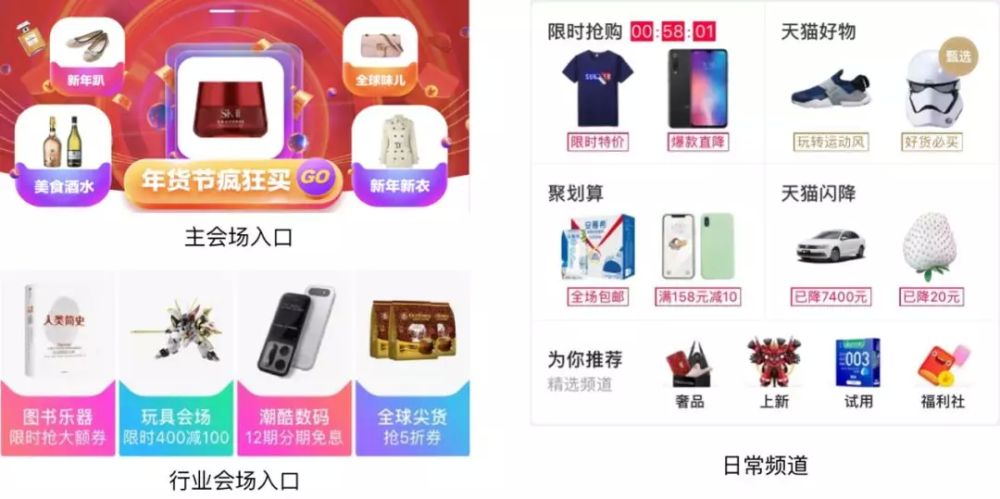
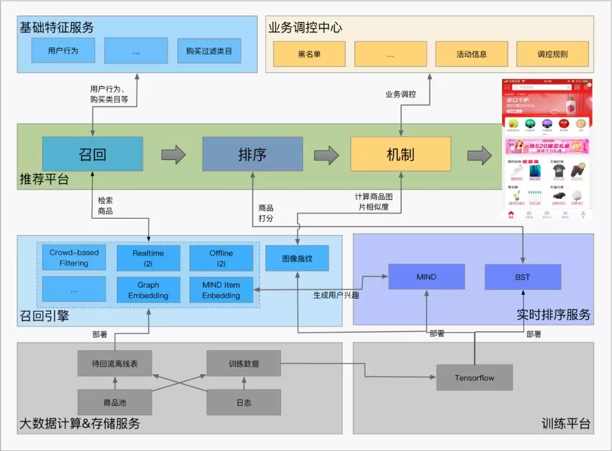
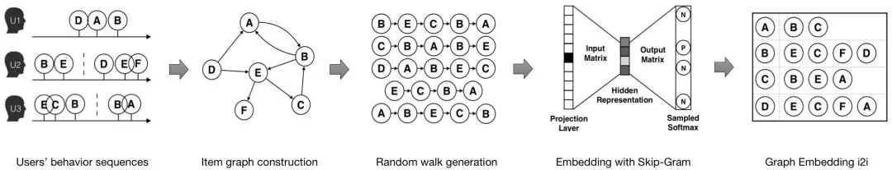
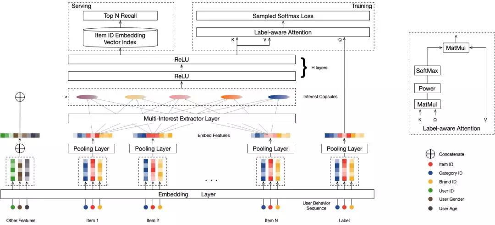
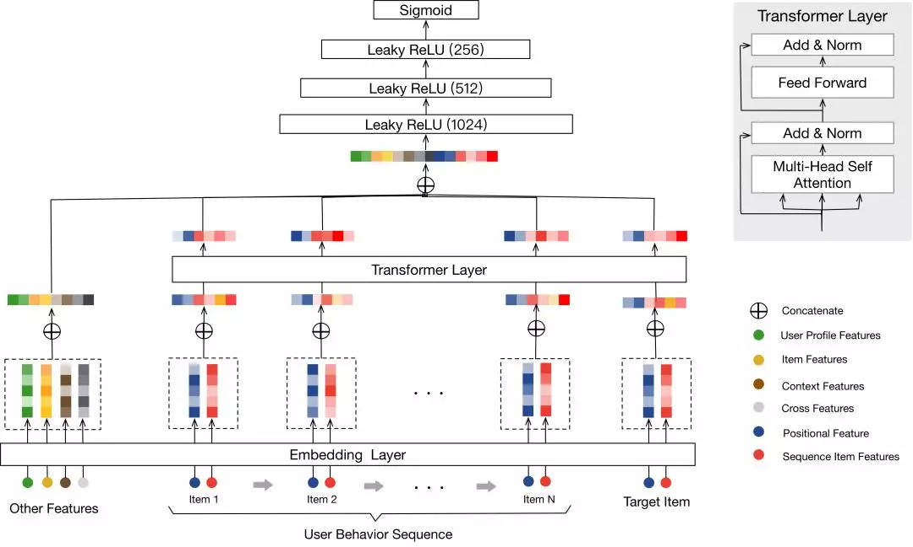
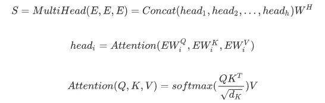
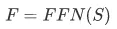
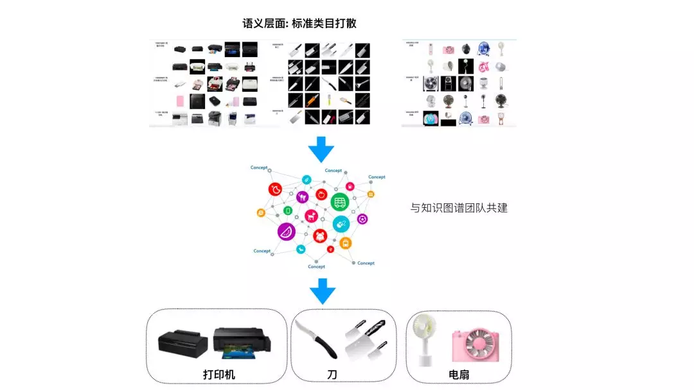
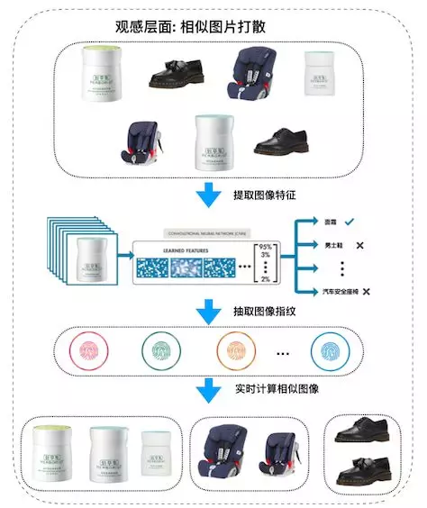

## 当你打开天猫的那一刻，推荐系统做了哪些工作？  

> 作者: 陈启伟  
> 发布日期: 2019 年 6 月 17 日  

天猫首页作为用户打开手机天猫 App 的第一印象，所推荐的商品极大地决定了用户接下来的行为，对用户流量的承接与分发、提升用户购物体验和呈现天猫货品的性价比、品质感及品牌力起到至关重要的作用，成为提升天猫用户体验的关键环节之一。

### 1、场景介绍

天猫首页的场景主要包括大促会场入口和日常频道两大类，如图 1 所示。其中左图为大促会场入口，包括主会场入口和行业会场入口；主会场入口通过为用户推荐 7 个商品（3 个在中间动态轮播）给大促主会场进行引流，引流 UV 达数千万以上；行业会场入口通过为用户推荐 4 个个性化会场和商品为数万的会场引流。右图为日常频道，包括限时抢购、天猫好物、聚划算、天猫闪降和精选频道；首页通过个性化推荐商品为各个特色的频道引流，通过各个频道来培养用户心智，让用户在天猫逛起来。

图 1. 天猫首页场景

过去的首页推荐更多的是在相关性推荐的单一数据目标上进行优化，如今天猫首页的推荐系统不仅仅考虑推荐结果的相关性，还在推荐结果的发现性、多样性等方面上做了更深度的优化，" 效率和体验并重 " 成为天猫首页新的优化目标。Graph Embedding、Transformer、深度学习、知识图谱等新的技术已先后在天猫首页的推荐系统成功落地，为场景带来了两位数的点击率提升和两位数的疲劳度下降。

### 2、推荐框架

天猫首页的个性化推荐系统可以分为召回、排序和机制三个模块。其中，召回模块主要是从全量的商品素材中检索出用户感兴趣的 TopK 个候选商品，排序模块专注于用户对商品的 CTR 预估，机制模块负责后期的流量调控、体验优化、策略调控等和最终的商品排序。整个推荐系统采用 Graph Embedding、Transformer、深度学习、知识图谱、用户体验建模等新的技术构建起来，后面章节将介绍这个推荐系统的关键技术点。

图 2. 天猫首页推荐系统框架

### 3、召回

#### 3.1 Ranki2i

Item-CF 是目前应用最广泛的召回算法，其原理是根据两个商品被同时点击的频率来计算两个商品之间的相似度 simScore，得到 i2i 表；然后通过用户的 trigger 去查询 i2i 表，扩展用户感兴趣的商品。Item-CF 的基本算法虽然简单，但是要获得更好的效果，往往需要根据实际的业务场景进行调优。清除爬虫、刷单等噪声数据，合理选择计算商品之间相似度的数据的时间窗口，引入时间衰减，只考虑同一个类目下商品对，归一化、截断、打散等策略对优化 Item-CF 的效果都有很大的帮助。

Ranki2i 是一种改进的 Item-CF 算法，其在 item-CF 得到的两个商品之间的相似度 simScore 的基础上再乘以该 trigger item 所召回的该 target item 在过去一段时间内的 ctr \(注意 ctr 的计算需要进行适当的平滑\)，对 i2i 的 simScore 进行修正，使得 i2i 表不仅考虑了两个商品的点击共现性，还考虑了召回商品的点击率。

我们基于全网的点击数据和天猫首页场景内的日志来计算 Ranki2i 表，并部署在检索系统 Basic Engine 上，对每个访问天猫首页的用户，从基础特征服务系统 ABFS 中获取用户的 trigger，并以此查询 Ranki2i 表来召回用户感兴趣的商品。

经典 Item-CF 类算法直接根据两个商品被同时点击的频率来计算两个商品之间的相似度，在寻找用户点击商品的相似、相关以及搭配商品上都有很大的优势，且其具有简单、性能高等特点，已成为目前应用使用最为广泛的召回算法。然而由于经典 Item-CF 类算法的召回结果的候选集限定在用户的历史行为类目中，并且算法难以结合商品的 Side Information，导致其推荐结果存在发现性弱、对长尾商品的效果差等问题，容易导致推荐系统出现“越推越窄”的问题，从而制约了推荐系统的可持续发展。为了跟精准地给用户推荐心仪的商品，同时维护推荐系统的可持续发展，解决推荐系统的发现性推荐和长尾推荐等问题，我们团队提出了 S3Graph Embeeding 算法和 MIND 算法。

#### 3.2 S3 Graph Embedding

Graph Embedding 是一种将复杂网络投影到低维空间的机器学习技术，典型的做法是将网络中的节点做向量化表达，使节点间的向量相似度接近原始节点间在网络结构、近邻关系、Meta 信息等多维度上的相似性。

我们团队提出的 S3 Graph Embeeding 算法利用全网以十亿的用户对十亿规模的商品的序列化点击行为构建千亿规模的 Graph，结合深度随机游走技术对用户行为进行 " 虚拟采样 "，并引入商品的 Side Information 增加泛化学习能力，将全网的商品进行 embedding，统一成同一维度的向量表示。该向量被直接用在 Item-CF 中商品相似度的计算中，相比经典 Item-CF 以共同点击次数来衡量商品相似度的做法，该算法不需要两个商品被同时点击过也能计算出商品间的相似度，并且引入 Side Information 的使其能更好的处理长尾的商品和冷启动的商品。

图 3. Graph Embedding

我们基于 Behemoth X2Vec 平台，利用全网的点击数据和商品 Side Information 构建全网商品的 embedding，并以此来计算 Graph Embedding i2i 表，部署在 Basic Engine 上，对每个访问天猫首页的用户，从 ABFS 中获取用户的 trigger，并以此查询 Graph Embedding i2i 表来召回用户感兴趣的商品。

#### 3.3 MIND

Multi-Interest Network with Dynamic Routing \(MIND\) 是我们团队提出的一种向量召回的方法，其通过构建多个和商品向量在统一的向量空间的用户兴趣向量来表示用户的多个兴趣，然后通过这多个兴趣向量去检索出 TopK 个与其近邻的商品向量，得到 TopK 个 用户感兴趣的商品。

传统 DeepMatch 方法为每个用户生成一个兴趣向量，但在实际的购物场景中，用户的兴趣是多样的，不同兴趣之间甚至可能是不相关的，比如用户可能同时期望购买服装、化妆品、零食，而一个长度有限的向量很难表示用户这样的多个兴趣。我们的 MIND 模型通过 Dynamic Routing 的方法从用户行为和用户属性信息中动态学习出多个表示用户兴趣的向量，更好的捕捉用户的多样兴趣，来提升召回的丰富度和准确度。

图 4. MIND 模型

我们基于实时排序服务 RTP 和召回引擎 Basic Engine\(BE\) 开发了一整套 MIND 在线服务体系。对每个访问场景的用户，先通过部署在 RTP 中的 MIND 模型的 Multi-interest Extractor Layer 提取出用户的多个兴趣向量，然后利用这些兴趣向量在 Basic Engine 中通过 aitheta 检索引擎召回用户感兴趣的商品。

#### 3.4 Retargeting

Retargering 是一种将用户点击、收藏或加购的商品再次推荐给用户的一种推荐策略。在电商的推荐系统中，用户的行为包含浏览、点击、收藏、加购和下单等行为，我们当然希望用户每一个行为流最终都能到达转化的环节，但是事实并非如此。当用户产生了下单行为的某些上游行为时，会有相当一部分用户因为各种原因没有最终达成交易，但是用户当时没有产生下单行为并不代表用户对当前商品不感兴趣，当用户再次来到天猫时，我们根据用户之前产生的先验行为理解并识别用户的真正意图，将符合用户意图的商品再次推荐给用户，引导用户沿着行为流向下游，最终达到下单这个最终的行为。

Retargering 的召回策略更多是在大促促成交的场景下使用，其召回量更需要严格控制。

#### 3.5 Crowd-based Filtering

上述的召回策略都能跟着用户的历史行为等信息召回用户感兴趣的商品，但是对于未登录用户或是冷启动的用户，这些召回策略所能召回的商品是有限的。Crowd-based Filtering 是一种替补的召回策略，是一种基于人群属性来推荐的方法，其通过将用户按照性别、年龄段、收货城市等粗粒度的属性划分为若干个人群，然后为基于每个人群的行为数据挑选出该人群点击率高的 TopK 个商品作为该人群感兴趣的商品。

#### 3.6 融合与调制

为了结合不同召回策略的优点，同时提高候选集的多样性和覆盖率，我们将以上召回策略召回的商品融合在一起。融合的过程中根据各个召回策略召回结果的历史表现和流量调控的需求，对各个召回算法的召回比例进行适当的调制。

### 4、 排序

#### 4.1 排序特征

排序特征在排序的效果中起到了非常重要的作用，天猫首页推荐系统排序模型的特征可以抽象为五类：

* User Profile Features：用户侧的基础特征，如用户的性别、年龄、城市、购买力等。
* Item Features：商品侧的特征，如商品 ID、类目 ID、店铺 ID、标签等。
* Context Features：上下文特征，如 match\_type、位置、页码等。
* Cross Features：交叉特征，如用户侧特征与商品侧特征的交叉等。
* Sequence Item Features：用户对商品的行为特征，如用户点击的商品序列、点击的类目序列及相应的 Positional Bias。

#### 4.2 排序样本

排序样本的选取也会影响排序模型的效果。排序的样本来自于场景产生的曝光和点击日志，对场景日志进行有效的清洗去噪，准实时计算场景活跃用户、黑名单用户，保留对场景有感知的部分用户，过滤数据中混杂的刷单爬虫等作弊行为数据，过滤大促 0 点下单和红包雨等异常时段用户的非正常行为日志等对提升模型效果有一定的帮助。

#### 4.3 排序模型

##### ★ 4.3.1 经典 Deep 排序模型

Google 提出的 WDL 模型奠定了目前 Deep 排序模型的基本框架。

DeepFM/PNN/DCN/DeepResNet 等模型把传统离散 LR 中特征工程的经验搬到 DL 中来，用人工构建的代数式先验来帮助模型建立对某种认知模式的预设，帮助模型更好的建模。DIN 等模型引入了用户行为数据，通过 Attention 来捕捉了用户兴趣的多样性以及与预测目标的局部相关性，对大规模离散用户行为数据的进行建模。

##### ★ 4.3.2 BST

类似 DeepFM/PNN/DCN/DeepResNet 等模型更多的在探索如何更好的利用 id features 和 bias features 去逼近 id features 和 bias features 所能达到的模型上限，很少探索如何有效利用 seq features；DIN 等模型在这些模型的基础上进行 seq features 建模的探索，其用打分 item 对 seq features 做 attention 后对其进行 weighted sum pooling，虽然可以很好地表达打分 item 和用户行为序列的相关性，但不能抽象用户行为序列内部的相关性。

为了解决 WDL 和 DIN 等模型存在的上述问题，受 Transformer 在 NLP 任务中有效地处理词序列的启发，我们提出了 Behavior Sequence Transformer \(BST\) 模型，该模型用 Transformer 来建模用户的行为序列，学习用户行为序列内部的相关性及其与打分 item 之间的相关性。

图 5. BST 模型

BST 模型的结构如图 5 所示，模型将用户行为序列 \(包括打分 item\)、用户侧特征、商品侧特征、上下文特征、交叉特征作为输入；首先通过 Embedding 技术将其 embeds 为低维稠密向量；为了更好的学习用户行为序列内部的相关性及其与打分 item 之间的相关性，通过 Transformer 来学习每个用户行为序列的深度表示；然后将用户侧特征、商品侧特征、上下文特征、交叉特征和 Transformer 层的输出 concat 在一起得到样本的特征表示向量，并利用三层的 MLP 网络来进一步学习特征表示向量更抽象的表达和特征之间的交叉关系；最后通过 Sigmoid 计算模型的输出。

模型通过 Transformer 来建模用户行为序列，首先通过 Self-Attention 学习用户行为序列内部之间的相关性及其与打分 item 之间的相关性。考虑向量的物理意义，使用内积来计算 attention，这样两个 item 越相近，内积越大，attention 增益越大。并采用 Mutil-Head Attention 的方式，有效的将序列特征放到多个平行的空间进行计算，提升模型的容错性与精准度。

其中，WQ,WK,WVWQ,WK,WV 为投影矩阵，E 是用户行为序列 UserBehavior=\[I1,I2,…,IT\]UserBehavior=\[I1,I2,…,IT\] 与当前打分 Q 进行拼接后的 Embedding 表示，E=\[I1,I2,…,IT,Q\]E=\[I1,I2,…,IT,Q\]，h 是 head 数。

为了进一步增强网络的非线性表示能力，将 Self-Attention 的输出做一层 Point-wise Feed-Forward Networks \(FFN\) 。

我们基于实时排序服务 RTP，在 GPU 集群上部署了量化后的 BST 模型，对于每一个打分 item 列表，RTP 将其拆分后并行打分，实时预测用户对打分 item 列表中每一个 item 的点击率。

### 5、机制

#### 5.1 视觉体验优化

##### ★ 5.1.1 基于知识图谱的标准类目扩展

受种种因素制约，淘宝天猫商品类目体系过于细致，不符合推荐场景中用户对商品的主观分类。我们与知识图谱团队合作，建立了标准类目体系，从语义层面出发，结合场景的特点，将相近的叶子类目进行不同程度的聚合，分别应用在购买类目过滤和类目打散时的类目扩展。

图 6. 标准类目体系

##### ★ 5.1.2 基于图像指纹的相似图片检测系统

淘宝商品素材浩如烟海，相似的展示图片层出不穷。这种相似经常超越图片所属商品本身的属性，通过商品本身的标题、类目等语义信息已无法识别这种相似，为此我们团队研发了相似图片检测系统，从图形本身出发来检测商品素材图片之间的相似度。

同图检测系统以 CNN 作为分类器，识别商品素材图片所属的叶子类目，将最后隐藏层向量作为图像特征向量，并通过向量的相似度来计算商品之间的相似度。为了加速向量相似度的计算，我们使用 SimHash 算法将图像特征向量进一步转化成高维图像指纹，将计算两个特征向量距离的问题转化成计算两个图像指纹汉明距离的问题, 在精度损失可接受的范围内极大地降低了计算复杂度。

图 7. 同图检测系统

##### ★ 5.1.3 多维度打散

天猫首页由大促会场入口和日常频道构成，大促会场入口包括主会场入口和行业会场入口，日常频道包括限时抢购、天猫好物、聚划算、天猫闪降和一些精选精选频道，每一个频道的商品素材都是独立的，存在一定的重复，如果不加限制，各个频道之间容易出现相似的推荐结果，这在“寸土寸金”的首页，无疑是一种浪费，也会伤害用户体验，不利于导购心智的培养。为此，我们设计了多种打散方案，从多个维度（商品 / 标准类目 / 品牌 / 会场 / 相似图片等）对首页各个频道推荐的素材进行联合打散，让推荐的结果更具多样性。

#### 5.2 模板式实时曝光过滤

由于天猫首页在手机天猫的首屏，用户每次打开 APP 都会获得曝光，其中就包含了很多无效的曝光，如用户直接进入搜索频道、进入购物车或者大促期间来抢红包雨抢券等，这些无效曝光中用户对该场景是无心智的。常见的将对用户伪曝光的商品记录下来并利用其来进行实时曝光过滤的方法对首页这种无效曝光率很高的场景来说“太严格”了，会使得推荐的效果大打折扣。为此，我们设计了一种模板式实时曝光过滤的方法。一次推荐给用户出多个模板，并记录用户上次看到的第 i 个模板，然后在本次给用户展现第 i+1 个模板。如果用户产生新的行为，模板的推荐内容也会随之进行更新。

#### 5.3 用户及类目个性化的购买过滤

”买了还推“是过去推荐系统经常被诟病的吐槽点，要解决该问题就需要对用户购买的类目进行合理的过滤。然而由于每个叶子类目的购买周期不同，不同用户对类目的购买周期也不同，因此设计购买过滤时还需要关注不同用户对不同类目过购买过滤的个性化需求。购买过滤作为所有推荐场景都会面对的基础问题，我们与工程团队合作推出了统一的全域购买过滤服务，为每一个类目定制一个购买屏蔽周期，根据用户最近一段时间内购买的行为为每个用户维护一个实时的购买过滤类目，同时考虑到如果该用户在购买屏蔽周期内又主动在该类目上发生了多次点击行为，说明用户对该类目仍感兴趣，有购买的可能，则该类目会被 " 解禁 "。天猫首页接入购买过滤服务之后，" 买了还推 " 的问题也得到了大大的改善。

### 6、总结

本文从算法的角度介绍了天猫首页的推荐系统，从召回、排序、推荐机制三个方面讲解了我们如何利用 Graph Embedding、Transformer、深度学习、知识图谱、用户体验建模等多项技术来构建先进的推荐系统。当然，完整的推荐系统是一个复杂系统，构建一个 " 懂你 " 的天猫首页还离不开产品、工程、运营等同学的合作和帮助。在个性化推荐的道路上，我们将继续不断积累和打磨，深耕技术，创造更好的个性化服务，也相信个性化推荐的未来会更好。

### 7、关于我们

阿里巴巴搜索推荐事业部推荐算法团队主要负责手机淘宝猜你喜欢信息流、淘宝首页和天猫首页等场景的推荐，每天服务上亿用户，生成数十亿的个性化推荐页面；团队研究领域包括大规模在线深度学习，深度强化学习，图嵌入学习，边缘计算，智能交互，商业化机制，推荐策略，推荐质量等，已在 AAAI，ICLR，KDD，SIGIR 等国际顶会发表或在投近 10 篇文章。

**本文转载自公众号阿里技术（ID：ali\_tech）** 。

**原文链接** ：

**<https://mp.weixin.qq.com/s/MBVac45WpZy4c208zF3Ang>**
