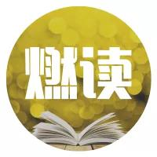
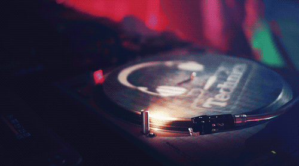
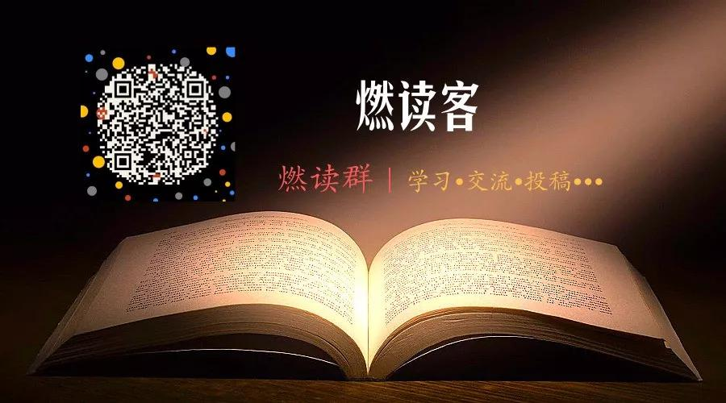

## 加缪：艺术家和他的时代  

> 王殿忠 译  
> 发布: 燃读  
> 发布日期: 2019-06-12  

阿尔贝·加缪（Albert Camus，1913年11月7日—1960年1月4日），法国作家、哲学家，存在主义文学、“荒诞哲学”的代表人物。主要作品有《局外人》、《鼠疫》等。

**
**

**艺术家和他的时代**

**
**

文｜加缪

译｜王殿中

一位东方贤哲，在他祷告时，总是祈求神灵让他远离尔虞我诈的是非之地。我们不是贤哲，所以神灵也没有对我们予以关照，至今仍然生活在这块是非之地上。然而，这个纷争不已的时代却并不认为我们有能力摆脱它。当今的作家们对此是了解的。只要作家们一开口，便会引来一系列的批评和攻击。倘若你因之便小心谨慎，闭口不言了，那些人就又对你的沉默不语大发议论，大加讨伐，又把事情闹个沸沸扬扬。

处在这种杂乱纷纭的包围中，作家们就休想找一个安静的处所平心静气地去思考、去构思人物的形象，但这些又是他们所必需的。到目前为止，在过去的历史上，大家总还算好歹有所克制。有人对时事看不惯，便常常沉默不语，或者左顾而言它。但今天呢，一切都变了，即使是沉默不语，也会使人感到心惊胆战。自从把克制看做是你的一种选择以来，即看做是你选择惩罚还是选择表彰以来，艺术家便已身不由己地被卷入了是非的旋涡。我认为在这里用“卷入”一词比用“参与”更恰当。因为对艺术家来说，他们并不是心甘情愿地参与进去，倒有点像义务服兵役一般。今天的每一位艺术家都已被卷入他这个时代的战船上。尽管他闻到这条战船有股鲱鱼味儿，尽管他感到这艘船上凶暴的监视者人数太多，并且航向不正，但他必须服从。于是我们便处于一望无际的大海中，艺术家也就只有和大家一样操起桨来划船，并且如果能够做到，还要生活下去。也就是说，一边维持生活，一边创作。

平心而论，这并不容易，我也知道，艺术家们对他们往昔舒适的生活很怀念，这种变化显得有点突然。不错，在历史的斗兽场上，就有殉难者和狮子，前者被一种永恒的安慰心理所支持，后者则用血淋淋的生肉来喂养，而艺术家直到目前为止，一直位于斗兽场的雅座上，他们唱着毫无意义的赞歌，或是赞扬自己，或是顶多也不过为了鼓励一下殉难者，或转移一下狮子的注意力。如今情形却反过来了，艺术家自己处在马戏场的中央，他们的歌声必然不是原来的歌声，那声音显得极大地缺乏自信。

我们可以清楚地看到，艺术在这种坚定的使命中所能失去的一切。首先它失去了宽松性及其神授的自由性，这种自由性在莫扎特的作品中可以体会到。因此我们就能更好地理解我们的艺术作品何以会有那种既惊恐又固执的面孔，何以会显得忧心忡忡，随之便突然崩溃的现象。我们也便明白了今天何以会出现记者多于作家的现象，何以在绘画界会有那么多画童子军的却很少有塞尚。我们也终于明白了爱情小说以及阴暗小说何以会取代《战争与和平》以及《查尔特勒修道院》。当然，在这种情形下，我们应该始终反对那种人道主义的哀歌。因为哀伤并不能解决现实问题。依我的看法，最好还是投入到时代中去，因为时代在强烈地呼唤着我们；最好还是心平气和地承认，主宰一切的人，手持茶花的艺术家，以及坐在安乐椅上的天才们，他们的时代已经结束了。今天要想创造，就要冒风险。任何一部作品都是一种行动，这种行动显示着对一个时代的爱，它不能置任何事情于不顾。因此，就不是在艺术上留不留下什么遗憾的问题，对所有从事艺术生涯的人来说，问题只有一个，就是要弄清楚，在那么多的意识形态的警察监视之下（比如那么多的宗教派别，又处于那种孤立无援的状态下），那种创作所需的特殊自由能不能实现。

在这方面，倘若说，艺术受到政权的高压，也还是不够的，因为只此一端，问题也还比较简单： 要么抗争，要么举手投降。然而，更为复杂、更为致命的问题乃是，自此我们便发现在艺术家的内部发生了纷争。比如艺术上的互相排斥，甚至达到了愤恨地步，在我们这个社会里例子是太多了。这种仇恨在今天，其影响非常之大，因为这是艺术家们自己干的事。在我们之前的艺术家们对此产生的疑虑，直接影响他们的艺术生命，甚至影响到他们的生存。如果拉辛生活在1957年，他可能也要为写《贝蕾尼斯》而不站出来保卫《南特敕令》（《南特敕令》，1598年法国国王亨利四世在南特城颁布的宗教宽容法令——译注）而请求原谅。

由艺术家们引发的这种艺术上的纷争，有多种原因，我们应该对其主要原因有所了解。对这种纠纷，倘若作最好的解释，乃是基于当代那些艺术家们在历史的灾难面前是否说谎，是否言之无物。我们这个时代的特点，是大众群体已介入了各种事物之中，以及由于他们生活条件的艰苦而形成的当代敏感问题。我们知道，他们已然介入了各项事物，但我们却有对此视而不见的倾向。如果我们了解了这个问题，就应该懂得，是这个群体中的杰出人物，艺术家们或者其他人，变得更强大了，是他们不允许我们把他们放在一边不闻不问。

还有一些其他原因，其中有些原因也实在并不光彩。但不管这些原因如何，艺术家内部的这些纠纷，只能起到一种效果，即挫伤自由创作的勇气并损及创作的主要原则，而这种原则又是创作的信念。依默逊（1803－1882，美国哲学家——译注）讲得好：“一个人能顺应自己的天性，这就是杰出的信念。”另一位十八世纪美国作家又补充说：“只要一个人忠于自己，一切便都能顺应自己，包括政府、社会，甚至太阳、月亮以及星星。”这种惊人的乐观主义态度，今天好像已经烟消云散了。艺术家在大多数情况下，都对自己和自己的天赋\(如果他有天赋的话\)感到羞耻。他们先于一切事情要做的，乃是回答他们自己提出的这个问题：艺术是一件骗人的装饰品吗？

一

**对这个问题，能做出的第一个诚实回答是：不错，有时候艺术确是一件骗人的装饰品。在艺术家乘坐的战船的艉楼上，几乎随时随地都能听到歌功颂德的赞歌，这我们大家都已晓得了，但那些劳工们呢，正在船舱里精疲力竭地摇着橹；在马戏场的雅座上，听到的是上流社会高雅的谈吐，而斗兽场上听到的是狮子口中咀嚼人骨的声音。对这种艺术，很难提出什么反驳的意见，它在历史上曾取得过极大的成功。但世事却发生了一些变化，特别是在这个地球上，受苦受难的劳苦大众和受难者的人数在大量地增加。在众多的苦难面前，这种艺术如果它依然愿做一个装饰品的话，在今天，它就必须骗人。**

但它究竟要表达的是什么呢？如果它想适应我们这个社会的要求。它就必须改弦易辙，如果它盲目地排斥这个社会的要求，如果艺术家决心把自己局限在象牙塔里，那这种艺术要表达的也只能是拒绝参与。于是， **我们将只能有两种人，一种是帮闲者，一种是古文研究者，这两种人则构成了一种与活生生的现实完全割离的艺术。** 差不多一个世纪以来，我们生活在一个并非金钱至上的社会里（金钱或财宝能引起人们的物欲），但却生活在一个具有抽象金钱象征的社会里。商品社会，可以认为是这样一种社会，即在这个社会里，一切东西都为符号服务，从而也便没有了那种东西。比如一个统治集团衡量它的财富时，不再以它占有多少土地和拥有多少金条为依据，而是以一种数字为依据，以这个数字可以换取其他多少数字为依据。一个建立在符号上的社会，就其本质讲，乃是一个人为的社会，在这个社会里，物质的真相被掩盖了。于是对这个社会选择了一种形式上的伦理准则做它的宗教信仰也就不足为怪了，它甚至把自由平等等口号写在它监狱的大墙上和教堂里。亵渎了这些字眼是要受到惩罚的，然而今天受到歪曲最严重的，乃是自由的含义。明智者（我一向认为智慧有两种，一种是聪明的智慧，一种是愚蠢的智慧）认为这种被歪曲的自由含义乃是今天人类进步道路上的障碍。然而一本正经的愚蠢，也同样可以大声讲话，因为在一百年来，商品社会已然把这种自由变成了单方面的、排他的手段，与其说把它看成一种权利，毋宁说把它当成了一种义务，而且毫无忌惮地以自由为借口实施高压政策。因此，这种社会不要求把艺术作为解放人类的一种工具，而要求它成为一种没有什么意义的社会活动和简单的消遣手段，因此我们还会感到吃惊吗？资产阶级的欧洲的艺术制造商们（我还没有说艺术家们），在1900年以前和以后那段时期，就采取了这种不负责任的态度。因为一负责任，他们便觉得可能会同那个社会实行一种筋疲力尽的决裂（真正同那个社会决裂的有兰波、尼茨什（1844－1900，德国哲学家——译注）和斯特兰贝格（1849－1912，瑞典作家——译注），大家也知道他们付出了多大代价）。为艺术而艺术的理论便在那个时期形成，这只不过是那种不负责任的翻版罢了。为艺术而艺术，艺术的自身的生命力，最后，这些作品在敏锐性或当代的抽象性方面同托尔斯泰或莫里哀的作品之间的不同，就如同在一片看不见的麦田上走路和在长满庄稼的田地里走路一样，那感觉完全不同。

二

艺术就这样变成了一件骗人的装饰品。因此，对于一些人或艺术家们曾经想向回走或者想重新回到真实中来也便不奇怪了。从这时起，他们便否认艺术家有权利离群索居，并给艺术家规定了创作主题，这个主题不是他们自己的空想而是大家共同经历过的那种现实。的确，为艺术而艺术，无论就作品描写的主题还是其表现风格，都无法为大众所理解，于是这些人便希望艺术家们的作品要表现大多数并为大多数人服务，要求他们用的语言反映大家的喜怒哀乐。他的作品应该被所有的人理解，作为绝对忠于现实的报酬，他们将会同大家取得完全的沟通。

这种同大家完全沟通的志向，也确实是任何一个伟大艺术家的志向。同流行的偏见完全不同的是，如果某人没有权利离群索居，那么这个人就应该是艺术家。艺术不应该是暗室里的独白，孤独的和不为众人所知的艺术家，倘若他向他的后继者求助时，只能重申他自己的使命。因为鉴于同当代那些聋哑人进行对话已成为不可能，他只能求助于人数更多的后代，同他们进行对话。

但为了在作品中表现大众，并为大众而写作，那就必须表现大家所熟悉的东西和我们大家共同生活在其中的这个现实世界。这个现实世界是什么呢？就是大海、刮风和下雨，就是众人的需求和希望，就是同死亡的斗争。这些就是联系我们大家的东西。我们大家在我们共同所见到的事物中，在我们所受的苦痛中变得相通了。梦想会因人而异，但这个世界上的现实却是我们大家共同的祖国。现实主义的志向是合乎情理的，因为它同艺术家的命运紧密地联系着。

那么，就让我们成为现实主义者吧。或者有可能成为现实主义者的话，那我们就应该尽量朝这个方向努力。因为空口白话很难说就是事实。尽管大家都想成为现实主义者，但实际上都不见得会如此。我们首先应该思考一下，在艺术上纯粹的现实主义是否可能。按照上个世纪自然主义者的说法，现实主义乃是对现实事物原封不动的复制品。如果这样，那艺术就如同照相之于绘画一般，当这一幅画被摄影家选中了，就把它照下来。但这样，复制下来的是什么？现实又是什么？即使是最好的摄影家，他摄下来的事物相当忠实于原物，但也并不是真正的现实主义者。在大千世界上还有比人生更为现实的吗？又怎样才能使这种现实的人生比照片上的更加活生生地再现出来呢？在什么条件下，这张照片才能是名副其实的活脱脱的现实呢？这种条件就只能存在于想像中，只能设想，有那么一架固定的摄像机，日夜对准了那个人，不断地把他哪怕是最小的动作都录制下来。结果便是此人的生活都已收录在这些底片上，并且只能放映给那些宁可失去自己一部分生活的时间而去关心另一个人生活细节的那些观众们去看，尽管如此，这种不能给人以想像的电影不算是现实。基于这一简单的理由，我们可以说，人生的现实并不只存在于它自己存在的那个地方，它存在于另外的生活中，只有另外的生活才能给某人的生活赋予一定的形式，这种其他方面的生活就是被众生所热爱的生活。首先是这种生活，要把这种生活摄制下来，也包括那些不为人所知的芸芸众生的生活，其中包括强权者和受苦难者，普通的公民、警察、教师，在矿场和工地不见天日的劳工，外交官和独裁者，宗教改革家，创作能够影响我们生活的、神话的艺术家，典型的卑贱者，有时也包括那些能够支配众生的最有权威的君主。这样一来，就只有一种电影，那就是被一架无形的放映机不断地在这个人生舞台上昼夜不停地向我们放映的电影。惟一的现实主义艺术家就是上帝，如果有上帝的话。其他的艺术家，都不可能忠于现实。

自这时起，那些排斥资产阶级社会和这个社会的形式主义的艺术的艺术家们，那些只想反映现实而不管其他的艺术家们，就处于一种毫无出路的苦恼中。成为一个现实主义者，但却做不到，他们想使自己的艺术服从现实，但却又无法描写现实，无法找出一种选择使现实体现在艺术的特有手法之中。俄国革命初期出现的那些优美的悲剧作品，就十分真切地向我们展示了这种苦恼。那时的俄国作家们，如勃洛克、帕斯捷尔纳克、叶赛宁、马雅可夫斯基以及爱森斯坦等，还有那些描写钢筋水泥的小说家们向我们展示的，在形式和题材上都是一种极其壮丽的尝试，但却也显现着一种极大的不安和一种狂热的寻求。必须明确地说，既然现实主义无法做到，那么你怎么会成为一个现实主义者呢？但却有人断然地肯定：现实主义，首先是必要的，其次也是可能做到的，只要他乐于做一个社会主义者。这种断然的说法意味着什么？

实际上，他也坦白地承认，人们不能没有选择地复制现实，尽管现实主义的理论在十九世纪的西方便已形成，但他却拒绝承认，于是便想选择一种原则，并使大家围绕着这个原则行事。他终于选到了，但不是在我们大家所熟悉的现实中找到的，而是在尚未出现的现实中，即在将来的现实中找到的。即为了很好地复制现在，也就必须描绘将来。换句话说，社会主义现实主义描绘的对象，恰恰是尚未实现的现实。

这里面的矛盾是显而易见的。总之，社会主义现实主义在其表述上就是矛盾的。在一个尚不是社会主义的现实世界里，社会主义现实主义怎么会出现呢？比如这个现实尚不是社会主义的现实，无论过去还是现在，都不是这样，这样会出现社会主义现实主义的作品吗？答案很简单，那就只能从今天的现实或昨天的现实中进行选择，选择将来可以成为那种完美无缺的理想现实或为那种现实服务的东西来描写。于是一方面便大肆攻击并否认那些非社会主义的现实，一方面就大肆赞扬那些可能会变成社会主义现实的东西。当然，这不可避免地会取得艺术上的宣传效果，会走进那种一厢情愿的粉红色的书斋里，然而这同形式主义的艺术一样，会同复杂的、活生生的现实完全隔绝。这种艺术可能是社会主义的，但它却绝不是现实主义的。

这种美学观，其本义是现实主义的，但却走向了新的理想主义，对一个真正的艺术家来说，它同资产阶级的理想主义一样毫不足取。现实，只有当它被较好地梳理过之后，才能坚实地处于一种至高的位置上，而艺术则处于无能为力的境地，它是一种工具，可以起支配作用，但终归是被人所支配。只有那些正确地描述现实的人，才能被称为现实主义者，并应该被人所称颂，其他的人只能在对前者的赞颂声中受到批评。一部名著在资产阶级社会，它可能没有人知晓，或者对它知之甚少，然而在极权社会中，一部名著却能够使其他作品统统被冷落。在这里依然是真正的艺术被歪曲了，或者被压制了，从而使得普遍的交流变得行不通。

在这种不利的情形下，最简单的做法莫过于承认所谓社会主义现实主义，如果其用伟大的艺术手法创作，也并非毫无可观之处，而且革命者们出于对革命利益的考虑，也应该寻求一种别样的审美观。但我们也都知道，社会主义现实主义的辩护士们却大声疾呼，在社会主义现实主义之外，便无艺术可言。他们确是这样说的。但我却深深地认为，他们自己对此也不相信，只不过他们下定决心要把艺术标准置于革命行动的标准之下罢了。倘若把这种看法明明白白地说出来，那讨论也就会变得简单了。我们可以在那些一方面大众受苦受难，一方面艺术家又享有特权的地方尊重这种说法，那里的人对两者之间的距离难以接受。我们可以理解这些人，并且也愿意同他们对话，比如可以对他们说，取消创作自由，对于战胜强制可能并不是一种好办法，而且在大家尚未开口讲话之前，便剥夺某些人的说话权利也绝非明智之举。不错，社会主义现实主义应该承认它的血缘关系，它同政治现实是一对孪生兄弟。它把具有另一种目的的艺术加在一般意义的艺术之上，并且在标准上又有高低之分。总之它为了建立公正取消了艺术，而当公正在一个尚难确知的将来建立起来时，艺术便会重新抬头。就这样，他们为当代的知识界在艺术领域规定了这么一条绝妙的好主意，却骗不了我们。因为为了做好一份煎蛋就把成千上万的鸡蛋打碎，那也是不足取的。我认为评定烹调技术的好坏，不在于打碎鸡蛋的多少。 **我们时代的艺术厨师则恰恰相反，他们惟恐把几筐鸡蛋打碎而人类文明的煎蛋却做不出来，最终艺术又不能重新抬头。而野蛮却从来又没有“临时”之说，因此这种野蛮做法很自然地便会从艺术领域扩展到社会风尚之中。于是我们便看到，在苦难和鲜血中诞生了一些毫无意义的文学作品，诞生了一大批新闻报道，诞生了伟人的肖像，诞生了教育诗，其中仇恨代替了宗教。在这里艺术处于乐观主义的顶峰，也达到了装饰作用的最高点和以谎言骗人最令人齿冷的地步。**

对此，该如何表示我们的惊讶？人类的痛苦是一个巨大的主题。好像除了济慈那样极富感情的诗人外，没有人敢于接触这个主题，只有他能够亲手触摸这种苦痛。为艺术而艺术的欺骗性就在于，它对这些人类的痛苦摆出一副一无所知的面孔，似乎对此没有任何责任。现实主义的欺骗性在于，如果它能勇敢地承认眼前众生的痛苦却又对这种痛苦加以严重的歪曲，并利用它做口实来歌颂美好的未来，那么就没有人了解实情，从而便把一切事物都蒙上一层神秘色彩。

**这两种审美观的对立由来已久，一种是主张对当前的现实一概不闻不问，另一种则主张把一切不属于当前现实的东西一概加以排斥，其结果是殊途同归，都在欺骗的帐幕下，远离了现实，取消了艺术，走到一起去了。** 右翼的学院派，不晓得左翼学院派所利用的人类的痛苦，于是在艺术被否定的同时，这种痛苦也就加深了。

三

应该就此得出结论说，这种欺骗乃是艺术的本质吗？我却认为恰恰相反，到现在为止，我所说的那些表现，都是在艺术上没有什么可观者的谎言。那么，艺术到底是什么？此事并不简单，这是可以肯定的。并且对那些热衷于高声叫喊并把什么事都予以简单化的人，又很难说清楚。一方面，有人认为天才应该是光辉灿烂，同时又是孤独的；但另一方面，又要求他和众人一样普通。然而现实可绝非如此简单。巴尔扎克用一句话便使人感到了天才的真谛：“天才和大家一样，但却没有人和天才一样。”因此，就艺术而论，离开现实，它便一事无成，而离开艺术，现实也微不足道。那么艺术怎样高于现实又怎样服从现实？艺术家选择他的描写对象，同时也被对象所选择。艺术，在某种意义上说，它在不可捉摸方面和在未成形时，乃是对人的一种反抗，因为它赋予现实的是另一种形式，一种受局限的形式，因为现实是艺术灵感的源泉。从这方面讲，我们大家都是现实主义者，没有人不是如此。对于客观存在，艺术既不全部排斥，也不全部接受，但同时它既排斥又接受，所以它只能是不断翻新的一个现实的片断。艺术家也便永远处于这种暧昧状态，他既不能否认现实，又始终在艺术尚未成形时不断地对它提出争议。为画出一个静物，一位画家同一个苹果之间便不断地互相冲突和互相纠正。如果各种形态离开了世人赋予它们的光明，那么它们就自己给自己赋予光明。人间万物由于本身便是光辉灿烂的，所以能够成形、成物，并从它们自己身上接受了第二种光明，才得以使无上的光明保持不变。就这样，伟大的文笔就始终处于艺术家和他描写的对象的中间。

因此，问题不在于了解艺术是否应该逃避现实或服从现实，而在于为使一部作品不至于在虚幻的要领中消失或不至于被沉重的包袱所压垮，关键是对现实的指导要掌握何种分寸。对这个问题，每个艺术家都应依据自己的感知和能力来加以解决。 **更为强有力的是一位艺术家对世间现实的反抗，更为沉重的是平衡艺术家的那种现实的分量。然而这种现实的重量却永远无法消除艺术家的孤独感。最杰出的作品，如希腊的悲剧，如托尔斯泰或莫里哀的作品，乃是那种能够在接受现实和排斥现实之间取得平衡的作品，在这里接受和排斥在不断地显现中互相激发，这样无论描写的是欢快还是痛苦，都能产生巨大的活力。日久天长便会出现一个新世界，这个世界既不是我们每天生活在其中的那个世界，又是那个世界，它既特殊又一般，在这个世界里，充满了天才的力量和不满于现状所引起的短时间没有危险的危险。** **正是这些，同时又不是这些，使得这个世界没有任何意义但又非常有意义，这便是每一个真正艺术家不倦的双重呼唤。这种呼唤使艺术家挺直了胸膛，睁大了眼睛；这种呼唤渐渐地在这个沉睡的世界内部唤醒了大家对一个现实瞬间的又是永久的想像。对这个现实，我们认识它，却从未见过它。**

同样，艺术家面对他的时代，既不能走回头路，又不能迷失方向。如果走回头路，他就会言之无物。反之，如果他把这个时代当作他描写的对象，他就会把自己也作为这个时代中的一员，同时也就不会完全听命于这个时代。换句话说，在艺术家选择了同大家共命运的时候，他便宣告了自己是这个时代的一个存在的个体，不能再走出这种境地。艺术家对待历史的态度以他在这个历史时代的所见所闻以及他的亲身感受，不管是直接的还是间接的为依据。亦即是说，以严格意义上的当前时事和生活在当今世界上的活生生的人为依据，而对于一个现在仍然活生生的艺术家来说，他对待当今的事情不应该以当前的时事对尚不能预见的未来有何关系为依据。以一个尚未来到人世的人的名义来判断当今世界上的人，那是巫婆的把戏。艺术家本人对神话的评价，应该以该神话对当今活生生的人有何种影响为标准。预言家，无论是宗教的还是政治的，他们的评价无论绝对与否，都不能代替艺术家的评价，因为艺术家不能那样。如果他也做出绝对的评价，他就要毫无区别地参与到现实的善与恶中间去，他就要写出一出情节剧。 **相反地，艺术的宗旨，不是立法，也不是支配一切，它首先是理解众人。** **有时它也能起支配作用，那是因为它理解了众人的缘故。没有任何天才的作品是建立在仇恨和歧视的基础上的。因此，艺术家在其前进的道路上，要宽恕而不是审判。他不是法官，是修理工。他是有生命创新的永恒的律师，因为创新永远是有生命的。他出于对众人的爱而进行辩护，而不是为那种遥远的、使当代人道主义丧失尊严的基督教式的法庭而辩护。相反地，伟大的作品最终都会使所有的法官哑口无言。通过这种作品，艺术家向人类的最高形象表示敬意，并向最后一个罪人鞠躬致敬。** 王尔德在监狱中写道：“没有任何一个不幸的人和我一起被关在这种悲惨的地方，在这里，同生命的奥秘只有象征性的联系。”是的，这种生命的奥秘，同艺术的奥秘是一致的。

在一百五十年里，商品社会的作家们，几乎很少有例外地认为自己能够生活在一个没有任何责任的幸福环境中。不错，他们是那样生活过来了，随之他们也便孤零零地死去，和他们曾经那样生活过一样。可我们这些二十世纪的作家们，则绝不会再孤零零的了。 **相反地，我们应该明白，我们不可能逃避共同的苦难，应该明白，我们惟一的辩护，如果只有一个的话，就是在我们力所能及的范围内，替那些不能讲话的人讲话。** **的确，我们要替那些目前尚在受苦受难的人讲话，不管这些过去的还是未来的政界要人有多么显赫，也不管是哪一些政党，只要他们压迫人了，我们就要讲话，对艺术家来说，没有享有特权的刽子手。** 因此，美，在今天，特别是在今天，不能为任何一个党派服务，它或迟或早只能为人类的痛苦和自由奉献出自己。惟一能投入战斗的艺术家是这样的人，他绝不拒绝任何战斗，但却拒绝加入到正规部队中去的艺术家，我这里指的是自由射手。他在美中得到了教益。如果他能正确地吸取这种教益的话，那他所吸取的不是个人主义，乃是坚定的博爱精神。这种美从来都没有强制过任何人。相反地，几千年来，每日每时它都在解除加在上百万人身上的枷锁，有时候它甚至对某些人予以彻底解放。

**在美和苦之间，在人类之爱和自然之爱之间，在不堪忍受的孤独和不堪忍受的喧闹之间，在排斥和接受之间始终存在着这种永恒的紧张关系，说到这，我们似乎已触及到艺术的伟大之处。它在两条鸿沟之间踟蹰着，一条是极端无聊、无所事事，一条是积极宣传、说教。艺术家便在这两条鸿沟的分界线上向前行走，每迈出一步，便是一次侥幸，便是一次冒险。然而就是在这种风险中，也只有在这种风险中，存在着艺术的自由。** 这种来之不易的自由，诸位看，是不是像一个苦行者的戒律？哪一位艺术家能否认这一点？哪一位艺术家敢于说自己在这种永无止境的奋斗中已经功德圆满？这种自由的取得必须以身心健康为前提，必须有一种心灵的力量和极大的耐力。这种自由同所有的自由一样，是一种永无止息的冒险，是一种使人精疲力竭的奋斗。这就是为什么今天大家对这种冒险像对待过于苛求的自由一样敬而远之，却宁可甘受各种限制，至少，可求得心灵的宁静。但是，倘若艺术不是一种风险，那么它何以要为自己辩护？不，自由的艺术家已不复是自由的普通人，也不是一个安享清福的人。自由的艺术家乃是这样的人，他须花大力气为自己营造一种合理的秩序，他所应支配的事物愈是松懈，他的戒律愈应严格，他也便应该愈加肯定他的自由。纪德有一句话，我总认为它很容易引起误解：“艺术因限制而生存，因自由而死亡。”这是真理，但却不应理解为艺术可以被人牵着鼻子走。 **艺术生存在它为自己所加给的限制中，如果别人给予限制，它就会死亡。反之，如果它不给自己以限制，那么它就只有屈从于外界的限制。** 最自由的艺术以及最具反抗性的艺术，将是最典范的艺术，也将花最大的力气。如果一个社会及其艺术家们，不愿意付出漫长的岁月和这种自由的努力，如果他们任凭自己舒舒服服地打发生活，或者循规蹈矩地搞为艺术而艺术的那一套玩意儿，或者只醉心于现实主义的说教，那么这些艺术家就会堕入虚无主义和无所作为之中。说这些，乃是为了说明，当代的文艺复兴要依靠我们具有远见卓识的勇气和一往无前的意志。

是的，这种复兴，就掌握在我们大家的手中。为此，我们应该不惧任何风险为自由而奋斗。这样，问题也不在于是否能够保卫我们的自由，而在于我们应该明白，如果没有自由，我们将一事无成而且失去未来的公正和从前的美。只有自由才能把大家从与世隔绝的状态中拉出，而强制就只能在一片寂静的空间里盘旋，而艺术，也便由于我力图予以界定的这种自由的内涵而把自己的裂痕抹平。到那时，对于敌人通过一切压迫手段所表现的一切还有什么可惊讶的？ **对于艺术家和知识分子成为当代暴政（不管这种暴政是左的还是右的）的第一批牺牲品，又有什么可惊讶的？所有的暴君都晓得，在艺术作品中都有一种摆脱束缚的力量，这种力量对那些不相信它的人是神秘的。每一个伟大的作品都能使人类的面貌更加美好，更加高尚。这就是它的全部奥秘。** 而成千上万的集中营和监狱也绝不能把形象鲜明的庄严物证变得一团漆黑。所以那种认为为酝酿一种新文化而把现有的文化予以终止的看法是不对的。我们绝不会把人类对他们的苦难和伟大不间断的见证予以终止，正像我们不会终止自己的呼吸一样。没有继承，便没有文化，我们不能够也不应该排斥我们的任何遗产，即西方的遗产。不管将来的作品如何，它们都将具有这种奥秘，都将是勇气和自由的产品，都将是各个时代和各个国家的艺术家们的勇敢精神所滋润的硕果。是的，当现代的暴政向我们表示，艺术家是公众的敌人时，它是有理由的，但这种暴政也正是通过艺术家向人类的一种形象致敬，而这种形象直到如今，没有任何力量能摧毁它。

我的结论是简单的。这个结论便是在我们喧嚣和疯狂的历史时代中大声说：“我们应该欢欣鼓舞。”不错，我们应该欢欣鼓舞，为看到一个说谎而又舒适的欧洲的涅槃而欢快，为我们能够看清这个残酷的现实而欢欣。我们应该以一个真正的人的身份而欢欣，因为一个漫长的骗局已经被揭穿，因为我们已看清了是什么在威胁我们；我们应该以一个艺术家的身份而欢欣，因为他们已从睡梦中醒来，对外界事物已不再无动于衷，敢于正视群众的苦难、敢于正视监狱和鲜血了。如果面对这些悲惨景象，我们善于把当时的情状和人物的形象保留在记忆中，反之面对人类之美，我们能够不忘记从前的屈辱，那么我们西方的艺术家将会逐步找回自己失去的力量和往日的辉煌。不错，在历史上很少有这么多的艺术家能遇上这么多严峻的问题。然而，也恰恰是当这些艺术家们，为几个词、几句话，即使是最简单的几句话付出了自己的自由甚至鲜血时，他们才学会了如何把它们使用得有分寸。危险造就了典范，任何伟大的作品都根植于风险中。

艺术家不承担责任的时代已然过去了，我们为自己失去这么好的机遇而对此表示惋惜，然而正是这种磨难，却向我们提供了真正的机遇，我们要接受这一挑战。 **如果艺术的自由仅向艺术家提供一种生活舒适的环境，它便不可贵了。** **为使一种价值或一种道德扎根于一个社会，应该首先是不欺骗。** 如果自由变成一个危险的东西，那它就已不再处于妓女的地位了。但我也不同意那些抱怨今天道德已经沦丧的人的说法。从表面看，他们讲得有道理。但实际上，道德却从来没有像它从前曾经是几位书斋里的人道主义者的玩物时那么堕落过。今天它虽然面临着实实在在的危险，但却有机会使自己重新站起来，有机会使自己重新变得受大家尊重。

有人说尼茨什在和鲁·莎罗美断绝关系以后，便陷于无边的孤寂之中，他为他从事的漫长事业因无人帮助而压垮，同时又为这一前景所激发，晚上便在热那亚海湾旁边的高山上漫步，他把树枝树叶堆积起来，燃起一堆大火，在旁边看着它们燃尽。我也经常幻想着这一堆大火，似乎自己也站在大火的旁边，想像着以此考验一下我们的某些人和某些作品。 **我** **们的时代也便是这样的一堆大火，它那势不可挡的火焰，必将把我们的许多作品烧成灰烬！而留下来的作品，它们的铁甲会愈加坚不可摧，我们也将为此而尽情地分享这种心灵的欢乐。**

无疑，我们可以期望，我本人也是如此，在思想上能有一种温和的火焰，一种暂时的有益的休息。但对艺术家来说，可能只有处于如火如荼的斗争中的暂时的休整，此外没有别的。这正如依默逊所说：“任何墙壁都是一个大门。” **因此我们无须去寻找大门，出路就在墙上，我们就是面壁而生存的。** 相反地，我们应该去寻找一个适当的休息时间，我的意思是说，在战斗中寻求一个休整时间。因为依我的看法，我在这个地方结束了讲话，这里就是我暂时休息的地方。有人曾说过，伟大的思想是由鸽子的爪子带到世上来的。那时如果我们张耳细听，可能我们会从嘈杂声中听到一种像小鸟轻轻地振翅般微弱的生命之声和希望之声。一些人说这种希望之声乃是由一个民族所带来，另一些人则说，它是由一个人所带来。相反地，我却认为它的产生、活跃以及保护，乃是由成百上千万的孤独者所致，这些孤独者的活动，他们的作品，每天都在打破国界，每天都在修复着我们历史的粗糙的外表，从而让始终都在受到威胁的真理焕发出光彩夺目的光芒，而这个真理乃是每个人在其痛苦和欢乐中建立起来的，为大家建立起来的。

* * *

**相关阅读**

[ 加缪：勒内·夏尔｜“你只为爱而弯腰”](http://mp.weixin.qq.com/s?__biz=MzIzOTA3NjExMw==&mid=2649849786&idx=1&sn=b5be6c27a1783ca40c9ed34f46152c36&chksm=f12a49c4c65dc0d2ff02238f29aa253ba6f42c8cef7f1fe92d0f24a078068f24f8bbe0630d31&scene=21#wechat_redirect)

[我因孱弱而梦想着美德 ——加缪和他的《反抗者》](http://mp.weixin.qq.com/s?__biz=MzIzOTA3NjExMw==&mid=401076031&idx=1&sn=9e158846410f0446eb020bf7dbdc7ba1&chksm=7b3cd9414c4b50576dbd301b920db6a031798818fe15468ad52887c1b773fa9ee3208a17e9a5&scene=21#wechat_redirect)

* * *

**

**

**｜｜｜** **燃读荐书**

**
**

广告

### 加缪全集\(礼盒装）（全六册\)

作者：阿尔贝?加缪

当当

* * *

