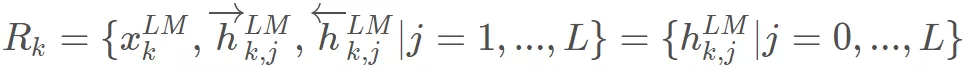
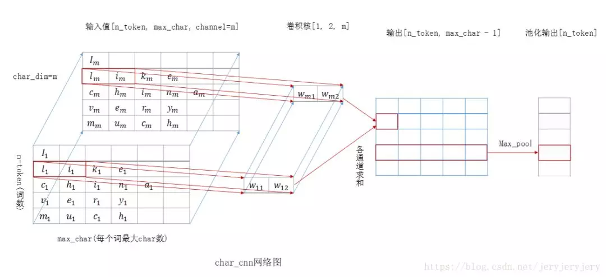

## 理解Word Embedding，全面拥抱ELMO  

> 作者: DataFun社区  
> 发布日期: 2019 年 6 月 15 日  


提到 Word Embedding ，如果你的脑海里面冒出来的是 Word2Vec ，Glove ，Fasttext 等。那我猜你有 80% 的概率是从事和 NLP 相关的工作或者至少是一个算法爱好者 \( 这貌似是一个真命题，哈哈 \) 。其实简单来说 Word Embedding 就是把词转换成向量的形式。计算机只识别二进制，智能问答系统，我们需要计算机理解的是文字。此时我们就需要将文字转换成数字，向量的形式。最简单的一种方式就是 one-hot 表示。这种方法没有语义的理解。把词汇表中的词排成一列，对于某个单词 A ，如果它出现在上述词汇序列中的位置为 k ，那么它的向量表示就是 ” 第 k 位为 1，其他位置都为 0 ” 的一个向量。这种表示表示学不到单词之间的关系 \( 任意两个单词向量的内积都为 0 \) ，并且如果词汇表很大，词向量会很长，带来维度上的灾难。无论是 Word2Vec 还是 Glove 和 Fasttext ，都完美的解决了上述两个问题，在训练的过程中，为每一个词生成一个向量，Word2Vec 训练的目的就是为了产生词向量，而 Fasttext 算法主要是为了做文本分类，词向量只是其副产物，中间会产生词向量。

这种方法在语义理解上效果比较好，可以将语义相似的词用相似的向量表示 \( 向量夹角小 \) ，但是有个缺点，训练好之后每个单词的表达就固定住了，以后使用的时候，不论新句子上下文单词是什么，这个单词的 Word Embedding 不会跟着上下文场景的变化而改变，如：“ 我喜欢吃苹果 ”，“ 很多人觉得苹果手机很好用 ” 。这两个句子中的苹果是不同的语义，表示不同的对象，没有办法表示出来。

历史总是惊人的相似，resnet 的出现颠覆了 cv 领域，刷爆了各大比赛的排行榜。Bert 登上历史的舞台，基本刷新了很多 NLP 任务的最好性能，有些任务还被刷爆了。牛顿曾经说过：如果说我看得比别人更远些，那是因为我站在巨人的肩膀上。同样，Bert 算法是站在 elmo ，GPT 等一系列算法的基础上。Bert 是近年来 NLP 重大进展的集大成者。之后我会逐步把这些都总结下来做成一个系列，第一篇我们先介绍语言模型预训练的鼻祖 ELMO ，ELMO 是 “ Embedding from Language Models ” 的简称，但论文题目是 “ Deep contextualized word representations ” ，这里面有两个关键词，一个是 deep ，一个是 context 。这两个词诠释了 ELMO 模型的精髓，利用深度网络学习单词的上下文。模型的本质和代码我会在下面的篇幅中逐步展开。

### 1\. 理解 Word Embedding

我相信你或多或少都听过 FM 算法，目前推荐领域各种算法都可以看到 FM 的影子，FM 使得推荐领域达到了一个新的巅峰。无论是原始 FM 算法还是他的变形，FFM ，wide & deep ，DCN ，DeepFM ，会为每一个特征学习一个 latent vector 。这种特征 embedding 模式应该是 Word Embedding 方法的老前辈，这也充分体现了 Word Embedding 的重要性。

#### 1.1 图像预训练

你可能会对这个题目比较好奇，我们要讲的是 Word Embedding ，这个是不是有点跑题了。之所以有这个章节，因为或许你会经常听到搞图像的人说，“ 我今天 Fine Tuning 了一个 base model ，我用 ImageNet 上训练的模型作为冷启动 ” 等一系列相关的内容。所以，我想花一点篇幅来解释一下图像领域的预训练。

下图对网络的训练进行了可视化，由图中可以看出：


第一个隐藏层主要提取图像的纹理，线条等特征，第二个隐藏藏提取人脸五官轮廓，第三个隐藏层提取了人脸的轮廓。Deep learning 底层的网络主要提取的是图像的基础特征，随着网络深度的加深，才会提取到更多的语义信息。换句话说就是高层特征和具体的任务相关。无论是图像分类还是图像检测，我们都需要图像的基础特征。因此我们当然可以使用在 ImageNet 上训练网络提取基础特征。ImageNet 数据集大，种类多，对于网络提取到的基础特征泛化能力强。这样总比我们随机初始化网络，在我们自己的数据上从头开始训练强。采用 ImageNet 上预训练的网络，有两种做法，一种是加载浅层网络的特征，在自己的任务上训练时，保持不变，前面的网络就像 “ 冻住 ” 了，反向传播时，不进行梯度更新，称之为 “ Frozen ” 。另外一种方式是浅层网络也随机训练变化，不过学习率相对于后面深层网络，会比较小，这个称之为 “ Fine Tuning ” 。

现在主流的 backbone 网络如 resnet ，inception ，FPN 等网络参数动不动就是上千万甚至上亿。在自己的数据集上从头开始训练网络，往往都是欠拟合，此时会借助预训练的方式。如果训练数据少，更适合用 “ Frozen ” 的方式，网络集中精力调整深层的网络。当训练数据集比较大的时候，可以使用 Fine-Tuning 的方式。

#### 1.2 Word Embedding 预处理

言归正传，Word Embedding 计算词向量只是很小的一个功能，Word Embedding 更多的用处是用在预处理中。你可能会感觉到迷惑，Word Embedding 怎么作为预训练？就如我们前面介绍的，计算机识别的是数字。Word Embedding 只是将 character 转换成向量的过程，为具体的下游任务提供服务。如下图的智能问答系统，我们将每一个问题转换成词向量的形式，输送到网络里面进行训练。


和上面介绍的图像预训练一样，我们在具体训练中，既可以冻结词向量，也可以进行微调，我们可以把 embedding 看成网络的一部分。当然我们也可以随机初始化右边的 embedding 矩阵，训练的过程中，利用反向传播更新 embedding 矩阵。

现实任务中，我们同样面临这两个问题，一是我们的数据集可能有限，二是我们更关心的是需求本身，希望网络更多的关注在业务层面。

从以上两点出发，都可以看出 Word Embedding 作为预训练的重要性和必要性。

### 2\. 理解 ELMO

通过上面，我们知道了 Word Embedding 作为上游任务，为下游具体业务提供服务。因此，得到单词的 Embedding 向量的好坏，会直接影响到后续任务的精度，这也是这个章节的由来。google 2013 年提出开的 word2vec 算是佳作 \( 我个人觉得，google 出品的好多都非常靠谱 \) ，算是开辟了词向量的新天地。缺点是对于每一个单词都有唯一的一个 embedding 表示，而对于多义词显然这种做法不符合直觉，而单词的意思又和上下文相关，ELMO 的做法是我们只预训练 language model ，而 word embedding 是通过输入的句子实时输出的, 这样单词的意思就是上下文相关的了, 这样就很大程度上缓解了歧义的发生。且 ELMO 输出多个层的 embedding 表示，试验中已经发现每层 LM 输出的信息对于不同的任务效果不同，因此对每个 token 用不同层的 embedding 表示会提升效果。

#### 2.1 理论

ELMO 使用了双向循环神经网，包含了一个正向的和一个反向的 LSTM 。如图：


给定 k 个 token\(t1,t2,⋯,tk\)token\(t1,t2,⋯,tk\)，会同时进入正向网络和反向网络。我们知道，语⾔模型即 k−1 阶⻢尔可夫链 \( Markov chain of order k−1 \) ，这⾥的⻢尔可夫假设是指⼀个词的出现只与前⾯ k−1 词相关。 所以，当给定的前 k−1 个 token 序列，计算第 k 个 token 出现的概率，可以得到如下计算公式：


显然，模型优化的目标是似然概率最大，即


这个优化函数是连乘，一个通用的套路就是转而求解对数似然概率最大：


如上图，正向，反向网络有两层 LSTM ，每次都会输出一个 final\_state 向量。如果有 l 层，ELMO 会输出 2l 个 final\_state 向量，final\_state 向量和最后词的 Word Embedding 息息相关。再加上开始的词转换成 Embedding 输入到网络中的向量，总共有 2l+1 个向量决定了每个词的 Word Embedding：



其中，hLMk,0hk,0LM 是对 token 直接编码的结果 \(`这里是对字符进行 CNN 编码, 这个我会在下一个章节代码分析的时候讲`\) ，即上式的 xLMkxkLM。


是每个 final\_state 向量。ELMO 中所有层的输出 RkRk 压缩为单个向量 ELMOk=E\(Rk;Θϵ\)ELMOk=E\(Rk;Θϵ\)。最简单的压缩方法是取最后一层的输出做为 token 的表示：


更通用的做法是通过一些参数来联合所有层的信息:


sjsj 是一个 softmax 出来的结果，γγ 是任务相关的 scale 参数。

Pre-trained 的 language model 是用了两层的 LSTM ，对 token 进行上下文无关的编码是通过 CNN 对字符进行编码, 然后将三层的输出 scale 到 1024 维，最后对每个 token 输出 3 个 1024 维的向量表示。这里之所以将 3 层的输出都作为 token 的 embedding 表示是因为实验已经证实不同层的 LSTM 输出的信息对于不同的任务作用是不同的, 也就是所不同层的输出捕捉到的 token 的信息是不相同的。此时得到 token 的 embedding vector ，就包含了 context 的信息了。

#### 2.2 代码分析

我看的是 TensorFlow 版本代码的实现，代码地址：

<https://github.com/allenai/bilm-tf>

关于代码如何运行，我就不在此展开了，作者的 readme 里面写的比较清楚。我们关心的是代码的运行流程和一些看论文不是很清楚的地方 \( 如 2.1 里面提到的 CNN 对字符编码等 \) 。整个代码的流程图如下，我会分模块逐步介绍。


##### 2.2.1 加载 vocabulary

在这个模块中，读取 vocab\_file 文件，加载到内存中，方便后续的查找。max\_word\_length 指的是每个单词的最大长度是多少，程序中默认的是 50。

复制代码

```
### 加载 vocabulary

def load_vocab(vocab_file, max_word_length=None):

if max_word_length:

return UnicodeCharsVocabulary(vocab_file, max_word_length,

validate_file=True)

else:

return Vocabulary(vocab_file, validate_file=True)
```

在 load\_vocab 方法中，创建 UnicodeCharsVocabulary 对象并返回。在构造函数中，读取 vocab\_file 文件，设置两个很重要的变量 \_id\_to\_word 和 \_word\_to\_id ，将索引转换成单词和单词转换成索引，前一个是数组，后一个是词典。并且将每一个单词的字符转换成对应的 ASCII 码值，每个单词对应了一个向量。将转换后的结果存放到了 \_convert\_word\_to\_char\_ids 变量中，形状是 \( num\_words,max\_word\_length \) 。还提供了一系列的方法，比如单词与索引的转换，对字符的编码等。

###### 2.2.2 构造数据集生成器

在构造函数中，首先创建了 LMDataset 对象，一个用正向网络一个用于反向的网络。最主要的工作是将单词转换成对应的索引存到 ids 中，以及每个单词转换成 ASCII 码对应的向量存到 chars\_ids 中。ids 是二维向量，chars\_ids 是三维向量。有了这些，就可以构造 data generator 了。下面列出了最重要的一个方法，每次获取一个 batch 的数据。

复制代码

```
def _get_batch(generator, batch_size, num_steps, max_word_length):

"""Read batches of input."""

cur_stream = [None] * batch_size

no_more_data = False

while True:

###todo 输入大小

inputs = np.zeros([batch_size, num_steps], np.int32)

if max_word_length is not None:

###todo 每个单词的输入，将单词转化成数字

char_inputs = np.zeros([batch_size, num_steps, max_word_length],

np.int32)

else:

char_inputs = None

targets = np.zeros([batch_size, num_steps], np.int32)

for i in range(batch_size):

cur_pos = 0

while cur_pos < num_steps:

if cur_stream[i] is None or len(cur_stream[i][0]) <= 1:

try:

cur_stream[i] = list(next(generator))

except StopIteration:

### No more data, exhaust current streams and quit

no_more_data = True

break

###todo  这个地方减一是为了构造 target

how_many = min(len(cur_stream[i][0]) - 1, num_steps - cur_pos)

next_pos = cur_pos + how_many

inputs[i, cur_pos:next_pos] = cur_stream[i][0][:how_many]

if max_word_length is not None:

char_inputs[i, cur_pos:next_pos] = cur_stream[i][1][

:how_many]

###todo 构造 target 目标

targets[i, cur_pos:next_pos] = cur_stream[i][0][1:how_many+1]

cur_pos = next_pos

cur_stream[i][0] = cur_stream[i][0][how_many:]

if max_word_length is not None:

cur_stream[i][1] = cur_stream[i][1][how_many:]

if no_more_data:

### There is no more data.  Note: this will not return data

### for the incomplete batch

break

X = {'token_ids': inputs, 'tokens_characters': char_inputs,

'next_token_id': targets}

yield X
```

num\_steps 是序列的长度，也就是我们用于训练 RNN 的时候，考虑了几个时间步长。

###### 2.2.3 构造模型

模型使用了两层的双向循环 LSTM 网络。训练模型的时候有两种方式，一种是为一个单词随机初始化一个 Embedding 向量，还有一种是为每一个单词的每个字母初始化一个随机向量。第一种方式是常见的，我们重点介绍一下第二种，其实理解明白了也就很简单了。tokens\_characters 是网络的一个输入，我们在前面小节中已经提到了，我们会把每个字符转换成一个数字。下面展示了一个例子，一个英文单词字母对应的 utf-8 编码。


因此，english 对应的向量就是 \[ 101 , 110 , 103 , 108 , 105 , 115 , 104 \] ，当然这个还不是完整的向量，还有开始和结束的特殊字符，以及为了保持向量长度一样的填充字符等。此时，你应该稍微明白一点了吧。embedding\_weights 是字符的权重向量，这个是需要随机初始化的，因为我们的目的就是为每一个字符学习到一个 Embedding 向量。现在捋一下，输入到网络中的 tokens\_characters 会利用 embedding\_lookup 方法，查询到每一个字符对应的 Embedding 向量，结果形状的大小为 \( batch\_size, unroll\_steps, max\_chars, embed\_dim \) ，此时你想到了什么。哇塞，一个四维的向量，这不就是标准的图像形状的大小吗？当然第一反应就是利用 CNN 操作。我们在后三个维度上做卷积操作，unroll\_steps 看做图像的高度，max\_chars 看做宽度，embed\_dim 是通道。卷积核的高度去固定值 1，这样可以保证我们的卷积是在同一个单词上进行操作的。最后使用 pooling 操作，确保一个单词得到一个唯一的向量，引用一张网友画的比较形象的图：



复制代码

```
###todo # 字符的输入

self.tokens_characters = tf.placeholder(DTYPE_INT,

shape=(batch_size, unroll_steps, max_chars),

name='tokens_characters')

### the character embeddings

with tf.device("/cpu:0"):

###todo 字符的 embedding 矩阵

self.embedding_weights = tf.get_variable(

"char_embed", [n_chars, char_embed_dim],

dtype=DTYPE,

initializer=tf.random_uniform_initializer(-1.0, 1.0)

)

### shape (batch_size, unroll_steps, max_chars, embed_dim)

### todo 构造输入数据

self.char_embedding = tf.nn.embedding_lookup(self.embedding_weights,

self.tokens_characters)
```

###### 2.2.4 其它

模型构造好后，会计算损失，保存一些中间值，供下游任务使用。关于代码的一些细节，可以参考我写有注释版的代码。

<https://github.com/horizonheart/ELMO>

**作者介绍**

王腾龙，滴滴算法工程师，中科院硕士，主要研究方向为机器学习与 Deepctr 。

**本文来自 DataFun 社区**

**原文链接** ：

**<https://mp.weixin.qq.com/s/zfoQd-IOpTU-qCEuRHTU_A>**
