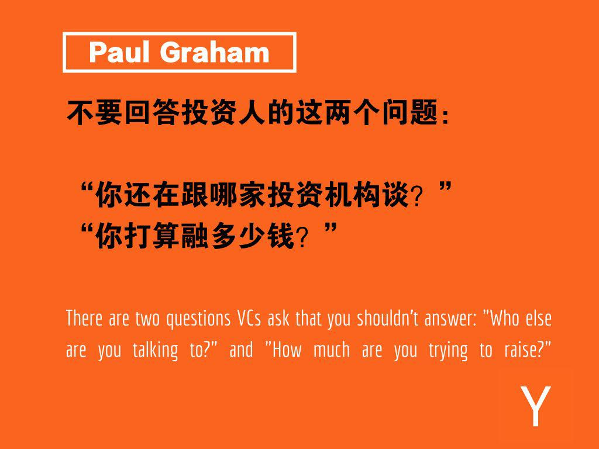
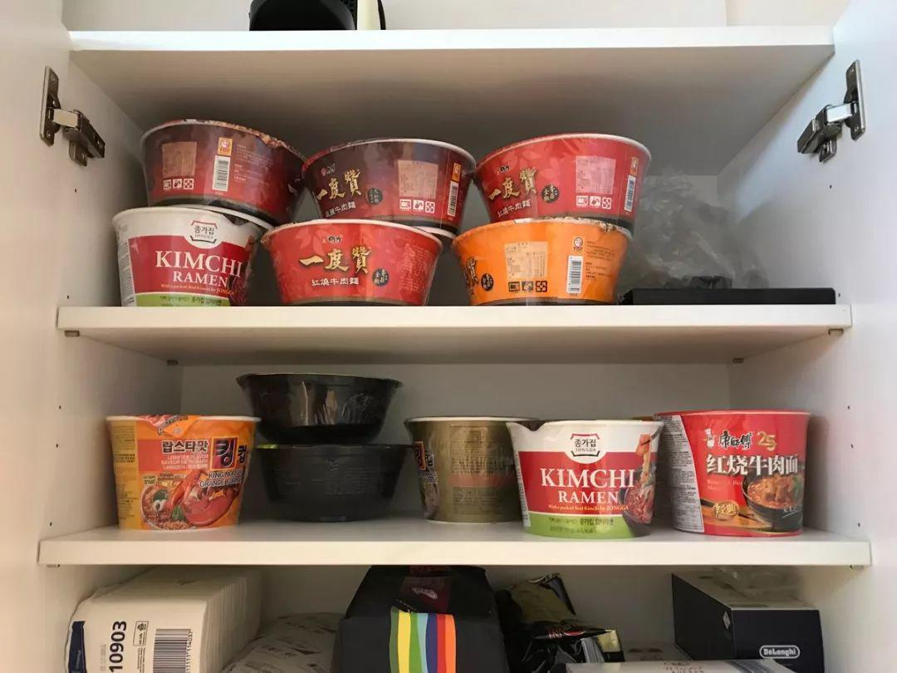
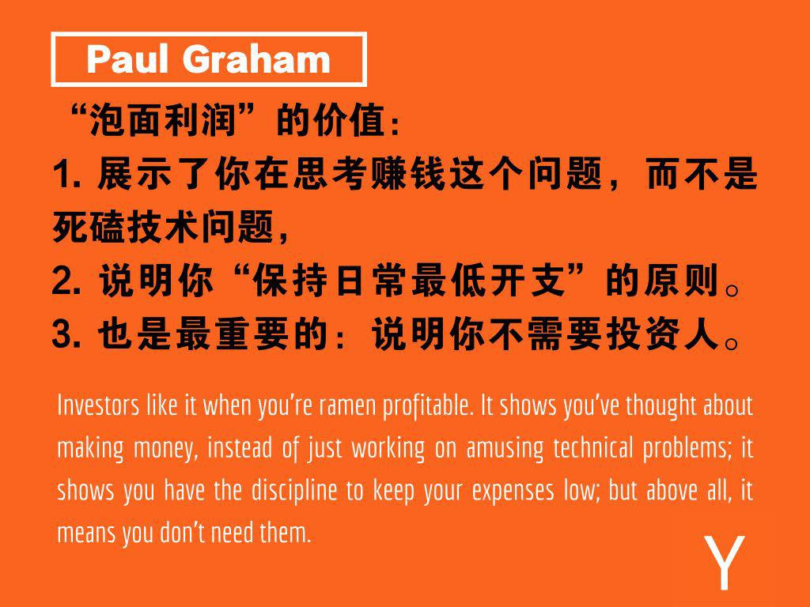
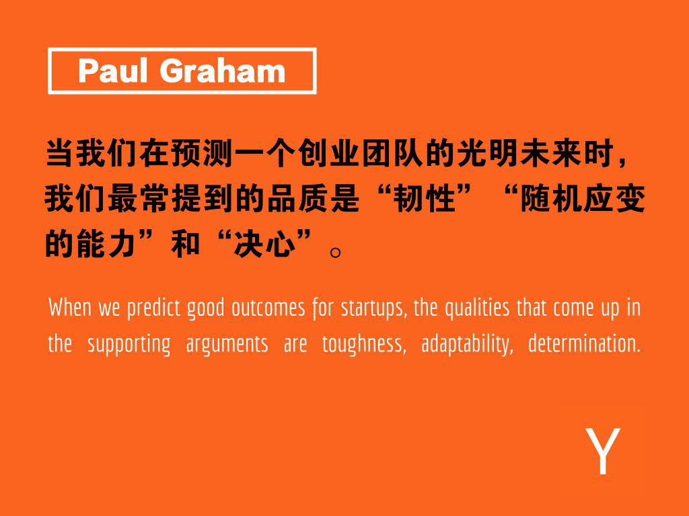
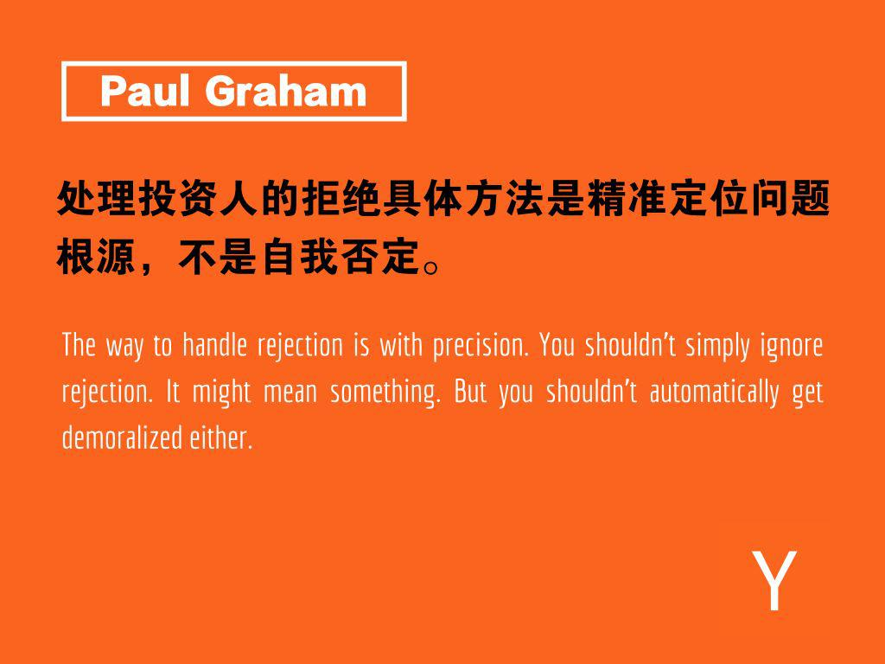
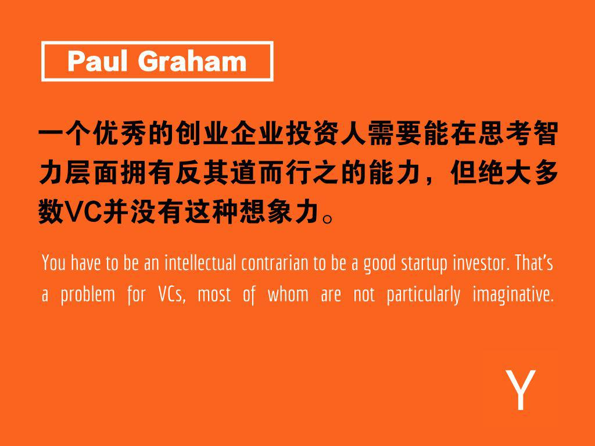
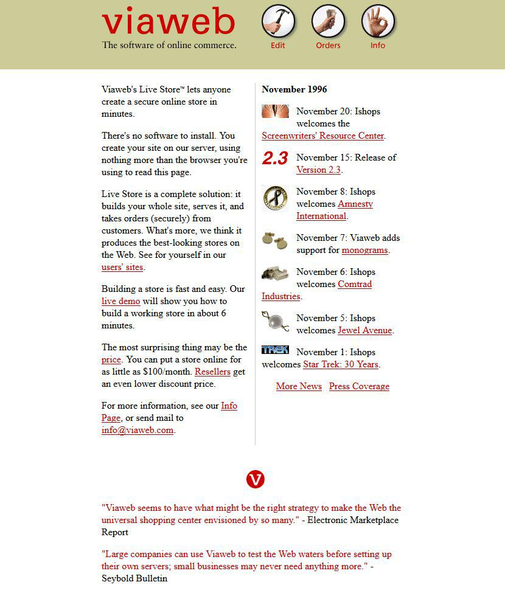
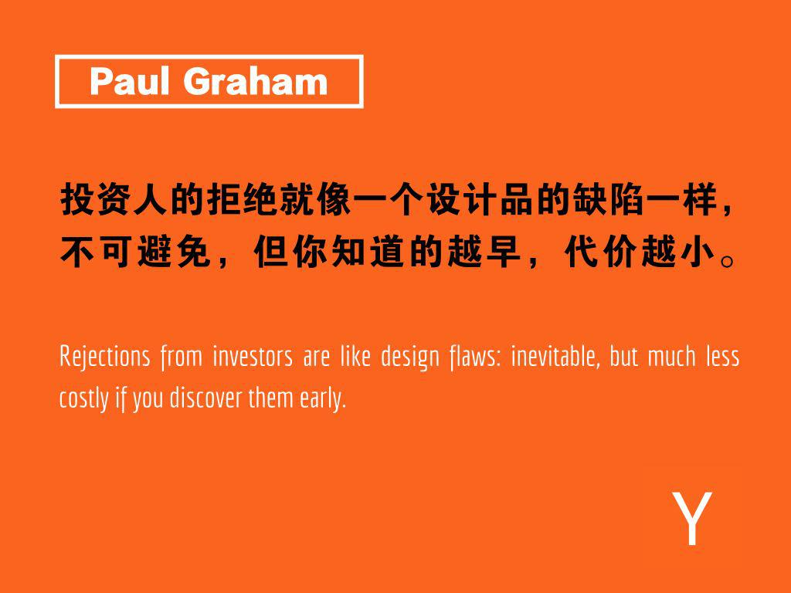
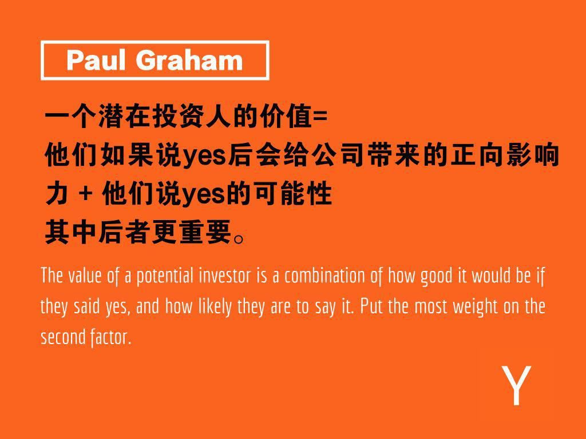

## 融资生存手册：这两个问题，即使投资人问了你也不要回答_36氪  

> 发布: YC中国  
> 发布日期: 2019-06-05  

编者按：本文来自微信公众号[“YCombinator创业孵化器”](https://mp.weixin.qq.com/s/BhXsaLNQBDk8Ga4Y7E5y1Q)（ID：YCCN-startups），36氪经授权发布。原题目《两个千万不要回答投资人的问题》

硅谷哲学家，YC创始人Paul Graham从不走寻常路，这篇《融资生存手册》同样也是。

承接[上次的文章](https://36kr.com/p/5193810)（👈戳），PaulGraham展现了投资人的真实世界，描写了投资人世界里的选择困难症和各种焦虑，同时也给创业者提供了跟他们打交道的一系列思考和建议。

###  **4\. 要机灵**

有两个问题，VC问你，你千万不要回答：

“你还在跟哪家投资机构谈？”

“你打算融多少钱？”

没有VC会认为你真的会回答第一个问题，他们只是问一下，万一呢！

他们倒确实希望你回答第二个问题，但 **我不觉得你应该给他们一个具体数字** 。不是要跟它们玩游戏，而是你自己就不应该有一个固定的融资金额。

之所以会有一个固定的融资金额概念，其实是历史遗留下来的老派概念。那时候，创业意味着需要建一个厂房，或者雇50个人，很显然如果融不到足够的底线，是开不起公司的。但如今几乎没有科技公司还有这种需求。

我们会建议创业公司根据自己已经的进展，提供投资人几种不同的投资方式：

比如：

1） **最少投资5万美金** ，可以让创始团队付得起一年房租加一年伙食费。

2） **投资几十万美金** ，可以让团队租一个办公室，并雇佣一些刚走出校门的聪明学生。

3） **投资几百万美金** ，可以让团队真的把这事儿做起来，搞大。

这个传递的信息就是：我们不管怎么样都会做下去，都会成功。你们投我们，只是帮我们更快的到达这个目标而已。

如果你还在融天使轮，这轮的大小可能每秒都在发生变化。那我建议不如把一开始的那一轮做的小一点，然后慢慢增加。这种方法比一次性想要融一大笔钱，但后来发现融不到，反而丢掉已经答应的投资人来的好。

你甚至还可以把这轮做的没有明确融资金额，只是给每一个答应投钱的投资人一个一个单独给股份。这种方法可以帮你打破融资僵局，因为只要有第一笔钱进来，你就可以开始继续工作了。

###  **5\. 要独立自主**

一群20岁出头的创始人的日常支出可以低到赚2000美金就可以开始盈利。

作为一家公司，这个盈利额是可以几乎忽略不计的，但它对于士气和融资底气的影响确实无与伦比。在YC我们会用“泡面利润”（Ramen Profitbility）来描述这种收入正好勉强cover公司日常支出的状态。一旦你进入“泡面利润”，一切就开始发生改变。是，你仍然需要融资来变大，但至少不急在这个月了。

常见创业者晚餐柜

Source：@DyadicGames

开始创业的时候，你是没法预计“到第几个月我就可以开始盈利了”的。但如果你发现，只要自己稍微再在销售上努力一点点，就可以进入“泡面利润”，就赶紧行动起来。

投资人对“泡面利润”是喜闻乐见的。这展示了你的确在思考赚钱这个问题，而不是死磕技术问题，同时也说明你一种“保持日常最低花销”的原则。但这些都不重要，最重要的是：这意味着你并不必须需要他们。

投资人最喜欢的就是一个不需要他们都可以成功的创业团队。投资人非常愿意帮助创业团队，但他们不愿意帮助一个没了他们会死的团队。

在YC，我们会花很多时间去分析预测我们投的创业团队在未来会怎么样，因为我们想学如何挑选冠军团队。到今天，在看了无数创业团队的发展轨迹后，我们在挑选团队这个问题上开始越来越有感觉。

每当我们聊哪个团队会成功时，我们发现自己说的最多的几句话是“这个团队可以自力更生，他们OK的“。而不是“这些人很聪明”，或者“这些人在做的是一个绝妙的改变世界的点子“。当我们在预测一个创业团队的光明未来时，我们最常提到的品质是 **“韧性”，“随机应变的能力”，“决心”** 。这也意味着，假如我们正确的话，这些就是你需要拥有的品质。

无论有意识还是无意识，投资人都很明白这一点。之所以会出现“你越不需要他们，他们越愿意投资你”这个现象，不仅仅是因为别人碗里的总是更好的，更是因为这是创业团队成功的必备品质。

###  **6\. 不要把投资人的拒绝当做对个人的否定**

被投资人拒绝会让你开始自我怀疑，毕竟他们比你更有经验。如果他们觉得你的项目不行，可能我项目真的不行？

可能是不行，可能也不是。处理拒绝的方法是精准定位问题根源。你不应该完全无视拒绝，因为拒绝里肯定包含了一些重要信息是你之前没意识到的。但你不能让拒绝摧毁士气。

要真正理解拒绝的含义，你首先要意识到拒绝是一件多么频繁的事情。从数据上来说，VC基本上就是一个拒绝机器。David Haonik，August基金的合伙人就跟我说过：

我这边的数据是一般每500～800个收到并阅读的商业计划中，只有50～100个会有机会跟我预约1小时左右的面聊时间。

这其中，大概只有20个公司我会感兴趣，里面5个左右我会格外感兴趣并开始做大量的调研功课。最后，这一年我可能只会成交1～2个投资。

所以现实并不是站在你这一方的。你很可能是一个很优秀的创业者，在创造一个很有意思的东西，但仍然，你能获得VC风投的几率是非常低的。

天使投资人倒不会这么挑，但VC到最后几乎会把每个人都拒了。这是因为VC的整个商业构架也就允许每个合伙人一年投最多两家公司，无论有多少项目曾经接触过他们。

不仅现实不站在你的一边，大多数投资人也不擅长判断一家创业公司是否优秀。判断创业公司比判断其他很多东西都难，因为最优秀的创业想法很容易乍一听很不符合常理。一个优秀的创业想法不仅要优秀，还要新奇。一个又新奇又优秀的创业想法对绝大多数人而言可能听起来会很诡异。不然肯定就有人开始做了， 也就不可能新奇了。

这也是为什么判断创业公司是否优秀会更难。 **一个优秀的创业企业投资人需要能在思考智力层面拥有反其道而行之的能力，但绝大多数VC并没有这种想象力** 。VC们基本上就是一群有钱的大佬，不是站在一线革新创造的人。天使投资人会更擅长欣赏理解新奇的创业想法，因为他们大多数人本身就是创始人。

所以当你被拒的时候，你要挖掘里面的信息，而不是其他有的没的。

如果投资人给了你一个明确的为什么不投你的原因，用它好好审视一下自己的公司，问问自己他的话对不对。如果发现公司的确有问题，那就解决问题。但也不要他们说什么就是什么。你才是自己产品和公司的专家，你拥有最终决定权。

并不是每个拒绝都会带理由，但光拒绝这个结果来说，你至少也能get你的pitch是有进步空间的。找到pitch里不够有力的部分，修改它。不要只是想“投资人都是傻子“。他们很可能是傻，但你的任务是找到公司或pitch里的问题，具体是从哪里他们开始失去兴趣的？

不要让”拒绝“堆积成一坨想到就不爽，但不去分析归类的山堆。分析，归纳它们。要相信，分析完以后，你会更精准的知道自己的问题在哪，并且应该怎么处理。

###  **7\. 在必要情况下， 降级成咨询服务公司**

咨询服务公司，就像[我上次提到的](https://36kr.com/p/5193810)（👈戳），是个危险但可以资助创业公司生存的方法。虽然危险，也好于死掉。

这有点像厌氧呼吸：肯定不是最好的长期解决方法，但可以把你从此刻的危机里解救出来。如果你完全没法从投资人处融到资，降级成咨询公司是一个可以短期解决生存问题的方法。

但这个方法有一定的适用企业类别。比如谷歌就不能靠这个方法生存，但如果你的公司是做搭建网站的必备软件的，你可以很“自然”的增加一个帮助客户搭建自己网站的服务。

只要你注意不要陷在咨询服务里出不来，这甚至有可能会成为一个优势。如果你开始帮你用户用自己的软件搭建网站，你就可以更好的站在用户立场理解问题。而且作为一个咨询服务类公司，你甚至可能签到一些，在你纯做软件产品时签不到的大公司。

在我第一个创业项目Viaweb开始的时候，我们被迫以一个咨询服务类公司生存了一段时间，因为我们实在太需要用户了，我们就开始提供帮注册用户用我们的软件搭给他搭建网站的服务。但我们从来没有给这个服务标价，因为我们不希望他们开始产生一种“这是一家服务公司”的意识，然后每次网站有什么问题了就开始给我们打电话。我们知道自己一定是一个产品公司，因为只有做产品才能存在规模。

Paul Graham的第一家公司viaweb

Source:webdesignmuseum

###  **8\. 拒绝新手投资人**

虽然新手投资人看起来一点威胁力都没有，但他们才是最危险的一群投资人。因为他们太紧张了，尤其是对他投的那笔钱。从一个新手投资人手上融2万块的工作量堪比从一个VC基金里融2百万。

而且新手投资人的律师一般也是新手。更可怕的是 ，即便新手投资人可以承认自己在投资方面并没有经验，律师可不能这么承认。

有一次，一个我们投的公司跟一个新手天使投资人谈妥了一轮很小的投资，结果收到了律师将近70页的合同。而且因为律师不敢在自己的用户面前承认自己不懂做砸了，就死命坚持这70页的苛刻条款，结果这个投资黄了。

当然，肯定要有人从新手投资人处开始拿钱，新手才会慢慢不再是新手。但如果你是那个人，要么1） 一切都是你自己这边来，包括提供法律文件，或者2）只允许这个新手是你接下来融的一大轮里，填小洞的存在。

###  **9\. 知道你当下的真实处境**

投资人最危险的时候就是他们纠结症爆发的时候。最悲惨的结局就是他们在跟你进行了几个月无数轮面谈后，最终给了你一个NO。投资人的拒绝就像一个设计品的缺陷一样，不可避免，但你知道的越早，代价越小。

所以在你跟投资人交流的过程中，可以时不时的了解一下你当下的现实处境。真实的问问自己：你得到这个投资意向书的可能性有多大？他们首先需要被说服的是什么？你当然不应该直接问他们这个问题，他们会觉得你很烦，但你得时刻搜集这方面的各种数据和信号。

你不去push投资人的话，他们大概率会很抵触给一个明确的承诺。他们的做事方法核心就是获得最多的信息，同时做最少的决定。促使他们行动最好的方法当然是找到跟他们有竞争关系的其他投资人，但你也可以在他们的专注度上加压：问一些他们自己可能正在纠结的具体问题，然后提供你的答案，来帮助他们做决定。如果你已经通关了好几轮但新的问题还在不断的冒出，就可以基本判断这家公司可以不用继续聊了。

你在搜集投资人意向信息的时候必须要保持大脑的独立运作。要不然，他们对你的投资误导，加上你自己一个其实希望被误导的意志会结合在一起，产出完全不真实的信息结果。

用这些搜集来的数据来判断你的融资战略。你大概会跟好几个投资人同时交流，把注意力放在那些最有可能说Yes的投资人身上。 **一个潜在投资人的价值=他们如果说yes后会给公司带来的正向影响量+他们说yes的可能性** 。把更重的码放在后者。

部分原因是投资人本质价值是投资，不是其他。另一部分原因，就像我上次提到的，[是一个投资人对你的意见会影响到一批投资人对你的意见](https://36kr.com/p/5193810)（👈戳）。得到一个yes，基本上约等于增加了所有其他yes的可能性。所以说服最容易说yes的那个投资人是最佳方法。

总结一下，初创公司往往会低估融资的难度，他们会走流程式的完成前几步，然后到真正要钱的那一步突然发现，钱要不到，然后整个军心士气因此涣散，最终放弃。

所以我希望通过这篇文章，让创业者们开始意识到融资是一个高危险系数的过程， **并且提前告诉你们：** **融资很难。**

**编译：梅姗姗**
