## 如何基于Flink+TensorFlow打造实时智能异常检测平台？只看这一篇就够了  

> 原创：  
> 潘国庆  
> 发布: AI前线  
> 发布日期: 2019-06-30  

 作者 | 潘国庆  编辑 | Natalie  **AI 前线导读：** Flink 已经渐渐成为实时计算引擎的首选之一，从简单的实时 ETL 到复杂的 CEP 场景，Flink 都能够很好地驾驭。本文整理自携程实时计算负责人潘国庆在 QCon 全球软件开发大会（北京站）2019 的演讲，他介绍了携程如何基于 Flink 与 TensorFlow 构建实时智能异常检测平台，以解决规则告警系统准确率低、时效性低、规则配置复杂与耗费人力等诸多问题，实现了业务指标毫秒级延迟与智能化检测，同时依托 Flink 实现了强大的容错机制。

**更多优质内容请关注微信公众号“AI 前线”（ID：ai-front）** 1．前言

随着互联网的迅速发展，各个公司都建立了自己的监控体系，用于提前发现问题降低损失，携程亦是如此。然而携程的监控体系存在以下三个问题：

* 监控系统繁多

* 监控告警配置复杂

* 没有统一规范

首先携程目前光公司级别的监控系统就有三套，各个 BU 为了满足自己的业务监控需求也陆续开发了许多自己的监控系统。其次这些监控系统都是基于规则来判断是否存在异常，比如当满足同环比连续几个点上升或下降到用户配置的阈值时触发告警。最后是没有统一的规范，这里指的是两个规范，第一，没有统一的规则告警配置规范，不同的监控系统都带有不同的规则告警配置方式；第二，没有统一的异常判断规范，研发人员或 QA 人员都是根据自己对业务的理解，通过主观判断指标达到一定阀值时监控系统需要进行告警。

基于以上的三点问题给用户带来了诸多不便，首先是规则告警维护成本高，用户时常需要基于多个监控系统以不同的方式配置规则告警，而且还需要根据告警的情况持续调整阈值，导致一个规则告警从配置到最终能够产生较好的效果需要一个很长的周期。其次，基于规则告警往往表现不尽如人意，会导致准确率低、覆盖率低和时效性低的三低状况。用户很多情况下为了提高异常的覆盖率降低漏报的情况，不得不将规则告警的阀值设置的非常敏感，虽然这样能够覆盖更多的异常场景，却导致了大量的误报，规则告警的准确性也就大大折扣。

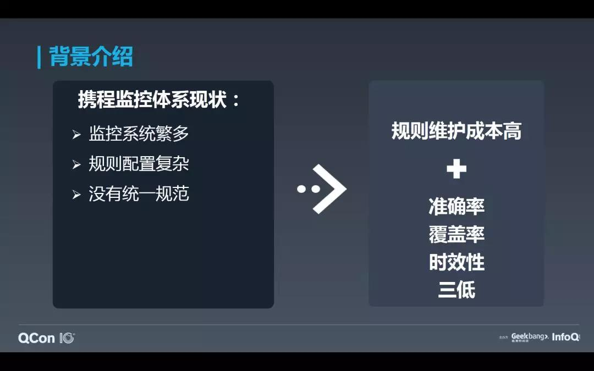

为了应对上述的诸多问题，携程打造了自己的实时智能异常检测平台 Prophet。简单概括，Prophet 是一个基于时序类型数据、以平台为接入对象、去规则化为目标的异常检测系统，基于深度学习算法实现异常的智能检测，基于实时计算引擎实现异常的实时检测，提供了统一的异常检测解决方案。接下来的文章会详细介绍我们是如何依次实现了异常的智能化、实时化检测以及平台的构建。

2． 智能化 2.1 深度学习算法选择

目前业界采用比较多的方式是引入统计分析的各种方法，框定一个滑动的样本集，对这个样本集进行一些数据处理和转化，经过归一化，去周期，去趋势，再将最新采集到的数据点经过同样的转换，和样本集的残差序列的统计量进行比较，比如距离、方差、移动平均、分位数等，超出一定的范围就判断为异常，或是综合各种离群点计算的方法来做个投票，多数算法认为异常则报异常。起初我们也借鉴了这种做法，却发现虽然可以不用维护告警规则了，但报警的质量并没有提升。

我们需要设计一套新的算法，降低报警总量到可以人工逐个处理的程度，同时不能以增加漏报真正的生产订单故障为代价，并且这套算法的设计还不能太复杂，影响到告警的实时性，最好还能做到算法即服务，有较强的可移植性，提供给其他的监控系统使用。自然而然的， **基于神经网络的深度学习算法** 成为我们进一步探索的工具。

RNN 算法比较适合处理序列变化的数据，符合我们时序特征的场景，但是存在梯度消失和过拟合的现象。而他的改进版 LSTM 算法，能够通过控制传输状态来选择性地记住较重要的长期数据，能在更长的序列上有良好的表现，业界也有很多成功的应用。LSTM 算法的异常检测方式是基于指标的历史数据训练出模型并基于现有数据预测指标未来的走势，基于预测数据与现实数据各种偏差来判断指标是否有异常。这样好处在于每个指标都会训练一个自己的模型，能够达到很高的精度，但是也带来了一定的弊端，需要消耗较多的训练与检测资源。

DNN 算法的检测方式与 LSTM 的方式不同，我们基于小波变换算法提取监控指标不同频域的特征喂给 DNN 模型，直接输出是否存在异常。这种的好处在于一个 DNN 模型就能够满足所有异常检测场景的需求，但是相对的特征工程也要复杂很多，我们需要大量的人工标记数据来提高模型的精度。

最后无论是基于 LSTM 算法还是 DNN 算法实现的异常检测需要根据各自所需的不同场景来决定使用哪个。在携程，对于最重要的订单、支付类指标，我们都是采取 LSTM 算法，单个指标训练单个模型，对于其他一些非重要的指标可以使用 DNN 算法。

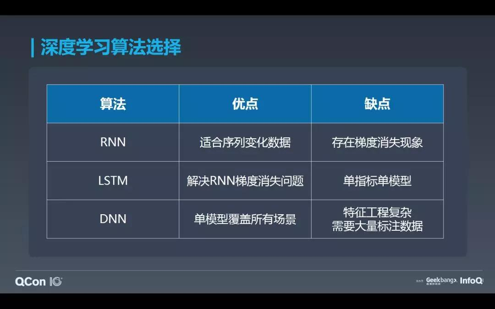

2.2 模型训练

选定好深度学习算法之后，我们也就开始尝试模型的训练。我们首先取得监控指标的历史数据对其进行清洗，其中需要对一些空值进行插补，节假日数据对于数据模型的影响很大，导致训练出来的数据有偏差，我们也选择性的剔除节假日期间的数据；如果历史数据中的某个区间数据是异常区间，我们也需要使用预测值替换异常区间的数值。

做完数据清洗之后，也就需要实现特征工程。我们使用了多尺度滑动窗口时序特征的方法，将一个滑动窗口内的数据和前 n 个周期做统计量上的对比，均值、方差、变化率等这些，这样基本上就可以把明显的周期性和平稳型数据给分离出来。剩下的时序中，有些是波动很大的随机序列，有的则是带有趋势的周期性序列，通过时序分析法把周期性去掉，再用频域分析尝试分解成频谱。对于带有明显频谱的，则归类为周期型时序，而频谱杂乱的，则归类为非周期性。

在做完特征提取与指标分类之后，我们也就根据指标的类型使用不同的算法进行模型训练。我们根据线上的人工标注数据持续性的优化我们的模型。我们经历过初期不停的调参和验证之后，我们将模型训练的频率设为了两周，我们每两周重新走下图中的整个流程，这个也是根据我们业务变更的频率所做的考虑。

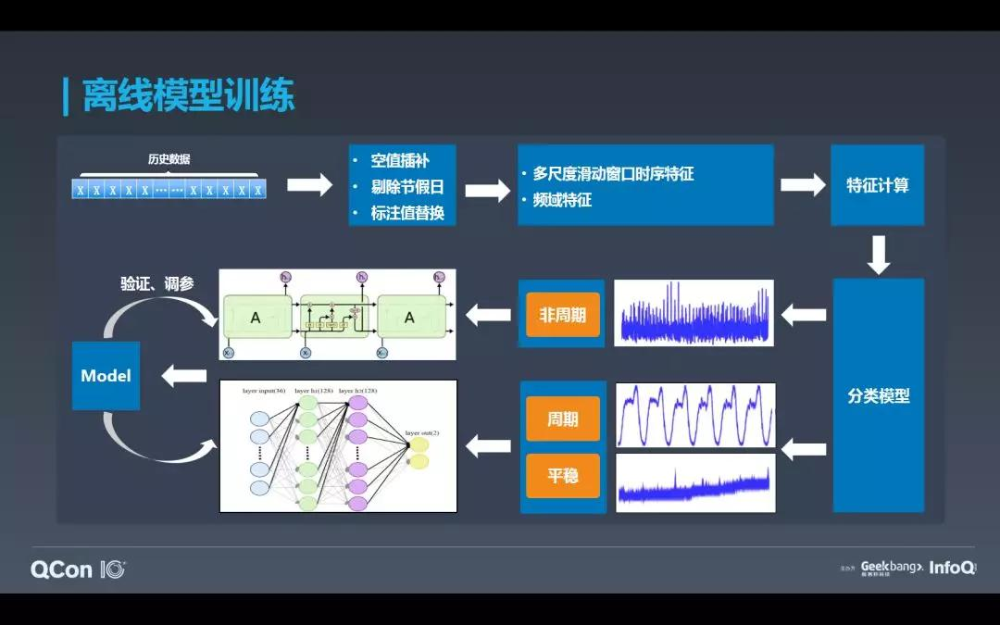

3． 实时化 3.1 Why Flink？

在解决了智能化异常检测的问题后，我们开始考虑提高我们的时效性。以往的规则告警，从数据产生到落地到监控系统，再到触发规则判断，期间已经经历了一定延迟。并且很多规则告警往往需要连续 3 个点或则 5 个点触发下跌或上升规则判断才会告警，这样如果一个指标的采集粒度是一分钟，那么异常往往需要过好几分钟才会被发现。为了解决时效性的问题，我们尝试引入实时计算引擎。现在常见的实时计算引擎有 Storm、Spark Streaming 以及 Flink，那么为什么我们最终选择了 Flink？

首先第一点就是 Flink 提供了强大的容错保障，所有的实时作业无论提供了多么繁多的功能，如果在作业的容错保障上做的不好，对于用户都是不可接受的。我们的数据源是 Kafka，基于 Flink 的 Checkpoint 与 Kafka 的 Offset 回溯功能能够实现数据源到执行引擎层面的 Exactly Once 的语义保证，基于幂等或事物保证最终输出的 Exactly Once 语义。

第二点，Flink 提供了高效的状态管理，我们在做异常检测的时候需要保存异常区间的预测数据用于下一轮的异常检测，这个后续会讲到。

第三点与第四点放在一起讲就是，Flink 提供了基于 Event Time 的丰富窗口函数，Spark Streaming 虽然也提供了对窗口的支持，但是其本质上还都是基于 Processing Time 的数据处理。终上所述，我们最终选择了 Flink 作为我们的实时计算引擎。

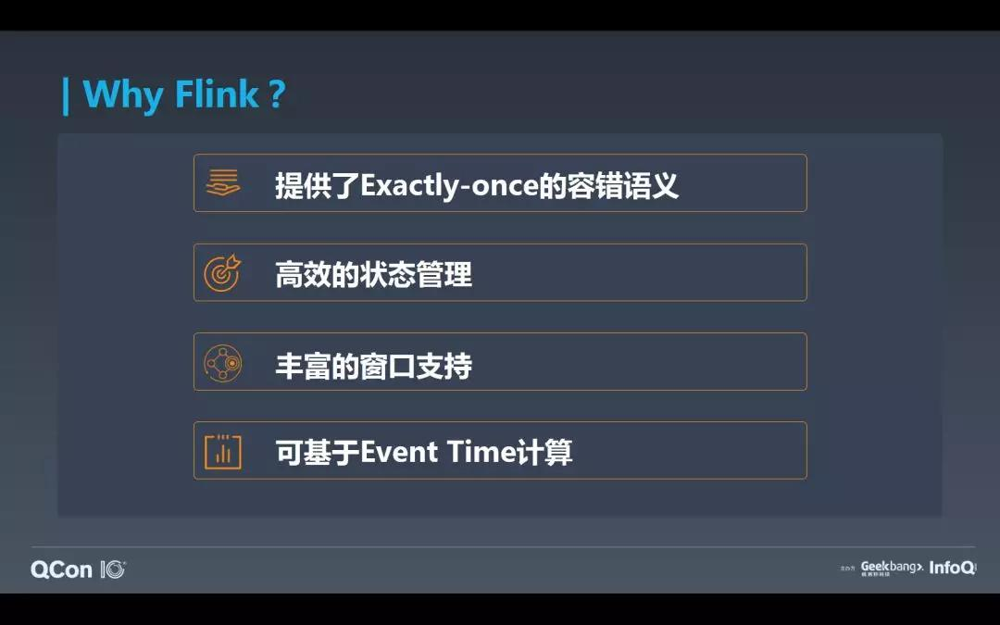

3.2 实时检测

在选择好实时计算引擎后，我们也就开始尝试在 Flink 中加载 Tensorflow 的模型用来实时做异常检测。首先我们将所有训练好的 Tensorflow 模型以.pb 的格式上传到 HDFS 并将新增或更新的模型配置更新到配置中心 QConfig 上。Flink 作业在启动或运行中时，监听配置中心中需要监控的指标并尝试从 HDFS 上加载模型。由于后期模型较多，为了避免重复加载和负载均衡，所有指标会先根据 id keyBy 分发到不同的 TaskManager 上，每个 TaskManager 只加载属于自己那部分的模型。

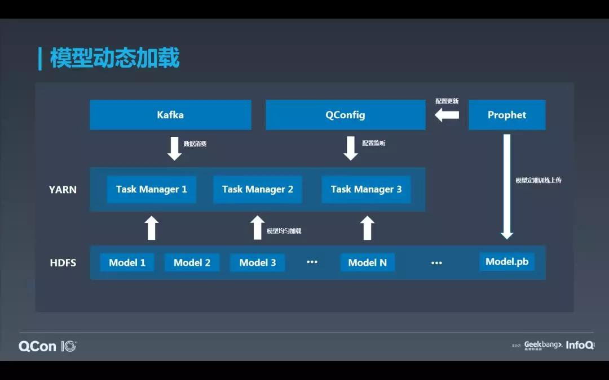

模型加载完毕后，我们基于 Flink 滑动窗口与 Event Time 实现数据实时消费与预测。窗口滑动的时间为指标的时间粒度（下图中为 1 分钟），窗口长度为十个指标时间粒度（下图中为 10 分钟）。一个窗口中总计 10 条数据，我们采用前面 5 条数据预测第 6 个位置的数据，然后基于 2 到 4 的实际数值加上第 6 条的预测数据预测第 7 个数据。依此类推，最终我们获取到了窗口中后 5 位的预测值与实际值，基于 5 个预测值与实际值对比检测是否存在异常。

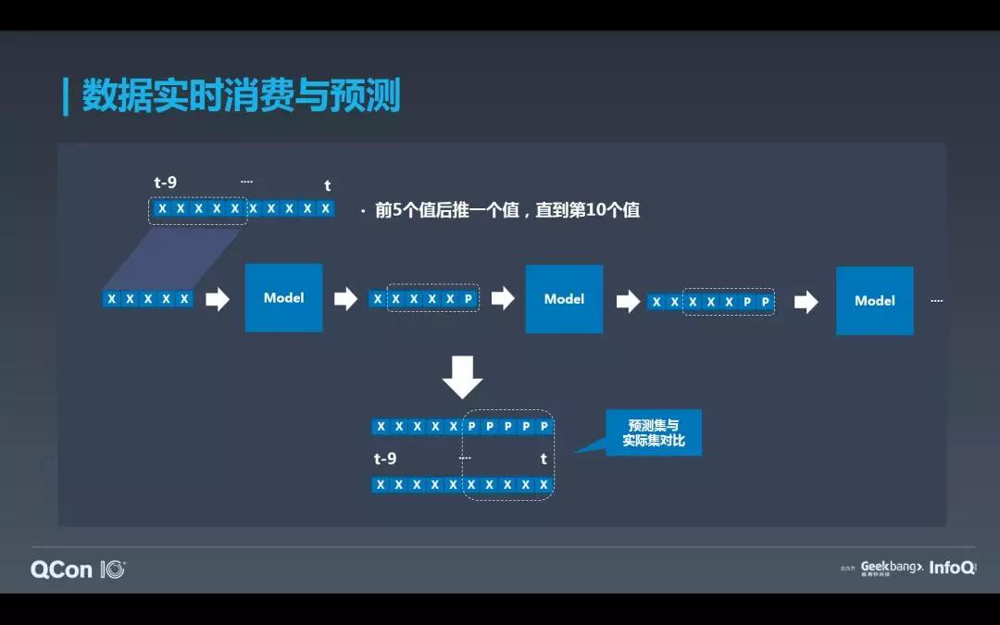

然而实际的消费过程中并不会像上面说的那么简单，首先一个窗口内可能存在缺失数据的情况，我们采用窗口内其余数据的均值与标准差补齐。其次，在上个时间段如果存在异常，我们无法直接使用原始的值去预测数值，因为这个原始值可能是一个异常值，我们需要使用上个时间段的预测值来替换这个异常值，这样能够保证我们的预测线不被带跑偏。上一个窗口的预测值我们采用 flink 中的 state 来存储。

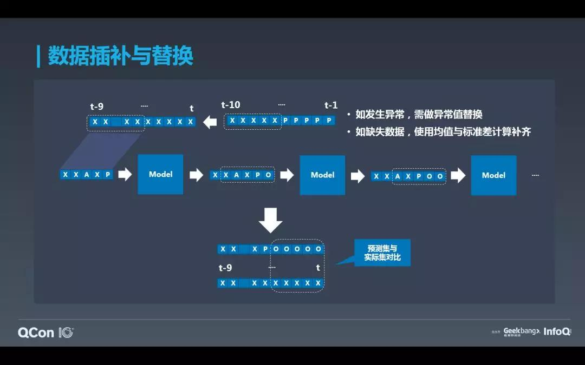

在取得当前窗口后 5 个预测值与实际值之后，我们就开始进异常检测了。我们会根据异常的类型（比如上升或下降）与敏感度来做不同的判断，下图中的三个异常曲线分别对应了高中低三个敏感的场景，在使用高敏度时，可能只要有一个下跌的抖动，我们可能就认为其是一个潜在的异常，中敏感度需要连续两个下跌的情况，低敏感度则需在下降幅度非常大的情况下才会认定为潜在异常。

我们会基于预测值与实际数据的偏差来先做一个潜在判断，当认定它是一个潜在异常时，我们会在基于预测值与历史同期数据的均值与标准差做判断，这样最终得出当前的窗口是否存在异常。我们这边在异常判断的时候还是采用了统计学作为判断方式，如果在样本足够的情况下，完全可以使用机器学习，训练一个异常检测模型来判断是否存在异常。

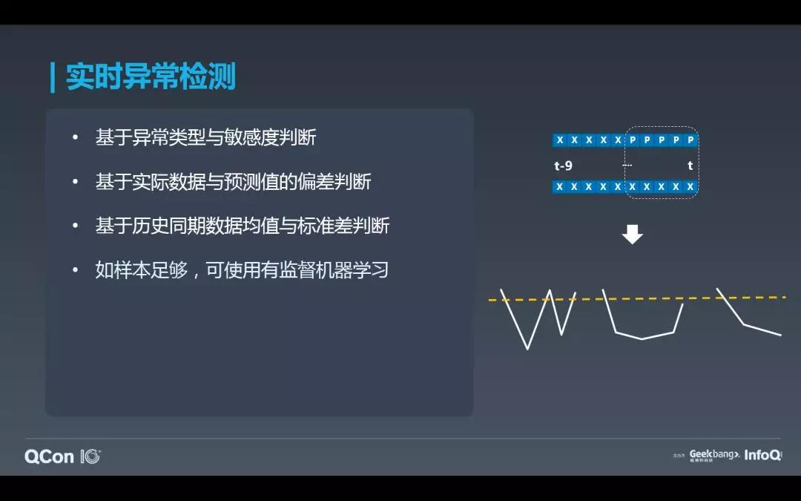

4\. Prophet 4.1 Prophet 系统架构

在讲述完如何实现智能化与实时化异常检测之后，相信大家对于 Prophet 已经有了一定的认知。下图展示了整个 Prophet 平台的系统架构，首先是最底层的 Hadoop 集群承担了分布式存储与资源调度的功能，HDFS 用来存储 Tensorflow 训练好的模型，所有 Flink 作业运行在 Yarn 集群上。中间层的消息队列承担了实时数据源的作用，所有指标的历史数据存储在时序数据库中，实时化与智能化检测依托于 Flink 与 Tensorflow 两套引擎实现。最上层的 Prophet 以平台的方式对外提供服务，Clog 用于日志存储与排障，Muise 是我们的实时计算平台，Qconfig 用于存储于监控指标相关的配置信息，最后 Hickwall 用于监控作业的各项指标。

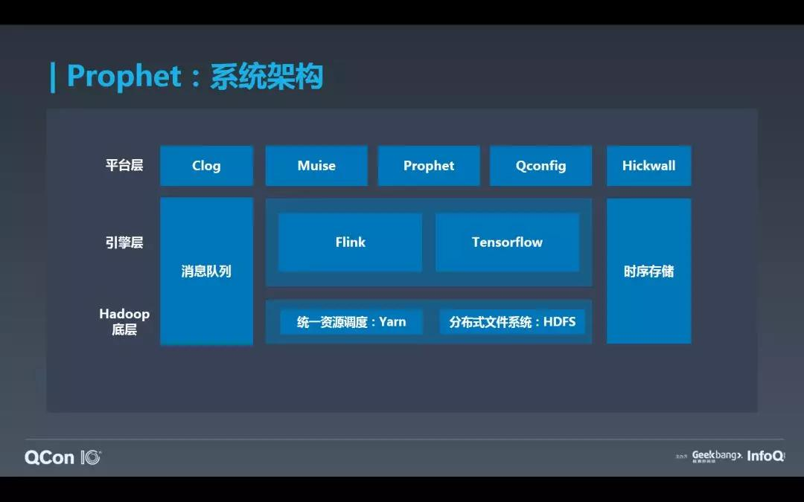

4.2 Prophet 操作流程

一个用户想要配置智能告警只需要做两件事，首先在我们的平台上配置智能告警，由于我们大部分对接的是监控平台，所以用户大多是在各个监控平台上配置智能告警，然后监控平台调用我们的服务注册监控指标。然后用户需要按照我们定义好的格式将原始数据发送到我们的 Kafka 消息队列，这一步在对接平台时，也由平台做了，所以直接在我们平台上配置监控指标的用户很少。当一个用户注册好监控指标后，我们平台会先检测该指标的历史数据是否足够，如果足够则触发模型训练的流程，训练好的模型会上传到 HDFS。如果历史数据不足，Prophet 会持续实时存储用户指标的数据，当满足数据量的需求时，重新触发模型训练。当模型训练完成后，我们会更新配置中心，告知 Flink 作业有新的或更新的指标模型已经就位。

实时这块的流程是 Flink 启动或运行中一旦监听到有新的或更新的模型，作业会重新加载模型。另外 Flink 会实时从 Kafka 中消费数据，实时的过模型做异常检测，最终将异常告警回吐到 Kafka，各个平台消费自己的异常告警数据并给相关的负责人发送告警通知。

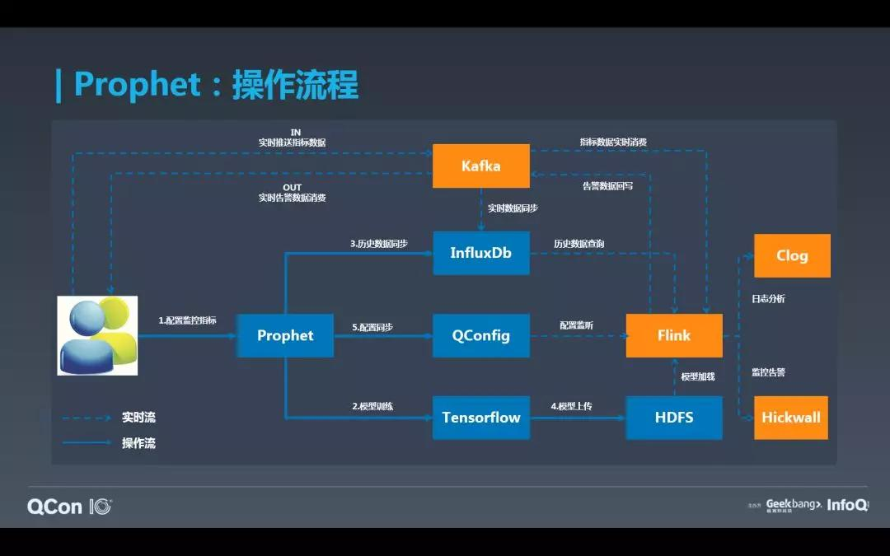

4.3 平台现状

目前 Prophet 已经覆盖了携程所有的业务线，接入了十余个监控平台，其中包含公司级的监控系统 Sitemon 与 Hickwall，监控了 7000+ 个业务指标，包含订单、支付、应用、服务等多种业务类型指标。

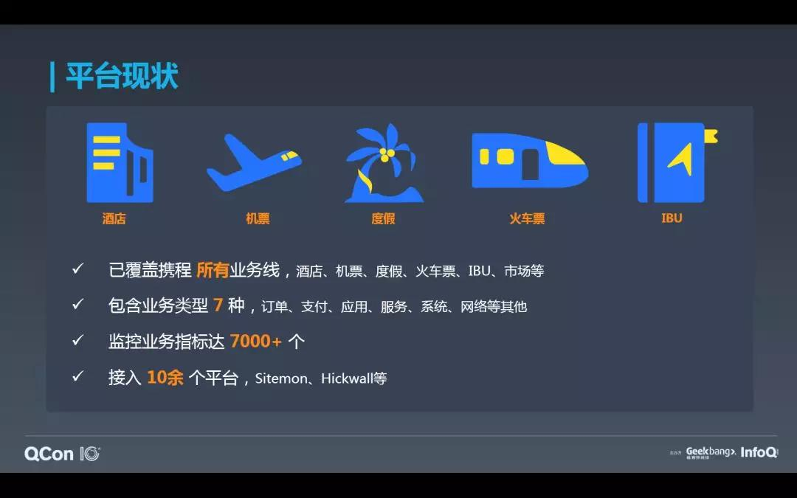

在平台运行的半年时间内，我们的算法能够达到 90% 的召回率（也就是异常覆盖率）；由于我们业务方需求是尽量覆盖更多的异常，不要漏报，所以我们的准确率保持在 75% 左右；在引入了 Flink 实时消费数据与检测，极大的降低了我们告警的延迟，达到了毫秒级的延迟；对比规则告警，我们帮助用户降低了 10 倍的告警数量，提升了 10 倍的用户效率。

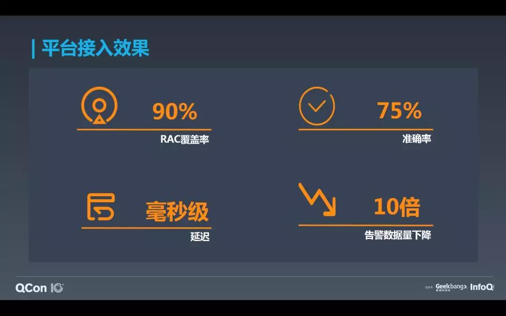

下图展示了从 18 年 10 月 Prophet 上线以来至 19 年 4 月底，智能告警与规则告警对异常的覆盖率对比。总计发生 176 起异常，其中 Prophet 图表中显示的是覆盖了 90% 的异常，但其实真正的覆盖率要高于 90%，其中 18 个未覆盖异常有 15 个是由于初期算法一直处于调整阶段导致了漏报。在 19 年之后，我们的异常覆盖率能够达到接近 100%。相比较规则告警，我们的覆盖率上升了 22%，及时的帮助用户降低损失。

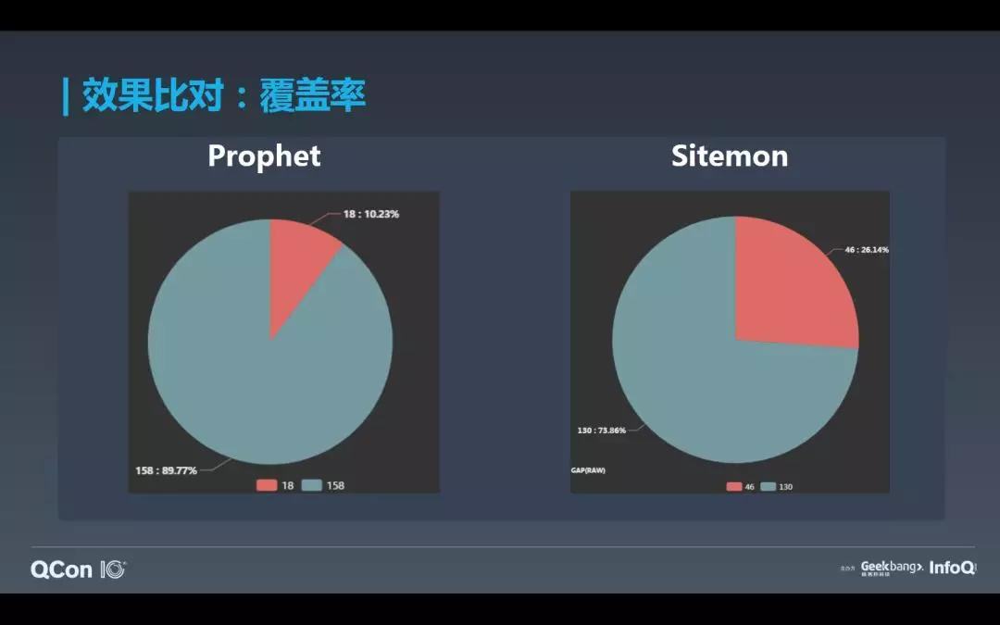

下图展示了智能告警与规则告警在告警数量上的对比，规则告警的数量基本是智能告警的 2 到 5 倍，但是这并非是站在同一层面上的对比，其中智能告警的数量是基于 800 监控指标，而规则告警是基于 200 个监控，如果规则告警的指标数量与智能告警的持平，那智能告警降低的告警数量会更为显著。告警数量对于用户的效率提升是十分明显的，以往用户每天需要花费大量的精力去排查每一个告警邮件，在使用了智能告警后，这部分帮助用户减少的时间是实实在在的效率提升。

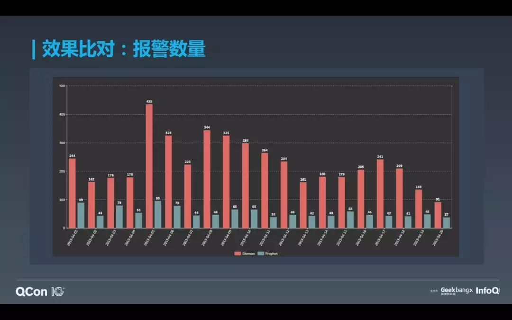

5． 挑战与展望

Prophet 在携程投入生产使用已有半年之久，在这期间我们也遇到过形形色色的挑战。

首先，基于 LSTM 算法的异常检测方式存在一个明显的弊端，我们需要对每一个指标训练一个模型，这样无论是模型训练所需的资源以及实时作业加载模型所需的资源都消耗比较大。

其次，LSTM 算法对于波动剧烈的非周期型指标表现不是十分良好，有一些业务会不定期的做一些活动导致业务指标的突增或突减，这种趋势是无法从历史数据中学习到。

然后，对于一些系统性能指标类型的数据也无需使用智能告警，规则告警可能更加方便，比如当服务器的 cpu 使用率达到 95% 的时候就告警。

最后，节假日对于智能告警的影响十分之大，业务指标通常会在节假日前呈倍数的增长，假日期间又曾倍数的下降，这样导致了大量漏报或误报。

针对以上的问题，我们也在持续的改进之中。首先，基于 DNN 算法的通用模型已经在线下陪跑了数月之久，虽然在精度上比 LSTM 算法的异常检测方式稍有逊色，但在我们持续优化之后已经基本能够 hold 住线上非重要指标的告警需求，实现单个模型监控数千个指标的功能，大大降低了资源损耗。我们在应对节假日对智能检测影响时引入了增长系数的概念，用来拉升或降低预测值，并且采用一定方式将增长系数持续衰减，防止增长系数导致预测值的跑偏。 **关于算法的细节以及各种场景下的应对方式由于篇幅关系无法在本篇文章中一一展开，如果对算法相关细节感兴趣的朋友可以在评论区留言，我们这边也会考虑让算法同事另起炉灶，详细的介绍算法、特征工程等相关话题。**

Prophet 后续也会陆续的接入携程所有的监控系统，这也是我们一直努力在做的事。实时计算与人工智能不光在异常检测这个场景下有很好的发挥，在很多其他的场景下也能够有亮眼的表现，比如风控、个性化推荐、排序等，本篇文章也算是抛砖引玉，希望给大家能够带来一些其法，这样可以将这套方式更多的使用在其他的场景下。

> ##### 今日荐文

点击下方图片即可阅读

[

自动驾驶狂欢落幕：靠一个demo就敢宣称落地的时代过去了

* * *

限时福利

「在线约聊」和京东一起聊聊5G时代下的视频和流媒体技术，7月2日，线上见~扫码下图二维码或者点击【阅读原文】免费报名~

* * *

**你也「在看」吗？** ****👇
