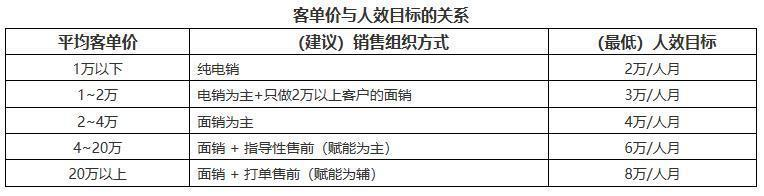

## 如何评估SaaS公司的经营状况？| SaaS创业路线图（49）  

> 发布: 吴昊@SaaS  
> 发布日期: 2019-06-11  

编者按：本文来自微信公众号[“SaaS白夜行”（ID：SaaSKnight）](https://mp.weixin.qq.com/s/tROrtviMiM-X36VK0bz8jg)，作者吴昊SaaS，36氪经授权发布。

**作者介绍** **-** 吴昊，SaaS创业顾问，纷享销客天使投资人、前执行总裁，8年SaaS营销团队创新+13年企业信息化经验。目前在为SaaS公司提供战略咨询，重点是市场、销售、服务团队的规模化。

（SaaS创业路线图）

\#SaaS创业路线图\#系列的[第2篇](http://mp.weixin.qq.com/s?__biz=MzIxNjc2MTc2MQ==&mid=2247483732&idx=1&sn=9e39952564254d9e1f8a4325d982d4a1&chksm=9785559aa0f2dc8c9aecce96054959d7106e380ff5d62f4e43195c891a9c794fc666655e580b&scene=21#wechat_redirect)提到，SaaS企业在上图的“效率”阶段需要建立指标体系。路线图系列到今天已经连续写了整整12个月了，过程中我又见了160多个SaaS公司，并通过咨询服务深度参与了几家公司的经营决策。

今天笔者就把这个指标体系完整描述一下，并给出评价标准参考值。

### 一、 **评价公司整体经营**

除了公司会计中的常见财务指标（主要在资产负债表、现金流量表、损益表里），SaaS公司也很关注LTV（客户生命周期价值）和CAC（客户获取成本）等行业指标。

我之前提出过，这些都是反映到财务数据上的“最终结果”。 **作为** **创业期的管理团队** **，我** **更看重能快速迭代的** **日常业务** **过程** **指标** **。** 遂成此文。

### 二、 **评价产品**

评估一个SaaS产品研发效率、效果的好坏，有很多指标可以用，我只推荐3个能通用的：

**\* 服务可用率。**

我们可以算一下，如果一个月中服务宕机了1次，时长15分钟（这对很多在线产品已经是非常糟糕了），该月的“服务可用率”为：

1 - \(15分钟÷\(30天 \* 24小时/天 \* 60分钟/小时\)\) = 99.965%

早期产品可用率可以略低一些，因为这要与版本迭代速度平衡好。进入扩张期后，客户数量已经较大，宕机影响非常负面，“服务可用率”应该设法做到4个9（99.99%），大致相当于全年只能有3次15分钟左右的服务宕机。

客户服务的核心思想是“分类分级”。从研发侧考虑，也可以把少量重点客户与大量普通客户分开部署在不同设备上，减少发生灾难影响范围。

**\* 模块用后留存率**

SaaS与传统软件的本质区别是续费。SaaS公司应该以留存客户为主要目的，而不需要与传统软件公司一样不断上新功能以期再次销售新版本给客户。

所以我们应该在开发一个新模块的决策上更加谨慎。那么如何衡量新模块上线后的效果呢？有一个很聪明的指标，就是“模块用后留存率”。

意思是，1000个企业用到这个模块（可能是产品中的自然引导，也可能是市场部的内容引导或CSM的人工引导），1个月后还继续使用的比率有多少？

这里的逻辑是：产品和研发不对进入的流量负责，但要多试用后的留存率负责。

**\* 开发过程Bug比率**

12年前我在华为时，看研发部门用的是“千行代码Bug率”指标。这2年我看这个指标演化为：版本开发过程中bug数 ÷ 版本开发人月。还有测试部门的“漏测率”等。这些我不往里深挖了，每家企业根据自己的情况选择。

### 三、 **评价市场**

我这一年见过的SaaS公司，在“客户来源”上基本都在两个极端，要么是成交客户中80%以上来自市场线索，要么是80%以上来自业务员自开拓，能做到两者平衡（各占50%左右）的SaaS公司不到5%。

也有一些CEO跟我说这是“产品性质的原因”，但回过头来又看到有些区域自开拓的比例很高......

我当然不能在这里下结论说“SaaS公司应该让开源方式均衡”。但起码可以说， **“过度依赖一种开源方式是不利公司发展的”** 。

**\* 成交客户中来自市场线索的比例**

如果要给个建议参考值，我认为要努力做到30%以上。有的SaaS公司太依赖业务员自开拓，而荒废了市场能力，这是很可惜的。

**\* 各线索通道的“线索有效比例”**

我理解由于组织能力和IT系统的原因，很多SaaS公司还难以做到Leads to Cash的完整跟踪。上个月与一个知名SaaS Marketing Tool的创始人聊天，我们估算大概只有不到30%的SaaS企业能够把这个数字算准确。这其实很关键，笔者建议进入公司扩张期后，要去找找合适的CRM+ Marketing工具，并提升组织的流程能力，真正解决这个问题。

除了分开“自开拓”与“市场线索”，市场线索中还要分“线下活动”、“自然流量”、“百度SEM流量”、“360SEM流量”，到底哪些投入产出比更大呢？如果尚未解决L2C的问题，至少可以看看销售的统计数字 —— 哪边来的“线索有效率”更高？

**\* 自然流量线索的比率**

这个可以衡量品牌和口碑的积累情况。完全不做品牌，会造成长期依赖百度投放，除了成本高昂，业绩的天花板也会很低。

当然，不同产品这个指标差别很大，一般来说我认为目标应该定在10%以上。

**\* SDR线索分类分级准确率**

SDR团队不负责成交，只负责初次联络客户，确定客户需求有效性并进行线索的分类分级。 **不同级别、不同行业的线索，交给不同级别、不同行业特性的业务员，将能够大幅提高线索转化率。**

如果有SDR团队（一般建议放在市场部里），对SDR的严格管理将非常重要。一旦SDR出现效率低下或道德风险问题，对公司整体业绩都有巨大影响。

因此建议设置QA岗，或SDR负责人兼任，通过抽查电话录音加强日常检查，并关注这个准确率指标。

### 四、 **评价销售体系**

初次见到一位SaaS创始人，我不会问LTV/CAC的数字，那些太抽象，而且数字往往是最近尚未更新的。我会首先问先这些问题：

**\* 平均客单价与平均成交周期**

一般来说，两者有很紧密的关系。

我和这么多SaaS团队聊过，总结大体情况如下，大家可以对比一下自己公司的数字：

\- 4万以下客单价，应该在初次接触客户后30天内完成首个签约付款；

\- 4~10万客单价，应该在初次接触客户后45~60天内完成首个签约付款；

\- 10~20万客单价，应该在初次接触客户后45~90天内完成首个签约付款；

再往上就不太好讲了，成交周期当然是越短越好。

按我的价值观，以上客单价指的是客户一年服务费用，不是一次收多年服务费的合同金额，但可以包括一年内的增购、扩容收入。

**\* 营销费率**

营销费率 = 销售、市场的费用之和 ÷ 销售收入。

这个公式的分子与CAC的分子一致。国内SaaS企业的营销费率大多在60~90%之间。理论上这个指标越低毛利越高，但也要考虑营销体系发展速度的问题，希望更快速度发展，成本（例如招募、培养新人的损耗）就会高一些。

这个数字由于也需要进行大量财务核算，在日常管理中也不容易获得。更好用的指标是这个：

**\* 人效（销售部门全员人均月单产）**

人效指标与客单价及销售组织方式有很大关联。比方说，低客单价产品，要求尽量少的人参与；客单价高的产品，就能够支撑更多人参与：前期需要SDR筛线索、中间需要售前技术支持......我画张表说明：

（电销：通过电话和线上互动完成销售过程；面销：以上门拜访为主的销售方式。）

原则上是电销能解决问题的，尽量不用面销。除了管理难度小很多，电销的优势是能够轻易覆盖全国，就不用设置那么多分支结构和开发代理商了，成本会大大减少。

当然，每家产品及市场情况有差异（特别是开源方式不同），上面这些目标数字会各有不同。

**\* 各线索通道的线索转化率**

在L2C的过程中，市场部负责前半段（对有效线索数量负责），销售部门负责后半段（对有效线索转化回款负责）。如果争议很多，建议设置SDR部门对线索进行分类分级。

### 五、 **评价服务**

CSM（客户成功部）是SaaS公司最重要的部门。还是那句话，SaaS的本质是续费，没有CSM的续费，SaaS商业模式不会成立。

**\* 续费率**

包括客户（数量）续费率和收入（金额）续费率。大部分公司会看重收入续费率，但我认为要根据情况判断：如果咱们是聚焦中小企业市场的，客户续费率也非常重要，不能用几单大客户的续费冲淡了大量中小客户流失的影响。

对于续费率低的SaaS公司，应通过客户分类，找到自己的目标客户群体（很可能就是续费率高的那一类客户），并为这个目标市场不断改变产品和服务，以期提高未来的续费率。

**\* 流失率 （ = 1 - 续费率）**

公式很简单，内涵却不同。SaaS公司应该在分类分级后，针对不同类型的客户进行流失分析。

**\* 新交付客户本月活跃率**

续费毕竟要一年后才发生，创业公司早期要加快CSM部门能力迭代速度，就得早日发现问题。因此可以多关注：上个月已付费、并已完成实施或简单培训的客户在本月的活跃情况。

**\* CSM（客户成功经理）平均服务客户待续费金额**

CSM不是客服热线（被动应答），而是一个需要根据运营系统预警或主动发现客户异常，及早主动联络客户、推动更深度使用产品的。如果一个CSM服务太多客户，那就做不到主动服务了。

不同产品需要的主动服务强度不同，客户规模也有很大影响，所以很难一概而论一个CSM应该服务多少客户。

我把这个数量指标转换了一下： **一个CSM服务的x个客户，一年待续费的总金额是多少呢？这个指标就稳定不少，我推算无论服务对象是大企业还是中小企业，应该在200~500万之间比较合适。**

**\* 净推荐值NPS**

NPS = \(推荐者数/总样本数\)×100%－\(贬损者数/总样本数\)×100%

这是一个简单高效的客户满意度调查，只问一个问题：你有多大可能性将我们的产品推荐给朋友或同事（0~10分）？

9~10分为推荐者；7~8分为被动者（满意但不忠诚）；0~6分为贬损者。

国内SaaS领域尚缺乏公开准确的NPS数据，我只能给出10%~30%作为参考目标，当然是越高越好。

顺便说一下，NPS这个指标其实是公司级指标，不是CSM一个部门能够承担的。

###  **六、总结**

最后我还是列一张表，让大家可以一目了然看到评估SaaS公司各个部门的关键指标是什么。

**SaaS公司评价指标及参考标准**

你所在的公司还用了哪些有特色的指标？欢迎留言交流。
