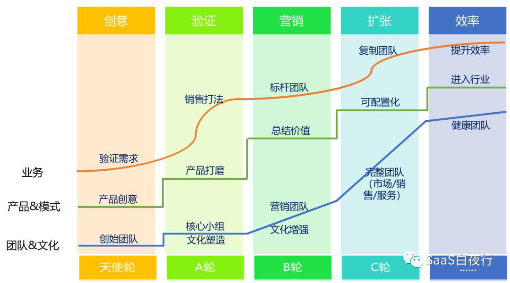
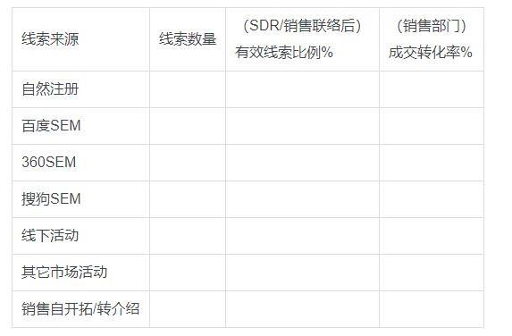

## SaaS公司各部门经营状况自评| SaaS创业路线图（50）  

> 发布: 吴昊@SaaS  
> 发布日期: 2019-06-18  

编者按：本文来自微信公众号[“SaaS白夜行”（ID：SaaSKnight）](https://mp.weixin.qq.com/s/qKcKGWUcDOwbSSrErHnZPQ)，作者吴昊SaaS，36氪经授权发布。

**作者介绍 -** 吴昊，SaaS创业顾问，纷享销客天使投资人、前执行总裁，8年SaaS营销团队创新+13年企业信息化经验。目前在为SaaS公司提供战略咨询，重点是市场、销售、服务团队的规模化。

（SaaS创业路线图）

上周的第49篇《如何评估SaaS公司的经营状况？》反响很好，我又想，看指标只是从外往里看的投资人视角。如果从内部经营情况自评的角度，是否会看得更细致呢？

正好有一个很知名的SaaS公司请我做全面调研，我做了一个调研的问题框架，去除了敏感信息后，我也给大家分享一下。各位可以按照这个框架，自评一下自己企业的从产品到市场、销售、服务各个环节是否健康？

###  **一、公司层面**

**1、组织架构图**

a. 公司组织架构是否清晰？各部门的职责有没有清晰边界？

b. 是否每个干部（主管及以上）都很清楚公司的组织架构，各个一级部门的部门职责？

c. 是否每位同事都清楚自己所在部门的职责？

>  **换句话说，咱们的部门设置是否简单高效？这与部门设置思路是否清楚有很大关系。**

**2、本年公司级战略目标**

1. 有明确的文字描述吗？

2. 能用哪些数据指标衡量？

3. 每个干部都能讲清楚吗？

>  没有一致的目标就没有一致的行动，战略目标不是用来看的，要做层层宣贯。

**3\. 公司3~5年中期战略目标**

1. 有没有3~5年的战略目标？还是说，每年都疲于奔命，只是为了完成当年销售增长任务？

2. 公司高层干部是否都能清楚地说出这个中期战略目标？

> 只有“当年目标“的CEO永远都会为新年的新目标痛苦不已。渡过生存挣扎期后，CEO应该把更多时间放在公司外部，为未来筹划。

**4、公司的愿景**

> 互联网公司从来都不缺少愿景，也不缺把愿景传递下去的热情，这点我就不多说了。

###  **二、研发策略**

**a. 是否做定制化开发？如果有，交付项目中定制化开发的比例有多少？**

—— 关于是否做定制化，我在2018年7月发过一篇，当时我激进地反对任何定制化。这大概是因为我出身自拿了大投资的公司吧。但一年以来，我也接触了不少通过定制化逐步走向产品化的公司，我的想法变地更灵活了。其关键在于“定制化”的主要目的是什么?是通过项目机会更深入理解中大客户的需求？还是拿下一个百万订单粉饰公司营收数字？在中国这个缺乏行业标准的企业市场上，也许前者是部分领域一条无奈的必经之路吧。

但在研发策略上，起码要控制好定制开发项目的总数量（与CTO的把控能力及研发组织的成熟度有关）、每个项目定制开发功能的比例（随着产品成熟度提升，SaaS企业可接受的定制比例应不断降低）和定制开发功能的方向（应与产品方向完全一致）。

**b. CRM、客服系统、HR系统等是否自研？自研的系统有哪些？**

—— 我个人认为，除非CEO资金很充裕，能抽出一票专属团队 **长期** 开发某个系统，否则不应该把宝贵的研发资源用在自研内部系统上。创业公司发展快，内部需求稳定性差，自研策略很容易短视和引起扯皮，应该找更成熟、高可配置并且接口开放的SaaS工具。

**c. 遇到标准化组建需要开发时（例如BPM/BI和基础IT类API等），是外部采购SaaS/PaaS服务，还是自研？**

**d. 使用IaaS还是在IDC自建自己的服务？**

—— 以上两条并没有标准，写在这里是希望引起研发团队的思考。

###  **三、产品及产品的市场定位**

**a.产品的核心价值是什么？**

1. 这个核心价值是否能击中客户的痛点？

2. 该核心价值反映在新业务员培训的哪些部分？培训后业务员能讲清楚吗？

**b.目标客户群体是？**

1. 这些客户群体在哪里？

2. 地域分布、客户的老板或关键人KP在哪些社会组织中？

**c.有清晰的客户画像吗？**

1. 这个客户画像有可操作性吗？一个业务员能否根据这个客户画像找到目标客户？

2. 业务员找到目标客户难度有多大？

3. 业务员接触到目标客户KP（关键决策人）的难度有多大？

**d.主要竞争对手有哪些？**

1. 对方产品价值点与我们产品的差异在哪里？

2. 对方公司与我们相比的优势和劣势？

3. 对方的竞争策略？

—— 其实我是不建议太在意竞争对手的。想明白上面这些问题后，自己该打造产品还是继续打造产品、该服务好客户还是继续服务好客户，只有这些才是第一位的。我看到国内SaaS市场上，竞争双方把精力花在对手身上而忽略了客户，最后一起丢掉市场，这才是最可悲的。 **99.9%的企业服务面对的都是慢市场，大家都是一家家啃客户的，没有谁2、3年就能形成高覆盖率。** 只有让当前的客户长期满意才是终极竞争策略。

###  **四、市场运营**

1.  **以上个月（或近期比较正常的月份）为例，下表各类线索数量及其有效线索比例、（销售）成交转化率各有多少？**

（有效线索指：SDR/销售团队与客户联络后，确认其为目标客户且可以继续跟进的线索）

**2\. 能否进一步计算出各个通道每条有效线索的成本？每个通道的线索转化商机的比例和金额、最终转化为合同及回款的比例和金额？进而计算出，每个线索来源的ROI（投入产出比）？**

—— 这条ROI计算的要求有点儿高啊，70%以上的SaaS公司都还做不到，所以只能粗略算一个。但这应该是市场部的努力方向。

**3\. 市场部及SDR团队（如果有）的工作效率指标：**

1. 线索分级分类的准确率

2. 线索分发及时率（尽量控制在客户主动动作后的1~24小时以内）

3. 销售部门跟进及时率（这个指标应考核销售管理者，但主动跟进方是市场部，因为市场部最关心ROI）

—— 市场部门的职责在公司的不同阶段有不同侧重。 **在实现公司盈亏平衡前，CEO们都更关注市场部能带来“有效线索”的数量** ，所以关注点是线上SEO/SEM，线下活动及BD；而达到盈亏平衡点后，公司可以在品牌、PR上加大投入。但这时候往往会发现品牌建设启动晚了，因为这是件需要时间积累的事儿；所以前期也应该逐步低成本或免费做一点品牌工作。

更极致的情况是，业务上只依赖销售部门，市场部连提供线索的能力都很弱。这个明显是错误的，市场部应与销售部门平衡发展。

**4\. 销售业务管理（采用上月经营数字）**

a.销售总体情况

1. 营销费率

2. 全销售体系各大部门的：

* 平均客单价

* 平均成交周期

* 人效（销售部门全员人均单产）

**5\. 业务员按何种方式组织？**

a. 是按行业、区域或者自然分组？

b. 客户资源及市场线索如何分配？

c. KA部门专属的客户范围如何界定？

d. 电销（电话销售）与面销（外勤拜访销售）岗位的人数比例、业绩比例

e. 直销部门与渠道部门、代理商的人数情况

f. 直销部门中，非业务人员比例（与业务部门层级数相关）

—— 顺便说一下，销售管理是工作压力很大、管理动作密度也很大的岗位。一个中层或基层管理者的下属应该不超过10人（8人是最佳管理半径）；一般来说，组员低于3人的主管自己也可以做单子拿销售提成，但如果小组超过6人的主管就只能专注管理工作了。

**6.人员状况：**

1. 新业务员“旅程”：一个新业务员进入公司的培训、成熟的旅程 。例如：入职培训x天，通过率 y%；跟着师傅实习 天，通过率 %；第2个月考核目标 单/ 万元；第3个月考核目标 单/ 万元）

2. 新员工成熟周期（合格员工从入职到具备独立开单能力需要的天数）

3. 一线业务员过去3个月任务完成率分布图；

**7\. 业务成熟度：**

1. 是否有清晰的客户画像？

2. 是否有标准销售打法？

3. 是否有完整的销售工具？（包括电话及面访话术和流程文档、销售工具PPT、客户鉴证视频等）

4. 如何划分销售阶段？划分了几个销售阶段（一般与客单价相关）？每个销售阶段的完成是否有客观标准？（例如电话邀约阶段的完成标准就是客户答应我们前去拜访）

5. 各销售阶段的转化率？每个销售部门的转化率都接近吗？每个员工呢？

**8\. 管理成熟度：**

1. 有没有针对性地进行业务培训？（例如电话邀约成功率低的业务员应接受“电话邀约专项培训”？）

2. 业务员/各级销售管理者业绩目标的制定方式

3. 业务员/各级销售管理者的提成计算和激励方式

4. 公司对基层主管日常管理动作（日、周、月）有哪些要求？

5. 业务员晋升、淘汰机制

6. CRM使用情况如何？销售团队开会、理单是用电子表格还是CRM？

—— 是否使用CRM与团队规模、每个业务员的客户保有量及营销团队成熟度有关。不超过10个人的时候可以用电子表格搞定，人数多了应该用CRM更公平、安全和高效地管理客户资料及商机进度。

**五、** ** **服务方面（CSM客户成功部或客服部）****

**1.服务总体指标**

* 客户数/金额续费率、流失率

* 新交付客户本月活跃率

* CSM平均服务客户数量及这些客户的待续费金额

* 净推荐值NPS

—— 作为SaaS公司，如果你的服务部门还叫“客户服务部”，说明团队里对SaaS的客户成功还没有理解透彻。SaaS的本质是续费，低续费率的SaaS公司不值钱，而CSM（客户成功）部是续费率最重要的保障。每个SaaS公司都应该建立一个真正的CSM部门，这个部门不是被动服务的热线组织，而是主动服务客户的半咨询、半服务组织。当然，具体一个公司服务意识的转变中，组织和个人能力需要逐步培养，可以有规划地慢慢转换。

**2.CSM部门组织方式**

* 按区域/行业组织、分配客户？

* 成熟CMS人员的培养周期（一般需要9个月甚至更长时间）

* 与销售、实施等部门的交接流程、责任边界是否清晰？

—— CSM部门与销售部门很大的不同是，CSM在服务链条中处于后端，客户是可以按照行业、规模、区域等特点分组交给不同的CSM同事负责。我个人比较推崇按行业划分CSM团队，这样更容易获得对行业业务理解沉淀。

**3.业务及管理成熟度**

1. 是否有标准的接手服务新客户、客户投诉等标准业务流程？

2. 服务过程是否有标准模板作为服务过程记录标准？执行情况如何？

3. 考核KPI

* 负责客户范围的活跃率

* 续费率

* 增购率

至于财务、行政、HR、战略规划、经营管理等职能及支持部门，如果公司以上业务和业务管理都做到位了，相信也有这些部门的功劳。

这次写的东西覆盖面太广，我自己实在是不能独自完成。希望大家一起来共创：如果有补充，欢迎留言。我今年会把这些内容系统整理成一个本书，书名就叫《SaaS创业路线图》，有贡献的你的名字将列在书结尾的感谢名单中......谢谢你的参与。
