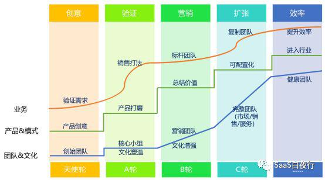

## 为什么说“无标准，不复制”| SaaS创业路线图（51）  

> 发布: 吴昊@SaaS  
> 发布日期: 2019-06-25  

编者按：本文来自微信公众号“SaaS白夜行”（ID：SaaSKnight），作者吴昊SaaS，36氪经授权发布。

**作者介绍** **-** 吴昊，SaaS创业顾问，纷享销客天使投资人、前执行总裁，8年SaaS营销团队创新+13年企业信息化经验。目前在为SaaS公司提供战略咨询，重点是市场、销售、服务团队的规模化。

（SaaS创业路线图）

我曾经在某个有几十个SaaS公司CEO的群里说：“我每天都在想着如何复制的问题”。因为我曾经带着一个团队从10个人一年半扩张到600人，再扩张到1800多人。如果没有标准，是无法对这么大规模团队进行管理的。

其实不仅仅是这个规模的团队，当你的团队只有几个人、十几个人的时候，就应该考虑如何进行复制的问题。

我给大家讲几个真实的例子。

**案例一、6个亏损的分公司**

今年五一的时候，我的一个老部下准备去履新。他接手的岗位一个toB公司全国销售团队负责人。前期公司扩张很快，已经开了6个分公司。但后面发现问题很大，每个分公司都不挣钱，甚至有的分公司一个月会有大部分人挂零。

我和他讲你有两个策略，第一个策略就是远程加强对6个分公司的管理。但这实际上非常累，而且是不可能完成的任务。因为分公司自己的业绩任务都远远不能达成，所以每个人都处于个人收入低下、对公司产品没有信心的低迷状态。所以你得花大量的时间去安抚大家、去现场打鸡血。即便是这样，不能开单的团队始终不会有好的状态。

第二个方案是你把5个外地分公司都砍掉。把每个分公司最优秀的人才聚集到总部来。总部有产品，有研发、有服务人员，大家可以更深入的去研究——如何打造一套标准的销售方法？如何建立一个盈利模型达标的销售团队？

**与其把时间花在安抚低绩效员工上，不如花时间好好研究客户。** 只有这样，才是对公司的长远发展最健康的方式。

**案例二、一个营收很高、销售团队过百人的公司**

这是一家SaaS企业，我看了他们产品非常不错 —— 续约率很高、增购率也不错。

但是团队也曾经做过快速扩张，现在在全国各地有十多个分支机构。其中有业绩非常好的分支，也有业绩差的。我就和他们一起开会，了解各分支的销售打法及培训情况。

结果各个区域销售负责人讲述的销售打法以及培训新人的方式各不相同。培训负责人也说他手上有一套培训方案，但是自己也没多少信心，所以培训要求贯彻地也不够坚决。

其实这些都是因为公司没有为销售团队打造一套标准做法而引起的困惑。

以我作为大团队全国销售负责人的角度来看，如果没有一套标准的销售流程、标准的关键环节销售话术、标准的招聘及培训方案和日常销售管理的方法，十几个分支机构是无法进行管理的。

为什么这么讲？我简单列一下 **跨区域管理，需要做哪些事儿：**

\* **掌控每个分公司各个销售阶段的商机数量及总金额** —— 如果每个分公司商机阶段划分不同，这是无法管理的

\* **掌控每个分公司的拜访及蓄客进度** —— 分公司有自主权，比如月初安排一个集中的“沙盘演练”（模拟客户现场的考核），但起码到了月中（或季度中期）要把蓄客量、拜访量补起来 （大部分公司都做不到这一点，如果总部只掌控结果，而对过程不能掌握，是无法保证稳定业绩的

\* **新人入职后的成长进度** ：入职30天是否掌握了产品讲解（80分以上）？60天是否已经能达成成交小单或商机积蓄的目标？

\* **低绩效员工淘汰标准** ：总部应该有总体标准，每个区域有灵活度（例如主管可以多保1~2个月等等），但总部至少要知道有哪些是业绩达标的，标准是什么？

\* **个人收入核算** ：提成核算的方式大部分公司都会统一，但核算过程在很多公司都极其痛苦。如果缺乏统一标准，错漏在所难免。

大家可以看到， **如果每个分公司的销售打法不同、管理方式不同，进行管理的难度会越来越大。**

**而且输出标准打法后，我们要测试，确认效果后就要坚决执行。** 标准化落地是非常难的，比如你遇到这样一个问题：一个Top Sales就是不愿意按标准方式做，你是留着他还是开除他？

我的答案是，标准方案里要有一定灵活度，但连基本要求都做不到的（例如：CRM中的销售记录格式、每周固定时间的早会夕会），坚决劝退；否则对全团队都是坏榜样。

此外，从各级管理者的时间效率上看，每个分公司每周都会发生一些异常情况，如果没有标准流程，这些异常情况出现的形式就各式各样。总部的管理者无法给出好的彻底的解决方案，往往只能应急的进行处理。从总部到分公司负责人，大家每天都在处理一些很琐碎凌乱的事务，还搞得焦头烂额。 **整个管理层，没有几个人有时间真正好好去研究客户，研究如何提高销售效率，如何更好的服务客户。**

**三、甚至初期团队也有缺乏标准化带来的的问题**

我见过一个团队只有5个销售，但是绝大部分业绩都是一个超级销售完成的，其他人都是配角。

没有业绩的人一筹莫展，不知道该怎么办。而那个超级销售他的打法又没有人去进行总结，所以也难以复制到其他人身上，这样团队的扩张也受到很大的阻碍。没有人确定再招来新人能否学会超级销售的那套打法。

所以我给他们的建议是：

\* 销售负责人多陪访超级Sales，用3个月总结出一套标准销售打法。开始能有60分就可以，先用起来，再逐步提高。（这是对小规模团队的要求，大团队的标准打法要有80分才能推广。）

\* 标准打法形成后，逐渐降低销售打法的难度。例如现在需要5年toB销售经验，将来要降低到只要2年toB销售经验就能通过2周培训、在2个月内掌握这套打法。

\* 这期间可以尝试招少量较优秀（甚至有小团队管理经验）的人才，用标准打法做培训，检验这套打法的可复制性。

以上三个案例都是不同阶段销售团队实际遇到的类似问题。而 **解决方法都是同一个，也就是用一段时间来打磨标准的销售打法，进而复制人才复制团队。**

当然，我也要强调每家公司的独特性，产品复杂度不同、面对目标市场不同、销售流程也会不同， **所以销售打法和管理方式的“标准化程度”会不一样。**

总体来说，越是快单、短周期销售，标准化程度越高；大客户销售标准化程度相对较低。但即便是大解决方案销售，也是需要“标准的流程”的，如果涉及多部门协作，对流程的要求会更高；只是其对具体动作的“标准化”要求会降低，更需要发挥Sales个人的能力。当然，这也是大Sales团队复制困难（人难找、招来的新人成长慢）的重要原因。

至于具体怎么做，我有另一篇文章[SaaS创业路线图（39）可复制的市场成功](http://mp.weixin.qq.com/s?__biz=MzIxNjc2MTc2MQ==&mid=2247483997&idx=1&sn=6a664dfe9564edf0284fcf5eb3bd4146&chksm=97855693a0f2df85865f225467cad08b4f88684333f111957fecb9f7225c151536b640d63135&scene=21#wechat_redirect)，大家可以阅读。

硅谷SaaS公司在产品研发及营销模式上已经越来越成熟和标准了。大家有空可以看看《从1到N》、《硅谷蓝图》、《获客》等书籍。当然，书中建议还需要你自己判断是否适用自己的公司。

我系列文章中提的这些建议也一样，使用的“度”需要根据自己公司的产品、客户、团队状况进行掌握。

今天主要讲标准化的必要性，欢迎大家留言聊聊自己所在公司遇到的困难和标准化难以落地的原因。
