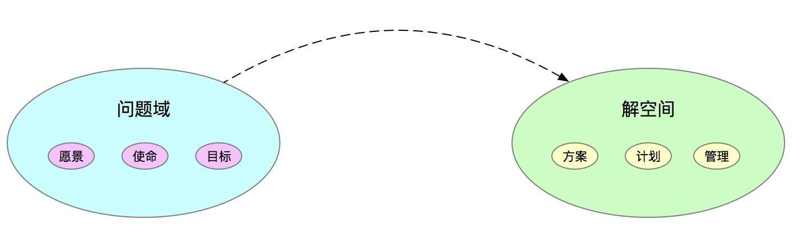
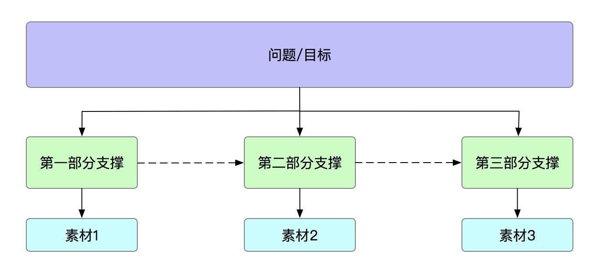

## 系统架构系列(二)：应对这一概念的方法  

> 作者: 高福来  
> 发布日期: 2019 年 6 月 18 日  

### 引言

在本系列的[第一篇](https://www.infoq.cn/article/6hpBsMXQNGx_EAPKUuWS)文章中已经给出系统架构的公式定义：系统架构 = 要素 + 连接 + 解决特定的问题，本篇文章重点讨论应对系统架构的方法。

如今，系统架构在业内还没有定型的固定方法，一般会讲：需求分析、系统分析与设计、UML、领域建模、设计模式、软件工程等，笔者不打算这样讲，这样下来会有厚厚一本书，希望从简洁、可落地实践的角度去阐述系统架构，后面的文章再给出每种架构具体可实践操作的方法。

### 一、系统架构的本质目的

我们已经知道系统架构是什么，有必要讲一下系统架构的目的，即为什么要进行系统架构。对于简单的系统而言，可能没有什么所谓的系统架构，这里的 " 没有 " 可能对我们来讲是常识，如简单的系统分层。系统架构的本质目的从公式定义中就可以看出： **解决特定的问题** ，这个特定的问题有技术上的问题、业务上的问题、项目管理上的问题。

还有一个问题不知道开发者是否注意到：怎么知道自己的架构设计是对的？这个问题很尖锐，架构设计具备严谨的逻辑性，从逻辑上讲是对的，实现起来基本上八九不离十，再根据实际使用情况做出调整。所以，系统架构从本质上讲具备逻辑性，虽然还没有真正实践，但从架构方案上能看得出是否合理、正确。

**结论一：系统架构的本质目的就是解决问题和具备逻辑性。**

### 二、系统架构的难点

系统架构并不是任何初学者都可以一学就会的概念，它具备一定要求，所以这里说的难点换个角度就是要掌握的能力。

#### 2.1 技术上的难点

技术上的难点对于开发来讲比较好理解，在有些场景下，技术会成为架构的难点之一，如笔者之前在阿里店铺团队，双 11 高达十几万的 QPS，如果处理不当，可能就会导致访问的店铺页面打不开。所以，对于高并发场景，我们面临很多挑战，以下列举常见的技术难点：

* 高并发场景：有限的资源应对大量请求。
* 高可用场景：即使在极端条件下，强调系统的可用性。
* 高扩展场景：如何应对变化的问题，以最少的代价支撑业务发展。
* 分布式一致性场景：一致性问题在分布式场景下经常遇到，选用哪种技术方案要结合当前的业务、条件来选择。
* 高性能场景：快速地处理请求。
* …

技术上可以有意识地在平时去总结、练习，每种问题都应该有一套立体化的解决方法而不是一个散点去应对，如高并发场景，有些同学立马说用缓存、用消息队列等，这些只是手段，如果从本质问题出发，在每个环节上思考如何去做，这样就会提出系统性的解决方案，这一点会在后续文章中展开说明。

###### 2.2 业务上的难点

有些业务是非常复杂的，不是简单的 CRUD，涉及到的链路非常长、涉及到的业务关联方也非常多，很有可能一个系统的代码行数超过 100 万，还包括很多历史逻辑在里面，这个在新业务中出现的概率较小，一般是大型系统并且你是后面加入团队的时候会遇到。尤其是用户量大、涉及到交易业务的系统，错一点就会造成巨大资损。作为一个新人，加入这样的团队面临的挑战会比较大，如果没有文档，只能靠自己去问、去看、去 debug、去踩坑。

在业务架构的基础上，笔者提出 **业务能力地图** 的观点，如何让一个新人以最少的成本熟悉业务系统，除了业务系统设计得非常好，有详细的文档可参考外，还要有可视化的能力地图，从一个业务场景出发，中间涉及到的调用逻辑全部通过可视化界面展示出来，一个新人就可以很清晰地知道整个业务流程如何运转，先从宏观上理解产品、业务运转，再去看代码要轻松得多。

#### 2.3 项目管理的难点

一个大型系统设计的业务方比较多，如果系统架构方案已经产出，剩下的就是落地执行，项目管理也有可能是我们的一个难点，如何协调资源、处理冲突、关键项目里程碑、问题跟踪和解决、上线灰度策略、业务监控…这些在系统架构设计时都要考虑到，并且在执行的过程中要有反馈。

一个项目如果没有人管理延期的风险会很大，其实大部分开发不善长做管理、沟通等事情，在一个组织里，不同的人、不同的事形成一个较复杂的环境，所以也有人说管理是一门艺术。

上面着重从技术、业务、项目三个层面讲解系统架构的难点，这些难点就是我们后面要解决的问题，反过来就是我们应该具备的基础。

### 三、换个思维看系统架构的过程

在[换个思维学领域建模方法和实践](https://www.infoq.cn/article/6hpBsMXQNGx_EAPKUuWS)一文中，通过语文的阅读理解来类比领域建模的过程，有些读者反馈这种方式较好，通俗易懂，想起来好像还是那么一回事。笔者一直推崇的理念是大道至简，通过过往经验类比复杂的问题，有一个铺垫会降低学习的复杂度。

#### 3.1 写作的过程

在这里依然用一个大家都熟知的经验来类比系统架构。我们从小都写作文，写作文的步骤是什么呢？

* 审题：根据要求写作。
* 谋篇布局：知道要写什么之后，就思考整体文章的结构是什么 \(这个最关键，手法不同，文章的结构就不同，如总分总、设悬念、先抑后扬等\)，分几段来写，每段的内容是什么，段与段的链接怎样。
* 素材选择：为了支撑表达我们的思想，素材有多个，如何选择最贴切的素材也是至关重要的。
* 写作：最后成文。

#### 3.2 提炼写作的要点

所以到这里，不知道你发现了什么没，最关键的是什么？就是文章结构，这里的结构就体现出不同的逻辑，不同的人看后会有不同的感觉，有的文章读后为什么能让你拍案叫绝，就是他的行文思路非常好、剧情引人入胜。

可以换个角度来说： **学好系统架构就如同写出一篇妙笔生花的文章出来** 。再来看如何写出一篇妙笔生花的文章出来的过程，我们大体在学生时代做了两件主要的事：

* 词汇语句的积累：积累了大量的词汇和经典语句，我们是从出生就开始积累。
* 文章结构：我们学习了大量的文章，分析文章的结构就是为了让我们学习这种结构。

至此，写作的核心要点就两个： **词汇语句和文章结构** 。那么类比到架构设计，其实已经快呼出之出了，先等一下，我们对这两个点再抽象一下。 **词汇语句抽象了要素，文章结构抽象成模式** 。再来看系统架构，它的核心点也是上面两种：

* 要素：解决问题的点和具体手段，如技术架构中的缓存、消息队列等。
* 模式：就是最终呈现的结构，常见的有分层架构模式、管道模式、代理模式、事件模式等。

通过写作类比，应对系统架构的方法已经初步成型，接下来再细细道来。

### 四、应对系统架构的方法

本部分应该是最重要的，但经过前面的铺垫，现在显得并不是特别重要，因为不同的人看到这里，心里的想法肯定不一样。

应对系统架构的方法： **系统性思考、分解、抽象、模式** 。

* **系统性思考** ：我们考虑的目标是系统，不是单一的点，所以要系统性思考。这个听起来比较虚，还是拿一个技术架构中的秒杀场景来说明。 **秒杀的本质是有限的资源应对大量的请求** ，解决这个问题资源肯定不能加大，就 100 个商品，不可能加到 10000 个商品。所以怎么应对大量的请求就是解决问题的关键点，我们可以直接从两个方面来考虑：用户和系统两个角度。用户大量的请求直接涌入，系统可能承担不住，能不能打散用户请求？系统方面能不能更快的处理用户请求，之前要 100ms 处理完的，能不能用 10ms 处理完？所以这样分析下来，从接入层、处理层、存储层考虑，而不是单一考量。

* **分解** ：一个复杂的问题分而治之是一个宝贵的经验，同样在系统架构中也经常使用到，还是拿上面的例子继续说，上面从用户和系统两个角度考虑，那么从用户角度如何去做？从系统角度又该怎么去做，两个独立的可以单独拿出来设计。技术架构可以按照这种方法来做，业务架构也会使用分解的方法，业务流程的分解，分解出更小的流程，从流程中找出产物是什么。

* **抽象** ：抽象这个词本身就很抽象，经常说就不知道它是什么，笔者对 **抽象的理解就是抽出来要像** ，如人在医院中重要的是身份信息 + 健康信息，在学校中重要的是身份信息 + 成绩信息，在工作中重要的是身份信息 + 工作经验 +KPI，所以不同的场景要抽象出本质的东西来描述事物。那么复杂的一个系统，要抓住核心的点，可能核心点不超过 10 个，这样就大大降低理解的复杂度了。

* **模式** ：好比写作一样，有不同的模式，架构设计也有不同的模式，这种模式是约定俗成的，一看就能理解，常见的是分层架构模式，一些比较少用的模式了解即可，把重要的精力花在常见的模式上，遵循二八原则。

再来看我们之前对系统架构的定义： 系统架构 = 解决特定的问题 + 连接 + 要素，现在再去看它，会显得特别亲切，用一句话概括系统架构的方法： **明确我们要解决的问题，通过系统化的思考方式找到关键的点，对不同的关键点进行分而治之，再通过抽象找出要素，最后通过一定的模式表现出来** 。

**结论二：应对系统架构的方法：系统性思考、分解、抽象、模式** 。

### 五、小结

从系统架构本质目的讲起，然后提到系统架构的难点，难点即是要掌握的能力。最后通过我们熟知的写作场景类比系统架构，得到系统架构的方法：系统性思考、分解、抽象、模式。接下来的篇章就是具体的实践，将分为业务架构、技术架构、应用架构几个维度讲解。

### 作者简介

高福来，目前在滴滴小桔车服加油团队负责营销基础 \(优惠券、奖励金\)，在分布式中间件和系统架构方面积累了一定的经验，擅长用通俗易懂的语言描述复杂问题。
