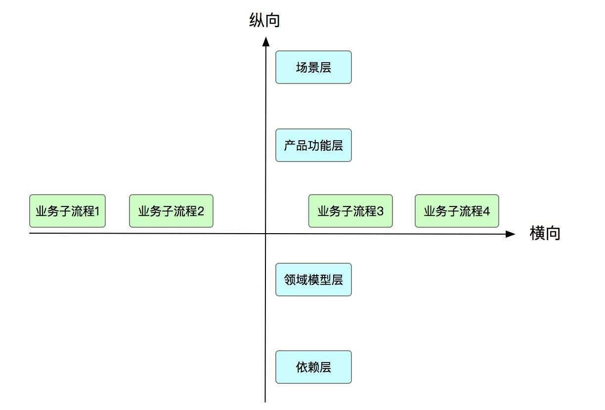
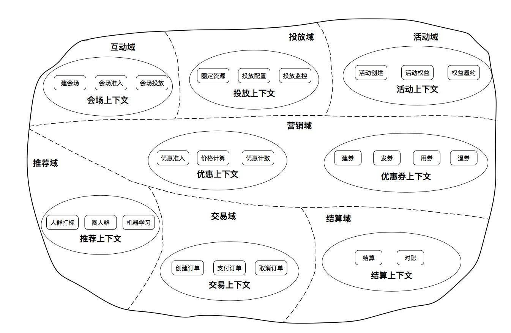
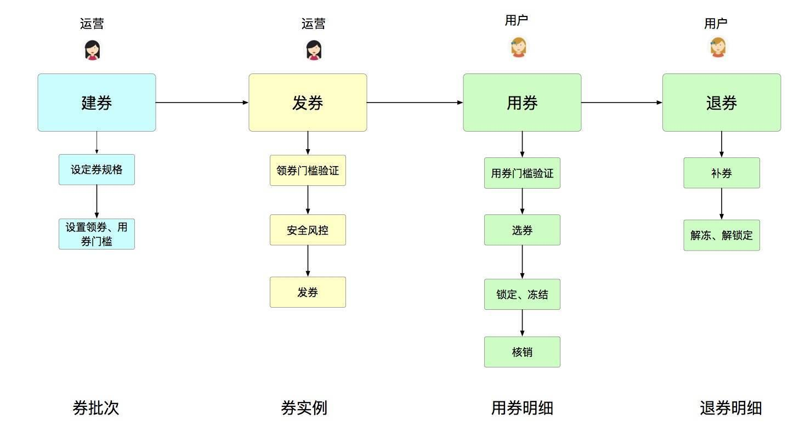
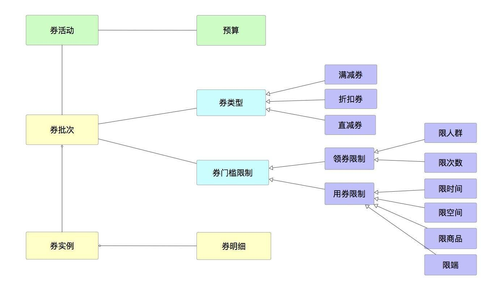
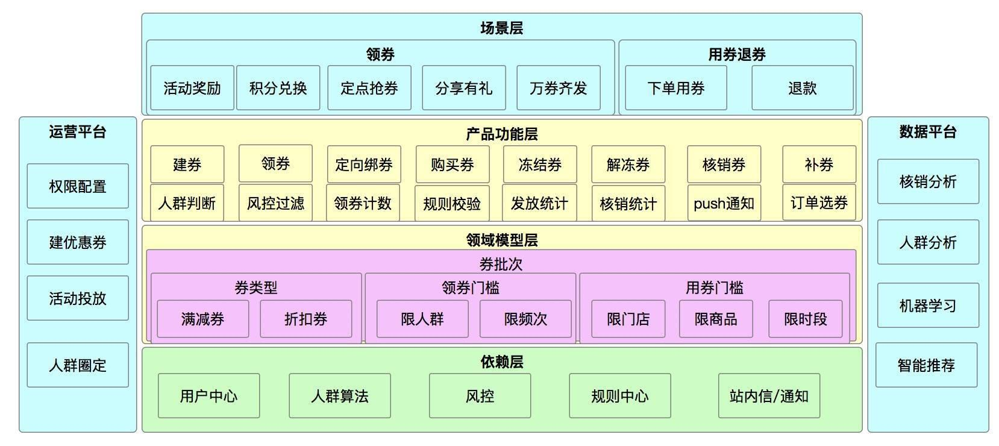

## 系统架构系列(三)：业务架构实战上篇  

> 作者: 高福来  
> 发布日期: 2019 年 6 月 20 日  

### 引言

[业务架构](https://www.infoq.cn/article/m*aORjCU6gQiIbPCVtoK)一般不被开发重视，开发人员喜欢追求新技术，而技术是服务于业务的，现在没有一项技术是自娱自乐的，一定要支撑业务，否则没有场景。设计好业务架构要考虑的方面比较多，要做到业务彼此隔离、业务与技术 \(平台\) 隔离，从业务架构中能看得出整体业务的流程运转、业务产品的能力、业务领域对象…接下来的两篇文章将重点讲业务架构。

### 一、什么是业务架构

在[上篇](https://www.infoq.cn/article/NON4ahRV9pC3Feoc0-VC)文章中提到系统架构的方法： **系统性思考、分解、抽象、模式** ，这是总的纲要，针对不同类型的业务架构，要结合本身的特性再加以细化。

业务架构是[系统架构](https://www.infoq.cn/article/fwhQ-dIN2xTUH6zNLYZp)的一种，那什么是业务架构呢？业务在百科中的定义是 **" 涉及一个以上组织，按某一共同的目标、通过信息交换实现的一系列过程，其中每个过程都有明确的目的，并延续一段时间 "** 。从这句话可以看到几个关键词： **组织、目标、过程** ，下面仔细分析这几个关键词的含义。

* **组织** ：业务涉及到的人或者组织，这个比较好理解，一项业务应该由多个人来完成，如销售、财务、产品、研发、售后等。
* **目标** ：这是做这项业务的目的和价值，换言之，为什么做这项业务，做好这项业务要达到的目标是什么。
* **过程** ：过程就是业务过程，一项业务由多个过程组成，如优惠券业务，它的过程是建券、发券、用券、退券。

上面这样的描述可能比较空洞，与我们平时接触的不匹配，再继续提炼出重要信息。

* **利益相关者** ：这个是从 " 组织 " 和 " 目标 " 中推导出来的，业务的受益方是谁，为什么要做这个业务，肯定有受益的群体，否则没有市场。如优惠券的利益相关者有用户、商户、公司，因为用户下单可以使用优惠券、商户可以吸引更多的客户来消费、公司的[GMV](https://es.wikipedia.org/wiki/GMV)就上升了。

* **业务流程** : 这个是从过程推导出来的，并且这个业务流程是固定的 \(至少一段时间内\)。这里的业务流程是大的流程，每个流程都会再往下分解成子流程，如优惠券中的发券，它会有一系列子流程，如发放规则检验、风控安全等。

综上，到这里，也可以用一个公式来定义业务架构， **业务架构 = 业务目标 + 业务流程 + 业务要素** ，这和系统架构的定义非常相似，只不过是实例化了而已。从业务架构的公式中， **最重要的是识别出业务流程和业务流程中包含的业务要素** ，换个角度来看就是业务要素与业务要素之间的关系，这些关系组成了整个业务。

### 二、业务架构的特性

已经知道了业务架构是什么，接下来就讨论业务架构的特性，通过特性基本上就知道业务架构的大体框架。笔者通过 x、y 数轴加以说明，因为 **业务要体现出业务流程的流动性和业务的层次性** ，下面就说明这两个特性：

* **业务的流动性** ：其实这是业务生命周期的体现，从产生、拥用、使用可以看出业务的流动，这是横向的。

* **业务的层次性** ：笔者一般习惯用场景层、产品功能层、领域模型层、依赖层来画业务架构图，这是纵向的。场景层依赖下面的产品功能层，多个场景很有可能对应一个产品功能，产品的功能又是由领域模型来支撑的。

### 三、业务架构的方法

业务架构的方法还是从 **系统性思考、分解、抽象、模式** 这四点具体说明。

* **系统性思考** ：站在业务的角度，分析业务与业务之间的关联性，如优惠券业务，它就涉及到人群选择、风控安全、活动、会场、优惠、交易、凭证等，思考系统之间的交互和依赖关系，以及依赖系统要提供的哪些能力。

* **分解** ：系统性思考让我们的目光放得更广，整体上考虑整个业务的运转，此时还没有想业务的具体流程，只是知道有，并不深入考虑如何做。分解就不一样，它聚焦的是业务本身是如何运转的，一般业务由几个主要的流程组成的，每个流程又能往下继续分解出细的流程，分解的目的是为了找出业务的要素，此时的元素都是孤零零的。

* **抽象** ：分解不是我们的目的，通过分解找出的业务要素，此时要经过一定的抽象才能形成我们的领域对象，因为分解找到的业务要素很多是可以合并归类的，这样就大在减少了业务要素，也降低了理解的复杂度。

* **模式** ：通过业务架构的特性，按照场景层、产品功能层、领域模型层、依赖层这四层画出业务架构图。

所以方法还是[上一篇](https://www.infoq.cn/article/NON4ahRV9pC3Feoc0-VC)所提到的方法，只不过套到具体类型的架构中，具体化分析。有的时候在想，并不是业务架构难搞，只是我们并没有像追求技术那样投入时间研究业务架构，可以不断运用上面的方法，结合自己的理解和扩展，多去实践。

### 四、通过实例画出业务架构图

下面通过一个电商场景的优惠券业务案例来说明业务架构图是如何画出来的，使用的方法还是上面提到的，通过具体的例子再加以巩固。优惠券对于我们来讲并不陌生，每年的双 11 都有很多优惠券，有满减券、折扣券，优惠券是营销中最常使用的营销抓手。

#### 4.1 优惠券业务愿景和目标

优惠券的业务愿景是让用户可以享受到更多优惠，目标是通过优惠券吸引更多用户加入，从而提升 GMV。

从这里可以看出，愿景一定是为他人着想，绝不是为了公司自己赚钱，而是创造价值的同时实现双赢，双赢才是最终目标。

#### 4.2 系统性思考优惠券业务

如何进行系统性的思考，笔者建议可以使用反推法，假设已经有了这项业务，它应该是如何运转的、涉及到哪些人，实际上这个过程就是推演的过程，基本上能把整个交互都考虑清楚，业务实现起来基本上没问题。

* 用户：用户有优惠券，下单会使用优惠券，涉及到交易和优惠。
* 系统：涉及到建券、发券、核销券、退券
* 建券与我们优惠券系统关联最大，也即是我们要做的事。
* 发券，发给谁呢，肯定不是遍地撒网，现在基本上是精准营销了，要知道哪些用户是活跃用户，所以涉及到算法推荐；除了发给谁是我们关心的，营销还有一个比较核心的点，就是营销模式，你怎么能吸引用户，这就涉及到会场、活动，这些玩法是非常关键的。
* 核销券：优惠券券在什么条件下可用 \(满 100 元减 10 块\)？订单价格如何计算出来的？
* 退券：退款了，券要不要退回？

所以，经过上面的分析，初步涉及到的业务方就已经出来，此时还只是一个粗略的关系，这个过程可能需要几轮不断的讨论最后才成型。

#### 4.3 优惠券业务流程

业务流程是客观存在的，而且任何一个业务在一定的时候内应该有一条稳定的业务流程，这个业务流程是符合人的认识的，具有严谨的逻辑性。怎么理解呢？一个业务要运转起来，不可能是一团糟，一定具备流程，而且是人能接收的，否则你设计一个反人类的业务产品出来，注定是失败的。拿优惠券来讲，根据它的生命周期，很容易想到它的主业务流程：建券、发券、用券、退券。

#### 4.4 分解和抽象

上面是一个大的流程，还要对各个流程再进一步细分，分解成更小的子流程，每个子流程中包含一系列的步骤，其实这个步骤就是不断深入地过程，同时对业务的理解也不断加深，多问几个为什么就深入了。

* 建券：这个券包含了哪些内容？
* 发券：给谁发？发券的条件是什么？
* 用券：什么条件下能使用优惠券？用券涉及到哪些过程？
* 退券：什么场景下会退券？

随着深入的过程，整个业务的细节也浮现出来了，现在就是要抓业务要素，这个要素可以通过每个阶段的产物来看。建券的产物是券批次，发券的产物是券实例，用券的产物是用券明细，退券的产物是退券明细。

接下来就是抽象的过程，这个抽象的过程就是对已找出的产物进行抽象。券批次包含：券类型和券门槛限制两个重要的信息，用券明细和退券明细统一抽象成券明细，优惠券又与活动强相关，所以也把券活动放进去。

#### 4.5 优惠券业务层次结构

接下来就是画整体的业务架构图了，按照场景层、产品功能层、领域模型层、依赖层来画，画业务架构图要体现两点出来： **业务流向和产品功能** 。通过下面的图可以直观地感知业务流向是什么 \(即是蓝色区域，建券、发券、用券、退券\)，通过分层可以清晰地看到可以支持的场景有哪些，场景依赖的产品功能有哪些，业务的领域模型是什么，依赖的业务又有哪些，真正好的图能做到一图胜千言的效果。

笔者喜欢的画法是 " 一主两翼 "，主体的部分就是上面讲的分层，两翼是运营平台和数据平台，这样很直观、简洁。

### 五、小结

本篇文章主要讲业务架构的定义、特性以及业务架构的方法，最关键的是寻出业务的要素和要素之间的关联关系，最后通过一个实例来讲解业务架构的画法，本篇只是业务架构的基础，通过这个业务架构图基本上知道业务的流转和业务的产品功能。接下来的一篇主要讲业务架构中的能力视图、业务监控。

### 作者简介

高福来，先后在 Oracle、阿里工作，目前在滴滴小桔车服加油团队负责营销基础 \(优惠券、奖励金\)，在分布式中间件和系统架构方面积累了一定的经验，擅长用通俗易懂的语言描述复杂问题。

相关文章：[《系统架构系列（一）：如何用公式定义该概念？》](https://www.infoq.cn/article/fwhQ-dIN2xTUH6zNLYZp)
[ 《系统架构系列 \(二\)：应对这一概念的方法》](https://www.infoq.cn/article/NON4ahRV9pC3Feoc0-VC)
