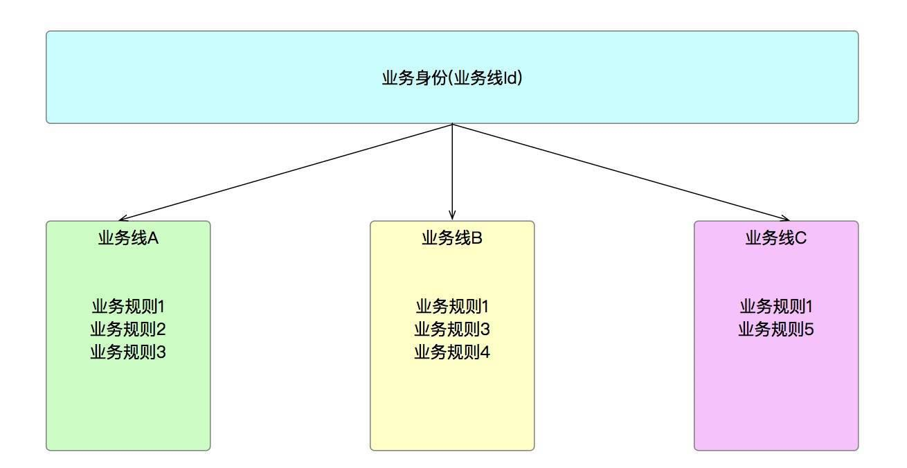
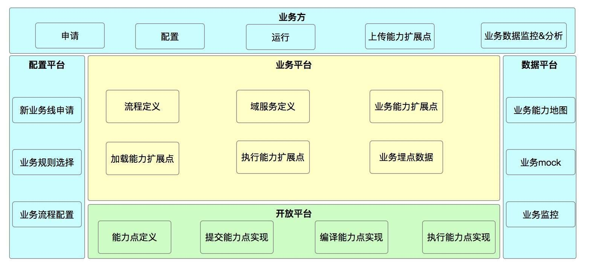

## 系统架构系列（四）：业务架构实战下篇  

> 作者: 高福来  
> 发布日期: 2019 年 6 月 24 日  

> 在[上一篇](https://www.infoq.cn/article/G*DTr9RmIyh0hR59ZTug)文章中主要讲了业务架构的基础部分，整体的[业务架构](https://www.infoq.cn/article/m*aORjCU6gQiIbPCVtoK)还有一些其它点要考虑，如业务之间的彼此隔离、业务与技术 \(平台\) 的隔离、业务能力地图的可视化、业务 mock 能力、业务监控等，本篇文章主要讲述这些内容。

### 一、业务彼此隔离

在较小的公司可能要体现这个没有对应的业务场景，但在大公司中，如果业务是平台型的，承接的业务方较多，业务方之间的需求还不一样时，就体现出了业务与业务之间的隔离。比如，优惠券业务是平台型业务，有多个业务线的业务方接入，它们的诉求也不尽相同：有的要实现业务线内不同用户角色的打通 \(乘客、司机等\)、业务线之间风控策略也不一样、优惠券发放规则也不一样…

业务与业务的隔离需要有一个标识来唯一标志，阿里有的团队叫 bizId，在我们团队是通过 productId\(业务线 Id\) 来区分。标识说起来简单，但它只是第一步，隔离的表象就是通过业务线来区分。思考一个问题为什么要实现业务之间的彼此隔离？

* **业务自身需求** ：这个很好理解，不同的业务有自己的特点。
* **业务之间的互不影响** ：隔离的目的就是为了互不影响，将变化的东西缩小到业务线内，不可能改动一个业务线的需求，结果把其它业务线影响了。
* **业务的[可扩展性](https://github.com/yishuiliunian/DZTableView/blob/master/articles/Chapter3/topic.md)** ：平台型的业务有一个最大的特点是要较好地支持可扩展性，往大的方面讲，新接入一条业务线的改动有多大、往小的方面讲，对于某个业务线内的需求改动又是多大，比较好的状态就是具备 **可配置** ，稍微配置一下，一个新业务线就接入，这是我们最想看到的结果。

通过 productId\(业务线 Id\) 这个唯一的业务身份串起整体业务，在业务处理过程中，可以知道这个业务线需要的具体业务策略和处理规则。

**结论一：业务与业务的隔离体现了业务之间的变化和独立性，所以就产生了业务与技术 \(平台\) 的隔离** 。

### 二、业务与技术 \(平台\) 的隔离

业务与技术 \(平台\) 的隔离 **体现了变与不变的关系** ，虽然这句话被很多人讲过，但不同的系统实现的策略不一样。平台型业务一般要解决 80% 以上的共性问题，20% 左右通过开放来实现。

业务与技术 \(平台\) 的隔离不像业务与业务之间的隔离那样，两个业务之间没有交集，业务与技术 \(平台\) 之间是有交集的，这让人听起来有些蒙，下面细细分析。

* **不同业务线之间有一条共性的业务流程** ：虽然不同的业务线产品之间有各自不同的点，但它们之间有一个明显共性的业务流程，这个业务流程是业务的生命周期，就好比类与对象之间的关系，本质是同一类事物，不同的对象好比不同的业务线产品，具体的实现上有些差异。在优惠券中，核心的业务流程就四个：建券、发券、用券、退券，不管什么业务线接入，它都遵守这条固定流程。

* **业务变化的是子流程中的内容** ：不同业务线产品的不同之处体现在哪里？体现在业务细节上，这个是变化的，如业务的准入条件不一样、业务规则不一样、有的子流程中某一个处理步骤不需要…，这些是变化的部分，需要把变化的部分抽象出来并封装变化。 **所以，不变的是业务大流程，变化的是业务实现细节** 。

* **业务与技术 \(平台\) 的隔离理解的二重性** ：有些人理解业务与技术 \(平台\) 的隔离就是业务的实现不依赖于技术，比如数据要怎样存储？服务治理用什么框架？…这些说的是对的，它本身没有错。而我理解是有两重含义：一就是如上面所说的，业务的实现不依赖于具体技术，偏技术选型，这是常识；二是领域层的可扩展性，前 2 项已经说了业务的共性和变化，这个就是体现出应对变化的策略，尽管不同的系统有不同的具体实现，但总的原则是平台要能识别出这些变化，并能应对这些变化。

业务与技术 \(平台\) 的隔离体现在共性和变化的隔离，把变化的部分告知平台、实现开放出来，所以说它们是有一定交集，这个交集就是应对变化的部分。它涉及到技术方面，所以在技术架构中会单独拿一篇来讲。

**结论二：业务与技术 \(平台\) 的隔离主要体现在处理业务的变与不变** 。

### 三、业务能力地图

我们有一个体会是开发和产品有时在谈一个需求时，开发用开发的语言、产品用产品的语言，两个很难统一，虽然通过[领域建模](https://www.infoq.cn/article/6hpBsMXQNGx_EAPKUuWS)可以统一认识，但是随着时间的推进，人员结构也在不断变化，如何快速熟悉业务、统一业务认识是一个问题。

发现通过业务能力地图来表示业务流程，可以减少沟通、统一认识、可视化表示业务产品功能所经过的关键业务路径，这样一个新人进来通过这个业务能力地图就可以知道业务的主流程是什么，产品功能涉及到哪些业务子流程，针对一个需求，开发不需要看代码哪里要修改，很直观地在业务能力地图可以知道本次需求涉及到的改动点，从而提升整体效率。

在做业务能力地图之前是有条件的，否则只是一家之言，有什么意思呢？就是业务已经进行了领域建模，业务产品和开发达成了统一的认识，业务的领域对象有哪些、业务的主流程、子流程有哪些、业务的准入条件、规则判断等，只有这些大家已经统一认识了之后，再通过技术手段把这些信息可视化表示出来就行，否则只会站在开发的角度来理解要表示哪些流程步骤。换言之，业务能力地图中所展示出的节点信息都是开发、产品统一的语言。

业务能力地图是领域模型的进一步扩展和延伸，领域模型偏静态的表达领域对象和领域对象之间的关联关系；而业务能力地图是动态的表达业务执行流程是什么。领域模型是基础，业务能力地图是进一步的扩展，一个表达有什么，一个表达怎么做，一动一静，可以更好的理解业务和业务流程所涉及到的核心步骤。

**结论三：业务能力地图是在领域模型的基础之上进一步扩展，可视化地表达业务流程** 。

### 四、业务 mock 能力

业务 mock 能力是指 mock 用户数据方便排查问题，排查问题的第一步是重现问题，尤其是在端上，可能在某些条件下展示有问题，用测试数据又没有重现这个问题，如何来做呢？可以通过 mock 用户的信息来展示数据，说白了就一句话 **偷天换月** ，在最底层的查询时，把用户信息置换掉。举个例子，用户在下单时发现有些优惠券没有展示在列表页中 \(实际上是有些优惠券不满足订单条件，如满减券、限门店使用等\)，用户向客服反映，客服再向技术支持人员反馈，技术支持人员再往具体的开发反馈，这个链路就很长了。如果客服同学使用这项 mock 能力，完全可以通过 mock 用户数据来当前的数据是怎么展示的，再看用户所有优惠券，对比优惠券的限制规则就能知道哪些优惠券不能使用，这样就可以快速响应用户问题。

使用这个 mock 能力时，有一点需要考虑的就是数据安全，并不是所有的行为都可以 mock，一般来讲只有读场景下才能 mock；还有一点需要注意的是全链路 mock 范围，只有在指定的接口上才能 mock，不能直接从导购链路一路往下 mock，只会在最底层的业务接口上进行 mock，否则全链路数据都被置换了。

**结论四：mock 主要方便问题重现和定位** 。

### 五、业务监控

业务监控也是非常重要的一个环节，不同的公司用的方法也不尽相同，也要看业务规模和公司的实际情况，不可能要求所有的公司都使用大数据来分析。根据自己的经历谈谈这块。

小公司直接统计业务数据表，比如之前做过金融，根据还款数据拆分成还款计划，还款计划再生成对应的还款订单，这里面的涉及到的业务数据就比较多，但能够很好地进行监控，当时根据业务数据状态、数量来判断业务是否已经处理完了，通过核对数据看今天的业务执行是不是正确的。这虽然很简单，通过写[SQL](https://baike.baidu.com/item/%E7%BB%93%E6%9E%84%E5%8C%96%E6%9F%A5%E8%AF%A2%E8%AF%AD%E8%A8%80/10450182?fromtitle=sql&fromid=86007)\+ 定时执行 shell 脚本就可以搞定，在业务的初创期它最简单，关键是提炼出监控的指标和维度。

在大公司，通过日志采集、清洗、实时统计，可以看出当前业务的处理情况，有同比、环节的数据，如当前下单率是多少，通过监控这个指标可以看出业务是否正常，如果下单率明显下跌比较厉害，大概率是哪个链路上出了问题。

通过业务监控大盘分别从不同的维度来监控业务运行状况，从而可以分析判断出当前业务是否受影响，帮助开发人员提前发现问题，这一块也涉及到稳定性方面，大公司是非常重视这一块的，阿里双 11 会专门成立稳定性小组，稳定压倒一切。

**结论五：没有业务监控的系统对业务的运行状况一无所知** 。

### 六、小结

本篇文章是在上一篇文章的基础之上，对业务架构进一步补充，在平台型的业务中，着重注意业务与业务的隔离、业务与平台的隔离，实现最少的投入实现最大的业务价值。后面提到的业务能力地图、业务 mock 能力和业务监控是从工具层面上统一人员认识、提升沟通效率、快速发现、复现问题。接下来的系列就是技术架构了，从技术的角度解决常见的问题，如高并发、高可用、稳定性、高可扩展等。

**作者介绍：**
高福来，先后在 Oracle、阿里工作，目前在[滴滴](https://www.didiglobal.com)小桔车服加油团队负责营销基础 \(优惠券、奖励金\)，在分布式中间件和系统架构方面积累了一定的经验，擅长用通俗易懂的语言描述复杂问题。

**相关文章：**
[《系统架构系列（一）：如何用公式定义该概念？》](https://www.infoq.cn/article/fwhQ-dIN2xTUH6zNLYZp)
[《系统架构系列 \(二\)：应对这一概念的方法》](https://www.infoq.cn/article/NON4ahRV9pC3Feoc0-VC)
[《系统架构系列 \(三\)：业务架构实战上篇》](https://www.infoq.cn/article/G*DTr9RmIyh0hR59ZTug)
