## 下一代AI系统基石：知识图谱将何去何从？  

> 原创：  
> AI前线小组  
> 发布: AI前线  
> 发布日期: 2019-06-04  

 作者 | 尹陞蔚  编辑 | Natalie  **AI 前线导读：** 2012 年，Google 提出知识图谱的概念并将其用于搜索引擎中， 伴随 AI 技术的快速发展，智能服务的出现让知识图谱显得尤为重要，那么，作为知识工程的重要分支，它会给智能服务带来哪些影响？知识图谱真正要做到成熟可用，还将面临哪些挑战？

5 月 30 日，北京智源人工智能研究院在清华大学开展了以「知识与认知图谱」为主题的讲座，本次讲座上，来自清华大学计算机系的四位学者分别从知识工程、深度学习、自然语言处理和异质资源搜索与推荐四个角度，介绍清华大学近些年相关领域的研究成果。

**更多优质内容请关注微信公众号“AI 前线”（ID：ai-front）**

本文将会以李涓子教授和刘知远副教授两位讲师的内容出发，重点介绍知识图谱的发展现状以及它在应用中存在的问题和解决方案。

处于技术启动期的知识图谱

大数据时代，通过对数据进行语义层面的解释可以挖掘到许多隐藏的知识，它们被用于机器智能，这是从数据到智能的转化过程。

专家系统的出现让知识显得尤为重要，它是人工智能对客观世界认知的渠道。不同于富含语义的人类交流，大数据的机器学习仍集中于低维特征空间。由于两者之间互不相通，因此作为桥梁的知识图谱起到了重要作用，同时，它也是整合客观事件与实体的关键。

作为新一代人工智能系统的基础，知识图谱的重要性不言而喻，根据 2018 年下半年发布的 Gartner 曲线可以得知，知识图谱的发展至少还需要 5 - 10 年时间才能到达一个相对成熟的阶段，而通用人工智能的实现则更是需要至少 10 年。

综上所述，知识图谱的发展必定要解决这两个问题：

* 加强高质量知识图谱的自动标注，减少人为干涉。

* 整体形态不再局限于三元组，更丰富的信息形态可以带来更好的表现。

知识图谱存在的问题与解决方案

知识图谱在发展过程中仍存在许多技术难题，目前主要有以下几点：

* 机器学习中实现可解释智能的方法；

* 大数据环境下实现基于知识和数据驱动的方法；

* 知识不确定和不完整的情况下完成知识推理；

* 对高质量、大规模知识的研究获取算法。

知识图谱不仅仅是知识库，它在物联网时代会发挥更大的作用，以 IBM 的 IoT 项目为例，物联网设备在知识图谱上存在相互联系的关系，假设传感器是一个节点，那么通过解析传感器之间传输的数据便可以为用户提供服务。

除了表示学习，实体和词向量的表示学习同样存在许多挑战，这其中包括词的歧义和词与实体联合表示两部分。

词的歧义是指一词多意的问题，这在词向量表示中问题较为明显，由于同一实体可能对应不同客观事物的问题，因此词向量表示的同时也需要对相关词的词义做对应的表示。

以乔丹这个词为例，假设迈克尔·乔丹对应两个实体，那么在做实体表示的同时就需要使用不同的向量表示，如果篮球乔丹是实体，那么其应该与篮球相关的词在向量上更为接近，而教授乔丹则与机器学习相关的词更为接近。

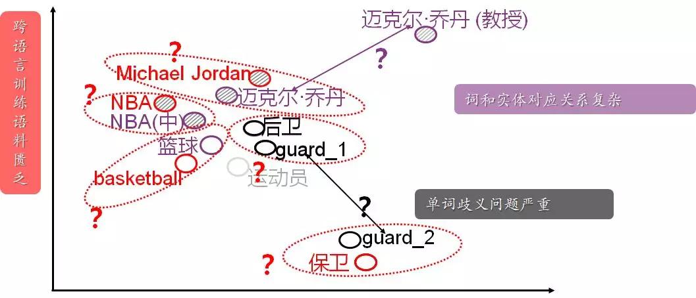

这个问题目前有两种解决方案，即词义表示与基于词义的词和实体联合表示。

其中，联合表示学习主要是通过将词和实体映射到统一低维向量空间，让具有相似语义或知识结构的词和实体具有相近的向量表示，以实现跨语言、文本和知识库的联合推演。相较于词义表示，联合表示学习具有以下几点优势：

* 支持联合计算，促进词和实体语义互操作和语义融合；

* 提升表示精度，解决文本中词和实体的潜在歧义问题；

* 缩小语言鸿沟，支持跨语言自燃语言理解等相关任务。

此外，词和实体的联合表示学习又被分为基于词义的词和实体联合表示学习，及远程监督的跨语言词和实体的联合表示学习。在这两项技术的基础之上，利用神经网络将跨语言协同实体连接，这样可以解决跨语言的词和实体表示问题。

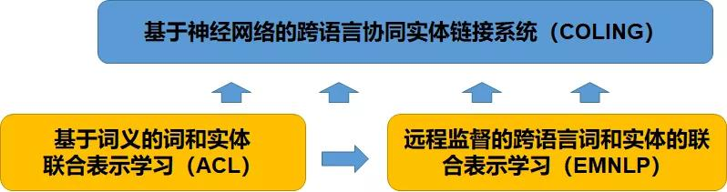

词义的词和实体联合表示学习分为实体表示学习、对齐模型、词和实体提及表示学习三个部分，其中实体关系图被用于实体表示学习，带有锚文本的文档在提取义项映射词后分别被用于对齐模型和表示学习两个部分。

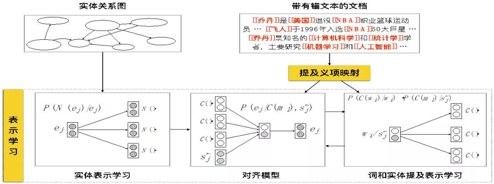

其中，跨语言联合表示学习利用实体关系图打破语言界限，结合跨语言相似句对以及图神经网络，让实体与实体之间通过映射对应语义的上下文，结合联合表示学习最终得到跨语言的语义向量空间。

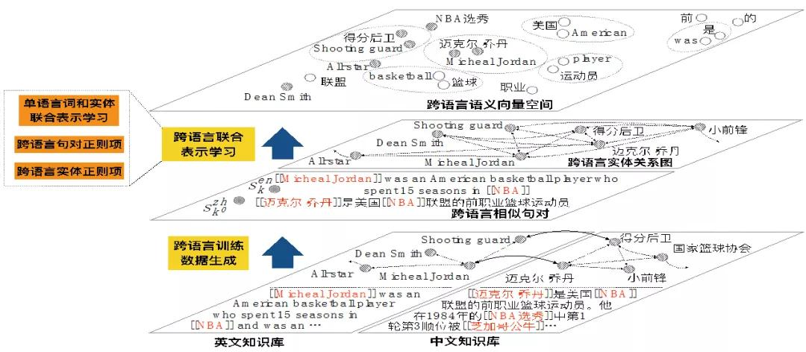

在跨语言的词和实体表述基础上，词和实体的表示就可以实现对任意文本的实体链接，再通过映射对应语义的上下文以实现大规模实体训练。

目前，这项技术已经被用于构建专家知识库的「学者画像」，这其中最简单的应用就是分类体系的概念，其中兴趣标签可以看作是知识图谱里面的知识标签，利用知识标签和上下文关系的解析，可以得到更为详细的信息。

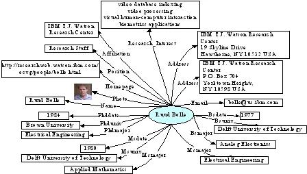

通过「学者画像」，学术界可以得到关于他更多的信息描述，其中包括研究兴趣的变化、学术活跃度、研究多样性等方面，这些均通过分析论文以及合作者关系得出。此外，这项技术还可以被用于会议的搜索和挖掘，例如会议上发表论文最多的学者以及引用最多的作者以及论文内容。

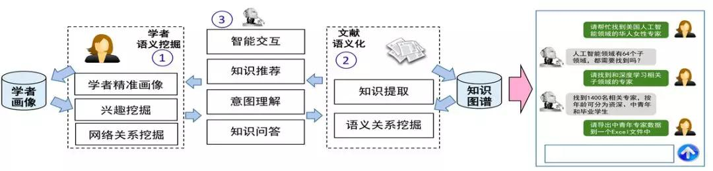

除此之外，利用「学者画像」得到的一些数据还可以被用于制作技术发展报告，以便于实现对某领域技术发展趋势的预测。

知识图谱对自然语言模型的影响

自然语言处理技术中，复杂的知识库可以提升深度学习的理解能力，经过统一语义表示空间处理后文字、句子、短语甚至文章等语言单元可被用于复杂的自然语言处理任务，其中不乏包括语义分析、句法分析和词法分析等。

自然语言文本中蕴含丰富的语言知识和世界知识，知识图谱和深度学习的双向驱动可以有效提升自然语言处理的效率，此外，机器翻译的神经网络模型则有以下两个特点：

* 将所有的语义表示为低维向量空间；

* 语言之间的翻译实际上是低维网络空间里面的多层跳转。

另外，它还包含非常多的语言单元，主要分为字、词、短语、句子和文档五个部分，翻译可以看做是不同语言之间的语句联系，以问答系统和信息检索为例，自然语言处理主要是被用于解决语言单元之间语义联系。

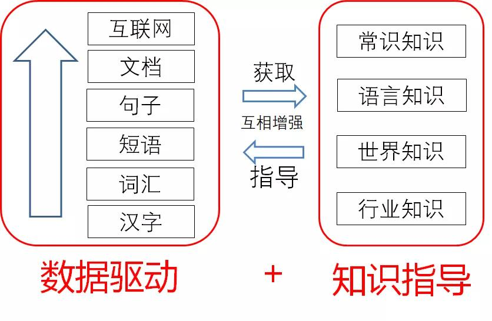

目前，自然语言处理技术尚无法实现数据层次到更深层次的理解，因此知识提取十分重要，深度学习在理解海量数据之后可以获得大量知识，并以此构建对应的知识图谱。同时，经过表示学习获取的知识也可以被用于深度学习的知识指导。

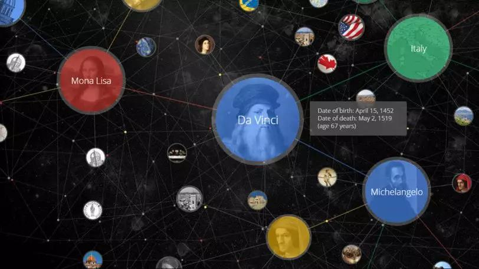

人类知识以离散符号的形式表示，但它不与深度学习低维向量相容，通过将结构化知识映射到低维向量空间，便可以将语言中知识、文档、句子和词汇等单元与符号相融合，实现跨领域知识理解。

那么，这些问题该如何解决？这就不得不提及语言知识库。

目前，知识领域比较有名的两个语言知识库分别是英文知识库 WordNet 和中文知识库 HowNet（知网），其中 HowNet 提出的义原概念，让人类语言的所有词汇、短语、句子甚至文档被分解成更为细化的部分。

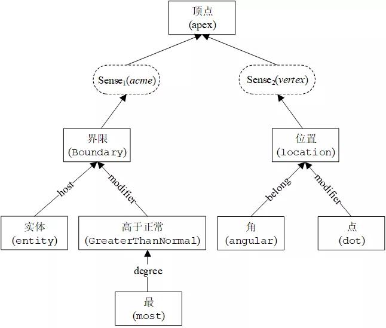

其中，每一个义原可以看做是独特的词义标签，这个标签的意义是明确固定且互相独立的，义原之间还标记了对应的语义关系，那么，是否可以让义原知识协助指导数据驱动知识学习？目前已经有两种方案：

* 利用自然语言处理比较有名的词表示学习，其中比较有名的就是以纯数据驱动的 word2vec 算法，引入 HowNet 知识库可以实现义原、词义和词汇进行联合表示学习。

* 而在句子层面，语言模型显得尤为重要，目前深度学习框架一般采用 CNN 或者 RNN 训练语言模型。

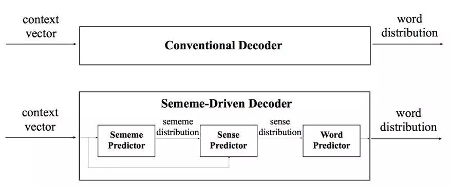

但是在实际文本中，依旧有大量的词没有在 HowNet 里面被标注，不过这个问题可以利用义原的自动推荐解决，它主要是通过整合词组成的义原实现，目前这项技术已经可以达到比较好的预测结果，它也可以被看做是未来重要的方向。

利用深度学习帮助单词相关义原知识的预测，之后再用义原知识来协助理解互联网上的文本信息，这项技术可以被用于语言和常识知识库的探索。

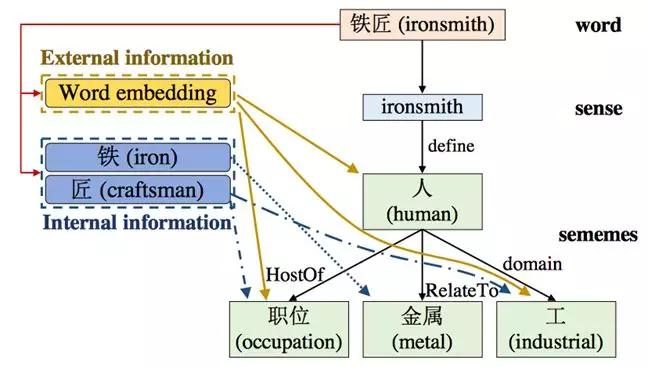

除了以 HowNet、WordNet 等为首的语言知识库，还有商业引擎和大型知识图谱构建的世界知识库，它不仅包含了现实世界中各种各样的实体，还涵盖了他们之间的关系，世界知识库、语言知识库整合至数据训练库中，机器学习的性能会显著提升。

世界知识库可以协助理解复杂知识文本，深度学习自然语言处理的同时协助文本中的知识获取可以让相关工作形成闭环，以此实现知识图谱和深度学习双向驱动的效果。

知识图谱的发展以及学术界的探讨

整体来看，语言知识库和知识图谱是提升机器学习性能的关键。目前大多数知识图谱依赖人工构建，仍然缺乏从大规模数据里获取的手段。

本次论坛中，清华大学的李涓子教授表示他们将会在以下几个方面做出基础性和建设性工作：

* 支持鲁棒可解释的知识表示获取和推理的基础理论以及方法研究工作；

* 建立大规模的知识库以及对应平台，其中知识平台主要是用于维持知识的生态系统；

* 利用科技情报大数据简历基于学者和知识的平台，并以其为基础提供相应的智能服务；

* 构建一个集群体智慧、开放、融合、结构化的知识图谱基础平台，从而降低构建门槛。

目前，清华的 XLORE 跨语言知识图谱已经包含大约 137 万条知识，此外，他们还基于跨语言知识库推出双语协同实体链接系统 XLink。大数据挖掘与智能服务平台 —— AMiner 则被用于学者搜索，通过给学者打上兴趣标签，用户可以利用这些标签对需要查找的专家有更深层次的了解。

除了跨语言知识图谱 XLORE、双语协同实体链接系统 XLink 和专业数据智能服务平台 AMiner  ，清华还在 Github 推出集义原计算、知识表示和知识获取等算法工具汇总的工具包 Thunlp，其主要包括以下几种工具：

* THULAC —— 中文词法分析

* THUCTC —— 中文文本分类

* THUTAG —— 关键词抽取与社会标签推荐

* OpenKE —— 知识表示学习

* OpenNRE —— 神经网络关系抽取

* OpenNE —— 网络表示学习

* OpenQA —— 开放域自动回答

对这套工具感兴趣的读者可以在 https://github.com/thunlp 了解更多信息。

> ##### 今日荐文

点击下方图片即可阅读

[

我放弃了成为一个全栈开发工程师的理想

* * *

限时福利

多语言阿里小蜜、美团智能调度、云上智能机器人，众多领域纷纷引入人工智能，多种技术组合后打包为产品或服务，改变了不同领域的商业实践，使垂直领域 AI 商业化进程加速，从而掀起一场智能革命。7 月 ArchSummit 全球架构师峰会，阿里、美团、腾讯等多位技术专家与你分享 AI 最新技术，扫描下图二维码或点击【阅读原文】，查看大会详细日程：

* * *

**你也「在看」吗？** 👇
