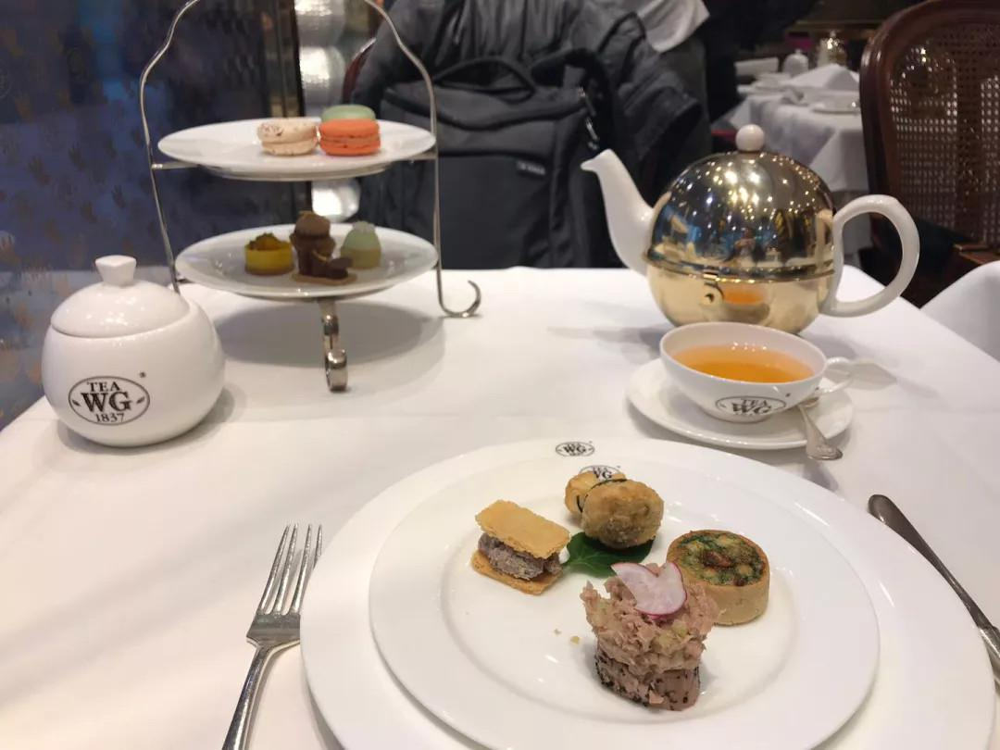
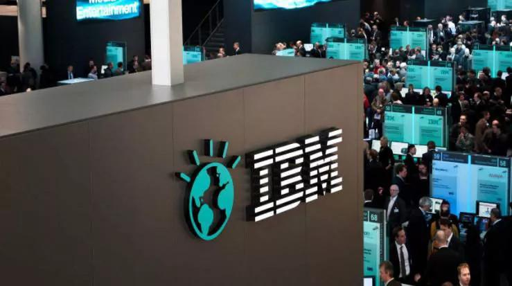
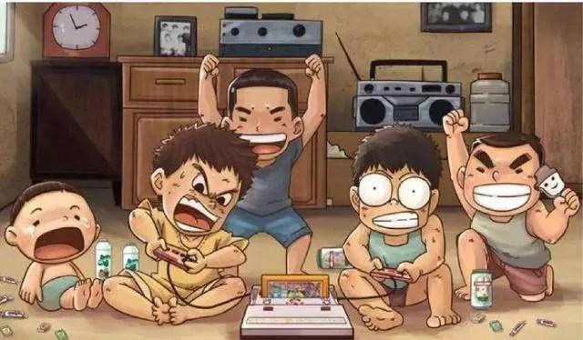
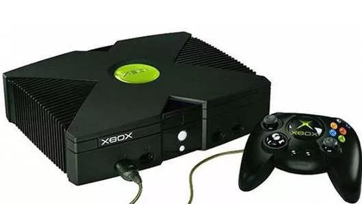
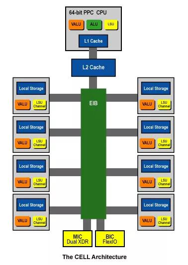
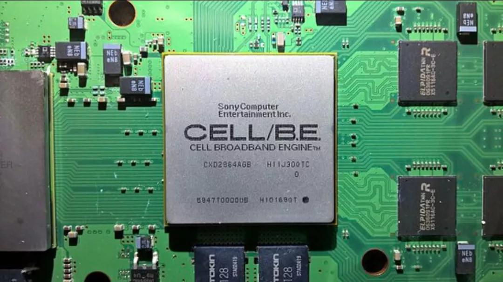
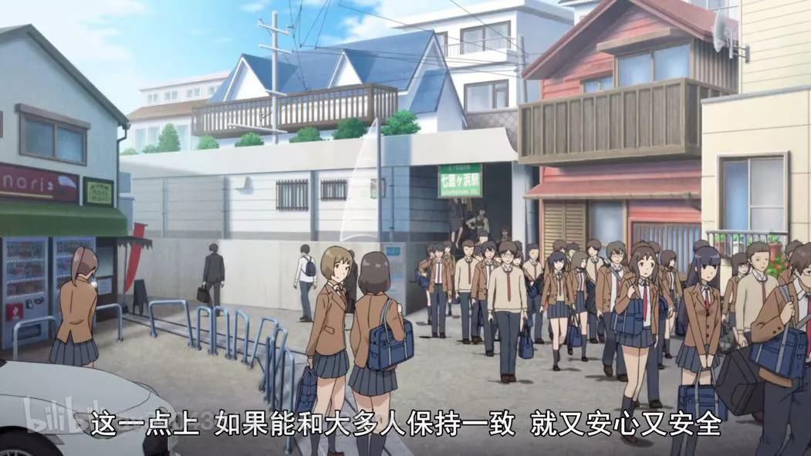

## 芯片江湖往事：15年前，耗资40亿美元的自主可控CPU奇幻冒险_36氪  

> 发布: 36氪的朋友们  
> 发布日期: 2019-06-05  

编者按：本文来自微信公众号[“互联网与娱乐怪盗团”（ID：TMTphantom）](https://mp.weixin.qq.com/s/toMlc3myiabYsMd2ePNTgQ)，作者 怪盗团团长裴培。36氪经授权转载。

### 01.关于芯片江湖，你不知道的太多了

“芯片的江湖，又开战了。”老者喝着茶，淡淡的说。

“为什么要加个又字？”少年困惑地问道。

老者是一副看淡世事、生无可恋的表情，少年则是血气方刚、怀疑一切的样子。显然，少年很有理想、很爱家乡、像初生牛犊一般天不怕地不怕。他无法理解，老者是怎么变成现在这样老气横秋的，难道是过去失败的太多，被磨光了棱角。

老者悠然长叹：“我看见日本人建高楼，又看见日本人宴宾客，最后看见日本人楼塌了。当初芯片江湖的霸主是日本人，你还小，不会记得了……”

少年争辩道：“我知道！1980年代，日本半导体冠绝全球，是美国人逼他们签了协议，限制出口配额，然后……然后本土市场不够大，日本芯片行业就没落了！”

老者转过头，用怜悯的眼神看着少年：“这些乱七八糟的东西，你都从哪儿学的啊？”

少年涨红了脸：“我每天看十几个公众号，还看知乎专栏，还看纪录片……”

人生苦短，不如喝茶

老者挥挥手：“好吧，你可知道，日本芯片行业直到21世纪初，还想夺回江湖霸主之位？而且，还付诸行动，据说差一点成功——实际上是差很远罢了。”

少年惊呆了。没人对他说过这回事。他屏气凝神等着老者的下一句话。老者自顾自地喝茶，等到一壶茶喝完了，少年好奇的目光还没有消散。

老者笑了：“那就讲给你听吧。”

### 02.索尼、东芝找到IBM，想干个大买卖

2000年夏季的某一天，索尼和东芝敲响了IBM的大门。当时，这两家都如日中天，尤其是索尼，连续打赢了两代游戏主机战争，PlayStation 2成为了美国小孩最想要的圣诞礼物，拳打任天堂、手撕世嘉毫无压力。索尼在游戏行业闹的动静太大，让软件行业的扛把子——微软都坐不住了，嚷嚷着要加入战局，可是没人把它当一回事。

IBM此时正处在从硬件公司向软件+咨询公司的转型期，处境尴尬，对日本大金主自然不敢怠慢：“二位爷台来，想必是看上了小店的硬盘存储技术？”

索尼和东芝无动于衷。IBM又问：“那么，是看上了小店的服务器解决方案，要用在家庭娱乐联网服务里？”

对方仍然无动于衷。IBM恍然大悟：“你们看上了我们的OS/2操作系统，想用在家庭娱乐设备里！真是慧眼识英雄，我们比微软……”

说实话，在历史上，IBM一直都很强

索尼终于打断了IBM的自卖自夸：“跟我们一起开发CPU。你出人，我们既出钱、也出人。”

IBM大惊：“啥？CPU？”

索尼：“PowerPC, 就是你们给苹果开发的那个玩意。”

东芝：“我们对每一款PowerPC CPU进行过深度测试，性能很不错。”

IBM：“多谢夸奖。但是，你们想用它做什么呢？”

索尼：“统一江湖。抄了英特尔的老巢。届时，我们是全球民用芯片行业的老大。我们三家一起。”

IBM无语了。他心想：怪不得都说小日本不靠谱，这种傻话都说得出来，昨天喝了多少酒？索尼看出了他疑惑的表情，哈哈大笑，从怀里掏出一瓶陈年威士忌，按照西方人的习惯给在座的一一斟上，借着酒劲回忆起了往事。

### 03.游戏主机，高端民用芯片的试炼场

1970年代，半导体行业处于井喷时期，在理论端和应用端都大踏步地前进着。两个重要发明，将芯片真正带进了千家万户：一个是个人电脑\(PC\)，一个是游戏主机。前者造就了苹果、微软、英特尔，后者造就了雅达利、任天堂、世嘉，它们都是一时新贵，风光无两！

直到1990年代，游戏主机的出货量都高于个人电脑，就连主机游戏软件的出货量也高于个人电脑软件。原因很简单：游戏主机价格便宜，200-300美元就可带回家，能满足合家欢娱乐需求。

个人电脑平均价格超过1000美元，而且多媒体技术尚未成熟，娱乐效果较差。但是，从硬件架构看，游戏主机其实就是定制的电脑，也有CPU、GPU/PPU、内存、存储设备等配置，只是在设计时更偏重娱乐性而已。

80后小时候肯定都玩过红白机，对吧？

在那个年代，民用计算机芯片的技术路线可谓百花齐放：英特尔的x86系列在PC市场一枝独秀，AMD、Cyrix等x86兼容厂商跟着喝汤；IBM的PowerPC被用于苹果的小众市场，并在服务器领域颇有存在感；还有仙童半导体、摩托罗拉、德州仪器、NEC、Mostek⋯⋯你听过或没听过的各路大神，都开发过计算机芯片。

在基础架构上，绝大部分民用CPU可以划分为RISC和CISC两大阵营（x86属于后者），不过对这种技术细节，吃瓜群众就不用了解太多了。

芯片技术的百花齐放，给了游戏主机厂商很大的自由度：它们可以在各路解决方案中，选出自己最满意的，再加以深度定制，从而区别于一切竞争对手。

例如，任天堂SFC采用了MOS6502 CPU，世嘉MD则采用了摩托罗拉68000 CPU；索尼PS采用了3D软加速技术路线，任天堂N64则采用了看似更先进的3D硬加速……各路解决方案谈不上严格的“最优解”，关键是在达到技术要求的同时，维持较高的性价比，还要方便第三方软件商的开发，从而构成完善的生态系统。

附带说一句，对游戏主机市场稍有研究的人，就会知道：“深度定制硬件”不是什么特别有技术含量的事情，当年还在做花牌的任天堂就能定制彩色游戏主机（带显示屏）、掌机了，以做家电闻名的索尼也能定制出历史上最卖座的游戏主机。时至今日，居然还有人说“某家的云计算服务器是找人定制的，所以技术水平碾压其他家”，这就是视野太窄、不熟悉历史的恶果。唉，人之大患，在于不读书！

然而，游戏主机厂商的定制路线，到了1990年代末期，逐渐玩不下去了：民用计算机芯片市场几乎被x86统一，德州仪器、摩托罗拉之流都被边缘化了，NEC自我封闭的PC 98也濒临灭绝了；这样下去，今后找谁定制呢？

索尼PS2使用的是东芝研发、索尼深度修改的Emotion Engine CPU，而竞争对手微软Xbox干脆采取了英特尔P3赛扬CPU，那可是市面上最通用的解决方案。由于经验不足，微软Xbox未能取得太大成功，但是这个趋势非常可怕。

采用英特尔x86芯片的微软Xbox主机

如果有一天，x86彻底统一了民用芯片江湖，那么游戏主机产业真的没什么可玩了：大家的技术路线类似，性能半斤八两，没人能出奇制胜，只有依靠性价比和规模了（这就是现在发生的事情）。与英特尔狼狈为奸的微软，当然巴不得这种情况发生；可是索尼岂能容忍？即便这一天还有很久才会到来，现在就得开始行动了。

### 04.我们干脆合伙把英特尔消灭了吧

“面对微软-英特尔联盟这个穷凶极恶的对手，守是守不住的，必须攻出去。”索尼冷酷地说。

“您想怎么攻出去呢？”IBM苦笑。

索尼：“我的PlayStation初代和二代主机，销量都超过1亿台，配套游戏卖出不止10亿套，这就是生态系统。我们合伙开发一款最厉害的CPU，用在下一代主机里，必将彻底碾碎竞争对手。届时，我们再从游戏市场打出来，用规模优势反攻PC市场，我就不信英特尔还站得住！”

东芝：“没错，我们也会将这款CPU用于自己的智能电视，统一正在兴起的智能家电市场。届时，我们就是多数派，英特尔才是少数派！你们讨厌英特尔，对吧？我们也讨厌，那就让他死给我们看。”

IBM心想：日本真是倒血霉了，好不容易出了两个信息技术巨头，偏偏都患上了妄想型精神病！他堆出礼节性的笑容：“二位爷台可知道，做这件事情要花多少钱吗？”

东芝：“4亿美元够不够？”

IBM摇摇头：“恐怕不够。”

索尼：“那么，40亿美元呢？”

三个月后，由索尼、东芝、IBM共同拥有的Cell芯片研发中心在美国德州奥斯汀拔地而起。今后四年，将有超过400位全球顶尖的芯片工程师在此工作。在奠基仪式上，IBM的小弟悄悄问他：“您昨晚喝醉了还痛骂索尼和东芝是痴心妄想呢，怎么今天还是来奠基了？”

IBM嘟囔着：“反正不是我出钱……”

千万不要在喝酒之后谈正事，太嗨了会误事

2001年，索尼和IBM联合举行发布会，首次公布了研发中的Cell芯片的技术指标：每秒执行1万亿次浮点运算，具备分布式计算能力，与超级计算机相比毫不逊色！在媒体的口耳相传之下，“Cell处理器可以模拟地球”成为了一个著名的哏。

如果这是真的，索尼显然将赢得下一世代的游戏主机战争；至于英特尔嘛，它不会灭亡，但是应该会慢慢堕落为一个无足轻重的小角色。x86对计算机芯片的统治即将走到尽头，未来将是Cell的大时代。

Cell的架构非常复杂而又奇怪：它同时具备CPU和GPU的功能，还为云计算、边缘计算留出了空间。它在本质上是一款超级计算机芯片，但是为了家庭娱乐需求做了大幅扩展。它必须同时满足四种截然不同的需求：超级计算机和高端服务器；桌面PC；家用游戏主机；高清电视等智能家电。

幸亏当时还没有智能手机市场，否则索尼肯定会要求再开发一个低功耗版本，与ARM竞争。直到今天，没有任何一款处理器、任何一种技术架构能够无缝满足以上所有需求。这种玩意不失败才是不正常呢！

经过漫长的研发试错，索尼、东芝和IBM的工程师们拿出了一个惊天地泣鬼神的技术架构：一个简化PowerPC主处理单元，附带二级缓存；八个传统PowerPC协处理单元，不附带缓存；主处理单元和协处理单元各自有不同的内存。

为什么搞的这么复杂呢？索尼的设想是：主处理单元只负责一般运算，与图形处理相关的浮点运算全部扔给协处理单元。如果你看不懂那就对了，因为没人看得懂。关键是：这个看起来很厉害的架构从来没有真正实现。

### 05.芯片史上最大笑话是怎样炼成的

最迟到2004年，索尼发现：Cell芯片的性能根本达不到预期；具体的说，是浮点运算能力达不到预期，之前吹嘘的“模拟地球”就是个笑话。而且，就算达到了预期，游戏开发商肯定也不懂如何操作八个协处理单元，导致游戏画质非常感人地缩水。怎么办呢？已经付出的40亿美元打了水漂，索尼不得不再花一笔钱，请英伟达定制一款GPU，勉强让PS3主机具备了过得去的浮点运算性能……

史上最复杂的Cell处理器架构

同样是在2004年，索尼和IBM找到了苹果掌门人乔布斯，向他推销Cell处理器。考虑到苹果电脑以前一直采用PowerPC处理器，此时换用Cell不是顺理成章的吗？然而，大神就是大神，乔布斯一眼看出Cell架构有严重问题，就算索尼抛出了“附送其他核心技术”的诱饵，他也不肯上钩。

最后，苹果居然投向了老仇人英特尔的怀抱，全面采用x86处理器！索尼还向很多智能家电厂商推销Cell，无奈大部分人都更喜欢低功耗的ARM。最后，除了索尼、东芝、IBM自家的硬件，Cell处理器只被极少数第三方用于视频解压卡，真是凄凄惨惨戚戚。

无论如何，Cell的大本营是游戏主机，只要索尼PS3赢得次世代主机战争，Cell就能赢得未来。但是，Cell处理器在制造环节的良品率也迟迟提不上来，直接导致PS3比竞争对手晚了一年上市。

搞笑的是，竞争对手微软的Xbox 360居然也从IBM购买了PowerPC芯片，只是巧妙地回避了复杂的Cell架构，从而达到了较高的性价比、较快的制造流程。从竞争对手到第三方，大家都知道Cell的问题出在哪里，只有索尼当了冤大头。

等到索尼PS3千呼万唤始出来，价格又把大家震住了：基础版本499美元，高端版本599美元，几乎是竞争对手价格的两倍……而且，就算在这么高的售价下，索尼每卖出一台设备，还是要亏损241-360美元！罪魁祸首当然是Cell芯片，这玩意研发超支、需求不足导致制造成本无法摊薄，而且还是个半成品，必须靠英伟达救火。

为了推卸责任，索尼大造舆论，说自己被英伟达的老黄坑了，由此引出“抬头看苍天，老黄饶过谁”的烂哏。讲真，如果没有老黄救场，PS3的浮点运算能力就彻底玩完了，那时候索尼不破产都谢天谢地，真是一头白眼狼。

从2006年上市开始，索尼PS3一直在亏钱，亏到2009年才转为盈利，累计亏损额可能超过30亿美元。平心而论，IBM还算尽心尽力，直到2007年还在试图抢救Cell芯片，无奈实在救不活。最后，Cell研发团队解散，Cell产品线被重新并入IBM的主流芯片产品线。

至于索尼和东芝有没有学到什么自主可控芯片的核心技术？拜托，快要破产的公司还玩什么自主可控，活下去是第一要务！在“自主可控而死”和“委曲求全而生”当中，选择前者的都是真英雄，真英雄都活不到结局。

Cell处理器就长这样，好看不？

### 06.一人之心，天下人之心

“后来呢？后来索尼有没有去报仇？”少年听完故事，急不可耐地追问。

老者皱着眉头：“报仇？找谁报仇？”

少年：“找英特尔，找微软，找IBM！它不是缓过劲来了吗，可以报仇的！”

老者差点呛住：“为什么要找他们报仇啊？”

少年：“英特尔抢走了Cell的目标市场，微软害得索尼PS3连年亏损，IBM出工不出力还干私活，都是仇家！”

老者悲哀地摇了摇头：“你是天生杀人狂吗？如果让你执掌一个门派，估计三天都撑不下去。”

少年大怒，极不服气：“什么意思？”

老者：“先说IBM，他已经对索尼仁至义尽，技术、人力一点也没少投入，还因此丢掉了苹果这个老客户。虽然它把PowerPC卖给了微软，但是并没有卖Cell；这种老朋友，怎么在你眼里变成了仇人呢？”

少年语塞。老者继续说：“在整场大戏当中，英特尔一个手指也没动，它算准了Cell根本扶不上墙。苹果投靠英特尔只是正常操作。再说，x86又不是英特尔一家的，还有AMD呢。在商场上真刀真枪干不过对手，对手就变成你的仇敌了吗？”

没等少年接话，老者接着说：“至于微软，它也是可怜人啊，PowerPC架构没有它想象的强大，还闹出了三红门这种丑闻，在游戏主机市场算是砸牌子了。对于这种日薄西山的竞争对手，更没必要仇视了……”

少年点点头，平复心情，心悦诚服地问：“在您看来，索尼、东芝、IBM齐心协力唱的这出大戏，为什么还是没能击败英特尔，没能搞出自主商业化CPU呢？”

老者说：“一人之心，天下人之心。”

少年大惑：“什么？”

要活下去，关键是与多数人保持一致

老者说：“如果Cell处理器的技术实力全面发挥出来，确实可以超过x86处理器。但是，软件工程师宁可去研究x86、为x86做深度优化，也不愿意学习复杂的Cell架构。

多年以来，x86构筑了一个庞大的生态系统，上面有无数商业软件、共享软件、开源软件、开发者社区……就算Cell能赢得游戏主机的这一局，又岂能在广阔的PC市场有一丝一毫胜算？乔布斯拒绝Cell而选择x86，真正的理由并不在技术层面。”

少年点头：“怪不得索尼自己在下一世代的PS4游戏主机中，也采用了AMD的x86整合处理器。”

老者微笑：“你曾对我说，日本半导体产业败于美国，是因为美国逼着他们签署什么出口配额协定，是吗？那是鬼话，无论有没有这个协定，他们都赢不了。”

少年：“为什么呢？”

老者：“一人之心，天下人之心。天下的贤才都愿意去硅谷，天下的开发者都愿意与硅谷合作，天下的创意都集中到硅谷去了。这根本不是美国与日本的交战，而是天下与日本的交战。日本再强，打得过天下吗？”

少年连连点头：“知道了，我知道了。”

老者倒掉早已变凉的茶水：“后人哀之而不鉴之，则使后人复哀后人也。”

少年站起身，鞠了一躬：“在江湖上，要想胜利、要想当霸主，就要让我们的敌人少少的、朋友多多的，要全天下的人都当我们是好朋友，都愿意跟我们合作。剑道的精髓，不是快，不是狠，而是不杀！”

老者终于露出了赞许的目光：“没错！赢得一场战斗的，或许是更狠、更厉害的人；但是赢得整个江湖的，一定是更宽厚、更开放、更能交朋友的人！”
