## 知乎千万级高性能长连接网关揭秘  

> 作者: faceair  
> 发布日期: 2019 年 6 月 18 日  

实时的响应总是让人兴奋的，就如你在微信里看到对方正在输入，如你在王者峡谷里一呼百应，如你们在直播弹幕里不约而同的 666，它们的背后都离不开长连接技术的加持。

每个互联网公司里几乎都有一套长连接系统，它们被应用在消息提醒、即时通讯、推送、直播弹幕、游戏、共享定位、股票行情等等场景。而当公司发展到一定规模，业务场景变得更复杂后，更有可能是多个业务都需要同时使用长连接系统。

业务间分开设计长连接会导致研发和维护成本陡增、浪费基础设施、增加客户端耗电、无法复用已有经验等等问题。共享长连接系统又需要协调好不同系统间的认证、鉴权、数据隔离、协议拓展、消息送达保证等等需求，迭代过程中协议需要向前兼容，同时因为不同业务的长连接汇聚到一个系统导致容量管理的难度也会增大。

经过了一年多的开发和演进，经过我们服务面向内和外的数个 App、接入十几个需求和形态各异的长连接业务、数百万设备同时在线、突发大规模消息发送等等场景的锤炼，我们提炼出一个长连接系统网关的通用解决方案，解决了多业务共用长连接时遇到的种种问题。

知乎长连接网关致力于业务数据解耦、消息高效分发、解决容量问题，同时提供一定程度的消息可靠性保证。

### 我们怎么设计通讯协议？

#### 业务解耦

支撑多业务的长连接网关实际上是同时对接多客户端和多业务后端的，是多对多的关系，他们之间只使用一条长连接通讯。

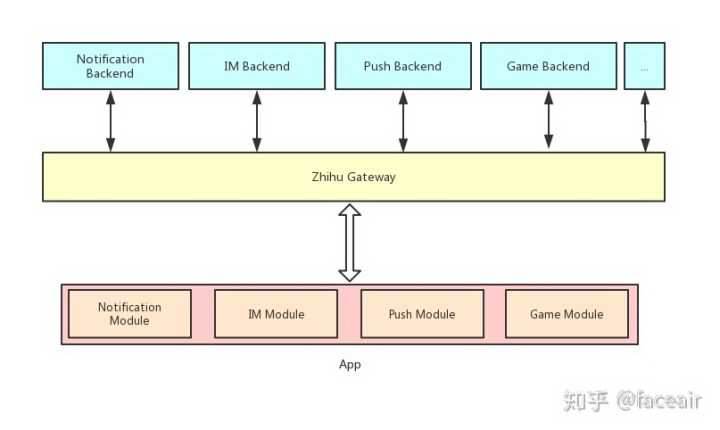

这种多对多的系统在设计时要避免强耦合。业务方逻辑也是会动态调整的，如果将业务的协议和逻辑与网关实现耦合会导致所有的业务都会互相牵连，协议升级和维护都会异常困难。

所以我们尝试使用经典的 **发布订阅模型** 来解耦长连接网关跟客户端与业务后端，它们之间只需要约定 Topic 即可自由互相发布订阅消息。传输的消息是纯二进制数据，网关也无需关心业务方的具体协议规范和序列化方式。

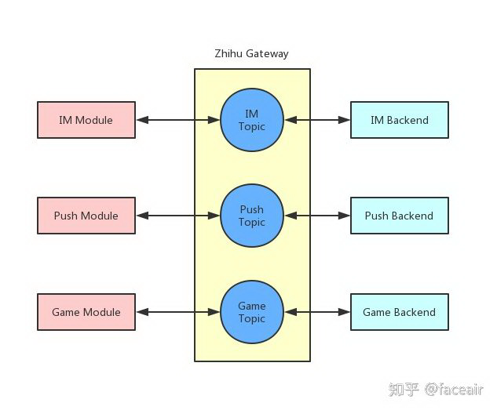

#### 权限控制

我们使用发布订阅解耦了网关与业务方的实现，我们仍然需要控制客户端对 Topic 的发布订阅的权限，避免有意或无意的数据污染或越权访问。

假如讲师正在知乎 Live 的 165218 频道开讲，当客户端进入房间尝试订阅 165218 频道的 Topic 时就需要知乎 Live 的后端判断当前用户是否已经付费。这种情况下的权限实际上是很灵活的，当用户付费以后就能订阅，否则就不能订阅。权限的状态只有知乎 Live 业务后端知晓，网关无法独立作出判断。

所以我们在 ACL 规则中设计了 **基于回调的鉴权** 机制，可以配置 Live 相关 Topic 的订阅和发布动作都通过 HTTP 回调给 Live 的后端服务判断。

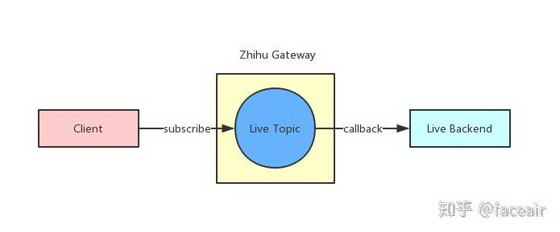

同时根据我们对内部业务的观察，大部分场景下业务需要的只是一个当前用户的私有 Topic 用来接收服务端下发的通知或消息，这种情况下如果让业务都设计回调接口来判断权限会很繁琐。

所以我们在 ACL 规则中设计了 **Topic 模板变量** 来降低业务方的接入成本，我们给业务方配置允许订阅的 Topic 中包含连接的用户名变量标识，表示只允许用户订阅或发送消息到自己的 Topic。

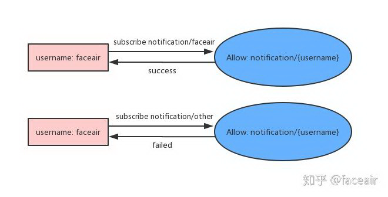

此时网关可以在不跟业务方通信的情况下，独立快速判断客户端是否有权限订阅或往 Topic 发送消息。

#### 消息可靠性保证

网关作为消息传输的枢纽，同时对接业务后端和客户端，在转发消息时需要保证消息在传输过程的可靠性。

TCP 只能保证了传输过程中的顺序和可靠性，但遇到 TCP 状态异常、客户端接收逻辑异常或发生了 Crash 等等情况时，传输中的消息就会发生丢失。

为了保证下发或上行的消息被对端正常处理，我们实现了 **回执和重传** 的功能。重要业务的消息在客户端收到并正确处理后需要发送回执，而网关内暂时保存客户端未收取的消息，网关会判断客户端的接收情况并尝试再次发送，直到正确收到了客户端的消息回执。

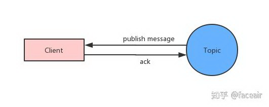

而面对服务端业务的大流量场景，服务端发给网关的每条消息都发送回执的方式效率较低，我们也提供了基于消息队列的接收和发送方式，后面介绍发布订阅实现时再详细阐述。

在设计通讯协议时我们参考了 MQTT 规范，拓展了认证和鉴权设计，完成了业务消息的隔离与解耦，保证了一定程度的传输可靠性。同时保持了与 MQTT 协议一定程度上兼容，这样便于我们直接使用 MQTT 的各端客户端实现，降低业务方接入成本。

### 我们怎么设计系统架构？

在设计项目整体架构时，我们优先考虑的是：

* 可靠性
* 水平扩展能力
* 依赖组件成熟度

简单才值得信赖。

为了保证可靠性，我们没有考虑像传统长连接系统那样将内部数据存储、计算、消息路由等等组件全部集中到一个大的分布式系统中维护，这样增大系统实现和维护的复杂度。我们尝试将这几部分的组件独立出来，将存储、消息路由交给专业的系统完成，让每个组件的功能尽量单一且清晰。

同时我们也需要快速地水平扩展能力。互联网场景下各种营销活动都可能导致连接数陡增，同时发布订阅模型系统中下发消息数会随着 Topic 的订阅者的个数线性增长，此时网关暂存的客户端未接收消息的存储压力也倍增。将各个组件拆开后减少了进程内部状态，我们就可以将服务部署到容器中，利用容器来完成快速而且几乎无限制的水平扩展。

最终设计的系统架构如下图：

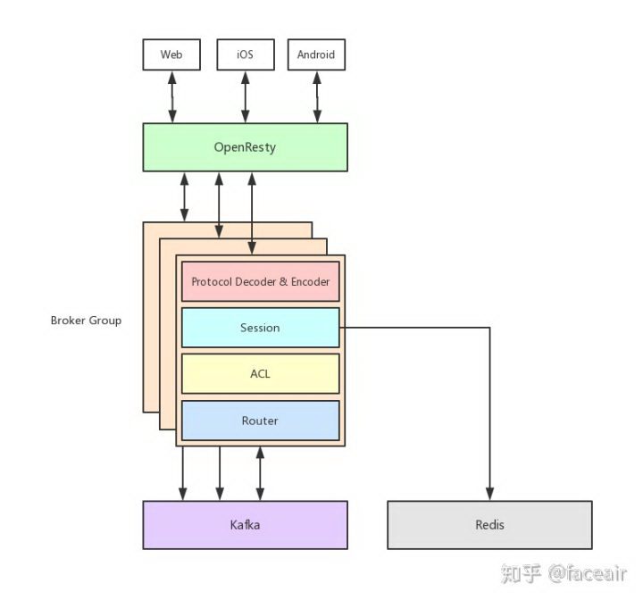

系统主要由四个主要组件组成：

1. 接入层使用 OpenResty 实现，负责连接负载均衡和会话保持
2. 长连接 Broker，部署在容器中，负责协议解析、认证与鉴权、会话、发布订阅等逻辑
3. Redis 存储，持久化会话数据
4. Kafka 消息队列，分发消息给 Broker 或业务方

其中 Kafka 和 Redis 都是业界广泛使用的基础组件，它们在知乎都已平台化和容器化 \([Redis at Zhihu](https://zhuanlan.zhihu.com/p/44441938)、[知乎基于 Kubernetes 的 Kafka 平台的设计和实现](https://zhuanlan.zhihu.com/p/36366473)\)，它们也都能完成分钟级快速扩容。

### 我们如何构建长连接网关？

#### 接入层

OpenResty 是业界使用非常广泛的支持 Lua 的 Nginx 拓展方案，灵活性、稳定性和性能都非常优异，我们在接入层的方案选型上也考虑使用 OpenResty。

接入层是最靠近用户的一侧，在这一层需要完成两件事：

1. 负载均衡，保证各长连接 Broker 实例上连接数相对均衡
2. 会话保持，单个客户端每次连接到同一个 Broker，用来提供消息传输可靠性保证

负载均衡其实有很多算法都能完成，不管是随机还是各种 Hash 算法都能比较好地实现，麻烦一些的是会话保持。

常见的四层负载均衡策略是根据连接来源 IP 进行一致性 Hash，在节点数不变的情况下这样能保证每次都 Hash 到同一个 Broker 中，甚至在节点数稍微改变时也能大概率找到之前连接的节点。

之前我们也使用过来源 IP Hash 的策略，主要有两个缺点：

1. 分布不够均匀，部分来源 IP 是大型局域网 NAT 出口，上面的连接数多，导致 Broker 上连接数不均衡
2. 不能准确标识客户端，当移动客户端掉线切换网络就可能无法连接回刚才的 Broker 了

所以我们考虑七层的负载均衡，根据客户端的唯一标识来进行一致性 Hash，这样随机性更好，同时也能保证在网络切换后也能正确路由。常规的方法是需要完整解析通讯协议，然后按协议的包进行转发，这样实现的成本很高，而且增加了协议解析出错的风险。

最后我们选择利用 Nginx 的 preread 机制实现七层负载均衡，对后面长连接 Broker 的实现的侵入性小，而且接入层的资源开销也小。

Nginx 在接受连接时可以指定预读取连接的数据到 preread buffer 中，我们通过解析 preread buffer 中的客户端发送的第一个报文提取客户端标识，再使用这个客户端标识进行一致性 Hash 就拿到了固定的 Broker。

#### 发布与订阅

我们引入了业界广泛使用的消息队列 Kafka 来作为内部消息传输的枢纽，前面提到了一些这么使用的原因：

1. 减少长连接 Broker 内部状态，让 Broker 可以无压力扩容
2. 知乎内部已平台化，支持水平扩展

还有一些原因是：

1. 使用消息队列削峰，避免突发性的上行或下行消息压垮系统
2. 业务系统中大量使用 Kafka 传输数据，降低与业务方对接成本

其中利用消息队列削峰好理解，下面我们看一下怎么利用 Kafka 与业务方更好地完成对接。

#### 发布

连接 Broker 会根据路由配置将消息发布到 Kafka Topic，同时也会根据订阅配置去消费 Kafka 将消息下发给订阅客户端。

路由规则和订阅规则是分别配置的，那么可能会出现四种情况：

一、消息路由到 Kafka Topic，但不消费，适合数据上报的场景。

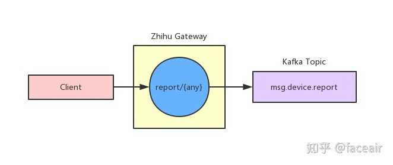

二、消息路由到 Kafka Topic，也被消费，普通的即时通讯场景。

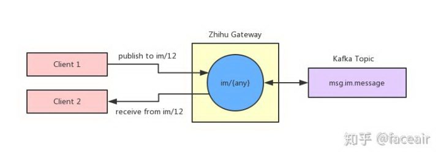

三、直接从 Kafka Topic 消费并下发，用于纯下发消息的场景。

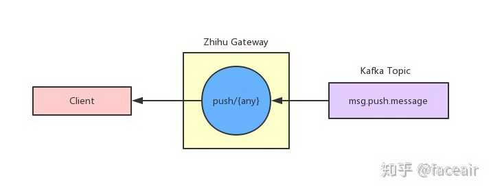

四、消息路由到一个 Topic，然后从另一个 Topic 消费，用于消息需要过滤或者预处理的场景。

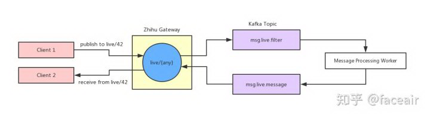

这套路由策略的设计灵活性非常高，可以解决几乎所有的场景的消息路由需求。同时因为发布订阅基于 Kafka，可以保证在处理大规模数据时的消息可靠性。

#### 订阅

当长连接 Broker 从 Kafka Topic 中消费出消息后会查找本地的订阅关系，然后将消息分发到客户端会话。

我们最开始直接使用 HashMap 存储客户端的订阅关系。当客户端订阅一个 Topic 时我们就将客户端的会话对象放入以 Topic 为 Key 的订阅 Map 中，当反查消息的订阅关系时直接用 Topic 从 Map 上取值就行。

因为这个订阅关系是共享对象，当订阅和取消订阅发生时就会有连接尝试操作这个共享对象。为了避免并发写我们给 HashMap 加了锁，但这个全局锁的冲突非常严重，严重影响性能。

最终我们通过分片细化了锁的粒度，分散了锁的冲突。

本地同时创建数百个 HashMap，当需要在某个 Key 上存取数据前通过 Hash 和取模找到其中一个 HashMap 然后进行操作，这样将全局锁分散到了数百个 HashMap 中，大大降低了操作冲突，也提升了整体的性能。

#### 会话

#### 持久化

当消息被分发给会话 Session 对象后，由 Session 来控制消息的下发。

Session 会判断消息是否是重要 Topic 消息， 是的话将消息标记 QoS 等级为 1，同时将消息存储到 Redis 的未接收消息队列，并将消息下发给客户端。等到客户端对消息的 ACK 后，再将未确认队列中的消息删除。

有一些业界方案是在内存中维护了一个列表，在扩容或缩容时这部分数据没法跟着迁移。也有部分业界方案是在长连接集群中维护了一个分布式内存存储，这样实现起来复杂度也会变高。

我们将未确认消息队列放到了外部持久化存储中，保证了单个 Broker 宕机后，客户端重新上线连接到其他 Broker 也能恢复 Session 数据，减少了扩容和缩容的负担。

#### 滑动窗口

在发送消息时，每条 QoS 1 的消息需要被经过传输、客户端处理、回传 ACK 才能确认下发完成，路径耗时较长。如果消息量较大，每条消息都等待这么长的确认才能下发下一条，下发通道带宽不能被充分利用。

为了保证发送的效率，我们参考 TCP 的滑动窗口设计了并行发送的机制。我们设置一定的阈值为发送的滑动窗口，表示通道上可以同时有这么多条消息正在传输和被等待确认。

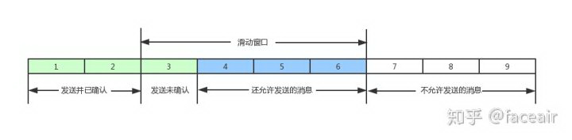

我们应用层设计的滑动窗口跟 TCP 的滑动窗口实际上还有些差异。

TCP 的滑动窗口内的 IP 报文无法保证顺序到达，而我们的通讯是基于 TCP 的所以我们的滑动窗口内的业务消息是顺序的，只有在连接状态异常、客户端逻辑异常等情况下才可能导致部分窗口内的消息乱序。

因为 TCP 协议保证了消息的接收顺序，所以正常的发送过程中不需要针对单条消息进行重试，只有在客户端重新连接后才对窗口内的未确认消息重新发送。消息的接收端同时会保留窗口大小的缓冲区用来消息去重，保证业务方接收到的消息不会重复。

我们基于 TCP 构建的滑动窗口保证了消息的顺序性同时也极大提升传输的吞吐量。

### 写在最后

知乎长连接网关由基础架构组 \(Infra\) 开发和维护，主要贡献者是 [@faceair](https://www.zhihu.com/people/faceair) [@安江泽](https://www.zhihu.com/people/gnap) 。

基础架构组负责知乎的流量入口和内部基础设施建设，对外我们奋斗在直面海量流量的的第一战线，对内我们为所有的业务提供坚如磐石的基础设施，用户的每一次访问、每一个请求、内网的每一次调用都与我们的系统息息相关。

如果你也渴望直面海量流量和应对大规模系统挑战，欢迎与 [faceair@zhihu.com](mailto:faceair@zhihu.com) 取得联系。

**本文转载自知乎** 。

**原文链接** ：

**<https://zhuanlan.zhihu.com/p/66807833>**
