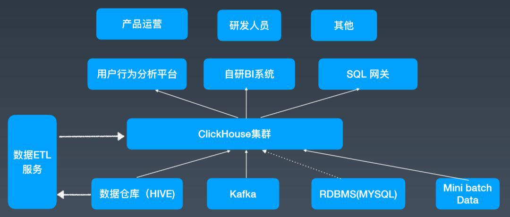
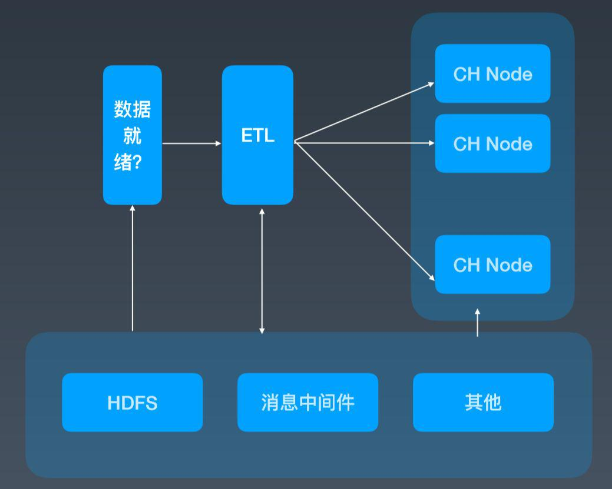
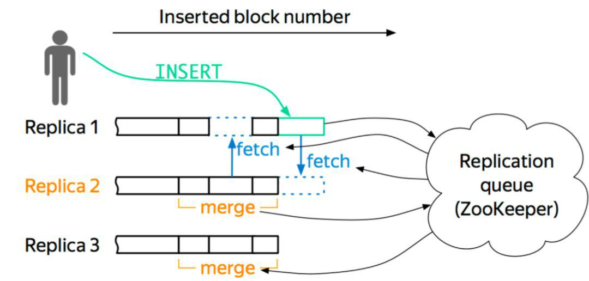
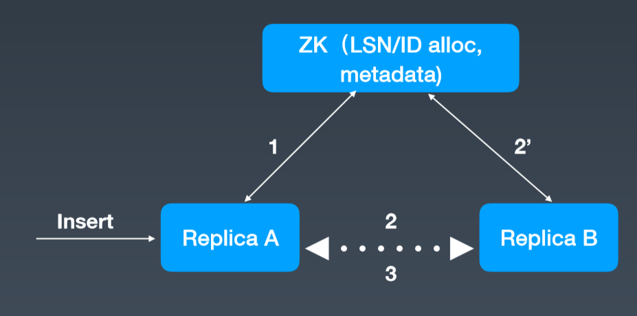
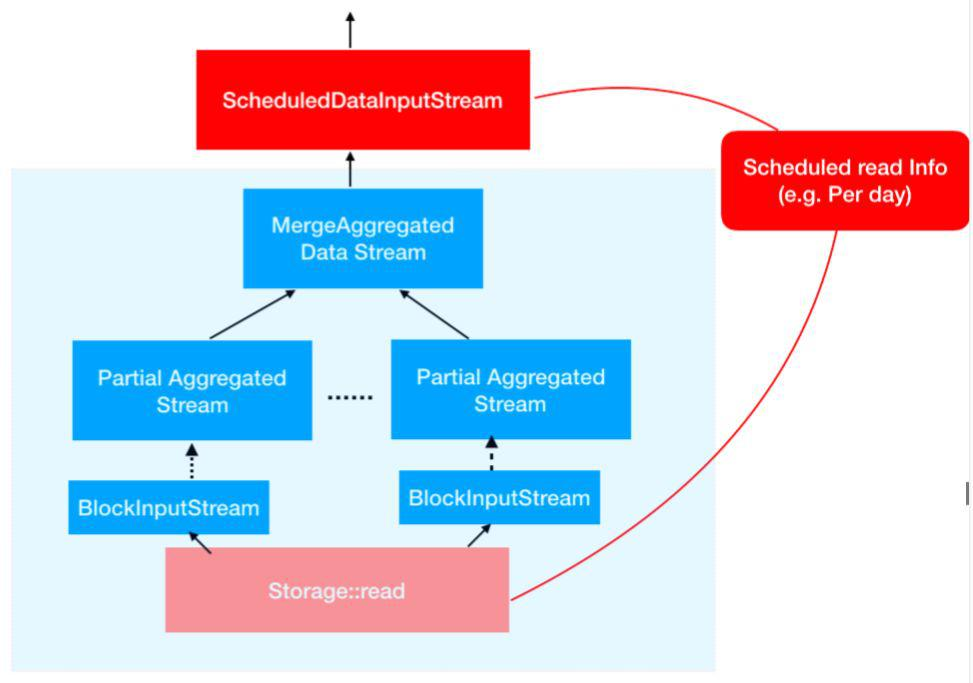

## 最快开源OLAP引擎！ClickHouse在头条的技术演进  

> 作者: 陈星  
> 发布日期: 2019 年 6 月 16 日  

#

ClickHouse 是由号称“俄罗斯 Google”的 Yandex 公司开源的面向 OLAP 的分布式列式数据库，能够使用 SQL 查询生成实时数据报告。

本文整理自字节跳动高级研发工程师陈星在 QCon 全球软件开发大会（北京站）2019 上的演讲，他介绍了 ClickHouse 的关键技术点、在字节跳动的应用场景以及主要的技术改进。

### ClickHouse 简介

ClickHouse 是由号称“俄罗斯 Google”的 Yandex 开发而来，在 2016 年开源，在计算引擎里算是一个后起之秀，在内存数据库领域号称是最快的。大家从网上也能够看到，它有几倍于 GreenPlum 等引擎的性能优势。

如果大家研究过它的源码，会发现其实它采用的技术并不新。ClickHouse 是一个列导向数据库，是原生的向量化执行引擎。它在大数据领域没有走 Hadoop 生态，而是采用 Local attached storage 作为存储，这样整个 IO 可能就没有 Hadoop 那一套的局限。它的系统在生产环境中可以应用到比较大的规模，因为它的线性扩展能力和可靠性保障能够原生支持 shard + replication 这种解决方案。它还提供了一些 SQL 直接接口，有比较丰富的原生 client。另外就是它比较快。

大家选择 ClickHouse 的首要原因是它比较快，但其实它的技术没有什么新的地方，为什么会快？我认为主要有三个方面的因素：

1. 它的数据剪枝能力比较强，分区剪枝在执行层，而存储格式用局部数据表示，就可以更细粒度地做一些数据的剪枝。它的引擎在实际使用中应用了一种现在比较流行的 LSM 方式。
2. 它对整个资源的垂直整合能力做得比较好，并发 MPP+ SMP 这种执行方式可以很充分地利用机器的集成资源。它的实现又做了很多性能相关的优化，它的一个简单的汇聚操作有很多不同的版本，会根据不同 Key 的组合方式有不同的实现。对于高级的计算指令，数据解压时，它也有少量使用。
3. 我当时选择它的一个原因，ClickHouse 是一套完全由 C++ 模板 Code 写出来的实现，代码还是比较优雅的。

### 字节跳动如何使用 ClickHouse

头条做技术选型的时候为什么会选用 ClickHouse？这可能跟我们的应用场景有关，下面简单介绍一下 ClickHouse 在头条的使用场景。

头条内部第一个使用 ClickHouse 的是用户行为分析系统。该系统在使用 ClickHouse 之前，engine 层已经有两个迭代。他们尝试过 Spark 全内存方案还有一些其他的方案，都存在很多问题。主要因为产品需要比较强的交互能力，页面拖拽的方式能够给分析师展示不同的指标，查询模式比较多变，并且有一些查询的 DSL 描述，也不好用现成的 SQL 去表示，这就需要 engine 有比较好的定制能力。

行为分析系统的表可以打成一个大的宽表形式，join 的形式相对少一点。系统的数据量比较大，因为产品要支持头条所有 APP 的用户行为分析，包含头条全量和抖音全量数据，用户的上报日志分析，面临不少技术挑战。大家做了一些调研之后，在用 ClickHouse 做一些简单的 POC 工作，我就拿着 ClickHouse 按需求开始定制了。

综合来看，从 ClickHouse 的性能、功能和产品质量来说，效果还不错，因为开发 ClickHouse 的公司使用的场景实际上跟头条用户分析是比较类似的，因此有一定的借鉴意义。

目前头条 ClickHouse 集群的规模大概有几千个节点，最大的集群规模可能有 1200 个节点，这是一个单集群的最大集群节点数。数据总量大概是几十个 PB，日增数据 100TB，落地到 ClickHouse，日增数据总量大概是它的 3 倍，原始数据也就 300T 左右，大多数查询的响应时间是在几秒钟。从交互式的用户体验来说，一般希望把所有的响应控制在 30 秒之内返回，ClickHouse 基本上能够满足大部分要求。覆盖的用户场景包括产品分析师做精细化运营，开发人员定位问题，也有少量的广告类客户。

图 1 是一个 API 的框架图，相当于一个统一的指标出口，也提供服务。围绕着 ClickHouse 集群，它可以支撑不同的数据源，包括离线的数据、实时的消息中间件数据，也有些业务的数据，还有少量高级用户会直接从 Flink 上消费一些 Databus 数据，然后批量写入，之后在它外围提供一个数据 ETL 的 Service，定期把数据迁移到 ClickHouse local storage 上，之后他们在这之上架了一个用户使用分析系统，也有自研的 BI 系统做一些多维分析和数据可视化的工作，也提供 SQL 的网关，做一些统一指标出口之类的工作，上面的用户可能是多样的。

综合来说，我们希望在头条内部把 ClickHouse 打造成为支持数据中台的查询引擎，满足交互式行为的需求分析，能够支持多种数据源，整个数据链路对业务做到透明。在工作过程中，我们也碰到了很多的问题。

图 1 Bytedance 如何使用 ClickHouse

### 问题与解决方案

接下来我会详细介绍我们在使用 ClickHouse 的过程中碰到过什么问题，希望对大家有一些借鉴意义。

#### 数据源到 ClickHouse 服务化

我们在做 ClickHouse 服务化的过程中，第一步就是如何把数据落到 ClickHouse 集群中。原生的 ClickHouse 没有 HDFS 访问能力，我们同时还需要保证对用户透明，就可能存在几个问题：

第一，怎么访问离线数据？

第二，ClickHouse 没有事务支持，如果在数据导入过程中发生了 Fail，如何做 Fail over？

第三，ClickHouse 数据就绪速度。我们整个数据就绪的压力很大，上游就绪的时间比较晚，每天早上就会有一些分析师在 ClickHouse 上看指标，整个数据落到 ClickHouse 留给我们的空挡可能不是太长。

我们针对这些问题做了一些改动。第一，从 HAWQ 上移植过来 HDFS client，让 ClickHouse 能够直接访问数据，我们的 ETL 服务实际上维护了一套外部事务的逻辑，然后做数据一致性的保证；为了保证就绪时间，我们充分利用各个节点的计算能力和数据的分布式能力，实际上最终都会在外围服务把数据作一些 Repartition，直接写入各个节点本地表。另外，我们还有一些国际化的场景，像 TikTok、[Musical.ly](http://Musical.ly) 等，数据就绪和分析师分析的时间是有重叠的，数据写和查询交互的影响还是有一些。我们最近也在尝试把数据构建和查询分离出来，并开发相应的 Feature，但是还没有上线，从 Demo 来看，这条路是行得通的。

图 2 ClickHouse 服务化与自动化中的问题

#### Map 数据类型：动态 Schema

我们在做整个框架的过程中发现，有时候产品存在动态 Schema 的需求。我们当时增加了 Map 的数据类型，主要解决的问题是产品支持的 APP 很多，上报的 Model 也是多变的，它跟用户的日志定义有关，有很多用户自定义参数，就相当于动态的 Schema。从数据产品设计的角度来看又需要相对固定的 Schema，二者之间就会存在一定的鸿沟。最终我们是通过 Map 类型来解决的。

实现 Map 的方式比较多，最简单的就是像 LOB 的方式，或者像 Two-implicit column 的方式。当时产品要求访问 Map 单键的速度与普通的 column 速度保持一致，那么比较通用的解决方案不一定能够满足我们的要求。当时做的时候，从数据的特征来看，我们发现虽然叫 Map，但是它的 keys 总量是有限的，因为依赖于用户自定义的参数不会特别多，在一定的时间范围内，Keys 数量会是比较固定的。而 ClickHouse 有一个好处：它的数据在局部是自描述的，Part 之间的数据差异自动能够 Cover 住。

最后我们采用了一个比较简单的展平模型，在我们数据写入过程中，它会做一个局部打平。以图 3 为例，表格中两行总共只有三个 key，我们就会在存储层展开这三列。这三列的描述是在局部描述的，有值的用值填充，没有值就直接用 N 填充。现在 Map 类型在头条 ClickHouse 集群的各种服务上都在使用，基本能满足大多数的需求。

图 3 局部 PART level 展平模型（自描述）

另外，为了满足访问 key 的高效性，我们在执行层做自动改写，key 的访问会直接改写成对隐私列的访问。这样架构会有一个比较大的问题，它对于 Map 列的全值访问代价比较大，需要从隐式列反构建出全值列。对于这个问题，我们也没有很好地解决，因为实际上在很多时候我们只关心 key 的访问效率。

另外一个问题，这是 LSM 架构，存在一个数据合并的过程，合并时可能需要重构 Map。我们为了提高合并的速度，做了一些相应的优化，可以做到无序重构。这些做完后，收益还是比较大的。首先，Table 的 schema 能够简化，理论上现在 Table 的定义只需要做几种技术类型的组合就可以；然后 ETL 构建的逻辑不再需要关注用户的隐私列参数，可以简化 ETL 的构建逻辑；最后，对数据的自动化接入帮助也很大。图 4 是我们优化之后的语法，大家可以看到相对比较简单。

图 4 Map 数据类型 - 动态 Schema 相关语法

#### 大数据量和高可用

不知道大家在使用 ClickHouse 的过程中有没有一个体会，它的高可用方案在大的数据量下可能会有点问题。主要是 zookeeper 的使用方式可能不是很合理，也就是说它原生的 Replication 方案有太多的信息存在 ZK 上，而为了保证服务，一般会有一个或者几个副本，在头条内部主要是两个副本的方案。

我们当时有一个 400 个节点的集群，还只有半年的数据。突然有一天我们发现服务特别不稳定，ZK 的响应经常超时，table 可能变成只读模式，发现它 znode 的太多。而且 ZK 并不是 Scalable 的框架，按照当时的数据预估，整个服务很快就会不可用了。

我们分析后得出结论，实际上 ClickHouse 把 ZK 当成了三种服务的结合，而不仅把它当作一个 Coordinate service，可能这也是大家使用 ZK 的常用用法。ClickHouse 还会把它当作 Log Service，很多行为日志等数字的信息也会存在 ZK 上；还会作为表的 catalog service，像表的一些 schema 信息也会在 ZK 上做校验，这就会导致 ZK 上接入的数量与数据总量会成线性关系。按照这样的数据增长预估，ClickHouse 可能就根本无法支撑头条抖音的全量需求。

社区肯定也意识到了这个问题，他们提出了一个 mini checksum 方案，但是这并没有彻底解决 znode 与数据量成线性关系的问题。所以我们就基于 MergeTree 存储引擎开发了一套自己的高可用方案。我们的想法很简单，就是把更多 ZK 上的信息卸载下来，ZK 只作为 coordinate Service。只让它做三件简单的事情：行为日志的 Sequence Number 分配、Block ID 的分配和数据的元信息，这样就能保证数据和行为在全局内是唯一的。

关于节点，它维护自身的数据信息和行为日志信息，Log 和数据的信息在一个 shard 内部的副本之间，通过 Gossip 协议进行交互。我们保留了原生的 multi-master 写入特性，这样多个副本都是可以写的，好处就是能够简化数据导入。图 6 是一个简单的框架图。

以这个图为例，如果往 Replica 1 上写，它会从 ZK 上获得一个 ID，就是 Log ID，然后把这些行为和 Log Push 到集群内部 shard 内部活着的副本上去，然后当其他副本收到这些信息之后，它会主动去 Pull 数据，实现数据的最终一致性。我们现在所有集群加起来 znode 数不超过三百万，服务的高可用基本上得到了保障，压力也不会随着数据增加而增加。

图 5 zookeeper 使用问题

图 6 HaMergeTree 简单框架

解决了以上几个问题之后，我们还在对 ClickHouse 做持续改进。我们最近也碰到了一些 Log 调度之类的问题，当时我们对 Log 调度并没有做特别的优化，实际上还是用 ClickHouse 的原生调度，在有些集群上可能会碰到一些问题，比如有些表的 Log 调度延迟会比较高一点，我们现在也正在尝试解决。

#### String 类型处理效率：Global Dictionary

另外，为了满足交互式的需求，在相当长的一段时间我们都在思考怎么提高数据执行的性能。大家在做数仓或者做大数据场景的时候会发现，用户特别喜欢字符串类型，但是你如果做执行引擎执行层，就特别不喜欢处理这类 String 类型的数据，因为它是变长的，存在执行上有较高代价。String 类型的处理效率，跟数字类型的处理效率有 10 倍的差距，所以我们做了一个全局字典压缩的解决方案，目的并不是为了节省存储空间，而是为了提高执行的效率，这是相当重要一个出发点。我们希望把一些常见的算子尽量在压缩域上执行，不需要做数据的解压。

目前我们只做了一个 pure dictionary compression，支持的算子也比较少，比如 predication 支持等值比较或者 in 等类似的比较能够在压缩域上直接执行，这已经能够覆盖我们很多的场景，像 group by 操作也能够在压缩域上做。

说到 Global Dictionary，其实也并不是完全的 Global ，每个节点有自己的 Dictionary，但是在一个集群内部，各个节点之前的字典可能是不一样的。为什么没有做全局在集群内部做一个字典？

第一，全局字典会把 coordinate 协议搞得特别复杂，我以前做数据库的时候有个项目，采用了集群级别 Global Dictionary，碰到了比较多的挑战。字典压缩只支持了 MergeTree 相关的存储引擎。压缩的行为发生主要有三种操作，像数据的插入或者数据的后台合并，都会触发 compression，还有很多数据的批量 roll in 或 roll out，也会做一些字典的异步构建。

刚才也提到，我们的主要出发点就是想在执行层去做非解压的计算，主要是做 Select query，每一个 Select 来的时候，我们都会在分析阶段做一些合法性的校验，评估其在压缩域上直接执行是否可行，如果满足标准，就会改写语法树。如果压缩的 column 会出现在输出的列表中，会显式地加一个 Decompress Stream 这样可选的算子，然后后续执行就不太需要改动，而是可以直接支持。当 equality 的比较以及 group by 操作直接在压缩上执行，最后整体的收益大概提高 20% 到 30%。

刚才提到，我们的字典不是一个集群水平的，那大家可能会有所疑问，比如对分布式表的 query 怎么在压缩域上做评估？我们稍微做了一些限制，很多时候使用压缩场景的是用户行为分析系统，它是按用户 ID 去做 shard，然后节点之间基本做到没有交互。我们也引入了一个执行模式，稍微在它的现有计算上改了一下，我们叫做完美分布加智能合并的模式。在这个模式下，分布式表的 query 也是能够在字典上做评估。收益也还可以，满足当时设计时候的要求。

图 7 压缩域执行

#### 特定场景内存 OOM

有时候做一个系统，内存使用的问题也会比较严重。尤其当做数据量大的系统时，经常发生内存受限的问题，或者说 OOM 最后被系统杀掉。ClickHouse 因为有很多数据的加速，比如 Index & mark 文件，信息会在实例启动的时候加载，整个加载过程非常慢，有时候一个集群起来可能得要半个小时。

虽然我们对这个问题做了一些优化，能够做到并行加载，但是也得好几分钟。如果实例被系统 Kill 了之后，对服务还会有影响，我们的系统经常要回答一些用户这样的查询，例如需要查 60 天内用户的转化率或者整个用户的行为路径对应的每天转化率。这种 Block 的操作需要把很多数据从底层捞出来，在时间纬度上进行排序，找出对应的模式。

如果不进行优化，基本上一个 Query 需要使用的内存会超过一百 G，如果稍微并发一下，内存那可能就支撑不了。并且，由于其使用的内存分配器的原因，也很难把内存的实际使用量限制得很准，这就偶尔会发生被系统 Kill 的场景。

我们想从 engine 优化的角度去解决问题，本质上就是 Blocked Aggregator 的操作，它没有感知到底层的数据分布。这个 Feature 有点意思，也是我们从数据分布到执行共同优化的一个尝试，实现相对来说比较粗糙，但是现在线上也已经开始用了。

它的思路是这样的，我们的 Aggregator 执行路径可以由 HINT 来控制，HINT 的生成是由上面的产品生成的，因为产品能够感知数据分布，也能够知道这些指标的语义。HINT 最关键的一个作用是把 Blocked Aggregator 局部做到流水线化，比如计算 60 天的指标，它可以生成一个 read planner 控制底层的 reader，每一批处理的是那一部分数据。上层的指标输出可以把这些信息 aggregate 到对应的地方，做从下向上的执行输出。最上层的 schedule 流输出指标可以把每天的计算结果汇聚起来，然后做一个总体的整理，最终就形成一个输出。

这些优化工作完成以后有了很明显的收益，与默认没有开启的时候相比，系统的内存使用可能会下降 5 倍左右。现在应用场景主要在两个指标的计算上，像漏斗之类的和计算用户行为路径会使用。

图 8 特定场景内存 OOM - Step-ed Aggregation

#### Array 类型处理

下面介绍一下我们怎么处理 Array 类型，并将它做得更高效。

Array 类型处理的需求主要来自于 AB 实验的需求。当前我们的系统也会做一些实时 AB 指标的输出，实验 ID 在我们系统中以数组的形式存储。头条内部的 AB 实验也比较多，对于一个单条记录，它可能命中的实验数会有几百上千个。有时候我们需要查询命中实验的用户行为是什么样的，也就是要做一些 Array hasAny 语义的评估。

从 Array 执行来看，因为它的数据比较长，所以说从数据的反序列化代价以及整个 Array 在执行层的 Block 表示来说不是特别高效，要花相当大的精力去做 Array column 的解压。而且会在执行层消耗特别大的内存去表示，如果中间发生了 Filter 的话，要做 Block column 过滤，permutation 会带上 Array，执行起来会比较慢。那我们就需要一个比较好的方式去优化从读取到执行的流程。

做大数据，可能最有效的优化方式就是怎么样做到底层数据的剪枝， **数据少是提高数据处理速度的终极法宝** 。我们提出了现在的剪枝方法，一个是 Part level，一个是 MRK range level。那有没有一种针对于 Array column 的剪枝方式？我们做了下面两个尝试：

首先做了一个双尺度的 Bloom Filter，记录 Array 里面 Key 的运动情况，实现了 Part level 和细粒度的 MRK range level，做完后在一些小的产品上效果还挺好的，但最后真正在大产品上，像抖音、头条全量，我们发现 Fill factor 太高，实际上没太大帮助。之后我们开发了一个 BitMap 索引，基本的想法是把 Array 的表示转化成 Value 和 Bit 的结合。在执行层改写，把 has 的评估直接转换成 get BitMap。

做完之后，我们上线了一两个产品，在一些推荐的场景上使用。这个方案主要问题就是 BitMap 数据膨胀问题稍微严重了一点，最近我们也做了一些优化，可能整体的数据占用是原始数据的 50% 左右，比如 Array 如果是 1G，可能 Bit map 也会有 500M。我们整个集群的副本策略是一个 1：N 的策略，副本存储空间比较有压力，我们现在也没有大范围的使用，但效果是很好的，对于评估基本上也会有一、二十倍的提升效果。

#### 其他问题和改进

以上是我今天分享的主要内容，后面的内容相对比较弹性。字节跳动自身的数据源是比较多样的，我们对其他数据源也做了一些特定的优化。比如我们有少量业务会消费 Kafka，而现在的 Kafka engine 没有做主备容错，我们也在上面做了一些高可用的 HaKafka engine 的实现，来做到主备容错以及一些指定分区消费功能，以满足一些特定领域的需求。

另外，我们发现它的 update/delete 功能比较弱，而我们有一部分业务场景想覆盖业务数据库上面的数据，像 MySQL 上也是会有一些增删操作的。我们就基于它 Collapse 的功能做了一些设计，去支持轻量级的 update/delete，目前产品还属于刚起步的阶段，但是从测试结果来看，能够支撑从 MySQL 到 ClickHouse 的迁移，基于 delta 表的方案也是可行的。

我们还做了一些像小文件读取的问题，提供了一个多尺度分区的方案，但由于各种原因没有在线上使用。

说到底，我们的需求还有很多，现在也还有很多工作正在做，比如控制面的开发，简化整体运维，还有 Query cache 以及整个数据指标的正确性还不能达到百分之百的保障，特别是像实时数据流的数据，我们也想做更深层次的优化。我们还希望增强物化视图，也准备提高分布式 Join 能力，因为我们自研 BI 对此还有比较强的需求，未来我们会在这一块做一些投入。

以上就是去年一年我们在 ClickHouse 这块主要做的一些工作。总体来说 ClickHouse 是一个比较短小精干的引擎，也比较容易上手和定制，大家都可以去尝试一下。

### 演讲嘉宾介绍

**陈星** ，字节跳动高级研发工程师，主要负责 ClickHouse 查询引擎相关的技术规划、改进等工作，在字节跳动之前就职于 IBM，从事过多年的数据库研发工作，在 OLAP、OLTP 等领域有深厚的技术积累。

下载完整版 PPT：

[https://2019.qconbeijing.com/schedule?utm\_source=infoq&utm\_campaign=full&utm\_term=0605](https://2019.qconbeijing.com/schedule?utm_source=infoq&utm_campaign=full&utm_term=0605)
