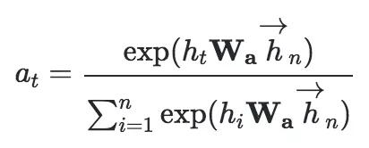

## 阿里首次将用户手势数据用于电商场景！淘宝提出用户实时意图预测算法DIPN，效果秒杀传统模型  

> 原创：  
> 郭龙（凌祎）  
> 发布: AI前线  
> 发布日期: 2019-07-08  

 作者 | 郭龙（凌祎） 编辑 | Natalie  **AI 前线导读：** 用户消费行为预测已然是电商领域的经典问题。通过对用户实时意图的理解，我们可以感知用户当下正处于哪个阶段，比如是在买还是在逛，从而可以根据不同阶段制定不同的营销和推荐策略，进而提升营销和推荐效果。

本文相关工作已在 KDD 2019（25th ACM SIGKDD conference on knowledge discovery and data mining，数据挖掘领域国际顶级会议）正式发表，详细介绍了淘系技术部算法团队如何利用用户的多种实时行为识别用户的实时意图。

**更多优质内容请关注微信公众号“AI 前线”（ID：ai-front）** 一、背景

十亿级别的移动终端，为手机淘宝的情景计算提供了无限可能。本文主要介绍如何利用用户与手机的交互数据对用户实时的购买行为进行预测。

基于大数据分析，通过感知用户在淘宝上的浏览链路，情景计算得以实时感知用户当前的购买倾向。越长的商品详情页停留，越频繁的商品图片滑动，越多的商品评价查看，都预示着用户对商品的购买欲望。掌握用户实时的购买倾向可以帮助营销团队针对不同消费欲望的用户采取不同的营销策略，刺激用户消费，最终达到刺激平台 GMV 增长的目的。比如针对购买倾向增高的用户，平台可以采取发放红包或者限时打折的方式刺激用户完成消费。

另外，通过对用户实时购买意图的理解，我们可以感知用户当下处于哪个阶段，比如是在买还是在逛，从而可以根据不同阶段制定不同的推荐策略，提升推荐效果和用户体验。

用户消费行为预测是电商领域的经典问题，对用户购买概率进行预测也已经不是一个新鲜的问题。但是传统的云上计算预测的是用户的长期购买概率，大多根据用户的历史浏览、收藏和加购商品等数据，预测未来一段较长的时间内（比如一周）用户的购买概率。

相比于长期购买概率，用户的实时购买概率（比如一小时内的购买概率）更能反映用户购买倾向的变化，也使得营销算法的制定可以更加灵活有效。但是，对用户购买概率进行实时识别也带来了更大的挑战。

单纯基于用户的传统云上行为对用户的实时购买意图进行预测很难达到理想的效果，原因是用户的云上行为粒度太粗，很难反映用户的实时状态。表 1 统计了手淘每个用户平均每天产生的不同的行为数。我们可以看到，用户的浏览、收藏和加购等云上行为每天平均只有 40 个，而用户每天的点击和滑动行为数分别是云上行为数的 10 倍和 30 倍。因此基于用户的端上行为，我们可以更加细粒度的刻画用户行为，从而更好地预测用户的实时意图。

表 1：手淘用户每天产生的各种行为数

接下来，我们将详细介绍我们是 **如何结合用户的云上行为数据以及实时交互数据来预测用户的实时购买意图的** 。相关工作已被国际会议 KDD 2019 接收《Buying or Browsing? : PredictingReal-time Purchasing Intent using Attention-based Deep Network with MultipleBehavior》。

二、数据

我们首先简单介绍一下我们使用的用户相关数据。

*  **用户滑动手势数据。** 该数据包含了用户日常使用手淘的滑动手势数据，包括四种基本动作：打开页面，离开页面，滑动和点击。每种动作都记录了该动作发生的时间，页面以及该动作在手机屏幕上的落点位置。对于滑动动作，该数据记录了滑动动作的起始位置和结束位置，以及滑动动作的持续时间。

*  **用户点击控件数据。** 该数据包含了用户点击控件产生的信息，包括点击控件名，点击页面名以及该点击行为发生的时间。

*  **用户云上行为数据。** 该数据包含了传统的用户浏览、收藏、加购、下单和搜索等基本行为。

*  **用户基础特征数据。** 该数据包含了用户的基础特征，比如年龄，性别和活跃度等。

*  **用户统计特征数据。** 该数据包含了基于用户历史行为的统计特征，比如用户最近 1 个月的收藏、加购和下单次数。

经过特征提取和离散化，我们为用户滑动手势数据中的每个行为提取了 14 种特征，为点击控件数据中的每个行为提取了 3 个特征，为云上行为数据中的每个行为提取了 6 个特征。每个特征首先被编码成 one-hot 向量，然后经过转化得到低维的 embedding 向量。我们使用 embedding 向量作为模型的输入，并与模型一同训练。

三、挑战

基于用户的多种行为对用户的实时购买意图进行预测面临以下技术难点：

* 如何有效利用多种用户行为全方位的刻画用户？

* 如何有效地挖掘端上海量弱信号的价值，避免繁杂的手动挖掘特征？

* 如何表征不同的用户行为之间的联系？

* 如何捕捉不同的用户行为模式之间的共性以及差别？

我们设计了 Deep Intent Prediction Network \(DIPN\) 模型，通过晚期融合、RNN 自动提取特征、层级注意力机制和多任务学习来克服上述技术挑战。

四、模型

我们采用端到端的深度学习模型对用户的多种数据进行建模来预测用户的实时购买意图。图 1 展示了 DIPN 模型的基本框架。由于我们需要处理三种不同形态的行为序列数据，我们需要设计合理的方法来对这些数据进行融合。

一般有两种数据融合方式：早期融合 \(early fusion\) 和晚期融合（late fusion）。早期融合指的是在特征上进行融合，首先进行不同特征的连接，然后再输入到一个模型中进行训练。晚期融合（late fusion）指的是特征分别进入不同的模型，然后对模型输出的特征进行连接，进而预测最终结果。由于不同数据的产生频率不一致，早期融合通常会造成一定程度的信息损失，为此我们采用了晚期融合（late fusion）方法。接下来我们分层介绍 DIPN。

图 1：Deep Intent Prediction Network

4.1 RNN Layer

相比于传统的浏览、收藏、加购和下单等用户行为数据，对端上海量弱信号（用户点击控件数据和用户滑动手势数据）进行特征挖掘更加具有挑战性。为了有效地挖掘海量弱信号中有价值的特征，同时避免繁杂的手动挖掘特征，我们采用了 RNN 模型来对时间序列数据建模，从而可以更好地捕捉时间序列数据的时序性和长依赖关系。为了缓解模型训练过程中的梯度消失问题，我们使用了 GRU 作为 RNN 模型的基本单元。

4.2 Hierarchical Attention Layer

在 DIPN 中，我们采用了晚期融合的方式融合三种不同形态的行为序列数据，一个简单的融合方式是对三个 RNN 模型的最后输出进行直接的拼接，但是这种方式忽略了不同行为序列之间的交互。为此，我们设计了层级注意力机制（ hierachical attention mechnism \)：底层注意力机制（ intra-viewattention ）可以聚焦到每个行为序列的内部，用于识别用户的重要动作，上层注意力机制（ inter-viewattention ）负责行为序列特征间的交叉融合，使用了类似于 Transformer 的自注意力机制思想，对于序列内的每个动作，计算该动作与其他序列内每个动作的距离，以便捕捉异步动作间的重要交叉特征。

* 底层注意力机制（ intra-view attention \)。底层注意力机制用来识别每个行为序列内部对于预测购买意图贡献更多的行为。由于用户当前的行为能够更好地体现用户的实时意图，我们通过计算行为序列内的每个行为与当前行为的相关度作为该行为的注意力分数，计算公式如下：

* 其中代表 RNN 的最后输出单元。与传统的注意力机制不同的是，我们最后没有采用加权平均的方法得到最终的输出，而是使用元素积（ element-wise product ）的方式得到一个新的行为序列，该行为序列与原始行为序列维度相同，计算公式如下：

其中 hs ，ht 和 hb 代表我们使用的三种行为序列。

* 上层注意力机制（ inter-view attention \)。上层注意力机制负责不同行为序列之间的交叉融合。用户的商品相关行为、滑动行为和点击行为从不同角度同时刻画了用户的行为模式。例如，当一个用户对一件商品感兴趣时，在他最终下单前通常会浏览一下该商品的评论并且比较一下其他相似的商品。这个过程会产生一些商品相关行为、滑动行为和点击行为。因此，如何捕捉不同行为之间的交互关系对于用户实时意图的预测至关重要。在这里，我们采用了 Transformer 的自注意力机制思想，如下图所示。

图 2：intra attention mechnism

定两个行为序列，对于其中一个行为序列内部的每个行为，我们计算该行为与另一序列内部每个行为之间的相关性。这样对于每个序列我们会得到一个新的注意力序列，最后我们会通过点击操作连接两个注意力序列，计算公式如下。

4.3 Multi-task Layer

我们希望通过多任务学习更好地捕捉不同的用户行为模式之间的共性以及差别，同时提高模型的泛化能力。为此，我们使用 DIPN 同时预测两种任务：实时购买意图和长期购买意图。由于用户行为模式的复杂性，一些细微的差别往往会导致模型产出错误的结果。而通过同时预测用户的实时意图和长期意图，我们可以提高模型的抗干扰能力。DIPN 的损失函数如下所示：

五、实验 5.1 模型部署

DIPN 模型会通过 AliNN 转换，最终部署在 walle 平台上，并且借助 DBFS 特征服务实时获取模型所需要的用户实时特征，从而达到预测用户实时意图的目的，如图 3 所示。

图 3：情景计算模型部署框架

5.2 测试模型

在本实验中，我们测试 DIPN 模型的效果。除了 DIPN 模型，我们还设计了若干对比实验，各测试模型介绍如下：

* GBDT：该方法使用【1】中的模型和特征统计方法，同时新加了用户的基础特征和统计特征。我们的目的是通过对比观察用户的端上特征对于用户实时意图预测带来的收益。

* RNN+DNN：该方法使用【2】中的 RNN 模型，并且使用 DNN 模型提取用户的基础特征和统计特征。

* DIPN-early-fusion：该模型使用了早期融合方式，将三种行为序列按时间顺序拼接在一起。

* DIPN-no-attention：该模型没有使用注意力机制。

* DIPN-no-intra-view-attention：该模型没有使用底层注意力机制。

* DIPN-no-inter-view-attention：该模型没有使用上层注意力机制。

* DIPN-no-multi-task：该模型没有使用多任务学习。

* DIPN：完整的 DIPN 模型。

表 2：实验结果

5.3 实验结果与分析

实验结果如表 2 所示，通过分析各模型的 AUC ，我们能够得到以下结论。

* DIPN 模型效果显著好于单独使用云上行为的 GBDT 和 RNN 模型（ AUC 分别提高 5.6% 和 5.3% ）。这体现了多种数据融合的优势，能够全方位细粒度的刻画用户的行为模式。

* 层级注意力机制在 DIPN 中起着重要作用，能够更好地对多种数据源进行有效的融合。

* 多任务学习可以更好地捕捉不同的用户行为模式之间的共性以及差别，同时提高模型的泛化能力。

5.4 线上 A/B 桶测试

为了进一步验证用户实时意图识别模型在实际场景中的应用效果，我们在去年”双十一”进行的惊喜红包发放场景中进行了线上的 A/B 桶测试。我们设计了如下三个桶进行试验。

* 全发桶：该桶中的全部用户都将得到惊喜红包，

* 全不发桶：该桶中的全部用户都不会得到惊喜红包，

* 模型桶：该桶中被模型选中的用户才会得到惊喜红包。

模型桶的策略是选择实时购买概率在给定范围内的目标用户发放惊喜红包。如图4所示，被选中的用户手淘会弹出一个惊喜红包，面值为10元。

图 4：双十一惊喜红包

我们使用红包核销率 Rc 和单红包带动的 GMV 增长 Igmv 作为衡量指标，定义如下：

其中 Nwb 代表一个桶中使用惊喜红包的用户数， Nb 代表一个桶中全部用户数；

其中 Nb 和 Gb 代表一个桶中全部用户数和这些用户贡献的 GMV，Nnon 和 Gnon 代表全不发桶中的全部用户数和这些用户贡献的 GMV 。

表 3：线上 A/B 测试

由上表可以看到，相比于全发桶，模型桶在核销率和单红包带动的 GMV 增长两项指标上分别提升了 41.1% 和 39.8% ，验证了用户实时意图识别模型的效果。

相关工作：

【1】Peter Romov and Evgeny Sokolov. 2015. RecSys Challenge 2015: EnsembleLearning with Categorical Features. In RecSys ’15 Challenge. Article 1, 4 pages.

【2】Humphrey Sheil, Omer Rana, and Ronan Reilly. 2018. Predicting purchasingintent: Automatic Feature Learning using Recurrent Neural Networks. CoRRabs/1807.08207 \(2018\).
