## 基于深度学习的推荐系统效果遭质疑，它真的有带来实质性进展吗？  

> 原创：  
> Maurizio等  
> 发布: AI前线  
> 发布日期: 2019-07-28  

 论文作者 | Maurizio Ferrari Dacrema 等  编译整理 | Maglish  编辑 | 陈思  **AI 前线导读：** 深度学习已经成为推荐系统领域的首选方法，但与此同时，已有一些论文指出了目前应用机器学习的研究中存在的问题，例如新模型结果的可复现性，或对比实验中基线的选择。这篇论文发表在推荐系统顶级会议 ACM RecSys 2019 上，作者对过去几年在顶级会议上发表的 18 种 top-n 推荐任务的算法进行了系统分析。作者发现，这些算法中只有 7 种算法可以合理复现算法结果，而其中 6 种方法都被经典的启发式算法所超越，例如基于最近邻或基于图的方法。作者通过这篇论文揭示了当前机器学习领域的一些潜在问题，并呼吁大家改进该领域的科学实践。本文是 AI 前线第 86 篇论文导读。

**更多优质内容请关注微信公众号“AI 前线”（ID：ai-front）**

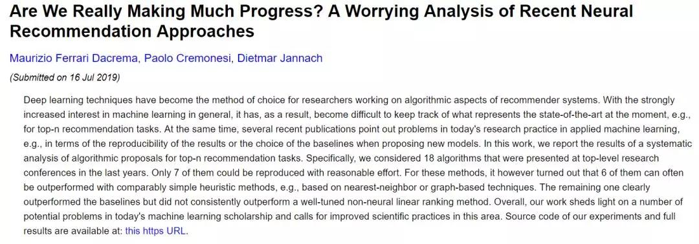

1 引言

在短短几年内，深度学习技术在推荐系统算法研究中占据了主导地位。随着人们对机器学习的兴趣普遍增加，发表论文数量越来越多，以及深度学习在视觉或语言处理等其他领域的成功，人们可以预见，这些工作也会为推荐系统领域带来实质性的进展。然而，在机器学习的其他应用领域中，所取得的进展并不总是如预期的那样好。

在推荐系统领域，即使是最新的推荐方法，在大多数情况下也不能超越经典的方法（例如基于近邻的方法）。这些关于在应用机器学习中取得的真正进展的问题并不是最新提出的，也与基于深度学习的研究无关。早在 2009 年，研究人员通过对 ad-hoc 检索任务的算法分析得出结论：尽管该领域内发表了许多论文，但这些论文中提到的改进并没有“累积”。

这种现象的出现有不同因素，包括（i）基线方法较弱；（ii）用较差的方法作为新的基线；以及（iii）比较或复现其他论文结果具有困难性。第一个问题在于方法对比时基线的选择。有时对于给定的任务和数据集，选择的基线太弱，或基线参数没有得到适当的调整。有时基线是从新提出的算法簇中选择的，例如，一个新的深度学习算法只与深度学习基线进行比较。这种方法强制传播了弱基线。此外，随着论文的不断发表，越来越难跟上最先进基线的发展。

除了基线的问题外，另一个挑战是研究人员使用各种各样的数据集、评估方法、性能度量和数据预处理步骤，因此很难确定哪种方法在不同的应用场景中是最好的。当研究人员不公开源代码和数据时，这个问题尤其突出。虽然现在越来越多的研究人员会公布算法的源代码，但这并不是通用规则，即使顶级会议或顶级期刊也没有这样的要求。而且即使发布了代码，有些代码也是不完整的，并不包括数据预处理、参数调整或评估程序。

最后，另一个问题可能普遍存在于应用机器学习的研究实践。缺少审稿人，或对论文作者的不当激励，会刺激某些特定类型的研究。以及研究领域对抽象精确性度量的过度关注，或者只关心机器学习研究中“顶级期刊能发表的”内容。

这篇论文中，作者的目标是阐明上述问题是否也存在于基于深度学习的推荐算法领域。作者主要关注以下两个问题：

（1）可复现性：该领域的近期研究有多少是可复现的（通过合理方法）？

（2）进展：与相对简单但经过良好调整的基线方法相比，近期研究取得了多少实际性进展？

为了回答这些问题，作者进行了一项系统的研究。作者从 KDD、SIGIR、WWW 和 RecSys 这四大顶会中找到了 18 篇 top-n 推荐任务中基于深度学习的相关论文。

第一步，对于公开源代码和实验数据集的论文，作者尝试复现论文中报告的结果。最后，仅有 7 篇论文可以复现结果。

第二步，作者重新执行了原始论文中报告的实验，但在比较中增加了额外的基线方法。出乎意料的是，研究显示，在绝大多数被调查的方法中（7 个方法中有 6 个方法），所提出的深度学习方法均被经典的基线方法所超越。另一个方法中，即使是非个性化的基线方法（向每个人推荐最受欢迎的项目），在某些评价指标下的表现也是最好的。

该论文的第一个贡献在于评估了该领域论文的可复现程度，论文的第二个贡献在于提出一个与机器学习的当前研究实践相关的更深远的问题。

2 研究方法 2.1 收集可复现论文

作者收集了 2015 年至 2018 年期间出现在以下四个会议中的长论文：KDD、SIGIR、WWW 和 RecSys。如果一篇论文（a）提出了一种基于深度学习的技术，（b）关注 top-n 推荐任务，那么就算作一篇相关论文。经过筛选，作者收集了 18 篇相关论文。

下一步，作者尝试复现这些论文中报告的结果。作者尽可能多地依赖论文原作者自己提供的源代码和实验中使用的数据。理论上说，应该可以只使用论文中的技术描述来复现已发表的结果。但实际上算法和评估程序的实现包含许多微小细节，可能会对实验结果产生影响。因此，作者尝试从原作者那里获得所有相关论文的代码和数据。如果满足以下条件，则认为论文是可复现的：

* 源代码可用，或者只需要少量的修改即可正常运行。

* 原论文中至少有一个数据集可用。另一个要求是，原论文中使用的训练 - 测试划分方法是公开的，或者可以根据文中的信息重构。

否则，则认为论文是不可复现的。根据该标准，可复现的论文列表如表 1 所示：

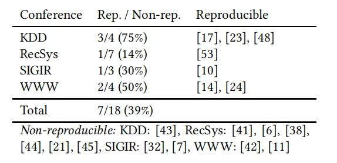

表 1 2015-2018 四大顶会中基于深度学习推荐算法（top-n 推荐任务）的可复现论文。

总的来说，只有大约三分之一的论文可复现。

2.2 评价方法 测量方法

在这项工作中，作者通过分解原始代码来复现论文，以应用与原论文中相同的评估过程。分解的方式是将训练、超参数优化和预测的代码与评估代码分离。并且将评估代码也用于基线方法。

基线

作者在实验中考虑了以下基线方法：

*  **TopPopular：** 一种非个性化的方法，向每个人推荐最流行的项目。

*  **ItemKNN：** 基于 k 近邻（kNN）和 item-item 相似度的传统协同过滤方法。

*  **UserKNN：** 一种基于邻域的协同用户相似性方法。

*  **ItemKNN-CBF：** 一种基于邻域内容过滤（CBF）的方法，通过使用项目内容特征（属性）计算项目相似性。

*  **ItemKNN-CFCBF：** 基于项目相似性的混合 CF+CFB 算法。

*  **P3α：** 一种简单的基于图的算法，实现了用户和项目之间的随机行走。

*  **RP3β：** P3α的另一个版本。

3 DNN 方法与基线对比实验 3.1 协作存储网络（Collaborative Memory Networks，CMN）

CMN 方法在 SIGIR18 会议上提出，将记忆网络和神经注意力机制与隐因素和邻域模型结合。CMN 作者将该方法与不同的矩阵分解和神经推荐方法，以及 ItemKNN 算法进行了比较。采用了三个数据集用于评估：Epinions、CiteULike-a 和 Pinterest。原论文给出了最优参数，但没有提供如何调整基线实验的信息。点击率和 NDCG 是原论文采用的评价指标。原论文报告的结果表明，CMN 在所有的度量标准上都优于其他的基线方法。

CMN 所有数据集上的实验都是可复现的。对于简单基线进行的额外实验，作者针对点击率度量优化了基线参数。在三个数据集上的实验结果如表 2 所示。

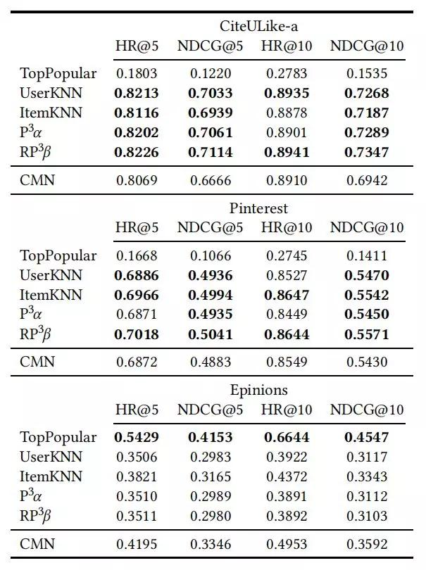

图 2 CMN 方法实验结果

结果表明，在优化基线方法之后，CMN 在任何数据集上都不能取得最好的表现。对于 CiteULike-a 和 Pinterest 数据集，至少有两种个性化基线方法在任何度量上都优于 CMN 方法。基本上所有的个性化基线方法都比 CMN 效果好。对于 Epinions 数据集，出乎意料的是，原始文献中没有提及的 TopPopular 方法在很大程度上优于所有其他算法。在这个数据集上，CMN 确实比基线方法要好。因此，CMN 在这个相对较小且非常稀疏的数据集上的成功，可能与数据集的特殊性或 CMN 的受欢迎度（popularity）偏置有关。分析表明，与其他数据集相比，Epinions 数据集的受欢迎程度的分布确实更加不均匀（基尼指数为 0.69，而 CiteULike 基尼指数为 0.37）。

3.2 基于元路径上下文的推荐方法（Metapath based Context for RECommendation，MCRec）

MCRec 方法发表在 KDD18，是一个基于元路径的模型，它利用辅助信息实现 top-n 推荐任务。原文献作者在三个小数据集（MovieLens100k、LastFm 和 Yelp）上对不同复杂度的各种模型，以及 MCRec 的四个变体进行了基准测试。原文献通过创建 80/20 随机训练测试划分，进行 10 次交叉验证。选择 MF 和 NeuMF 作为基线。但只有 MovieLens 数据集提供了数据划分，原文献没有给出基线超参数调参的具体信息。原文献采用的评价指标为精确度、召回率和 NDCG。但是论文中实现的 NDCG 方法较为奇怪，所以作者采用了标准的 NDCG 评价程序。

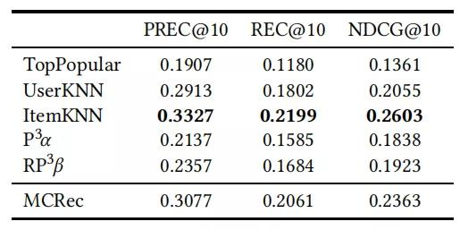

表 3 MCRec 与基线方法对比

表 3 表明，当正确设置传统的 ItemKNN 方法时，该方法在所有性能指标上都优于 MCRec。原始论文除了使用一种不常见的 NDCG 方法外，作者还发现了其他潜在的方法学问题。如前所述，MF 和 NeuMF 基线的超参数没有针对给定数据集进行优化，而是取自原始论文。此外，通过查看提供的源代码，可以看到作者报告的是不同 epoch 中选择的最佳结果，这是不恰当的。

3.3 协同变分自动编码器（Collaborative Variational Autoencoder，CVAE）

CVAE 方法发表在 KDD18，该模型以无监督的方式从内容数据中学习深度隐表示，并从内容和排序中学习项目和用户之间的隐式关系。

该方法在两个比较小的 CitULike 数据集（135K 和 205K 次交互）上进行评估，分别测试了这两个数据集的稀疏版本和密集版本。原文献中的基线实验包括三个最新的深度学习模型以及协同主题回归（CTR）。每个方法的参数都是基于验证集进行调整的。采用不同的列表长度（50 至 300）的召回率作为评价指标。采用随机数据划分，重复 5 次测量。

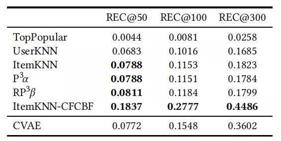

表 4 CAVE 实验结果

原文献作者共享了代码和数据集。通过对基线进行微调，得到了表 4 所示的稠密 CiteULike-a 数据集的结果。对于最短的列表长度 50，即使大多数纯 CF 基线方法在这个数据集上也优于 CVAE 方法。在较长的列表长度下，ItemKNN-CFCBF 方法获得了最佳结果。稀疏 CiteULike-t 数据集上也得到了类似的结果。一般来说，在列表长度为 50 时，ItemKNN-CFCBF 在所有测试配置中始终优于 CVAE。只有在更长的列表长度（100 及以上）时，CVAE 才能在两个数据集上超越基线方法。总的来说，只有在某些配置中，并且很长且相当不常见的推荐截止阈值下 CVAE 才优于基线。然而，这种列表长度的使用是不合理的。

3.4 协同深度学习（Collaborative Deep Learning，CDL）

上述的 CVAE 方法将 KDD15 中经常引用的 CDL 方法作为其基线之一。CDL 是叠置去噪自动编码器（SDAE）和协同滤波联合学习的概率前馈模型。原文献中的评估表明，与 CTR 方法相比，CDL 方法的表现较好，尤其是在稀疏数据情况下。

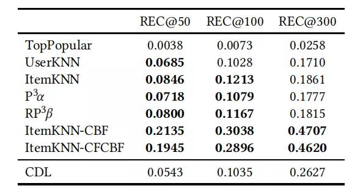

表 5 CDL 实验结果

作者复现了 CDL 的研究结果，得出了表 5 中密集型 CiteULike-a 数据集的结果。不足为奇，在前一节中优于 CVAE 的基线也优于 CDL，而且对于短列表长度而言，纯 CF 方法优于 CDL 方法。然而，当列表长度超过 100 时，CDL 具有更高的召回率。通过对比 CVAE 和 CDL 的结果，作者发现新提出的 CVAE 方法确实优于 CDL 方法，这表明 CAVE 方法的确取得了进展。然而在大多数情况下，这两种方法的表现都不如简单的基线方法。

3.5 神经协同过滤（Neural Collaborative Filtering，NCF）

基于神经网络的协同过滤方法在 WWW17 会议上提出，通过用一种可以从数据中学习任意函数的神经网络结构代替了内积来推广矩阵分解。该方法在两个数据集（MovieLens1M 和 Pinterest）上进行了评估，分别包含 100 万和 150 万次交互。在评价过程中采用了“留一法”。原文献结果表明，当使用点击率和 NDCG 作为评价指标时，NeuMF（NCF 的变体）比现有的矩阵因子分解模型更为有利。

实验结果如表 6 所示。在 Pinterest 数据集上，个性化基线方法在所有评价标准上都比 NeuMF 稍微好一些，或者表现一致。对于 MovieLens 数据集，NeuMF 的结果几乎与最佳基线 RP3β相同。

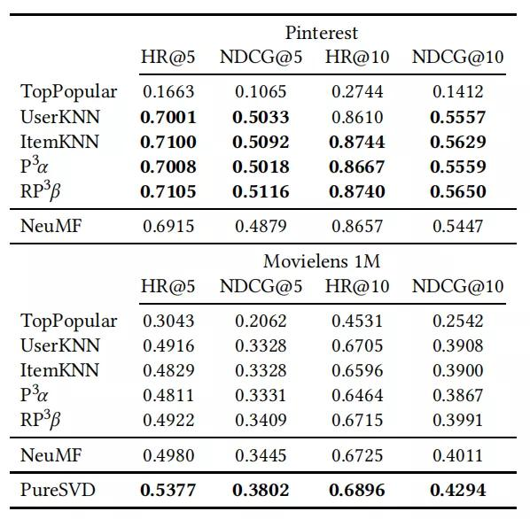

表 6 NCF 实验结果

由于 MovieLens 数据集被广泛用于评估新模型，因此作者使用基本矩阵分解方法（此处称为 pureSVD）进行了额外的实验。优化参数后，作者发现 pureSVD 确实比基线方法好，而且在这个数据集上也明显优于 NeuMF。

3.6 光谱协同过滤（Spectral Collaborative Filtering，SpectralCF）

SpectralCF 发表在 RecSys18 上，采用光谱图理论的概念，旨在专门解决冷启动问题。该方法在三个公共数据集（MovieLens1m、HetRec 和 Amazon Instant Video）上进行评估，并采用了多种基线方法，包括最近的神经网络方法和因子分解和排序技术。实验采用 80/20 训练 - 测试随机划分，并使用不同截止点的召回率和平均精度（MAP）作为评价指标。

对于 MovieLens 数据集，原文献作者共享了使用的训练和测试数据集以及代码。对于其他数据集，数据划分没有公布，因此作者按照文中的描述自己创建了划分方式。

对于 HetRec 和 Amazon Instant Video 数据集，所有的基线方法，包括 TopPopular 方法，在所有度量指标上都优于 SpectralCF。然而，在原文献提供的 MovieLens 数据划分上运行代码时，SpectralCF 比所有的基线都要好很多。

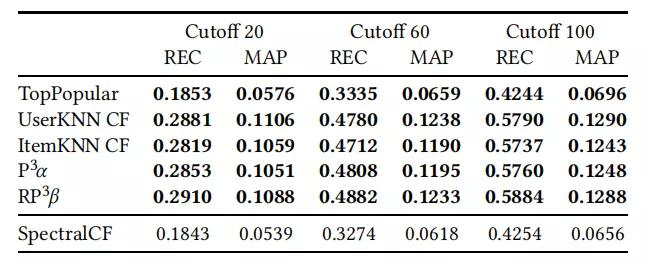

表 7 SpectralCF 实验结果

因此，作者分析了 MovieLens 数据集公布的训练测试划分，发现测试集中项目的受欢迎程度的分布与随机抽样带来的分布非常不同。然后，作者使用自己的数据划分方式对 MovieLens 数据集进行分割，并且优化了数据分割的参数，以确保公平比较。实验结果如表 7 所示。当使用原始论文中描述的数据分割时，MovieLens 数据集的结果与其他两个数据集的实验结果一致，即在所有配置中，SpectralCF 的性能都比基线方法差，甚至 TopPopular 的表现也比它好。

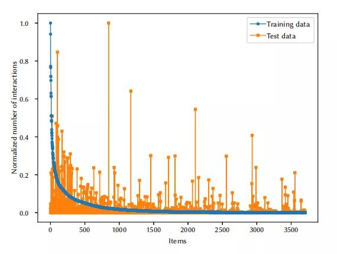

图 1 原作者提供的训练集和测试集数据的受欢迎度分布。对于随机划分，橙色点与蓝色点应该基本相似。

图 1 显示了数据划分问题。蓝色数据点显示训练集中每个项目的归一化受欢迎度值，最流行的项目的值为 1。在随机划分的情况下，橙色点将非常接近相应的蓝色点。然而，这里测试集中许多项目的受欢迎程度值相差很大。无论是训练还是测试，随机划分的数据集的基尼指数都在 0.79 左右，而所提供的测试集的基尼指数要高得多（0.92），这意味着该分布比随机划分具有更高的受欢迎度偏差。

3.7 变分自动编码器协同过滤（Variational Autoencoders for Collaborative Filtering，Mult-VAE）

Mult-VAE 是一种基于变分自动编码器的隐反馈协同过滤方法。这项工作发表在 WWW18 上。原论文在 3 个二值化数据集上评估该方法，这些数据集包含原始电影评分或歌曲播放计数。实验中采用的基线包括 2008 年的矩阵分解法、2011 年的线性模型和最近的神经网络方法。根据论文，所提出的方法的召回率和 NDCG 结果通常比最佳基线高出 3% 左右。

通过使用它们的代码和数据集，作者发现所提出的方法确实比非常简单的基线技术更好。其准确率比最佳基线高 10% 到 20%。Mult-VAE 是作者经过检查后发现的唯一一个更复杂的方法优于基线技术的方法。

为了验证 Mult-VAE 优于复杂的非神经模型，作者将加权矩阵因子分解方法和线性模型 SLIM 的参数针对数据集 MovieLens 和 Netflix 进行了优化。表 8 显示了在 Netflix 数据集上的实验结果。

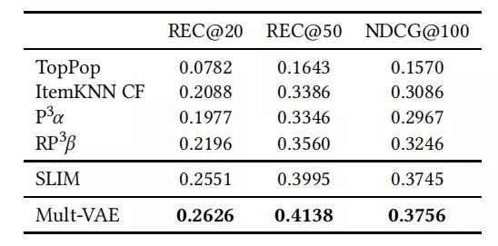

表 8 Mult-VAE 实验结果

在 NDCG 评价指标方面，Mult-VAE 和 SLIM 之间的差异非常小。然而，在召回率方面，与 SLIM 相比，Mult-VAE 的改进似乎是可靠的。作者在不同的截止长度下进行了额外的评估，结果见表 9。表 9 表明，当使用 NDCG 作为优化目标和度量指标时，SLIM 和 Mult-VAE 之间的差异在这个数据集中消失了，SLIM 有时甚至会稍好一些。对于 MovieLens 数据集，也可以观察到类似的现象。因此，在这种特殊情况下，通过神经网络方法获得的进展只是部分的，并且取决于所选择的评价指标。

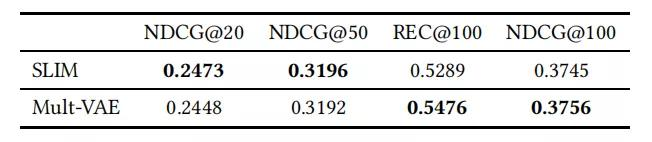

表 9 Mult-VAE 使用额外截至长度，在 Netflix 数据集上的实验结果

4 讨论 4.1 可复现性和可扩展性

按理说，在应用机器学习领域建立可复现性要比在其他科学和计算机科学的其他子领域容易得多。当研究人员提供他们的代码和使用的数据时，每个人都应该能够或多或少地复现出相同的结果。而且如今的研究人员通常使用公共软件或学术机构提供的软件，因此其他研究人员应该更容易在非常相似的条件下重复实验。

然而，这篇论文表明，算法可复现性的程度实际上并不高。与过去相比，已经有更多的人开始共享核心算法的代码，这可能也是因为可复现性已成为会议论文的评价标准。但是大部分情况下，用于超参数优化、评价、数据预处理和基线的代码是不公开的。这使得其他人很难确认论文报告的结果。

而许多方法的计算复杂性也为复现实验带来了挑战。到 2019 年，已经是 Netflix 发布 1 亿条评分数据集的 10 年之后，研究人员常用的依然是仅包含几十万条评分的数据集。即使对于小数据集，采用 GPU 计算，超参数优化也需要几天甚至几周时间。当然，本文中讨论的基于近邻的方法也存在可扩展性问题。然而，通过适当的数据预处理和数据采样机制，在学术和工业环境中也可以确保这些方法的可扩展性。

4.2 进展评价

最近提出的几种神经网络方法尽管计算复杂，但是其性能却不如在概念上或计算上更简单的方法。因此，至少对于本文所讨论的方法来说，该领域基于深度学习方法的真实进展情况尚不明确。

正如论文所分析的，这种“伪进展”的一个主要原因是基线方法的选择和缺乏对基线方法参数的适当优化。在大多数被研究的方法中，原始论文没有给出足够的基线优化的信息。在有些论文中还发现了数据划分和某些评价标准的实现上存在错误。

另一个有趣的发现是，最近的一些论文使用神经协同过滤方法（NCF）作为其最先进的基线之一。然而，根据作者的分析，这种方法在部分数据集上的表现还不如简单的基线方法。

另一个阻碍评估该领域进展的原因在于研究人员使用的各种数据集、评估协议、度量标准和基线实验。例如，从数据集角度，作者发现了 20 多个公开数据集，以及多个 MovieLens 和 Yelp 数据集的变体，大部分数据集只在一两篇论文中使用。并且研究人员使用了各种度量（精度、召回率、平均精度、NDCG、MRR 等）以及各种评估程序（例如，随机保持 80/20、留一法、每个正项 100 条负项、或 50 项负项）。然而，在大多数情况下，这些选择是不合理的。实际上，度量的选择应该取决于应用的环境。例如，在某些应用中，推荐项目的前几项至少需要有一个相关项，这时应该使用基于排序的度量，如 MRR。在其他领域，当目标是向用户显示尽可能多的相关项时，高召回率可能更为重要。除了度量标准的选择不明确之外，这些论文通常也没有解释度量的截止长度，从 top-3、top-5，甚至到几百个元素。

然而，这些现象与基于深度学习的推荐方法无关，在神经网络时代之前也存在这种现象。但是机器学习研究人员对精确度量和寻找“最佳”模型的强烈关注推动了这种发展。在目前的研究实践中，通常认为如果一种新的方法可以在一至两个标准度量上，在一至两个公共数据集上优于现有的一组算法，就已经足够了。然而，使用哪种评估度量和哪些数据集却是任意选择的。

这些现象指出了根本问题，即该领域的研究不受任何假设的指导，也不以解决给定问题为目标。追求更高的准确度成为了该领域研究的主导方向，但是大家甚至还不清楚准确度的轻微提升是否能够为推荐系统的消费者或提供者带来一定的价值。事实上，许多研究工作表明，更高的准确度并不一定能转化为更好的推荐结果。

5 总结

在这项工作中，作者对各大顶会的最新基于神经网络的推荐算法进行了系统分析。分析表明，已发表论文的可复现程度仍然不高。此外，实验证明，这些基于深度学习的方法均被经典的启发式算法所超越。作者认为，基于神经网络的推荐算法为该领域所带来的实际进展并不明确，作者希望该领域的算法贡献评估能出现更严格和更好的研究实践。

知乎上关于这篇论文也有一些讨论：

如何看待 RecSys2019 上的一篇文章认为现有 DNN-based 推荐算法带来的基本上都是伪提升？

地址：https://www.zhihu.com/question/336304380/answer/759069150

查看论文原文：

https://arxiv.org/abs/1907.06902

**你也「在看」吗？** 👇
